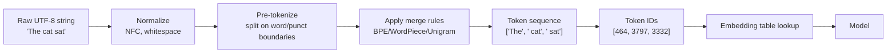

# 1 - Tokens and Tokenization

[toc]

> **TL;DR:** A *token* is the atomic unit a language model actually sees — not a character, not a word, but a sub-word chunk produced by a learned tokenizer. *Tokenization* is the lossy compression step that maps raw text into a finite vocabulary of integer IDs the model can embed. Every cost, latency, and context-window limit in a modern LLM is denominated in tokens, so understanding this layer is the foundation of every other topic in AI engineering.

## Vocabulary

**Token**

```math
t \in \mathcal{V}, \quad |\mathcal{V}| \approx 32\text{k}\text{–}200\text{k}
```

A single discrete unit in the model's vocabulary. May be a whole word, a sub-word piece, a single byte, punctuation, or a special control symbol like `<|endoftext|>`.

---

**Vocabulary**

```math
\mathcal{V} = \{ t_1, t_2, \ldots, t_{|\mathcal{V}|} \}
```

The fixed, finite set of tokens the model can produce or consume. Chosen once at training time and frozen — adding a new token after training requires retraining the embedding table.

---

**Token ID**

```math
\text{id}: \mathcal{V} \to \{0, 1, \ldots, |\mathcal{V}|-1\}
```

The integer index assigned to each token. The model never sees text; it sees a sequence of IDs that are then looked up in the embedding table.

---

**Tokenizer**

```math
\text{tok}: \Sigma^* \to \mathcal{V}^*
```

The deterministic function that maps a raw UTF-8 string to a sequence of token IDs. Inverse `detok` reconstructs (most of) the text from IDs.

---

**Subword tokenization**

A family of algorithms — BPE, WordPiece, Unigram, SentencePiece — that learn a vocabulary smaller than the set of all words but larger than the set of characters, so common words become one token and rare words decompose into pieces.

---

**Byte-Pair Encoding (BPE)**

The most common subword algorithm. Starts from individual bytes (or characters) and greedily merges the most frequent adjacent pair until the vocabulary reaches a target size.

---

**Context window**

```math
T_{\max} = \text{maximum sequence length in tokens}
```

The number of tokens a model can attend to at once. 4k, 8k, 128k, 1M — all token counts, never character counts.

## Intuition

Imagine you're designing a language for a model to read. Two extremes fail. A character-level vocabulary (256 bytes) is universal but forces the model to learn that `t-h-e` always means `the` — wasted capacity on spelling. A whole-word vocabulary (millions of entries) is compact but blows up on names, typos, code, URLs, and any new word coined after training. The compromise is subword tokenization: keep `the`, `running`, `internet` as single tokens because they're frequent, but decompose `antidisestablishmentarianism` into `anti` + `disestablish` + `ment` + `arian` + `ism`. Frequent stays cheap, rare stays representable.

The tokenizer is *not* the model. It's a separate, deterministic, learned-but-frozen function that sits between the raw bytes and the embedding table. When you call an OpenAI API, your prompt is tokenized client-side or at the API gateway; the model only ever processes integer IDs. This separation matters: switching tokenizers requires retraining the model, but switching models with the same tokenizer family is cheap.

A common surprise: tokens are *not* words. The string `" hello"` (with a leading space) is usually a different token from `"hello"` (without). `GPT` may be one token but `gpt` two. Numbers like `1234` may split into `12` + `34`. Code, math, and non-English text often use *many more tokens per character* than English prose, which is why a 1,000-word English document and a 1,000-word Chinese document can have wildly different token counts.

## How tokenization works

Modern LLMs ship a learned tokenizer trained on roughly the same corpus as the model. The training run produces three artifacts: a vocabulary list, a set of merge rules (for BPE), and a normalization scheme (whitespace, casing, byte-fallback). At inference time, the tokenizer applies these in order to turn a string into IDs.



### Byte-Pair Encoding (BPE), the workhorse

BPE is the algorithm behind GPT-2/3/4, Llama, and most open models. Training is greedy: start with the byte (or character) alphabet, count every adjacent pair in a large corpus, merge the most frequent pair into a new token, repeat until you've collected `V` merges.

```python
from collections import Counter

def train_bpe(corpus: list[str], target_vocab: int) -> list[tuple[str, str]]:
    """Toy BPE trainer. Returns ordered list of merge rules."""
    # 1. Initialize each word as a sequence of single chars + end-of-word marker
    words: dict[tuple[str, ...], int] = Counter()
    for word in corpus:
        symbols = tuple(word) + ("</w>",)
        words[symbols] += 1

    merges: list[tuple[str, str]] = []
    base_vocab = {ch for word in words for ch in word}
    while len(base_vocab) + len(merges) < target_vocab:
        # 2. Count all adjacent pairs across the corpus
        pair_counts: Counter[tuple[str, str]] = Counter()
        for symbols, freq in words.items():
            for a, b in zip(symbols, symbols[1:]):
                pair_counts[(a, b)] += freq
        if not pair_counts:
            break
        # 3. Merge the most frequent pair
        best = pair_counts.most_common(1)[0][0]
        merges.append(best)
        # 4. Rewrite the corpus with the new merged symbol
        new_words: dict[tuple[str, ...], int] = {}
        for symbols, freq in words.items():
            merged: list[str] = []
            i = 0
            while i < len(symbols):
                if i + 1 < len(symbols) and (symbols[i], symbols[i + 1]) == best:
                    merged.append(symbols[i] + symbols[i + 1])
                    i += 2
                else:
                    merged.append(symbols[i])
                    i += 1
            new_words[tuple(merged)] = freq
        words = new_words
    return merges
```

At *inference* time the tokenizer applies these merges greedily in the order they were learned. Production tokenizers (e.g. `tiktoken`, `sentencepiece`, Hugging Face `tokenizers`) use byte-level BPE with UTF-8 byte fallback — that guarantees any input string can be tokenized, even emoji, control characters, or never-before-seen Unicode.

### WordPiece and Unigram, the other two

WordPiece (BERT) is BPE with a likelihood-based merge criterion: pick the pair whose merge most increases corpus likelihood, not the most frequent pair. Unigram (SentencePiece default) goes the other direction — start with a large vocabulary and *prune* tokens to maximize likelihood under a unigram language model. All three families produce broadly similar token distributions; the choice rarely matters for downstream model quality but matters a lot for tokenizer speed and for special-character handling.

## Math — measuring tokenization

Two numbers characterize a tokenizer on a given corpus.

```math
\text{compression ratio} = \frac{\text{bytes of UTF-8 input}}{\text{number of tokens}}
```

For English with the GPT-4 tokenizer this is roughly **4 bytes/token** (≈ 0.75 words/token). For Chinese it's closer to 1.5 bytes/token, for source code 3.5 bytes/token, for base64 1.0 byte/token (worst case).

```math
\text{fertility} = \frac{\text{number of tokens}}{\text{number of words}}
```

Fertility above 1 means the tokenizer is splitting words. For English a fertility of ~1.3 is typical; for low-resource languages with a tokenizer trained on English it can be 3–5×, which is one reason multilingual capability is uneven across languages.

> [!IMPORTANT]
> Token counts are not portable across models. `gpt-4o`, `claude-sonnet`, and `llama-3` use *different* tokenizers, so the same prompt costs different numbers of tokens on each. When you compare prices across vendors, you must compare *cost per byte* of your actual workload, not cost per "token" as if tokens were a standard unit.

## Real-world example

Let's tokenize one English sentence with the GPT-4 tokenizer (`tiktoken`'s `cl100k_base` family) and watch every step.

```python
import tiktoken

enc = tiktoken.get_encoding("cl100k_base")
text = "AI engineering pays attention to tokens, not words."

ids = enc.encode(text)
pieces = [enc.decode([i]) for i in ids]

for i, (tid, piece) in enumerate(zip(ids, pieces)):
    print(f"  pos={i:>2}  id={tid:>6}  piece={piece!r}")

print(f"\n{len(text)} chars -> {len(ids)} tokens "
      f"(compression {len(text)/len(ids):.2f} bytes/token)")
```

Output (abridged, exact IDs vary by `tiktoken` version):

```
  pos= 0  id= 15836  piece='AI'
  pos= 1  id=  15009  piece=' engineering'
  pos= 2  id=  21935  piece=' pays'
  pos= 3  id=   6666  piece=' attention'
  pos= 4  id=    311  piece=' to'
  pos= 5  id=  11460  piece=' tokens'
  pos= 6  id=     11  piece=','
  pos= 7  id=    539  piece=' not'
  pos= 8  id=   4339  piece=' words'
  pos= 9  id=     13  piece='.'

51 chars -> 10 tokens (compression 5.10 bytes/token)
```

Notice three things. (1) Leading spaces are *part of* the token — `' engineering'` is one token; `'engineering'` would be a different ID. (2) Punctuation is its own token. (3) `AI` is one token because it's frequent enough in the training data; a rarer string like `"Catopolomous"` would split into multiple pieces.

## In practice

Token counting drives almost every cost and capacity decision in an LLM application. Pricing is per million input + output tokens. Latency is roughly linear in input tokens (prefill) plus linear in output tokens (decode), with the decode step typically much slower per token because it's auto-regressive and memory-bound. Context windows are token counts, not character counts. Budget your prompts in tokens, not characters.

> [!TIP]
> Before deploying a long-context system, run your real prompts through the actual production tokenizer (`tiktoken.encoding_for_model("gpt-4o")`, `anthropic.Client().count_tokens(...)`, etc.). The 32k-token document you computed from a `len(text) / 4` estimate may actually be 48k — and now you blow past the model's context window in production.

> [!CAUTION]
> Tokenization is the most common source of "the model can't count letters" bugs. If you ask `gpt-4o` how many `r`s are in `strawberry`, it often says two — because `strawberry` is tokenized as `straw` + `berry`, and the model never sees individual letters. Character-level tasks (counting, reversing, anagrams, ROT-13) are tokenizer-handicapped and need either chain-of-thought prompting or a tool call to a Python interpreter.

> [!WARNING]
> Languages with no whitespace (Chinese, Japanese, Thai) and morphologically rich languages (Finnish, Turkish, Arabic) have far higher fertility on English-trained tokenizers. The same paragraph that costs $0.001 in English may cost $0.005 in Hindi. This is not a "model is worse" issue — it's a tokenizer fairness issue, often called the **tokenization tax**.

Special tokens — `<|im_start|>`, `<|endoftext|>`, `<|tool_call|>`, etc. — are reserved IDs that don't correspond to any normal text. They mark turn boundaries, system vs user roles, tool calls, and end-of-stream. Modern chat APIs handle these for you, but if you fine-tune a model you must understand its special-token schema or you'll produce garbage outputs.

## Pitfalls

- **"Tokens are words."** They aren't. They're sub-word fragments. `running` may be one token, `runs` may be one token, `ran` may split. Never assume `n_tokens ≈ n_words`.
- **"My prompt is short, it'll fit."** Not without checking. Base64 blobs, JSON with deeply nested structures, code with unusual whitespace, or non-English text can balloon by 2–5×.
- **"I'll just switch tokenizers."** You can't, mid-model. Tokenizer and embedding table are jointly trained; swapping the tokenizer invalidates every learned embedding. Switching tokenizer families requires retraining (or at minimum re-training the embedding layer).
- **"Adding a `[NEWTOKEN]` is free."** It's not. New tokens get randomly initialized embeddings; the model has not learned what they mean. Without fine-tuning, the model will produce nonsense whenever the new token appears.
- **"I can reconstruct the original text exactly from token IDs."** Often, but not always. Some normalization (NFC, casing) is destructive. Round-tripping non-canonical Unicode (combining characters, exotic whitespace) can change bytes.

## Exercises

### Exercise 1 — Compression ratio across content types

You're estimating the monthly cost of running a chatbot for an international support team. The traffic mix is 40% English prose, 30% JSON API responses, 20% Japanese chat, 10% Python source code. Assume the following per-tokenizer compression ratios (bytes/token):

| Content | Bytes/token (GPT-4 tokenizer) |
| :--- | ---: |
| English prose | 4.0 |
| JSON | 3.0 |
| Japanese | 1.5 |
| Python code | 3.5 |

Your team sends 200 MB of mixed traffic per day. (a) How many tokens per day total? (b) Which content type dominates the bill?

#### Solution

Compute bytes per content type, divide by bytes/token, sum.

```math
\text{tokens} = \sum_c \frac{\text{bytes}_c}{\text{bytes/token}_c}
```

- English: 0.40 × 200 MB = 80 MB = 8×10⁷ bytes → 8×10⁷ / 4.0 = **2.0×10⁷ tokens**
- JSON: 0.30 × 200 MB = 60 MB → 60×10⁶ / 3.0 = **2.0×10⁷ tokens**
- Japanese: 0.20 × 200 MB = 40 MB → 40×10⁶ / 1.5 ≈ **2.67×10⁷ tokens**
- Code: 0.10 × 200 MB = 20 MB → 20×10⁶ / 3.5 ≈ **5.7×10⁶ tokens**

**Total ≈ 7.27×10⁷ tokens/day ≈ 72.7 M tokens/day.** Japanese, despite being only 20% of bytes, contributes 37% of tokens — more than English. This is the tokenization tax in action.

---

### Exercise 2 — Train a 50-merge BPE by hand

Given the corpus `["low", "low", "lowest", "newer", "newer", "wider"]`, perform the first three BPE merges. Show the vocabulary and the corpus state after each merge.

#### Solution

Start with each word as a sequence of characters plus `</w>`:

| Word | Initial symbols | Freq |
| :--- | :--- | ---: |
| low | l o w `</w>` | 2 |
| lowest | l o w e s t `</w>` | 1 |
| newer | n e w e r `</w>` | 2 |
| wider | w i d e r `</w>` | 1 |

**Pair counts:** `(l,o)`=3, `(o,w)`=3, `(w,</w>)`=2, `(w,e)`=3, `(e,r)`=3, `(e,r,</w>)`-not-pair, others lower.

**Merge 1:** Multiple pairs tie at 3 — break the tie by lexicographic order on the symbols. Pick `(e, r)`. New token `er`. Corpus:

| Word | Symbols |
| :--- | :--- |
| newer | n e w `er` `</w>` |
| wider | w i d `er` `</w>` |

**Merge 2:** Recount. `(l,o)`=3, `(o,w)`=3, `(w,e)`=2 (from newer × 2), `(er,</w>)`=3, `(w,</w>)`=2. Pick `(l, o)`. New token `lo`. Corpus updates `low → lo w </w>`, `lowest → lo w e s t </w>`.

**Merge 3:** Recount. `(lo,w)`=3, `(w,e)`=2 (from newer twice), `(er,</w>)`=3, `(o,w)` no longer present. Pick `(lo, w)`. New token `low`.

After three merges the vocabulary now contains `er`, `lo`, `low` in addition to the original character set. The word `low</w>` tokenizes as a single token `low`+`</w>`; `lowest</w>` tokenizes as `low` + `e` + `s` + `t` + `</w>`. Compression is already paying off after three merges.

---

### Exercise 3 — Why does `strawberry` have two `r`s but the model says three (or one)?

Explain in two paragraphs why character-counting questions fail under subword tokenization, and propose two engineering fixes that don't require retraining the model.

#### Solution

The tokenizer never exposes individual characters to the model. `strawberry` typically tokenizes as two tokens — say `straw` (id 88301) and `berry` (id 15717). The model sees `[88301, 15717]`, embeds each as a 4096-dimensional vector, and at no layer does it ever materialize a representation of the letter `r` as a discrete entity. To answer "how many `r`s?" it would have to memorize the spelling of every token in the vocabulary, which it partially does for common words but never reliably. So the model confabulates a count from training-time statistics rather than from actual character-level reasoning.

Two engineering fixes. (1) **Tool use**: route the question through a Python interpreter — `len([c for c in "strawberry" if c == "r"])`. The model only needs to recognize the question and emit the right tool call; arithmetic is deterministic. (2) **Chain-of-thought with explicit spelling**: prompt the model to first write out the word letter by letter, e.g. `s-t-r-a-w-b-e-r-r-y`, then count. The "spell-out" step forces a representation that decomposes the token into surface form, after which counting succeeds. Both are widely used in production agents that handle character-level tasks.

---

### Exercise 4 — Tokenizer fairness in a multilingual product

Your translation product charges users per request. A French user and a Vietnamese user both send the same 500-word document for translation; on the GPT-4 tokenizer, the French document tokenizes to 700 tokens and the Vietnamese document tokenizes to 1,400 tokens. What is the fairness problem, and what are three approaches to address it?

#### Solution

**The problem.** The Vietnamese user pays 2× the API cost for the same semantic content. The cause is tokenizer fertility: the tokenizer was trained mostly on English (and to a lesser extent French, Spanish, German), so Vietnamese — with its rich diacritic system — fragments into many sub-word pieces. This is "tokenization tax" and it manifests as both higher cost *and* higher latency *and* effectively smaller context window for non-English users.

**Three approaches.** (1) **Tokenizer-aware pricing**: bill in *characters* or *words* of input, not tokens, absorbing the variance on the provider side. Simple, user-friendly, but eats margin on languages with worst fertility. (2) **Multilingual tokenizer**: train (or buy) a model whose tokenizer was learned from a balanced multilingual corpus — e.g. mBART, XLM-R, NLLB, or BLOOM's tokenizer, which give roughly equal compression across many languages. (3) **Pre-translate**: detect the source language and translate to English for the LLM call, then translate back. Adds latency and a translation-quality dependency but uses the cheap tokenization regime; useful as a fallback for low-fertility languages.

## Sources

- Sennrich, R., Haddow, B., & Birch, A. (2016). *Neural Machine Translation of Rare Words with Subword Units* (BPE). https://arxiv.org/abs/1508.07909
- Kudo, T. (2018). *Subword Regularization: Improving NMT Models with Multiple Subword Candidates* (Unigram LM). https://arxiv.org/abs/1804.10959
- Kudo, T. & Richardson, J. (2018). *SentencePiece: A simple and language independent subword tokenizer*. https://arxiv.org/abs/1808.06226
- OpenAI. *tiktoken* — the BPE tokenizer for GPT-3.5/4/4o. https://github.com/openai/tiktoken
- Hugging Face Tokenizers documentation. https://huggingface.co/docs/tokenizers
- Petrov, A. et al. (2023). *Language Model Tokenizers Introduce Unfairness Between Languages*. https://arxiv.org/abs/2305.15425
- Huyen, C. (2024). *AI Engineering*, Chapter 1.

## Related

- [2 - Language Models](./2-language-models.md)
- [3 - Generative AI Fundamentals](./3-generative-ai-fundamentals.md)
- [4 - Multimodal Models and Embeddings](./4-multimodal-and-embeddings.md)
- [Sampling and Decoding](../2-foundation-models/4-sampling-and-decoding.md)
- [Entropy, Cross-Entropy, and Perplexity](../3-evaluation/2-entropy-cross-entropy-perplexity.md)
