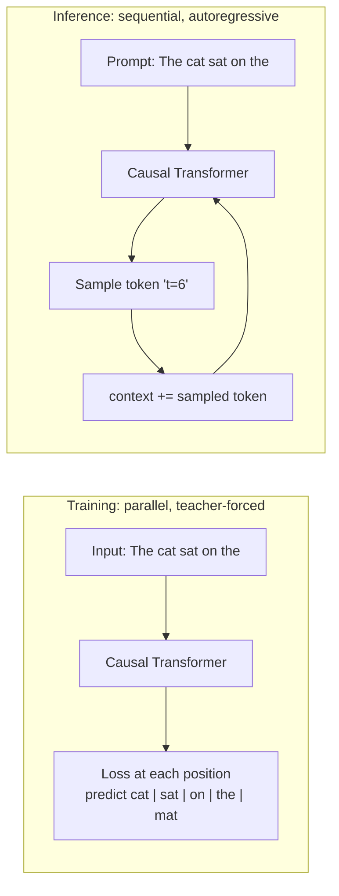
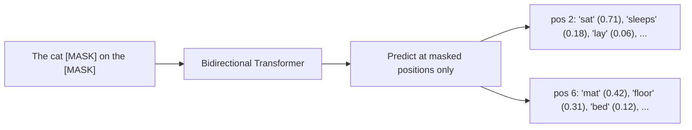
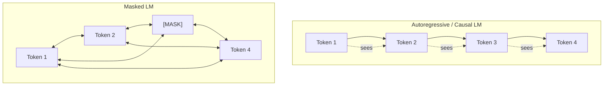

# 2 - Language Models: Autoregressive vs Masked

[toc]

> **TL;DR:** A *language model* is a probability distribution over sequences of tokens. The two dominant training objectives produce two very different models: **autoregressive** LMs (GPT, Llama, Claude) predict the *next* token from past tokens and are the engine behind generation; **masked** LMs (BERT, RoBERTa) predict *hidden* tokens from surrounding context and are the engine behind classification, retrieval, and embeddings. Knowing which objective a model was trained on tells you immediately what it can and cannot do.

## Vocabulary

**Language Model (LM)**

```math
P_\theta(x_1, x_2, \ldots, x_n)
```

A parameterized probability distribution over token sequences. `θ` is the set of model parameters (weights). Given any sequence, the LM assigns it a likelihood.

---

**Autoregressive (causal) language model**

```math
P_\theta(x_1, \ldots, x_n) = \prod_{t=1}^{n} P_\theta(x_t \mid x_1, \ldots, x_{t-1})
```

A model that factorizes the joint distribution left-to-right and predicts each token from the *prefix* only. The attention pattern is *causal* — token `t` cannot see tokens after it.

---

**Masked Language Model (MLM)**

```math
\mathcal{L}_{\text{MLM}} = -\mathbb{E}\big[\log P_\theta(x_m \mid x_{\setminus m})\big]
```

A model trained to predict a randomly hidden subset `m` of tokens from the surrounding bidirectional context `x_{\setminus m}` (everything *except* the masked positions). Bidirectional attention.

---

**Bidirectional attention**

An attention mask where every token sees every other token in both directions. Required for MLM; impossible for left-to-right generation without leaking the answer.

---

**Logits**

```math
z = h W_E^\top \in \mathbb{R}^{|\mathcal{V}|}
```

The raw, pre-softmax scores the model emits for every token in the vocabulary at every position. Softmax(`z`) gives the next-token distribution.

---

**Cross-entropy loss**

```math
\mathcal{L} = -\sum_t \log P_\theta(x_t \mid \text{context})
```

The negative log-likelihood of the correct token. The single loss function used to train almost every LM you'll touch in practice.

---

**Pre-training**

The first, expensive phase where the model learns general language statistics on a huge unlabeled corpus by predicting tokens (autoregressive) or masked tokens (MLM). Cost is dominated by this stage.

## Intuition

A language model is, at heart, an extraordinarily expensive autocomplete. You hand it a prefix; it returns a probability distribution over what comes next. That single capability is enough to build chat, translation, summarization, code completion, agents, embeddings — by rephrasing the task as "predict the next token in a clever prompt."

The two big objectives carve language modeling into two camps. **Causal / autoregressive** models read text the way you read this sentence: one token at a time, left to right, never peeking ahead. That mirrors how a human writes, so it naturally produces a *generator*: at inference time you sample one token, append it to the context, sample again, repeat. **Masked** models read text the way you read a Mad Libs puzzle: you can see everything around the gap, and you fill in what fits. That isn't a generator — masked models can't write coherent long text — but it's a much richer *representation* learner, because every position has access to both halves of the sentence.

In 2026 the autoregressive camp won the spotlight, but masked models did not disappear. They are the workhorses of the embedding stack (sentence-transformers, retrieval, RAG, semantic search) and of classification tasks where you don't need to generate. Practical AI engineering uses both — autoregressive for generation, masked for retrieval and ranking.

## How autoregressive LMs work

An autoregressive LM is trained by *teacher forcing*: feed it the true prefix and ask it to predict each next token in parallel. At inference, you can't do that because there is no future to feed; instead you sample tokens one at a time and append.



The causal attention mask is the trick that makes parallel training possible. In a 1,024-token sequence, all 1,024 next-token predictions are made *in one forward pass* — but the mask forbids position `t` from attending to positions `> t`. So even though every position computes simultaneously, each only sees its own legal past.

```python
import torch
import torch.nn.functional as F

def causal_mask(T: int, device: torch.device) -> torch.Tensor:
    """Upper-triangular mask that prevents position t from seeing positions > t."""
    return torch.triu(torch.full((T, T), float("-inf"), device=device), diagonal=1)

def autoregressive_loss(logits: torch.Tensor, targets: torch.Tensor) -> torch.Tensor:
    """
    logits:  [batch, T, vocab]    model output BEFORE softmax
    targets: [batch, T]           the true token at each position (input shifted by 1)
    Returns the mean cross-entropy across all (batch, position) pairs.
    """
    B, T, V = logits.shape
    return F.cross_entropy(
        logits.view(B * T, V),
        targets.view(B * T),
        ignore_index=-100,
    )

# Example: 4 sequences of length 8, vocab of 50_000
B, T, V = 4, 8, 50_000
logits = torch.randn(B, T, V)
targets = torch.randint(0, V, (B, T))
loss = autoregressive_loss(logits, targets)
print(f"loss = {loss.item():.3f}  (random ≈ ln(V) = {torch.tensor(V).log().item():.3f})")
```

At inference time, generation is a loop: forward pass, sample, append, repeat. Each step's cost grows because the KV cache (the cached key/value tensors from prior tokens) lengthens — covered later in [Sampling and Decoding](../2-foundation-models/4-sampling-and-decoding.md).

## How masked LMs work

A masked LM corrupts the input — typically 15% of tokens replaced with a special `[MASK]` token — and asks the model to recover the originals using *both sides* of context.



Because there's no left-to-right constraint, the encoder uses full bidirectional self-attention. The model can in principle use the word "mat" to better disambiguate "sat" — something a causal model cannot do during training.

```python
from transformers import AutoTokenizer, AutoModelForMaskedLM
import torch

tok = AutoTokenizer.from_pretrained("bert-base-uncased")
mdl = AutoModelForMaskedLM.from_pretrained("bert-base-uncased").eval()

text = f"The cat {tok.mask_token} on the mat."
inputs = tok(text, return_tensors="pt")
mask_pos = (inputs.input_ids == tok.mask_token_id).nonzero(as_tuple=True)[1]

with torch.no_grad():
    logits = mdl(**inputs).logits

probs = logits[0, mask_pos].softmax(dim=-1)
top5 = probs.topk(5)
for prob, idx in zip(top5.values[0], top5.indices[0]):
    print(f"  {tok.decode([idx]):>10s}  p={prob.item():.3f}")
# Typical output: sat 0.71, sleeps 0.05, lay 0.04, ...
```

This is exactly the algorithm behind a "fill-in-the-blank" UI, but the much more important downstream use is *not* to predict masks — it's to use the model's internal hidden states as **embeddings**: dense vector representations of words, sentences, or documents that capture meaning. Retrieval, semantic search, clustering, and classification all build on top of MLM-style models, even though they never call the masked prediction head at inference.

## Causal vs masked, side by side



The arrows are everything. Causal: information flows only forward, so the model is a generator. Masked: information flows in both directions, so the model is a representation learner. Trying to use one for the other's job goes badly. BERT cannot write a coherent paragraph; GPT cannot beat a fine-tuned BERT at text classification with limited data (though for very large GPT this gap has narrowed).

| Property | Autoregressive | Masked |
| :--- | :--- | :--- |
| Attention | Causal (forward-only) | Bidirectional |
| Training objective | Predict next token | Predict masked tokens |
| Compute per token at training | 1 prediction per position | ~0.15 predictions per position (only masked) |
| Inference mode | Sequential (one token at a time) | Single forward pass |
| Natural task | Generation, completion, chat | Classification, embeddings, retrieval |
| Canonical models | GPT-4, Claude, Llama, Gemini | BERT, RoBERTa, DeBERTa, ModernBERT |
| Sample efficiency | Lower (1× signal per token) | Higher (denser supervision) on small data |
| Long-text generation | Native | Not supported |

> [!IMPORTANT]
> A causal LM can be turned into an embedder by mean-pooling its hidden states, but it will typically be worse at retrieval than a purpose-built MLM-based encoder of the same size. The geometry of the embedding space depends on the training objective. If your downstream task is retrieval, prefer a model trained for retrieval ([sentence-transformers](https://www.sbert.net), `bge-*`, `gte-*`) — most are built on top of MLM encoders.

> [!TIP]
> "Decoder-only" (causal) won the scaling race because it generalizes to *every* task via prompting. You don't need a special classification head — you ask in natural language and read the answer. BERT-style models need a head per task, more engineering, but on small-data classification with a fixed taxonomy they often still beat zero-shot LLMs at a fraction of the cost.

## Math — what loss actually computes

For an autoregressive model on a sequence `x_1, …, x_T`, training minimizes the average negative log-likelihood:

```math
\mathcal{L}_{\text{AR}}(\theta) = -\frac{1}{T} \sum_{t=1}^{T} \log P_\theta(x_t \mid x_{<t})
```

A useful sanity check: if the vocabulary has size `V` and the model is uniform random, the expected loss is `log V`. For `V = 50,000`, that's about `10.82` nats. A well-trained large LM on English text reaches roughly `1.8–2.5` nats per token — about a 5× compression over random. This connects directly to **perplexity** (see [3-evaluation/2-entropy-cross-entropy-perplexity](../3-evaluation/2-entropy-cross-entropy-perplexity.md)):

```math
\text{perplexity} = \exp(\mathcal{L}_{\text{AR}})
```

For MLM, the loss is the same form but evaluated only at the masked positions:

```math
\mathcal{L}_{\text{MLM}}(\theta) = -\frac{1}{|m|} \sum_{i \in m} \log P_\theta(x_i \mid x_{\setminus m})
```

About 15% of positions are masked, so per forward pass the MLM receives ~15% of the supervision signal of an AR model on the same tokens. This is one reason AR models scale better in raw FLOPs — every token contributes a gradient.

## Real-world example — generation vs classification with the same backbone

A complete contrast: ask both a causal and a masked model to do *the same task* (sentiment), and watch how the engineering differs.

```python
# Causal LM: prompt + generate, parse answer
from openai import OpenAI

client = OpenAI()
def sentiment_causal(text: str) -> str:
    """Use a generative LM via prompting."""
    resp = client.chat.completions.create(
        model="gpt-4o-mini",
        messages=[
            {"role": "system",
             "content": "Reply with exactly one word: positive, negative, or neutral."},
            {"role": "user", "content": text},
        ],
        max_completion_tokens=4,
        temperature=0,
    )
    return resp.choices[0].message.content.strip().lower()

# Masked LM: head-on-encoder, deterministic, free at scale
from transformers import pipeline

clf = pipeline("sentiment-analysis", model="cardiffnlp/twitter-roberta-base-sentiment-latest")
def sentiment_masked(text: str) -> str:
    return clf(text)[0]["label"].lower()

text = "I cannot believe how good this espresso is."
print("causal:", sentiment_causal(text))   # 'positive'
print("masked:", sentiment_masked(text))    # 'positive'
```

Both work. The causal version costs a few cents per thousand calls, has variable latency, and depends on the provider. The masked version runs on your own GPU at thousands of requests per second, costs only electricity, and is deterministic — but it required training (or downloading) a task-specific model.

## In practice

Almost every modern frontier LM you'll talk to (GPT-4o, Claude, Gemini, Llama 3) is autoregressive and decoder-only. Almost every modern *embedding* model you'll use (text-embedding-3, `voyage-3`, `bge-large`, `e5-large`) is encoder-only and was either trained with MLM or initialized from one. A small but growing third class — *encoder-decoder* models like T5, FLAN-T5, BART — combine a bidirectional encoder with a causal decoder; they're the natural choice for sequence-to-sequence tasks like translation, but they are no longer the dominant generative paradigm.

> [!NOTE]
> The two-tower / dual-encoder retrieval architecture used by every vector database is, under the hood, an MLM model run twice — once on the query, once on the document — with the resulting embeddings compared by cosine similarity. When you ship a [RAG system](./6-rag-introduction.md) you are running both kinds of LM in production simultaneously: an MLM for retrieval, a causal LM for generation.

> [!WARNING]
> Do not benchmark a causal LM against an MLM on tasks the MLM was designed for (sentence pair classification, masked cloze) and conclude the causal LM is "worse." They're optimized for different objectives. Compare them on the task you actually care about, with task-appropriate prompting / fine-tuning.

A productive way to think about model selection is to ask: *can my task be phrased as "predict the next token"?* If yes — chat, summarization, code generation, agent steps — use causal. If the task is "score this document," "find similar documents," or "classify with a fixed label set on small data" — use an encoder.

## Pitfalls

- **"GPT is the only kind of LM."** GPT is one family. BERT, RoBERTa, T5, BART, ELECTRA, DeBERTa, ModernBERT are all LMs. Each is optimal for different tasks.
- **"Bidirectional is always better."** Only for representation tasks. Bidirectional attention is incompatible with autoregressive generation, because at generation time the future doesn't exist yet.
- **"I can fine-tune BERT to be a chatbot."** Technically yes, with sequence-to-sequence reformulation, but you will lose to a 1B causal model fine-tuned the same way. Use the right tool.
- **"Masked LM at 15% mask rate is arbitrary."** It's a hyperparameter; later work (RoBERTa, DeBERTa-v3, ELECTRA) showed 15% is near-optimal but not magical. ELECTRA uses a different objective ("replaced-token detection") that is more sample-efficient than MLM.
- **"Cross-entropy and perplexity measure model quality."** They measure *language-modeling* quality. A model can have great perplexity but bad instruction-following — see [Evaluation Methodology](../3-evaluation/1-methodology-and-challenges.md).

## Exercises

### Exercise 1 — Why does parallel teacher-forced training work?

Explain in one paragraph (a) why a causal LM can compute losses at all `T` positions in a single forward pass during training but not at inference, and (b) what would break if you removed the causal mask during training.

#### Solution

(a) During training the entire target sequence is known in advance. The causal mask prevents position `t` from attending to positions `> t`, so each position's prediction is a function only of its legal past — exactly what would happen at inference. Because all `T` predictions are independent of each other given their pasts, they can be computed in parallel in one forward pass. At inference, the future *doesn't exist yet* — you sample position 1, then need that sample to make position 2's prediction, so the loop is inherently sequential.

(b) Removing the causal mask would allow position `t` to attend to positions `> t`. The model would learn to look at the right answer to predict the right answer, achieving near-zero training loss and zero generalization. At inference time, the future positions would be empty (or be `[PAD]`), and the model — having learned to rely on them — would emit nonsense. This is the "look-ahead leakage" failure mode.

---

### Exercise 2 — Implement next-token sampling

Write a function that, given a `model`, a `tokenizer`, and a `prompt` string, autoregressively generates up to `max_new_tokens` tokens using greedy sampling (always picking the argmax). Don't worry about the KV cache.

#### Solution

```python
import torch

@torch.no_grad()
def greedy_generate(model, tokenizer, prompt: str, max_new_tokens: int = 50) -> str:
    """Greedy autoregressive generation. Returns the full completion (prompt + new)."""
    model.eval()
    device = next(model.parameters()).device

    ids = tokenizer(prompt, return_tensors="pt").input_ids.to(device)
    eos = tokenizer.eos_token_id

    for _ in range(max_new_tokens):
        logits = model(ids).logits             # [1, T, V]
        next_id = logits[0, -1].argmax()       # scalar — greedy
        ids = torch.cat([ids, next_id[None, None]], dim=-1)
        if next_id.item() == eos:
            break

    return tokenizer.decode(ids[0], skip_special_tokens=True)
```

Two notes for production: (1) recomputing the full forward pass each step is O(T²·d) per step; a KV cache reduces this to O(T·d). (2) Greedy sampling produces deterministic but often boring outputs — see [Sampling Strategies](../2-foundation-models/4-sampling-and-decoding.md) for top-k / top-p / temperature.

---

### Exercise 3 — Convert a sentence-classification problem to both paradigms

You're building a customer-support tagger that maps incoming tickets to one of 12 categories. Describe (a) how to solve it with a causal LM via prompting, (b) how to solve it with an MLM encoder + classification head, and (c) which approach you'd ship if you had 1,000 labeled tickets and 10 million unlabeled ones.

#### Solution

(a) **Causal LM**: build a prompt of the form `"You classify support tickets. Choose one: {category_list}. Ticket: {ticket}. Category:"`. Send to the API at temperature 0; the model's next-token completion is your label. Optionally constrain the output to the legal label set via JSON schema or constrained decoding ([Structured Outputs](../2-foundation-models/6-structured-outputs.md)).

(b) **MLM encoder**: take a model like `roberta-base` or `deberta-v3-base`, attach a linear `[CLS]` → 12-way softmax head, fine-tune on the 1,000 labeled tickets with cross-entropy loss. Optionally pre-train the encoder further on the 10 million unlabeled tickets with the MLM objective (domain-adaptive pre-training) before adding the head.

(c) **Ship the MLM with domain-adaptive pre-training**, then fine-tune. Reasoning: with 1,000 labels and 10 million in-domain unlabeled examples, you have plenty of data to make a small dedicated model excellent. A fine-tuned `deberta-v3-base` will beat zero-shot GPT-4 on this niche taxonomy, cost ~$0 per inference at scale, and be deterministic. Reserve the causal LM for the cases where the taxonomy changes weekly or where you don't have labels.

---

### Exercise 4 — Compute expected random loss

A model has vocabulary size `V = 32,768`. (a) What is the expected cross-entropy loss in nats and in bits for a uniform random model? (b) If a trained model achieves loss `2.1` nats per token, what is its perplexity, and how does it compare to the random baseline?

#### Solution

**(a)** A uniform random model assigns probability `1/V` to every token regardless of context.

```math
\mathcal{L}_{\text{random}} = -\log \frac{1}{V} = \log V
```

In nats: `ln 32768 = ln(2^15) = 15·ln 2 ≈ 10.40 nats`. In bits: `log₂ 32768 = 15 bits`.

**(b)** Perplexity is `exp(loss)` for natural-log loss.

```math
\text{PPL} = e^{2.1} \approx 8.17
```

The random model has perplexity `exp(10.40) ≈ 32,768` — equal to `V`, by construction. So the trained model achieves a perplexity roughly **4,000× lower** than random, meaning it has narrowed the next-token uncertainty from 32k options down to about 8 effective options. This is the connection between language-model loss and perplexity that recurs in [Evaluation](../3-evaluation/2-entropy-cross-entropy-perplexity.md).

## Sources

- Radford, A. et al. (2018). *Improving Language Understanding by Generative Pre-Training* (GPT-1). https://cdn.openai.com/research-covers/language-unsupervised/language_understanding_paper.pdf
- Radford, A. et al. (2019). *Language Models are Unsupervised Multitask Learners* (GPT-2). https://cdn.openai.com/better-language-models/language_models_are_unsupervised_multitask_learners.pdf
- Devlin, J. et al. (2018). *BERT: Pre-training of Deep Bidirectional Transformers for Language Understanding*. https://arxiv.org/abs/1810.04805
- Liu, Y. et al. (2019). *RoBERTa: A Robustly Optimized BERT Pretraining Approach*. https://arxiv.org/abs/1907.11692
- Vaswani, A. et al. (2017). *Attention Is All You Need*. https://arxiv.org/abs/1706.03762
- Raffel, C. et al. (2020). *T5 — Exploring the Limits of Transfer Learning with a Unified Text-to-Text Transformer*. https://arxiv.org/abs/1910.10683
- Huyen, C. (2024). *AI Engineering*, Chapter 1.

## Related

- [1 - Tokens and Tokenization](./1-tokens-and-tokenization.md)
- [3 - Generative AI Fundamentals](./3-generative-ai-fundamentals.md)
- [4 - Multimodal Models and Embeddings](./4-multimodal-and-embeddings.md)
- [Architecture and Model Size](../2-foundation-models/2-architecture-and-model-size.md)
- [Sampling and Decoding](../2-foundation-models/4-sampling-and-decoding.md)
- [Entropy, Cross-Entropy, and Perplexity](../3-evaluation/2-entropy-cross-entropy-perplexity.md)
