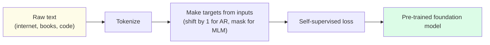
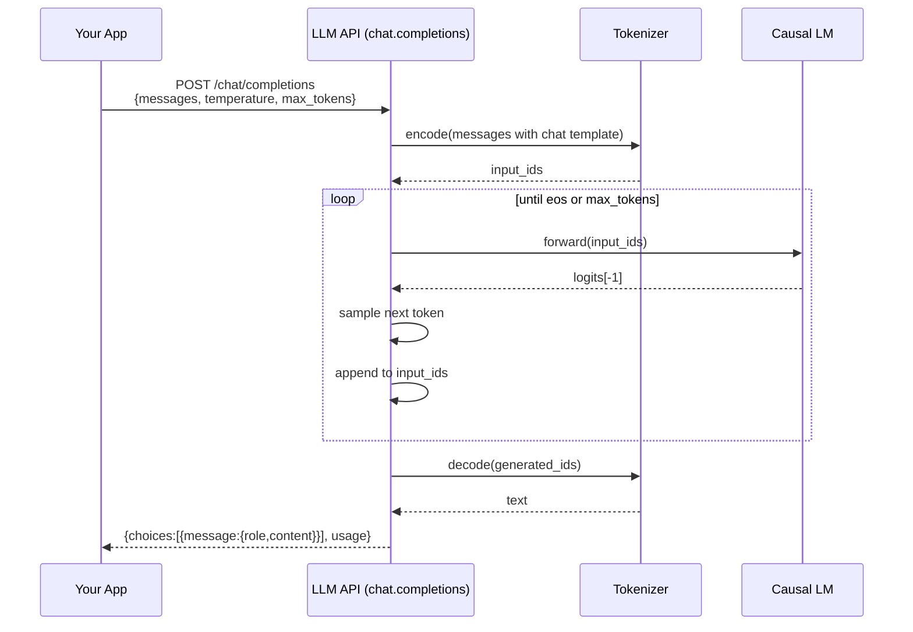
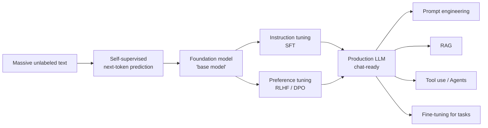

# 3 - Generative AI Fundamentals

[toc]

> **TL;DR:** *Generative AI* is the class of models that produce samples from a learned distribution — text, images, audio, code, video. *Completions* are the API-level primitive: you give a prefix, the model gives you a probable continuation. *Self-supervision* is the training trick that made all of this possible — turning unlabeled internet data into training signal. *Parameters* are the model's learned weights; their count (7B, 70B, 405B) is the single most-quoted number in modern AI, and it predicts a lot but not everything.

## Vocabulary

**Generative model**

```math
x \sim P_\theta(x)
```

A model that can produce samples `x` from a learned probability distribution. Contrast with *discriminative* models that only score / classify existing inputs.

---

**Completion**

```math
\text{output} = \text{LM}(\text{prompt}), \quad \text{output} \sim P_\theta(\cdot \mid \text{prompt})
```

The text generated by a language model given a prompt. The API-level unit of work for an LLM call. "Chat completion" is the same idea wrapped in a `messages: [{role, content}, ...]` schema.

---

**Self-supervised learning (SSL)**

A training paradigm where the labels are *derived from the input itself* — predict the next token, predict masked tokens, predict whether two patches come from the same image. No human annotation needed.

---

**Parameter**

```math
\theta = \{W_1, b_1, W_2, b_2, \ldots\} \in \mathbb{R}^N
```

A single learned weight in the model. The *parameter count* `N` is the total number of trainable numbers. A "7B model" has `N ≈ 7 × 10⁹` parameters.

---

**Pre-training**

The first, massive training run that learns the base distribution from unlabeled data. Where the bulk of compute and capability come from.

---

**Foundation model**

A pre-trained model intended to be adapted to many downstream tasks. The term emphasizes generality — one model, many uses — as opposed to a model trained for one task only.

---

**Emergent capability**

A behavior that appears only above a certain scale (parameters × data × compute) and is absent in smaller models. Arithmetic, chain-of-thought, code, instruction following are canonical examples.

## Intuition

"Generative AI" is a marketing term that points at a deep technical idea: a model that has learned to *sample* from the distribution of plausible outputs. A discriminative model can tell you "this email is spam"; a generative model can *write you a new spam email*. The hard part isn't sampling — that's just `argmax` or random draw — it's learning a distribution rich enough that the samples are coherent, novel, useful. The breakthrough of the 2020s was discovering that scaling a single self-supervised objective (next-token prediction) on a single architecture (the Transformer) produces models whose samples are increasingly indistinguishable from human-written text.

A *completion* is just the user-facing word for "one sample from the model." When you type into ChatGPT and hit Enter, the underlying API call returns a completion — a sequence of tokens drawn from the model's distribution conditioned on the chat history. Everything you can do with an LLM (translate, summarize, plan, code, reason) is implemented as "find a prompt whose completion solves my task." Prompt engineering, RAG, tool use, agents — all are dressings on this single primitive.

*Self-supervision* is what made the scale work. Supervised learning would have required hand-labeling the entire training corpus, which is impossible. Self-supervision turns the data itself into the labels: hide a word, ask the model to predict it. Suddenly every byte on the public internet is a labeled training example. The result was a phase transition in what models could do, because data was no longer a bottleneck — only compute and architecture were.

## Self-supervision — the trick that scales



The labels are inside the input. For an autoregressive LM, the input `[A, B, C, D]` and the target `[B, C, D, E]` are literally the same sequence shifted by one position. No annotator, no quality control on labels, no taxonomy. You just need *a lot* of unlabeled text.

```python
import torch

def make_ar_training_pair(token_ids: torch.Tensor) -> tuple[torch.Tensor, torch.Tensor]:
    """
    Turn a single document into an (input, target) pair for autoregressive LM training.
    The target is the input shifted by one position — the supervision is free.
    """
    inputs = token_ids[:-1]
    targets = token_ids[1:]
    return inputs, targets

doc = torch.tensor([464, 3797, 3332, 319, 262, 2603, 13])  # "The cat sat on the mat."
x, y = make_ar_training_pair(doc)
print("input :", x.tolist())  # [464, 3797, 3332, 319, 262, 2603]
print("target:", y.tolist())  # [3797, 3332, 319, 262, 2603, 13]
```

The same data point provides ~`T` supervision signals (one per next-token prediction), which is part of why decoder-only autoregressive training is so sample-efficient at the FLOP level.

## Completions — the API primitive

Underneath every chat UI is a `completions` endpoint that takes a prompt (or a chat-formatted list of messages) and returns generated tokens. The two dominant flavors are *text completion* (raw `prompt` → `completion` string) and *chat completion* (structured `messages` → assistant `content`). Modern APIs almost exclusively use chat completion now, because chat formatting carries role information (system, user, assistant, tool) the model was instruction-tuned on.



A real call, with logging of the most-quoted production details:

```python
from openai import OpenAI

client = OpenAI()
response = client.chat.completions.create(
    model="gpt-4o-mini",
    messages=[
        {"role": "system", "content": "You are a precise technical writer."},
        {"role": "user", "content": "In one sentence: what is self-supervised learning?"},
    ],
    temperature=0.2,
    max_completion_tokens=80,
)

completion: str = response.choices[0].message.content
prompt_tokens: int = response.usage.prompt_tokens
completion_tokens: int = response.usage.completion_tokens
finish_reason: str = response.choices[0].finish_reason

print(f"answer:    {completion}")
print(f"in:        {prompt_tokens} tokens")
print(f"out:       {completion_tokens} tokens")
print(f"stopped:   {finish_reason}")
```

Three production-critical fields. (1) `usage.prompt_tokens` and `usage.completion_tokens` — the inputs to your bill. (2) `finish_reason` — `"stop"` means the model emitted an end-of-turn token, `"length"` means it hit the `max_completion_tokens` ceiling and may be cut off mid-thought. (3) `temperature` — covered in detail in [Sampling and Decoding](../2-foundation-models/4-sampling-and-decoding.md), but at a glance: `0` is deterministic-ish, higher is more random.

## Parameters — what the number means

A parameter is a single floating-point number that the model learned during training. They live in two places: the embedding table (`vocab_size × d_model`) and the Transformer blocks (attention projections, MLP weights, layer norms). The total count `N` is the most-quoted size number of a model.

```math
N \approx 12 \, L \, d^2
```

For a decoder-only Transformer with `L` layers and hidden dimension `d`, the leading-order parameter count is approximately `12 L d²` (4 attention projections + 2 MLP projections, each `d × d`, times a factor for the MLP expansion). Embeddings add `2 V d` (input + output, often tied).

Approximate breakdowns for famous models:

| Model | Layers `L` | Hidden `d` | Heads | Parameters `N` |
| :--- | ---: | ---: | ---: | ---: |
| GPT-2 small | 12 | 768 | 12 | 124 M |
| GPT-2 XL | 48 | 1,600 | 25 | 1.5 B |
| Llama-3 8B | 32 | 4,096 | 32 | 8 B |
| Llama-3 70B | 80 | 8,192 | 64 | 70 B |
| Llama-3 405B | 126 | 16,384 | 128 | 405 B |
| (Frontier mixture-of-experts) | varies | varies | varies | 500 B+ active subset |

```python
def transformer_param_count(L: int, d: int, vocab: int, ffn_mult: int = 4) -> int:
    """
    Approximate parameter count of a decoder-only Transformer:
    per layer: 4 attn proj (d*d) + 2 MLP proj (d*ffn_mult*d) = 4*d^2 + 2*ffn_mult*d^2
    plus embeddings 2*vocab*d (input + output, often tied -> 1*vocab*d).
    Ignoring biases, layer-norms (small).
    """
    per_layer = 4 * d * d + 2 * ffn_mult * d * d
    transformer_block = L * per_layer
    embeddings = vocab * d  # assume tied
    return transformer_block + embeddings

# Llama-3 8B rough estimate
n = transformer_param_count(L=32, d=4096, vocab=128_256)
print(f"~{n/1e9:.2f} B parameters")  # ~7.5 B, close to the 8B label
```

> [!IMPORTANT]
> Parameter count is *not* the same as model capability. Training data quality, instruction tuning, and post-training (RLHF, DPO) can make a 70B model decisively outperform a 405B one. Use parameter count as a rough capacity hint, not as a leaderboard.

> [!NOTE]
> For **mixture-of-experts** (MoE) models like Mixtral or DeepSeek-V3, the headline parameter count is *total* parameters across all experts, but only a *subset* (the "active" parameters) is used per forward pass. A 671B-parameter MoE with 37B active parameters per token has the storage cost of a 671B dense model but the compute cost of a 37B one. When comparing models, ask which number is being reported.

## Why does this all work? The pre-training thesis

The single observation that drives modern AI engineering is this: if you train a sufficiently large neural network with self-supervised next-token prediction on sufficiently diverse text, useful capabilities *emerge*. The model learns grammar, world knowledge, arithmetic, code, reasoning patterns — not because anyone told it to, but because predicting the next token *well* requires understanding all of that.



This is the **foundation model paradigm**. Pre-train once on raw text; then *adapt* the same model via prompting, fine-tuning, RAG, or tool use to every downstream task. Compare to the pre-2020 paradigm of training a separate model per task from scratch — foundation models compound investment across tasks in a way the old paradigm could not.

## In practice

Most production AI engineering is about turning a foundation model into a product. You almost never train the foundation model yourself — it costs $10M–$100M+ of GPU time and a team of researchers. You buy access (OpenAI, Anthropic, Google), download weights (Llama, Mistral, DeepSeek), or fine-tune a smaller open model. The interesting engineering happens in the layers *around* the model: prompts, retrieval, evaluation, observability, safety, agents.

> [!TIP]
> When budgeting a new feature, the first question is "does the base capability already exist in a frontier model?" If GPT-4o or Claude can do the task zero-shot, prompt engineering + evaluation is the entire project. If they can't, you escalate: better prompts → RAG → fine-tuning → custom model. Always start with the cheapest layer that works.

> [!WARNING]
> "Emergent capability" is a real phenomenon but is also abused. Some "emergent" curves turn into smooth scaling curves when you switch from a discontinuous accuracy metric to a continuous likelihood metric. Don't take the marketing literally — capabilities improve smoothly with scale, but they cross the threshold of "useful for product X" at discrete points.

> [!CAUTION]
> Treat completions as **probabilistic outputs**, not deterministic function calls. Even at `temperature=0`, the same prompt can give different answers across model versions, across batched-vs-unbatched inference, or across providers' kernels. If you need exact reproducibility, log every input *and* the model version, and re-run rather than cache.

## Pitfalls

- **"Generative AI is one technology."** It's a family: autoregressive LMs, diffusion models (images, video, audio), autoregressive image models, flow-matching models. They share the goal of sampling from a distribution but have very different architectures and training objectives.
- **"More parameters = better."** Diminishing returns set in fast. A well-trained 8B model beats a poorly trained 70B model. Data quality, training duration, and post-training dominate at a given scale.
- **"Self-supervision means no labels."** Self-supervision skips *task* labels but the *data selection* (what's in the training set, how it's filtered) is itself a powerful form of supervision — and a quiet source of bias and capability.
- **"The base model is the product."** Almost never. A *raw* pre-trained model produces text that resembles the training distribution but doesn't follow instructions or refuse harmful requests. Every shipped LLM is the base model plus expensive [post-training](../2-foundation-models/3-post-training-and-finetuning.md).
- **"Completions are stateless."** The API call is stateless, but the model's behavior is heavily shaped by hidden state inside the provider's stack — system prompts, safety filters, tool wiring, retrieval. Two `chat.completions` calls with identical messages can hit different code paths.

## Exercises

### Exercise 1 — Estimate the FLOPs of training a 7B model

For a dense decoder-only Transformer, training FLOPs are approximately `C ≈ 6 N D`, where `N` is parameter count and `D` is tokens seen during training. Llama-3 8B was trained on roughly 15 trillion tokens. (a) Estimate training FLOPs. (b) An H100 GPU sustains about 700 TFLOP/s on FP16. How many GPU-days does that imply? (c) What does that cost at $2.50/hour for an H100?

#### Solution

**(a)** `N = 8×10⁹`, `D = 1.5×10¹³`.

```math
C \approx 6 \times 8 \times 10^9 \times 1.5 \times 10^{13} = 7.2 \times 10^{23}\ \text{FLOPs}
```

**(b)** One H100 day is `700 × 10¹² × 86400 ≈ 6.05 × 10¹⁹` FLOPs.

```math
\text{GPU-days} = \frac{7.2 \times 10^{23}}{6.05 \times 10^{19}} \approx 11{,}900\ \text{GPU-days}
```

In practice MFU (model-FLOPs utilization) is ~40%, so effective sustained throughput is closer to 280 TFLOP/s, multiplying the GPU-day estimate by ~2.5 → roughly 30k GPU-days.

**(c)** 30,000 GPU-days × 24 hours × $2.50 = **about $1.8M**. Pre-training a frontier-grade *small* model is a high-stakes single investment. Now you see why almost nobody pre-trains from scratch.

---

### Exercise 2 — Build a streaming completion client

Write a Python function that streams a chat completion token-by-token to stdout (like ChatGPT's UI). Use the OpenAI Python SDK's `stream=True`.

#### Solution

```python
from openai import OpenAI

def stream_completion(prompt: str, model: str = "gpt-4o-mini") -> str:
    """Stream tokens to stdout as they arrive; return the assembled string."""
    client = OpenAI()
    stream = client.chat.completions.create(
        model=model,
        messages=[{"role": "user", "content": prompt}],
        stream=True,
        max_completion_tokens=400,
    )
    parts: list[str] = []
    for chunk in stream:
        delta = chunk.choices[0].delta.content
        if delta:
            print(delta, end="", flush=True)
            parts.append(delta)
    print()
    return "".join(parts)
```

Streaming exists because of *time to first token* (TTFT). A 400-token response that takes 8 seconds end-to-end feels much faster if the user sees the first word at 200 ms. TTFT optimization (prefill batching, speculative decoding) is a major axis of LLM-serving research.

---

### Exercise 3 — Why is next-token prediction enough?

In one paragraph, explain why a model trained *only* to predict the next token can perform translation, summarization, code completion, and arithmetic — tasks that nobody explicitly trained it on.

#### Solution

The training corpus contains many implicit demonstrations of every task. A page about French recipes that switches mid-paragraph from English to French requires the model to predict French tokens — that's translation. A news article followed by its TL;DR teaches summarization. A GitHub repo with docstrings before function bodies teaches code completion from natural-language prompts. Arithmetic appears in tutorials, math books, and code. Because predicting the next token well *requires* internalizing all these patterns, the model that masters the next-token objective at sufficient scale ends up capable of every task that's downstream of those patterns. The objective is generic; the capability is implicit in the data. This is the central insight that turned out to scale.

---

### Exercise 4 — Diagnose a "language" finish_reason

Your support agent runs gpt-4o-mini with `max_completion_tokens=120`. You're seeing 8% of responses finish with `finish_reason="length"` and users complaining about cut-off answers. List three orthogonal fixes and the tradeoff each one makes.

#### Solution

(1) **Raise `max_completion_tokens`** to e.g. 400. Trade-off: every response is now allowed to cost ~3× more in output tokens; latency goes up; long rambling answers become possible. Cheap, fast to deploy.

(2) **Tighten the system prompt** to ask for shorter answers ("respond in at most three sentences"). Trade-off: model now uses fewer tokens but may compress out important details. Costs nothing extra; quality risk.

(3) **Stream + early-terminate intelligently**: stream the response, detect natural ending (period followed by no new tokens for 200 ms), or detect when the model is going to continue past the limit and gracefully end on a sentence boundary. Trade-off: client-side complexity, but you keep good UX without a higher token ceiling.

A solid product ships (2) first (free), then (1) for the long-tail of legitimately long answers, then (3) as a polish step.

## Sources

- Brown, T. et al. (2020). *Language Models are Few-Shot Learners* (GPT-3). https://arxiv.org/abs/2005.14165
- Bommasani, R. et al. (2021). *On the Opportunities and Risks of Foundation Models*. https://arxiv.org/abs/2108.07258
- Wei, J. et al. (2022). *Emergent Abilities of Large Language Models*. https://arxiv.org/abs/2206.07682
- Schaeffer, R. et al. (2023). *Are Emergent Abilities of Large Language Models a Mirage?* https://arxiv.org/abs/2304.15004
- Touvron, H. et al. (2023). *Llama 2: Open Foundation and Fine-Tuned Chat Models*. https://arxiv.org/abs/2307.09288
- Hoffmann, J. et al. (2022). *Training Compute-Optimal Large Language Models* (Chinchilla). https://arxiv.org/abs/2203.15556
- Huyen, C. (2024). *AI Engineering*, Chapter 1.

## Related

- [1 - Tokens and Tokenization](./1-tokens-and-tokenization.md)
- [2 - Language Models: Autoregressive vs Masked](./2-language-models.md)
- [4 - Multimodal Models and Embeddings](./4-multimodal-and-embeddings.md)
- [5 - Prompt Engineering](./5-prompt-engineering.md)
- [Post-Training and Fine-tuning](../2-foundation-models/3-post-training-and-finetuning.md)
- [Sampling and Decoding](../2-foundation-models/4-sampling-and-decoding.md)
