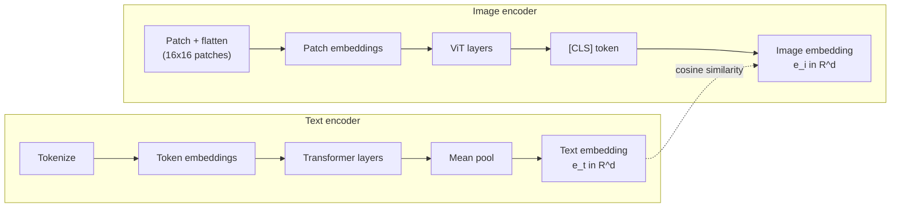
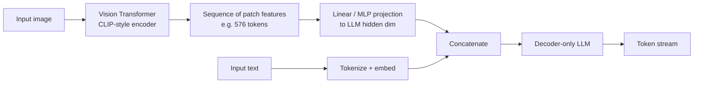

# 4 - Multimodal Models and Embeddings (CLIP)

[toc]

> **TL;DR:** A *multimodal* model processes more than one modality (text, image, audio, video) in a shared representation. *Embedding models* are the dual-purpose substrate: they map any input — a sentence, an image, a code snippet — to a fixed-length vector in a learned space where geometric distance encodes semantic similarity. *CLIP* is the canonical multimodal embedding model: it learned a joint text-and-image space by contrastive training on 400M image-caption pairs, and its descendants power image search, zero-shot classification, RAG over PDFs, and the vision tower of most modern multimodal LLMs.

## Vocabulary

**Modality**

A type of input data: text, image, audio waveform, video, point cloud, sensor stream, code, structured tables. A model is *unimodal* if it handles one, *multimodal* if it handles two or more in a shared representation.

---

**Embedding**

```math
e = f_\theta(x) \in \mathbb{R}^d
```

A fixed-length dense vector representation of an input. Produced by an embedding model `f_θ`. The dimension `d` is typically 256–4096.

---

**Embedding space**

```math
\mathcal{E} \subset \mathbb{R}^d
```

The high-dimensional space embeddings live in. The learning objective shapes this space so that semantically similar inputs have similar vectors (small cosine distance).

---

**Cosine similarity**

```math
\cos(e_1, e_2) = \frac{e_1 \cdot e_2}{\|e_1\| \, \|e_2\|}
```

The dot product of two unit-normalized vectors. The standard similarity metric for embedding spaces; ranges from `-1` (opposite) to `1` (identical direction).

---

**Contrastive learning**

A training objective that pulls *matched* pairs together in embedding space and pushes *mismatched* pairs apart. The optimization driver behind CLIP, sentence-transformers, and most retrieval embeddings.

---

**CLIP (Contrastive Language–Image Pretraining)**

```math
\mathcal{L}_{\text{CLIP}} = \frac{1}{2}\big(\mathcal{L}_{\text{i→t}} + \mathcal{L}_{\text{t→i}}\big)
```

OpenAI's 2021 model that jointly trained a text encoder and an image encoder so that an image and its true caption land close together in a shared embedding space.

---

**Vision encoder (vision tower)**

The image-processing front end of a multimodal LLM. Typically a Vision Transformer (ViT) that produces a sequence of patch embeddings, which are projected and concatenated with text tokens before being fed to the LLM.

## Intuition

Until ~2020, every modality lived in its own model. Image classifiers had their own architectures (ResNet), speech had its own (DeepSpeech), text had its own (BERT). They didn't share weights, didn't share representations, and couldn't talk to each other. The multimodal revolution is the realization that you can train a single model — or two encoders that share an embedding space — to operate across modalities by aligning their representations during training.

The clearest formulation of this idea is CLIP: take 400 million (image, caption) pairs from the web. Train an image encoder and a text encoder, side by side. Optimize *one* objective: the embedding of an image should be closer to the embedding of its own caption than to any other caption in the batch. After this training, the two encoders' outputs live in the same vector space. You can search images with text. You can classify an image without any classification head by comparing its embedding to embeddings of candidate text labels ("a photo of a cat", "a photo of a dog"). That's *zero-shot* classification — a capability nobody trained directly.

Embeddings are the lingua franca of modern AI engineering. RAG systems embed documents and queries to retrieve. Recommendation systems embed users and items to rank. Deduplication clusters embeddings. Anomaly detection finds embedding outliers. Every time you compute a vector and compare it to other vectors with cosine similarity, you are doing the thing that made CLIP famous, just possibly with one modality instead of two.

## How an embedding model works

An embedding model is just an encoder neural network with a final pooling step that produces one fixed-length vector per input. For text, this is usually `mean-pool over token hidden states + L2 normalize`; for images, it's `[CLS] token of a ViT + L2 normalize`.



The training objective forces the two encoders to produce *compatible* embeddings — vectors in the same space where geometric distance has semantic meaning across modalities. After training, both encoders can be used independently (text-only retrieval, image-only retrieval) or together (text → image search).

### The contrastive loss, in code

Given a batch of `N` (image, text) pairs, compute all `N²` pairwise similarities. The diagonal contains the correct matches. The loss is symmetric cross-entropy across rows and columns of that similarity matrix.

```python
import torch
import torch.nn.functional as F

def clip_loss(image_emb: torch.Tensor,
              text_emb: torch.Tensor,
              temperature: float = 0.07) -> torch.Tensor:
    """
    image_emb, text_emb: [N, d] — already L2-normalized
    Returns: scalar contrastive loss (mean of i→t and t→i cross-entropy).
    """
    # similarity matrix of every image with every text in the batch
    logits = image_emb @ text_emb.T / temperature   # [N, N]
    labels = torch.arange(logits.shape[0], device=logits.device)
    loss_i2t = F.cross_entropy(logits, labels)
    loss_t2i = F.cross_entropy(logits.T, labels)
    return (loss_i2t + loss_t2i) / 2

# Tiny demo: 4 images, 4 captions, embedding dim 128
torch.manual_seed(0)
img = F.normalize(torch.randn(4, 128), dim=-1)
txt = F.normalize(torch.randn(4, 128), dim=-1)
print(f"loss = {clip_loss(img, txt).item():.3f}")
```

The trick: each correct (image, text) pair acts as a positive example, and *every other text* in the same batch acts as a negative example. Larger batch size → more negatives → better representations. CLIP was trained at batch size 32,768 across 256 GPUs — the negatives are the secret ingredient.

## Math — why cosine similarity?

Embeddings are normalized to unit length so that *magnitude* is removed and only *direction* carries meaning. Cosine similarity is then identical to a normalized dot product:

```math
\cos(e_1, e_2) = e_1 \cdot e_2 \quad \text{when } \|e_1\| = \|e_2\| = 1
```

This matters because models trained with contrastive loss optimize cosine alignment directly. Using Euclidean distance on normalized embeddings is equivalent up to a monotonic transformation:

```math
\|e_1 - e_2\|^2 = 2 - 2\cos(e_1, e_2)
```

Both rank identically. The reason vector databases (FAISS, pgvector, Pinecone, Weaviate) offer both metrics is that some embeddings (e.g. some BERT pooled outputs) are *not* unit-normalized, in which case raw dot product and cosine differ.

## Real-world example — zero-shot image classification

The most famous CLIP demo is "classify any image into any set of labels you can express in text," with no training. Here's the implementation in twenty lines.

```python
import torch
import torch.nn.functional as F
from PIL import Image
import clip   # pip install git+https://github.com/openai/CLIP.git

device = "cuda" if torch.cuda.is_available() else "cpu"
model, preprocess = clip.load("ViT-B/32", device=device)

image = preprocess(Image.open("photo.jpg")).unsqueeze(0).to(device)

candidate_labels = ["a photo of a cat",
                    "a photo of a dog",
                    "a photo of a car",
                    "a photo of an espresso machine"]
text_tokens = clip.tokenize(candidate_labels).to(device)

with torch.no_grad():
    image_features = F.normalize(model.encode_image(image), dim=-1)
    text_features = F.normalize(model.encode_text(text_tokens), dim=-1)
    sims = (image_features @ text_features.T).softmax(dim=-1)

for label, p in zip(candidate_labels, sims[0].tolist()):
    print(f"  {p*100:5.2f}%  {label}")
```

Output for a photo of a tabby cat might be:

```
  92.40%  a photo of a cat
   5.10%  a photo of a dog
   1.80%  a photo of a car
   0.70%  a photo of an espresso machine
```

The model never saw "a photo of a cat" as a class label. It just learned, from web data, that *images of cats* live near *the text 'a photo of a cat'* in embedding space. At inference, you pick the candidate text whose embedding is closest to the image's. The same model handles arbitrary new label sets at zero engineering cost.

## How modern multimodal LLMs use CLIP-style encoders

GPT-4V, Claude, Gemini, Llava — every multimodal LLM has a *vision tower* and a *projection layer* that turns image patches into "tokens" the LLM can attend to alongside text.



This architecture is sometimes called "**early fusion at the token level**." The image becomes a sequence of pseudo-tokens that flow into the same attention layers as the text. Training is a two-stage process: pre-train the vision encoder contrastively (à la CLIP), then *connect it* to a pre-trained LLM by jointly training a small projection layer on image-text data while keeping (or partially unfreezing) the rest. This is why Llava, MiniGPT-4, and even early GPT-4V can be built on top of existing LLMs without retraining from scratch.

> [!IMPORTANT]
> CLIP itself is *not* a generative model. It cannot describe an image; it can only score image-text pairs. To get image captioning, visual question answering, or image-grounded chat, you bolt CLIP (or a similar encoder) onto a decoder-only LLM. The encoder gives you understanding; the decoder gives you generation.

## Embeddings beyond CLIP — text embedding models for RAG

The most common embedding workload in production today is *text retrieval* for RAG. The dominant models are encoder-only Transformers trained with contrastive loss on (query, relevant-passage) pairs:

| Model family | Dim | Notes |
| :--- | ---: | :--- |
| OpenAI `text-embedding-3-large` | 3072 (or truncatable) | Highest-quality closed-source general embedding. |
| Voyage `voyage-3` | 1024 | Strong code + domain variants. |
| `BAAI/bge-large-en` | 1024 | Open-source, BERT-based. |
| `intfloat/e5-mistral-7b-instruct` | 4096 | Decoder-LM-based, very strong on MTEB. |
| Cohere `embed-english-v3.0` | 1024 | Production embedding API. |

A production retrieval pipeline:

```python
from openai import OpenAI
import numpy as np

client = OpenAI()

def embed(texts: list[str], model: str = "text-embedding-3-small") -> np.ndarray:
    resp = client.embeddings.create(model=model, input=texts)
    vecs = np.array([d.embedding for d in resp.data], dtype=np.float32)
    # L2 normalize so cosine sim == dot product
    vecs /= np.linalg.norm(vecs, axis=1, keepdims=True)
    return vecs

docs = [
    "BPE is a subword tokenization algorithm.",
    "Espresso is brewed by forcing hot water through fine grounds.",
    "Vision Transformers split images into patches.",
    "Autoregressive models predict the next token given the prefix.",
]
doc_vecs = embed(docs)

query = "How does a language model decide what word comes next?"
q_vec = embed([query])[0]

scores = doc_vecs @ q_vec
top = np.argsort(-scores)[:2]
for i in top:
    print(f"{scores[i]:.3f}  {docs[i]}")
```

This little snippet *is* the core of every RAG system. Embed corpus once, store vectors, embed each query, retrieve top-K by cosine similarity, feed those to the LLM as context. The whole [RAG note](./6-rag-introduction.md) builds on top of this primitive.

## In practice

> [!TIP]
> The single biggest determinant of RAG quality is your embedding model. A weak embedder retrieves irrelevant passages and the LLM cannot recover. Benchmark on *your* data (the [MTEB leaderboard](https://huggingface.co/spaces/mteb/leaderboard) is a starting point, not a final answer) and treat the embedding choice as a tunable hyperparameter, not a fixed default.

> [!NOTE]
> Embedding dimensions are not free. A million-document corpus at 3072 dimensions × 4 bytes = 12 GB just for vectors, before any HNSW index overhead. Modern providers expose **Matryoshka** truncation — you can keep the first 512 dimensions and lose only a small amount of accuracy, cutting storage 6×. Always check whether your provider supports this before paying for full-dimensional storage.

> [!CAUTION]
> Mixing embeddings from different models in the same vector index is a silent killer. The geometry of the embedding space is model-specific. A vector from `text-embedding-3-large` and a vector from `bge-large-en` have no shared meaning of "cosine similarity 0.85." Re-embed your entire corpus when you change the embedding model.

A growing class of *late-interaction* models — ColBERT, ColPali — produce one vector *per token* (or per image patch) instead of one per document, and compute fine-grained matching at query time. They retrieve substantially better than single-vector models at the cost of ~`T` × more storage. As of 2026 they are state-of-the-art on hard retrieval benchmarks but require specialized indexing.

## Pitfalls

- **"Embeddings preserve all the information."** They are a lossy compression. Two semantically different documents can have identical embeddings if the model wasn't trained to distinguish them. Always validate on your downstream task.
- **"Cosine similarity is a probability."** It isn't. A cosine of 0.7 has no fixed meaning across models. For one model 0.7 is a near-perfect match; for another it's irrelevant. *Calibrate* thresholds per model on labeled data.
- **"More dimensions are better."** Up to a point. Past a few thousand dims, you mostly burn storage and search latency. Matryoshka representations show that early dimensions carry most of the signal.
- **"CLIP solves visual reasoning."** CLIP is a similarity model, not a reasoning model. It can match images to captions but can't count objects, do OCR reliably, or answer multi-step visual questions. Those are jobs for full multimodal LLMs.
- **"I can embed an image with a text embedder."** No — they live in different spaces. To embed an image, use an image encoder (CLIP, SigLIP, DINOv2). To embed it *into a text-compatible space*, use a multimodal embedder.

## Exercises

### Exercise 1 — Verify cosine similarity behaves intuitively

Use `text-embedding-3-small` (or any embedder you have) to embed these three sentences:
- `s1 = "The cat sat on the mat."`
- `s2 = "A feline rested on the rug."`
- `s3 = "Espresso is brewed under high pressure."`

Compute all three pairwise cosine similarities. Predict the order from highest to lowest before you run it, then check.

#### Solution

Prediction: `cos(s1, s2)` should be highest (paraphrase); `cos(s1, s3)` and `cos(s2, s3)` should be much lower and roughly equal (unrelated topics).

```python
from openai import OpenAI
import numpy as np

client = OpenAI()
sentences = [
    "The cat sat on the mat.",
    "A feline rested on the rug.",
    "Espresso is brewed under high pressure.",
]
vecs = np.array([d.embedding for d in
                 client.embeddings.create(model="text-embedding-3-small",
                                          input=sentences).data])
vecs /= np.linalg.norm(vecs, axis=1, keepdims=True)
sim = vecs @ vecs.T
print(sim.round(3))
```

Typical output:

```
[[1.    0.79  0.18]
 [0.79  1.    0.17]
 [0.18  0.17  1.  ]]
```

`s1 ~ s2` at 0.79 (high; paraphrase). `s1 ~ s3` and `s2 ~ s3` near 0.17 (unrelated). The geometry matches semantics — exactly what contrastive training is supposed to deliver.

---

### Exercise 2 — Compute storage for a 1M-document corpus

You're building a RAG system over 1,000,000 documents. (a) Storage at 1536-dim float32. (b) Same at 256-dim float16 (Matryoshka + half precision). (c) What's the throughput of brute-force cosine search at each size on a modern CPU (assume 50 GB/s memory bandwidth)?

#### Solution

**(a)** `1e6 × 1536 × 4 bytes = 6.14 GB`.

**(b)** `1e6 × 256 × 2 bytes = 0.51 GB` — a 12× reduction.

**(c)** Brute-force search reads the entire corpus once per query. At 50 GB/s:
- 6.14 GB → 0.12 s per query → **~8 QPS**.
- 0.51 GB → 0.01 s per query → **~100 QPS**.

A 12× storage reduction translates almost directly to a 12× throughput gain, because brute-force search is memory-bandwidth bound. ANN indexes (HNSW, IVF) reduce this further by reading only a small fraction of vectors per query — at the cost of recall.

---

### Exercise 3 — Build a tiny zero-shot classifier

Without using any pre-built classification pipeline, use CLIP to classify an image into one of `["dog", "cat", "horse", "bird"]`. Show the prompt-engineering choice of "a photo of a {label}" vs raw `"{label}"`.

#### Solution

```python
import torch
import torch.nn.functional as F
import clip
from PIL import Image

device = "cuda" if torch.cuda.is_available() else "cpu"
model, preprocess = clip.load("ViT-B/32", device=device)

labels = ["dog", "cat", "horse", "bird"]
prompts_raw  = labels
prompts_eng  = [f"a photo of a {l}" for l in labels]

image = preprocess(Image.open("photo.jpg")).unsqueeze(0).to(device)

def classify(prompts):
    with torch.no_grad():
        img = F.normalize(model.encode_image(image), dim=-1)
        txt = F.normalize(model.encode_text(clip.tokenize(prompts).to(device)), dim=-1)
        return (img @ txt.T).softmax(-1)[0]

print("raw   :", dict(zip(labels, classify(prompts_raw).tolist())))
print("eng'd :", dict(zip(labels, classify(prompts_eng).tolist())))
```

The engineered prompt `"a photo of a {label}"` consistently improves CLIP zero-shot accuracy because the training distribution had captions that started with phrases like "a photo of a …". Matching the test prompt to the training distribution is **prompt engineering for embedding models** — covered in detail in [Prompt Engineering](./5-prompt-engineering.md).

---

### Exercise 4 — Why does mixing embedding models silently corrupt RAG?

You re-embed half of your corpus with a new embedding model and forget to re-embed the other half. Describe what happens to retrieval and why the bug is hard to detect.

#### Solution

The two halves of the corpus now live in *different* embedding spaces. A query embedded with the new model has meaningful cosine similarity *only* to the half re-embedded with the same model. Vectors from the old half end up uniformly closer to or farther from the query in a way that has no relationship to semantics — the comparison is geometric nonsense, not semantic mismatch.

Why it's hard to detect: the numerical results *look* valid — cosine similarities are still real numbers between -1 and 1, the top-K still returns documents, and the LLM downstream still generates plausible answers (because of its strong language prior). The only symptom is degraded retrieval quality, which only shows up if you measure recall on a held-out evaluation set with labeled (query, relevant-doc) pairs. If you don't have that evaluation, the bug can sit in production indefinitely.

The fix: always re-embed the entire corpus atomically when changing models, and treat embedding-model version as part of your index's identity (e.g. include the model name in the index name).

## Sources

- Radford, A. et al. (2021). *Learning Transferable Visual Models From Natural Language Supervision* (CLIP). https://arxiv.org/abs/2103.00020
- Dosovitskiy, A. et al. (2020). *An Image is Worth 16x16 Words: Transformers for Image Recognition at Scale* (ViT). https://arxiv.org/abs/2010.11929
- Reimers, N. & Gurevych, I. (2019). *Sentence-BERT: Sentence Embeddings using Siamese BERT-Networks*. https://arxiv.org/abs/1908.10084
- Khattab, O. & Zaharia, M. (2020). *ColBERT: Efficient and Effective Passage Search via Contextualized Late Interaction over BERT*. https://arxiv.org/abs/2004.12832
- Kusupati, A. et al. (2022). *Matryoshka Representation Learning*. https://arxiv.org/abs/2205.13147
- Liu, H. et al. (2023). *Visual Instruction Tuning* (LLaVA). https://arxiv.org/abs/2304.08485
- Huyen, C. (2024). *AI Engineering*, Chapter 1.

## Related

- [1 - Tokens and Tokenization](./1-tokens-and-tokenization.md)
- [2 - Language Models](./2-language-models.md)
- [3 - Generative AI Fundamentals](./3-generative-ai-fundamentals.md)
- [6 - RAG Introduction](./6-rag-introduction.md)
- [Similarity Measurements and Embeddings (for Eval)](../3-evaluation/4-similarity-and-embeddings.md)
