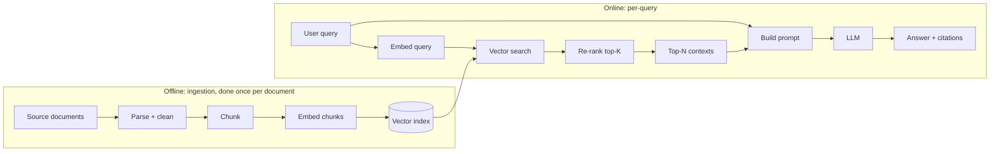
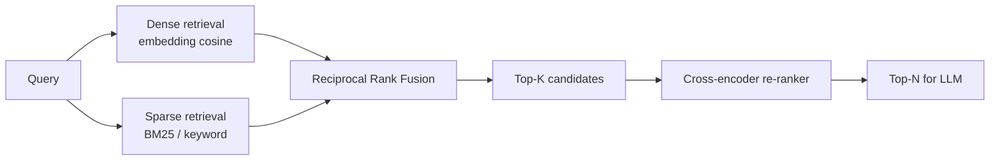

# 6 - Retrieval-Augmented Generation (RAG)

[toc]

> **TL;DR:** *RAG* injects external, up-to-date, or proprietary knowledge into a frozen LLM by retrieving relevant chunks at query time and stuffing them into the prompt. It is the single highest-leverage architecture in production AI: it cuts hallucinations, adds citability, and updates "what the model knows" without re-training. Every RAG system is variations on the same five-step pipeline — ingest, embed, index, retrieve, generate — and the engineering quality lives in the details of each step.

## Vocabulary

**Retrieval-Augmented Generation (RAG)**

A pattern where, given a user query, the system *retrieves* relevant context from an external knowledge store and *generates* an answer conditioned on both the query and the retrieved context.

---

**Chunk**

A small unit of text (a passage, paragraph, code function, or sliding window) that is embedded and stored as a single retrievable item.

---

**Vector index**

```math
\text{index}: \mathcal{Q} \to \text{top-}k \text{ chunks ranked by similarity to } e_q
```

A data structure (FAISS HNSW, IVF-PQ, pgvector, Pinecone, Weaviate, …) that takes a query embedding and returns the nearest stored chunks fast.

---

**Recall@K**

```math
\text{recall@}K = \frac{|\text{relevant} \cap \text{top-}K|}{|\text{relevant}|}
```

The fraction of truly relevant chunks the retriever placed in its top `K`. The most important single quality number for a retrieval system.

---

**Re-ranker**

A second-stage model (typically a cross-encoder) that re-orders the top-K candidates using full query-document interaction, fixing mistakes the cheap first-stage retriever made.

---

**Hybrid search**

Combining dense (embedding) retrieval with sparse (keyword / BM25) retrieval and fusing the rankings. Empirically the most robust default for general-purpose RAG.

---

**Grounding / Citation**

The practice of attaching, to each generated claim, the source chunk(s) that support it — so the user can audit the answer.

## Intuition

The base capability of a pre-trained LLM is fixed at training time. It knows what was in its training data and nothing else. Two huge classes of knowledge fall outside that: anything *proprietary* (your company's docs, your customer's account state, last week's incident report) and anything *recent* (this morning's news, the latest pricing). Fine-tuning could in principle teach the model these things, but it's expensive, slow, and doesn't compose well — your knowledge changes daily, your fine-tune doesn't.

RAG solves this by separating *what the model knows* from *what the model uses*. The model stays frozen. The knowledge lives in an external store. At query time, you fetch the most relevant pieces and paste them into the prompt. The model then answers using the supplied context as its source of truth. You can update knowledge instantly (re-embed a doc), cite it (return the chunk IDs), and revoke it (delete the doc) — none of which are possible with fine-tuning.

The right way to think about RAG is as a two-system architecture: a *fast, approximate* retriever (an embedding model + a vector index) chained to a *slow, capable* generator (an LLM). Most of the engineering pain is in the retriever: chunking strategy, embedding choice, index parameters, hybrid search, re-ranking, evaluation. The LLM gets a much easier job because the relevant info is already in the prompt.

## The five-step pipeline



Five stages, each with engineering decisions worth a chapter on its own.

### Step 1 — Parse + clean

Source files are messy: PDFs with two columns, HTML with nav menus and footers, code with binary blobs, OCR'd scans. The parser's job is to extract *structured, clean* text — preferably with section headers, page numbers, and metadata preserved as you'll need them for citations and chunking.

```python
from pypdf import PdfReader

def parse_pdf(path: str) -> list[dict]:
    """Return a list of (page_number, text) for each PDF page."""
    reader = PdfReader(path)
    return [
        {"page": i + 1, "text": page.extract_text() or ""}
        for i, page in enumerate(reader.pages)
    ]
```

> [!CAUTION]
> Garbage in, garbage out. The single biggest source of bad RAG answers is bad parsing. A PDF parser that mangles tables, drops headers, or interleaves columns produces chunks that look fine to your eye but contain misleading text. Spot-check a few parsed pages before you index millions.

### Step 2 — Chunk

You can't embed an entire 200-page PDF as one vector — the embedding loses all detail. You also can't embed individual sentences — each sentence is too small to contain enough context. The sweet spot is **passages of 200–800 tokens**, often with overlapping windows so a span that crosses a boundary isn't split.

```python
def chunk_text(text: str, chunk_size: int = 400, overlap: int = 50) -> list[str]:
    """Sliding-window chunker on words (token approximation)."""
    words = text.split()
    out: list[str] = []
    i = 0
    while i < len(words):
        out.append(" ".join(words[i:i + chunk_size]))
        i += chunk_size - overlap
    return out
```

Smarter chunkers respect structure: split on headings, then sentences, then fall back to length. Tools: `langchain`'s `RecursiveCharacterTextSplitter`, `llama-index` node parsers, `unstructured.io`.

### Step 3 — Embed

Convert each chunk to a vector with an embedding model (see [Multimodal Models and Embeddings](./4-multimodal-and-embeddings.md)). Cache the (chunk-id → vector) mapping; embedding is expensive and you only want to do it once per chunk version.

```python
from openai import OpenAI
import numpy as np

client = OpenAI()

def embed_batch(chunks: list[str], model: str = "text-embedding-3-small") -> np.ndarray:
    resp = client.embeddings.create(model=model, input=chunks)
    vecs = np.array([d.embedding for d in resp.data], dtype=np.float32)
    vecs /= np.linalg.norm(vecs, axis=1, keepdims=True)  # L2 normalize
    return vecs
```

### Step 4 — Index + retrieve

Store the vectors in a database with an approximate-nearest-neighbor (ANN) index. For ≤ 1M vectors, almost any tool works (FAISS in-process, pgvector, sqlite-vss). For 10M+, you want HNSW or IVF-PQ with proper tuning. Cloud options: Pinecone, Weaviate, Qdrant, Milvus, Vertex AI Vector Search.

```python
# Tiny in-memory example with FAISS HNSW
import faiss
import numpy as np

class TinyVectorStore:
    def __init__(self, dim: int, M: int = 32):
        self.index = faiss.IndexHNSWFlat(dim, M)
        self.index.hnsw.efConstruction = 200
        self.index.hnsw.efSearch = 64
        self.chunks: list[str] = []

    def add(self, chunks: list[str], vecs: np.ndarray) -> None:
        self.index.add(vecs)
        self.chunks.extend(chunks)

    def search(self, q_vec: np.ndarray, k: int = 5) -> list[tuple[str, float]]:
        D, I = self.index.search(q_vec[None, :], k)
        return [(self.chunks[i], float(D[0, j])) for j, i in enumerate(I[0])]
```

### Step 5 — Generate

Pass the retrieved chunks plus the user query to the LLM with a prompt that (a) instructs grounding to the context and (b) asks for citations.

```python
RAG_PROMPT = """You are a helpful technical assistant. Answer the user's question using ONLY the
context below. If the context does not contain the answer, say "I don't know."
Cite each claim with the doc id in brackets, e.g. [doc-3].

Context:
{context}

Question: {question}

Answer:"""

def answer(question: str, store: TinyVectorStore) -> str:
    q_vec = embed_batch([question])[0]
    hits = store.search(q_vec, k=5)
    context = "\n\n".join(f"[doc-{i}] {c}" for i, (c, _) in enumerate(hits))
    resp = client.chat.completions.create(
        model="gpt-4o-mini",
        messages=[{"role": "user",
                   "content": RAG_PROMPT.format(context=context, question=question)}],
        temperature=0,
        max_completion_tokens=300,
    )
    return resp.choices[0].message.content
```

That's an entire end-to-end RAG system in under 80 lines.

## Hybrid search — why dense alone isn't enough



Dense retrieval is great at semantic similarity ("the user asked about cars; chunk talks about automobiles") but mediocre on exact keywords ("error code E-1042"). Sparse retrieval (BM25 over an inverted index) is the opposite — great at exact terms, weak at synonyms. Fusing both via *Reciprocal Rank Fusion* (RRF) is the industry-standard default:

```math
\text{RRF}(d) = \sum_{r \in \text{rankings}} \frac{1}{k + \text{rank}_r(d)}
```

With `k = 60` and two rankings (dense, sparse), RRF blends them robustly without needing to calibrate raw scores.

## Re-ranking

A first-stage retriever returns 50–200 candidates. A *cross-encoder* (a model that takes (query, document) as a single concatenated input and produces a relevance score) then re-orders the top candidates with much better quality, because it can model word-level interactions between query and doc. Cross-encoders are too slow to score the whole corpus but fast enough on 50–200 candidates. Open-source choices: `cross-encoder/ms-marco-MiniLM-L-6-v2`, `BAAI/bge-reranker-large`. Hosted: Cohere `rerank-v3`, Voyage `rerank-1`.

```python
from sentence_transformers import CrossEncoder

reranker = CrossEncoder("BAAI/bge-reranker-large")

def rerank(query: str, candidates: list[str], top_n: int = 5) -> list[str]:
    pairs = [(query, c) for c in candidates]
    scores = reranker.predict(pairs)
    order = sorted(range(len(candidates)), key=lambda i: -scores[i])[:top_n]
    return [candidates[i] for i in order]
```

## In practice

> [!TIP]
> When users complain about RAG quality, look at the *retrieval* first, not the LLM. Print the top-K chunks for failing queries. 80% of the time the retriever simply didn't return the right passage and no amount of prompt tuning will save the answer.

> [!IMPORTANT]
> Always log `(query, retrieved chunks, generated answer, latency, sources cited)`. This single log is the difference between a debuggable RAG system and a black box. Cite the chunk IDs in the response itself so users can self-serve audits.

> [!NOTE]
> Long-context models (Gemini 2.0 with 1M+ tokens, Claude with 200k) do not eliminate the need for RAG. You can stuff the full doc into the context window, but: (1) it's expensive per call; (2) the model's effective attention degrades on long contexts ("lost in the middle"); (3) you still need provenance / citations. RAG is the right architecture for *grounded* answers even when the context window is huge.

A growing set of advanced patterns extends the basic pipeline: **query rewriting** (use an LLM to expand or reformulate the query before retrieval); **HyDE** (generate a hypothetical answer, embed it, retrieve docs similar to the hypothetical answer); **multi-vector retrieval** (one vector per token, like ColBERT); **GraphRAG** (combine vector search with knowledge graphs); **agentic retrieval** (let the model iteratively retrieve more until it has enough). Each adds latency and complexity; each is justified only when measured improvement on a real eval set demands it.

## Pitfalls

- **"RAG eliminates hallucinations."** It reduces them when the retriever returns the right chunks. If retrieval misses, the model fills in from its prior — and you get a confident wrong answer that *sounds* grounded.
- **"Chunk size doesn't matter."** It's the single most important hyperparameter. Too small → no context per chunk; too large → embedding gets diluted and irrelevant text bleeds in.
- **"I'll just use the default embedding model."** Defaults are general-purpose. For code, scientific text, multilingual data, you need domain-tuned embedders or you'll lose 10–20 points of recall.
- **"Cosine sim > 0.8 means relevant."** Thresholds don't transfer across models or domains. Use *ranking* (top-K), not absolute thresholds, and calibrate with a held-out labeled set.
- **"Top-K = 5 is enough."** For complex questions, the answer is often in chunk #12. Retrieve more, then re-rank, rather than retrieving few.

## Exercises

### Exercise 1 — Compute recall@K for a tiny retriever

You have a labeled eval set with 100 queries; for each, you know the set of relevant doc IDs (1–3 per query). For a given retriever setting, you log the top-10 retrieved IDs for each query. Write a Python function `recall_at_k(retrievals, gold, k)` and compute recall@1, recall@3, recall@10 if 40% of queries have at least one relevant doc in their top-1, 70% in top-3, and 95% in top-10.

#### Solution

```python
def recall_at_k(retrievals: list[list[int]],
                gold: list[set[int]],
                k: int) -> float:
    """retrievals[i] is the ordered top-k retrieved doc IDs for query i.
       gold[i] is the set of relevant doc IDs.
       Returns macro-averaged recall@k."""
    if not retrievals:
        return 0.0
    total = 0.0
    for retrieved, relevant in zip(retrievals, gold):
        if not relevant:
            continue
        topk = set(retrieved[:k])
        total += len(topk & relevant) / len(relevant)
    return total / len(retrievals)
```

The "fraction of queries with at least one relevant in top-K" is a common but coarser metric (sometimes called *hit-rate@K*). Given the question: hit-rate@1 = 0.40, hit-rate@3 = 0.70, hit-rate@10 = 0.95. The shape (large jump from K=1 to K=3, then diminishing returns) is typical of a decent first-stage retriever; a re-ranker on the top-10 would close the gap from hit-rate@1 to hit-rate@3 by promoting better candidates to the front.

---

### Exercise 2 — Choose a chunk size

You're indexing a corpus of 10k legal contracts, each ~50 pages. Queries are typically about specific clauses ("what's the auto-renewal term?"). Reason through whether to use 200-token, 500-token, or 1000-token chunks, and justify your choice.

#### Solution

**500-token chunks with 50-token overlap, with metadata = section heading.**

Reasoning:

- 200 tokens: too small for legal text. A single clause can span 300+ tokens. You'll split clauses, and the question "what's the auto-renewal term?" will retrieve a chunk containing only the beginning of the clause.
- 1000 tokens: too large. Each clause gets diluted with surrounding sections, lowering retrieval precision and burning context budget at the LLM.
- 500 tokens: roughly one clause per chunk for typical contracts. Add a 50-token overlap so a clause that straddles a boundary still appears in full in one of the two neighboring chunks. Attach the section heading as metadata; the LLM can use it both for ranking and for citation.

Test the choice on a held-out eval set of 50 (question, gold-clause) pairs before committing.

---

### Exercise 3 — Identify the bug in a RAG pipeline

A team reports their RAG answers are often wrong even when the relevant doc is in the corpus. They print the top-5 retrieved chunks for failing queries and confirm the right chunk is *retrieved*. Where's the bug?

#### Solution

Several possibilities, in rough order of probability:

1. **Prompt doesn't ground.** The system prompt may not strongly enough instruct the model to *use only the retrieved context* and *say "I don't know"* when context is insufficient. The model falls back on its training-data prior, which may contradict the retrieved chunk.

2. **Lost in the middle.** If the relevant chunk is ranked #4 or #5, it ends up in the *middle* of the context window where current LLMs attend least. Move the most-relevant chunk to either the *very top* or *very bottom* of the context.

3. **Conflicting chunks.** The top-5 may contain *both* relevant and irrelevant or outdated info. The model picks the wrong one. Add a re-ranker, reduce top-K to 2–3, or prompt the model to compare chunks and prefer ones with recent metadata.

4. **Token-budget truncation.** Maybe the relevant chunk is being silently truncated when the prompt is built. Check that the assembled prompt fits in the context window.

5. **Stale corpus.** The right doc is there but an older version is also there, with higher recency in the index. The model trusts the older version. Add doc versioning + recency filter.

Fix the one you can confirm with logging first.

---

### Exercise 4 — Sketch an evaluation harness

Design an evaluation harness for a production RAG system. What do you measure, and how do you separate retrieval failures from generation failures?

#### Solution

**Eval set.** 100–500 labeled (query, gold-answer, gold-chunk-IDs) triples spanning your real query distribution.

**Two-tier metrics.**

1. *Retrieval metrics* (independent of the LLM): recall@K, precision@K, mean reciprocal rank (MRR), nDCG@K. Measured against `gold-chunk-IDs`. These tell you whether the retriever found the right material.
2. *End-to-end metrics* (with the LLM): faithfulness (does the answer use only retrieved info?), answer relevance (does it address the question?), correctness (does it match the gold answer?). Use [LLM-as-judge](../3-evaluation/5-ai-as-a-judge.md) for the first two, exact-match or semantic similarity for the third.

**Separating failure modes.**

- High retrieval recall, low end-to-end score → generation problem. Tune prompt / model.
- Low retrieval recall → retrieval problem. Tune chunk size, embedding model, hybrid search weights, re-ranker.
- Both low → start with retrieval; generation can't recover from bad context.

**Continuous eval.** Run the harness on every deploy. Block deploys that regress more than X% on any metric. Keep a small *adversarial* slice for known-hard queries (rare terms, multi-hop reasoning) and watch its trend separately.

## Sources

- Lewis, P. et al. (2020). *Retrieval-Augmented Generation for Knowledge-Intensive NLP Tasks*. https://arxiv.org/abs/2005.11401
- Karpukhin, V. et al. (2020). *Dense Passage Retrieval for Open-Domain Question Answering*. https://arxiv.org/abs/2004.04906
- Liu, N. et al. (2023). *Lost in the Middle: How Language Models Use Long Contexts*. https://arxiv.org/abs/2307.03172
- Gao, L. et al. (2022). *Precise Zero-Shot Dense Retrieval without Relevance Labels* (HyDE). https://arxiv.org/abs/2212.10496
- Edge, D. et al. (2024). *From Local to Global: A Graph RAG Approach to Query-Focused Summarization*. https://arxiv.org/abs/2404.16130
- Robertson, S. & Zaragoza, H. (2009). *The Probabilistic Relevance Framework: BM25 and Beyond*.
- Huyen, C. (2024). *AI Engineering*, Chapter 6.

## Related

- [4 - Multimodal Models and Embeddings](./4-multimodal-and-embeddings.md)
- [5 - Prompt Engineering](./5-prompt-engineering.md)
- [Post-Training and Fine-tuning](../2-foundation-models/3-post-training-and-finetuning.md)
- [Methodology and Challenges of Evaluation](../3-evaluation/1-methodology-and-challenges.md)
- [Similarity Measurements and Embeddings (for Eval)](../3-evaluation/4-similarity-and-embeddings.md)
