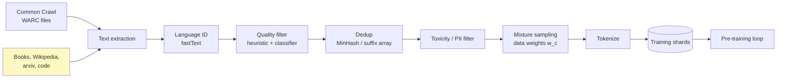
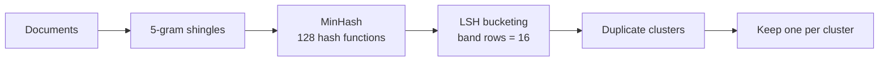
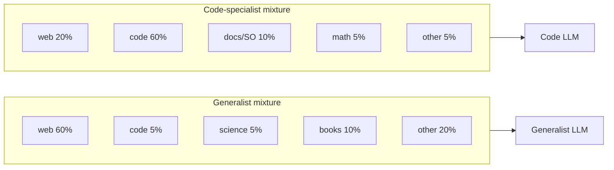

# 1 - Training Data: Multilingual and Domain-Specific Models

[toc]

> **TL;DR:** A foundation model is, more than anything else, *a compressed mirror of its training data*. What's in the corpus determines what the model knows; what's *missing* determines what it can't do; how the corpus is *mixed* (English vs Chinese, code vs prose, scientific vs casual) determines its strengths. This note dissects the modern pre-training data pipeline, why multilingual coverage is uneven, and when you should reach for a domain-specific model instead of a generalist.

## Vocabulary

**Pre-training corpus**

```math
\mathcal{D} = \{d_1, d_2, \ldots, d_M\}, \quad |\mathcal{D}| \sim 10^{12}\text{–}10^{13} \text{ tokens}
```

The set of documents used to train the base model. Modern frontier models train on 5–20 trillion tokens drawn from the web, books, code, papers, and licensed corpora.

---

**Common Crawl**

A monthly public dump of web pages going back to 2008. The single largest input to almost every open LLM corpus, after extensive filtering.

---

**Data mixture**

```math
\mathcal{D} = \bigcup_c w_c \cdot \mathcal{D}_c, \quad \sum_c w_c = 1
```

The chosen sampling weights for different *categories* of data (web, code, math, books, multilingual, …). Set as a hyperparameter; usually tuned empirically because it's expensive to test at scale.

---

**Filtering / quality classifier**

A small ML model (often a fastText classifier or a small LM) used to score each document for "quality" and discard low-quality ones. Hugely influential on final model quality.

---

**Deduplication**

Removing near-duplicate documents — exact, sub-document, and MinHash-similar — to prevent the model from over-memorizing repeated text and to improve effective dataset size.

---

**Multilingual model**

A model trained on multiple languages in roughly balanced proportions, intended to perform well on more than one language family (Llama-3 multilingual, BLOOM, Aya, Qwen).

---

**Domain-specific model**

A model whose training mixture was deliberately concentrated in a single domain (Med-PaLM for medicine, Code Llama for code, BloombergGPT for finance) or whose post-training is heavy on that domain.

## Intuition

Imagine you're the lead designer of a frontier foundation model. The architecture decision is mostly settled (Transformer, decoder-only). The hyperparameters are mostly settled (Chinchilla-style scaling, ~20 tokens per parameter). The variable that's most under your control — and that the smartest teams obsess over — is the *corpus*. Two models with the same parameter count, the same training compute, and the same architecture can differ by 30+ points on benchmarks because one team curated their data better.

A pre-training corpus is built by repeating a loop: *gather → filter → dedupe → mix*. You start with raw web crawls, books, code repos, and scientific papers. You filter out spam, boilerplate, machine-translated junk, and licensed material you can't use. You aggressively deduplicate so that the same StackOverflow answer doesn't appear 200 times. You then *mix* categories at chosen weights — typically heavy on English web text, with smaller slices of code (5–15%), math/science (5–10%), other languages (5–30%), and books. The mixture is the recipe; small changes ripple into very different final models.

The result is a model that mirrors its corpus. If you didn't include Tagalog, the model can't speak Tagalog. If you under-weighted Python, it writes worse Python. If you let the data filter discard scientific text as "low quality" (because it has unusual formatting), the model fails on science questions. Capability is a function of representation in the training set.

## The pre-training data pipeline



Each box is a research area on its own. The teams that win at frontier modeling do *all* of them well. The losers usually have one weak link — typically filtering or dedup — that contaminates everything downstream.

### Filtering — small classifiers, big impact

The fastest way to improve a foundation model in 2026 is *not* to scale parameters; it's to improve the data filter. Modern pipelines use a small classifier (a fastText model, or a 1B-parameter LM) to score every document on "is this useful pre-training data?" then discard the bottom 30–80% of the web.

```python
# Toy quality classifier: train fastText to distinguish high-quality (Wikipedia,
# books) from low-quality (random crawl) and use its score as a filter.
import fasttext

def train_quality_filter(pos_path: str, neg_path: str) -> fasttext.FastText:
    """pos_path: __label__keep documents
       neg_path: __label__discard documents
       Combined into one training file, return classifier."""
    import tempfile, shutil
    with tempfile.NamedTemporaryFile("w", suffix=".txt", delete=False) as f:
        for p, lbl in [(pos_path, "keep"), (neg_path, "discard")]:
            with open(p) as src:
                for line in src:
                    f.write(f"__label__{lbl} {line.strip()}\n")
        train_file = f.name
    return fasttext.train_supervised(train_file, epoch=5, lr=0.1, wordNgrams=2)

def score_doc(model, doc: str) -> float:
    labels, probs = model.predict(doc.replace("\n", " "))
    return float(probs[0]) if labels[0] == "__label__keep" else 1 - float(probs[0])
```

### Deduplication — MinHash and friends

Common Crawl is wildly duplicated: a single news article may appear via the original site, syndicated copies, archive.org, and dozens of scraper aggregators. Without dedup, models memorize popular text and overfit. The dominant tool is **MinHash + LSH**: hash each document into a small signature, bucket near-duplicates, drop all but one per bucket.



The Llama-2 paper reports dedup reduced their CommonCrawl-derived corpus by ~40%. The remaining 60% trained a better model than the full 100% did — duplicates were actively hurting.

## Multilingual models — why coverage is uneven

A pre-training corpus might be 92% English, 2% Chinese, 1% Spanish, 0.5% French, and a long tail of fractions of a percent. The model is competent in English, mediocre in mid-resource languages, and near-useless in low-resource ones. This isn't because the model "doesn't care" about other languages — it's because the *data* doesn't include them at scale.

```math
\text{language capability} \propto \text{token share}^\alpha \quad (\alpha \approx 0.5\text{–}1)
```

A language with 100× less data than English does not get 100× worse — there's transfer between related languages — but it does get *meaningfully* worse, and the gap widens for harder tasks.

```python
# Quick check of how a model fares across languages using a simple loss probe
import torch
from transformers import AutoTokenizer, AutoModelForCausalLM

tok = AutoTokenizer.from_pretrained("meta-llama/Meta-Llama-3-8B")
mdl = AutoModelForCausalLM.from_pretrained("meta-llama/Meta-Llama-3-8B",
                                            torch_dtype=torch.float16).eval().cuda()

probes = {
    "english":   "The capital of France is Paris.",
    "spanish":   "La capital de Francia es París.",
    "swahili":   "Mji mkuu wa Ufaransa ni Paris.",
    "tagalog":   "Ang kabisera ng Pransya ay Paris.",
}

for lang, text in probes.items():
    ids = tok(text, return_tensors="pt").input_ids.cuda()
    with torch.no_grad():
        loss = mdl(ids, labels=ids).loss.item()
    print(f"  {lang:>10s}  per-token loss = {loss:.3f}")
```

Lower loss means the model finds the sentence more probable — a rough proxy for fluency in that language. Expect English to be lowest, mid-resource languages a bit higher, low-resource languages substantially higher.

### Approaches to better multilingual coverage

| Approach | What changes | Tradeoff |
| :--- | :--- | :--- |
| Rebalance pre-training mix | Up-weight low-resource languages during pre-training (Aya, BLOOM, NLLB). | Costly: must redo pre-training. |
| Continued pre-training | Take a strong English-base model, continue training on target-language data. | Cheaper; risk of "catastrophic forgetting" of English. |
| Multilingual tokenizer | Use a tokenizer with good per-language compression. | Tokenizer changes require model retraining. |
| Translation pivot | Translate input to English, run English model, translate output back. | Adds latency + translation errors; useful as a fallback. |
| Multilingual fine-tune | Take a base model, post-train with multilingual SFT + preference data. | Most cost-effective for medium-resource languages. |

## Domain-specific models

A *domain-specific* model is one whose data mixture is heavily skewed toward a target domain, often supplemented with extensive domain SFT. Examples that ship: BloombergGPT (finance), Med-PaLM (medicine), Code Llama / DeepSeek-Coder / Qwen-Coder (code), StarCoder (code), Galactica (science), Llemma (math).



The decision is rarely "domain-specific or generalist?" today. The frontier generalists (GPT-4o, Claude, Llama-3-405B) include enough code and science in their mix that they outperform older domain-specific models on most tasks. The case for a domain-specific model is now narrower:

1. **You need on-device or low-cost inference.** A 7B domain-specific model can match a 70B generalist on its domain at a fraction of the inference cost.
2. **You need behaviors a generalist won't ship.** Medical or legal models tuned for very specific output styles, terminology, or regulatory constraints.
3. **You have proprietary domain data.** A model continued-pretrained on your private corpus has knowledge no generalist has.

> [!IMPORTANT]
> "Domain-specific" beats "generalist" mainly at *small* parameter counts. At frontier scale, the generalist usually wins because data quality + diversity at scale subsumes the domain advantage. Decide based on your *deploy* scale, not on which sounds more impressive.

## In practice

> [!TIP]
> When you suspect a model is weak in your language or domain, *measure first*. Build a held-out eval set of 50–100 representative prompts and score them with [LLM-as-judge](../3-evaluation/5-ai-as-a-judge.md) or domain experts. The intuition that "model X is bad at Korean" is right roughly half the time; the measurement tells you which half.

> [!WARNING]
> Almost every frontier model's training data overlaps with public benchmarks. A model that scores 95% on MMLU may have seen the MMLU test items during pre-training. Treat public benchmark numbers as *upper bounds* on real-world performance and validate on private eval data.

> [!CAUTION]
> Be very careful with PII, copyrighted text, and consent. Pre-training datasets have been the subject of multiple lawsuits in 2023–2026 (NYT v. OpenAI, authors' guild suits, Getty v. Stable Diffusion). If you're curating data for your own model, get legal sign-off on every category before training; once a model has memorized text it can leak it, and you can't *unlearn* surgically.

A growing trend is **synthetic data** — using a strong LLM to generate training data for a weaker one (knowledge distillation, instruction generation). It scales much better than human curation and can fill specific capability gaps cheaply. Most modern post-training pipelines (covered in [Post-Training](./3-post-training-and-finetuning.md)) lean heavily on synthetic data.

## Pitfalls

- **"More data is always better."** Past a point, *quality* matters more than quantity. A 2T-token corpus with 99th-percentile filters often beats a 10T-token corpus with weak filters.
- **"The model knows X because X is on the internet."** Not necessarily — X may have been filtered out, deduplicated away, or never indexed by Common Crawl in the first place. Test, don't assume.
- **"Domain-specific = always better in that domain."** Only if the domain-specific model has been kept up to date with frontier post-training. A 2-year-old domain model can be worse than a current generalist.
- **"I can just translate my data and train multilingual."** Machine-translated training data is detectable and degrades model quality. Use natively written text when possible.
- **"Dedup is a one-time thing."** Run dedup *within* the corpus *and* between train and eval sets. Train-eval overlap is the single most common reason for over-optimistic benchmark numbers.

## Exercises

### Exercise 1 — Estimate data mixture for a regulated industry chatbot

You're building a healthcare-question-answering chatbot for U.S. clinicians. You can choose any base model and continue-pretrain it on data you control. Sketch the ideal data mixture and justify each component.

#### Solution

Sample mixture for ~50B tokens of continued pre-training on top of a strong 70B generalist:

- **Medical literature (40%)** — PubMed abstracts, full-text open-access journals, UpToDate (if licensed), clinical-guideline PDFs.
- **De-identified clinical notes (15%)** — internal EHR notes after rigorous PII removal and IRB approval.
- **Drug + dose references (10%)** — FDA labels, drug-interaction databases, pharmacology textbooks.
- **General medical Q&A (10%)** — MedQA, USMLE prep, board-review materials.
- **General English web (20%)** — keep general fluency; without this the model "forgets" everyday language.
- **Code + structured data (5%)** — light, for any potential structured-output workflows.

Justification: clinicians ask medical questions in everyday language; the model needs both deep medical knowledge AND the ability to converse normally. Without the 20% general slice, the model becomes a stilted medical-terminology bot. Without the 40% medical slice, it lacks the deep knowledge a generalist doesn't have.

---

### Exercise 2 — Detect train-eval contamination

You suspect your eval set leaked into your training corpus. Describe a procedure to detect contamination without retraining.

#### Solution

1. **Exact-substring search.** For each eval example, search for a long contiguous substring (e.g. 50+ characters of the question text) in the training shards. Any match is direct contamination.
2. **n-gram overlap.** Compute the fraction of 13-grams in each eval example that appear anywhere in the training corpus. High n-gram overlap with no exact-string match suggests near-duplicate contamination.
3. **MinHash similarity.** Run MinHash on the eval set against a MinHash index of the training corpus. Any pair with Jaccard similarity above a threshold (~0.5 on shingles) is suspicious.
4. **Memorization probe.** For each suspicious eval example, prompt the model with the first half and check whether it completes the second half *verbatim*. Verbatim completion of held-out text is strong evidence of memorization.
5. **Per-example loss test.** Compute per-example loss on the eval set; suspiciously low loss on a small subset suggests those items were seen during training.

Mitigation: remove contaminated examples from the eval set, or rebuild eval from sources known to post-date the training cutoff.

---

### Exercise 3 — Should we fine-tune Llama for our domain, or use GPT-4o?

A startup wants to build a code-review assistant for embedded C firmware. They have 10k pairs of (code patch, human review comment). Should they (a) fine-tune Llama-3-8B on their data, (b) prompt-engineer GPT-4o, or (c) something else?

#### Solution

Start with **(b) prompt-engineer GPT-4o** as the baseline. It's the fastest path to a working product, and GPT-4o is genuinely strong on C code. Use few-shot examples drawn from the 10k pairs. Track quality on a held-out eval set.

If quality is sufficient → ship (b). If not → try **(c) RAG over the 10k pairs**: retrieve the closest 5 historical (patch, comment) pairs as few-shot examples per query, dynamically. This typically beats static few-shot.

If still insufficient → **fine-tune Llama-3-8B-Instruct** (option a) on the 10k pairs. Embedded C is unusual enough that a fine-tune may capture domain idioms a generalist misses; 8B is cheap to host. Reserve full pre-training only if you have *millions* of code-review pairs (you don't).

Decision rule: prefer the cheaper-to-iterate approach until quality demands escalation. Don't fine-tune as a first move.

---

### Exercise 4 — Why is your model bad at Vietnamese?

A multilingual model performs well on 5 European languages and Mandarin but is significantly worse on Vietnamese. List three plausible root causes and propose a diagnostic.

#### Solution

**Cause 1 — token share in pre-training data.** Vietnamese was under-represented in the corpus. Diagnostic: ask the training team for the per-language token share; expect Vietnamese to be < 1% if this is the cause.

**Cause 2 — tokenizer fertility.** The tokenizer fragments Vietnamese words (with their tone marks and compound structures) into many subword pieces. Diagnostic: compute tokens-per-character on Vietnamese vs English samples; a Vietnamese fertility of 2× or more vs English signals a tokenizer problem. See [Tokens and Tokenization](../1-foundations/1-tokens-and-tokenization.md).

**Cause 3 — evaluation mismatch.** The Vietnamese eval set may be harder, lower-quality, or differently distributed than the European-language sets. Diagnostic: have native speakers grade a sample; check translation quality of the eval set; if the eval was created by machine translation it may itself be flawed.

Fix: usually 1+2 together. Continued pre-training on a high-quality Vietnamese corpus, optionally with tokenizer extension (adding Vietnamese-specific tokens and warming their embeddings).

## Sources

- Touvron, H. et al. (2023). *Llama 2: Open Foundation and Fine-Tuned Chat Models*. https://arxiv.org/abs/2307.09288
- Computer, T. (2023). *RedPajama: An Open Source Recipe to Reproduce LLaMA training dataset*. https://www.together.ai/blog/redpajama
- Penedo, G. et al. (2023). *The RefinedWeb Dataset for Falcon LLM*. https://arxiv.org/abs/2306.01116
- Soldaini, L. et al. (2024). *Dolma: an Open Corpus of Three Trillion Tokens for Language Model Pretraining Research*. https://arxiv.org/abs/2402.00159
- Lee, K. et al. (2022). *Deduplicating Training Data Makes Language Models Better*. https://arxiv.org/abs/2107.06499
- Wu, S. et al. (2023). *BloombergGPT: A Large Language Model for Finance*. https://arxiv.org/abs/2303.17564
- Singhal, K. et al. (2023). *Towards Expert-Level Medical Question Answering with Large Language Models* (Med-PaLM 2). https://arxiv.org/abs/2305.09617
- Workshop, BigScience (2022). *BLOOM: A 176B-Parameter Open-Access Multilingual Language Model*. https://arxiv.org/abs/2211.05100
- Huyen, C. (2024). *AI Engineering*, Chapter 2.

## Related

- [Tokens and Tokenization](../1-foundations/1-tokens-and-tokenization.md)
- [2 - Architecture and Model Size](./2-architecture-and-model-size.md)
- [3 - Post-Training and Fine-tuning](./3-post-training-and-finetuning.md)
- [Methodology and Challenges of Evaluation](../3-evaluation/1-methodology-and-challenges.md)
