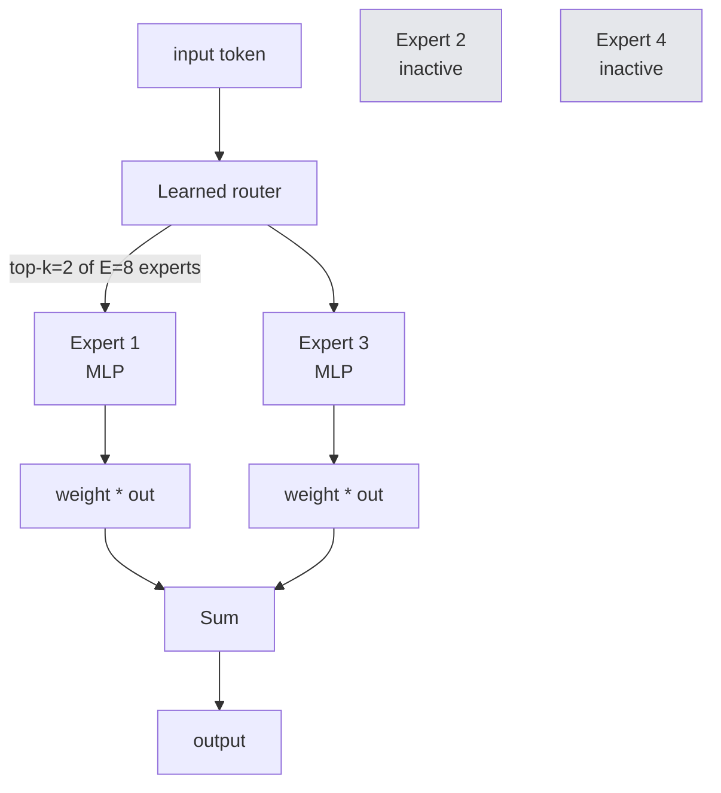

# 2 - Model Architecture and Size (Scaling Laws)

[toc]

> **TL;DR:** Modern foundation models are decoder-only Transformers; the architecture is a near-commodity. What varies — and what determines capability — is *size* (parameters), *data* (tokens), and *compute* (FLOPs). The **Chinchilla scaling laws** tell us the optimal ratio between them: roughly 20 tokens per parameter for compute-optimal training. Below that, you're undertrained; above that, you're spending compute that would've gone further into a smaller model trained longer.

## Vocabulary

**Transformer**

The architecture introduced by Vaswani et al. (2017). A stack of *self-attention* + *feed-forward* blocks. The substrate of essentially every modern LLM.

---

**Decoder-only Transformer**

A Transformer that uses only the decoder stack (causal self-attention + MLP). The dominant architecture for generative LLMs since GPT-2.

---

**Hidden dimension `d`**

```math
d = d_\text{model}
```

The width of every token's vector representation as it flows through the network. Typical values: 768 (small), 4096 (7B-ish), 12288 (frontier scale).

---

**Number of layers `L`**

How many Transformer blocks are stacked. Typical values: 12, 32, 80, 126.

---

**Attention head**

A parallel attention computation operating on a slice of the hidden dimension. Multi-head attention runs `h` heads in parallel and concatenates.

---

**Mixture of Experts (MoE)**

An architecture where each MLP block is replaced by `E` "expert" MLPs, with a learned router that activates only `k` of them per token. Decouples *total* parameters from *active* parameters.

---

**Scaling law**

```math
\mathcal{L}(N, D) = A N^{-\alpha} + B D^{-\beta} + L_\infty
```

An empirical fit relating loss `L` to parameters `N` and tokens `D`. Used to extrapolate from small training runs to large ones — and to predict the best `(N, D)` for a fixed compute budget.

---

**Compute budget `C`**

```math
C \approx 6 N D \quad (\text{FLOPs})
```

The training FLOPs to train a dense `N`-parameter model on `D` tokens, approximated for autoregressive Transformers.

## Intuition

When you read "Llama-3-70B" or "Gemini-Ultra," the most important number is the parameter count, but it's misleading on its own. A model is a *function* parameterized by weights, and capability comes from the *joint* product of three knobs: how many weights you have, how much data they were trained on, and how many FLOPs of optimization they saw. Push any one of these too high relative to the others and you waste resources. The Chinchilla scaling laws, published by DeepMind in 2022, quantified this for the first time and shifted the field from "bigger model" to "bigger budget allocated correctly."

The architecture itself, while subtle in detail, is remarkably consistent across the frontier. Take a tokenizer, an embedding table, a stack of Transformer blocks (causal attention + MLP + residuals + layer norms), and an output projection back to vocabulary space. Tweak the position encoding (RoPE), the activation (SwiGLU), the normalization (RMSNorm), and the attention pattern (GQA, sliding-window). The differences between Llama-3, Qwen, and DeepSeek-V3 add up to a few percentage points; the *data* and *post-training* explain most of the gap.

The architectural innovation that *did* break the mold is Mixture of Experts (MoE). A dense 70B model uses every parameter on every token; an MoE with 671B total parameters and 37B active uses only a small slice per token. This gives you the *knowledge* of a huge model with the *inference cost* of a small one — at the cost of much harder training and serving infrastructure. DeepSeek-V3, Mixtral, and most frontier 2025–2026 models use MoE for this reason.

## Anatomy of a decoder-only Transformer

```mermaid
flowchart TB
  IN[Input tokens<br/>ids] --> EMB[Embedding table<br/>vocab × d]
  EMB --> POS[+ positional info<br/>RoPE]
  POS --> B1[Block 1]
  B1 --> B2[Block 2]
  B2 --> BDOT[...]
  BDOT --> BL[Block L]
  BL --> NORM[Final layer norm]
  NORM --> OUTP[Output projection<br/>d × vocab]
  OUTP --> LOGITS[Logits over vocab]
  LOGITS --> SOFT[Softmax → P(next token)]

  subgraph block[Inside each block]
    direction TB
    X[input] --> N1[LayerNorm]
    N1 --> ATTN[Causal multi-head attention]
    ATTN --> R1["+ residual"]
    R1 --> N2[LayerNorm]
    N2 --> MLP[MLP / SwiGLU]
    MLP --> R2["+ residual"]
    R2 --> Y[output]
  end
```

A block has two sub-layers — attention and MLP — each wrapped in pre-norm + residual. Stack `L` blocks. Done. The whole architecture is fewer than 500 lines of clean PyTorch.

```python
import torch
import torch.nn as nn
import torch.nn.functional as F

class CausalSelfAttention(nn.Module):
    def __init__(self, d: int, n_heads: int) -> None:
        super().__init__()
        assert d % n_heads == 0
        self.n_heads = n_heads
        self.d_head = d // n_heads
        self.qkv = nn.Linear(d, 3 * d, bias=False)
        self.proj = nn.Linear(d, d, bias=False)

    def forward(self, x: torch.Tensor) -> torch.Tensor:
        B, T, D = x.shape
        qkv = self.qkv(x).reshape(B, T, 3, self.n_heads, self.d_head)
        q, k, v = qkv.unbind(dim=2)                  # [B, T, h, d_h]
        q, k, v = (t.transpose(1, 2) for t in (q, k, v))  # [B, h, T, d_h]
        # PyTorch's fused causal attention (Flash-Attn under the hood when available)
        out = F.scaled_dot_product_attention(q, k, v, is_causal=True)
        out = out.transpose(1, 2).reshape(B, T, D)
        return self.proj(out)

class TransformerBlock(nn.Module):
    def __init__(self, d: int, n_heads: int, mlp_mult: int = 4) -> None:
        super().__init__()
        self.ln1 = nn.LayerNorm(d)
        self.attn = CausalSelfAttention(d, n_heads)
        self.ln2 = nn.LayerNorm(d)
        self.mlp = nn.Sequential(
            nn.Linear(d, mlp_mult * d),
            nn.GELU(),
            nn.Linear(mlp_mult * d, d),
        )

    def forward(self, x: torch.Tensor) -> torch.Tensor:
        x = x + self.attn(self.ln1(x))
        x = x + self.mlp(self.ln2(x))
        return x

class TinyGPT(nn.Module):
    def __init__(self, vocab: int, d: int = 512, L: int = 6, n_heads: int = 8,
                 max_T: int = 1024) -> None:
        super().__init__()
        self.token_emb = nn.Embedding(vocab, d)
        self.pos_emb = nn.Embedding(max_T, d)
        self.blocks = nn.ModuleList([TransformerBlock(d, n_heads) for _ in range(L)])
        self.ln = nn.LayerNorm(d)
        self.head = nn.Linear(d, vocab, bias=False)

    def forward(self, ids: torch.Tensor) -> torch.Tensor:
        B, T = ids.shape
        pos = torch.arange(T, device=ids.device)
        x = self.token_emb(ids) + self.pos_emb(pos)
        for block in self.blocks:
            x = block(x)
        return self.head(self.ln(x))   # logits over vocab

mdl = TinyGPT(vocab=50_000, d=512, L=6, n_heads=8)
n_params = sum(p.numel() for p in mdl.parameters())
print(f"{n_params/1e6:.1f} M parameters")
```

That's a working decoder-only LM in 50 lines. The full Llama-3 architecture differs in details (RoPE instead of learned positional embeddings, RMSNorm instead of LayerNorm, SwiGLU instead of GELU, GQA instead of full MHA) but the shape is identical.

## Key architectural choices

| Choice | Old default | Modern default | Why the change |
| :--- | :--- | :--- | :--- |
| Position encoding | Learned absolute | **RoPE** (rotary) | Better length extrapolation; no fixed max length baked in. |
| Normalization | LayerNorm | **RMSNorm** | Slightly faster, slightly better. |
| MLP activation | GELU | **SwiGLU** | Marginal quality improvement; small extra compute. |
| Attention type | Multi-head (MHA) | **GQA** (grouped-query) | Same quality, much less KV-cache memory at inference. |
| Norm placement | post-norm | **pre-norm** | Easier to train deep stacks; stable gradients. |
| Bias terms | Linear with bias | bias=False on linears | Negligible quality cost; cleaner gradient math. |

> [!NOTE]
> Architecture in 2026 is a near-commodity. The differences between top-tier decoder-only Transformers are small, and most "secret sauce" is in the *data* and *post-training* pipeline. Don't agonize over picking the right base architecture if you're training from scratch; copy a recent recipe (Llama-3, Qwen-2.5, DeepSeek-V3) and focus your effort on data.

## Mixture of Experts



In an MoE block, the dense MLP is replaced by `E` parallel MLPs. A small router scores the input and selects the top `k` (often `k = 2`). Only those `k` experts run for that token; the rest are skipped. The headline metric becomes *total parameters* vs *active parameters*.

```math
\text{FLOPs}_{\text{MoE}} \approx \frac{k}{E} \cdot \text{FLOPs}_{\text{dense-equivalent}}
```

For DeepSeek-V3: 671B total, 37B active per token, `k=8` of 256 routed experts. The model has roughly the *knowledge capacity* of a 671B dense model and the *inference cost* of a 37B dense model. The downside: training MoE is finicky (load balancing across experts) and serving them is memory-intensive (must hold all experts in GPU memory, even idle ones).

## Scaling laws — the Chinchilla finding

Until 2022, the conventional wisdom was "scale up parameters; data is essentially infinite." Hoffmann et al. (DeepMind, 2022) showed that prevailing models — Gopher (280B), MT-NLG (530B) — were *severely undertrained*. They demonstrated that for a fixed compute budget `C`, loss is minimized when parameters `N` and tokens `D` scale roughly equally:

```math
N_{\text{opt}} \propto C^{0.5}, \qquad D_{\text{opt}} \propto C^{0.5}, \qquad D_{\text{opt}} \approx 20 \cdot N_{\text{opt}}
```

The "Chinchilla rule": **about 20 tokens per parameter** for compute-optimal training. A 70B model wants ~1.4T tokens; a 405B model wants ~8.1T tokens. Modern training runs often *over*-train deliberately past Chinchilla optimality (Llama-3 trained the 8B and 70B on 15T tokens), because inference cost matters: a smaller model trained on more data is cheaper to serve.

```math
\mathcal{L}(N, D) = \underbrace{\frac{A}{N^\alpha}}_{\text{capacity}} + \underbrace{\frac{B}{D^\beta}}_{\text{data}} + L_\infty
```

The DeepMind fit:

| Parameter | Value |
| :--- | ---: |
| `A` | 406.4 |
| `B` | 410.7 |
| `α` | 0.34 |
| `β` | 0.28 |
| `L_∞` | 1.69 |

These are not laws of nature — they are empirical fits on one architecture, one tokenizer, one dataset. Don't extrapolate them beyond the regime they were fit on. But the qualitative shape (loss has separable capacity and data terms, with optimum at a specific ratio) is robust.

```python
def chinchilla_loss(N: float, D: float) -> float:
    """Predicted loss for an N-parameter model trained on D tokens."""
    return 406.4 / (N ** 0.34) + 410.7 / (D ** 0.28) + 1.69

def chinchilla_optimal(C: float) -> tuple[float, float]:
    """Given a compute budget C (FLOPs), return (N_opt, D_opt)."""
    # Approximation: D_opt ≈ 20 * N_opt and C ≈ 6 N D
    # => C ≈ 120 N^2 => N_opt = sqrt(C / 120)
    N_opt = (C / 120) ** 0.5
    D_opt = 20 * N_opt
    return N_opt, D_opt

C_total = 1e23  # ~ Llama-3-8B compute budget
N, D = chinchilla_optimal(C_total)
print(f"Compute-optimal: N ≈ {N/1e9:.1f} B params, D ≈ {D/1e12:.1f} T tokens")
print(f"Predicted loss: {chinchilla_loss(N, D):.2f}")
```

## Inference cost vs Chinchilla optimality

> [!IMPORTANT]
> Compute-optimal training minimizes loss for a fixed *training* budget. It does **not** minimize inference cost. A smaller model trained on more tokens than Chinchilla suggests will have slightly higher training loss but much lower per-query inference cost. Llama-3-8B at 15T tokens is a clear instance: it's "over-trained" by Chinchilla but cheaper to deploy than a Chinchilla-optimal 14B on 280B tokens.

For a serving-heavy workload, the right framing is:

```math
\text{total cost} = \underbrace{C_{\text{train}}}_{\text{one-time}} + \underbrace{N_{\text{infer per query}} \cdot \text{queries}}_{\text{linear in users}}
```

If your model serves billions of queries, you want to push smaller and over-train. If your model is a one-shot research artifact that nobody will ever use, follow Chinchilla.

## In practice

> [!TIP]
> Choose your model *size* based on serving budget and latency requirement first, not on capability ceiling. A 7B model at 50 ms/token may be the right answer even if 70B is 5 points higher on a benchmark; for many products, latency dominates user experience.

> [!CAUTION]
> Don't confuse "active parameters" with "memory footprint" for MoE. A 37B-active / 671B-total model still requires ~1.3 TB of weights at fp16 in GPU memory because all experts must be resident. Active-parameter counts predict FLOPs and quality; they don't predict VRAM.

The frontier is differentiating along three axes: (1) longer context (1M+ tokens via efficient attention and RAG hybrids); (2) MoE sparsity (active << total); (3) post-training quality (covered next note). Architecture proper is unlikely to be your differentiator.

## Pitfalls

- **"More layers always better than wider."** Width and depth trade off non-trivially. At fixed parameter count, an aspect ratio of `d/L ≈ 100–150` is roughly optimal for Transformer LMs; deeper-and-thinner trains harder and gains little.
- **"Attention dominates compute."** For typical hidden sizes and context lengths, MLP layers consume ~2/3 of FLOPs. Attention only becomes the bottleneck at very long context (where it's quadratic).
- **"Scaling laws hold forever."** They hold within the regime they were fit on. Past `~10²³` FLOPs the field has limited public data; extrapolating Chinchilla to 10²⁶ FLOPs is speculative.
- **"MoE is strictly better."** Easier serving (uniform memory access), simpler training, and better inference batching are reasons many production teams still prefer dense models at small-to-mid scale.
- **"Bigger context is free."** Doubling context doubles KV-cache memory and (with vanilla attention) quadruples attention FLOPs. Long-context support comes from algorithmic + systems work (Flash-Attn, paged attention, sliding-window), not architecture-only tricks.

## Exercises

### Exercise 1 — Compute the compute-optimal model for a budget

You have a budget of `C = 5 × 10²²` FLOPs (about $200k of H100 time). What parameter count and token count does Chinchilla predict?

#### Solution

```math
N_\text{opt} = \sqrt{C / 120} = \sqrt{5 \times 10^{22} / 120} = \sqrt{4.17 \times 10^{20}} \approx 2.04 \times 10^{10} = 20.4\ \text{B}
```

```math
D_\text{opt} = 20 N_\text{opt} \approx 4.1 \times 10^{11} = 410\ \text{B tokens}
```

So roughly a **20B-parameter model on 410B tokens**. Cross-check: `6 × 20B × 410B ≈ 4.92 × 10²²` FLOPs ✓.

In practice you might over-train slightly: maybe **15B on 600B tokens** for a model that's cheaper at inference, accepting modestly higher training loss.

---

### Exercise 2 — Compare dense vs MoE inference cost

Dense model A: 70B parameters, all active per token. MoE model B: 220B total parameters, 32B active per token (k=2 of E=16 experts). Assume identical context and identical kernel efficiency. (a) Which has lower inference FLOPs per token? (b) Which has higher VRAM requirement? (c) Which would you pick for an autocomplete product?

#### Solution

**(a)** Inference FLOPs per token is governed by active parameters: B uses 32B active vs A's 70B. B is roughly **2.2× cheaper per token** on FLOPs.

**(b)** VRAM is governed by *total* parameters that must be resident. A: 70B × 2 bytes (fp16) = 140 GB. B: 220B × 2 bytes = 440 GB. B is **3.1× more VRAM-hungry**, requiring much larger / more numerous GPUs.

**(c)** Autocomplete is latency-critical and high-QPS. The deciding factor is whether you can afford the bigger machine. If you have B200s or H200s with enough VRAM, B is attractive because higher *capability per FLOP*. If you're hosting on a budget cluster of A100s, A may be the only feasible choice. Latency-wise both are similar (FLOPs is the bottleneck), so the decision is pure infrastructure.

---

### Exercise 3 — Sketch a TinyGPT training loop

Extend the `TinyGPT` code above with a minimal training loop on a toy dataset (predict next byte in a string). Show how the causal loss is computed.

#### Solution

```python
import torch
import torch.nn.functional as F

def train_step(model, batch_ids: torch.Tensor, optim: torch.optim.Optimizer) -> float:
    """batch_ids: [B, T+1]. We predict positions 1..T from positions 0..T-1."""
    inputs = batch_ids[:, :-1]
    targets = batch_ids[:, 1:]
    logits = model(inputs)                       # [B, T, V]
    loss = F.cross_entropy(
        logits.reshape(-1, logits.size(-1)),
        targets.reshape(-1),
    )
    optim.zero_grad()
    loss.backward()
    torch.nn.utils.clip_grad_norm_(model.parameters(), 1.0)
    optim.step()
    return loss.item()

# Toy data: byte-level over the bee movie script
data = open("bee_movie.txt", "rb").read()
ids = torch.tensor([b for b in data], dtype=torch.long)

mdl = TinyGPT(vocab=256, d=256, L=4, n_heads=4, max_T=256).cuda()
optim = torch.optim.AdamW(mdl.parameters(), lr=3e-4)

B, T = 32, 128
for step in range(2000):
    start = torch.randint(0, len(ids) - T - 1, (B,))
    batch = torch.stack([ids[s:s+T+1] for s in start]).cuda()
    loss = train_step(mdl, batch, optim)
    if step % 100 == 0:
        print(f"step {step:>4d}  loss = {loss:.3f}")
```

Key points: the target is the input *shifted by one*, all `T` positions contribute to the loss in one pass, and gradient-clipping at norm 1.0 is the standard recipe to prevent the rare exploding-gradient batches that destroy a long training run.

---

### Exercise 4 — Why is the Chinchilla ratio ~20, not ~1?

Explain in two paragraphs why compute-optimal training favors *more data per parameter*, not equal amounts.

#### Solution

The training-compute approximation `C ≈ 6 N D` means doubling `N` *or* doubling `D` costs the same compute. If both gave equal loss reduction, you'd be indifferent. But the loss surface isn't symmetric: empirically, doubling parameters gives diminishing capacity gains, while doubling tokens gives diminishing data-noise gains *at a different rate*. The DeepMind exponents `α ≈ 0.34` (capacity) and `β ≈ 0.28` (data) are similar but not equal; their relative magnitudes set where the optimum sits.

Solving the Lagrangian — minimize loss subject to `C ≈ 6 N D` — gives `D/N ≈ 20` (the precise number depends on the fit). Intuitively: a small model trained on a vast corpus *eventually* saturates because it doesn't have enough capacity to represent everything; a huge model trained on tiny data *never* sees enough examples to learn. The balance lies where marginal returns on adding a parameter equal marginal returns on adding a token, which happens at the ratio that data is "wider" than capacity by a factor of ~20.

## Sources

- Vaswani, A. et al. (2017). *Attention Is All You Need*. https://arxiv.org/abs/1706.03762
- Hoffmann, J. et al. (2022). *Training Compute-Optimal Large Language Models* (Chinchilla). https://arxiv.org/abs/2203.15556
- Kaplan, J. et al. (2020). *Scaling Laws for Neural Language Models*. https://arxiv.org/abs/2001.08361
- Su, J. et al. (2021). *RoFormer: Enhanced Transformer with Rotary Position Embedding* (RoPE). https://arxiv.org/abs/2104.09864
- Shazeer, N. (2020). *GLU Variants Improve Transformer*. https://arxiv.org/abs/2002.05202
- Ainslie, J. et al. (2023). *GQA: Training Generalized Multi-Query Transformer Models*. https://arxiv.org/abs/2305.13245
- DeepSeek-AI (2024). *DeepSeek-V3 Technical Report*. https://arxiv.org/abs/2412.19437
- Fedus, W. et al. (2022). *Switch Transformers*. https://arxiv.org/abs/2101.03961
- Huyen, C. (2024). *AI Engineering*, Chapter 2.

## Related

- [Language Models: Autoregressive vs Masked](../1-foundations/2-language-models.md)
- [1 - Training Data and Domains](./1-training-data-and-domains.md)
- [3 - Post-Training and Fine-tuning](./3-post-training-and-finetuning.md)
- [4 - Sampling and Decoding](./4-sampling-and-decoding.md)
- [Entropy, Cross-Entropy, and Perplexity](../3-evaluation/2-entropy-cross-entropy-perplexity.md)
