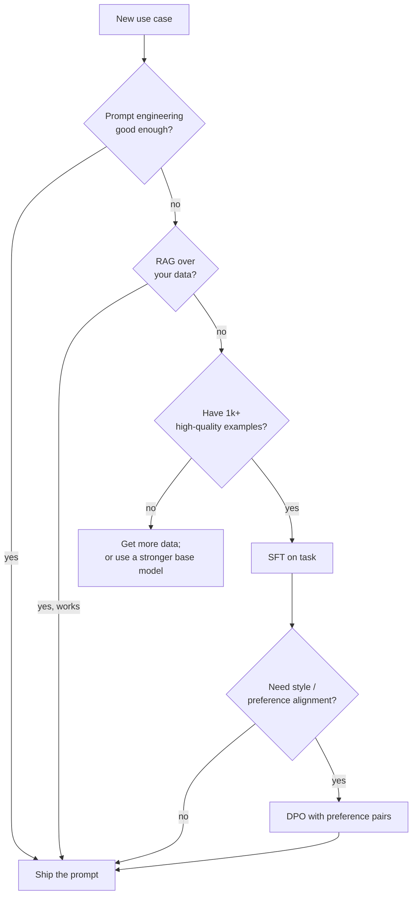

# 3 - Post-Training: SFT vs Preference Fine-tuning

[toc]

> **TL;DR:** A base pre-trained LM is a powerful pattern matcher but does not follow instructions, refuse harm, or have a consistent persona. *Post-training* transforms the base model into a useful product. It has two main stages: **Supervised Fine-Tuning (SFT)** on `(prompt, ideal-response)` pairs to teach instruction following, then **preference fine-tuning** (RLHF, DPO, or KTO) on `(prompt, chosen, rejected)` triples to teach the model what humans actually like. Together they are why ChatGPT is helpful and the raw GPT-4 base model is just a chaotic autocomplete.

## Vocabulary

**Pre-training**

The initial expensive training that turns random weights into a base model via self-supervised next-token prediction. Cost: 10⁶–10⁸ GPU-hours.

---

**Post-training**

Everything done to a model *after* pre-training to make it useful: SFT, preference tuning, safety training, capability fine-tuning. Cost: orders of magnitude less than pre-training but determines product quality.

---

**Supervised Fine-Tuning (SFT)**

```math
\mathcal{L}_{\text{SFT}} = -\mathbb{E}_{(x, y) \sim \mathcal{D}}\big[\log P_\theta(y \mid x)\big]
```

Fine-tuning on labeled `(input, ideal-output)` pairs with the same next-token objective as pre-training. Teaches the model to follow instructions and to produce outputs in a target format.

---

**Reinforcement Learning from Human Feedback (RLHF)**

A three-stage pipeline: SFT → train a reward model on human preferences → RL-optimize the policy against the reward model with PPO. The classic post-training recipe.

---

**Direct Preference Optimization (DPO)**

```math
\mathcal{L}_{\text{DPO}} = -\mathbb{E}\left[\log \sigma\left(\beta \log \frac{\pi_\theta(y_w \mid x)}{\pi_\text{ref}(y_w \mid x)} - \beta \log \frac{\pi_\theta(y_l \mid x)}{\pi_\text{ref}(y_l \mid x)}\right)\right]
```

A closed-form alternative to RLHF that skips the explicit reward model. Optimizes the policy directly on `(chosen, rejected)` pairs. Cheaper and more stable than RLHF/PPO; now the dominant preference-tuning recipe.

---

**LoRA (Low-Rank Adaptation)**

```math
W \to W + B A, \quad B \in \mathbb{R}^{d \times r},\ A \in \mathbb{R}^{r \times d},\ r \ll d
```

A *parameter-efficient* fine-tuning method that freezes the original weights and learns a small low-rank update. Typical rank `r = 8–64` reduces trainable parameters by 100×–1000×.

---

**Catastrophic forgetting**

The phenomenon where fine-tuning on a narrow task degrades the model's general capabilities. The single biggest risk in post-training.

## Intuition

A freshly pre-trained model is, in its raw form, completing text — not answering questions. Ask it "What is the capital of France?" and it may continue with another question rather than answer. Ask it to write code and it may continue your prompt rather than help. The model has all the *knowledge* it needs (it has seen millions of Q&A pairs), but it doesn't know that *right now you want the answer behavior, not the continuation behavior*. Post-training installs this knowledge.

The two stages do two different jobs. SFT teaches *format and instruction following*: "When a user asks something in a chat template, produce a helpful answer in this style." You curate a few thousand to a few million high-quality (instruction, ideal-response) pairs and fine-tune with the standard next-token loss. The model learns to play the assistant role. The hard part isn't the training — it's the data: writing thousands of ideal responses by hand is expensive, and bad SFT data can poison the model.

Preference fine-tuning teaches *which of several plausible answers humans prefer*. SFT gives you a model that's polite and follows the format; preference tuning gives you one that's *actually good*. You collect human comparisons (`response A is better than response B`) and then either train a reward model and run RL (RLHF) or directly optimize the policy to satisfy the preferences (DPO). Either way, the model gets nudged toward "what humans like to read" rather than "what's most likely to come next."

## The post-training pipeline

```mermaid
flowchart LR
  PRE["Pre-trained base model<br/>~10^7 GPU-hr"] --> SFT[Supervised<br/>Fine-Tuning]
  SFT --> SFT_MODEL[SFT model<br/>follows instructions]
  SFT_MODEL --> PREF{Preference method}
  PREF -->|RLHF| RM[Train Reward Model<br/>on human comparisons]
  RM --> PPO[PPO: RL against reward<br/>+ KL penalty to SFT model]
  PREF -->|DPO/KTO/IPO| DPO[Direct preference loss<br/>on (chosen, rejected)]
  PPO --> ALIGNED[Aligned chat model]
  DPO --> ALIGNED
  ALIGNED --> SAFETY[Safety RL / red-teaming]
  SAFETY --> SHIP[Shipped product]

  classDef big fill:#fef9c3
  class PRE big
```

Modern frontier models (Llama-3-Instruct, GPT-4o, Claude) iterate this loop multiple times — SFT, then DPO, then more SFT on new data, then more DPO, alternating. Each round nudges the model in a specific direction.

## SFT in detail

The SFT loss is the same cross-entropy used during pre-training, but applied to a curated dataset of (prompt, ideal-response) pairs, and computed *only on the response tokens* (the prompt is masked out).

```python
import torch
import torch.nn.functional as F

def sft_loss(model, tokenizer, prompt: str, response: str) -> torch.Tensor:
    """Compute next-token loss on response tokens only (prompt is masked)."""
    prompt_ids = tokenizer(prompt, return_tensors="pt").input_ids[0]
    full_ids = tokenizer(prompt + response, return_tensors="pt").input_ids[0]
    targets = full_ids.clone()
    targets[:len(prompt_ids)] = -100   # ignore_index — prompt tokens don't count
    inputs = full_ids[:-1].unsqueeze(0)
    labels = targets[1:].unsqueeze(0)
    logits = model(inputs).logits
    return F.cross_entropy(
        logits.reshape(-1, logits.size(-1)),
        labels.reshape(-1),
        ignore_index=-100,
    )
```

The data is everything. A typical SFT dataset for a generalist chat model has 10k–1M examples covering: open-ended QA, code, math, refusals, multi-turn dialog, format following (JSON, markdown), tool use. Famous open SFT datasets: Alpaca, OpenAssistant, ShareGPT, Tülu-3, Magpie, UltraChat. The trend is increasingly toward **synthetic data**: use a strong frontier model to generate or score SFT pairs, then filter aggressively.

> [!IMPORTANT]
> SFT data quality matters more than quantity. A clean 5k-example SFT dataset can produce a better model than a noisy 500k one. The single highest-ROI activity in post-training is *manually reading your SFT data* and removing low-quality examples.

## Preference fine-tuning: RLHF vs DPO

### RLHF — the classic three-stage pipeline

```mermaid
flowchart LR
  SFT_MODEL[SFT model] --> SAMPLES[Sample N candidate<br/>responses per prompt]
  SAMPLES --> HUMAN[Humans rank<br/>or pick best]
  HUMAN --> RM_TRAIN[Train reward model<br/>RM(prompt, response)]
  RM_TRAIN --> RM[Reward model]
  SFT_MODEL --> POLICY[Policy = SFT init]
  POLICY --> PPO_GEN[Generate from policy]
  PPO_GEN --> SCORE[RM scores]
  SCORE --> PPO[PPO update<br/>+ KL penalty]
  PPO --> POLICY
  POLICY --> OUT[Aligned model]
```

The reward model is a small (often the same size as the base) regression head trained on human pairwise comparisons. Once trained, you use PPO to optimize the policy LM to maximize reward — with a *KL penalty* against the SFT model so the policy doesn't drift into reward-hacking nonsense.

```math
\mathcal{L}_{\text{RLHF}} = -\mathbb{E}_{x, y \sim \pi_\theta}\big[r_\phi(x, y)\big] + \beta \, \text{KL}\big(\pi_\theta(\cdot \mid x) \,\|\, \pi_\text{ref}(\cdot \mid x)\big)
```

PPO is finicky to tune. Real-world RLHF requires careful reward-model calibration, learning-rate schedules, and curated rollout prompts. Many teams have tried and given up.

### DPO — skip the reward model

In 2023, Rafailov et al. showed that you can directly optimize the policy on preference pairs without a separate reward model. The DPO loss reuses the *same* (chosen, rejected) preferences and derives a closed-form objective:

```math
\mathcal{L}_{\text{DPO}} = -\mathbb{E}_{(x, y_w, y_l)}\left[\log \sigma\!\left(\beta \log \frac{\pi_\theta(y_w \mid x)}{\pi_\text{ref}(y_w \mid x)} - \beta \log \frac{\pi_\theta(y_l \mid x)}{\pi_\text{ref}(y_l \mid x)}\right)\right]
```

Intuitively: increase the log-prob of the *chosen* response and decrease the log-prob of the *rejected* response, both measured *relative to the SFT reference model*. The `β` parameter controls how far the policy can drift from the reference.

```python
import torch
import torch.nn.functional as F

def dpo_loss(policy, ref, tokenizer, prompt: str,
             chosen: str, rejected: str, beta: float = 0.1) -> torch.Tensor:
    """Compute DPO loss for a single (prompt, chosen, rejected) triple."""
    def logprob(model, prompt: str, response: str) -> torch.Tensor:
        prompt_ids = tokenizer(prompt, return_tensors="pt").input_ids[0]
        full_ids = tokenizer(prompt + response, return_tensors="pt").input_ids[0].cuda()
        with torch.set_grad_enabled(model.training):
            logits = model(full_ids.unsqueeze(0)).logits[0]
        # log P(response | prompt) = sum of log P at each response position
        targets = full_ids[1:]
        logp_per_tok = F.log_softmax(logits[:-1], dim=-1).gather(-1, targets.unsqueeze(-1)).squeeze(-1)
        # mask out the prompt tokens
        mask = torch.zeros_like(logp_per_tok)
        mask[len(prompt_ids) - 1:] = 1.0
        return (logp_per_tok * mask).sum()

    pol_w  = logprob(policy, prompt, chosen)
    pol_l  = logprob(policy, prompt, rejected)
    with torch.no_grad():
        ref_w = logprob(ref, prompt, chosen)
        ref_l = logprob(ref, prompt, rejected)

    logits = beta * ((pol_w - ref_w) - (pol_l - ref_l))
    return -F.logsigmoid(logits)
```

DPO is the 2024–2026 default for most teams: simpler implementation, more stable training, comparable quality to RLHF. Variants include **IPO** (a smoother loss), **KTO** (works on *unpaired* {good, bad} labels), and **ORPO** (combines SFT and DPO into one stage).

| Property | RLHF (PPO) | DPO |
| :--- | :--- | :--- |
| Stages | 3 (SFT → RM → PPO) | 2 (SFT → DPO) |
| Reward model | Yes, trained separately | No |
| Training stability | Finicky; needs careful tuning | Stable, looks like SFT |
| Compute cost | Higher (rollouts, RL loop) | Comparable to SFT |
| Quality ceiling | Marginally higher in some studies | Comparable; differences small in practice |
| Reward hacking risk | Real | Limited |

## When to fine-tune at all



The decision rule: **prompt > RAG > SFT > preference tuning > pre-train**, in that order of escalation. Each step is more expensive in money, time, and infrastructure. Don't fine-tune unless the cheaper layers genuinely fail your evaluation; don't pre-train unless fine-tuning fails.

## Parameter-efficient fine-tuning (PEFT) — LoRA

Full fine-tuning a 70B model requires loading all 70B parameters into GPU memory plus gradients, optimizer state (Adam stores 2 extra copies per parameter), and activations — easily 1 TB+ of GPU memory. *Most teams don't do that.* They use **LoRA**: freeze the base model, learn a small low-rank update `BA` for selected layers (typically attention projections).

```math
W_\text{effective} = W_\text{base} + \alpha \cdot B A, \quad B \in \mathbb{R}^{d \times r},\ A \in \mathbb{R}^{r \times d}
```

For a typical 70B model with `r = 16`, you have ~50–200M trainable parameters instead of 70B — a 300×–1000× reduction. Memory drops in step, so you can fine-tune a 70B model on a single 80 GB GPU instead of a 16-GPU cluster.

```python
# Using PEFT library for LoRA
from peft import LoraConfig, get_peft_model

config = LoraConfig(
    r=16,                                  # rank
    lora_alpha=32,                         # scaling
    target_modules=["q_proj", "v_proj"],   # which layers to adapt
    lora_dropout=0.05,
    bias="none",
    task_type="CAUSAL_LM",
)

# base_model is a HuggingFace AutoModelForCausalLM
peft_model = get_peft_model(base_model, config)
peft_model.print_trainable_parameters()
# trainable params: 8M || all params: 7B || trainable: 0.11%
```

> [!TIP]
> Default to LoRA for any task-specific fine-tune of a 7B+ model. Full fine-tuning gives small quality gains (often < 1 point on most benchmarks) for 100× the compute cost. Save full fine-tuning for the once-a-year frontier release, not for product iteration.

After training, the LoRA adapter is just a small file (`~100–500 MB`) that can be merged into the base weights at inference time, or kept separate and swapped per request (one base + many adapters → "multi-tenant" fine-tuning).

## In practice

> [!IMPORTANT]
> Fine-tuning has a *capability tax*. A model fine-tuned narrowly on Python code may regress at math; one tuned on customer-support data may regress at code. Always keep a *capability-preservation* eval set (broad mix of tasks) and track regressions across it, not just performance on the target task.

> [!CAUTION]
> Synthetic data generated by a stronger model is the dominant SFT data source in 2026, but it carries the *teacher's* biases, errors, and persona. If you fine-tune on synthetic Claude outputs, your model will sound like Claude — including refusals, formatting quirks, and hallucination patterns. Audit your synthetic data, don't trust it.

The frontier of post-training is *online RL* and *self-play*: using the model itself to generate new training data, score it, and update. OpenAI's o1, DeepSeek-R1, and Anthropic's extended-thinking models all leverage RL on reasoning traces. Combined with verifiable rewards (math, code, formal proofs), this is one of the few remaining levers for substantial capability gains without yet-more pre-training.

## Pitfalls

- **"Fine-tuning makes the model 'know' my data."** Fine-tuning teaches *style* and *behavior* far more reliably than it teaches *facts*. Facts go in via RAG; behavior comes via fine-tuning.
- **"More SFT examples = better."** Past ~5k–50k for a typical task, quality plateaus and noise can hurt. Concentrate on data quality, not quantity.
- **"RLHF requires PPO."** RLHF can use any RL algorithm. PPO is just historical convention. DPO has replaced it in most modern pipelines.
- **"LoRA always matches full fine-tune."** It matches for most tasks; for very large *distribution shifts* (new language, new modality, very different output format) full fine-tuning still wins.
- **"I can post-train safety in and never worry again."** Safety alignment is fragile; jailbreaks, fine-tuning attacks, and distribution shift can erode it. Treat it as a *defense-in-depth* layer, not a guarantee.

## Exercises

### Exercise 1 — Decide between SFT and DPO

Your model gives technically correct answers, but users complain they're "too verbose and lecture-y." You have 5k user thumbs-up/thumbs-down ratings on past responses. Should you do (a) more SFT on shorter responses, (b) DPO on the rating data, or (c) both?

#### Solution

The rating data is *exactly* the format DPO consumes: positive ratings → chosen, negative ratings → rejected. So **(b) DPO on the rating data** is the right primary intervention. The signal is "user preference" which is precisely what DPO optimizes.

However, *if* the verbose responses outnumber concise ones in the SFT dataset, the base SFT model is biased toward verbosity. In that case, a small refresher SFT round on a *concise-response* dataset can be a useful pre-step before DPO — that's **(c)**. The decision rule: if your SFT data is the root cause, fix it first; if SFT data is fine but users still don't like the outputs, lean on DPO.

---

### Exercise 2 — Detect catastrophic forgetting

You fine-tune Llama-3-8B on 20k coding examples. Coding benchmark score goes from 60% → 75%. Math benchmark drops from 50% → 35%. Diagnose and propose a fix.

#### Solution

**Diagnosis: catastrophic forgetting.** The model has overfit to code at the expense of math. Common causes: (1) coding SFT data has effectively zero math content, so math capability has no signal during fine-tuning; (2) learning rate too high, weights drifted too far from the base.

**Fixes**, in order of cheapness:

1. **Mix in retention data.** Add 5–20% non-code examples (math, general QA) to the SFT mix. The model has signal to retain those capabilities.
2. **Lower learning rate / shorter training.** Most catastrophic forgetting happens in the first few epochs; cap LR at 1e-5 to 5e-5 for SFT, train for ≤ 3 epochs.
3. **Use LoRA.** Adapters change less of the model; less to forget. Empirically, LoRA suffers less catastrophic forgetting than full fine-tuning.
4. **Distillation from base.** Add a KL penalty against the base model's distribution on a held-out general corpus, so the new model can only drift so far.

Combination is normal: LoRA + mixed retention data + capped LR is the modern default.

---

### Exercise 3 — Implement a tiny DPO step

Write a minimal DPO training step in PyTorch. The function should take a `policy`, a frozen `ref`, a tokenizer, a batch of `(prompt, chosen, rejected)` triples, and an optimizer. It should return the loss value and step the optimizer.

#### Solution

```python
import torch
import torch.nn.functional as F

def dpo_step(policy, ref, tokenizer,
             batch: list[dict],            # each dict has prompt, chosen, rejected
             optim: torch.optim.Optimizer,
             beta: float = 0.1) -> float:
    losses = []
    for ex in batch:
        loss = dpo_loss(policy, ref, tokenizer,
                        ex["prompt"], ex["chosen"], ex["rejected"], beta=beta)
        losses.append(loss)
    loss = torch.stack(losses).mean()
    optim.zero_grad()
    loss.backward()
    torch.nn.utils.clip_grad_norm_(policy.parameters(), 1.0)
    optim.step()
    return loss.item()

# Usage:
# policy = AutoModelForCausalLM.from_pretrained("base-sft").cuda()
# ref    = AutoModelForCausalLM.from_pretrained("base-sft").cuda().eval()
# for p in ref.parameters(): p.requires_grad_(False)
# optim = torch.optim.AdamW(policy.parameters(), lr=5e-7)  # small LR for DPO
# for batch in dataloader:
#     loss = dpo_step(policy, ref, tokenizer, batch, optim)
```

Two production notes: (1) DPO learning rate is much smaller than SFT — `5e-7` to `5e-6` is typical. (2) In practice you batch chosen and rejected together to share one forward pass; the unrolled-loop version above is for clarity.

---

### Exercise 4 — Compute LoRA parameter savings

A 70B model uses LoRA with rank `r = 16` applied to `q_proj` and `v_proj` in 80 layers. Hidden dim `d = 8192`. (a) How many *base* parameters are in these projections? (b) How many *LoRA* parameters are added? (c) Trainable percentage?

#### Solution

**(a)** Each `q_proj` and `v_proj` is `d × d = 8192 × 8192 ≈ 67M` parameters. Two of them per layer × 80 layers = `2 × 67M × 80 ≈ 10.7 B` base parameters in the targeted projections.

**(b)** Each LoRA adapter adds `B ∈ ℝ^{d × r}` and `A ∈ ℝ^{r × d}`: `2 × d × r = 2 × 8192 × 16 ≈ 262k` parameters per projection. Two projections per layer × 80 layers = `2 × 262k × 80 ≈ 42M` LoRA parameters total.

**(c)** Trainable parameters: 42M of 70B = **0.06%**. Roughly a **1,700× reduction**. Memory for gradients and Adam state drops proportionally; what was a 16-GPU training run on full fine-tune fits on a single 80 GB GPU with LoRA.

## Sources

- Ouyang, L. et al. (2022). *Training language models to follow instructions with human feedback* (InstructGPT). https://arxiv.org/abs/2203.02155
- Christiano, P. et al. (2017). *Deep reinforcement learning from human preferences*. https://arxiv.org/abs/1706.03741
- Rafailov, R. et al. (2023). *Direct Preference Optimization: Your Language Model is Secretly a Reward Model*. https://arxiv.org/abs/2305.18290
- Ethayarajh, K. et al. (2024). *KTO: Model Alignment as Prospect Theoretic Optimization*. https://arxiv.org/abs/2402.01306
- Hu, E. et al. (2021). *LoRA: Low-Rank Adaptation of Large Language Models*. https://arxiv.org/abs/2106.09685
- Dettmers, T. et al. (2023). *QLoRA: Efficient Finetuning of Quantized LLMs*. https://arxiv.org/abs/2305.14314
- Zhou, C. et al. (2023). *LIMA: Less Is More for Alignment*. https://arxiv.org/abs/2305.11206
- Hong, J. et al. (2024). *ORPO: Monolithic Preference Optimization without Reference Model*. https://arxiv.org/abs/2403.07691
- Huyen, C. (2024). *AI Engineering*, Chapter 7.

## Related

- [1 - Training Data and Domains](./1-training-data-and-domains.md)
- [2 - Architecture and Model Size](./2-architecture-and-model-size.md)
- [4 - Sampling and Decoding](./4-sampling-and-decoding.md)
- [Prompt Engineering](../1-foundations/5-prompt-engineering.md)
- [Methodology and Challenges of Evaluation](../3-evaluation/1-methodology-and-challenges.md)
- [AI as a Judge](../3-evaluation/5-ai-as-a-judge.md)
