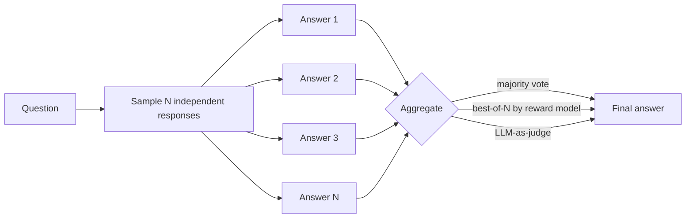

# 4 - Sampling and Decoding: The Probabilistic Nature of LMs

[toc]

> **TL;DR:** An LM doesn't *answer* — it emits a probability distribution over the next token, and the *decoder* picks one. The choice of decoder (greedy, beam, top-k, top-p, temperature, repetition penalties) shapes whether outputs feel safe and boring, creative, or unhinged. Understanding sampling is understanding the knob between "always the same answer" and "creative variety" — and it's where most production "the model is acting weird" bugs live.

## Vocabulary

**Logits**

```math
z = h_T W_E^\top \in \mathbb{R}^{|\mathcal{V}|}
```

The raw, unnormalized scores the model emits for every token in the vocabulary at the next position. The first thing the decoder touches.

---

**Softmax**

```math
P(t_i) = \frac{\exp(z_i / \tau)}{\sum_j \exp(z_j / \tau)}
```

Converts logits to a probability distribution. `τ` is the temperature.

---

**Temperature**

```math
\tau \in (0, \infty)
```

A scalar that flattens (`τ > 1`) or sharpens (`τ < 1`) the next-token distribution before sampling. `τ → 0` collapses to argmax (greedy); `τ → ∞` flattens to uniform.

---

**Greedy decoding**

```math
t^* = \arg\max_i z_i
```

Always pick the argmax token. Deterministic given fixed logits. Often boring; sometimes locally optimal but globally suboptimal.

---

**Top-k sampling**

Restrict sampling to the `k` tokens with highest probability; renormalize and sample.

---

**Top-p / nucleus sampling**

```math
S_p = \min\Big\{ S \subseteq \mathcal{V} : \sum_{t \in S} P(t) \ge p \Big\}
```

Restrict sampling to the smallest set of tokens whose cumulative probability exceeds `p` (e.g. `p = 0.9`). Adapts the candidate set to the model's confidence — narrow when peaked, wide when flat.

---

**Beam search**

A heuristic that maintains `b` candidate sequences at each step and keeps the top `b` by joint probability. Standard for translation, rare in chat (produces boring outputs).

---

**Logprob**

```math
\ell(t) = \log P(t \mid \text{context})
```

The natural log of a token's probability. The numerical-stability-friendly quantity that's what models actually emit and what evaluations measure.

## Intuition

A common misconception when first learning LLMs is that the model "produces an answer." It doesn't — at each step it produces *probabilities* and *something else* picks the actual token. That something else is the **decoder** (or **sampling strategy**), a tiny algorithm that runs after every forward pass. The decoder is part of your *system*, not part of the model: the same model with two different decoders is effectively two different products. Understanding decoders is understanding what the temperature knob actually does, why the same prompt can give different answers, and why "the model isn't following my JSON schema" is often a decoder problem.

The conceptual move is to separate three things: (1) what the model *believes* — the full next-token distribution; (2) what the decoder *allows* — the candidate set (greedy = singleton, top-k = top k tokens, top-p = nucleus); (3) what the decoder *picks* — a sample from the allowed set. Each step of generation is the loop {forward → distribution → restrict → sample → append → repeat}. The variety in human-perceived "model behavior" emerges from variety in step (2) and (3), not from any change to the model itself.

The deepest reason sampling matters: language models are *trained* to model a distribution, not to produce a single answer. There is no "correct" next token; there is a distribution over plausible next tokens. Picking always-the-most-probable (`τ = 0`, greedy) produces fluent but repetitive text. Picking too randomly (`τ = 2`, top-p = 1) produces creative but incoherent text. Production decoders sit in a narrow band — usually `τ ∈ [0.0, 0.8]`, `top_p ∈ [0.9, 1.0]` — chosen by hand-tuned experimentation per use case.

## The full decoding pipeline


Each box is a knob in the modern chat-completion API:

| API parameter | Step in the pipeline |
| :--- | :--- |
| `temperature` | Logit scaling before softmax |
| `top_p` | Nucleus restriction |
| `top_k` | Top-k restriction (open-source models) |
| `frequency_penalty` | Per-token logit penalty proportional to past frequency |
| `presence_penalty` | Per-token logit penalty if it has appeared at all |
| `logit_bias` | Per-token manual logit adjustment |
| `seed` | Deterministic RNG for the sampling step |

## Sampling fundamentals

```python
import numpy as np

def sample_next_token(logits: np.ndarray,
                       temperature: float = 1.0,
                       top_k: int | None = None,
                       top_p: float | None = None,
                       rng: np.random.Generator | None = None) -> int:
    """Apply temperature → top-k → top-p → sample. Returns the chosen token id."""
    rng = rng or np.random.default_rng()
    # 1. Temperature
    if temperature <= 0:
        return int(np.argmax(logits))               # greedy shortcut
    logits = logits / temperature
    # 2. Top-k
    if top_k is not None:
        threshold = np.partition(logits, -top_k)[-top_k]
        logits = np.where(logits < threshold, -np.inf, logits)
    # 3. Softmax
    e = np.exp(logits - logits.max())               # numerical stability
    probs = e / e.sum()
    # 4. Top-p (nucleus)
    if top_p is not None and top_p < 1.0:
        order = np.argsort(-probs)
        cumprob = np.cumsum(probs[order])
        cutoff = np.searchsorted(cumprob, top_p) + 1
        keep = order[:cutoff]
        new_probs = np.zeros_like(probs)
        new_probs[keep] = probs[keep]
        new_probs /= new_probs.sum()
        probs = new_probs
    # 5. Sample
    return int(rng.choice(len(probs), p=probs))
```

That entire function is the *whole* implementation of modern chat sampling. Every detail of "temperature 0.7 top-p 0.9" reduces to those six lines.

### Temperature, visually

```mermaid
flowchart LR
  subgraph cold[τ = 0.2 — sharp]
    direction TB
    A1["'mat' 0.85"]
    A2["'rug' 0.10"]
    A3["'floor' 0.04"]
    A4["other 0.01"]
  end
  subgraph default[τ = 1.0 — neutral]
    direction TB
    B1["'mat' 0.55"]
    B2["'rug' 0.20"]
    B3["'floor' 0.15"]
    B4["other 0.10"]
  end
  subgraph hot[τ = 2.0 — flat]
    direction TB
    C1["'mat' 0.30"]
    C2["'rug' 0.20"]
    C3["'floor' 0.17"]
    C4["other 0.33"]
  end
```

At `τ = 0` (or `τ → 0`), the model always picks `'mat'`. At `τ = 1`, you mostly get `'mat'` with occasional alternatives. At `τ = 2`, the distribution flattens and "other" tokens become much more likely — including weird ones the model would normally never pick.

## Sampling strategies, side by side

| Strategy | What it does | Strengths | Weaknesses |
| :--- | :--- | :--- | :--- |
| **Greedy** (`τ=0`) | Pick argmax every step | Deterministic, fast, safe | Repetitive ("the the the"), locally myopic |
| **Beam search** (`b=4–8`) | Keep top-b sequences by joint logprob | Strong for translation, code with single-correct-answer | Repetitive, generic, slow, bad for chat |
| **Pure sampling** (`τ=1, top_p=1`) | Sample from full distribution | Maximally diverse | Frequent low-quality tokens |
| **Top-k** (`k=40`) | Sample from top-k | Trims rare junk | Fixed `k` is too narrow when peaked, too wide when flat |
| **Top-p** (`p=0.9`) | Sample from nucleus | Adapts to model's confidence | Standard default for chat |
| **Min-p** (`p=0.05`) | Tokens with prob ≥ p × max-prob | Even more adaptive than top-p | Newer; less battle-tested |
| **Greedy + temperature ↑** | Greedy at non-zero temp | Slight randomness without losing top tokens | Brittle: small temp changes have outsized effects |

The 2026 chat default for most providers is **`temperature ≈ 0.7, top_p ≈ 0.9`**. For deterministic / "factual" tasks: `temperature = 0` (or `0.0`). For creative writing: `temperature ≈ 1.0, top_p ≈ 0.95`.

## Repetition control

LLMs can collapse into repeating phrases ("I see you've asked me… I see you've asked me… I see you've asked me…"), especially at higher temperatures with weak models. Two production knobs:

- **`frequency_penalty`** (range `[-2, 2]`): subtract `α × freq(t)` from each token's logit, where `freq(t)` is how many times it has appeared so far. Higher penalty → strong discouragement of frequent tokens.
- **`presence_penalty`** (`[-2, 2]`): subtract `α` if token has appeared *at all*, regardless of count. Encourages topic variety.

```math
z'_t = z_t - \alpha_\text{freq} \cdot \text{count}(t) - \alpha_\text{pres} \cdot \mathbb{1}[\text{count}(t) > 0]
```

Open-source decoders also expose `repetition_penalty` (multiplicative on logits) and `no_repeat_ngram_size` (hard ban on repeating a fixed-length n-gram). Use sparingly — over-penalization causes the model to avoid legitimate repetition (proper nouns, function names, technical terms).

## Test-time compute — sampling more to think harder



A practical trick: instead of taking the model's first answer at temperature 0, sample `N` independent answers at moderate temperature and aggregate. Two common patterns:

- **Self-consistency**: take a majority vote across `N` chain-of-thought traces. Reliably improves arithmetic and reasoning accuracy by 10–30 points on hard benchmarks.
- **Best-of-N**: score each candidate with a reward model (or a stronger LLM as judge) and pick the highest.

This is the simplest form of **test-time compute**: trade more inference compute for better outputs. The fully-realized version is *reasoning models* like o1/o3, which dedicate substantial compute to producing internal chains of thought before emitting the final answer. See [Test-Time Compute](./5-test-time-compute.md) for the deeper treatment.

```python
from openai import OpenAI
from collections import Counter
import re

client = OpenAI()

def self_consistency(question: str, n: int = 10) -> str:
    """Sample N CoT answers and majority-vote the final numeric answer."""
    answers: list[str] = []
    for _ in range(n):
        resp = client.chat.completions.create(
            model="gpt-4o-mini",
            messages=[
                {"role": "system", "content": "Solve. End with 'Answer: <num>'."},
                {"role": "user", "content": question},
            ],
            temperature=0.7,                   # need stochasticity for diversity
            max_completion_tokens=400,
        )
        text = resp.choices[0].message.content
        m = re.search(r"Answer:\s*([-\d\.]+)", text)
        if m:
            answers.append(m.group(1))
    return Counter(answers).most_common(1)[0][0] if answers else ""
```

## The probabilistic nature of AI — what it implies for engineering

> [!IMPORTANT]
> The same prompt, the same model, and the same parameters can produce different outputs across calls — unless you fix the seed (where supported) and the provider hasn't changed any internal kernel. Treat LLM outputs as **non-deterministic by default** in your tests and your contracts.

> [!CAUTION]
> "Temperature 0" is *not* a guarantee of identical outputs across batches, providers, or model versions. Floating-point non-determinism in batched matmuls, kernel implementation differences, and silent model-version rotations all break the assumption. If you need byte-identical outputs, log inputs and outputs and re-run as a regression test rather than trusting that `temperature=0` is a determinism contract.

> [!TIP]
> A small batch (`n=4–8`) of low-temperature samples is often a better safety net than a single greedy decode. Sample 4 candidates at `τ=0.3`, take the *first one that parses* (e.g. valid JSON), and fall back gracefully if all fail. Most production agents use this pattern implicitly.

## In practice

The right decoder settings depend on the task. A rough field guide:

| Task | Suggested settings |
| :--- | :--- |
| Classification, factual QA, RAG | `temperature=0` |
| Code generation | `temperature=0.0–0.3` |
| General chat / explanation | `temperature=0.7, top_p=0.9` |
| Creative writing | `temperature=0.9–1.0, top_p=0.95` |
| Brainstorming | `temperature=1.0–1.2` |
| Self-consistency / best-of-N | `temperature=0.5–0.8, n=10–20` |
| Translation / structured output | `temperature=0`, plus constrained decoding (see [Structured Outputs](./6-structured-outputs.md)) |

> [!NOTE]
> Reasoning-tuned models (o1, o3, DeepSeek-R1, Claude with extended thinking) ignore (or downweight) most of these knobs — they choose their own internal decoding. Read the per-model docs; the rules differ.

## Pitfalls

- **"Temperature 0 means deterministic."** It means greedy. Determinism additionally requires stable kernels, fixed batching, and a pinned model version.
- **"Lower temperature is more accurate."** Not necessarily. For reasoning tasks, *self-consistency at higher temperature* often beats greedy. The right metric is task-level accuracy, not "confidence."
- **"Higher temperature = more creative."** Up to a point, then it just produces gibberish. The model's prior over coherent text is what's flattened; very high temperature destroys that prior.
- **"Beam search is the best decoder."** For chat, beam search produces *boring, repetitive* text because joint logprob favors safe continuations. It's used for translation and code where there's a known-correct answer.
- **"`top_p=1.0` is the same as no top-p."** Numerically yes, but most APIs treat `top_p=1.0` specially (skip the filter). Use the documented default (`top_p` unset) rather than explicitly setting `1.0`.

## Exercises

### Exercise 1 — Implement greedy + temperature + top-p

Write a function `decode(logits, temperature, top_p)` from scratch using only `numpy`. Verify by feeding it a known distribution and checking the empirical sample frequencies match the expected probabilities.

#### Solution

The function in the "Sampling fundamentals" section is the answer. Verification:

```python
import numpy as np
from collections import Counter

# Synthetic logits where token 0 is most probable, then 1, 2, 3, ...
np.random.seed(0)
logits = np.array([3.0, 2.0, 1.5, 1.0, 0.5, 0.0, -0.5, -1.0, -1.5, -2.0])

# Sample 100k times at temperature=1, top_p=0.9
samples = [sample_next_token(logits, temperature=1.0, top_p=0.9) for _ in range(100_000)]
counts = Counter(samples)

# Expected: softmax(logits), then zero out tokens outside nucleus
e = np.exp(logits - logits.max())
probs = e / e.sum()
order = np.argsort(-probs)
cumprob = np.cumsum(probs[order])
cutoff = np.searchsorted(cumprob, 0.9) + 1
keep = set(order[:cutoff].tolist())
expected = {i: probs[i] for i in keep}
expected_sum = sum(expected.values())
expected = {i: p / expected_sum for i, p in expected.items()}

for tok in sorted(expected):
    emp = counts[tok] / 100_000
    print(f"  tok {tok}: empirical {emp:.4f}, expected {expected[tok]:.4f}")
```

Empirical and expected should match to within ~0.5% — confirms the implementation.

---

### Exercise 2 — Choose decoder settings for three tasks

Recommend (`temperature`, `top_p`, `n`) for each:

1. A medical-coding assistant that maps free-text diagnoses to ICD-10 codes.
2. A creative-writing assistant for sci-fi short stories.
3. A high-school math tutor.

#### Solution

1. **Medical coding** — `temperature=0`, `top_p=1.0` (unused), `n=1`. Output is a structured code from a finite set; you want maximum determinism, and any "creativity" would be a hallucination. Combine with [Structured Outputs](./6-structured-outputs.md) to force valid ICD-10 syntax.

2. **Creative writing** — `temperature=0.9–1.0`, `top_p=0.95`, `n=1` (or `n=3` if a UI lets the user pick from variants). The whole point is novelty; the user is the judge of quality.

3. **Math tutor** — `temperature=0.5–0.7`, `top_p=0.9`, `n=5–10` with majority vote (self-consistency). Reasoning tasks benefit from multiple CoT samples plus aggregation. Greedy on math underperforms self-consistency by 10–30 points on hard problems.

---

### Exercise 3 — Why does beam search produce boring outputs in chat?

Explain in one paragraph why beam search, despite maximizing joint logprob, makes chat outputs feel boring and generic.

#### Solution

The training distribution rewards *plausible* continuations, and the most plausible continuation is often the most common. Beam search globally optimizes for high joint probability, which means it systematically prefers "safe" word choices that the training data has seen many times — clichés, hedges, generic phrasing. A pure sampling strategy occasionally picks a less probable but more interesting token, which steers the trajectory into more diverse phrasing. In short: beam search optimizes the wrong thing for open-ended chat. Open-ended generation is a *style* problem (do I sound interesting?), not a *probability* problem (what's the most likely token?). The two are not the same.

---

### Exercise 4 — Trace a self-consistency improvement

You run a hard math benchmark. Greedy decoding (`τ=0, n=1`) achieves 55% accuracy. With self-consistency at `τ=0.7, n=20`, accuracy rises to 78%. Sketch why this works and what tradeoffs you accept.

#### Solution

**Why it works.** A reasoning chain has many places where the model can take a wrong turn. Greedy follows the *most likely* path, but the most likely path is not always the correct one — the model may be 51% confident in a wrong first step and 49% confident in the right one. Sampling 20 times exposes the model to multiple paths. Most correct answers cluster on the same final value (because correct reasoning has fewer ways to be right than wrong), while wrong answers tend to be *diverse* (errors disperse). Majority voting therefore amplifies the signal of correct paths.

**Tradeoffs.** Cost goes up 20× — you're paying for 20 completions per question. Latency goes up too, unless you parallelize the calls. The technique only helps on tasks where a *clean final answer* can be voted on; it doesn't help open-ended generation where each sample is a unique essay. For high-value, low-volume tasks (legal review, medical diagnosis suggestions, hard math), 20× is acceptable; for high-volume chat, it isn't.

## Sources

- Holtzman, A. et al. (2019). *The Curious Case of Neural Text Degeneration* (top-p / nucleus sampling). https://arxiv.org/abs/1904.09751
- Fan, A. et al. (2018). *Hierarchical Neural Story Generation* (top-k sampling). https://arxiv.org/abs/1805.04833
- Wang, X. et al. (2022). *Self-Consistency Improves Chain of Thought Reasoning in Language Models*. https://arxiv.org/abs/2203.11171
- Snell, C. et al. (2024). *Scaling LLM Test-Time Compute Optimally can be More Effective than Scaling Model Parameters*. https://arxiv.org/abs/2408.03314
- Minh Nguyen et al. (2024). *Min-P Sampling*. https://arxiv.org/abs/2407.01082
- OpenAI Chat Completions API reference. https://platform.openai.com/docs/api-reference/chat
- Huyen, C. (2024). *AI Engineering*, Chapter 2.

## Related

- [Generative AI Fundamentals](../1-foundations/3-generative-ai-fundamentals.md)
- [Language Models](../1-foundations/2-language-models.md)
- [5 - Test-Time Compute](./5-test-time-compute.md)
- [6 - Structured Outputs](./6-structured-outputs.md)
- [Prompt Engineering](../1-foundations/5-prompt-engineering.md)
- [Entropy, Cross-Entropy, and Perplexity](../3-evaluation/2-entropy-cross-entropy-perplexity.md)
