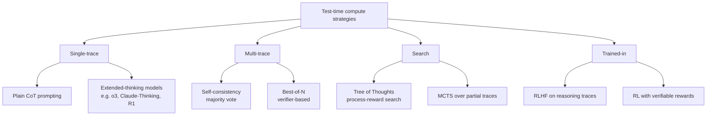
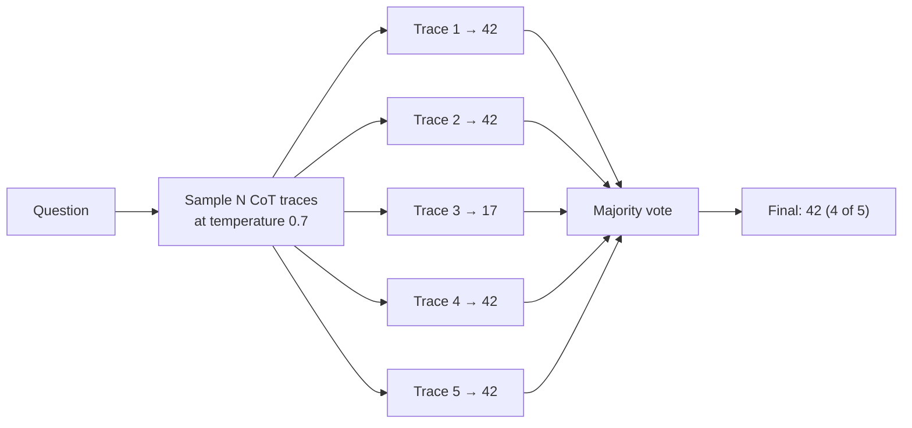
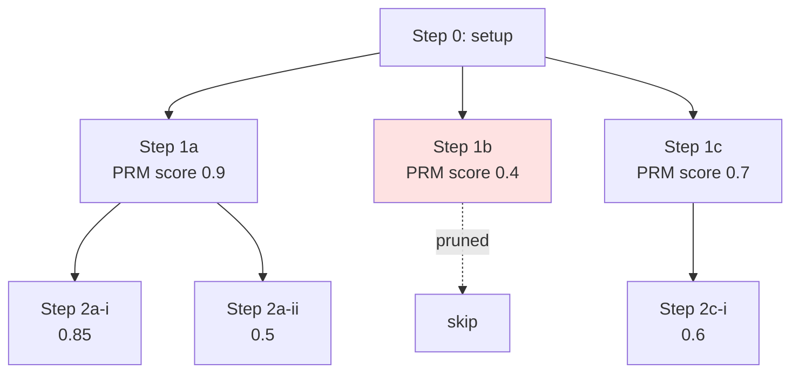
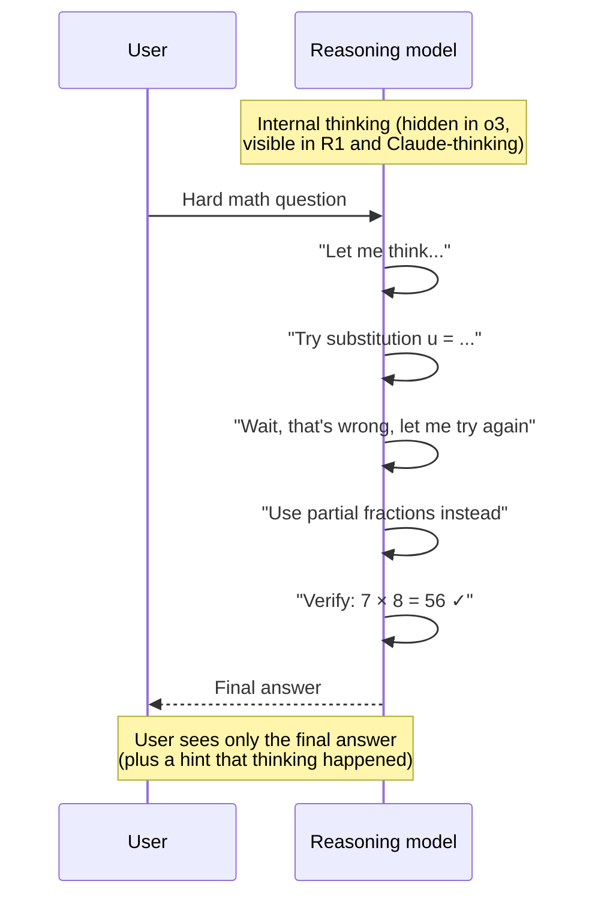

# 5 - Test-Time Compute (Reasoning Models)

[toc]

> **TL;DR:** *Test-time compute* is the idea of spending more inference-time work — more tokens of thinking, more samples, more verification — to make a single model behave like a smarter one. It is the 2024–2026 scaling lever: pre-training compute curves flattened, but inference scaling curves are still climbing. Reasoning models (o1, o3, DeepSeek-R1, Claude with extended thinking) industrialize this by training the model to produce long internal chains of thought, then revealing only the final answer.

## Vocabulary

**Test-time compute (TTC)**

```math
\text{quality} = f(\text{model size}, \text{train compute}, \text{inference compute})
```

The deliberate use of more compute *per query* to improve answer quality. Distinct from train-time compute (one-time, amortized across all future queries).

---

**Chain-of-Thought (CoT)**

A prompting / training pattern where the model emits intermediate reasoning tokens before the final answer. The cheapest form of TTC.

---

**Self-consistency**

Sample `N` independent CoT traces and majority-vote the final answer. Reliably improves accuracy on tasks with a clean final answer.

---

**Best-of-N**

Sample `N` candidates, score each with a verifier (rule-based, reward model, or judge LLM), pick the best. Replaces majority vote with a quality estimator.

---

**Process reward model (PRM)**

A reward model that scores each *step* of a reasoning chain, not just the final answer. Lets the system prune bad partial traces early, in tree-search style.

---

**Reasoning model**

A model post-trained (typically with RL on verifiable rewards) to produce *long, deliberate* chains of thought before the final answer. The chain is hidden ("hidden thinking") in OpenAI's o-series; partially visible in DeepSeek-R1 and Claude.

---

**Inference scaling law**

```math
\text{accuracy} \approx f(\log(\text{inference compute per query}))
```

The empirical observation that, for many hard tasks, accuracy continues to improve with logarithmic inference compute — analogous to pre-training scaling laws but applied to a single query.

## Intuition

Until 2023, the recipe to make a model smarter was: train a bigger model on more data. By late 2024 that curve had visibly bent. Each new frontier was getting more expensive to train and less differentiated in capability. The next lever was hiding in plain sight: the *time the model spends thinking on a single query*. A human asked "what's 7 × 8?" instantly says 56; asked "is this proof correct?" takes minutes. We let humans spend variable compute per problem; LLMs traditionally spent a *constant* one forward pass. Letting them spend more, intelligently, was the gap.

Test-time compute is just "use the model more before committing to an answer." The simplest form is chain-of-thought: ask the model to think out loud. The next step up is self-consistency: sample many CoT traces and vote. Beyond that, you score traces with a reward model (best-of-N), search over partial traces (tree search), or train the model itself to use compute well via RL. The reasoning models of 2024–2026 are the industrial version: the model learns to *budget its own thinking* and to *catch its own mistakes mid-thought*.

The crucial property that makes this work: *verification is easier than generation*. It's hard to write a correct proof, but easy to check one. It's hard to write a passing unit test for arbitrary code, but easy to run it. When the answer can be checked, sampling 100 candidates and picking the verified one is a powerful, simple form of TTC. Most of the headline gains on math, code, and formal reasoning come from exactly this: verifiable rewards plus sampling.

## A taxonomy of test-time compute strategies



Cost-per-query, roughly:

| Strategy | Tokens / query | Quality lift |
| :--- | ---: | :--- |
| Direct answer (no CoT) | ~50 | baseline |
| Plain CoT prompt | ~300 | +5–15 pts on reasoning |
| Self-consistency `n=10` | ~3,000 | +10–25 pts |
| Best-of-N `n=20` with verifier | ~6,000 | +15–30 pts |
| Reasoning model (o3-style) | ~3k–30k hidden + ~200 visible | +20–40 pts on hard math/code |

## Plain CoT — the cheap baseline

Demonstrated in [Prompt Engineering](../1-foundations/5-prompt-engineering.md): just ask the model to think. For multi-step problems this is the easiest possible TTC.

```python
from openai import OpenAI

client = OpenAI()

def cot(question: str, model: str = "gpt-4o-mini") -> str:
    resp = client.chat.completions.create(
        model=model,
        messages=[
            {"role": "system",
             "content": "Work through the problem step by step before answering. "
                        "End with a single line: 'Final answer: <value>'."},
            {"role": "user", "content": question},
        ],
        temperature=0.7,
        max_completion_tokens=500,
    )
    return resp.choices[0].message.content
```

CoT alone often gives 5–15 points on benchmarks like GSM8K (grade-school math). Free in code; just changes the prompt.

## Self-consistency

Sample `N` independent CoT traces. Majority-vote the final answer.

```python
import re
from collections import Counter
from concurrent.futures import ThreadPoolExecutor

def self_consistency(question: str, n: int = 20, model: str = "gpt-4o-mini") -> str:
    def one_call() -> str | None:
        text = cot(question, model)
        m = re.search(r"Final answer:\s*([-\d\.]+)", text)
        return m.group(1) if m else None

    with ThreadPoolExecutor(max_workers=n) as ex:
        answers = [a for a in ex.map(lambda _: one_call(), range(n)) if a is not None]

    if not answers:
        return "no answer parsed"
    return Counter(answers).most_common(1)[0][0]
```



Key observation: correct reasoning paths *agree on the answer*; incorrect ones *disagree with each other* in different ways. Voting amplifies the signal of the correct cluster. Doesn't work on open-ended tasks (no single answer to vote on) — only on tasks with a clean final value (math, classification, code that compiles).

## Best-of-N with a verifier

Where self-consistency uses majority vote, best-of-N uses a *verifier* — anything from a rule-based check to a strong LLM judge — to score each candidate and pick the winner.

```python
def best_of_n_code(prompt: str, tests: list[str], n: int = 20) -> str:
    """Generate N code samples; return the first that passes all tests."""
    for _ in range(n):
        code = generate_code(prompt, temperature=0.8)
        if all(run_test(code, t) for t in tests):
            return code
    return generate_code(prompt, temperature=0.0)   # fall back to greedy
```

When the verifier is *cheap and reliable* (code tests, math final-answer checker, formal proof checker), best-of-N scales beautifully with `N`. On math benchmarks with a known-answer verifier, best-of-N can lift small models above larger greedy ones.

## Process reward models — score the steps, not just the answer

For multi-step problems, judging only the final answer is wasteful: a 20-step trace that goes wrong at step 3 wastes the next 17 steps. A **process reward model** scores each step. Search algorithms (beam search, MCTS) prune low-scoring branches early.



OpenAI's reasoning models, DeepMind's AlphaProof, and DeepSeek's R1 series all use variants of this idea. The PRM is trained on human-rated or model-rated step quality; at inference, the search algorithm spends compute proportional to problem difficulty.

## Reasoning models — the trained-in approach

Plain CoT and self-consistency are decoder-side wrappers; *reasoning models* bake the behavior into the weights. They are post-trained with RL on verifiable-reward problems (math, code, formal proofs) so the model learns to:

1. **Think longer when needed.** A reasoning model spends thousands of tokens on hard problems and a handful on easy ones.
2. **Self-correct mid-thought.** When the model notices an error in its own reasoning, it can say "wait, that's wrong" and try again.
3. **Decide when to stop.** Trained termination — the model emits an internal end-of-thinking token when confident.



Reasoning models cost much more per token (the hidden thinking is billed) but achieve much higher accuracy on hard benchmarks. They are the right choice for: complex math, hard coding (competitive programming), formal verification, multi-hop research. Wrong choice for: casual chat, summarization, translation — there the thinking tokens are wasted.

> [!IMPORTANT]
> Reasoning models often perform *worse* on tasks that don't need thinking, because they over-think simple queries and produce verbose answers. Route by task: a reasoning model for math/code/planning, a fast non-reasoning model for everything else.

## Inference scaling laws

The 2024–2026 finding is that, on hard benchmarks with verifiable rewards, accuracy continues to improve with logarithmic inference compute:

```math
\text{accuracy}(C_\text{infer}) \approx a + b \log C_\text{infer}
```

empirically robust across many task families. The scaling law has *two* axes now: train-time compute and inference-time compute. For a given accuracy target, you can trade between them — train a smaller model harder, or train less and spend more at inference. The optimum varies by task and by deployment economics.

## In practice

> [!TIP]
> For a new problem, evaluate in this order: (1) baseline with a non-reasoning model. (2) add CoT prompting. (3) add self-consistency at `n=5–10`. (4) try a reasoning model. Each step is more expensive; stop at the cheapest step that hits your quality bar.

> [!NOTE]
> Reasoning-model APIs typically *don't* expose the hidden thinking. You're billed for those tokens but can't see them, and they don't fit in your downstream context window. Plan for `total_tokens` to be much larger than `completion_tokens + prompt_tokens` for these models.

> [!CAUTION]
> Self-consistency at high `N` is *expensive* at scale. For a 10M-call/day product, going from `n=1` to `n=10` is a 10× cost increase. Restrict TTC to the cases where quality gains justify cost — typically by routing only "hard" queries (low-confidence first pass, or specific task types) through the TTC path.

A growing pattern is **adaptive TTC**: cheap first pass → confidence check → escalate to TTC only if low confidence. Implementation: first answer at `n=1`, parse confidence from a `confidence: low|med|high` field the model emits, escalate the low-confidence subset to `n=10` self-consistency or a reasoning model. Captures 80% of TTC's quality gain at 20% of the cost.

## Pitfalls

- **"More thinking is always better."** Past a per-task optimum, additional thinking either plateaus (waste) or hurts (model talks itself into wrong answers). Cap thinking budget per task.
- **"Self-consistency works on everything."** Only on tasks with a clean final-answer to vote on. Open-ended generation needs best-of-N with a judge, or no TTC at all.
- **"Best-of-N with an LLM judge is free."** The judge has its own cost and own errors. Cheap judges (rule-based, code-test) scale; LLM judges add latency and budget that often dominates the generation cost itself.
- **"Reasoning models replace CoT."** They subsume *some* CoT use cases but cost much more per call. Keep both in your toolbox.
- **"Hidden thinking tokens don't matter for context."** They count toward your API cost and rate limits. They don't show up in `completion_tokens` but they do show up in your bill.

## Exercises

### Exercise 1 — Compute the cost of self-consistency

You're answering 1M math questions a day with a non-reasoning model. Greedy answer is 200 tokens at $5/M output tokens. Self-consistency at `n=10` raises accuracy from 70% to 85% but multiplies output tokens 10×. (a) Daily cost greedy vs `n=10`. (b) If a wrong answer costs the business $0.10 in customer support tickets, is `n=10` worth it?

#### Solution

**(a)**
- Greedy: `1e6 × 200 / 1e6 × $5 = $1,000/day`.
- `n=10`: `1e6 × 2000 / 1e6 × $5 = $10,000/day`. Marginal cost = **$9,000/day**.

**(b)** Wrong-answer count:
- Greedy: 30% wrong → 300,000 errors → $30,000/day in support cost.
- `n=10`: 15% wrong → 150,000 errors → $15,000/day.

Marginal savings: $15,000/day. Marginal cost: $9,000/day. **Net savings: $6,000/day.** Self-consistency is worth it.

If wrong answers were only $0.02 instead of $0.10, the marginal benefit would be $3,000/day vs $9,000/day cost — `n=10` would *not* be worth it. The right TTC budget is always a function of the cost of being wrong.

---

### Exercise 2 — Design an adaptive TTC router

Sketch a Python class `AdaptiveLLM` that routes easy queries to a cheap non-reasoning model and hard queries to a reasoning model. Define what "hard" means.

#### Solution

```python
from openai import OpenAI

class AdaptiveLLM:
    def __init__(self):
        self.client = OpenAI()
        self.cheap_model = "gpt-4o-mini"
        self.reasoning_model = "o3-mini"

    def _classify_hardness(self, query: str) -> str:
        """Heuristic + LLM-based difficulty classifier."""
        if any(k in query.lower() for k in ["prove", "derive", "step by step",
                                             "solve for", "algorithm for"]):
            return "hard"
        if len(query) > 600:
            return "hard"
        return "easy"

    def answer(self, query: str) -> dict:
        hardness = self._classify_hardness(query)
        model = self.reasoning_model if hardness == "hard" else self.cheap_model
        resp = self.client.chat.completions.create(
            model=model,
            messages=[{"role": "user", "content": query}],
        )
        return {"answer": resp.choices[0].message.content,
                "model": model,
                "hardness": hardness}
```

Production version uses a learned classifier (a small fine-tuned model on labeled `(query, was-cheap-model-right?)` pairs) rather than keyword heuristics. The classifier itself is a cheap call, so the routing overhead is small.

---

### Exercise 3 — Diagnose a self-consistency regression

You add self-consistency with `n=20` to an arithmetic-word-problem endpoint. Accuracy *drops* from 82% to 78%. What might be wrong?

#### Solution

A few common causes:

1. **Temperature too low for diversity.** If you're sampling `n=20` at `temperature=0.1`, all 20 traces are essentially identical — you're not getting independent samples, just paying 20× for the same answer. Bump to `temperature=0.5–0.8`.

2. **Answer parser too brittle.** Maybe the regex extracting the final answer fails for some traces (e.g. "**42**" with bold doesn't match `r"Answer:\s*(\d+)"`). Those traces fall back to a default or are skipped, hurting the vote.

3. **Voting over wrong granularity.** If you're voting over the *exact string* and the answer can be expressed multiple ways (`"forty-two"` vs `"42"`), each unique string gets one vote. Normalize answers before voting.

4. **High temperature corrupts easy questions.** Easy questions that greedy got right may flip wrong under sampling noise; the gain on hard questions doesn't compensate. Solution: route only low-confidence/hard queries through self-consistency.

5. **The `n=1` baseline was already lucky.** 82% may have been a noisy snapshot. Re-evaluate with a larger eval set before concluding the regression is real.

---

### Exercise 4 — When NOT to use a reasoning model

Give three concrete production scenarios where you would deliberately *not* use a reasoning model, and explain why.

#### Solution

1. **Real-time chat / customer support.** Reasoning models add seconds of latency per response. For a typing-speed-paced chat UX, this kills the feel. Users would rather have a fast 92% answer than a slow 96% one.

2. **Translation.** Translation is a near-1:1 mapping that doesn't reward "thinking." A reasoning model wastes thinking tokens deliberating word choice; a fast non-reasoning model is equally good and 10× cheaper.

3. **High-volume classification at scale.** Routing 10M support tickets/day to a reasoning model would be six-figure cost increases. Use a small fine-tuned classifier (cheap, fast, good enough), reserve the reasoning model for tickets the classifier punts on with low confidence.

The general principle: TTC is *valuable in proportion to task difficulty*. On easy tasks the model doesn't need to think; the thinking is just overhead.

## Sources

- Wei, J. et al. (2022). *Chain-of-Thought Prompting Elicits Reasoning in Large Language Models*. https://arxiv.org/abs/2201.11903
- Wang, X. et al. (2022). *Self-Consistency Improves Chain of Thought Reasoning in Language Models*. https://arxiv.org/abs/2203.11171
- Lightman, H. et al. (2023). *Let's Verify Step by Step* (Process Reward Models). https://arxiv.org/abs/2305.20050
- Yao, S. et al. (2023). *Tree of Thoughts: Deliberate Problem Solving with Large Language Models*. https://arxiv.org/abs/2305.10601
- Snell, C. et al. (2024). *Scaling LLM Test-Time Compute Optimally can be More Effective than Scaling Model Parameters*. https://arxiv.org/abs/2408.03314
- OpenAI (2024). *Learning to Reason with LLMs* (o1 announcement). https://openai.com/index/learning-to-reason-with-llms/
- DeepSeek-AI (2025). *DeepSeek-R1: Incentivizing Reasoning Capability in LLMs via Reinforcement Learning*. https://arxiv.org/abs/2501.12948
- Brown, B. et al. (2024). *Large Language Monkeys: Scaling Inference Compute with Repeated Sampling*. https://arxiv.org/abs/2407.21787
- Huyen, C. (2024). *AI Engineering*, Chapter 2.

## Related

- [4 - Sampling and Decoding](./4-sampling-and-decoding.md)
- [3 - Post-Training and Fine-tuning](./3-post-training-and-finetuning.md)
- [Prompt Engineering](../1-foundations/5-prompt-engineering.md)
- [Methodology and Challenges of Evaluation](../3-evaluation/1-methodology-and-challenges.md)
- [Exact and Functional Evaluation](../3-evaluation/3-exact-and-functional-evaluation.md)
