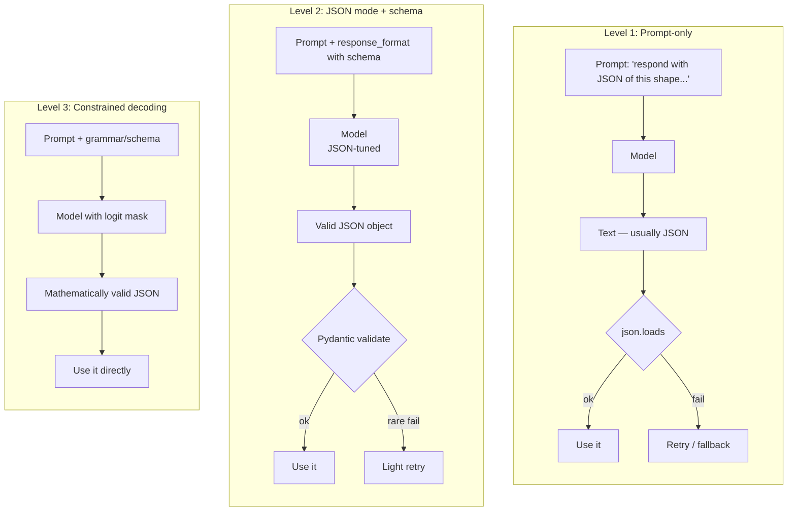
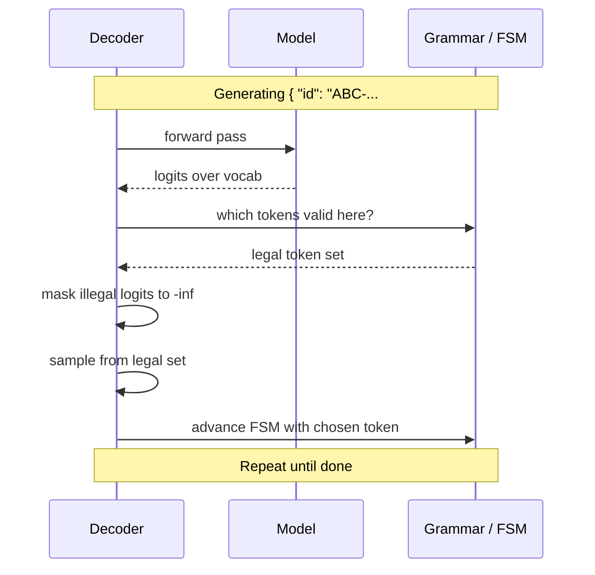
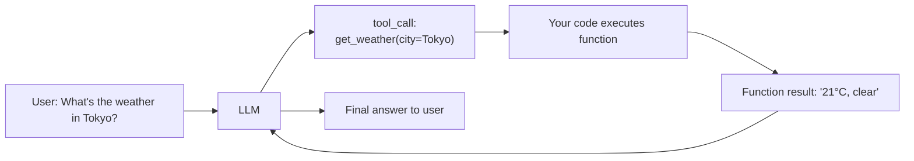

# 6 - Structured Outputs (JSON Schemas and Constrained Decoding)

[toc]

> **TL;DR:** When an LLM's output has to be parsed by code — JSON, SQL, a function call, an enum — "the model usually gets it right" is not good enough. *Structured outputs* are a family of techniques (prompting, JSON-mode, constrained decoding) that *guarantee* the output is syntactically valid against a schema, by either training the model to comply or by surgically masking the logits at generation time so invalid tokens have probability zero.

## Vocabulary

**Structured output**

A model output that conforms to a machine-readable schema (JSON Schema, Pydantic model, OpenAPI spec, SQL grammar, EBNF). The schema is part of the contract, not just guidance.

---

**Function calling / Tool calling**

A specific API pattern where the model is given a JSON-Schema-described list of "tools" and may emit a structured `tool_call` whose `arguments` field is JSON parsable against the tool's parameter schema.

---

**JSON mode**

A provider-level flag (`response_format={"type": "json_object"}`) that forces the model to emit a syntactically valid JSON object. Doesn't constrain the shape — that's still your job.

---

**Constrained decoding**

A general technique where at every sampling step, the decoder *masks out* tokens that would lead to an invalid string under the target grammar — so only valid continuations have nonzero probability.

---

**JSON Schema**

```math
S = \{\text{"type": "object", "properties": \{\ldots\}, "required": [\ldots]\}}
```

A formal specification of a JSON value's expected shape: types, fields, enums, ranges. The lingua franca of structured-output APIs.

---

**Pydantic model**

```math
\text{class Order(BaseModel): id: int; items: list[Item]}
```

A Python class that serves as both a runtime validator and a JSON-Schema source. The dominant client-side abstraction for structured outputs in Python.

---

**Grammar-constrained decoding**

A stricter form of constrained decoding that enforces a full context-free grammar (BNF, EBNF), not just a flat JSON Schema. Used for SQL, JSONL, custom DSLs.

## Intuition

A raw LLM emits text. Your downstream code wants structured data. There are three ways to bridge the gap, in increasing strictness:

1. **Prompt-only**: ask the model to produce JSON in the prompt and parse the response. Easy, but the model sometimes forgets a closing brace, includes prose around the JSON, or invents a field. You patch with retries and regex; bugs leak.
2. **JSON mode / JSON Schema**: the provider has been *trained* to produce valid JSON, and you can attach a schema; the model usually conforms. The vast majority of production traffic is here in 2026.
3. **Constrained decoding**: at every token step, the decoder consults the schema/grammar and zeroes out logits for tokens that would create an invalid string. Mathematically impossible to emit invalid output. Open-source servers (vLLM with `outlines`, `lm-format-enforcer`, `xgrammar`) support this; some providers do too.

Each level moves *certainty* upstream: from "hope and retry" to "trained to comply" to "physically cannot output anything else." The cost moves with it: prompt-only is free; JSON mode is free with supported APIs; constrained decoding requires either your own serving stack or a provider that exposes the feature, and has a small latency overhead at generation time.

Structured outputs are not a peripheral concern. The reliability of agents, RAG citation lists, tool-calling workflows, and downstream data pipelines depends entirely on parseable output. A 99.5% valid-JSON rate sounds good until you do 10M calls/day and 50k of them break your data pipeline silently.

## Three levels of strictness



## Level 1 — Prompt-only

You ask, the model answers. Cheap, no special infra. Brittle.

```python
import json
from openai import OpenAI

client = OpenAI()

PROMPT = """Extract the order from the text. Return JSON only, no prose.
Schema: {"id": str, "items": [{"sku": str, "qty": int}]}

Text: %s
JSON:"""

def parse_order_v1(text: str) -> dict:
    resp = client.chat.completions.create(
        model="gpt-4o-mini",
        messages=[{"role": "user", "content": PROMPT % text}],
        temperature=0,
    )
    raw = resp.choices[0].message.content.strip()
    # Cleanup: strip markdown fences if the model added them
    if raw.startswith("```"):
        raw = raw.strip("`").lstrip("json").strip()
    return json.loads(raw)
```

You will end up writing 50 lines of error-recovery code. The model will occasionally trail off, embed JSON inside prose, hallucinate fields. This is the pre-2023 approach; avoid it for anything new.

## Level 2 — JSON mode with a schema

Modern provider APIs accept a *strict* JSON Schema. The provider guarantees (or near-guarantees) that the output validates against it.

### OpenAI strict JSON mode

```python
from openai import OpenAI
from pydantic import BaseModel

client = OpenAI()

class Item(BaseModel):
    sku: str
    qty: int

class Order(BaseModel):
    id: str
    items: list[Item]

resp = client.beta.chat.completions.parse(
    model="gpt-4o-mini",
    messages=[
        {"role": "system", "content": "Extract the order from the text."},
        {"role": "user", "content": "Order ABC-123: 2 widgets (SKU W1) and 1 gizmo (SKU G7)."},
    ],
    response_format=Order,
)
order: Order = resp.choices[0].message.parsed
print(order.id)         # 'ABC-123'
print(order.items)      # [Item(sku='W1', qty=2), Item(sku='G7', qty=1)]
```

`.parse(...)` converts your Pydantic model to a JSON Schema, hands it to the API, and validates the returned JSON before constructing the typed object. Failure modes are reduced to: schema-violation rejections at the provider, network issues, and the model legitimately refusing.

### Anthropic tool use

Anthropic exposes structured output via *tool use*. You define a tool with `input_schema`; the model emits `tool_use` blocks with arguments matching the schema.

```python
import anthropic, json

client = anthropic.Anthropic()
tools = [{
    "name": "save_order",
    "description": "Save a parsed order.",
    "input_schema": {
        "type": "object",
        "properties": {
            "id": {"type": "string"},
            "items": {"type": "array", "items": {
                "type": "object",
                "properties": {
                    "sku": {"type": "string"},
                    "qty": {"type": "integer", "minimum": 1},
                },
                "required": ["sku", "qty"],
            }},
        },
        "required": ["id", "items"],
    },
}]

resp = client.messages.create(
    model="claude-sonnet-4-6",
    max_tokens=500,
    tools=tools,
    tool_choice={"type": "tool", "name": "save_order"},
    messages=[{"role": "user",
               "content": "Order ABC-123: 2 widgets (SKU W1) and 1 gizmo (SKU G7)."}],
)
tool_use = next(b for b in resp.content if b.type == "tool_use")
order_data: dict = tool_use.input    # already validated against input_schema
```

> [!IMPORTANT]
> Always validate the returned structure on your side too, even when the provider claims strict conformance. Network errors, refusals, and edge-case schema bugs can still surface. Wrap each call in a Pydantic / dataclass validation step and treat failures as recoverable errors, not impossible ones.

## Level 3 — Constrained decoding

For maximum strictness — and for grammars beyond JSON (SQL, JSONL streams, regex, custom DSL) — use *constrained decoding*. Open-source implementations:

- **`outlines`** — Python library; regex, JSON Schema, CFG grammars.
- **`lm-format-enforcer`** — schema → token-level finite-state automaton, masks logits.
- **`xgrammar`** — fast GPU-accelerated grammar masking, batched.
- **vLLM, SGLang** — serving frameworks with built-in constrained decoding.

How it works: at each step, the decoder examines the *partial output so far* and the *grammar*, computes the set of tokens that could legally come next, sets the logits of all illegal tokens to `-inf`, then samples normally. The result is a sequence that *cannot* be invalid.

```python
# Conceptual sketch — not real outlines API, but the shape
from outlines import generate, models

model = models.transformers("meta-llama/Meta-Llama-3-8B-Instruct")

# Generate JSON matching a Pydantic schema
generator = generate.json(model, Order)
order: Order = generator("Order ABC-123: 2 widgets (SKU W1) and 1 gizmo (SKU G7).")

# Or constrain to a regex
phone_gen = generate.regex(model, r"\(\d{3}\) \d{3}-\d{4}")
phone: str = phone_gen("My phone is six-one-seven 555 1234.")
```



> [!TIP]
> Constrained decoding is the right answer when the cost of an invalid output is catastrophic (a SQL injection into your DB, a malformed payment, an agent that loops on broken JSON). It's overkill for low-stakes data extraction where Pydantic-validated JSON mode plus a retry is sufficient.

## Function calling — the dominant agent pattern

The same machinery powers *function calling*: the model is told about a set of tools it can call, each with a JSON Schema for its arguments. Instead of emitting answer text, the model emits a structured `tool_call` with a function name and validated arguments.

```python
from openai import OpenAI

client = OpenAI()

tools = [{
    "type": "function",
    "function": {
        "name": "get_weather",
        "description": "Get the current weather in a city.",
        "parameters": {
            "type": "object",
            "properties": {
                "city": {"type": "string"},
                "unit": {"type": "string", "enum": ["c", "f"]},
            },
            "required": ["city"],
        },
        "strict": True,
    },
}]

resp = client.chat.completions.create(
    model="gpt-4o-mini",
    messages=[{"role": "user", "content": "What's the weather in Tokyo in celsius?"}],
    tools=tools,
)
call = resp.choices[0].message.tool_calls[0]
print(call.function.name)             # 'get_weather'
print(call.function.arguments)        # '{"city": "Tokyo", "unit": "c"}'
```

This is the foundation of *agents*. The model picks a tool, you execute it, you feed the result back as a `tool` message, the model continues. Every multi-step agent on every platform is structured-output function calling in a loop.



## In practice

> [!WARNING]
> Strict JSON Schema mode comes with limits: many providers reject schemas that use `$ref`, complex conditionals, or unusual `pattern` regexes. Always test your schema against the provider's strict validator before depending on it in production.

> [!CAUTION]
> Constrained decoding does **not** make the output *correct* — it makes it *syntactically valid*. A model can emit a perfectly valid SQL query that drops your prod table, or a JSON tool-call with semantically wrong arguments. Validation of structure is a security layer; validation of intent is still your job.

Across most production systems in 2026, the dominant pattern is: **Pydantic-defined schema → provider's strict JSON mode → client-side re-validate → light retry on failure**. This catches > 99.9% of issues with minimal infrastructure overhead. Reserve constrained decoding for cases where even rare failures are unacceptable (medical, legal, financial).

## Pitfalls

- **"`response_format={'type': 'json_object'}` enforces my schema."** No — it only guarantees *valid JSON syntax*. Without a *schema* attached, the shape is up to the model. Always provide a schema when you have one.
- **"My Pydantic model is my schema."** It is, but Pydantic's JSON Schema output sometimes diverges from what strict providers accept (e.g. `oneOf`, conditional fields). Run your schema through the provider's validator early in development.
- **"Retrying invalid outputs is fine."** It papers over a brittleness problem. Two retries can triple your latency and cost. If you're retrying frequently, escalate to constrained decoding or simplify the schema.
- **"Tool calls are deterministic."** The arguments are *valid*. They are not necessarily *right*. The model can hallucinate parameter values that pass the schema check but are semantically wrong (a city name that doesn't exist).
- **"Schema = secure."** A schema constrains shape, not content. SQL queries, shell commands, and file paths constructed from validated string fields still need sanitization. See [Prompt Engineering — defensive section](../1-foundations/5-prompt-engineering.md#defensive-prompt-engineering--protecting-the-system).

## Exercises

### Exercise 1 — Convert a freeform prompt to strict structured output

Convert this brittle prompt to a structured-output pipeline using Pydantic + OpenAI strict mode.

```
Prompt: "Extract the customer's name, email, and a list of issues from the support email."
```

#### Solution

```python
from pydantic import BaseModel, EmailStr
from openai import OpenAI

client = OpenAI()

class Issue(BaseModel):
    category: str
    description: str
    severity: str          # 'low' | 'med' | 'high'

class Ticket(BaseModel):
    name: str
    email: EmailStr
    issues: list[Issue]

def parse_email(body: str) -> Ticket:
    resp = client.beta.chat.completions.parse(
        model="gpt-4o-mini",
        messages=[
            {"role": "system",
             "content": "Extract the customer's name, email, and list of issues."},
            {"role": "user", "content": body},
        ],
        response_format=Ticket,
    )
    return resp.choices[0].message.parsed
```

The `EmailStr` validator gives you a *semantic* check on top of the *syntactic* JSON validation. If the model emits a string that looks like JSON but isn't a valid email, Pydantic raises a `ValidationError` you can catch and handle separately from JSON failures.

---

### Exercise 2 — When to use grammar-constrained decoding

You're building three systems. For each, decide between (a) JSON mode + Pydantic, (b) grammar-constrained decoding.

1. A natural-language → SQL endpoint hitting a production data warehouse.
2. A chatbot that occasionally outputs a `{"answer": "...", "confidence": "..."}` JSON.
3. A code-generator that should always produce syntactically valid Python.

#### Solution

1. **Grammar-constrained** for SQL. SQL has a complex grammar; even strict JSON mode doesn't protect you from `;DROP TABLE` injected into a string field. A SQL grammar masks out illegal tokens at every step and prevents whole classes of injection at the syntactic level. Add semantic checks (parse the SQL, deny patterns like `DROP`/`DELETE` without `WHERE`) on top.

2. **JSON mode + Pydantic** for the chatbot. Schema is shallow, retries are cheap, the cost of a malformed JSON in chat is low (graceful fallback to plain text). The infrastructure cost of constrained decoding isn't justified.

3. **Grammar-constrained** for Python — *if* the use case demands it. Python has a published EBNF grammar; constrained decoding can guarantee parseable output. For most code-gen applications, however, JSON mode + a quick `ast.parse` check + retry is sufficient.

---

### Exercise 3 — Diagnose a tool-call regression

You upgrade from GPT-4o-mini to a new model version. Suddenly 3% of `get_weather` tool calls return `city = ""`. The schema requires a non-empty string. What's happening, and how do you fix it?

#### Solution

The model is technically conforming to the schema as written (an empty string is a string). Three likely root causes:

1. **The user query is genuinely ambiguous.** "What's the weather?" with no city. The old model used to hallucinate a default; the new model emits `""`. Fix: add `"minLength": 1` to the schema, or in the system prompt instruct the model to ask for clarification rather than fill blank fields.

2. **Strict mode interaction.** Some strict-mode implementations require all `properties` to be present even when the user's intent doesn't specify them, forcing the model to put *something* — often an empty string or `"unknown"`. Fix: mark optional fields as not-required, or use `oneOf` to express "either a city or `null`."

3. **Prompt regression.** The new model is more literal about following the schema description. Update the description: `"city": {"type": "string", "description": "City name. Do NOT default to an empty string if missing."}`.

Mitigation in code: validate `city != ""` client-side; if blank, ask the user a clarifying question via your UI rather than executing the tool.

---

### Exercise 4 — Estimate the cost of constrained decoding overhead

A 7B model serves 1,000 requests/second. Constrained decoding adds ~5% to generation latency (logit masking is on the critical path). Average response is 200 tokens, decode time ~5 ms/token. (a) Added latency per request? (b) Throughput impact?

#### Solution

**(a)** Generation time: 200 tokens × 5 ms = 1,000 ms = 1 second. 5% overhead = **50 ms added per request**.

**(b)** If a single GPU could serve `1 / 1.0s × batch_size` requests, the same GPU under constrained decoding serves `1 / 1.05s × batch_size`. Throughput drops by about **5%**, matching the latency overhead. At 1,000 req/s baseline → ~950 req/s with constrained decoding.

Trade-off: spending ~5% on the GPU bill to *eliminate* one entire class of failure mode is almost always worth it for production systems with strict output requirements. Save the budget elsewhere.

## Sources

- OpenAI (2024). *Introducing Structured Outputs in the API*. https://openai.com/index/introducing-structured-outputs-in-the-api/
- Anthropic. *Tool use overview*. https://docs.anthropic.com/en/docs/build-with-claude/tool-use/overview
- Willard, B. & Louf, R. (2023). *Efficient Guided Generation for Large Language Models* (outlines). https://arxiv.org/abs/2307.09702
- Microsoft. *guidance — a guidance language for controlling large language models*. https://github.com/guidance-ai/guidance
- XGrammar. *High-performance grammar masking for LLM inference*. https://github.com/mlc-ai/xgrammar
- Geng, S. et al. (2023). *Grammar-Constrained Decoding for Structured NLP Tasks without Finetuning*. https://arxiv.org/abs/2305.13971
- Pydantic. *Models, JSON Schema generation*. https://docs.pydantic.dev/latest/concepts/json_schema/
- Huyen, C. (2024). *AI Engineering*, Chapters 2 and 6.

## Related

- [Prompt Engineering](../1-foundations/5-prompt-engineering.md)
- [4 - Sampling and Decoding](./4-sampling-and-decoding.md)
- [5 - Test-Time Compute](./5-test-time-compute.md)
- [Exact and Functional Evaluation](../3-evaluation/3-exact-and-functional-evaluation.md)
