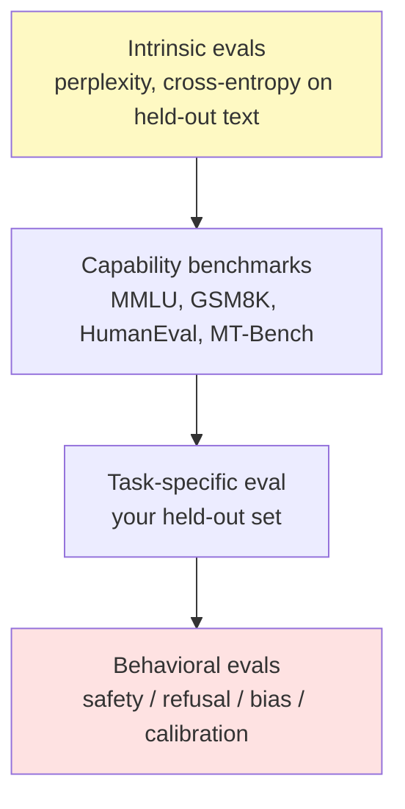
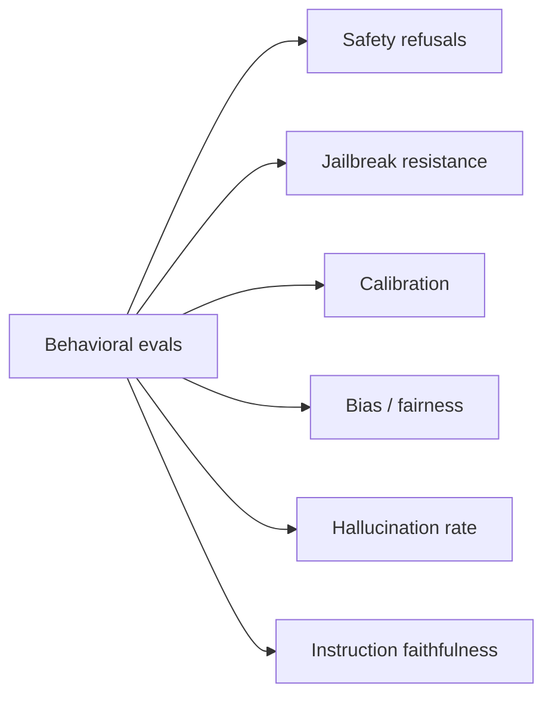
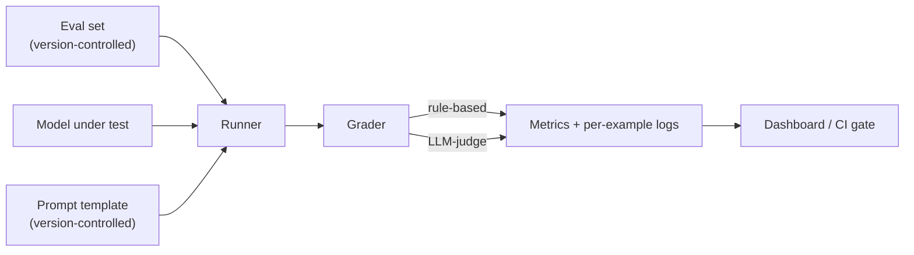

# 1 - Evaluation Methodology and Challenges

[toc]

> **TL;DR:** Evaluating a foundation model is fundamentally harder than evaluating a traditional ML system: there are no fixed labels, no closed task set, and every "answer" is a probability distribution over essays. Sound LLM evaluation is layered — *intrinsic* (perplexity, log-loss), *capability* (benchmarks like MMLU, HumanEval), *task-specific* (your own held-out set), and *behavioral* (safety, refusal, jailbreak). This note maps the landscape and the failure modes that ruin most evaluations: contamination, benchmark gaming, and reward hacking by the model.

## Vocabulary

**Evaluation (eval)**

The process of measuring how well a model performs on a defined task, against a defined metric, on a defined data slice. Every word in that sentence is a choice.

---

**Intrinsic evaluation**

Measures the model's *language-modeling* quality (perplexity, cross-entropy on held-out text). Independent of downstream task; predicts general capability roughly but not perfectly.

---

**Capability benchmark**

A standardized test of a specific capability — MMLU (general knowledge), GSM8K (math), HumanEval (code), MT-Bench (chat). Public, comparable, gamable.

---

**Task-specific evaluation**

A held-out set of (input, expected-output-or-rubric) pairs *for your specific application*. The only eval that directly predicts product quality.

---

**Behavioral evaluation**

Tests for behaviors orthogonal to capability: safety refusals, jailbreak resistance, calibration, bias, instruction faithfulness, hallucination rate.

---

**Contamination / leakage**

The presence of evaluation data inside the training corpus. Causes test-set scores to overestimate true capability; a major and growing problem with public benchmarks.

---

**Goodhart's law for benchmarks**

> When a measure becomes a target, it ceases to be a good measure.

Once a public benchmark is optimized against, it stops reflecting general capability and starts reflecting "how well does this model handle this specific benchmark."

## Intuition

Traditional ML eval is clean. Classifier on MNIST: predicted digit, true digit, accuracy. There's one task, one label per example, one objective metric. LLM eval is messy because almost none of that holds. The "task" is open-ended (write code, summarize, answer, refuse). The "label" is a *family of acceptable answers*, not one specific string. The "metric" must somehow grade fluent text written by a system more capable than most graders. Each of those broken assumptions is a failure mode evaluators have to design around.

The right way to think about LLM evaluation is as a stack of layers, each measuring something different. At the bottom: how good is the language model qua language model? (perplexity, log-loss on natural text). Above that: how well does it handle standardized capability tests? (MMLU, GSM8K, HumanEval). Above that: how well does it do *your task*? (your held-out eval set). At the top: how does it *behave*? (safety, calibration, hallucination, refusal). Each layer answers a different question, and a strong score at one layer does not guarantee a strong score at another.

The single most under-appreciated failure mode is *contamination*. Public benchmarks have been online for years; every modern pre-training corpus has crawled them, often without filtering. When a model "scores 95% on MMLU," there's a real possibility the test items were in its training data. This is why the field has shifted toward *private*, *contamination-checked*, and *constantly-refreshed* evaluation sets — and why public leaderboards in 2026 are treated as advertising rather than ground truth.

## The evaluation stack



Below: cheap, model-agnostic, abstract. Above: expensive, application-specific, concrete. A complete evaluation strategy touches every layer.

### Layer 1 — Intrinsic (language-modeling) evals

The cheapest evaluation: compute the model's average cross-entropy loss on a held-out text corpus. Equivalent to *perplexity*, covered in detail in [Entropy, Cross-Entropy, and Perplexity](./2-entropy-cross-entropy-perplexity.md). Predicts how well the model models text in general; doesn't predict how well it follows instructions.

### Layer 2 — Capability benchmarks

Standardized public tests. Each has its quirks:

| Benchmark | Tests | Format | Notes |
| :--- | :--- | :--- | :--- |
| MMLU | General knowledge across 57 subjects | Multiple choice | Widely contaminated. |
| GSM8K | Grade-school math word problems | Free-text + final numeric | Reasoning sensitivity. |
| MATH | Competition math | Final boxed answer | Very hard; saturates slowly. |
| HumanEval | Python functions from docstring | Pass@k via unit tests | Functional eval (objective). |
| MBPP | Python functions from prose description | Pass@k | Sister benchmark to HumanEval. |
| HellaSwag | Commonsense sentence completion | Multiple choice | Mostly saturated. |
| TruthfulQA | Resistance to common misconceptions | Free text + judge | Tests calibration. |
| MT-Bench / Arena-Hard | Open-ended chat quality | LLM-as-judge | The dominant 2024–2026 chat benchmark. |
| MMLU-Pro / GPQA / SciCode | Newer, harder, less contaminated | Various | The successors to MMLU. |

```python
# Sample MMLU-style eval (single multiple-choice question)
from openai import OpenAI
client = OpenAI()

def mmlu_score(model: str, question: str, choices: list[str], correct_letter: str) -> bool:
    formatted = (
        f"{question}\n"
        + "\n".join(f"{l}. {c}" for l, c in zip("ABCD", choices))
        + "\n\nAnswer with a single letter (A, B, C, or D):"
    )
    resp = client.chat.completions.create(
        model=model,
        messages=[{"role": "user", "content": formatted}],
        max_completion_tokens=2,
        temperature=0,
    )
    pred = resp.choices[0].message.content.strip().upper()[:1]
    return pred == correct_letter

# Aggregate over thousands of items, report accuracy.
```

### Layer 3 — Task-specific eval

The only eval that directly tracks your product's quality. Build it yourself.

```python
from dataclasses import dataclass

@dataclass
class EvalExample:
    id: str
    input: dict             # whatever your endpoint takes
    expected: str | None    # for exact-match tasks; None if rubric-only
    rubric: str | None      # human-readable grading criteria

def run_task_eval(examples: list[EvalExample], answer_fn) -> dict:
    """Returns aggregate metrics over your test set."""
    correct = 0
    failures: list[dict] = []
    for ex in examples:
        out = answer_fn(ex.input)
        ok = (ex.expected is not None and out.strip() == ex.expected.strip()) \
             or (ex.expected is None and judge_with_rubric(out, ex.rubric))
        correct += int(ok)
        if not ok:
            failures.append({"id": ex.id, "got": out, "expected": ex.expected})
    return {"accuracy": correct / len(examples), "failures": failures}
```

The discipline: 100–1000 examples drawn from your real user distribution, hand-graded once, then automated. Rerun on every model change.

### Layer 4 — Behavioral evals

A model can be capable but unsafe, or capable but un-calibrated. Behavioral evals catch these.



- **Safety refusals**: a corpus of harmful queries; does the model refuse?
- **Jailbreak resistance**: variants of those queries dressed up to bypass refusals.
- **Calibration**: when the model says "I'm 90% sure", is it right 90% of the time?
- **Bias / fairness**: differential outcomes by protected attribute on identical tasks.
- **Hallucination rate**: when asked questions with no answer in its training, does it admit it, or invent one?
- **Instruction faithfulness**: when asked to follow a specific format ("no preamble, only JSON"), does it?

## The challenges of evaluating foundation models

### Challenge 1 — Open-endedness

For "summarize this article," there is no single right summary. A summary is *graded*, not *matched*. This pushes evaluation toward subjective scoring (human raters, LLM judges, rubric-based) — each with its own bias and cost. See [AI as a Judge](./5-ai-as-a-judge.md).

### Challenge 2 — Contamination

> [!CAUTION]
> Assume every popular public benchmark from before the model's training cutoff is contaminated. The only reliable evaluation uses (a) data created *after* the model's cutoff, (b) data the lab kept private, or (c) functional evaluation (run code) where memorization doesn't save you.

Contamination tests use n-gram overlap or exact-substring search between training corpus and test set — but you usually can't audit a vendor's training corpus. Sound practice: maintain your own *private* evaluation sets and refresh them quarterly.

### Challenge 3 — Goodhart's law

When a benchmark becomes a target, the field optimizes for *the benchmark*, not for *capability the benchmark was supposed to measure*. GSM8K scores have saturated; the *reasoning* they were proxies for has not. The community responds by inventing new harder benchmarks (MATH → AIME, MMLU → MMLU-Pro → GPQA), which then themselves get gamed and replaced.

### Challenge 4 — The judge is also an LLM

Many open-ended tasks are graded by *another LLM* (LLM-as-judge — see [the dedicated note](./5-ai-as-a-judge.md)). This is cheap and scalable but introduces the judge's own biases: position bias, verbosity bias, self-preference bias. Compensate with rubrics, calibrated judges, and human spot-checks.

### Challenge 5 — Distribution shift

Your eval set was collected at time `t`. Your users are sending queries at time `t + 6 months`. Their behaviors, the topics they care about, and the rate of edge cases all drift. Continuous evaluation against a *fresh* sample of production traffic catches drift the static eval doesn't.

### Challenge 6 — Evaluation noise

Model outputs are stochastic. A single eval run is a noisy estimate. To draw conclusions:

```math
\sigma_\text{score} \approx \sqrt{\frac{p(1-p)}{n}}
```

For `n = 100` and `p = 0.7`, one-sigma noise is `≈ 0.046` — a 5% accuracy difference between models needs much more than 100 examples to be statistically meaningful. Run multiple seeds, report confidence intervals.

## A reusable evaluation harness



```python
import json, time
from concurrent.futures import ThreadPoolExecutor
from dataclasses import asdict, dataclass

@dataclass
class EvalRun:
    model: str
    prompt_version: str
    examples: list[EvalExample]
    n_workers: int = 8

    def run(self, answer_fn, grader_fn) -> dict:
        results: list[dict] = []
        def one(ex: EvalExample) -> dict:
            t0 = time.perf_counter()
            out = answer_fn(ex.input)
            ok = grader_fn(out, ex)
            return {"id": ex.id, "ok": ok, "latency_ms": (time.perf_counter() - t0) * 1000}
        with ThreadPoolExecutor(max_workers=self.n_workers) as ex:
            results = list(ex.map(one, self.examples))
        n = len(results)
        accuracy = sum(r["ok"] for r in results) / n
        latency_p50 = sorted(r["latency_ms"] for r in results)[n // 2]
        return {
            "model": self.model,
            "prompt_version": self.prompt_version,
            "n": n,
            "accuracy": accuracy,
            "latency_p50_ms": latency_p50,
            "results": results,
        }
```

The structure is simple; the discipline is to actually use it every time you change a prompt, switch a model, or update the eval set. CI-gate model releases on this; flag regressions as deploy blockers.

## In practice

> [!IMPORTANT]
> **Eval is a product investment, not a research artifact.** Teams that ship robust LLM products always have a dedicated eval set that grew alongside the product. Teams that flame out always relied on public benchmarks and "looks good to me" prompting.

> [!TIP]
> Build *adversarial slices* into your eval. For each capability your product depends on, include 20–30 deliberately hard examples — edge cases, ambiguous queries, adversarial inputs. Track these separately from the main eval. Regressions on adversarial slices often precede customer-visible regressions by weeks.

> [!NOTE]
> The leaderboards everyone reads — LMSYS Arena, Chatbot Arena Hard, LiveBench — use *human* or *strong-judge* pairwise preferences. These are less gameable than static benchmarks (it's hard to memorize "what people will prefer in side-by-side comparisons") but still subject to position bias, language bias, and Goodhart's law as labs train against them.

A useful frame: divide your eval into **"don't regress"** sets (broad capability, must not drop) and **"climb the hill"** sets (the specific task your product is optimizing for). Treat them with different rigor — climb sets get full statistical testing; don't-regress sets get a one-shot pass/fail gate.

## Pitfalls

- **"My benchmark score went from 78% to 81%."** Is that real, or noise? Without confidence intervals and a paired test, you don't know.
- **"This model scored 95% on MMLU; it knows everything."** It knows *what it memorized from MMLU during training*. Validate on a contamination-checked or private benchmark.
- **"Eval set has 10 examples — should be fine."** It is not fine. 10 examples have ~15% one-sigma noise; any "improvement" is below the noise floor.
- **"I'll just use GPT-4 as the judge for everything."** GPT-4 has its own biases. Validate the judge against human ground truth on a sample before relying on it.
- **"Performance is the same on the benchmark; we're good."** Benchmark performance is necessary, not sufficient. Test on real production traffic and on a sample of recent customer queries. Production distribution drift breaks static evals.
- **"My eval set is small but high-quality, that's enough."** Quality and quantity both matter. 30 expertly-curated examples can't catch class-of-failures the model has on the 200 you didn't write.

## Exercises

### Exercise 1 — Design an eval set for a code-review bot

You're shipping a code-review assistant. Sketch the eval set: how many examples, what they look like, what metrics you'd track, and how you'd guard against contamination.

#### Solution

**Size & shape.** 200–500 examples to start. Each is `(diff, repo-context, expected-review-comments)`. Spread across: easy bugs (off-by-one), style issues, performance concerns, security flaws, false-positive bait (clean diffs).

**Metrics.** (1) *Recall* on a set of known bugs — does the bot flag them? (2) *Precision* on clean diffs — how often does it cry wolf? (3) *Severity match* — does it call critical bugs critical and stylistic issues stylistic? (4) *Latency*.

**Graders.** Mostly rule-based on expected-comment substrings or categories. For nuance ("is this a *good* review of this code?") use LLM-as-judge with a rubric and spot-check 5% manually.

**Contamination guard.** Use diffs from *your own private repos* or from open-source projects whose commits are *after* the model's training cutoff. Refresh the set quarterly. Don't share it publicly.

**Adversarial slice.** 30 deliberately tricky cases: subtle off-by-one, race conditions, refactor-disguised-as-bugfix. Track these separately and gate releases on them.

---

### Exercise 2 — Detect a benchmark gaming

Two models, A and B, both score 92% on MMLU. Model A scores 70% on your task-specific eval; Model B scores 85%. Which is more capable? What might explain the gap?

#### Solution

**Model B is more capable for your task**, by a healthy margin. MMLU agreement is misleading — both models hit the same benchmark ceiling, but only B transfers that to your task.

Explanations for the gap:
1. **Model A was trained more heavily on MMLU-style data.** Its 92% reflects benchmark fit, not general capability. Likely contamination, deliberate or accidental.
2. **Task domain mismatch.** Your task may require behaviors MMLU doesn't test — instruction following, formatting, multi-turn coherence — at which A is weaker.
3. **A's post-training optimized for benchmark accuracy.** This often *reduces* free-form generation quality, exactly what your task needs.

Decision: ship Model B. Trust *your task eval* over public benchmarks when they disagree, every time. This is exactly why task-specific eval exists.

---

### Exercise 3 — Compute statistical significance

Model X gets 78/100 right; Model Y gets 84/100 right on the same eval set. Is Y significantly better?

#### Solution

Two-proportion z-test, but since the *same* examples were used, the paired McNemar's test is correct.

Let `b` = examples X got right but Y got wrong, `c` = examples Y got right but X got wrong. Without the per-example breakdown we estimate. Assume of the 22 X-wrong, 18 are also Y-wrong (overlap) and 4 are Y-right (`c=4`). Then `b = 78 - (78-?) ≈ 76 paired both-right`. To get Y at 84 and overlap of 78 - `b` = 76, we need `b = 2`, `c = 8`.

McNemar's statistic: `χ² = (|b − c| − 1)² / (b + c) = (|2 − 8| − 1)² / (2 + 8) = 25 / 10 = 2.5`. `p ≈ 0.11`. **Not significant** at α = 0.05.

To declare a 6-point difference significant at n=100, you typically need `b + c` to be larger (i.e. more disagreement); paired tests with small sample sizes have wide confidence intervals. Sound practice: target `n ≥ 400` for paired comparisons of similar models.

---

### Exercise 4 — Build a "don't regress" gate

Your team wants to add an automatic deploy gate that blocks any model/prompt change whose eval regresses by more than a threshold. Sketch the gate: what does it measure, where does it run, what's the threshold?

#### Solution

**What it measures.** A frozen set of ~500 "don't regress" examples spanning every capability your product uses. Composite metric: `task_accuracy − λ × p99_latency_seconds` (penalize latency regressions too). Track this score per (model, prompt) version.

**Where it runs.** CI: every PR that touches the prompt files or bumps the model version triggers the eval. Results posted to the PR.

**Threshold.** Two-tier:
- *Yellow*: any single capability drops more than 2 percentage points, OR composite drops more than 1 point. Requires explicit reviewer approval to merge.
- *Red*: composite drops more than 3 points, OR any safety/refusal metric regresses at all. Auto-blocks merge.

**Refresh policy.** Eval set is owned and refreshed quarterly. Updates require a PR and a write-up of what changed. The eval *itself* gets a version number; comparisons across eval versions are flagged as not-directly-comparable.

**Anti-Goodhart caveat.** The team should not optimize prompts *against the gate* — they should optimize for product quality, and the gate is a tripwire. If you find yourself adjusting the gate to make a deploy pass, you have a problem.

## Sources

- Hendrycks, D. et al. (2020). *Measuring Massive Multitask Language Understanding* (MMLU). https://arxiv.org/abs/2009.03300
- Chen, M. et al. (2021). *Evaluating Large Language Models Trained on Code* (HumanEval). https://arxiv.org/abs/2107.03374
- Cobbe, K. et al. (2021). *Training Verifiers to Solve Math Word Problems* (GSM8K). https://arxiv.org/abs/2110.14168
- Lin, S. et al. (2021). *TruthfulQA: Measuring How Models Mimic Human Falsehoods*. https://arxiv.org/abs/2109.07958
- Chiang, W. et al. (2024). *Chatbot Arena: An Open Platform for Evaluating LLMs by Human Preference*. https://arxiv.org/abs/2403.04132
- Sainz, O. et al. (2023). *NLP Evaluation in Trouble: On the Need to Measure LLM Data Contamination for each Benchmark*. https://arxiv.org/abs/2310.18018
- Zheng, L. et al. (2023). *Judging LLM-as-a-Judge with MT-Bench and Chatbot Arena*. https://arxiv.org/abs/2306.05685
- White, C. et al. (2024). *LiveBench: A Challenging, Contamination-Free LLM Benchmark*. https://arxiv.org/abs/2406.19314
- Huyen, C. (2024). *AI Engineering*, Chapters 3 and 4.

## Related

- [2 - Entropy, Cross-Entropy, and Perplexity](./2-entropy-cross-entropy-perplexity.md)
- [3 - Exact and Functional Evaluation](./3-exact-and-functional-evaluation.md)
- [4 - Similarity Measurements and Embeddings (for Eval)](./4-similarity-and-embeddings.md)
- [5 - AI as a Judge](./5-ai-as-a-judge.md)
- [Training Data and Domains](../2-foundation-models/1-training-data-and-domains.md)
- [Prompt Engineering](../1-foundations/5-prompt-engineering.md)
