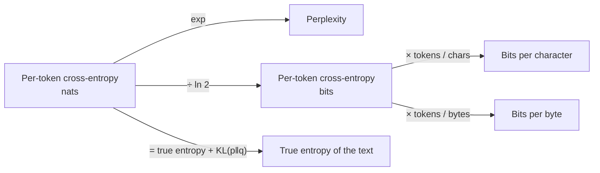

# 2 - Entropy, Cross-Entropy, Bits-Per-Byte, and Perplexity

[toc]

> **TL;DR:** Every "language modeling loss" number you'll see — cross-entropy, perplexity, bits-per-character (BPC), bits-per-byte (BPB) — is a different reparameterization of the same thing: how surprising the model finds held-out text. *Entropy* sets the floor (information content of the text itself). *Cross-entropy* is the actual model's average surprise. *Perplexity* exponentiates it back into "effective vocabulary size." *BPC and BPB* normalize for tokenizer choice so you can compare across models. Master this single information-theoretic story and you'll never be confused by an LM-loss number again.

## Vocabulary

**Entropy**

```math
H(p) = -\sum_x p(x) \log p(x)
```

The expected information content (in *nats* if `log = ln`, in *bits* if `log = log₂`) of samples from a distribution `p`. The theoretical lower bound on the average code length needed to encode samples from `p`.

---

**Cross-entropy**

```math
H(p, q) = -\sum_x p(x) \log q(x) = H(p) + \text{KL}(p \| q)
```

The expected surprise when you use distribution `q` to model samples actually from `p`. Always `≥ H(p)`; equals it iff `q = p`.

---

**KL divergence**

```math
\text{KL}(p \| q) = H(p, q) - H(p)
```

The *excess* surprise from modeling `p` with `q`. Zero when they match. Non-negative, asymmetric.

---

**Negative log-likelihood (NLL)**

```math
\text{NLL}(\theta) = -\frac{1}{N} \sum_{i=1}^N \log P_\theta(x_i)
```

The per-token cross-entropy averaged over your held-out set. The number your training loop prints. Identical to cross-entropy in practice.

---

**Perplexity**

```math
\text{PPL} = \exp(\text{NLL}_{\text{in nats}}) = 2^{\text{NLL}_{\text{in bits}}}
```

The exponential of cross-entropy. Interpretable as "the effective number of equiprobable tokens the model is choosing between." Lower is better.

---

**Bits per character (BPC)**

```math
\text{BPC} = \frac{H \text{ (in bits, summed over the text)}}{\text{number of characters in the text}}
```

Average bits of model surprise per *character* of source text. Tokenizer-independent.

---

**Bits per byte (BPB)**

```math
\text{BPB} = \frac{H \text{ (in bits)}}{\text{number of UTF-8 bytes}}
```

Average bits per *byte* of source text. The most tokenizer-fair metric for cross-model comparison, especially across languages.

## Intuition

Imagine you're guessing the next word in a sentence. "The cat sat on the ___." If you're confident it's "mat" (probability 0.9), you're not very surprised when "mat" arrives — your *log loss* is small. If you assigned "mat" probability 0.01 and it shows up anyway, you're very surprised — high log loss. *Cross-entropy* is the average of that surprise across the entire held-out text. Lower means the model finds the text unsurprising, which means it modeled the language well.

Entropy is the same idea but for the *true* distribution. There's an irreducible amount of surprise in language — the real-world entropy of English text is ~1.0–1.3 bits per character. No model, however perfect, can do better than that on average; that's a fact about *English*, not about the model. Cross-entropy decomposes as `entropy + KL`: the model's loss is the true entropy *plus* however much the model's predictions diverge from reality.

Perplexity is just `exp(cross-entropy)`. It's a more intuitive scale: "perplexity 10" means the model is on average as confused as if it were choosing uniformly between 10 options. The terms are interchangeable up to a logarithm — you'll see them used as if they're different metrics, but they aren't.

BPC and BPB exist because cross-entropy is naturally measured *per token*, and different tokenizers chop text into different numbers of tokens. A model with a 32k vocabulary and a model with a 200k vocabulary cannot be compared by per-token loss; their loss-per-character or loss-per-byte *can* be compared. Bits-per-byte is the cleanest tokenizer-invariant number.

## The math, step by step

### From cross-entropy loss to perplexity

```math
\mathcal{L} = -\frac{1}{N} \sum_{i=1}^N \ln P_\theta(x_i)
```

This is what your training loop prints (in nats). Perplexity:

```math
\text{PPL} = e^{\mathcal{L}} = e^{-\frac{1}{N} \sum \ln P_\theta(x_i)} = \prod_{i=1}^N P_\theta(x_i)^{-1/N}
```

So perplexity is the *geometric mean inverse probability* the model assigns to held-out tokens.

```python
import math, torch
import torch.nn.functional as F

def perplexity_of_text(model, tokenizer, text: str) -> float:
    """Compute the model's perplexity on a single text string."""
    model.eval()
    ids = tokenizer(text, return_tensors="pt").input_ids
    with torch.no_grad():
        logits = model(ids).logits[:, :-1, :]                    # [1, T-1, V]
        targets = ids[:, 1:]                                       # [1, T-1]
        loss = F.cross_entropy(logits.reshape(-1, logits.size(-1)),
                               targets.reshape(-1))              # mean NLL in nats
    return math.exp(loss.item())

# Example
# print(perplexity_of_text(model, tokenizer, "The capital of France is Paris."))
```

A well-trained large LM achieves perplexity ~10–30 on typical English; a small or undertrained model is 100+. The lower bound (true English entropy) corresponds to a perplexity of roughly 6–8 — the Shannon limit no model can cross.

### From per-token loss to bits-per-byte

```math
\text{BPB} = \frac{\mathcal{L} \cdot N_\text{tokens} / \ln 2}{N_\text{bytes}}
```

In words: convert cross-entropy from nats to bits (`÷ ln 2`), multiply by total tokens (to get total bits of surprise across the corpus), divide by total bytes.

```python
def bits_per_byte(model, tokenizer, text: str) -> float:
    """Tokenizer-fair model quality metric. Lower is better."""
    n_bytes = len(text.encode("utf-8"))
    ids = tokenizer(text, return_tensors="pt").input_ids
    n_tokens = ids.shape[1] - 1
    with torch.no_grad():
        loss_nats = F.cross_entropy(
            model(ids).logits[:, :-1].reshape(-1, model.config.vocab_size),
            ids[:, 1:].reshape(-1),
        ).item()
    total_bits = loss_nats / math.log(2) * n_tokens
    return total_bits / n_bytes
```

Modern strong LMs achieve `BPB ≈ 0.5–0.8` on English; the theoretical floor for English text is ~1.0–1.3 BPC. The two are different normalizations: characters are roughly 1.0–1.2 bytes in English.

## The relationships, on one diagram



A single trained-model number propagates into four flavors. Pick the one that matches what you're trying to compare:

- **Same tokenizer, same data, different epoch**: per-token loss / perplexity is fine.
- **Different tokenizers (cross-model comparison)**: use BPC or BPB.
- **Cross-language fairness**: BPB is best, because UTF-8 byte counts don't depend on script.

## Entropy of natural language

```mermaid
flowchart TB
  RAW["Raw English text"] -->|Shannon estimate, 1951| H1["~1.3 bits/char"]
  RAW -->|Cover & King, 1978<br/>gambling experiment| H2["~1.25 bits/char"]
  RAW -->|GPT-2 (2019)| H3["~1.0 bits/char"]
  RAW -->|GPT-3 (2020)| H4["~0.95 bits/char"]
  RAW -->|Modern frontier LMs| H5["~0.7-0.9 bits/char"]
  RAW -->|True (unknown)| H6["~0.6-0.8 bits/char (estimated)"]
```

Shannon's 1951 estimate of English entropy was about 1.3 bits/character. Modern LMs have driven measured BPC below 1 bit. The true lower bound is unknown, but compression-theory arguments place it around 0.6–0.8 bits/character. Each new frontier model continues to inch closer; the cushion is small.

## How perplexity is used in practice

### Use case 1 — pre-training progress tracking

Every training-loop log line. Decreasing per-token loss / perplexity means the model is learning. The same number directly informs scaling-law fits (see [Architecture and Model Size](../2-foundation-models/2-architecture-and-model-size.md)).

### Use case 2 — model comparison on language modeling quality

Compare two models' BPB on the same held-out corpus. The lower-BPB model is the better *language model* — though not necessarily the better *chat model* (see [Methodology](./1-methodology-and-challenges.md) for why intrinsic ≠ downstream).

### Use case 3 — domain probes

Compute perplexity on a *domain-specific* corpus (medical notes, legal documents, code) for several models. Lowest perplexity ≈ best fit for that domain. Cheap, fast way to shortlist candidate base models before fine-tuning.

### Use case 4 — detection and watermarking

The Burroughs / GPTZero family of AI-detection tools use perplexity (and the *spread* of per-token perplexity) to discriminate human-written from model-generated text. AI-generated text tends to be lower-perplexity *and* less variable — a statistical fingerprint, though increasingly unreliable as models improve.

### Use case 5 — quality gates in continued pre-training

When you continue-pretrain on a new corpus, track perplexity on (a) the new corpus and (b) a *general* corpus. The new corpus's perplexity should drop; the general corpus's should not rise much. If general perplexity rises, you have catastrophic forgetting — see [Post-Training](../2-foundation-models/3-post-training-and-finetuning.md).

> [!IMPORTANT]
> A model with lower perplexity is not necessarily a "better" model for downstream use. Perplexity measures *language modeling*, not *instruction following*, *factuality*, or *safety*. A model fine-tuned heavily on chat data may have *higher* perplexity on Wikipedia than its base model — because it now allocates probability mass to chat-style continuations. Lower perplexity is necessary but not sufficient.

## When to use which metric

| Question | Use |
| :--- | :--- |
| "Is my pre-training improving?" | Per-token loss (nats), perplexity. |
| "Which of these models fits my domain best?" | Per-token loss on domain text, OR BPB if different tokenizers. |
| "Is the model better at English than Chinese?" | BPB across the two corpora — character/byte counts are comparable. |
| "Did fine-tuning hurt general-purpose LM quality?" | Perplexity on a frozen general corpus. |
| "Is this text AI-generated?" | Mean and *variance* of per-token perplexity. |
| "How good is my chat model at chatting?" | NOT perplexity — use [task-specific eval](./1-methodology-and-challenges.md). |

## In practice

> [!TIP]
> When you log perplexity during training, *also* log per-token loss. Perplexity blows up rapidly when loss > 5 (it's exponential), masking later improvements visually. Log both; plot loss for the early training, perplexity for the late.

> [!CAUTION]
> Perplexity computed on a held-out set that overlaps with the training set is *not* a real measure of generalization. Always check that your eval text was not seen during training (n-gram check, MinHash overlap, or a separate corpus collected after the training cutoff).

> [!NOTE]
> Some papers report **"bits per token" or "loss per token"** without specifying whether they normalized by character or byte. Same loss in nats vs bits vs perplexity differs by a factor of `ln 2` and `exp`. Always confirm the units before comparing numbers across papers.

A growing alternative for compression-flavored evaluations is *Pile compression ratio* — measure the model as a lossless compressor on a held-out corpus. Frontier LMs compress text to about 0.3× its original size, comparable with the best classical compressors (LZMA at ~0.27×).

## Pitfalls

- **"Perplexity 10 is better than perplexity 50, period."** Only if measured on the same data with the same tokenizer. Cross-model numbers must use BPC/BPB.
- **"My model has perplexity 6 — superhuman!"** Either (a) you trained on the eval set (contamination), or (b) you're computing perplexity wrong. Verify with a fresh corpus.
- **"Cross-entropy = KL divergence."** Cross-entropy = entropy + KL. They are related but not equal.
- **"Lower BPB means lower hallucination rate."** No relationship. A model can compress text well *and* hallucinate freely on open-ended generation. They measure different things.
- **"I'll compare GPT-4 and Llama on perplexity."** Different tokenizers → not directly comparable. Use BPB or run both on the same byte stream after re-tokenization.

## Exercises

### Exercise 1 — Convert between metrics

A model achieves cross-entropy loss of `1.8 nats/token` on a corpus where the average token is 3.7 bytes. (a) Perplexity? (b) Bits per byte?

#### Solution

**(a)** `PPL = exp(1.8) ≈ 6.05`. The model effectively faces ~6 equiprobable choices per token on average.

**(b)** Convert nats to bits: `1.8 / ln 2 ≈ 2.60 bits/token`. Divide by bytes/token:

```math
\text{BPB} = \frac{2.60 \text{ bits/token}}{3.7 \text{ bytes/token}} \approx 0.70\ \text{bits/byte}
```

`BPB ≈ 0.70` is typical of a strong modern English LM.

---

### Exercise 2 — Domain probe

You have three candidate base models (A, B, C). You want to fine-tune one on medical chart notes. You don't have time to fine-tune all three; you need to pick one based on a cheap signal. Sketch the procedure using perplexity.

#### Solution

1. Collect ~50 MB of representative held-out medical chart notes, separate from any data the candidate models might have seen.
2. For each model:
   - Tokenize the corpus with the model's tokenizer.
   - Compute per-token cross-entropy via a single forward pass per chunk.
   - Compute BPB = `(loss_nats / ln 2 × n_tokens) / n_bytes`.
3. Compare the three BPBs. The model with the *lowest* BPB on the medical corpus is the best-fit base — its prior is already closest to medical text.
4. Sanity-check: also compute BPB on a *general* corpus (e.g. Wikipedia). If the medical winner is much worse on general, it may have been heavily over-fit to medical-adjacent data; weigh that against your downstream needs.

This is a one-day spike that saves a 10-day fine-tune on the wrong base.

---

### Exercise 3 — Lower-bound perplexity

A perfect model would achieve perplexity equal to the language's true entropy. For English with true entropy ≈ 1.2 bits/character and ≈ 4 characters per token, what's the minimum achievable per-token perplexity?

#### Solution

True bits per token = `1.2 × 4 = 4.8 bits/token = 4.8 × ln 2 = 3.33 nats/token`.

Minimum perplexity = `exp(3.33) ≈ 27.9`.

In other words, a *perfect* English language model with a 4-byte/token tokenizer cannot achieve perplexity below ~28 per token. Any model claiming perplexity below this either uses a very different tokenizer (more bytes/token), or has memorized the test data, or is computing perplexity wrong.

The fact that GPT-2 reported perplexity ~20 on some benchmarks was a hint that those benchmarks had distributional overlap with training — a contamination/over-fit signal everyone now takes seriously.

---

### Exercise 4 — Catastrophic forgetting via perplexity probe

You continue-pretrain Llama-3-8B on 5B tokens of Spanish text. After training, perplexity on a Spanish corpus drops from 18 to 9 (improvement). Perplexity on a general English corpus rises from 11 to 25 (regression). Is this a good outcome? What's the diagnosis?

#### Solution

**It is *not* a good outcome** unless your product is Spanish-only. The English perplexity more than doubling indicates **catastrophic forgetting** — the model has shifted its prior so heavily toward Spanish that it has lost competence at English.

**Diagnosis.** The training mix was almost certainly 100% Spanish. The model's weights drifted far from the English-capable base in the directions that improve Spanish.

**Fix.** Mix in 20–40% English (or other languages, or general web data) during continued pre-training to prevent drift. Use a lower learning rate and shorter training. Optionally use LoRA on the new language to limit the parameters that can change. Re-measure both corpora after each tweak; you want Spanish perplexity to improve *and* English perplexity to stay within ~10% of baseline. See [Training Data and Domains](../2-foundation-models/1-training-data-and-domains.md) and [Post-Training](../2-foundation-models/3-post-training-and-finetuning.md).

## Sources

- Shannon, C. E. (1951). *Prediction and entropy of printed English*. Bell System Technical Journal. https://archive.org/details/bstj30-1-50
- Cover, T. M. & King, R. C. (1978). *A convergent gambling estimate of the entropy of English*. IEEE Transactions on Information Theory.
- Brown, P. F. et al. (1992). *An estimate of an upper bound for the entropy of English*. Computational Linguistics.
- Cover, T. & Thomas, J. (2006). *Elements of Information Theory* (2nd ed.). Wiley. Chs. 2, 5.
- Goodfellow, I., Bengio, Y., & Courville, A. (2016). *Deep Learning*. Ch. 3 (information theory).
- Delétang, G. et al. (2024). *Language Modeling Is Compression*. https://arxiv.org/abs/2309.10668
- Huyen, C. (2024). *AI Engineering*, Chapter 3.

## Related

- [1 - Evaluation Methodology and Challenges](./1-methodology-and-challenges.md)
- [3 - Exact and Functional Evaluation](./3-exact-and-functional-evaluation.md)
- [Language Models](../1-foundations/2-language-models.md)
- [Architecture and Model Size](../2-foundation-models/2-architecture-and-model-size.md)
- [Post-Training and Fine-tuning](../2-foundation-models/3-post-training-and-finetuning.md)
