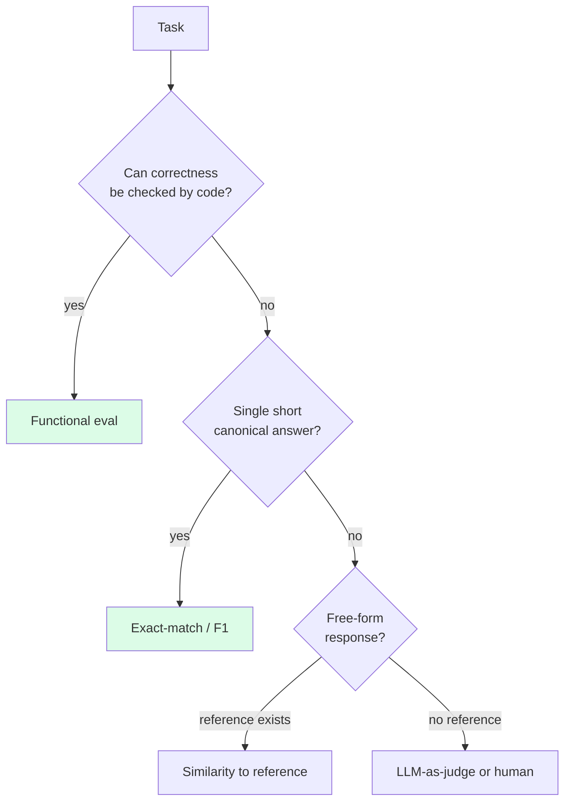

# 3 - Exact and Functional Evaluation

[toc]

> **TL;DR:** When the right answer can be *checked deterministically*, the cheapest, most reliable, least game-able evaluation is to run the check. *Exact-match* compares model output to a gold string. *Functional correctness* runs generated artifacts (code, SQL, JSON, math expressions) and checks behavior. Both eliminate human judges and LLM judges from the loop — at the cost of working only on tasks where "correct" is well-defined.

## Vocabulary

**Exact-match (EM)**

```math
\text{EM}(y, \hat{y}) = \mathbb{1}[\text{normalize}(y) = \text{normalize}(\hat{y})]
```

Output equals expected, after a defined normalization (whitespace, case, punctuation). 1 = match, 0 = mismatch.

---

**Normalized exact-match**

Exact match after canonicalizing both sides (lowercase, strip punctuation, sort multi-item answers, remove articles). The default for SQuAD, TriviaQA, and many QA benchmarks.

---

**Functional correctness**

The output is *executed* and judged by behavior. For code: passes a test suite. For SQL: returns the expected result set. For math: simplifies to the gold expression. For JSON: parses and matches against a schema and reference object.

---

**pass@k**

```math
\text{pass@}k = \mathbb{E}\big[\mathbb{1}[\text{any of } k \text{ samples passes the tests}]\big]
```

The probability that at least one of `k` independently sampled solutions passes all unit tests. The standard metric for code benchmarks (HumanEval, MBPP).

---

**Unit test / verifier**

A piece of executable code that takes a candidate solution and returns pass/fail. The atom of functional evaluation.

---

**Sandboxing**

Running untrusted model-generated code in an isolated environment (Docker container, ephemeral VM, gVisor) so it cannot read secrets, write files, or call external services unintendedly.

## Intuition

Open-ended LLM evaluation is hard because "is this paragraph good?" requires a grader with taste. But many production tasks aren't open-ended at all. "Does this SQL return the right rows?" is yes or no. "Does this Python function pass its tests?" is yes or no. "Does this answer string equal `'Paris'` after lowercasing and stripping?" is yes or no. For these tasks, *don't* ask a human or another LLM — just run the check. It's cheaper, deterministic, and reward-hacking-resistant.

Exact-match is the simplest form: compare strings after a normalization step. It works for short factual answers (Trivia, math final answers, classification labels), enum outputs (sentiment categories), and structured fields (dates, codes, IDs). It fails on anything with multiple valid phrasings — "the capital of France is Paris" vs "Paris" vs "Paris, France." Normalization can paper over some variation; the rest needs richer evaluation.

Functional correctness is the next level up. Instead of comparing strings, run the artifact and check behavior. Code: execute it; pass if all tests pass. SQL: run it; pass if rows match. Math: evaluate symbolically; pass if equivalent. JSON: parse and compare. The big payoff is that the model can phrase the *solution* however it likes — different variable names, different algorithms — and still pass, as long as *behavior* is correct. This is exactly the kind of evaluation that produced HumanEval, the field's first widely-used code benchmark, and that powers most modern code, SQL, and math evaluations.

## Exact-match in detail

### When it's the right tool

- **Factual QA with short answers**: "What's the capital of France?" → `"Paris"`.
- **Classification**: input → one of `{positive, negative, neutral}`.
- **Structured extraction**: extract a date, ID, or code from text.
- **Multiple-choice**: select `A`, `B`, `C`, or `D`.

### The normalization function matters

```python
import re, unicodedata, string

def normalize_for_em(s: str) -> str:
    """SQuAD-style normalization: NFC, lower, strip articles, collapse whitespace."""
    s = unicodedata.normalize("NFC", s)
    s = s.lower()
    s = re.sub(r"\b(a|an|the)\b", " ", s)              # remove articles
    s = "".join(c for c in s if c not in string.punctuation)
    s = re.sub(r"\s+", " ", s).strip()
    return s

def exact_match(predicted: str, gold: str) -> bool:
    return normalize_for_em(predicted) == normalize_for_em(gold)

assert exact_match("The Eiffel Tower", "eiffel tower")
assert exact_match("Paris, France", "paris france")
assert not exact_match("Lyon", "Paris")
```

The choice of normalization is the choice of how strict you want to be. Looser normalization (strip articles, lowercase, punctuation-insensitive) makes the metric forgive harmless variation. Stricter normalization (preserve case, punctuation) is for tasks where those *matter* (case-sensitive variable names, code, identifiers).

### F1 — partial credit for the multi-token case

When the gold answer is multi-word and the model gets *most* of it right, exact-match gives 0 but token-overlap F1 gives partial credit:

```math
F_1 = \frac{2 \cdot |\text{tok}(\hat{y}) \cap \text{tok}(y)|}{|\text{tok}(\hat{y})| + |\text{tok}(y)|}
```

```python
def f1_score(pred: str, gold: str) -> float:
    pred_toks = normalize_for_em(pred).split()
    gold_toks = normalize_for_em(gold).split()
    if not pred_toks or not gold_toks:
        return float(pred_toks == gold_toks)
    common = set(pred_toks) & set(gold_toks)
    n_common = sum(min(pred_toks.count(t), gold_toks.count(t)) for t in common)
    if n_common == 0:
        return 0.0
    precision = n_common / len(pred_toks)
    recall = n_common / len(gold_toks)
    return 2 * precision * recall / (precision + recall)

print(f1_score("Eiffel Tower in Paris", "the Eiffel Tower"))   # ~0.67
```

F1 is the SQuAD standard alongside exact-match; report both.

## Functional correctness

### Code: pass@k

The dominant code-evaluation paradigm. Given a problem (description + tests), sample `k` candidate solutions. The model "passes" the problem if *any* of the `k` solutions pass all tests.

```mermaid
flowchart LR
  PROB[Problem<br/>description + tests] --> SAMPLE[Sample k solutions<br/>at temperature t]
  SAMPLE --> S1[Solution 1]
  SAMPLE --> S2[Solution 2]
  SAMPLE --> SK[Solution k]
  S1 --> RUN1[Run tests in sandbox]
  S2 --> RUN2[Run tests in sandbox]
  SK --> RUNK[Run tests in sandbox]
  RUN1 --> AGG{Any pass?}
  RUN2 --> AGG
  RUNK --> AGG
  AGG -->|yes| PASS[pass@k = 1]
  AGG -->|no| FAIL[pass@k = 0]
```

The unbiased estimator from the HumanEval paper:

```math
\text{pass@}k = \mathbb{E}_{\text{problems}}\left[ 1 - \frac{\binom{n - c}{k}}{\binom{n}{k}} \right]
```

where `n` is the number of samples drawn per problem (`n ≥ k`) and `c` is the number of correct samples. This estimator is preferred over the naive "did any of the first `k` pass" because it uses all `n` samples and has lower variance.

```python
import math

def unbiased_pass_at_k(n: int, c: int, k: int) -> float:
    """n samples taken, c passed, compute pass@k."""
    if n - c < k:
        return 1.0
    return 1.0 - math.prod((n - c - i) / (n - i) for i in range(k))

print(unbiased_pass_at_k(n=10, c=3, k=1))   # ~0.30
print(unbiased_pass_at_k(n=10, c=3, k=5))   # ~0.83
```

`pass@1` measures "how often is the model right on the first shot." `pass@10` measures "how often is the model right within 10 attempts." The gap between them tells you how much *sampling diversity* the model can leverage (relevant for [Test-Time Compute](../2-foundation-models/5-test-time-compute.md)).

### A complete code evaluator

```python
import subprocess
import tempfile
import textwrap
import os

def run_python_in_sandbox(code: str, tests: str, timeout: float = 5.0) -> bool:
    """Write code+tests to a tempfile, run in subprocess, return pass/fail."""
    full = code + "\n\n" + tests
    with tempfile.NamedTemporaryFile("w", suffix=".py", delete=False) as f:
        f.write(full)
        path = f.name
    try:
        # In real production: run inside Docker/Firejail with no network and no FS access
        result = subprocess.run(
            ["python", path],
            capture_output=True, text=True, timeout=timeout,
            env={"PATH": "/usr/bin"},
        )
        return result.returncode == 0
    except subprocess.TimeoutExpired:
        return False
    finally:
        os.unlink(path)

# Example
candidate = """
def add(a, b):
    return a + b
"""
tests = """
assert add(1, 2) == 3
assert add(-1, 1) == 0
"""
print(run_python_in_sandbox(candidate, tests))  # True
```

> [!CAUTION]
> Never run model-generated code without sandboxing. Even a well-intentioned model can emit `os.system("rm -rf /")`. Production sandboxes use Docker with no network, no host volumes, dropped capabilities, and a strict CPU/RAM/time budget. For high-volume eval, run on disposable VMs or in cloud-managed sandboxes (Firecracker, gVisor).

### SQL: result-set comparison

For SQL evaluation, the cleanest functional check is: run both the gold and the candidate queries against a reference database; compare the result *sets* (often order-insensitive unless ORDER BY is part of the task).

```python
import sqlite3
from collections import Counter

def sql_results_equal(db_path: str, gold_sql: str, pred_sql: str,
                      order_sensitive: bool = False) -> bool:
    con = sqlite3.connect(db_path)
    try:
        gold = con.execute(gold_sql).fetchall()
        pred = con.execute(pred_sql).fetchall()
    finally:
        con.close()
    if order_sensitive:
        return gold == pred
    return Counter(map(tuple, gold)) == Counter(map(tuple, pred))
```

This is robust to *phrasing* differences (LEFT JOIN vs INNER JOIN where both produce the same rows; different column orderings if your task doesn't care). It's *not* robust to *semantically subtle* tasks (returning the same rows for the test data but the wrong rows on other data) — pair it with a held-out test database when stakes are high.

### Math: symbolic equivalence

For math, comparing strings (`"x^2 - 1"` vs `"(x - 1)(x + 1)"`) misses correctness. Use a CAS (computer algebra system) to check equivalence.

```python
from sympy import sympify, simplify

def math_equiv(pred: str, gold: str) -> bool:
    try:
        diff = simplify(sympify(pred) - sympify(gold))
        return diff == 0
    except Exception:
        return False

print(math_equiv("(x-1)*(x+1)", "x**2 - 1"))   # True
print(math_equiv("x**2", "x**2 + 1"))           # False
```

For final-answer math benchmarks (MATH, GSM8K, AIME) it's often sufficient to extract the final numeric answer with regex and compare — `\boxed{42}` → `42` → exact match.

## Where functional correctness wins



The hierarchy of evaluation reliability: **functional > exact > similarity > LLM-judge > human**. The first two are deterministic; the rest aren't. When you can move *up* the hierarchy, do.

## In practice

> [!IMPORTANT]
> Functional evaluation is gold-standard *only* if your test suite is comprehensive. A weak test suite (`assert add(1, 2) == 3`) accepts implementations that pass that specific case but fail in general (`def add(a, b): return 3`). Invest in robust, adversarial test suites; the model will find every loophole.

> [!TIP]
> For tasks that are *almost* functional but have non-trivial output formatting (a Python function inside a markdown code block with explanation), pre-process the model output to extract the code (regex on ```` ```python ... ``` ````) before running the tests. Make the extractor *strict* — if extraction fails, count it as a failure rather than guessing.

> [!NOTE]
> Functional correctness is the foundation of modern reasoning-model training (RL with verifiable rewards). The model generates solutions, the verifier returns binary pass/fail, RL uses that as the reward. Code, math, and formal proofs are where the strongest improvements happen — because the reward signal is *clean*. See [Test-Time Compute](../2-foundation-models/5-test-time-compute.md).

In production, even open-ended LLM apps often have *some* functional component you can grade. A chat app may grade tool-call argument shapes (JSON validity, type checks). A summarization app may grade extracted entities (entity F1 against gold). Find the functional substrate of your task; grade what you can.

## Pitfalls

- **"Exact-match is too strict."** Often it is — for free-form QA. Add F1 alongside, or pivot to semantic similarity (next note). Don't ignore EM though; it's a strong signal for short factual tasks.
- **"My test suite is comprehensive."** It rarely is. Models find creative wrong answers that pass weak tests. Run adversarial review on your tests.
- **"`pass@10` is the right metric to report."** It is *a* metric, but for production scenarios where you only run the model once, `pass@1` is what matters. Report both.
- **"I'll just `subprocess.run` the model's code."** And one day the model emits code that opens 10k file descriptors or queries your prod DB. Sandbox, always.
- **"Functional eval works for everything."** It doesn't. Free-form generation, summarization, translation, dialog — these need different metrics. Choose the metric to fit the task, not the task to fit the metric.

## Exercises

### Exercise 1 — Normalize a tricky exact-match

For a date-extraction task, the gold answer is `"2024-03-15"`. The model returns `" March 15, 2024 "`. (a) Does the normalization above produce a match? (b) Write a normalizer that *does* match these.

#### Solution

**(a)** No. The simple normalizer lowercases and strips punctuation but doesn't convert formats. After normalization the gold is `"2024-03-15"` (digits and dashes survive; punctuation stripping removes the dashes → `"2024 03 15"`). The model output becomes `"march 15 2024"`. Different.

**(b)** Use a parser instead of string normalization for typed fields:

```python
from dateutil import parser

def normalize_date(s: str) -> str:
    try:
        return parser.parse(s, dayfirst=False).date().isoformat()
    except (ValueError, TypeError):
        return ""

def date_em(pred: str, gold: str) -> bool:
    p, g = normalize_date(pred), normalize_date(gold)
    return p != "" and p == g

print(date_em("March 15, 2024", "2024-03-15"))  # True
```

The general lesson: when the field has a *type* (date, number, email, URL), normalize by parsing into the canonical typed representation, not by string munging.

---

### Exercise 2 — Compute pass@1 and pass@10

For 10 problems, you sample 20 solutions each. The number of passing solutions per problem is: `[20, 19, 12, 5, 2, 0, 0, 8, 11, 17]`. Compute `pass@1` and `pass@10` across the set.

#### Solution

For each problem, `pass@k(n, c, k) = 1 − C(n−c, k) / C(n, k)`. Compute per-problem, then average:

```python
def pass_at_k(n: int, c: int, k: int) -> float:
    if n - c < k:
        return 1.0
    return 1.0 - math.prod((n - c - i) / (n - i) for i in range(k))

passes = [20, 19, 12, 5, 2, 0, 0, 8, 11, 17]
n = 20
p_at_1  = sum(pass_at_k(n, c, 1)  for c in passes) / len(passes)
p_at_10 = sum(pass_at_k(n, c, 10) for c in passes) / len(passes)
print(f"pass@1  = {p_at_1:.3f}")    # ~0.470
print(f"pass@10 = {p_at_10:.3f}")   # ~0.755
```

The gap `pass@10 − pass@1 ≈ 0.29` measures *sampling leverage*: the model can solve about 29% more problems if allowed to try 10 times. This gap is a key input to deciding whether to invest in [test-time compute](../2-foundation-models/5-test-time-compute.md) (self-consistency, best-of-N).

---

### Exercise 3 — Sandboxing checklist

You're writing a code-eval harness. List five concrete sandbox restrictions you'd enforce on model-generated Python code, and what each prevents.

#### Solution

1. **No network access.** Block all egress at the container/network level. Prevents data exfiltration (sending secrets out) and DOS-by-curl.
2. **Read-only filesystem except `/tmp`.** Prevents the model from writing to `~/.ssh/authorized_keys`, modifying the runner's source, or planting persistence.
3. **CPU + wall-clock timeout.** 5 seconds wall-clock, 5 CPU-seconds. Prevents infinite loops, fork bombs, and Bitcoin miners.
4. **Memory limit.** 256 MB RSS via `ulimit` or container limits. Prevents OOM-killing the runner host.
5. **Process count limit.** `ulimit -u 32` or container PID limits. Prevents fork bombs (`:(){:|:&};:`) and large parallelism abuse.
6. *(Bonus)* **No syscall escapes.** Use gVisor or `seccomp` to block dangerous syscalls (`ptrace`, `kexec_load`, `setuid`). Prevents container escapes.

Production code-eval at scale (HumanEval+, EvalPlus, BigCodeBench leaderboards) layers all six. Defense in depth — one bypassed restriction shouldn't compromise the host.

---

### Exercise 4 — When exact-match misleads

You evaluate a QA model on a TriviaQA-style set with exact-match. Model A scores 60%; Model B scores 55%. You suspect A "wins" because it's more terse, not because it's more accurate. How would you investigate?

#### Solution

1. **Compare F1.** If A's F1 is also 60% but B's F1 is 75%, B produces *longer answers that contain the right substring* but fail exact match. Lesson: B may be more accurate but more verbose.
2. **Manually grade a sample.** Take 50 disagreements (A correct & B wrong) and 50 (B correct & A wrong); manually judge which is *actually* right. The labels may reveal that EM penalizes B's verbosity unfairly.
3. **Re-evaluate with a softer matcher.** Use semantic-similarity matching (next note) or LLM-as-judge with a strict rubric; see if the ranking flips.
4. **Add a length-controlled slice.** Filter to questions where both models gave answers of similar length; re-compute EM. The bias is removed.
5. **Pivot the metric.** If EM is structurally unfair to verbose-but-correct models, EM is the wrong primary metric for this task. Report it but choose F1 or judge-score as the gate.

Outcome: depending on the data, you may decide A is genuinely better, or that EM was misleading and B is. Don't trust a single metric; the comparison is only as good as the metric's fit to the task.

## Sources

- Rajpurkar, P. et al. (2016). *SQuAD: 100,000+ Questions for Machine Comprehension of Text*. https://arxiv.org/abs/1606.05250
- Joshi, M. et al. (2017). *TriviaQA: A Large Scale Distantly Supervised Challenge Dataset for Reading Comprehension*. https://arxiv.org/abs/1705.03551
- Chen, M. et al. (2021). *Evaluating Large Language Models Trained on Code* (HumanEval + pass@k). https://arxiv.org/abs/2107.03374
- Liu, J. et al. (2023). *Is Your Code Generated by ChatGPT Really Correct? Rigorous Evaluation of Large Language Models for Code Generation* (EvalPlus). https://arxiv.org/abs/2305.01210
- Hendrycks, D. et al. (2021). *Measuring Mathematical Problem Solving with the MATH Dataset*. https://arxiv.org/abs/2103.03874
- Yu, T. et al. (2018). *Spider: A Large-Scale Human-Labeled Dataset for Complex and Cross-Domain Semantic Parsing and Text-to-SQL Task*. https://arxiv.org/abs/1809.08887
- OpenAI Sandbox (Code Interpreter / Advanced Data Analysis) — security model. https://platform.openai.com/docs/assistants/tools/code-interpreter
- Huyen, C. (2024). *AI Engineering*, Chapter 3.

## Related

- [1 - Evaluation Methodology and Challenges](./1-methodology-and-challenges.md)
- [2 - Entropy, Cross-Entropy, and Perplexity](./2-entropy-cross-entropy-perplexity.md)
- [4 - Similarity Measurements and Embeddings (for Eval)](./4-similarity-and-embeddings.md)
- [Test-Time Compute](../2-foundation-models/5-test-time-compute.md)
- [Structured Outputs](../2-foundation-models/6-structured-outputs.md)
