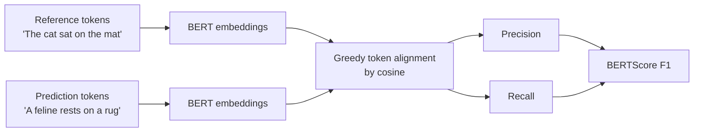

# 4 - Similarity Measurements and Embeddings for Evaluation

[toc]

> **TL;DR:** When the right answer is not a single string but a *family* of acceptable answers, similarity-based metrics give partial credit. *Surface-form* metrics (BLEU, ROUGE, METEOR, edit distance) compare n-gram overlap — cheap, well-understood, but blind to paraphrase. *Embedding-based* metrics (BERTScore, semantic-similarity cosine, BLEURT) compare *meaning* — better correlation with human judgment but more expensive and model-dependent. Use them as a middle ground between strict [exact-match](./3-exact-and-functional-evaluation.md) and full [LLM-as-judge](./5-ai-as-a-judge.md).

## Vocabulary

**Reference-based metric**

A metric that scores a model output against one or more *reference* outputs. The reference is the gold standard.

---

**BLEU (BiLingual Evaluation Understudy)**

```math
\text{BLEU} = \text{BP} \cdot \exp\Big(\sum_{n=1}^{N} w_n \log p_n\Big)
```

Modified n-gram precision with a brevity penalty. The original machine-translation metric. Range `[0, 1]`, higher is better.

---

**ROUGE**

A family of recall-oriented metrics for summarization. ROUGE-N (n-gram recall), ROUGE-L (longest common subsequence), ROUGE-W (weighted LCS).

---

**METEOR**

A metric that improves on BLEU by adding stemming, synonym matching, and recall — historically better at matching human judgment for translation.

---

**Edit distance / Levenshtein**

Minimum number of single-character insertions, deletions, and substitutions to transform one string into another. The classic string-similarity metric.

---

**Semantic similarity (cosine on embeddings)**

```math
\text{sim}(y, \hat{y}) = \cos(\text{embed}(y), \text{embed}(\hat{y}))
```

Cosine of the angle between embedding vectors of the reference and the prediction. Captures meaning, not surface form.

---

**BERTScore**

A reference-based metric that uses BERT-family contextual embeddings to compute *token-level* alignment between candidate and reference. F1-flavored aggregation.

---

**BLEURT**

A learned metric that fine-tunes BERT on synthetic noise to predict human judgment scores. More accurate but model-dependent.

## Intuition

For tasks where the answer is open-ended — translation, summarization, paraphrase, long-form QA — exact-match misses every case where the model used different words for the same meaning. Two summaries can be excellent and share zero rare n-grams; two summaries can be terrible and share many. A useful similarity metric should reward *semantic agreement* with the reference even when the surface forms differ.

The metrics divide into two camps. *Surface-form* metrics count n-gram overlaps or character edits. They're cheap, deterministic, and have decades of literature. Their weakness is they don't *understand* the words — "the cat is on the mat" and "a feline rests upon the rug" are paraphrases but share no content n-grams, so BLEU scores them zero. *Embedding-based* metrics use a learned model (typically BERT or sentence-transformers) to compare *meaning* in vector space. They handle paraphrase well but depend on the quality of the embedding model and can be gamed by adversarial inputs that have the right embedding but wrong meaning.

For most modern engineering, the practical recipe is: use surface-form metrics (BLEU, ROUGE) because they're free and historically reported; use semantic similarity (cosine on a strong embedder) because it correlates better with human judgment; report multiple metrics rather than a single number; and gate big decisions on a sample of human / [LLM-judge](./5-ai-as-a-judge.md) labels.

## Surface-form metrics

### BLEU — for translation

```math
p_n = \frac{\sum_{\text{cand}} \min(\text{count}(\text{ngram}, \text{cand}), \text{count}(\text{ngram}, \text{ref}))}{\sum_{\text{cand}} \text{count}(\text{ngram}, \text{cand})}
```

*Modified* n-gram precision: clip the candidate's n-gram counts at the reference's count to prevent "the the the the the" gaming. Multiply geometric mean of `p_1, …, p_4` with a brevity penalty:

```math
\text{BP} = \min\Big(1, \exp\big(1 - \tfrac{|r|}{|c|}\big)\Big)
```

```python
from sacrebleu import corpus_bleu

references = [["the cat sat on the mat"]]   # list of reference lists (one per candidate)
candidates = ["a cat is sitting on a mat"]
score = corpus_bleu(candidates, references)
print(f"BLEU = {score.score:.2f}")          # ~30 — modest because of paraphrase
```

> [!TIP]
> Use `sacrebleu` rather than `nltk.translate.bleu_score`. `sacrebleu` standardizes tokenization, smoothing, and reference handling — making your BLEU scores comparable to published ones. Different tokenization choices alone can swing BLEU by ±5 points.

### ROUGE — for summarization

ROUGE is *recall*-oriented (BLEU is precision-oriented): how much of the reference's n-grams the summary recovers. The three you'll see:

| Variant | What it counts |
| :--- | :--- |
| ROUGE-1 | Unigram overlap (proper-noun coverage) |
| ROUGE-2 | Bigram overlap (fluency proxy) |
| ROUGE-L | Longest common subsequence (structural) |

```python
from rouge_score import rouge_scorer

scorer = rouge_scorer.RougeScorer(["rouge1", "rouge2", "rougeL"], use_stemmer=True)
scores = scorer.score(
    "The mat is sat on by the cat.",
    "the cat sat on the mat"
)
for k, v in scores.items():
    print(f"  {k}: F1 = {v.fmeasure:.3f}")
```

ROUGE was *defined* on news summarization (CNN/DailyMail). It generalizes uneasily — for chat summarization, code-comment summarization, or any task with multiple acceptable outputs, ROUGE tends to underestimate quality.

### Edit distance

For tasks where you care about *closeness* of strings (post-editing, code suggestions, OCR):

```python
def levenshtein(a: str, b: str) -> int:
    """Standard O(|a|·|b|) edit distance."""
    if len(a) < len(b):
        a, b = b, a
    prev = list(range(len(b) + 1))
    for i, ca in enumerate(a, start=1):
        curr = [i]
        for j, cb in enumerate(b, start=1):
            cost = 0 if ca == cb else 1
            curr.append(min(prev[j] + 1, curr[j - 1] + 1, prev[j - 1] + cost))
        prev = curr
    return prev[-1]

print(levenshtein("Levenshtein", "Levenshteen"))   # 1
```

Normalized edit distance: `1 - lev(a, b) / max(|a|, |b|)` gives a `[0, 1]` similarity. Useful when text is short and small differences matter character-by-character.

## Embedding-based metrics

### Semantic similarity (cosine)

The simplest embedding-based eval: embed the reference and the prediction; take their cosine.

```python
from openai import OpenAI
import numpy as np

client = OpenAI()

def semantic_similarity(pred: str, ref: str,
                         model: str = "text-embedding-3-small") -> float:
    resp = client.embeddings.create(model=model, input=[pred, ref])
    v_pred = np.array(resp.data[0].embedding, dtype=np.float32)
    v_ref  = np.array(resp.data[1].embedding, dtype=np.float32)
    return float(np.dot(v_pred, v_ref) /
                 (np.linalg.norm(v_pred) * np.linalg.norm(v_ref)))

print(semantic_similarity("A feline rests on a rug.",
                          "The cat sat on the mat."))   # ~0.78
print(semantic_similarity("Espresso is brewed under pressure.",
                          "The cat sat on the mat."))   # ~0.18
```

For batched eval, embed all references once and all predictions once, then compute cosine matrices in numpy. See [Multimodal Models and Embeddings](../1-foundations/4-multimodal-and-embeddings.md) for the embedding-space mechanics.

### BERTScore — token-level semantic alignment

Where simple cosine compares whole sentences, BERTScore aligns *tokens* between candidate and reference using contextual BERT embeddings.



```python
from bert_score import score

cand = ["A feline rests on a rug."]
refs = ["The cat sat on the mat."]
P, R, F = score(cand, refs, model_type="microsoft/deberta-large-mnli", lang="en")
print(f"BERTScore F1 = {F[0]:.3f}")   # ~0.92 — much higher than BLEU
```

BERTScore correlates substantially better with human judgment than BLEU/ROUGE on translation, paraphrase, and summarization — at the cost of a forward pass through a BERT-family model per pair. Cheap enough for offline eval; not for inference-loop scoring.

### BLEURT — learned eval

Fine-tunes BERT on synthetic perturbations (deletions, swaps, paraphrases) paired with human ratings, so the model learns to predict "how much would a human knock points off?" Higher correlation with humans than BERTScore on many tasks; model-dependent and not language-portable.

## Comparing the metrics

| Metric | Captures meaning | Cost | Determinism | Best for |
| :--- | :---: | :---: | :---: | :--- |
| Exact-match | ✗ | tiny | ✓ | Short factual answers |
| F1 (token) | partial | tiny | ✓ | Short multi-token answers |
| BLEU | ✗ | small | ✓ | Translation (legacy) |
| ROUGE | ✗ | small | ✓ | Summarization (legacy) |
| METEOR | partial | small | ✓ | Translation (better than BLEU) |
| Edit distance | ✗ | small | ✓ | OCR, code, post-edit |
| Semantic cosine | ✓ | medium | ✓ within model | Open-ended QA, paraphrase |
| BERTScore | ✓ | medium | ✓ within model | Translation, summarization (modern) |
| BLEURT | ✓ | medium | ✓ within model | Tightest human correlation, harder to set up |
| LLM-as-judge | ✓ | high | partly | Complex / multi-axis quality (next note) |

## A unified scoring harness

```python
from dataclasses import dataclass
from typing import Callable

@dataclass
class SimilarityMetric:
    name: str
    fn: Callable[[str, str], float]
    higher_is_better: bool = True

metrics: list[SimilarityMetric] = [
    SimilarityMetric("exact_match", lambda p, g: float(p.strip() == g.strip())),
    SimilarityMetric("token_f1",    f1_score),                  # from previous note
    SimilarityMetric("bleu_corpus", lambda p, g: corpus_bleu([p], [[g]]).score / 100),
    SimilarityMetric("rouge_l",
                     lambda p, g: scorer.score(g, p)["rougeL"].fmeasure),
    SimilarityMetric("semantic",    semantic_similarity),
]

def grade_pair(pred: str, gold: str) -> dict[str, float]:
    return {m.name: m.fn(pred, gold) for m in metrics}

# Use case
result = grade_pair(
    "A feline rests upon a rug.",
    "The cat sat on the mat."
)
print(result)
# {'exact_match': 0.0, 'token_f1': 0.18, 'bleu_corpus': 0.0,
#  'rouge_l': 0.27, 'semantic': 0.78}
```

The dispersion tells the story: surface metrics say "totally different"; semantic similarity says "saying essentially the same thing." When metrics disagree, the *task* tells you which to trust.

## In practice

> [!IMPORTANT]
> Pick the metric that matches the task. For machine translation, BLEU is required (it's the field's lingua franca even if dated). For modern open-ended generation, semantic similarity or BERTScore correlates better with humans. For factual short-answer QA, exact-match + F1 is enough.

> [!TIP]
> Always report **multiple metrics**. A single number is easy to over-fit to and easy to game. Multi-metric reporting forces you to confront the trade-offs the model is making — "improved BLEU but dropped BERTScore" usually signals the model is gaming surface form.

> [!CAUTION]
> Embedding-based metrics are not absolute. A cosine of 0.85 means different things across embedding models. Calibrate thresholds per-model on labeled data; don't port them blindly. See the related warnings in [Multimodal Models and Embeddings](../1-foundations/4-multimodal-and-embeddings.md).

Reference-based metrics fundamentally require a *gold reference*. For tasks where no good reference exists (open-ended chat, creative writing), they don't apply — you escalate to [LLM-as-judge](./5-ai-as-a-judge.md) or human ratings.

## Pitfalls

- **"BLEU > 30 is good."** Depends on the language pair, domain, and reference count. For close language pairs with multiple high-quality references, BLEU 50 is achievable; for low-resource pairs, BLEU 15 is impressive.
- **"BERTScore is unbiased."** It inherits the BERT model's biases — domain (news-heavy training), language (English-best), and tokenizer.
- **"Semantic similarity catches everything."** It catches *meaning equivalence*. It does not catch *factual correctness* — two confidently-wrong answers about Napoleon's birthday can have very high mutual cosine.
- **"Edit distance is the right metric for code."** Only for *small refactors / patches*. For code-from-spec, run the tests ([functional correctness](./3-exact-and-functional-evaluation.md)) instead.
- **"I'll just use one metric to gate releases."** A single metric is easy to optimize to the point of regression on others. Use a *composite* with explicit weights, and re-evaluate the weights periodically.

## Exercises

### Exercise 1 — Pick a metric for each task

For each task, pick the most appropriate primary metric (and a secondary), and justify.

1. English → French translation of news headlines.
2. Summarization of long news articles.
3. Question answering with short factual answers.
4. Paraphrase quality on a dataset of (input, paraphrase) pairs.
5. Open-ended dialog response generation.

#### Solution

1. **Translation** — primary BLEU (industry-standard); secondary BERTScore (catches paraphrase-level wins BLEU misses). Modern teams also report COMET, a learned eval that's even better-correlated with human judgment.
2. **Summarization** — primary ROUGE-L (recall on long-distance structure); secondary BERTScore or BLEURT (semantic faithfulness). Optionally a *faithfulness*-specific metric (entity F1, FactCC) for grounding.
3. **Short-factual QA** — primary exact-match (after normalization); secondary token F1 for partial credit. Semantic similarity is overkill and can over-credit close-but-wrong answers.
4. **Paraphrase** — primary semantic similarity (you *want* surface-form difference); secondary BERTScore. BLEU/ROUGE *under*estimate paraphrase quality because they reward staying close to input.
5. **Open-ended dialog** — no reference to compare against. Use [LLM-as-judge](./5-ai-as-a-judge.md) with a rubric (helpfulness, harmlessness, instruction-following). Reference-based metrics are not appropriate.

---

### Exercise 2 — Compute a composite eval score

You want a single 0-100 score combining: exact-match (weight 0.3), token-F1 (0.3), BLEU (0.2), semantic similarity (0.2). Write a function and apply it to one example.

#### Solution

```python
def composite_score(pred: str, gold: str) -> float:
    scores = grade_pair(pred, gold)
    weighted = (
        0.3 * scores["exact_match"]
      + 0.3 * scores["token_f1"]
      + 0.2 * scores["bleu_corpus"]
      + 0.2 * scores["semantic"]
    )
    return weighted * 100

print(composite_score("A feline rests upon a rug.",
                      "The cat sat on the mat."))
# ~0.3*0 + 0.3*0.18 + 0.2*0 + 0.2*0.78 = ~21
```

A few principles when designing composites: (1) keep weights interpretable (sum to 1, each ≥ 0); (2) revisit weights when the metric mix changes; (3) report the raw components alongside the composite so you can diagnose regressions.

---

### Exercise 3 — Why does BLEU underestimate paraphrase quality?

Explain in one paragraph why BLEU gives near-zero scores to high-quality paraphrases. Propose a fix that retains BLEU's familiarity but mitigates this.

#### Solution

BLEU counts exact n-gram matches between candidate and reference. A paraphrase by definition uses *different* words for the same meaning, so the n-gram overlap is small or zero. The metric was designed for translation where staying close to the reference's lexical choices is a quality signal; for paraphrase the inverse is true, so BLEU is a bad fit.

**Mitigations** without abandoning BLEU entirely: (1) include *multiple references* per input — BLEU takes the max over references, so covering several phrasings raises scores legitimately; (2) report BLEU *alongside* semantic similarity or BERTScore so the disagreement is visible; (3) use **METEOR**, which adds synonym matching and stemming on top of BLEU's framework; (4) pivot the primary metric to a semantic one and treat BLEU as a sanity check.

---

### Exercise 4 — Detect a metric-gaming model

A model's BERTScore on your summarization eval went from 0.72 → 0.81 after a fine-tune. ROUGE-L went from 0.41 → 0.43. Human-judged faithfulness *dropped* from 4.2/5 to 3.6/5. What might be going on?

#### Solution

The model has learned to produce *summaries that embed near the reference* without preserving *factual content*. Symptoms consistent with this:

- High BERTScore = candidate tokens are semantically close to reference tokens in embedding space. The model may have learned to produce confident, plausible-sounding paraphrases.
- ROUGE-L barely improved = the *actual* token-level overlap (which captures keyword coverage) didn't change much.
- Lower human faithfulness = the model is hallucinating: introducing claims not in the source, or omitting key facts, while still *sounding right*.

Cause: probably trained on a reward signal that emphasized fluency / "summary-like-ness" over faithfulness — e.g. an RLHF reward model that itself didn't penalize hallucination strongly. The fine-tune optimized for the proxy (embedding closeness) at the expense of the underlying goal (faithful summarization).

Fixes: (1) add a faithfulness-specific metric to the eval (NLI-based, e.g. SummaC, or FactCC); (2) re-balance the reward model with hallucination-penalty examples; (3) consider RAG / extractive constraints so the model must ground claims in source spans. See [Methodology](./1-methodology-and-challenges.md) on Goodhart's law and reward hacking.

## Sources

- Papineni, K. et al. (2002). *BLEU: a Method for Automatic Evaluation of Machine Translation*. https://www.aclweb.org/anthology/P02-1040
- Lin, C.-Y. (2004). *ROUGE: A Package for Automatic Evaluation of Summaries*. https://www.aclweb.org/anthology/W04-1013
- Banerjee, S. & Lavie, A. (2005). *METEOR: An Automatic Metric for MT Evaluation*. https://www.aclweb.org/anthology/W05-0909
- Zhang, T. et al. (2019). *BERTScore: Evaluating Text Generation with BERT*. https://arxiv.org/abs/1904.09675
- Sellam, T. et al. (2020). *BLEURT: Learning Robust Metrics for Text Generation*. https://arxiv.org/abs/2004.04696
- Rei, R. et al. (2020). *COMET: A Neural Framework for MT Evaluation*. https://arxiv.org/abs/2009.09025
- Post, M. (2018). *A Call for Clarity in Reporting BLEU Scores* (sacrebleu). https://arxiv.org/abs/1804.08771
- Reimers, N. & Gurevych, I. (2019). *Sentence-BERT*. https://arxiv.org/abs/1908.10084
- Huyen, C. (2024). *AI Engineering*, Chapter 3.

## Related

- [1 - Evaluation Methodology and Challenges](./1-methodology-and-challenges.md)
- [2 - Entropy, Cross-Entropy, and Perplexity](./2-entropy-cross-entropy-perplexity.md)
- [3 - Exact and Functional Evaluation](./3-exact-and-functional-evaluation.md)
- [5 - AI as a Judge](./5-ai-as-a-judge.md)
- [Multimodal Models and Embeddings](../1-foundations/4-multimodal-and-embeddings.md)
- [RAG Introduction](../1-foundations/6-rag-introduction.md)
