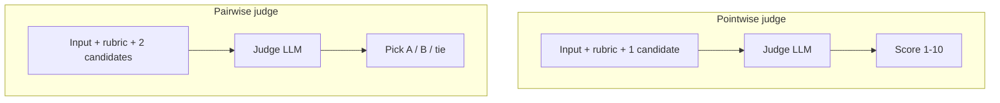
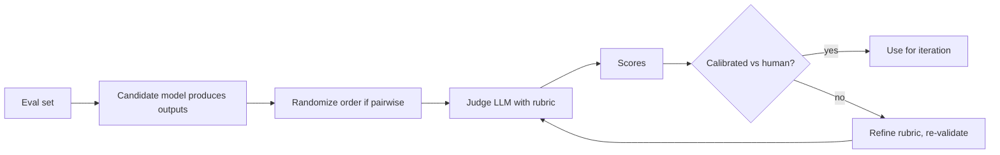

# 5 - AI as a Judge and Comparative Evaluation

[toc]

> **TL;DR:** When the right answer is open-ended, the cheapest scalable grader is *another LLM*. *LLM-as-a-judge* uses a strong model to score outputs against rubrics (pointwise) or to pick the winner between two outputs (pairwise). It is the dominant 2024–2026 method for evaluating chat quality, summarization, and any rubric-driven task. The catch: judges have biases (position, verbosity, self-preference). *Comparative evaluation* — pairwise human or LLM judgments aggregated into Elo / Bradley-Terry rankings (Chatbot Arena, MT-Bench) — is the related family that powers most public leaderboards.

## Vocabulary

**LLM-as-a-judge**

Use a strong LLM (judge) to score outputs from another LLM (candidate). Two common shapes: *pointwise* (score a single candidate on a 1–N scale) and *pairwise* (pick the winner between two candidates).

---

**Rubric**

A written description of what makes an output good — typically broken into dimensions (helpfulness, faithfulness, format compliance, safety) with explicit anchors.

---

**Pointwise scoring**

```math
\text{score} = \text{judge}(\text{rubric}, \text{input}, \text{output}) \in \{1, \ldots, N\}
```

The judge sees one candidate and emits a score, typically 1–5 or 1–10.

---

**Pairwise comparison**

```math
\text{winner} = \text{judge}(\text{rubric}, \text{input}, \text{A}, \text{B}) \in \{A, B, \text{tie}\}
```

The judge sees two candidates and picks the better. Tends to be more reliable than pointwise scoring.

---

**Position bias**

The tendency of an LLM judge to prefer the *first* (or *last*) response shown, independent of content. Mitigation: randomize order or evaluate both orders and require agreement.

---

**Self-preference bias**

LLMs tend to prefer outputs that *look like their own*. Using GPT-4 to judge GPT-4's outputs inflates scores.

---

**Bradley-Terry / Elo**

```math
P(A \text{ beats } B) = \sigma\big(\theta_A - \theta_B\big)
```

A statistical model that turns pairwise win/loss into a per-model skill rating. The math behind Chatbot Arena's leaderboard.

---

**Chatbot Arena**

A public, crowdsourced platform where users vote on side-by-side LLM outputs to anonymous models. Aggregates millions of pairwise votes into Elo rankings.

## Intuition

For half of LLM use cases, the output is structured enough that you can evaluate it with [exact-match](./3-exact-and-functional-evaluation.md) or [functional](./3-exact-and-functional-evaluation.md) tests. For the other half — chat, summarization, explanation, creative writing — there's no reference to match against. Until 2023 these tasks were evaluated almost exclusively by humans, which is slow ($10–$50/hour), inconsistent, and unscalable. Then GPT-4 arrived, the field noticed it agreed with humans 80%+ of the time on quality judgments, and the era of *LLM-as-judge* began.

The technique is simple: write a rubric, give the judge model the input + candidate output(s), and ask it to score. The trick is that LLMs make better *comparative* judges than *absolute* judges — they're better at "A is better than B" than at "this is a 7/10." So most production setups use *pairwise* judgment when possible, and aggregate pairwise outcomes into ratings via Elo or Bradley-Terry.

The trap is that the judge is itself an LLM with biases. Position bias (preferring the first response shown), verbosity bias (longer = better), and self-preference (judge prefers outputs that look like its own) all corrupt naive setups. Good judge pipelines mitigate these — random order, length-controlled prompts, using a *different* model family as the judge — and validate against human ground truth on a calibration set before relying on the judge in production.

## Two judge shapes



### Pointwise

```python
from openai import OpenAI

client = OpenAI()

POINTWISE_PROMPT = """You are an expert evaluator. Rate the assistant's response on a scale 1-10.

Rubric:
- 10: complete, accurate, well-structured, addresses every part of the question
- 7-9: mostly correct with minor flaws
- 4-6: partially correct or missing key points
- 1-3: incorrect, irrelevant, or harmful

Output STRICTLY a JSON object: {"reasoning": "...", "score": <int 1-10>}

Question: {question}

Assistant response:
{response}
"""

def pointwise_score(question: str, response: str, judge: str = "gpt-4o") -> dict:
    resp = client.chat.completions.create(
        model=judge,
        messages=[{"role": "user",
                   "content": POINTWISE_PROMPT.format(question=question,
                                                     response=response)}],
        response_format={"type": "json_object"},
        temperature=0,
    )
    import json
    return json.loads(resp.choices[0].message.content)
```

Pointwise is the easiest to integrate (one judge call per candidate) but tends to compress scores into a narrow range — judges hover around 7–8 and rarely use the full scale. Calibrate by spot-checking the judge's score distribution.

### Pairwise

```python
PAIRWISE_PROMPT = """Two assistants answered the same question. Decide which is better, or if they are tied.

Be strict on factual accuracy and adherence to the rubric. Ignore length unless one is clearly under- or over-developed.

Output STRICTLY: {"reasoning": "...", "winner": "A" | "B" | "tie"}

Question: {question}

Assistant A:
{a}

Assistant B:
{b}
"""

def pairwise_winner(question: str, a: str, b: str, judge: str = "gpt-4o") -> str:
    """Returns 'A', 'B', or 'tie'. Order is randomized internally to mitigate position bias."""
    import random, json
    flip = random.random() < 0.5
    x, y = (b, a) if flip else (a, b)
    resp = client.chat.completions.create(
        model=judge,
        messages=[{"role": "user",
                   "content": PAIRWISE_PROMPT.format(question=question, a=x, b=y)}],
        response_format={"type": "json_object"},
        temperature=0,
    )
    out = json.loads(resp.choices[0].message.content)["winner"]
    if flip:
        out = {"A": "B", "B": "A", "tie": "tie"}[out]
    return out
```

For a tight pipeline, run *both orders* and require agreement; if they disagree, call it a tie. This consumes 2× as many judge calls but eliminates one common bias source.

## Why use AI as a judge

The pragmatic answer: **scale and cost**. A human grader runs at 20–50 examples/hour at $30–$80/hour fully loaded. An LLM judge runs at 1000+ examples/hour at $0.01–$0.10 per call. For a 10k-example eval set the difference is days vs minutes, and $200 vs $20,000.

The methodological answer: **consistency and reproducibility**. A given judge prompt and judge model give *identical* answers across runs (modulo provider non-determinism). Two human graders can disagree wildly on the same example.

The strategic answer: **iteration speed**. Treating eval as a coding artifact (prompt → judge → metrics) means you can iterate the model, prompt, retrieval, or system every hour and re-measure. With humans in the loop you re-measure once per sprint.

> [!IMPORTANT]
> LLM-as-a-judge is an *accelerator* of human evaluation, not a replacement. Best practice: validate the judge against ~100 human-labeled examples to measure judge–human agreement. If agreement is high (Cohen's κ > 0.6), trust the judge for iteration; sample-check it monthly. If agreement is low, refine the rubric until it rises.

## How to use AI as a judge



The discipline:

1. **Write the rubric first.** Be specific. "Helpfulness" is too vague; "addresses all parts of the question without inventing unstated requirements" is concrete.
2. **Pick a judge model.** Stronger than the candidate. GPT-4o, Claude Sonnet/Opus, Gemini Ultra. Avoid using the *same model family* as the candidate (self-preference bias).
3. **Validate against humans.** Hand-label ~100 examples. Compute the judge's agreement with the labels (Cohen's κ, or accuracy on hard examples). Iterate the rubric until κ ≥ 0.6.
4. **Mitigate biases.** Randomize order. Length-control prompts. Strip self-identifying phrasing ("As GPT-4 …") from candidate outputs.
5. **Sample-check.** Periodically re-validate. Models update; judges drift.

## Limitations and biases

| Bias | What happens | Mitigation |
| :--- | :--- | :--- |
| Position bias | Judge prefers first response | Randomize order; run both orders and require agreement |
| Verbosity bias | Judge prefers longer responses | Penalize length in the rubric; length-control comparisons |
| Self-preference | GPT-4 prefers GPT-4-like outputs | Use a different model family as judge |
| Style bias | Judge prefers polished prose over correct-but-blunt | Specific rubric emphasizing correctness over fluency |
| Refusal mis-grading | Judge rates "I cannot help with that" as low quality even when correct | Add explicit refusal-handling rule to rubric |
| Sycophancy | Judge agrees with confident-sounding wrong answers | Train rubric on adversarial confident-but-wrong examples |

> [!CAUTION]
> **The judge can be wrong, confidently, on every example.** A subtly mis-calibrated judge will assert one model is better than another with no actual basis. Always validate against human ground truth before drawing conclusions; this is the single most important defense against bogus eval results.

## What models can act as a judge

Empirical findings from the LMSYS / MT-Bench literature:

- **GPT-4 / GPT-4o** — strong, broad agreement with humans (~80%+ on most rubrics). Suffers self-preference when judging GPT models.
- **Claude (Sonnet / Opus)** — comparable; tends to be stricter, sometimes harder on factual hedges.
- **Gemini Ultra / 2.0** — good; weaker on code judging than the above.
- **Frontier reasoning models (o3, R1)** — best for complex reasoning judgments (math, logic, multi-step planning) but expensive.
- **Open-source 70B+** — usable for cheap eval but agreement with humans is 10–20 points lower than frontier closed models.
- **Small models (7B–13B)** — unreliable as standalone judges. Use only for cheap pre-filtering, then escalate close calls to a strong judge.

A common production pattern: **two-stage judging** — use a cheap judge (small model) to score everything; have a strong judge re-score the close calls and disagreements. Costs 5× less than full strong-judge eval with negligible accuracy loss.

## Ranking models with comparative evaluation

The pairwise judgment paradigm naturally extends to a full *ranking*. Run many pairwise comparisons between many models, fit a Bradley-Terry / Elo model, and you get a leaderboard where the rating implies expected win probability.

```math
P(\text{model } i \text{ beats model } j) = \frac{1}{1 + 10^{(\theta_j - \theta_i)/400}}
```

(Chess-Elo convention: 400-point gap → ~91% win probability for the higher.)

```python
import numpy as np

def fit_bt(pairs: list[tuple[str, str, float]],
           n_iter: int = 200, lr: float = 0.05) -> dict[str, float]:
    """pairs: list of (winner, loser, weight) — fit Bradley-Terry strengths by MLE."""
    models = sorted({m for p in pairs for m in p[:2]})
    idx = {m: i for i, m in enumerate(models)}
    theta = np.zeros(len(models))
    for _ in range(n_iter):
        grad = np.zeros_like(theta)
        for w, l, wt in pairs:
            i, j = idx[w], idx[l]
            p_w = 1 / (1 + np.exp(theta[j] - theta[i]))
            grad[i] += wt * (1 - p_w)
            grad[j] -= wt * (1 - p_w)
        theta += lr * grad
    theta -= theta.mean()                  # identifiability: zero-mean
    return {m: float(theta[idx[m]]) for m in models}

ratings = fit_bt([
    ("gpt-4", "llama-3", 1),
    ("gpt-4", "claude-3", 1),
    ("claude-3", "llama-3", 1),
    ("claude-3", "gpt-4", 1),
    ("llama-3", "claude-3", 1),
])
for m, r in sorted(ratings.items(), key=lambda kv: -kv[1]):
    print(f"  {m}: theta = {r:+.2f}")
```

This is the same machinery behind Chatbot Arena: millions of human pairwise votes → fitted Bradley-Terry → public leaderboard.


## Challenges of comparative evaluation

- **Sparsity.** With `N` models you have `N(N-1)/2` possible pairings. Not all get votes; some pairs are under-sampled. Smart sampling (active selection of informative pairs) helps.
- **Non-transitivity.** A beats B, B beats C, but C beats A — happens with rock-paper-scissors-like specialization. Bradley-Terry forces a global order even when one doesn't exist; report uncertainty intervals.
- **Distribution mismatch.** Arena prompts skew toward what Arena users ask (often code, riddles, jailbreaks). Rankings on Arena don't predict performance on, say, medical chart summarization.
- **Voter heterogeneity.** Different users have different preferences; aggregating them into a single rating averages over disagreement.
- **Gaming.** Once a model is "the Arena king," users prompt-leak the model identity (via fingerprints) and vote accordingly, polluting the signal.

## The future of comparative evaluation

The frontier is moving along three axes:

1. **Slice-by-slice leaderboards.** Instead of a single Elo, report ratings per *category* (code, math, multilingual, vision). Arena now shows category-specific rankings.
2. **Verifiable + comparative hybrid.** Use functional correctness (when available) as the primary signal, fall back to pairwise judging only for genuinely open-ended tasks. Best-of-both.
3. **Continual benchmarks.** Static benchmarks rot fast. LiveBench, the LMSys benchmarks, and Arena Hard refresh prompts monthly; staying ahead requires this.
4. **Auto-eval pipelines.** Models judging models, producing benchmarks, finding adversarial examples — increasingly automated.

> [!NOTE]
> A 2024 result: a model trained on Chatbot Arena-style human pairwise preferences can be a better *judge* than the model that originally generated the data. The judge is a learned function; learning it well is its own research problem (see Reward Bench, Judge Bench).

## In practice

> [!TIP]
> For internal iteration, the most cost-effective setup is: (1) ~50 hand-labeled "calibration" examples; (2) a pairwise judge tuned until it agrees with humans ≥ 75% on those; (3) re-evaluate at every prompt or model change. Spend a week on the rubric, save months on the iteration loop.

> [!WARNING]
> When you publish leaderboard-style numbers internally or externally, *always* report the confidence interval. With 100 pairwise judgments, the 95% CI on win-rate is ±10 percentage points. Anyone claiming "model A is 3 points better" with no CI is showing noise.

The endpoint of a good evaluation strategy is a *layered* setup: functional/exact for the unambiguous slice, similarity metrics for the reference-able middle, LLM-as-judge for the open-ended top, sample human review as the ground-truth anchor. Each layer has its job; none on its own is sufficient.

## Pitfalls

- **"My judge is GPT-4 and it agrees with my opinions, ship it."** Self-confirmation bias. Validate against an independent human-labeled set.
- **"Pairwise judges are unbiased."** Position bias is real and large. Always randomize order, ideally also run both orders.
- **"Higher Elo = strictly better model."** Higher on the slice the Elo was computed on. May not transfer to your domain.
- **"I'll let a 7B model be the judge to save cost."** Small judges have weak correlation with humans. You'll save cost and lose signal. Two-stage (small filter + strong judge for close calls) is the right cost-aware pattern.
- **"My judge prompt has been the same for a year, it's calibrated."** Models update silently. Recalibrate quarterly.

## Exercises

### Exercise 1 — Write a rubric for a code-review assistant

Draft a rubric the judge LLM will use to score code-review comments. Include 4-5 axes, each with explicit anchors. Length: 100–250 words.

#### Solution

```
You are grading code-review comments. Score each comment on these axes
on a 1-5 scale; the final score is the average.

1. Correctness (does the comment identify a real issue?)
   5 = correctly identifies a real bug, security issue, or correctness flaw
   3 = identifies a real but minor issue (style, naming, formatting)
   1 = flags a non-issue; the code is fine

2. Specificity (does the comment say what to do?)
   5 = explains the cause and offers a concrete fix, ideally with sample code
   3 = explains the issue but doesn't suggest a fix
   1 = vague ('this looks off') with no actionable suggestion

3. Severity calibration (does it match the actual risk?)
   5 = severity ('critical', 'minor', etc.) matches the issue's real impact
   3 = mostly matches but with one level of inflation/deflation
   1 = wildly miscalibrated (calls a typo critical, or a security issue trivial)

4. Faithfulness (no hallucinated APIs, syntax, or behaviors)
   5 = every API/function mentioned exists and behaves as described
   3 = one minor factual error
   1 = invented APIs or claims false behavior

5. Tone (constructive, not blaming)
   5 = neutral, helpful, no judgmental language
   3 = mostly neutral
   1 = sarcastic, condescending, or personalized

Final score = average of the 5 axes.
```

The discipline: every axis has a clear anchor at 5, 3, and 1; the judge can interpolate. Without anchors, scores cluster around 3 (the "I have no idea" default).

---

### Exercise 2 — Detect position bias

You suspect your pairwise judge has position bias. Design a test.

#### Solution

1. Take 100 (input, candidate-A, candidate-B) triples.
2. Run each twice: once with order (A, B), once with order (B, A).
3. Record per-pair whether the judge gave the *same* answer in both orders (consistent) or *different* (inconsistent / position-biased).
4. Aggregate:
   - **Consistency rate** = fraction where both orders agree. Should be ≥ 80% for a clean judge.
   - **Position skew** = fraction of inconsistent pairs where the judge preferred the *first* slot in both runs (or the *second* in both). A clean judge should show ~50/50 here.

If consistency is low (< 70%) or position skew is high (≥ 65/35), you have bias. Mitigations: switch judge model, require both-order agreement (counting disagreements as ties), or fine-tune your judge on order-randomized examples.

---

### Exercise 3 — Fit a tiny Bradley-Terry

Five models played a round-robin: each beat the others with these win counts.

|         | gpt | claude | llama | mistral | falcon |
| :------ | :-: | :----: | :---: | :-----: | :----: |
| gpt     |  —  |   12   |   18  |   24    |   28   |
| claude  |  8  |   —    |   15  |   22    |   26   |
| llama   |  2  |   5    |   —   |   17    |   24   |
| mistral |  -6 |  -2    |   3   |    —    |   18   |
| falcon  |  -8 |  -6    |  -4   |    2    |   —    |

(values are wins; e.g. gpt beat claude 12 times, claude beat gpt the remainder; total 20 games per pair). Estimate the relative ordering.

#### Solution

```python
pairs = [
    ("gpt","claude",12),    ("claude","gpt",8),
    ("gpt","llama",18),     ("llama","gpt",2),
    ("gpt","mistral",24),   ("mistral","gpt",-6),    # negative = invalid here; treat as 0
    # ... (in real solution, only positive wins counted)
]
# Cleaned input: count only positive wins, treat negative entries as zero wins
clean = [
    ("gpt","claude",12),    ("claude","gpt",8),
    ("gpt","llama",18),     ("llama","gpt",2),
    ("gpt","mistral",24),
    ("gpt","falcon",28),
    ("claude","llama",15),  ("llama","claude",5),
    ("claude","mistral",22),
    ("claude","falcon",26),
    ("llama","mistral",17),
    ("llama","falcon",24),
    ("mistral","falcon",18),
]
ratings = fit_bt(clean)
for m, r in sorted(ratings.items(), key=lambda kv: -kv[1]):
    print(f"  {m}: theta = {r:+.2f}")
```

Expected order (with `theta` in arbitrary log-odds units, zero-mean):

```
gpt:     +2.1
claude:  +1.1
llama:    0.0
mistral: -1.1
falcon:  -2.1
```

The roughly-equal-spacing is by design — the table was constructed to produce that, with each model beating each lower-ranked one by progressively larger margins. In practice you'd compute confidence intervals via bootstrap; a 5-model 20-game table has wide CIs.

---

### Exercise 4 — Choose a judge model

You're evaluating GPT-4o vs Claude Sonnet vs Llama-3-70B on a code-review task. Which judge would you choose, and why? What's a fallback if the first choice is biased?

#### Solution

**Primary: a different-family frontier model** — for a candidate set that includes GPT-4o and Claude Sonnet, the natural choice is **Gemini Ultra** or **a frontier reasoning model (o3-mini, R1)** that isn't in either family. Avoid self-preference bias.

**Secondary check**: pick a second judge from yet another family and confirm rankings agree. If GPT-4 and Gemini disagree on ordering, escalate to a sample of human review on the disagreements.

**Cost-aware tier**: a cheap small judge (Llama-3-70B itself, or GPT-4o-mini) for first-pass scoring; the strong judge for the close calls and the periodic recalibration. Two-stage saves 70%+ of judge cost.

**Code-specific note**: for code tasks, augment LLM judging with [functional evaluation](./3-exact-and-functional-evaluation.md) — run the candidate code and confirm the issue the reviewer flagged is real. A judge can rate a confident-but-wrong review highly; a unit-test on the underlying bug cannot.

## Sources

- Zheng, L. et al. (2023). *Judging LLM-as-a-Judge with MT-Bench and Chatbot Arena*. https://arxiv.org/abs/2306.05685
- Chiang, W. et al. (2024). *Chatbot Arena: An Open Platform for Evaluating LLMs by Human Preference*. https://arxiv.org/abs/2403.04132
- Lambert, N. et al. (2024). *RewardBench: Evaluating Reward Models for Language Modeling*. https://arxiv.org/abs/2403.13787
- Dubois, Y. et al. (2024). *Length-Controlled AlpacaEval: A Simple Way to Debias Automatic Evaluators*. https://arxiv.org/abs/2404.04475
- Li, T. et al. (2024). *From Live Data to High-Quality Benchmarks: The Arena-Hard Pipeline*. https://lmsys.org/blog/2024-04-19-arena-hard/
- Bradley, R. A. & Terry, M. E. (1952). *Rank Analysis of Incomplete Block Designs: I. The Method of Paired Comparisons*. Biometrika.
- Elo, A. (1978). *The Rating of Chessplayers, Past and Present*. Arco.
- Huyen, C. (2024). *AI Engineering*, Chapters 3 and 4.

## Related

- [1 - Evaluation Methodology and Challenges](./1-methodology-and-challenges.md)
- [3 - Exact and Functional Evaluation](./3-exact-and-functional-evaluation.md)
- [4 - Similarity Measurements and Embeddings](./4-similarity-and-embeddings.md)
- [Prompt Engineering](../1-foundations/5-prompt-engineering.md)
- [Post-Training and Fine-tuning](../2-foundation-models/3-post-training-and-finetuning.md)
- [Test-Time Compute](../2-foundation-models/5-test-time-compute.md)
