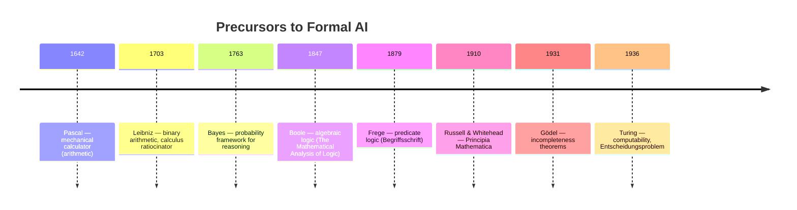
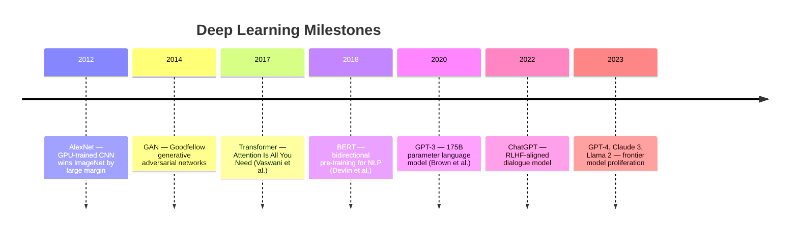

# 1 - History of AI

[toc]

> **TL;DR:** Artificial intelligence as a formal discipline traces a lineage from Leibniz's binary calculus through Boole's algebra of thought, Turing's computability theory, and the 1956 Dartmouth summer project that gave the field its name. The history is not a smooth arc — it is punctuated by two severe funding winters driven by over-promised timelines, each followed by a resurgence powered by a paradigm shift: from heuristic search to expert systems, then from expert systems to connectionism, and finally to scale-driven deep learning. Understanding this arc matters because the same failure modes — premature claims, brittle representation, missing robustness — keep recurring.

## Vocabulary

**Artificial intelligence** — McCarthy's own definition: "the science and engineering of making intelligent machines, especially intelligent computer programs." Critically, AI does not require biologically plausible methods.

---

**Entscheidungsproblem** — Hilbert's 1928 decision problem: is there an algorithm that can determine the truth or falsehood of any mathematical statement? Turing's 1936 answer (no) simultaneously defined what "algorithm" means and bounded what AI can ever do.

---

**Dartmouth Conference (1956)** — A two-month summer workshop at Dartmouth College, organized by John McCarthy, Marvin Minsky, Nathaniel Rochester, and Claude Shannon. It coined the phrase "artificial intelligence" and set the symbolic manipulation paradigm as the founding frame.

---

**AI Winter** — A period of drastically reduced funding and institutional interest following over-promising of capabilities. Two major winters: roughly 1974–1980 and 1987–1993.

---

**GOFAI (Good Old-Fashioned AI)** — John Haugeland's label for the symbolic, logic-based paradigm. Intelligent behavior as symbol manipulation under explicit rules.

---

**Connectionism** — The paradigm that models cognitive function as distributed activation patterns in networks of simple units, in contrast to GOFAI's explicit symbol manipulation.

---

**Satisficing** — Herbert Simon's term for the behavior of a decision maker who settles for a "good enough" solution rather than an optimal one. The central idea behind heuristic search.

---

**Physical Symbol System Hypothesis (PSSH)** — Newell and Simon's 1976 claim: "A physical symbol system has the necessary and sufficient means for general intelligent action." This is the ontological manifesto of symbolic AI.

---

**Expert system** — A knowledge-based program that encodes domain expertise as production rules and applies them via an inference engine. MYCIN (1972) and XCON (1978) are canonical examples.

---

**Subsumption architecture** — Rodney Brooks' (1986) layered control architecture in which higher behaviors augment rather than replace lower ones. Each layer connects sensing directly to action without a central world model.

---

**PDP (Parallel Distributed Processing)** — The 1986 Rumelhart and McClelland two-volume synthesis that reignited connectionism by showing that backpropagation could train multi-layer networks on cognitive tasks.

---

## Intuition

Imagine three competing answers to the question "what is intelligence?" GOFAI says it is the manipulation of explicit symbols according to logical rules — a very human-legible view, since humans can write down the rules and inspect them. Connectionism says it is a statistical property of large networks trained on examples — no one explicitly programs the patterns, they emerge. Brooks' embodied AI says the question is wrong: intelligence is not a representation at all, it is the right sensory-motor coupling with the world, built incrementally.

Each paradigm had its day, failed on its own hardest problems, and surrendered ground to the next. The pattern repeats: a working demo convinces funders, scaling reveals hard limits, funding collapses, and a paradigm shift re-opens the space. Present-day LLMs are the latest resurgence — understanding why the previous ones failed is the best preparation for evaluating the current one.

## Historical Arc

### Pre-Computational Precursors (1642–1935)

The intellectual ancestors of AI were philosophers and mathematicians trying to mechanize reasoning. Gottfried Wilhelm Leibniz published his binary arithmetic in 1703, arguing that all ideas are combinations of simpler concepts and that reasoning could be reduced to calculation. George Boole's 1847 *The Mathematical Analysis of Logic* gave this intuition algebraic teeth — propositions could be variables taking truth values, and logical inference could be computed.



Kurt Gödel's 1931 incompleteness theorems placed an absolute ceiling: any consistent formal system strong enough to encode arithmetic contains true statements it cannot prove. This is not a limitation of any particular machine or program — it is a property of formal systems as such. Turing's 1936 paper, formalizing the notion of computation via the Turing machine model, proved that the Entscheidungsproblem has no solution and — as a byproduct — defined the universal notion of algorithm that all subsequent computer science rests on.

### The Founding Moment (1943–1956)

Three papers in rapid succession established the intellectual scaffolding for AI as a discipline. McCulloch and Pitts (1943) showed that networks of idealized neurons obeying an all-or-none firing rule can compute any logical function expressible in propositional calculus — the first bridge between neural biology and formal logic. John von Neumann's 1945 EDVAC report laid out the stored-program computer architecture that would provide the hardware substrate.

Turing's 1950 paper "Computing Machinery and Intelligence" crystallized the question "Can machines think?" by replacing it with a behaviorist operational test: the Imitation Game. Turing listed nine objections to machine intelligence and answered each; his treatment of Gödel's theorem objection — that humans can recognize truths machines cannot prove — remains the most incisive response in the literature.

The 1956 Dartmouth conference did not produce results. Its significance was sociological: it named the field, assembled its founding community, and established symbolic manipulation as the dominant research programme. Newell, Shaw, and Simon's Logic Theorist program, demonstrated there, proved 38 of the 52 theorems in Russell and Whitehead's *Principia Mathematica*, an early existence proof that computers could perform tasks previously reserved for human intellect.

### The Golden Decade and the First Winter (1956–1980)

The decade from 1956 to 1966 produced an extraordinary number of working demonstrations. Samuel's checker-playing program (1959) learned from experience, improving its evaluation function by playing against itself. LISP (McCarthy, 1960) provided a language whose primary data structure — the linked list — was ideal for symbolic manipulation, and whose recursive function formalism gave AI an expressive theoretical foundation. GPS (General Problem Solver, Newell and Simon, 1961) attempted to model human problem solving via means-ends analysis. ELIZA (Weizenbaum, 1965) demonstrated, to its creator's dismay, how easily humans attribute understanding to a pattern-matching program.

The optimism was unbounded. Herbert Simon predicted in 1965 that "machines will be capable, within twenty years, of doing any work a man can do." These predictions failed to materialize. The 1969 Minsky-Papert book *Perceptrons* demonstrated that single-layer perceptrons cannot solve XOR — a result that, controversially, effectively killed neural network funding for over a decade. The 1973 Lighthill Report in the UK identified combinatorial explosion as the fundamental barrier to AI's ambitions: heuristic search worked on toy problems but did not scale. Funding collapsed. The first AI winter ran from roughly 1974 to 1980.

### Expert Systems and the Second Winter (1980–1993)

The recovery came not from a theoretical breakthrough but from a commercial one. Expert systems encoded narrow, domain-specific knowledge as production rules. MYCIN diagnosed bacterial infections at Stanford with physician-level accuracy. XCON at DEC configured VAX computer orders, reportedly saving $40M per year by 1986. By the mid-1980s there was a boom in expert system shells and AI corporations.

The second collapse came from two directions simultaneously. Expert systems were brittle outside their knowledge base: MYCIN's rule about bacterial infections did not help when the patient was also bleeding internally (see Brooks' MYCIN anecdote). They required enormous manual effort to build and maintain. The Japanese Fifth Generation Project (1982–1992), which promised a Prolog-based intelligent computing platform, failed to deliver. DARPA's Strategic Computing Initiative, another large government bet, was wound down. By 1987 the second AI winter had begun.

### The Connectionist Revival (1986–2012)

The Rumelhart-McClelland PDP volumes (1986) were the founding document of the connectionist revival. They showed that the backpropagation algorithm — known in various forms since Bryson and Ho (1969) — could train multi-layer networks on non-linearly separable problems. The key insight was that multi-layer networks learned internal representations not specified by the programmer. The same year, Hinton and Sejnowski's Boltzmann machine demonstrated unsupervised learning in a probabilistic setting.

Progress was slow through the 1990s. Hochreiter and Schmidhuber's LSTM (1997) addressed vanishing gradients. LeCun's convolutional networks demonstrated strong performance on handwriting recognition. But compute was the bottleneck: neither datasets nor GPUs were adequate. The inflection point came in 2009 when Raina, Madhavan, and Ng showed that training on GPUs was an order of magnitude faster than multi-core CPUs. The 2012 ImageNet moment — Krizhevsky, Sutskever, and Hinton's AlexNet achieving 16% top-5 error against the previous year's 26% — made the paradigm shift visible to the entire industry.

### The Deep Learning Era (2012–present)



The transformer architecture (2017) displaced recurrent models for sequence tasks by replacing sequential computation with parallel self-attention. Scale, measured in parameters and training tokens, became the dominant design variable. This third wave is characterized by emergent capabilities at scale, foundation model pre-training followed by task-specific fine-tuning, and RLHF-aligned systems capable of open-ended dialogue. Whether this wave has its own winter ahead remains genuinely open.

## Real-world Example

The following code sketches the core computation of the Perceptron (Rosenblatt, 1958) — the simplest learning algorithm of the first AI wave — alongside the XOR failure that Minsky and Papert used to collapse funding in 1969, and then the multi-layer fix that the PDP revival required.

```python
import numpy as np

# --- Single-layer Perceptron: works on linearly separable problems ---
def perceptron_train(X, y, lr=0.1, epochs=100):
    """
    Rosenblatt 1958. Updates weights when prediction is wrong.
    Guaranteed to converge iff data is linearly separable.
    """
    w = np.zeros(X.shape[1])
    b = 0.0
    for _ in range(epochs):
        for xi, yi in zip(X, y):
            pred = 1 if np.dot(w, xi) + b > 0 else 0
            err = yi - pred
            w += lr * err * xi
            b += lr * err
    return w, b

# AND gate: linearly separable — perceptron converges
X_and = np.array([[0,0],[0,1],[1,0],[1,1]])
y_and = np.array([0, 0, 0, 1])
w, b = perceptron_train(X_and, y_and, epochs=200)
preds_and = [(np.dot(w,x)+b > 0)*1 for x in X_and]
print("AND predictions:", preds_and)   # [0, 0, 0, 1] — correct

# XOR gate: NOT linearly separable — single-layer perceptron fails
X_xor = np.array([[0,0],[0,1],[1,0],[1,1]])
y_xor = np.array([0, 1, 1, 0])
w2, b2 = perceptron_train(X_xor, y_xor, epochs=1000)
preds_xor = [(np.dot(w2,x)+b2 > 0)*1 for x in X_xor]
print("XOR single-layer:", preds_xor)  # Wrong — no linear boundary exists

# Two-layer MLP (hand-coded): solves XOR — the PDP-era fix
def relu(x):
    return np.maximum(0, x)

# Weights trained for XOR (pre-set for illustration)
W1 = np.array([[1, 1], [1, 1]], dtype=float)
b1 = np.array([0, -1], dtype=float)
W2 = np.array([[1, -2]], dtype=float)
b2_mlp = np.array([0.0])

for x in X_xor:
    h = relu(W1 @ x + b1)
    out = (W2 @ h + b2_mlp > 0) * 1
    print(f"  XOR MLP {x} -> {out[0]}")
# Correctly outputs 0,1,1,0
```

> [!IMPORTANT]
> The XOR failure was not that single-layer perceptrons were useless — they are provably optimal for linearly separable problems. The failure was in over-generalizing from early successes to claim general intelligence. Minsky and Papert's critique was mathematically precise; the policy decision to defund all neural network research based on it was not.

## In Practice

The history of AI reveals three recurring failure modes that apply directly to current systems:

**Brittleness outside the training distribution.** Expert systems failed when presented with situations outside their rule base. Modern LLMs hallucinate facts outside their training data. The failure mode is structurally identical — the system has no mechanism for recognizing the boundary of its competence.

**Combinatorial explosion in search.** The first AI winter was triggered by this. Modern LLMs side-step it by replacing explicit search with learned pattern matching, but they encounter it in a new form: the exponential blowup of multi-step reasoning chains and the difficulty of verifiable planning.

**Overclaiming.** Every AI wave has been accompanied by predictions that general intelligence is 20 years away. Simon's 1965 prediction, the Fifth Generation Project's promises, and various AGI timelines are all instances. The field's credibility with funders has paid the cost every time.

> [!TIP]
> When evaluating a new AI system's claims, ask: what is the hard problem it cannot demonstrate? For expert systems it was common sense and robustness. For the perceptron it was non-linear separability. For transformers it is compositional generalization, verifiable factual grounding, and efficient multi-step reasoning. The hard problem is always the one conveniently absent from the demo.

> [!WARNING]
> "Deep learning solved AI" is a common misconception in industry. The current paradigm has produced remarkable capability on many benchmarks while failing on others (systematic generalization, data efficiency, robust physical reasoning). The field is in a strong but not concluding phase.

## Pitfalls

- **"AI was a linear progression of improvements."** — The history is punctuated by two severe winters and paradigm-level reversals. Progress was not cumulative; the symbolic and connectionist traditions developed largely in parallel with minimal cross-pollination until recently.
- **"Minsky-Papert killed neural networks because perceptrons were proven useless."** — Their book proved single-layer perceptrons cannot compute XOR. It did not prove multi-layer networks were useless — in fact it noted this. The defunding was a policy overreaction, not a logical consequence of the math.
- **"The Turing Test is the gold standard for intelligence."** — Turing himself presented it as a sufficient condition, not a necessary one: a machine passing the test is certainly intelligent, but a machine could be intelligent without knowing enough about humans to pass. Modern systems can fool the test via statistical pattern matching without anything resembling general understanding.
- **"Expert systems were a dead end."** — Many expert system techniques (production rules, inference engines, knowledge bases) are alive in modern systems as reasoning modules, tool use, and RAG pipelines. They were not wrong, just incomplete.
- **"The current deep learning wave is immune to a winter."** — Each previous wave was also protected by compelling benchmark performance. The current risks include energy costs, data scarcity, and systematic failures on tasks requiring compositionality and causal reasoning.

## Exercises

### Exercise 1 — Periodization

List the two AI winters and give for each: (a) the primary technical failure that precipitated it, and (b) the paradigm shift that ended it.

#### Solution 1

**First winter (c.1974–1980):**
- Technical failure: combinatorial explosion in heuristic search; machine translation systems collapsed when syntactic approaches proved insufficient; the Lighthill Report catalogued the gap between toy-problem results and real-world scaling.
- Paradigm shift that ended it: expert systems — instead of general reasoning, narrow deep knowledge in a single domain.

**Second winter (c.1987–1993):**
- Technical failure: expert systems required intractable manual knowledge engineering, were brittle outside the domain, and could not learn. The Japanese Fifth Generation Project failed to deliver on Prolog-based AI promises.
- Paradigm shift that ended it: the connectionist/PDP revival, specifically the demonstration that backpropagation could train multi-layer networks, combined with the eventual arrival of sufficient compute and data.

### Exercise 2 — Place the paper

Match each paper to the phase of AI history it belongs to, and state its primary contribution.

| Paper | Phase |
| :--- | :--- |
| Turing, "Computing Machinery and Intelligence" (1950) | ? |
| McCulloch & Pitts (1943) | ? |
| McCarthy, "Recursive Functions of Symbolic Expressions" (1960) | ? |
| Rumelhart & McClelland, PDP Vol. 1 (1986) | ? |
| Brooks, "Intelligence Without Representation" (1991) | ? |

#### Solution 2

| Paper | Phase | Primary contribution |
| :--- | :--- | :--- |
| Turing 1950 | Pre-Dartmouth foundations | Operational definition of machine intelligence via the Imitation Game; refutation of nine objections |
| McCulloch & Pitts 1943 | Pre-Dartmouth foundations | Showed neural nets can compute propositional logic; bridge between biology and formal computation |
| McCarthy 1960 | Golden decade | LISP: S-expressions, recursive functions, conditional expressions; universal S-function `apply` analogous to a universal Turing machine |
| Rumelhart & McClelland 1986 | Connectionist revival | Backpropagation formalized; demonstrated hidden-layer learning; launched second connectionist wave |
| Brooks 1991 | Embodied AI critique | Showed behaviour-based robots outperform symbolic planners in dynamic environments; challenged the necessity of internal representations |

### Exercise 3 — Why XOR matters

Explain in three sentences why the XOR problem was historically decisive for neural network funding, and why the two-layer MLP fix was not an obvious counterargument at the time.

#### Solution 3

The perceptron convergence theorem guaranteed that if a linear decision boundary exists, the single-layer perceptron will find it in finite time — this made the inability to solve XOR a provable, not empirical, failure. Minsky and Papert showed this limitation applied broadly to any computation requiring non-linear separability, which includes many interesting pattern classification problems. The two-layer fix was theoretically available but required solving the credit assignment problem — how to adjust hidden-layer weights when there was no direct error signal — which backpropagation solved only in 1986 (formalizing earlier work by Bryson and Ho, and Werbos), nearly two decades later.

### Exercise 4 — The Dartmouth conjecture

The 1956 Dartmouth proposal stated: "every aspect of learning or any other feature of intelligence can in principle be so precisely described that a machine can be made to simulate it." Identify two specific failures in AI history that directly challenged this conjecture and explain the challenge.

#### Solution 4

**Common sense reasoning (1960s–1970s).** McCarthy's Advice Taker program required encoding the world's common knowledge as logical assertions. The Frame Problem — how to represent what *does not* change when an action is taken — proved intractable for explicit symbolic representation. Humans handle it effortlessly; no formal system has managed it at human scale.

**Perceptual grounding (1970s–1980s).** The blocks world experiments worked because the semantics of the domain were completely encodable in terms of a small set of predicates. Transferring programs to real environments — where "chair" is not a closed predicate but an open-textured concept with context-dependent boundaries — caused immediate failure. Brooks' 1991 paper formalized the observation that abstraction away from sensorimotor coupling was the source of the problem, not merely an engineering shortfall.

### Exercise 5 — Modern relevance

An LLM trained on a trillion tokens can write coherent essays, solve undergraduate math problems, and pass the bar exam. Does this constitute passing the Turing Test? Does it validate the Physical Symbol System Hypothesis?

#### Solution 5

**Turing Test.** In restricted conversational settings with naive evaluators, current LLMs can fool many users — they have in effect passed restricted versions of the test. However, Turing's original formulation specified a knowledgeable interrogator with unlimited time. Adversarial prompting — asking the model to count characters, track long-range context, or reason about novel physical scenarios — still reveals systematic failures that distinguish current systems from general human-level intelligence.

**PSSH.** The LLM case is ambiguous. Transformers do manipulate symbols in the superficial sense (tokens), but Newell and Simon's PSSH was specifically about *physical* symbol systems: systems where symbols have semantic referents and where reasoning is the manipulation of those referents. LLMs are better described as statistical correlators of surface forms — they do not maintain explicit semantic bindings. Whether this distinction is principled or a matter of implementation remains one of the genuinely open questions in AI philosophy.

## Sources

- Buchanan, B. G. (2005). A (Very) Brief History of Artificial Intelligence. *AI Magazine* 26(4), 53–60.
- Privacy Foundation, University of Denver. History of Artificial Intelligence (AI) — timeline document.
- McCarthy, J. (2007). What is AI? Basic questions. http://jmc.stanford.edu/artificial-intelligence/what-is-ai/index.html
- Turing, A. M. (1950). Computing Machinery and Intelligence. *Mind* 49, 433–460.
- Minsky, M., & Papert, S. (1969). *Perceptrons*. MIT Press.
- Rumelhart, D. E., & McClelland, J. L. (1986). *Parallel Distributed Processing*, Vol. 1. MIT Press.
- Brooks, R. A. (1991). Intelligence Without Representation. *Artificial Intelligence* 47, 139–159.
- Newell, A., & Simon, H. A. (1976). Computer Science as Empirical Inquiry: Symbols and Search. *Communications of the ACM* 19(3), 113–126. (Turing Award lecture)

## Related

- [2 - Turing and the Foundations of Computation](./2-turing-and-the-foundations-of-computation.md)
- [3 - Symbolic AI and Knowledge Representation](./3-symbolic-ai-and-knowledge-representation.md)
- [4 - Connectionism and the Rise of Neural Networks](./4-connectionism-and-the-rise-of-neural-networks.md)
- [5 - Embodiment and the Brooks Revolution](./5-embodiment-and-the-brooks-revolution.md)
- [1 - What is ML and Version Space](../Machine-Learning/1-foundations/1-what-is-ml-and-version-space.md)
