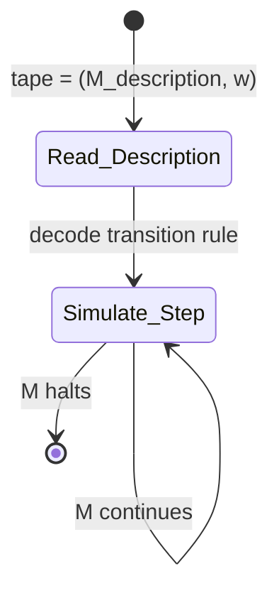

# 2 - Turing and the Foundations of Computation

[toc]

> **TL;DR:** Alan Turing's two landmark papers define the outer envelope of what computation can achieve. The 1936 paper "On Computable Numbers" introduces the Turing machine model and proves the Halting Problem undecidable — establishing that no algorithm can determine, in general, whether an arbitrary program terminates. The 1950 paper "Computing Machinery and Intelligence" reframes "Can machines think?" as a behavioural game, then systematically defends the possibility of machine intelligence against nine classes of objection. Together they are the theoretical floor and philosophical ceiling of AI.

## Vocabulary

**Turing machine** — An abstract automaton with a finite set of states (m-configurations), an infinite tape of cells, a read-write head, and a transition function that maps (state, symbol) → (state, symbol, move). Circle-free machines that print infinitely many binary digits compute a *number*.

---

**m-configuration** — Turing's term for the machine's internal state at a given step. The complete configuration is the tuple (m-configuration, tape contents, head position).

---

**Universal Turing machine (UTM)** — A Turing machine that takes the description of any other Turing machine M and an input w as its own input, and simulates M on w. The UTM is the theoretical archetype of the stored-program computer.

---

**Halting Problem** — The problem of deciding, given an arbitrary Turing machine description and input, whether the machine will eventually halt. Turing proved this is undecidable: no Turing machine solves it for all inputs.

---

**Computable number** — A real number whose decimal expansion can be produced by a circle-free Turing machine. Pi, e, and all algebraic numbers are computable; most real numbers (in the measure-theoretic sense) are not.

---

**Entscheidungsproblem** — Hilbert and Ackermann's 1928 challenge: find a procedure that decides the truth of any first-order logic statement. Turing's undecidability result (and Church's independent lambda-calculus result) showed no such procedure exists.

---

**Imitation Game** — Turing's 1950 operational test: an interrogator communicates by teletype with a human and a machine; if the machine is indistinguishable from the human in the interrogator's judgment, it passes. Turing substituted this for the unanalyzable question "Can machines think?"

---

**Discrete-state machine** — Turing's 1950 term for machines that move by definite jumps between distinct states. Digital computers are discrete-state machines; this property makes their behaviour in principle predictable.

---

**Lady Lovelace objection** — The claim that a computer can only do what it is programmed to do and therefore cannot originate anything. Turing responds that learning machines can surprise their own creators.

---

**Gödelian objection** — The argument that Gödel's incompleteness theorem proves machines have limits humans do not. Turing responds that humans face the same limits in practice.

---

## Intuition

Think of a Turing machine as a bureaucrat with a notebook, a rulebook, and an infinite paper tape. The rulebook says: "if you are in state q and see symbol s, write symbol s', move left or right, enter state q'." The bureaucrat runs this loop forever or until the rulebook has no rule for the current situation (the machine halts). The remarkable result is that every algorithm humans know how to specify can be reduced to such a bureaucrat. The remarkable *impossibility* result is that no such bureaucrat can, in general, decide whether a given set of instructions will make another bureaucrat run forever or stop.

For the Imitation Game, think of intelligence not as an intrinsic property but as a relational one: something is intelligent if it behaves indistinguishably from a known-intelligent thing under adversarial testing. This sidesteps metaphysics but creates its own problem — the test is one-sided. A machine that passes is certainly intelligent; a machine that fails might still be intelligent via a different mode.

## How it Works

### The Turing Machine Model (1936)

Turing's 1936 paper opens by observing that a human computing a number with pencil and paper proceeds through a finite sequence of mental states and symbols on paper. He formalizes this as a machine with:

1. A tape divided into squares, each bearing exactly one symbol from a finite alphabet.
2. A head that reads the current square, writes a new symbol, and moves one step left or right.
3. A finite set of m-configurations (states) that, together with the current symbol, determine the action.

The transition function is expressed as a table. The simplest useful example is a machine that generates the sequence 0, 1, 0, 1, ... endlessly:

```
┌────────────┬────────┬────────────┬──────────────────┐
│ m-config   │ symbol │ operations │ final m-config   │
├────────────┼────────┼────────────┼──────────────────┤
│ b          │ None   │ P0, R      │ c                │
│ c          │ None   │ R          │ e                │
│ e          │ None   │ P1, R      │ f                │
│ f          │ None   │ R          │ b                │
└────────────┴────────┴────────────┴──────────────────┘
```

Each row says: in state b, seeing no symbol, Print 0, move Right, go to state c. The machine cycles through b → c → e → f → b, writing 0 _ 1 _ 0 _ 1 _ ... where `_` is a blank spacer.

> [!IMPORTANT]
> Turing distinguishes "F-squares" (the figures — 0 and 1 — that constitute the output) from "E-squares" (erasable working squares). This separation cleanly models the distinction between the computation's output and its working memory.

### The Universal Turing Machine

The UTM is constructed by encoding any Turing machine M as a string of symbols — its "description number" — on the UTM's tape, followed by the input to M. The UTM then simulates M step by step. This is the theoretical existence proof for the stored-program computer: a single machine can compute any computable function if appropriately programmed.



The key property: all digital computers are UTMs with finite (but large) tape. The finiteness is an engineering constraint, not a theoretical one — any real computation that a UTM with infinite tape would perform in finite time, a real computer with enough memory can also perform.

### The Halting Problem and Undecidability

Turing proves in Section 8 that there is no general algorithm to decide whether a given Turing machine halts on a given input. The proof by diagonalization:

Suppose such a machine H exists, taking (M, w) and printing "halts" or "loops". Construct machine D: on input M, D runs H(M, M). If H says M halts, D loops forever. If H says M loops, D halts. Now run D on its own description: H(D, D) cannot consistently answer — contradiction. Therefore H does not exist.

```python
# Python makes the structure of the proof vivid (conceptual, not executable):
def halts(M_source: str, w: str) -> bool:
    """
    Hypothetical oracle: returns True iff M halts on w.
    CLAIM: no such function can exist as a finite Python program.
    """
    raise NotImplementedError("Undecidable")

def diagonal_machine(M_source: str) -> None:
    """
    If halts(M_source, M_source) == True:  loop forever
    Else:                                   halt immediately
    When called with its OWN source code, contradicts halts().
    """
    if halts(M_source, M_source):
        while True:          # loop — but halts() said we'd halt
            pass
    else:
        return               # halt — but halts() said we'd loop
```

> [!CAUTION]
> The undecidability of the Halting Problem has direct engineering consequences. Any static analysis tool, termination checker, or "does this program do X?" verifier is necessarily incomplete: it will either miss true positives or report false positives on some programs. No tool can achieve soundness AND completeness for general programs.

### The Imitation Game (1950)

Turing opens "Computing Machinery and Intelligence" by proposing to replace the vague question "Can machines think?" with a precise, empirically testable question: can a machine play the Imitation Game well enough to be indistinguishable from a human?

The game involves three parties in separate rooms communicating by teletype:
- A (the machine trying to fool the interrogator)
- B (a human trying to help the interrogator)
- C (the interrogator, trying to determine which is the machine)

Turing's key claim: if by the year 2000, a machine could fool an average interrogator 30% of the time in a 5-minute session, the question "Can machines think?" would deserve affirmative answer by educated consensus.

### The Nine Objections

Turing's 1950 paper enumerates and rebuts nine objections to machine intelligence. These remain the standard taxonomy for AI philosophy.

| Objection | Turing's rebuttal |
| :--- | :--- |
| Theological — machines have no soul | Arbitrary restriction on divine omnipotence; empirically unverifiable |
| "Heads in the Sand" — consequences would be dreadful | Argument from emotional preference, not logic |
| Mathematical — Gödel incompleteness proves machines are limited | Humans face the same limits; the machine's limitation is specific, not general |
| Consciousness — machines cannot be genuinely conscious | Consciousness is unverifiable in other humans too; solipsism by another name |
| Lady Lovelace — machines only do what they're programmed to do | Learning machines can surprise programmers; the origination claim conflates rule-following with determinism |
| Continuity of NS — digital machines miss continuous processes | Sufficiently fine-grained discrete machines can approximate any continuous process |
| Informality of behavior — no rules capture human behavior | Behavior *appears* informal but may be reducible; in any case, imitating it doesn't require modeling it |
| Extra-sensory perception — humans have abilities beyond physics | Hypothetical; could be added to the test conditions |
| Argument from disability — machines can't do X (fill in blank) | Argument by enumeration; consistently falsified by examples |

> [!NOTE]
> The Gödelian objection is the most philosophically sophisticated. Turing's response is modest: while it is true that any sufficiently powerful consistent formal system has undecidable statements, this is equally a limitation on human mathematical ability when humans attempt to reason formally. The objection succeeds only if one grants that humans can always correctly recognize truth without proof — which is a strong, unverified cognitive claim.

## Math

The formal language of Turing's computability theory. A Turing machine is a 7-tuple:

```math
M = (Q, \Sigma, \Gamma, \delta, q_0, q_{accept}, q_{reject})
```

where Q is the finite state set, Sigma is the input alphabet, Gamma is the tape alphabet (Sigma ⊆ Gamma, with blank symbol B ∈ Gamma \ Sigma), delta is the transition function, q₀ is the start state, and q_accept, q_reject are the halting states.

```math
\delta : Q \times \Gamma \to Q \times \Gamma \times \{L, R\}
```

The machine accepts input w if it reaches q_accept; rejects if it reaches q_reject; otherwise it loops. A language L is *Turing-recognizable* if some TM accepts exactly L; it is *decidable* if some TM accepts L and halts on all inputs.

The undecidability of the Halting Problem is proven by reducing to it: if H decides HALT = {⟨M,w⟩ : M halts on w}, then the diagonal machine D defined by D(⟨M⟩) = "loop if H(⟨M,⟨M⟩⟩) = accept, halt otherwise" produces a contradiction when run on ⟨D⟩ itself.

## Real-world Example

A concrete simulation of a simple Turing machine in Python, modeling the alternating 0,1 sequence machine from Turing's 1936 paper Section 3.

```python
from enum import Enum, auto
from collections import defaultdict

class Direction(Enum):
    LEFT = auto()
    RIGHT = auto()

class TuringMachine:
    """
    Minimal Turing machine simulator.
    Tape is a defaultdict so it's effectively infinite in both directions.
    """
    def __init__(self, transitions: dict, start_state: str, halt_states: set):
        self.transitions = transitions  # (state, symbol) -> (new_state, write_sym, direction)
        self.start_state = start_state
        self.halt_states = halt_states

    def run(self, input_tape: list, max_steps: int = 1000):
        tape = defaultdict(lambda: '_')   # blank symbol
        for i, sym in enumerate(input_tape):
            tape[i] = sym

        state = self.start_state
        head = 0
        steps = 0
        output_positions = []

        while state not in self.halt_states and steps < max_steps:
            sym = tape[head]
            if (state, sym) not in self.transitions:
                break   # implicit halt on undefined transition

            new_state, write_sym, direction = self.transitions[(state, sym)]

            # Record F-square output (0s and 1s on even positions)
            if write_sym in ('0', '1'):
                output_positions.append((head, write_sym))

            tape[head] = write_sym
            head += (1 if direction == Direction.RIGHT else -1)
            state = new_state
            steps += 1

        return tape, output_positions, steps

# Turing's simplest alternating machine: produces 0, 1, 0, 1, ...
# Transition table from Section 3, Table I of "On Computable Numbers" (1936)
transitions_alt = {
    ('b', '_'): ('c', '0', Direction.RIGHT),  # P0, R
    ('c', '_'): ('e', '_', Direction.RIGHT),  # R
    ('e', '_'): ('f', '1', Direction.RIGHT),  # P1, R
    ('f', '_'): ('b', '_', Direction.RIGHT),  # R
}

tm = TuringMachine(transitions_alt, start_state='b', halt_states=set())
tape, outputs, steps = tm.run([], max_steps=20)

print("Output (F-squares):", [sym for _, sym in sorted(outputs)])
# Output (F-squares): ['0', '1', '0', '1', '0', '1', '0', '1', '0', '1']
print(f"Steps: {steps}")
```

> [!TIP]
> This simulation runs Turing's original 1936 machine with no modifications. The blank-tape start and unbounded defaultdict tape exactly mirror the theoretical model. Modern CPU branch-prediction hardware is a physical instantiation of a much more complex state machine operating on the same principles — finite states, read-write operations, sequential moves.

## In Practice

**Church-Turing thesis and its limits.** The thesis states that any function computable by an "effective procedure" (human algorithm) is computable by a Turing machine. This is a thesis, not a theorem — it cannot be formally proved because "effective procedure" is an informal concept. Quantum computing does not violate the thesis: a quantum computer can be simulated by a TM (in exponential time), so quantum computers compute the same class of functions, just potentially faster.

**Undecidability in software engineering.** The undecidability of the Halting Problem propagates to many practical problems: determining whether two programs are equivalent (Rice's theorem: all non-trivial semantic properties of programs are undecidable), whether a program contains a given bug, whether a type inference problem has a solution in a sufficiently expressive type system. Static analysis tools work precisely because they trade completeness for soundness or vice versa.

**The Turing Test in 2025.** No major AI benchmark is the original Turing Test. Modern LLMs can fool naive evaluators in short sessions but fail under adversarial probing. The Winograd Schema Challenge (2012), proposed as a harder alternative, is now also largely solved. The field has largely moved past behaviorist tests toward capability benchmarks targeting specific skills (code, math, MMLU) — which maps better to Turing's note that chess is "the Drosophila of AI," a contained domain for studying specific mechanisms.

> [!WARNING]
> Equating "passes the Turing Test" with "is generally intelligent" is a categorical error Turing himself anticipated. His test is one-sided: passing is sufficient evidence; failing is not sufficient evidence against. A parrot trained on 1 trillion tokens can pass restricted versions of the test without any of what we informally mean by understanding.

## Pitfalls

- **"Turing proved computers can think."** — He argued the question is poorly formed, proposed a behaviorist substitute, and conjectured it would eventually be answered affirmatively. He did not prove machine consciousness.
- **"The Halting Problem means software verification is impossible."** — It means complete, sound verification for arbitrary programs is impossible. Bounded model checking, abstract interpretation, and dependent type systems achieve useful partial verification. Rice's theorem bounds all non-trivial semantic properties, but many practically important properties are decidable for restricted program classes.
- **"Gödel's theorem shows minds transcend machines."** — The Gödelian argument (Penrose, Lucas) claims humans can always see that a formal system's Gödel sentence is true, while the machine cannot prove it. This conflates the machine's formal proof system with the human's informal intuition, and assumes humans are not themselves subject to the same limitations when reasoning formally.
- **"The Universal Turing Machine shows all computers are equivalent."** — In computability (what can be computed), yes. In complexity (how fast it can be computed), no. A UTM simulating another TM incurs polynomial or worse overhead; this is why P vs NP is a live question, not settled by Church-Turing.

## Open Questions

- **Physical Church-Turing thesis:** can physical processes compute functions that Turing machines cannot? Quantum mechanics is Turing-equivalent in computability; it is unknown whether the continuous analog of hypercomputation exists in nature.
- **Consciousness and the Turing Test:** the Loebner Prize has been awarded annually to the most human-like chatbot since 1991. With frontier LLMs, the prize has lost discriminative power. What test replaces it?
- **Practical undecidability:** how much of software verification's difficulty is from fundamental undecidability versus complexity (NP-hardness) versus engineering? Many problems are undecidable in theory but solvable in practice on real codebases.

## Sources

- Turing, A. M. (1936). On Computable Numbers, with an Application to the Entscheidungsproblem. *Proceedings of the London Mathematical Society* s2-42(1), 230–265.
- Turing, A. M. (1950). Computing Machinery and Intelligence. *Mind* 49, 433–460.
- McCarthy, J. (2007). What is AI? — Turing Test section. http://jmc.stanford.edu/artificial-intelligence/what-is-ai/index.html
- Penrose, R. (1989). *The Emperor's New Mind*. Oxford University Press. (Gödelian objection; McCarthy's review referenced in air(4))
- Sipser, M. (2012). *Introduction to the Theory of Computation*, 3rd ed. Cengage. Chapter 3 (Turing machines), Chapter 4 (decidability).
- Dennett, D. (1998). *Brainchildren*. MIT Press. (Discussion of partial Turing tests)

## Related

- [1 - History of AI](./1-history-of-ai.md)
- [3 - Symbolic AI and Knowledge Representation](./3-symbolic-ai-and-knowledge-representation.md)
- [4 - Connectionism and the Rise of Neural Networks](./4-connectionism-and-the-rise-of-neural-networks.md)
