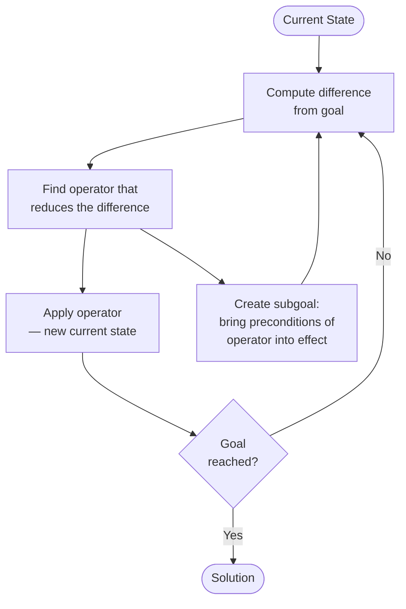

# 3 - Symbolic AI and Knowledge Representation

[toc]

> **TL;DR:** Symbolic AI — also called GOFAI — treats intelligence as the manipulation of explicit symbols according to formal rules. Its founding language is LISP (McCarthy, 1960), its computational manifesto is the Physical Symbol System Hypothesis (Newell and Simon, 1976), its architectural peak is the expert system, and its undoing is the brittleness of hand-crafted knowledge in open-ended domains. The knowledge level (Newell, 1982) provides the abstract characterisation: a system at the knowledge level acts rationally given its goals and beliefs, independent of implementation. Understanding these ideas is essential for appreciating what deep learning replaced — and what it still fails to do.

## Vocabulary

**S-expression** — McCarthy's notation for symbolic expressions: either an atom (symbol) or a pair (S-expression . S-expression), written as nested parenthesized lists. LISP's fundamental data structure.

---

**S-function** — McCarthy's term for functions defined over S-expressions. The five elementary S-functions are: `atom`, `eq`, `car`, `cdr`, and `cons`.

---

**`apply`** — The universal S-function: given an S-expression representing a function and a list of arguments, `apply` evaluates the function on those arguments. `apply` plays the practical role of a universal Turing machine for LISP computation.

---

**Physical Symbol System Hypothesis (PSSH)** — "A physical symbol system has the necessary and sufficient means for general intelligent action" (Newell and Simon, 1976). This claims that symbolic manipulation is both the right level of description for intelligence and the mechanistic substrate required for it.

---

**Knowledge level** — Newell's 1982 abstraction: a level of description at which a system is characterized by its goals, beliefs, and the principle of rationality (act so as to achieve goals given beliefs), independent of how symbols are implemented or how rules are fired.

---

**Production rule** — An if-then rule of the form: IF conditions THEN actions. Expert systems are implemented as large collections of production rules evaluated by an inference engine.

---

**Inference engine** — The rule-execution component of an expert system. It applies one of two strategies: forward chaining (data-driven: apply rules whose antecedents match known facts) or backward chaining (goal-directed: start from the goal and work backwards to premises).

---

**Frame problem** — McCarthy and Hayes' (1969) observation that a logical representation of the world must somehow specify not just what changes when an action is taken, but also — overwhelmingly — what does not change. Explicit enumeration is intractable.

---

**Closed-world assumption (CWA)** — The default in classical logic-based AI: if a fact is not explicitly known to be true, it is assumed false. This makes databases tractable but breaks for open-ended real-world domains.

---

**Satisficing** — Herbert Simon's term for decision-making that selects a good-enough option rather than the globally optimal one. Heuristic search satisfices rather than optimizes.

---

**Means-ends analysis** — The problem-solving strategy of Newell and Simon's GPS: identify the difference between current state and goal state, find an operator that reduces this difference, and apply it. Recurse until no difference remains.

---

**MYCIN** — A rule-based expert system for diagnosing bacterial infections and recommending antibiotics, developed at Stanford University around 1972. One of the most successful expert systems; also a demonstration of brittleness outside its domain.

---

## Intuition

Think of symbolic AI as trying to build a lawyer from first principles. A lawyer has explicit rules (statutes, precedents), a language for expressing facts and queries (legal prose formalized as logical predicates), and a procedure for deriving conclusions from rules and facts (inference). The intuition is that intelligence just *is* this kind of rule-governed reasoning, and a sufficiently large, carefully structured database of rules would constitute genuine understanding.

The failure mode is equally clear in the analogy: a lawyer who knows every statute but has no intuitive sense of the real world will recommend that a bleeding patient be given antibiotics for the bacterial infection they cannot rule out — which is what MYCIN does, because MYCIN has no model of death by blood loss. Explicit rules cannot capture the infinite web of contextual knowledge that grounds real competence.

## How it Works

### LISP: The Language of Symbolic AI (1960)

McCarthy designed LISP for the Advice Taker — a hypothetical system that could handle both declarative and imperative sentences and exhibit common sense. LISP's design reflects five theoretical insights that remain influential.

LISP's foundation is the S-expression: atoms (symbols like `FOO`, `3`, `T`, `NIL`) and pairs formed by `cons`. Every program and every data structure is an S-expression. This code-as-data property — *homoiconicity* — makes meta-programming natural: programs can generate, analyze, and execute other programs using the same list operations.

```lisp
;; Five elementary S-functions (McCarthy 1960)

;; atom: returns T if x is an atomic symbol, F otherwise
(atom 'A)        ;; => T
(atom '(A B))    ;; => F (it's a list, not an atom)

;; eq: equality of atoms
(eq 'A 'A)       ;; => T
(eq 'A 'B)       ;; => F

;; car: first element of a list (head)
(car '(A B C))   ;; => A

;; cdr: remainder of a list (tail)
(cdr '(A B C))   ;; => (B C)

;; cons: construct a pair
(cons 'A '(B C)) ;; => (A B C)

;; Recursive function: length of a list
(defun my-length (lst)
  (cond ((null lst) 0)
        (T (+ 1 (my-length (cdr lst))))))

(my-length '(a b c d))  ;; => 4

;; apply: the universal function (symbolic evaluator)
;; Evaluates fn with args --- mirrors the universal Turing machine
(apply '+ '(1 2 3))  ;; => 6
```

> [!IMPORTANT]
> McCarthy's `cond` expression — the conditional — was his theoretical innovation, not an engineering convenience. It allows functions to be defined recursively without circularity, and it is the mechanism by which LISP programs can express partial functions (functions undefined on some inputs). Every modern programming language's `if-then-else` descends from this idea.

### Newell and Simon: Heuristic Search and Problem Solving

Newell and Simon approached intelligence from experimental psychology. Their core observation was that human problem solving is a form of heuristic search through a problem space — a graph of states connected by operators. GPS (General Problem Solver, 1959) implemented means-ends analysis:



Simon's concept of *satisficing* reframes what "solving" means: an intelligent agent does not exhaustively search for the optimal solution, because the search space is too large. Instead it uses heuristics to find a solution that is good enough given resource constraints. This is the origin of bounded rationality — a concept that now underpins both behavioural economics and the theory of computationally limited agents.

### The Physical Symbol System Hypothesis

Newell and Simon's 1976 Turing Award lecture codified the symbolic AI program as a scientific hypothesis: physical symbol systems are the necessary and sufficient substrate for general intelligence. "Necessary" means any intelligent system is a physical symbol system. "Sufficient" means any physical symbol system (given enough time and memory) can exhibit general intelligence.

The PSSH makes two strong, falsifiable claims. Neural networks challenge the sufficiency direction: do they constitute physical symbol systems? Depending on whether you count distributed representations as "symbolic," the answer is contested. Embodied AI (Brooks) challenges the necessity direction: do you need symbols at all for intelligent behaviour?

> [!NOTE]
> The PSSH was later refined by Newell's knowledge level (1982). The knowledge level is a layer of description *above* the symbol level. At the symbol level, you see tokens, rules, and inference. At the knowledge level, you see goals, beliefs, and rational action. The knowledge level describes *what* a system does; the symbol level describes *how*. This separation is important: two systems with completely different symbol-level implementations can be equivalent at the knowledge level.

### Expert Systems: Peak GOFAI (1965–1987)

Expert systems are the commercial embodiment of symbolic AI. The architecture is uniform: a knowledge base of production rules, a working memory of current facts, and an inference engine that cycles through rule firing.

The prototypical architecture (forward chaining):

```
┌─────────────────────────────────────────────────────┐
│ Knowledge Base: IF-THEN production rules             │
│  Rule 1: IF fever > 38.5 AND stiff_neck THEN        │
│           suspect(meningitis, 0.9)                   │
│  Rule 2: IF suspect(meningitis, P) AND P > 0.7 THEN │
│           recommend(lumbar_puncture)                 │
│  ...                                                 │
└─────────────────────────────────────────────────────┘
            ↕ inference engine (RETE algorithm)
┌─────────────────────────────────────────────────────┐
│ Working Memory: current facts                        │
│  { patient_temp: 39.1, stiff_neck: true, ... }      │
└─────────────────────────────────────────────────────┘
```

The RETE algorithm (Forgy, 1982) made expert systems efficient by compiling the rule conditions into a discrimination network, avoiding redundant re-evaluation of rules whose conditions haven't changed. Modern rule engines (Drools, CLIPS) still use RETE variants.

### The Knowledge Level (Newell, 1982)

Newell's knowledge level introduces the *rationality principle* as the axiom of the knowledge level: agents act so as to achieve their goals given their knowledge. The knowledge level description of a chess program is: "it wants to win; it knows the rules and current position; it acts to improve its winning probability." This description is independent of whether the program uses alpha-beta search, Monte Carlo tree search, or a neural network.

The knowledge level is the correct unit of analysis for *what* an AI system does. The symbol level is the unit of analysis for *how* it does it. Conflating them leads to the classic error of treating a specific implementation as if it were the concept — e.g., claiming that a system "doesn't really reason" because it uses matrix multiplications rather than explicit rule firing.

## Real-world Example

The following Python code implements a minimal expert system shell with forward chaining, loosely modelled on MYCIN's structure. The knowledge base encodes simplified diagnostic rules; the inference engine cycles until no new facts are derived.

```python
from typing import NamedTuple

class Rule(NamedTuple):
    conditions: frozenset   # set of facts that must be present
    conclusion: str         # fact to assert if conditions met
    confidence: float       # certainty factor (MYCIN-style)

# Simplified MYCIN-style knowledge base for bacterial infection diagnosis
knowledge_base: list[Rule] = [
    Rule(frozenset({'fever', 'positive_culture'}),
         'bacterial_infection', 0.85),
    Rule(frozenset({'fever', 'stiff_neck', 'photophobia'}),
         'suspect_meningitis', 0.90),
    Rule(frozenset({'bacterial_infection', 'suspect_meningitis'}),
         'recommend_ceftriaxone', 0.95),
    Rule(frozenset({'bacterial_infection'}),
         'recommend_blood_cultures', 0.99),
    Rule(frozenset({'recommend_ceftriaxone', 'allergy_penicillin'}),
         'recommend_vancomycin_instead', 0.90),
]

def forward_chain(facts: set[str], rules: list[Rule]) -> dict[str, float]:
    """
    Forward-chaining inference engine.
    Returns a dict of derived conclusions and their confidence factors.
    """
    derived: dict[str, float] = {}
    changed = True

    while changed:
        changed = False
        for rule in rules:
            if rule.conditions <= facts and rule.conclusion not in facts:
                facts.add(rule.conclusion)
                derived[rule.conclusion] = rule.confidence
                changed = True
                print(f"  FIRED: {rule.conditions} -> {rule.conclusion} "
                      f"(cf={rule.confidence})")

    return derived

# Patient facts
patient_facts = {'fever', 'stiff_neck', 'photophobia',
                 'positive_culture', 'allergy_penicillin'}

print("Initial facts:", patient_facts)
print("Running inference engine...")
conclusions = forward_chain(patient_facts, knowledge_base)
print("\nDerived conclusions:")
for fact, cf in conclusions.items():
    print(f"  {fact:40s}  cf={cf:.2f}")
```

> [!WARNING]
> MYCIN achieved 65% correct antibiotic selection — comparable to infectious disease specialists, better than general internists. But it had no model of the patient as a biological system: no knowledge of drug interactions outside its rules, no understanding of dosing, and no awareness that the patient might die from causes unrelated to infection. Brooks famously notes that if told the aorta has ruptured, MYCIN will still try to find a bacterial cause. This is the brittleness problem in a single clinical example.

## In Practice

**Production rule systems in modern software.** Expert system logic did not disappear — it migrated to business rules engines (Drools, IBM ODM), fraud detection systems, and configuration management. The XCON system that configured DEC's VAX orders reportedly saved $40M/year at its peak. Production rules remain effective in highly constrained, well-specified domains with stable knowledge.

**Knowledge representation in LLMs.** Large language models encode something like knowledge in their weights — but not as explicit propositions or production rules. The relationship between weight-encoded knowledge and symbolic knowledge is unsolved. RAG (Retrieval-Augmented Generation) grafts an explicit knowledge base (a vector store of documents) onto an LLM, partially restoring the "inspectable knowledge" property that expert systems provided. Tool use (code interpreters, search APIs) restores the "reliable computation" property.

**The Frame Problem persists.** Modern neural systems struggle with a version of the frame problem in multi-step reasoning: they do not have a crisp model of which world facts are changed by an action and which are not. This manifests as inconsistency errors in long-horizon planning and as hallucinated side effects in tool-use scenarios.

> [!TIP]
> When a modern AI system needs to reason over a well-constrained, expert-level domain with auditable decisions (medical dosing, financial compliance, legal rule interpretation), a hybrid system combining an LLM front-end with a classical rule engine back-end often outperforms either alone. The LLM handles ambiguity and natural language; the rule engine provides verifiable, correctable logic.

## Pitfalls

- **"LISP was just a Turing-complete language."** — McCarthy's theoretical contribution was the conditional expression enabling recursive function definitions, the S-expression data/code unification, and the universal `apply` function. These ideas influenced lambda calculus implementations, Scheme, ML, Haskell, and ultimately Python's first-class functions and closures.
- **"Expert systems were replaced by machine learning."** — Expert systems failed in open-ended domains requiring large-scale commonsense knowledge. In narrow, high-stakes, auditable domains (drug interaction checking, tax code interpretation, network configuration), they remain in production use. Machine learning did not replace them; it filled a different niche.
- **"The PSSH was disproved."** — The PSSH is contested, not disproved. If LLMs are physical symbol systems (their input-output is symbolic), the PSSH may be correct. If "physical symbol system" requires explicit semantic bindings between tokens and world referents, LLMs may not qualify. The distinction matters for whether current AI can, even in principle, scale to general intelligence.
- **"Means-ends analysis is simple-minded."** — GPS's means-ends analysis anticipated STRIPS planning, classical planning in robotics, and hierarchical task network planning. These remain active research areas. The "simple-minded" criticism conflates the algorithm's toy-problem origins with its conceptual scope.

## Exercises

### Exercise 1 — LISP basics

Trace the execution of the following LISP expression step by step:

```lisp
(car (cdr (cons 'A (cons 'B (cons 'C '())))))
```

#### Solution 1

Evaluate inside-out:
1. `(cons 'C '())` → `(C)` — a list containing atom C
2. `(cons 'B (C))` → `(B C)`
3. `(cons 'A (B C))` → `(A B C)`
4. `(cdr '(A B C))` → `(B C)` — the tail, dropping A
5. `(car '(B C))` → `B` — the head of the remainder

Result: `B`. This demonstrates list construction with `cons` and decomposition with `car`/`cdr`.

### Exercise 2 — Forward vs. backward chaining

An expert system has three rules and one initial fact:
- R1: IF has_fever THEN possible_infection
- R2: IF possible_infection AND high_WBC THEN probable_infection
- R3: IF probable_infection THEN recommend_antibiotics

Initial facts: {has_fever, high_WBC}. Goal: derive recommend_antibiotics.

Trace execution under (a) forward chaining and (b) backward chaining.

#### Solution 2

**Forward chaining** (data-driven):
1. R1 fires: has_fever → add possible_infection. Working memory: {has_fever, high_WBC, possible_infection}
2. R2 fires: possible_infection AND high_WBC → add probable_infection. Working memory: {..., probable_infection}
3. R3 fires: probable_infection → add recommend_antibiotics. Done.
3 rule firings, driven by data.

**Backward chaining** (goal-directed):
1. Goal: recommend_antibiotics. R3 could derive it. New goal: prove probable_infection.
2. Goal: probable_infection. R2 could derive it. New goals: prove possible_infection AND prove high_WBC.
3. high_WBC is in initial facts. Satisfied.
4. Goal: possible_infection. R1 could derive it. New goal: prove has_fever.
5. has_fever is in initial facts. Satisfied. Unwind: possible_infection proven, probable_infection proven, recommend_antibiotics proven.
3 rules consulted, driven by the goal.

Both produce the same conclusion. Forward chaining is better when data is abundant and goals are open. Backward chaining is better when the goal is specific and you want to avoid deriving irrelevant facts.

### Exercise 3 — The Frame Problem

An AI is given: "The robot picks up the red block." Formalize the effects of this action in first-order logic, then identify the frame problem.

#### Solution 3

Effects: `holding(robot, red_block, t+1)`, `not on_table(red_block, t+1)`.

The frame problem: you must also assert that the blue block is still on the table, the green block is still on the table, the robot's position is still in room A, the weight of the red block is unchanged, the temperature of the room is unchanged, and so on. For every fact in the world that the action does not affect, an explicit "frame axiom" must be added. In a rich world model, this is intractable — the set of non-effects vastly outnumbers the effects.

The successor-state axiom (STRIPS/PDDL convention) partially solves this by defining: a fact holds after an action iff (a) the action added it, or (b) it held before and the action did not delete it. This requires enumerating all add-effects and delete-effects, which is feasible for toy domains and intractable for real-world knowledge.

### Exercise 4 — Knowledge level analysis

Analyze the following two systems at the knowledge level and the symbol level, and state whether they are equivalent at each level:

- System A: a chess engine using alpha-beta search with hand-crafted evaluation
- System B: a chess engine using a neural network trained by self-play (AlphaZero-style)

#### Solution 4

**Knowledge level:** Both systems want to win at chess; both know the rules and the current position; both act to maximize winning probability. At the knowledge level they are functionally equivalent — they are both rational chess players. An observer who only observes their moves and outcomes cannot distinguish them at the knowledge level.

**Symbol level:** They are entirely different. System A manipulates explicit state representations, evaluates positions using symbolic heuristics, and uses explicit lookahead trees with minimax. System B manipulates dense floating-point weight matrices; position evaluation is an emergent property of activations distributed across millions of parameters; "lookahead" is implemented via Monte Carlo tree search guided by the network. There is no explicit rule, no interpretable symbol, no inspectable reasoning trace at the symbol level of System B.

**Implication:** The knowledge level / symbol level distinction shows that the PSSH is non-trivially contested. If you define "physical symbol system" at the knowledge level, both qualify. If you define it at the symbol level, only A does.

### Exercise 5 — Expert system brittleness

MYCIN correctly identifies the bacterial cause of a patient's infection and recommends ceftriaxone. The patient also has a ruptured aorta and will die in 20 minutes without surgery. MYCIN has no rule about aortic rupture. What does MYCIN do, and why is this a fundamental problem rather than a fixable bug?

#### Solution 5

MYCIN has no rule whose conditions match aortic rupture, so it fires no rules about it. It continues to recommend ceftriaxone for the bacterial infection. If asked about the blood pressure drop, it will try to find a bacterial cause.

This is not a fixable bug in the traditional sense because there is no principled limit to the set of facts that can become relevant in an open-ended real-world context. Adding a rule for aortic rupture does not solve the problem — it adds one edge case while leaving infinitely many others unaddressed. The pathology is structural: a closed rule base cannot represent the open-ended knowledge that human clinicians bring from biology, anatomy, common sense, and clinical experience. The only solutions are either to enumerate all possible medical emergencies (the knowledge acquisition bottleneck that killed expert systems) or to use a different knowledge representation that supports generalization — which is the motivation for machine learning in medicine.

## Sources

- McCarthy, J. (1960). Recursive Functions of Symbolic Expressions and Their Computation by Machine. *Communications of the ACM* 3(4), 184–195.
- Newell, A., & Simon, H. A. (1976). Computer Science as Empirical Inquiry: Symbols and Search. *Communications of the ACM* 19(3), 113–126.
- Newell, A. (1982). The Knowledge Level. *Artificial Intelligence* 18(1), 87–127.
- Newell, A., & Simon, H. A. (1972). *Human Problem Solving*. Prentice-Hall.
- Buchanan, B. G., & Shortliffe, E. H. (1984). *Rule-Based Expert Systems: The MYCIN Experiments*. Addison-Wesley.
- Minsky, M. (1961). Steps Toward Artificial Intelligence. *Proceedings of the IRE* 49, 8–30.
- McCarthy, J. & Hayes, P. J. (1969). Some philosophical problems from the standpoint of artificial intelligence. *Machine Intelligence* 4, 463–502. (Frame problem origin)

## Related

- [1 - History of AI](./1-history-of-ai.md)
- [2 - Turing and the Foundations of Computation](./2-turing-and-the-foundations-of-computation.md)
- [4 - Connectionism and the Rise of Neural Networks](./4-connectionism-and-the-rise-of-neural-networks.md)
- [5 - Embodiment and the Brooks Revolution](./5-embodiment-and-the-brooks-revolution.md)
- [1 - What is ML and Version Space](../Machine-Learning/1-foundations/1-what-is-ml-and-version-space.md)
