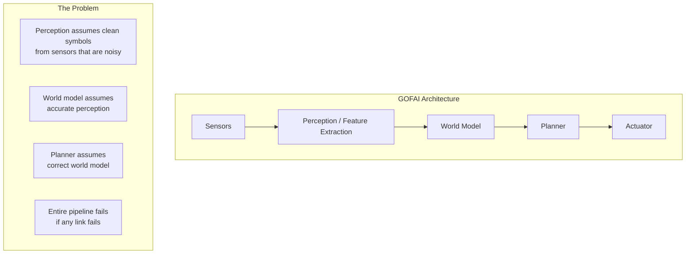

# 5 - Embodiment and the Brooks Revolution

[toc]

> **TL;DR:** Rodney Brooks' 1991 "Intelligence Without Representation" is the founding document of behaviour-based robotics. His central claim: representation is not a necessary ingredient of intelligence, and the entire GOFAI architecture (sense → model → plan → act) is the wrong unit of decomposition. Instead, intelligence should be built incrementally as a stack of behaviour layers, each directly coupling perception to action, each deployed in the actual physical world. This paradigm reshaped robotics, influenced the situated cognition movement in cognitive science, and now resurfaces in modern reinforcement learning, foundation model agents, and embodied AI benchmarks.

## Vocabulary

**Representation** — In GOFAI, an internal symbolic model of the world used by a planning system to reason about actions. Brooks argues this is the wrong abstraction: the world is its own best model.

---

**Situated AI** — The claim (from cognitive science, especially Suchman 1987 and Brooks 1991) that intelligent behavior arises from the interaction of an agent with its environment, not from internal reasoning over a detached model of the world. Intelligence is situational, not representational.

---

**Subsumption architecture** — Brooks' control architecture: a layered system of finite state machines (FSMs) where each layer implements a complete behavior (sense → action), higher layers can suppress or inhibit lower layers' outputs or inputs, and no layer requires a central world model.

---

**Layer (in subsumption)** — A network of finite state machines that implements one behavior. Layer 0 might implement "avoid obstacles"; layer 1 might add "wander"; layer 2 might add "explore distant places." Each layer is a complete, independently deployable intelligence.

---

**Suppression** — The inter-layer mechanism in subsumption where a higher layer injects a message on an existing wire, overriding what the lower layer would have produced on that wire. The lower layer's computation continues but its output is not used for a fixed time window.

---

**Inhibition** — The inter-layer mechanism where a higher layer prevents a lower layer from sending a message on an existing wire for a fixed time window. (Contrast: suppression replaces the message; inhibition blocks it.)

---

**Creature** — Brooks' term for a complete, deployable autonomous agent: a mobile robot that "exists in the world and copes appropriately with changes in its dynamic environment."

---

**Merkwelt** — Jakob von Uexküll's concept: the subjective perceptual world of an organism, containing only those aspects of the physical world that are relevant to the organism's survival. Brooks invokes this to argue that abstracting away perception entirely (as GOFAI does) removes the very signals that ground intelligent behavior.

---

**Subsumption** — The architecture's name derives from layer suppression, but also from the logical sense: each higher layer subsumes the capabilities of all lower layers. You can disable layer 2 and the robot still wanders (layer 1 active); disable layer 1 and it still avoids obstacles (layer 0 active).

---

**Decomposition by activity** — Brooks' alternative to functional decomposition. Instead of slicing the system into perception module + reasoning module + action module (which cannot be tested independently), slice it into complete agent behaviors that each independently sense and act.

---

**Functional decomposition** — The traditional AI architecture: separate a system into sense, model, plan, and act modules with symbolic interfaces between them. Brooks argues this is the source of fragility, because the interfaces require human-assumed symbolic semantics that do not survive real sensor noise.

---

## Intuition

Imagine building an insect. The GOFAI approach would build a vision system that outputs a symbolic scene description, pass it to a world model, build a plan, and send motor commands. This pipeline has never worked for insects.

Brooks' approach: build the simplest behavior first — avoid collisions. Deploy it on a real robot. Now add "wander" on top. Deploy it. Add "explore" on top. Deploy. At every step you have a working, tested robot. The behaviors stack up like geological layers; higher ones modulate lower ones without replacing them.

The deeper philosophical point: "the world is its own best model." A robot that re-queries its sensors every cycle has more accurate world knowledge than a robot that maintains an internal model and infers from it. Perception is cheap; modeling is expensive and error-prone. Intelligence should couple sensing and action as tightly as possible.

## How it Works

### The Failure of Functional Decomposition

GOFAI systems decomposed intelligence into: perception (convert sensor data to symbols), world model (maintain a symbolic representation of the environment), planning (compute a sequence of actions to reach a goal), and actuation (convert symbolic actions to motor commands). Each module was developed by a different research group, tested in isolation on clean symbolic inputs, and never successfully integrated.

Brooks illustrates the problem with a parable: in the 1890s, researchers trying to build artificial flight study a Boeing 747 and decompose the problem into aerodynamics (lift, drag, thrust), passenger accommodation, and navigation. They build excellent seats and windows but make no aerodynamic progress because they never study the actual flight mechanism. Similarly, GOFAI researchers built excellent knowledge representation and planning systems that never produced a robot that could navigate a real room.



> [!WARNING]
> The fundamental fragility of functional decomposition: each module's *output* is the next module's *input*. Errors compound upstream. Real robot sensors produce 15–30% noise on sonar readings in a room with reflective surfaces. A perception system tuned on clean data produces wrong symbols; the world model compounds the error; the planner makes wrong decisions. The system collapses from the input side.

### Decomposition by Activity

Brooks proposes decomposing by *activity* — each slice is a complete sense-act behavior, not a processing stage. Each activity layer is:

1. A fixed-topology network of simple finite state machines.
2. Each FSM has a handful of states, one or two registers, and access to sensor data.
3. FSMs send and receive fixed-length messages on dedicated wires.
4. There is no shared global memory.
5. FSMs run asynchronously; there is no central clock.

The subsumption architecture wires layers together by side-tapping existing wires:

```
Layer 0: AVOID-OBJECTS
  FSMs: sonar-read, collide-detect, feelforce, runaway, halt, forward
  Behavior: robot avoids static and moving obstacles

Layer 1: WANDER
  FSMs: wander, avoid-suppress
  Behavior: wanders randomly; suppresses layer-0's forward command
  when choosing a heading, so layer 0 still handles obstacle avoidance

Layer 2: EXPLORE
  FSMs: whenlook, free-space-find, pathplan, integrate
  Behavior: finds distant visible free space and navigates toward it;
  suppresses layer-1's wander heading with the exploration heading;
  layer 0 still handles obstacle avoidance
```

**Figure: subsumption architecture for Brooks' Allen robot.**

```
┌─────────────────────────────────────────────────────────┐
│  Layer 2: EXPLORE          [whenlook→freespace→pathplan] │
│                  ↓ suppress heading                      │
│  Layer 1: WANDER           [wander]                      │
│                  ↓ suppress forward                      │
│  Layer 0: AVOID            [sonar→collide→feelforce→run] │
│                  ↓ actuator                              │
│  MOTORS          [turn, forward, halt]                   │
└─────────────────────────────────────────────────────────┘
      ↑ sensors (sonar, bump)
      WORLD (actual lab, unmodeled)
```

The key property: each layer is tested independently in the real world before the next layer is added. Layer 0 is deployed and debugged for months before layer 1 is built. When layer 1 is added, there is only one new thing to debug: layer 1 itself, because layer 0 is already known to work.

### No Central Representation

The subsumption architecture has no place where "the world" is represented. Layer 0's sonar readings are transformed directly into a repulsive force vector and into a motor command. There is no step where "there is an obstacle at position (1.2m, 30°)" is asserted as a proposition in a world model.

Brooks' radical observation: the representations do not exist. An observer watching the robot *imputes* a world model to explain the behavior, but the robot itself has no such structure. The coherent patterns of behavior emerge from the interaction of the layers with the world, not from any internal representation.

This connects to Minsky's observation about human behavior: "Simon noted that the complexity of behavior of a system was not necessarily inherent in the complexity of the creature, but perhaps in the complexity of the environment." An ant wandering a beach is not navigating with a map — it is reacting to local gradients.

### The MIT Mobots in Practice

Brooks' group built four mobile robots (Allen, Tom, Jerry, Herbert) using the subsumption architecture. These operated continuously, autonomously, in real MIT AI Laboratory corridors with people walking by. They were not given goals or told where to go — they simply existed and pursued implicit objectives emerging from their behavior layers.

Key engineering observations from operating these systems:

1. **Real-world testing is mandatory.** A behavior that works in a clean lab (uniform painted walls, no reflections) fails in the real hallway. The architecture's incremental deployment forced each layer to be real-world robust before the next was added.

2. **No global control is possible.** When a message arrives on a wire, it is processed by whatever FSM is connected to that wire. There is no central process that "decides what to do next." The robot's behavior is the collective output of all running FSMs, none of which knows about the others.

3. **Robustness from independence.** If layer 2 malfunctions, the robot still wanders (layer 1). If layer 1 malfunctions, the robot still avoids obstacles (layer 0). The independence of layers provides graceful degradation — the exact opposite of the GOFAI pipeline, where any module failure cascades.

## Real-world Example

A Python simulation of a two-layer subsumption architecture for obstacle avoidance (layer 0) augmented with wandering (layer 1). The robot state is the world-facing interface; layers directly produce actions without shared state.

```python
import random
import math
from dataclasses import dataclass, field
from typing import Callable

# --- Sensor abstraction (simulated sonar ring) ---
@dataclass
class SonarReading:
    angles_deg: list[float]   # sonar beam angles
    distances: list[float]    # distance to nearest object (metres)

def simulate_sonar(robot_x: float, robot_y: float,
                   robot_heading: float,
                   obstacles: list[tuple[float, float]]) -> SonarReading:
    """Simplified sonar: 8 beams, reports distance to nearest obstacle."""
    angles = [i * 45.0 for i in range(8)]
    distances = []
    for angle_deg in angles:
        beam_angle = math.radians(robot_heading + angle_deg)
        min_dist = 5.0   # max sensor range
        for ox, oy in obstacles:
            dx = ox - robot_x
            dy = oy - robot_y
            dist = math.sqrt(dx*dx + dy*dy)
            # Check if obstacle is roughly in this beam direction
            obj_angle = math.atan2(dy, dx)
            diff = abs(math.degrees(obj_angle) - (robot_heading + angle_deg))
            if diff < 30.0 and dist < min_dist:
                min_dist = dist
        distances.append(min_dist)
    return SonarReading(angles, distances)

# --- Layer 0: AVOID obstacles ---
def layer0_avoid(sonar: SonarReading) -> tuple[float | None, bool]:
    """
    Returns (steering_delta, halt) where:
    - steering_delta: how much to turn (None if no obstacle close)
    - halt: True if something is immediately ahead
    """
    min_dist = min(sonar.distances)
    front_dist = sonar.distances[0]   # beam straight ahead

    if front_dist < 0.5:
        return None, True   # halt: obstacle directly ahead

    if min_dist < 1.0:
        # Find direction of nearest obstacle and steer away
        closest_idx = sonar.distances.index(min_dist)
        # Steer opposite to the obstacle direction
        obstacle_angle = sonar.angles_deg[closest_idx]
        steer = -math.copysign(30.0, obstacle_angle - 180.0)
        return steer, False

    return None, False   # no obstacle: pass control to higher layer

# --- Layer 1: WANDER ---
_wander_timer = 0
_wander_heading_delta = 0.0

def layer1_wander(layer0_steer: float | None,
                  layer0_halt: bool) -> tuple[float, float]:
    """
    Generates a random wander heading every ~10 ticks.
    Suppresses layer0 steering if no immediate obstacle.
    Returns (heading_delta, forward_speed).
    """
    global _wander_timer, _wander_heading_delta

    _wander_timer += 1
    if _wander_timer > 10:
        _wander_heading_delta = random.uniform(-45.0, 45.0)
        _wander_timer = 0

    if layer0_halt:
        return 0.0, 0.0   # don't move

    # Suppression: layer0's steer takes priority over wander
    final_steer = layer0_steer if layer0_steer is not None else _wander_heading_delta
    speed = 0.3
    return final_steer, speed

# --- Main simulation loop ---
def run_simulation(steps: int = 50) -> None:
    robot_x, robot_y, robot_heading = 0.0, 0.0, 0.0
    obstacles = [(2.0, 0.5), (-1.0, 2.0), (3.0, -1.0), (0.5, -2.0)]

    print(f"{'Step':>4}  {'x':>6}  {'y':>6}  {'hdg':>6}  {'speed':>5}  note")
    for step in range(steps):
        sonar = simulate_sonar(robot_x, robot_y, robot_heading, obstacles)

        # Layer 0: obstacle avoidance
        steer0, halt0 = layer0_avoid(sonar)

        # Layer 1: wander (receives layer0 outputs via suppression)
        steer1, speed = layer1_wander(steer0, halt0)

        # Apply to robot state
        robot_heading = (robot_heading + steer1) % 360
        rad = math.radians(robot_heading)
        robot_x += speed * math.cos(rad)
        robot_y += speed * math.sin(rad)

        note = "HALT" if halt0 else ("AVOID" if steer0 is not None else "wander")
        if step % 5 == 0:
            print(f"{step:>4}  {robot_x:>6.2f}  {robot_y:>6.2f}  "
                  f"{robot_heading:>6.1f}  {speed:>5.2f}  {note}")

run_simulation(50)
```

> [!TIP]
> The suppression mechanism is implemented by the `layer1_wander` receiving `layer0_steer` and using it in preference to its own wander heading. No global scheduler, no central decision. This is the defining property of subsumption: behaviors are composed by message interception at the wire level, not by any reasoning process that "chooses" which behavior to run.

## In Practice

**Behaviour-based robotics today.** The direct lineage from Brooks runs through Cog (the humanoid robot at MIT AI Lab), through the iRobot Roomba (which uses a simplified subsumption-like behavior stack), to Boston Dynamics' locomotion controllers, which use layered reactive controllers at the low level with higher-level planning injected via suppression-like mechanisms.

**Reinforcement learning and embodied AI.** RL-based robot learning can be seen as automating the process of designing behavior layers. The reward function defines desired behavior; the learned policy is the layer. Modern robot learning systems (RT-2, DreamerV3, PaLM-E) combine RL-learned reactive policies (analogous to subsumption layers 0-2) with large model-based planning (more like GPS/GOFAI). The debate between model-free RL (world as own model) and model-based RL (explicit world model) recapitulates the Brooks-vs-GOFAI debate.

**Foundation model agents.** LLM agents (ReAct, Voyager, SayCan) are organized around a think-then-act loop with tool use. This is closer to GOFAI's sense-model-plan-act than to subsumption. The brittleness of these agents in novel environments (inability to recover from unexpected tool failures, compounding reasoning errors) mirrors GOFAI's brittleness in unexpected sensor readings. The "world model" in an LLM agent is the language model's weights — not grounded in real-time perception the way Brooks requires.

> [!NOTE]
> Brooks explicitly distinguished his approach from connectionism: "It isn't connectionism." Connectionists also use networks of simple processing units, but (at the time) only in simulation, looking for emergent representations. Brooks required: real-world operation, unique finite state machines per node (not uniform), low inter-layer connectivity, and no expectation of emergent distributed representations. The distinction is important for understanding why embodied AI and deep learning are not the same paradigm.

**Limits of subsumption.** Brooks himself acknowledged that the approach faces open questions: how many layers can stack before inter-layer interactions become undebuggable? Can learning occur in fixed-topology FSM networks? Can high-level symbolic planning be subsumed? The current answer from the robotics community is: learning is integrated at the weight level (RL), not the architecture level; planning is handled by separate modules above the subsumption stack; and the hardest robot behaviors (dexterous manipulation, multi-modal reasoning) still require representations.

> [!CAUTION]
> "The world is its own best model" is a heuristic, not a law. For tasks requiring prediction over long horizons (catching a ball, planning a factory production schedule, navigating to a goal 100m away), re-querying sensors every cycle is insufficient. The world cannot represent the future. World models are necessary for any task whose solution requires reasoning about counterfactuals or predictions. Brooks' insight is about the baseline — you should start with direct perception-action coupling and add world modeling only where demonstrated necessary.

## Pitfalls

- **"Brooks proved representation is unnecessary."** — He demonstrated that obstacle avoidance, wandering, and simple exploration can be achieved without internal world models. He did not demonstrate this for language understanding, chess playing, scientific reasoning, or most tasks we associate with human-level intelligence.
- **"Subsumption architecture is just production rules."** — Brooks himself addressed this in Section 7.3 of the 1991 paper. Production rules are selected by matching against a rule base; the rule base is global shared state. Subsumption layers have no global state, no variables that need instantiation, no matching process — the environment directly triggers actions. The distinction is whether intelligence is rule lookup or sensorimotor coupling.
- **"Embodied AI just means robots."** — Embodiment is a claim about cognitive architecture, not physical substrate. An LLM with a tool-use interface is partially embodied (it acts in the world and receives observations). A simulated agent in a video game is embodied in a weaker sense. The claim is that intelligence cannot be fully understood by studying disembodied reasoning processes.
- **"The subsumption architecture failed."** — Brooks' Roomba-lineage has sold 30+ million units. Boston Dynamics' robots use reactive control architectures heavily influenced by subsumption at the low level. The architecture "failed" only in the sense that it has not yet scaled to general intelligence — which was always the acknowledged open question.

## Open Questions

- **Scalability of behavior stacking.** Can subsumption-like architectures scale to dozens of behavior layers? What is the right compositional structure for complex robot behavior?
- **Embodiment and language.** Can an LLM be genuinely embodied, or does the discretization of perception into tokens fundamentally break the tight perception-action loop Brooks requires? Current embodied LLM agents (SayCan, RT-2) remain brittle in novel physical environments.
- **World models vs. direct coupling.** DreamerV3 and similar model-based RL systems learn a world model and plan within it — closer to GOFAI. MuJoCo-trained locomotion policies are model-free — closer to subsumption. Which approach scales to general manipulation is an open empirical question.
- **Moravec's paradox today.** Hans Moravec (1988) observed that high-level reasoning is easy to program but low-level sensorimotor skills are hard — the inverse of human difficulty. LLMs inverted this partially: GPT-4 solves bar exam questions but fails to count letters. Does the resolution lie in embodied grounding?

## Sources

- Brooks, R. A. (1991). Intelligence Without Representation. *Artificial Intelligence* 47, 139–159.
- Brooks, R. A. (1986). A Robust Layered Control System for a Mobile Robot. *IEEE Journal of Robotics and Automation* 2(1), 14–23. (Original subsumption paper)
- Brooks, R. A. (1990). Elephants Don't Play Chess. *Robotics and Autonomous Systems* 6(1–2), 3–15.
- Minsky, M. (1986). *The Society of Mind*. Simon and Schuster.
- Moravec, H. (1988). *Mind Children*. Harvard University Press.
- Suchman, L. (1987). *Plans and Situated Actions*. Cambridge University Press.
- Buchanan, B. G. (2005). A (Very) Brief History of AI. *AI Magazine* 26(4). (Shakey robot context)
- Privacy Foundation timeline. (Shakey 1966, WABOT 1970 entries)

## Related

- [1 - History of AI](./1-history-of-ai.md)
- [2 - Turing and the Foundations of Computation](./2-turing-and-the-foundations-of-computation.md)
- [3 - Symbolic AI and Knowledge Representation](./3-symbolic-ai-and-knowledge-representation.md)
- [4 - Connectionism and the Rise of Neural Networks](./4-connectionism-and-the-rise-of-neural-networks.md)
- [Generative AI Fundamentals](../AI-Engineering/1-foundations/3-generative-ai-fundamentals.md)
