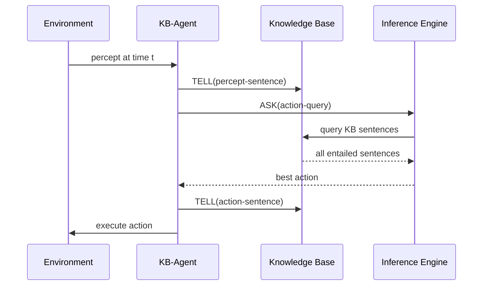

# Logical Agents and Knowledge Representation

[toc]

> **TL;DR:** Logical agents replace the state-as-opaque-blob of search agents with explicit symbolic knowledge: facts about the world encoded as sentences in a formal language, reasoned over by a domain-independent inference engine. Propositional logic (PL) is the entry point — declarative, compositional, and decidable. The core loop is KB-Agent: TELL the KB the current percept, ASK the KB for the best action, TELL the KB the action taken. Entailment (KB ⊨ α) is the semantics; inference rules (Modus Ponens, resolution) are the algorithms; and the Wumpus World is the canonical test environment.

## Vocabulary

**Knowledge base (KB)** — a set of sentences in a formal representation language; the repository of everything the agent currently believes.

**Sentence** — a formal assertion about the world in the representation language; every sentence is either true or false in a given world.

**Knowledge representation language** — a formal language with defined syntax (what is well-formed) and semantics (what is true).

**Syntax** — the rules that define well-formed sentences; purely structural, independent of meaning.

**Semantics** — the rules that assign truth values to sentences relative to a world (a model).

**Model** — a possible world; a complete assignment of truth values to all atomic propositions. For n propositions there are 2^n models.

**Entailment (KB ⊨ α)** — the KB entails sentence α iff α is true in every model in which all KB sentences are true. Entailment is a semantic (meaning) relationship.

**Inference** — a syntactic procedure (algorithm) for deriving new sentences from existing ones; sound iff it only derives entailed sentences; complete iff it can derive all entailed sentences.

**Soundness** — an inference procedure is sound iff KB ⊢ α implies KB ⊨ α (derives only truths).

**Completeness** — an inference procedure is complete iff KB ⊨ α implies KB ⊢ α (derives all truths).

---

**Proposition** — a declarative statement that is either true or false; the atomic unit in propositional logic.

**Atomic proposition** — a single proposition symbol (upper-case letter, possibly subscripted); has no internal structure.

**Compound proposition** — built from atomic propositions using logical connectives.

**Literal** — an atomic proposition or its negation; the building block of clauses.

**Clause** — a disjunction of literals (a ∨ b ∨ ¬c); the standard form for resolution.

**Conjunctive Normal Form (CNF)** — a conjunction of clauses; every propositional sentence can be converted to CNF.

---

**Connective** — operator that builds compound propositions:
- Negation ¬p (NOT)
- Conjunction p ∧ q (AND)
- Disjunction p ∨ q (OR)
- Implication p → q (IF...THEN; equivalent to ¬p ∨ q)
- Biconditional p ↔ q (IFF; equivalent to (p → q) ∧ (q → p))

**Tautology** — a sentence true in all models (e.g., p ∨ ¬p).

**Contradiction** — a sentence false in all models (e.g., p ∧ ¬p).

**Contingency** — a sentence that is neither a tautology nor a contradiction.

---

**Modus Ponens** — inference rule: from p and p → q, derive q.

**Horn clause** — an implication where the antecedent is a conjunction of positive literals and the consequent is a single positive literal: p_1 ∧ ... ∧ p_n → q.

**Resolution** — inference rule operating on clauses: from (l_1 ∨ ... ∨ l_k ∨ p) and (m_1 ∨ ... ∨ m_n ∨ ¬p), derive (l_1 ∨ ... ∨ l_k ∨ m_1 ∨ ... ∨ m_n). Resolution is sound and complete for propositional logic.

**Refutation (proof by contradiction)** — prove KB ⊨ α by showing KB ∧ ¬α is unsatisfiable (derives the empty clause).

---

## Intuition

The intelligence spectrum runs Reflex → States → Variables → Logic. Each tier adds representational power:

- **States agents** (search, game playing) treat world states as atomic — an opaque integer or a board position.
- **Variables agents** (CSPs, Bayesian networks) expose the *structure* inside states — states are tuples of variable assignments.
- **Logic agents** go further: they can represent *general rules* that hold across infinitely many states, can perform deduction, and can reason about their own beliefs.

The price of this power is computational: model checking (enumerate all 2^n models) is PSPACE-complete for PL; resolution is NP-complete in the worst case. The payoff is that a single general rule can replace exponentially many ground facts.

Think of the KB as a whiteboard: the agent writes new facts as it perceives them (TELL), and reads answers by asking the inference engine (ASK). The inference engine is domain-independent — the same algorithm works whether the KB is about the Wumpus World, a medical domain, or a legal system.

**Figure:** KB-Agent interaction cycle.



## How it works

### KB-Agent loop

The KB-Agent pseudocode from the lecture slides is a three-step cycle repeated at every time step t:

1. **TELL(KB, MAKE-PERCEPT-SENTENCE(percept, t))** — add a time-stamped percept sentence to the KB.
2. **action ← ASK(KB, MAKE-ACTION-QUERY(t))** — query the KB for the best action at time t; the inference mechanism derives this from KB + domain knowledge.
3. **TELL(KB, MAKE-ACTION-SENTENCE(action, t))** — record the chosen action in the KB for future reference.

The KB agent separates *what it knows* (the KB, domain-specific) from *how it reasons* (the inference algorithm, domain-independent). This separation is the defining feature of the declarative approach.

```python
from typing import Any

class KBAgent:
    def __init__(self, domain_axioms: list[str]) -> None:
        self.kb: list[str] = list(domain_axioms)
        self.t: int = 0

    def tell(self, sentence: str) -> None:
        self.kb.append(sentence)

    def ask(self, query: str) -> bool:
        """Ask whether query is entailed by KB. Uses PL-resolution (stub)."""
        return pl_resolution(self.kb, query)

    def act(self, percept: Any) -> str:
        self.tell(self.make_percept_sentence(percept, self.t))
        action = "Forward"  # derived from ASK in a real agent
        self.tell(self.make_action_sentence(action, self.t))
        self.t += 1
        return action

    def make_percept_sentence(self, percept: Any, t: int) -> str:
        return f"Percept({percept}, t={t})"

    def make_action_sentence(self, action: str, t: int) -> str:
        return f"Action({action}, t={t})"

def pl_resolution(kb: list[str], query: str) -> bool:
    """Stub: returns True if query is entailed by kb via resolution."""
    # Real implementation: convert to CNF, resolve until empty clause or no progress
    return query in kb
```

### Propositional Logic: Syntax

A propositional sentence is defined recursively:

1. Any atomic proposition symbol (A, B, W_{1,3}, P_{2,1}) is a sentence.
2. If S is a sentence, so is ¬S.
3. If S1 and S2 are sentences, so are: S1 ∧ S2, S1 ∨ S2, S1 → S2, S1 ↔ S2.
4. A sentence in parentheses (S) is a sentence.

Operator precedence (highest to lowest): parentheses, ¬, ∧, ∨, →, ↔.

Wumpus World examples:
- W_{1,3} — "there is a Wumpus in [1,3]"
- S_{1,2} → W_{1,3} ∨ W_{1,1} — "if stench in [1,2] then Wumpus is in [1,3] or [1,1]"
- B_{1,1} ↔ P_{1,2} ∨ P_{2,1} — "breeze in [1,1] iff pit in [1,2] or in [2,1]"

### Propositional Logic: Semantics (Truth Tables)

Semantics assigns truth values recursively. The five connectives:

| p | q | ¬p | p ∧ q | p ∨ q | p → q | p ↔ q |
| :---: | :---: | :---: | :---: | :---: | :---: | :---: |
| F | F | T | F | F | T | T |
| F | T | T | F | T | T | F |
| T | F | F | F | T | F | F |
| T | T | F | T | T | T | T |

> [!IMPORTANT]
> Implication (p → q) is false **only** when p is true and q is false. The case p=False, q=anything is always True — a false premise makes the implication vacuously true. This is the single most common source of confusion in propositional logic.

Key identity: p → q ≡ ¬p ∨ q (logically equivalent — same truth table column).

### Model Checking

Model checking enumerates all 2^n models (truth assignments) and checks that every model satisfying the KB also satisfies α. This is the brute-force algorithm: sound, complete, but exponential in the number of symbols.

```python
from itertools import product
from typing import Callable

def model_check(
    kb_sentences: list[Callable[[dict[str, bool]], bool]],
    alpha: Callable[[dict[str, bool]], bool],
    symbols: list[str],
) -> bool:
    """
    Returns True iff KB entails alpha.
    kb_sentences, alpha: callables taking a dict{symbol: bool} -> bool
    """
    for values in product([False, True], repeat=len(symbols)):
        model = dict(zip(symbols, values))
        # If all KB sentences are true in this model...
        if all(f(model) for f in kb_sentences):
            # ...then alpha must also be true
            if not alpha(model):
                return False
    return True

# Example: Does KB = {P, P->Q} entail Q?
def kb_p(m: dict[str, bool]) -> bool:
    return m["P"]

def kb_p_implies_q(m: dict[str, bool]) -> bool:
    return (not m["P"]) or m["Q"]

def query_q(m: dict[str, bool]) -> bool:
    return m["Q"]

result = model_check([kb_p, kb_p_implies_q], query_q, ["P", "Q"])
print(result)  # True — modus ponens
```

### Inference Rules

**Modus Ponens:** From p and p → q, derive q.

**Modus Tollens:** From ¬q and p → q, derive ¬p.

**And-Elimination:** From p ∧ q, derive p (or q).

**Disjunctive Syllogism:** From p ∨ q and ¬p, derive q.

**Hypothetical Syllogism:** From p → q and q → r, derive p → r.

**Resolution (the key rule for automated reasoning):** From (l_1 ∨ ... ∨ p) and (m_1 ∨ ... ∨ ¬p), derive (l_1 ∨ ... ∨ m_1 ∨ ...). Any pair of clauses that contain complementary literals (p and ¬p) can be *resolved* to produce a new clause with those literals removed.

### PL-Resolution Algorithm

Resolution-based proof is by refutation: to prove KB ⊨ α, show KB ∧ ¬α is unsatisfiable.

```python
def pl_resolution_complete(clauses: list[frozenset[str]]) -> bool:
    """
    Returns True iff the clause set is unsatisfiable (derives the empty clause).
    Literals are strings: "P" = P, "-P" = NOT P.
    """
    def resolve(c1: frozenset[str], c2: frozenset[str]) -> list[frozenset[str]]:
        """Find all resolvents of two clauses."""
        resolvents = []
        for literal in c1:
            neg = literal[1:] if literal.startswith("-") else f"-{literal}"
            if neg in c2:
                new_clause = (c1 - {literal}) | (c2 - {neg})
                resolvents.append(frozenset(new_clause))
        return resolvents

    new: set[frozenset[str]] = set()
    while True:
        clause_list = list(clauses)
        for i in range(len(clause_list)):
            for j in range(i + 1, len(clause_list)):
                resolvents = resolve(clause_list[i], clause_list[j])
                if frozenset() in resolvents:
                    return True  # empty clause derived — unsatisfiable
                new |= set(resolvents)
        if new.issubset(set(clauses)):
            return False  # no new clauses — satisfiable
        clauses = list(set(clauses) | new)
```

### The Wumpus World KB

The Wumpus World uses propositional logic to reason about safety. Let P_{i,j} = "pit at [i,j]" and B_{i,j} = "breeze at [i,j]".

The general rule: a square is breezy iff at least one adjacent square has a pit.

From the course slides, with the agent starting at [1,1]:

- ¬P_{1,1} (no pit at start)
- B_{1,1} ↔ P_{1,2} ∨ P_{2,1}
- B_{2,1} ↔ P_{1,1} ∨ P_{2,2} ∨ P_{3,1}

Observations: ¬B_{1,1} (no breeze at [1,1]) and B_{2,1} (breeze at [2,1]).

From ¬B_{1,1} and the biconditional: ¬P_{1,2} ∧ ¬P_{2,1}.

From B_{2,1} and the biconditional, plus ¬P_{1,1}: P_{2,2} ∨ P_{3,1}. The agent cannot yet determine which, but knows [1,1] and [1,2] and [2,1] are safe.

## Math

**Entailment (semantic):**

```math
KB \models \alpha \iff \forall m \in \mathcal{M}: KB(m) = \text{True} \Rightarrow \alpha(m) = \text{True}
```

where M is the set of all models (truth assignments).

**Validity and satisfiability:**

- α is valid iff ∀m: α(m) = True (tautology).
- α is satisfiable iff ∃m: α(m) = True.
- KB ⊨ α iff KB ∧ ¬α is unsatisfiable.

The last equivalence is the basis for resolution-refutation.

**Model counting:** n atomic propositions → 2^n models. A KB with k satisfying models out of 2^n has n − log_2(k) bits of information (Shannon entropy argument).

**Implication equivalence:**

```math
p \to q \equiv \neg p \lor q
```

This equivalence enables converting any propositional formula to CNF.

**DeMorgan's Laws:**

```math
\neg(p \land q) \equiv (\neg p) \lor (\neg q)
```

```math
\neg(p \lor q) \equiv (\neg p) \land (\neg q)
```

**Contrapositive (logically equivalent to implication):**

```math
(p \to q) \equiv (\neg q \to \neg p)
```

## Real-world example

Build a minimal Wumpus World reasoner that uses a forward-chaining KB to deduce whether specific squares are safe, given percepts from the agent's exploration.

```python
from typing import Optional

class WumpusKB:
    """
    A simple propositional KB for the Wumpus World.
    Propositions: B_ij (breeze at i,j), P_ij (pit at i,j), OK_ij (safe at i,j).
    """

    def __init__(self) -> None:
        self.facts: set[str] = set()
        self.rules: list[tuple[list[str], str]] = []
        self._init_axioms()

    def _init_axioms(self) -> None:
        self.tell("~P_11")  # no pit at start
        # Breeze IFF adjacent pit (for squares visited)
        # For 4x4 grid, adjacency is pre-baked in the rules
        # A square is OK iff no Wumpus and no pit (simplified: no pit here)
        for i in range(1, 5):
            for j in range(1, 5):
                neighbors = []
                if i > 1: neighbors.append(f"P_{i-1}{j}")
                if i < 4: neighbors.append(f"P_{i+1}{j}")
                if j > 1: neighbors.append(f"P_{i}{j-1}")
                if j < 4: neighbors.append(f"P_{i}{j+1}")

    def tell(self, sentence: str) -> None:
        self.facts.add(sentence)

    def ask_safe(self, i: int, j: int) -> bool:
        """Is square (i,j) definitely safe (no pit, based on known breezes)?"""
        # If we know ~P_ij, it is safe from pits
        return f"~P_{i}{j}" in self.facts

    def observe_no_breeze(self, i: int, j: int) -> None:
        """Observing no breeze at (i,j) means all adjacent squares have no pit."""
        self.tell(f"~B_{i}{j}")
        adjacents = []
        if i > 1: adjacents.append((i-1, j))
        if i < 4: adjacents.append((i+1, j))
        if j > 1: adjacents.append((i, j-1))
        if j < 4: adjacents.append((i, j+1))
        for (ai, aj) in adjacents:
            self.tell(f"~P_{ai}{aj}")

    def observe_breeze(self, i: int, j: int) -> None:
        """Observing breeze at (i,j) — adjacent square has a pit (unknown which)."""
        self.tell(f"B_{i}{j}")

# Example: agent visits [1,1] (no breeze), then [2,1] (breeze)
kb = WumpusKB()
kb.observe_no_breeze(1, 1)  # [1,2] and [2,1] have no pit
kb.observe_breeze(2, 1)     # some adjacent square has a pit

print("Is [1,1] safe?", kb.ask_safe(1, 1))  # True — ~P_11 is an axiom
print("Is [1,2] safe?", kb.ask_safe(1, 2))  # True — derived from ~B_11
print("Is [2,1] safe?", kb.ask_safe(2, 1))  # True — derived from ~B_11
print("Is [2,2] safe?", kb.ask_safe(2, 2))  # False — unknown (could have pit)
print("Is [3,1] safe?", kb.ask_safe(3, 1))  # False — unknown (could have pit)
```

> [!TIP]
> In a real Wumpus agent, the knowledge base grows with each percept and the inference engine runs at each time step. For a 4×4 board with 16 squares, the number of atomic propositions is manageable (~32 for pits and breezes). For larger boards, the grounded propositions scale linearly — use a SAT solver rather than model checking, which is exponential in the number of symbols.

> [!WARNING]
> The biconditional B_{i,j} ↔ P_{i,j-1} ∨ P_{i,j+1} ∨ P_{i-1,j} ∨ P_{i+1,j} must be split into *two* implications when converting to CNF for resolution. Forgetting the reverse direction (B → adjacent pit) makes the KB too weak and the agent cannot correctly determine when a square is *not* breezy from knowing the pits.

## In practice

**Propositional logic does not scale to real-world domains.** For a 4×4 Wumpus World, the KB is manageable. For a 100×100 grid, the grounded propositions explode. First-order logic (FOL) solves this by using variables ranging over objects (∀x ∀y: Breeze(x,y) ↔ ∃i,j adjacent(x,y,i,j) ∧ Pit(i,j)) — a single rule covers all squares. FOL is the next step up Percy Liang's intelligence spectrum.

**Resolution is complete but practically slow.** Worst-case SAT is NP-complete. Modern SAT solvers (MiniSat, Z3, CaDiCaL) use DPLL + CDCL (Conflict-Driven Clause Learning), which is dramatically faster in practice than naive resolution. Production knowledge systems (OWL/DL reasoners, planning systems like Fast-Forward) all use these techniques internally.

**The KB-Agent architecture is the ancestor of modern RAG systems.** Retrieval-Augmented Generation can be viewed as a KB-Agent where the KB is a vector database, TELL is document ingestion, and ASK is semantic retrieval + language model generation. The formalism is different (distributional rather than symbolic) but the architectural pattern — external knowledge store + domain-independent inference — is identical.

> [!CAUTION]
> Be careful with the open-world assumption (OWA) vs. closed-world assumption (CWA). Propositional logic under CWA (assumed in this course) treats an unproven sentence as false. Databases use CWA. FOL reasoners typically use OWA — an unproven sentence is simply unknown, not false. Mixing these assumptions silently causes soundness failures: a KB-Agent that infers "square X is safe because we can't prove it has a pit" is making a CWA that may be wrong.

## Pitfalls

- **Wrong belief: entailment (⊨) and proof (⊢) are the same.** Correction: entailment is a semantic relationship (truth in all models); proof is a syntactic procedure (symbol manipulation). An inference procedure is *sound* iff ⊢ implies ⊨, and *complete* iff ⊨ implies ⊢. Resolution is both sound and complete for propositional logic.

- **Wrong belief: p → q means p causes q.** Correction: implication in PL is purely truth-functional. p → q is true whenever p is false, regardless of any causal relationship. The contrapositive (¬q → ¬p) is logically equivalent and sometimes better captures the intended constraint.

- **Wrong belief: the Wumpus KB can determine exactly where the Wumpus is after one percept.** Correction: early in the game, the KB can only constrain possible Wumpus locations via stench information. Full localization requires observing multiple squares and applying resolution or model checking to the intersection of consistent models.

- **Wrong belief: model checking is feasible for large KBs.** Correction: model checking is O(2^n) in the number of symbols. Even for n=100, enumerating 10^30 models is impossible. Use resolution (polynomial per step, though complete resolution can be exponential) or a SAT solver.

- **Wrong belief: propositional logic captures all of AI reasoning.** Correction: PL cannot express universally quantified statements ("all pits are surrounded by breezes") without grounding them to every object. First-order logic adds ∀ and ∃ quantifiers, enabling compact, general rules. Higher-order logics and probabilistic logics (Markov Logic Networks) extend further.

## Exercises

### Exercise 1

Convert the following sentence to CNF:

p → (q ∧ r)

#### Solution 1

**Step 1:** Eliminate →:  ¬p ∨ (q ∧ r)

**Step 2:** Distribute ∨ over ∧ (using distributivity law):

```
(¬p ∨ q) ∧ (¬p ∨ r)
```

**Result (CNF):** (¬p ∨ q) ∧ (¬p ∨ r)

Two clauses: {¬p, q} and {¬p, r}.

---

### Exercise 2

Given KB = {A, A → B, B → C}, use Modus Ponens (chained) to determine whether KB ⊨ C.

#### Solution 2

Apply Modus Ponens twice:

1. From A and A → B: derive **B**.
2. From B and B → C: derive **C**.

Therefore KB ⊨ C. This is hypothetical syllogism: A → B and B → C gives A → C; combined with A gives C.

---

### Exercise 3

The Wumpus agent is at [2,1] and perceives a breeze but no stench. It previously visited [1,1] (no breeze, no stench) and [1,2] (no breeze, no stench). Which squares can the agent conclude are safe (no pit), which may have pits, and which can it rule out entirely?

#### Solution 3

**From ¬B_{1,1}** (no breeze at [1,1]): the biconditional B_{1,1} ↔ P_{1,2} ∨ P_{2,1} with ¬B_{1,1} gives ¬P_{1,2} ∧ ¬P_{2,1}.

**From ¬B_{1,2}** (no breeze at [1,2]): B_{1,2} ↔ P_{1,1} ∨ P_{1,3} ∨ P_{2,2} gives ¬P_{1,1} ∧ ¬P_{1,3} ∧ ¬P_{2,2}.

**From B_{2,1}** (breeze at [2,1]): B_{2,1} ↔ P_{1,1} ∨ P_{2,2} ∨ P_{3,1}. Given ¬P_{1,1} and ¬P_{2,2}: this simplifies to P_{3,1}. The agent can conclude **P_{3,1} = True** — there is definitely a pit at [3,1].

**Summary:**

| Square | Status | Reason |
| :--- | :--- | :--- |
| [1,1] | Safe (no pit) | Axiom ¬P_{1,1} |
| [1,2] | Safe (no pit) | Derived from ¬B_{1,1} |
| [2,1] | Safe (no pit) | Derived from ¬B_{1,1} |
| [1,3] | Safe (no pit) | Derived from ¬B_{1,2} |
| [2,2] | Safe (no pit) | Derived from ¬B_{1,2} |
| [3,1] | **Has pit** | Derived from B_{2,1} + ¬P_{1,1} + ¬P_{2,2} |
| [3,2], [4,1], etc. | Unknown | No information yet |

---

### Exercise 4

Prove that the following inference is valid using resolution:

KB: {A ∨ B, ¬A ∨ C, ¬B ∨ C}; query: C.

#### Solution 4

To prove KB ⊨ C, prove KB ∧ ¬C is unsatisfiable.

Clause set: {A ∨ B, ¬A ∨ C, ¬B ∨ C, ¬C}.

1. Resolve (¬A ∨ C) and (¬C): derive **¬A**.
2. Resolve (¬B ∨ C) and (¬C): derive **¬B**.
3. Resolve (A ∨ B) and (¬A): derive **B**.
4. Resolve B and ¬B: derive **∅ (empty clause)**.

Empty clause derived — KB ∧ ¬C is unsatisfiable — therefore KB ⊨ C. QED.

---

## Sources

- Russell, S. & Norvig, P. *Artificial Intelligence: A Modern Approach*, 4th ed. Chapters 7–8. Pearson, 2020.
- Lecture slides: air(8).pdf — Logical Agents (University course materials, 2025).
- McCarthy, J. "Concepts of Logical AI." Stanford Formal Reasoning Group, 2000. http://www-formal.stanford.edu/jmc/concepts-ai/concepts-ai.html
- Robinson, J. A. "A machine-oriented logic based on the resolution principle." *Journal of the ACM* 12(1):23–41, 1965. (Resolution)
- Davis, M., Logemann, G., Loveland, D. "A machine program for theorem-proving." *CACM* 5(7):394–397, 1962. (DPLL)
- Yob, G. "Hunt the Wumpus." *Creative Computing* 1(5), 1975. (Original Wumpus World game)
- Conversation with user, 2026-05-19.

## Related

- [Intelligent Agents](./intelligent-agents.md)
- [Uninformed and Informed Search](./uninformed-and-informed-search.md)
- [Adversarial Search and CSPs](./adversarial-search-and-csps.md)
- [History of AI](../1-history-of-ai.md)
