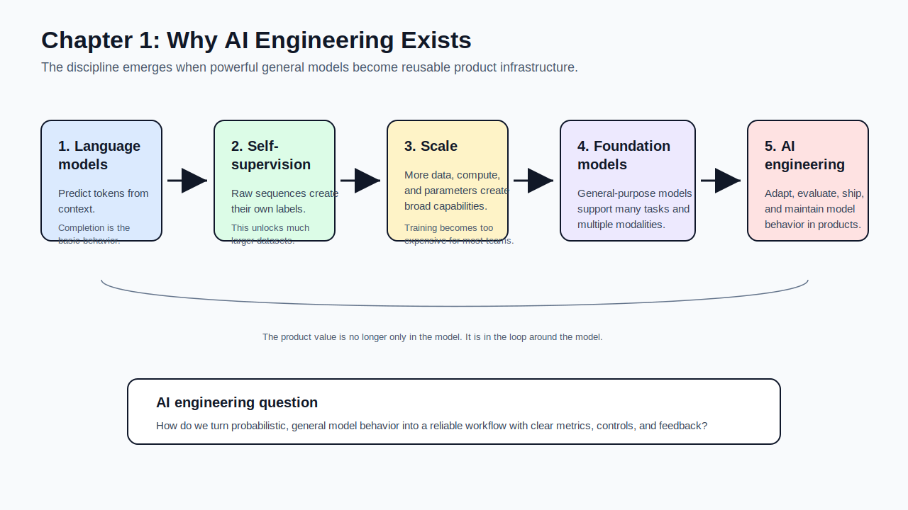
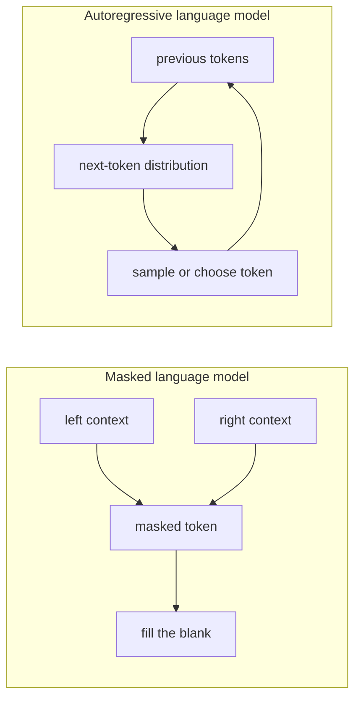
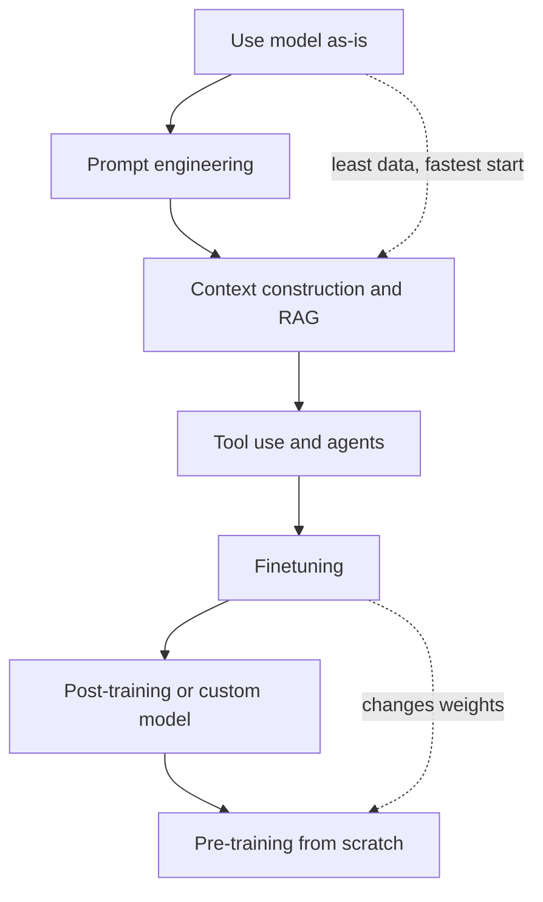
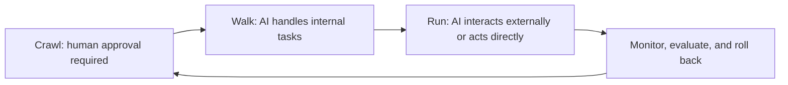
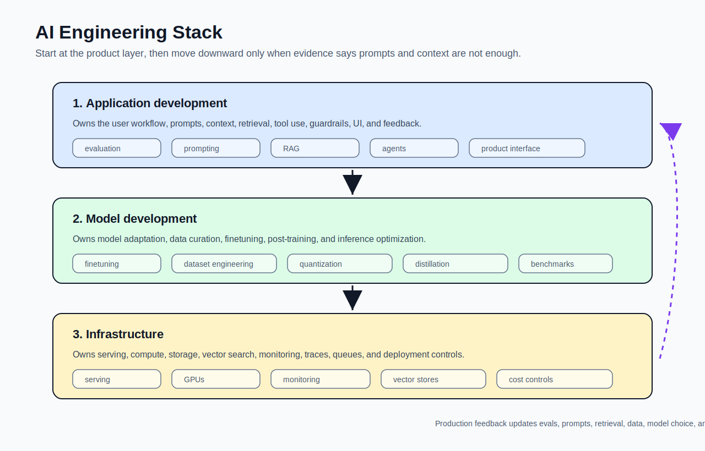
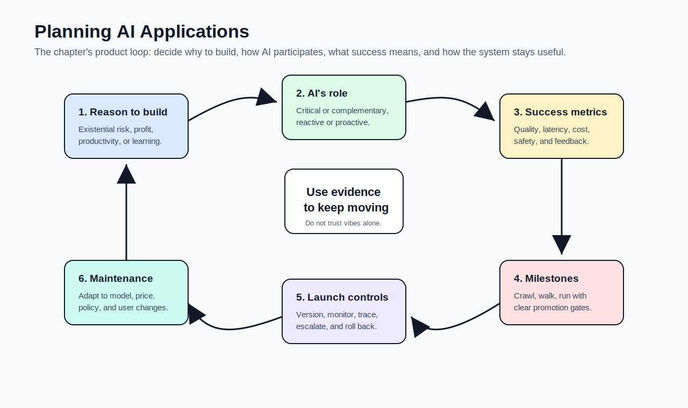
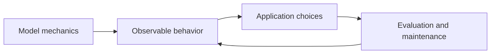

# The Rise of AI Engineering

[toc]

> **TL;DR:** AI engineering exists because powerful foundation models are now available as reusable building blocks. The hard work shifts from training every model from scratch to adapting, evaluating, shipping, and maintaining AI behavior inside real products.

## How to Read This Chapter

Chapter 1 is a **map**, not a deep dive. Read it as a sequence: **language models** made scale practical, **scale** produced foundation models, **foundation models** made AI applications easier to build, and easier building created a new engineering discipline.

The vocabulary is not front-loaded as one giant glossary. Each term is introduced beside the subject that needs it, so the definition has context at the moment you learn it.

> [!NOTE]
> Read the note linearly the first time. On review, use the Vocabulary Map and Copyable Takeaways as your fast path.

## Learning Objectives

This chapter gives you the vocabulary and product frame needed before touching implementation. The important move is to separate **"AI can do something impressive"** from **"this should be a reliable product."**

By the end, you should be able to:

- Explain why self-supervision let language models scale.
- Distinguish language models, large language models, multimodal models, and foundation models.
- Describe why foundation models changed the economics of AI application development.
- Evaluate whether an AI use case is worth building.
- Place prompts, retrieval, finetuning, evaluation, serving, and monitoring in the AI engineering stack.
- Explain how AI engineering overlaps with, but is not identical to, traditional ML engineering.

## Vocabulary Map

Use this as the index, not as the main glossary. The definitions appear inside the relevant sections, following the same visual style as [1 - What is Linear Algebra](../../Mathematics/Linear-Algebra/1-what-is-linear-algebra.md): bold term, plain-language definition, optional fenced `math` block, and `---` separators.

| Where the term appears | Terms introduced there |
| :--- | :--- |
| [1. Why AI Engineering Became a Discipline](#1-why-ai-engineering-became-a-discipline) | AI engineering, foundation model, model as a service, MLOps |
| [2. Language Models Are Completion Machines](#2-language-models-are-completion-machines) | language model, token, tokenization, vocabulary, masked language model, autoregressive language model, completion, generative AI |
| [3. Self-Supervision Made Scaling Practical](#3-self-supervision-made-scaling-practical) | supervised learning, self-supervised learning, unsupervised learning, parameter, LLM |
| [4. Foundation Models Generalize the Pattern](#4-foundation-models-generalize-the-pattern) | modality, multimodal model, LMM, embedding, prompt engineering, RAG, finetuning, pre-training, post-training |
| [5. What Foundation Models Are Good For](#5-what-foundation-models-are-good-for) | open-ended output, close-ended output, agent |
| [6. Planning AI Applications](#6-planning-ai-applications) | human-in-the-loop, usefulness threshold, last mile challenge, TTFT, TPOT, defensibility |
| [9. The AI Engineering Stack](#9-the-ai-engineering-stack) | inference, inference optimization, evaluation, context construction |

## Chapter Map

This diagram compresses the chapter into one linear path. The arrows show the causal story: better scaling created new model types, new model types changed application economics, and new economics changed what engineers build.



## 1. Why AI Engineering Became a Discipline

The chapter starts with **scale** because scale explains both the opportunity and the constraint. Larger models can perform more tasks, but training them requires **large datasets**, **specialized talent**, **expensive compute**, and **operational discipline** that most teams cannot afford.

The product world changed when these expensive models became **reusable services**. Instead of each company training a task-specific model from scratch, teams could call a hosted model, adapt it with prompts or data, and focus on the **application loop around it**.

> [!IMPORTANT]
> AI engineering is not just "using an AI API." It is the engineering work required to make model behavior useful, measurable, reliable, and maintainable inside a product.

### Vocabulary Introduced Here

These terms belong here because this section explains the discipline itself. Learn them before going deeper into model mechanics.

**AI engineering**: The discipline of building applications on top of foundation models. The center of gravity is product behavior: prompts, context, retrieval, tools, evaluation, user interface, cost, latency, safety, and maintenance.

---

**Foundation model**: A general-purpose model that can be adapted to many downstream tasks. In this book, the term covers both large language models and large multimodal models.

---

**Model as a service**: A delivery model where a provider hosts a model and exposes it through an API. This lets application teams use powerful models without owning pre-training or serving infrastructure.

---

**MLOps**: Operational practices for deploying and maintaining ML systems. AI engineering inherits many MLOps concerns, including evaluation, monitoring, versioning, data quality, and feedback loops.

### The Demand-Supply Shift

Two curves moved at the same time. Demand grew because foundation models unlocked many new applications; supply grew because model APIs lowered the entry barrier for builders.

That combination created a new role for engineers. The job is less about inventing a model architecture and more about deciding how a model should be used, constrained, evaluated, integrated, and improved.

| Shift | Before foundation models | With foundation models |
| :--- | :--- | :--- |
| Starting point | Gather data, train a task model, then build product | Build a product loop with an existing model, then deepen data/model investment if needed |
| Scarce skill | Model training expertise | Product, eval, prompting, context, data, serving, safety |
| Main risk | Model never reaches useful accuracy | Demo works, production behavior is brittle |
| Advantage | Proprietary model quality | Workflow, data, distribution, evals, trust, speed |

### Why "AI Engineering" Instead of Only "MLOps"

MLOps emphasizes **deploying and operating ML systems**. AI engineering includes operations, but its center is broader: **adapting foundation models into products**.

This includes **prompt engineering**, **context construction**, **retrieval**, **tool use**, **UI design**, **evaluation**, **cost control**, and **feedback loops**. Many of these existed before, but foundation models made them central to everyday application development.

### Copyable Takeaways

These are short lines you can copy into a study card or summary. They compress the section without replacing the explanation above.

- AI engineering is software engineering around foundation-model behavior.
- The model is only one part of the product; the loop around the model creates most application value.
- Foundation models lowered the barrier to building AI applications, but raised the bar for evaluation and maintenance.

## 2. Language Models Are Completion Machines

A language model learns **statistical structure in sequences of tokens**. The simplest mental model is a **completion machine**: given a prefix, it predicts what continuation is likely.

This is powerful because many tasks can be expressed as **completion**. A translation prompt, a classifier prompt, a summarization prompt, and a code-generation prompt are all different ways of setting up the next tokens the model should produce.

### Vocabulary Introduced Here

These terms belong beside the language-model explanation because they describe the basic unit of model input and output. If you understand this block, the next-token examples later in the note will make sense.

**Language model**: A model that learns statistical patterns in language. In the autoregressive case, it estimates what token is likely to come next given the previous tokens.

```math
P(x_t \mid x_{<t})
```

---

**Token**: A unit of text that a model reads or writes. A token can be a character, a word, a word piece, punctuation, or a special marker such as a beginning-of-sequence or end-of-sequence marker.

---

**Tokenization**: The process of converting raw text into tokens. Tokenization matters because the model does not see "words" in the human sense; it sees token IDs from its vocabulary.

---

**Vocabulary**: The fixed set of tokens the model can process. A model can generate many possible strings, but every string is assembled from this finite token set.

```math
V = \{t_1, t_2, \ldots, t_n\}
```

---

**Masked language model**: A model trained to predict missing tokens using context on both sides of the blank. BERT is the canonical example, and this style is useful for understanding and classification tasks.

```math
P(x_i \mid x_{\setminus i})
```

---

**Autoregressive language model**: A model trained to predict the next token using only the previous tokens. This is the default mental model for modern text generation.

```math
P(x_t \mid x_1, x_2, \ldots, x_{t-1})
```

---

**Completion**: The act of continuing an input sequence. Translation, classification, summarization, coding, and question answering can often be reframed as completion tasks.

---

**Generative AI**: AI that can produce open-ended outputs such as text, code, images, audio, video, or structured data. The output space is not limited to a small fixed label set.

### Tokens and Vocabularies

Models do not read text the way humans do. They read **token IDs**, and the tokenizer decides how text becomes those IDs.

This is why **prompts**, **context windows**, and **cost** are often measured in tokens instead of words. A single visible word can become one token, several tokens, or occasionally part of a token depending on the tokenizer.

> [!TIP]
> When debugging model behavior, check the token-level view if the wording seems weird. The model may be seeing boundaries that do not match your human word boundaries.

| Concept | What to remember | Why it matters |
| :--- | :--- | :--- |
| Token | The unit the model processes | Determines cost, context length, and output length |
| Vocabulary | The model's allowed token set | Fixed at tokenizer/model design time |
| Tokenization | Text-to-token conversion | Different models can split the same text differently |
| EOS marker | End-of-sequence signal | Helps the model know when to stop generating |

### Masked vs Autoregressive Language Models

Masked and autoregressive models differ by what **context** they are allowed to use. Masked models can look left and right around a blank; autoregressive models can only look backward and predict the next token.

The chapter uses this distinction to explain why **autoregressive models dominate text generation**. They can keep generating one token after another, making them natural for chat, writing, coding, and long-form completions.



### Probabilistic Output Is the Source of Both Power and Pain

A language model does not retrieve a guaranteed truth by default. It produces likely continuations conditioned on the input, model weights, decoding settings, and context.

That probabilistic nature makes the model flexible enough to write, summarize, translate, classify, and code. It also means you need evaluation, grounding, human review, and product guardrails when correctness matters.

> [!WARNING]
> A fluent answer is not the same as a correct answer. Treat model output as a candidate behavior to evaluate, not as a fact just because it reads well.

### Copyable Takeaways

These lines are meant for quick review. They capture the mental model you need before studying self-supervision.

- A language model is a probability model over token sequences.
- Autoregressive generation means "predict one next token, append it, then repeat."
- Completion is powerful because many tasks can be rewritten as "continue this input correctly."

## 3. Self-Supervision Made Scaling Practical

The chapter's key scaling idea is **self-supervision**. Manually labeling data is slow and expensive, but language data contains its own prediction targets: **every next token can become a label**.

This is why language modeling scaled so aggressively. The web contains enormous amounts of text, and self-supervision turns **raw sequences into many training examples** without a person labeling each one.

> [!IMPORTANT]
> Self-supervision is the scaling unlock in this chapter. It turns abundant unlabeled text into a training signal.

### Vocabulary Introduced Here

These terms belong beside the scaling explanation because they describe how models learn from data. The key distinction is whether labels come from people, from the data itself, or from no explicit target at all.

**Supervised learning**: Training with examples that have externally provided labels. A fraud model trained on transactions labeled "fraud" or "not fraud" is supervised.

---

**Self-supervised learning**: Training where labels are derived from the input data itself. In language modeling, each next token becomes the label for the context before it.

---

**Unsupervised learning**: Learning structure in data without explicit target labels. This differs from self-supervision because self-supervision still creates prediction targets.

---

**Parameter**: A learned value inside a model. In modern ML conversation, "weights" often refers broadly to all learned parameters.

```math
\theta
```

---

**Large language model (LLM)**: A language model large enough to show broad capabilities across many tasks. "Large" is relative: sizes that were considered large in 2018 later became small by frontier-model standards.

### From One Sentence to Many Training Examples

The **next-token training setup** converts one sequence into many prefix-target pairs. The model learns by repeatedly seeing a context and trying to predict the next token.

The following small Python example mirrors the chapter's idea. It is not a neural-network trainer; it just shows how a single sentence becomes supervised-looking examples without manual labels.

```python
def next_token_examples(tokens):
    examples = []
    sequence = ["BOS", *tokens, "EOS"]

    for index in range(1, len(sequence)):
        context = sequence[:index]
        target = sequence[index]
        examples.append((context, target))

    return examples


sentence = ["I", "love", "street", "food", "."]

for context, target in next_token_examples(sentence):
    print(f"context={context} -> target={target}")
```

The core idea is simple but extremely powerful. A model can learn from huge text corpora because the "label" is already embedded in the sequence.

### Why Bigger Models Need More Data

Larger models have more **capacity**. If you want to use that capacity well, you need enough diverse data for the model to learn richer behavior instead of memorizing or wasting compute.

This is why **scale is a system problem**, not just a model-size problem. **Data**, **compute**, **architecture**, **training stability**, **evaluation**, and **serving** all become coupled.

### Copyable Takeaways

These lines should make the scaling argument easy to recall. They are intentionally short enough to copy.

- Self-supervision turns raw text into training examples by using the next token as the label.
- LLM scale depends on data, compute, parameters, and training stability together.
- Bigger models need more data because unused capacity is wasted compute.

## 4. Foundation Models Generalize the Pattern

Language models started with text, but useful AI systems need more than text. Humans operate with **vision**, **speech**, **documents**, **screens**, **video**, **code**, and **structured data**, so models expanded toward multimodal inputs and outputs.

Foundation models also changed the default from **task-specific modeling** to **general-purpose modeling**. Instead of training one model for sentiment analysis and another for translation, a strong foundation model can often do both with the right instructions and context.

### Vocabulary Introduced Here

These terms belong in the foundation-model section because they explain the jump from text-only completion to reusable, general-purpose systems. They also introduce the basic adaptation tools used throughout the rest of the book.

**Modality**: A kind of data, such as text, image, audio, video, 3D structure, or code. A text-only model uses one modality; a multimodal model uses more than one.

---

**Multimodal model**: A model that can process multiple modalities. A vision-language model that accepts text and images is multimodal.

---

**Large multimodal model (LMM)**: A large generative model that works across multiple modalities. It extends the LLM idea beyond text.

---

**Embedding**: A vector representation that tries to preserve useful meaning from the original data. Embeddings let systems compare text, images, documents, and queries by similarity.

```math
\mathbf{e} \in \mathbb{R}^d
```

---

**Prompt engineering**: Adapting model behavior through instructions, examples, formatting constraints, and task framing without changing model weights.

---

**Retrieval-augmented generation (RAG)**: A pattern where the application retrieves relevant external information and passes it to the model as context. RAG is useful when the model needs current, private, or domain-specific facts.

---

**Finetuning**: Continuing training from an existing model to adapt it to a task, format, domain, or behavior. Finetuning changes model weights.

---

**Pre-training**: Training a model from scratch, usually from randomly initialized weights. For large foundation models, this is the most expensive training phase.

---

**Post-training**: Training after pre-training to improve usefulness, instruction following, safety, or alignment. Model providers often use this term for the training they do before releasing a model.

### From LLMs to Multimodal Foundation Models

A multimodal model can condition generation on more than one modality. For example, a vision-language model may use both image tokens and text tokens to produce the next text token.

This matters for applications because many real workflows mix modalities. A support ticket can contain text, screenshots, logs, PDFs, and images; a useful AI application may need to reason across all of them.

### Embeddings as a Bridge

Embeddings are **vector representations** that let systems compare meaning. They are not the same as generation, but they are central to **search**, **retrieval**, **deduplication**, **clustering**, **recommendation**, and **multimodal matching**.

For example, an image-text model can place an image and a caption in a shared vector space. That enables zero-shot image classification or text-to-image search without training a new classifier for every category.

### Model Adaptation Ladder

Foundation models are useful out of the box, but production systems usually **adapt** them. The adaptation method should match the problem, data, cost, latency, and quality bar.

This ladder moves from **easiest** to **most invasive**. Start high in the ladder unless evaluation proves you need deeper model changes.



> [!TIP]
> A good default is prompt first, retrieval second, finetune only when evaluation shows prompts and context are not enough.

### Copyable Takeaways

These lines connect model capability to application strategy. They are the bridge into planning.

- Foundation models are reusable bases; applications adapt them for specific workflows.
- RAG changes the context; finetuning changes the weights.
- Start with the least invasive adaptation that passes evaluation.

## 5. What Foundation Models Are Good For

Chapter 1 surveys use cases to train your product intuition. Foundation models are strongest where work involves language, code, images, summarization, extraction, transformation, personalization, or tool-mediated workflows.

The practical lesson is not that every task should become an AI product. The lesson is to look for tasks where model uncertainty is manageable, value is measurable, and the workflow can tolerate human review or staged automation.

> [!NOTE]
> A good AI use case is usually not "anything the model can do." It is a workflow where uncertainty can be managed and the value is worth the operational cost.

### Vocabulary Introduced Here

These terms belong beside use cases because they decide whether an AI feature is easy or hard to evaluate. The more open the output and the more direct the action, the higher the risk.

**Open-ended output**: An output whose valid answer space is large or unbounded. A support response, essay, image, or code patch is open-ended.

---

**Close-ended output**: An output chosen from a fixed set of options. Spam detection with two labels is close-ended and easier to evaluate than a free-form chatbot response.

---

**Agent**: An AI system that can plan, call tools, and take actions beyond generating text. Agents are powerful because they can connect model reasoning to external systems.

### Common Use Case Families

The use-case categories below are chapter-level patterns. Individual products often combine several of them.

| Use case family | Why foundation models fit | Product risk to watch |
| :--- | :--- | :--- |
| Coding | Code is structured language with fast feedback loops | Hidden bugs, security issues, false confidence |
| Image and video production | Generative models are strong at variation and ideation | IP, brand consistency, safety, editability |
| Writing | Drafting and rewriting map naturally to completion | Generic output, factual errors, content spam |
| Education | Tutoring can be personalized and interactive | Over-helping, cheating, incorrect explanations |
| Conversational bots | Natural-language interfaces reduce friction | Hallucination, privacy, user overtrust |
| Information aggregation | Summaries and question answering reduce overload | Missing context, unsupported claims |
| Data organization | Models can extract structure from messy inputs | Extraction errors and schema drift |
| Workflow automation | Models can plan, call tools, and reduce repetitive work | Bad actions, permissions, irreversibility |

### A Good First AI Use Case

A good first use case is usually **bounded**, **measurable**, and **recoverable**. Internal-facing use cases often make better early deployments than external-facing ones because the organization can learn while limiting privacy, compliance, and reputation risk.

The strongest first candidates often share these properties:

- The task is frequent enough that improvement matters.
- The current workflow is slow, repetitive, or expensive.
- A human can review output before it causes harm.
- The quality bar can be expressed with eval cases.
- The system can collect feedback for iteration.
- Failure is annoying or costly, but not catastrophic.

> [!CAUTION]
> Do not confuse "the model can do this once" with "the product can do this reliably." A useful demo is evidence to investigate, not proof of production readiness.

### Copyable Takeaways

These lines are useful when screening a new idea. Copy them before deciding whether to prototype.

- Good early AI use cases are frequent, bounded, measurable, and recoverable.
- Internal-facing workflows are often safer first deployments than customer-facing automation.
- The more open-ended the output, the more serious evaluation becomes.

## 6. Planning AI Applications

The planning section is the chapter's **product-management core**. It asks you to slow down before building and decide why the application should exist, what role AI plays, and how success will be measured.

The main question is not **"Can I build a demo?"** It is **"Can this system produce enough business or user value at an acceptable level of quality, cost, latency, risk, and maintenance burden?"**

> [!IMPORTANT]
> Planning is part of engineering here. A model choice is not enough until the product has a reason to exist, a quality bar, and a safe automation path.

### Vocabulary Introduced Here

These terms belong in planning because they determine launch readiness. They force you to define how much automation is safe, how fast the system must feel, and why the product can survive competition.

**Human-in-the-loop**: A design where humans review, approve, correct, or intervene in AI decisions. This is often the right bridge between a useful demo and a trustworthy automated product.

---

**Usefulness threshold**: The minimum quality, latency, cost, safety, and reliability needed before an AI feature is useful in its real context. A demo can be impressive while still falling below this threshold.

---

**Last mile challenge**: The gap between a promising demo and a production product. The first useful prototype may arrive quickly, while the remaining reliability, edge-case, evaluation, and integration work can take months.

---

**TTFT**: Time to first token. This measures how long the user waits before the model starts responding.

---

**TPOT**: Time per output token. This measures generation speed after the first token appears.

---

**Defensibility**: The reason a product can keep its advantage after competitors or foundation-model providers copy the obvious feature. In AI products, defensibility usually comes from technology, data, distribution, workflow integration, or trust.

### Start With the Reason to Build

The chapter frames AI investment as a response to **risk** and **opportunity**. The stronger the business risk, the more likely you need to build or deeply own the AI capability.

| Reason | Meaning | Build posture |
| :--- | :--- | :--- |
| Existential threat | Competitors with AI could make the business obsolete | Strong case for in-house capability |
| Productivity or profit | AI can reduce cost, increase quality, or grow revenue | Compare build versus buy |
| Learning and preparedness | The fit is unclear, but the technology may matter | Run focused experiments |

### Define AI's Role in the Product

AI can be **critical or complementary**, **reactive or proactive**, **dynamic or static**. Each choice changes the quality bar.

If the feature is critical, proactive, or user-specific over time, the system needs stronger evaluation and monitoring. Users forgive optional suggestions more than broken core behavior.

| Product question | Lower-risk version | Higher-risk version |
| :--- | :--- | :--- |
| Is AI critical? | AI improves an existing workflow | The product fails without AI |
| When does AI act? | User asks for help | AI interrupts proactively |
| Does behavior change? | Shared model updated periodically | Personalized behavior changes continually |
| What do humans do? | Human reviews suggestions | AI acts directly on users or systems |

### Crawl, Walk, Run

Human involvement can change as system quality improves. Early systems should often require **review**, then graduate to **internal automation**, then external automation only after evidence supports it.

This is a useful framing for support bots, sales assistants, coding agents, medical admin tools, financial analysis tools, and other workflows where false confidence can harm users.



### Set Success Metrics Before Shipping

Success must connect **product metrics** to **model metrics**. Otherwise, you can improve an offline score while making the product worse.

For a customer-support bot, examples include automation rate, resolution quality, customer satisfaction, escalation rate, latency, cost per request, safety incidents, and human-agent acceptance rate.

| Metric group | Example question |
| :--- | :--- |
| Business value | How many tickets can be resolved or assisted? |
| Quality | Are answers correct, grounded, and helpful? |
| Latency | How long until the user sees useful output? |
| Cost | What is the cost per request or per resolved case? |
| Safety | What can go wrong, and how do we stop it? |
| Feedback | How do users and reviewers correct the system? |

### Copyable Takeaways

These lines are meant to be copied before starting an AI feature. They keep the plan honest.

- Build only when the use case has a clear risk, opportunity, or learning goal.
- Define the usefulness threshold before deciding a demo is ready.
- Crawl with human review, walk with internal automation, run only after evidence supports external automation.

## 7. Real-World Example: Customer Support Copilot

This example turns the planning section into something concrete. Imagine a company wants to use AI to help support agents answer refund, password, and shipping questions.

The point is not the exact numbers. The point is to encode the **usefulness threshold** before deciding whether the product is ready for more automation.

```python
from statistics import mean


tickets = [
    {"kind": "refund", "accepted": True, "correct": True, "latency_ms": 850, "cost_usd": 0.04},
    {"kind": "shipping", "accepted": True, "correct": True, "latency_ms": 920, "cost_usd": 0.05},
    {"kind": "password", "accepted": True, "correct": True, "latency_ms": 640, "cost_usd": 0.03},
    {"kind": "billing", "accepted": False, "correct": False, "latency_ms": 1100, "cost_usd": 0.06},
    {"kind": "refund", "accepted": True, "correct": True, "latency_ms": 780, "cost_usd": 0.04},
]


thresholds = {
    "min_acceptance_rate": 0.80,
    "min_correct_rate": 0.95,
    "max_average_latency_ms": 1000,
    "max_average_cost_usd": 0.05,
}


def evaluate_copilot(rows, limits):
    acceptance_rate = mean(ticket["accepted"] for ticket in rows)
    correct_rate = mean(ticket["correct"] for ticket in rows)
    average_latency = mean(ticket["latency_ms"] for ticket in rows)
    average_cost = mean(ticket["cost_usd"] for ticket in rows)

    ready_for_walk = (
        acceptance_rate >= limits["min_acceptance_rate"]
        and correct_rate >= limits["min_correct_rate"]
        and average_latency <= limits["max_average_latency_ms"]
        and average_cost <= limits["max_average_cost_usd"]
    )

    return {
        "acceptance_rate": round(acceptance_rate, 2),
        "correct_rate": round(correct_rate, 2),
        "average_latency_ms": round(average_latency),
        "average_cost_usd": round(average_cost, 3),
        "recommended_stage": "walk" if ready_for_walk else "crawl",
    }


print(evaluate_copilot(tickets, thresholds))
```

This toy evaluator would keep the product in **crawl mode** because correctness misses the threshold. That is the AI engineering instinct: a model can be useful to agents before it is safe to speak directly to customers.

### What to Add Before Production

The production version needs more than a few metrics. It needs an **evaluation set**, **trace logging**, **prompt and retrieval versioning**, **rollback**, **cost monitoring**, **latency budgets**, **privacy review**, **escalation rules**, and **reviewer feedback**.

The support-bot example also shows why AI engineering is not only model choice. The product behavior depends on workflow design, permissions, data access, user interface, and operational controls.

### Copyable Takeaways

These lines connect the example back to the product process. Copy them when designing a small evaluation harness.

- A usefulness threshold should combine quality, latency, cost, safety, and human acceptance.
- If correctness fails the threshold, keep the system in crawl mode.
- Production readiness requires traces, versions, rollback, feedback, and escalation paths.

## 8. Defensibility: Why Your Product Survives

Foundation models lower the cost of building, which also lowers the cost of copying. If your application is only a **thin wrapper around a model call**, a model provider or larger platform can absorb it.

Defensibility usually comes from a combination of **data**, **distribution**, **technology**, **workflow integration**, **trust**, and **speed of iteration**. Usage data is especially valuable when it teaches you where the product fails and what evaluation cases to add.

| Moat | What it means in AI products |
| :--- | :--- |
| Data | Proprietary examples, feedback, traces, labels, and workflow context |
| Distribution | Existing access to users or enterprise workflows |
| Technology | Better retrieval, evaluation, latency, cost, UX, or domain adaptation |
| Trust | Compliance, reliability, auditability, brand, human review |
| Integration | The product sits where work already happens |

> [!NOTE]
> A feature can still become a company if the team owns a neglected workflow deeply enough. The danger is not "feature-sized product"; the danger is having no reason users keep choosing yours.

### Copyable Takeaways

These lines keep the business risk visible. They are useful when comparing build ideas.

- A generic wrapper is easy to copy.
- Defensibility comes from data, distribution, technology, trust, and workflow integration.
- Usage data becomes a moat only if it improves the product and evaluation loop.

## 9. The AI Engineering Stack

Chapter 1 divides the stack into **application development**, **model development**, and **infrastructure**. For most AI engineers, work starts at the top and moves downward only when product evidence demands it.

The diagram below maps the responsibilities. Notice that **evaluation appears across layers** because it is not a one-time gate.



### Vocabulary Introduced Here

These terms belong inside the stack discussion because they describe the engineering responsibilities. They show where AI engineering overlaps with ML engineering, backend systems, and product development.

**Inference**: Computing a model output for a given input. In an autoregressive model, inference usually generates one token after another.

---

**Inference optimization**: Making inference faster, cheaper, or more resource-efficient. This becomes central with large models because latency and cost can dominate product feasibility.

---

**Evaluation**: Measuring whether the AI system behaves well enough for its intended use. Evaluation covers model choice, prompt changes, retrieval quality, safety checks, readiness for launch, and production regression detection.

---

**Context construction**: Choosing and assembling the information a model should see at inference time. This can include retrieved documents, user profile facts, tool results, conversation history, and structured instructions.

### Application Development

Application development is where most foundation-model products differentiate. If many companies can call the same model, the value must come from **how the model is used**.

This layer includes product workflow, prompt design, context construction, retrieval, tool integration, user interface, feedback capture, guardrails, and evaluation.

### Model Development

Model development includes **modeling**, **training**, **finetuning**, **dataset engineering**, and **inference optimization**. Foundation models reduce the need for every application team to train from scratch, but they do not eliminate the value of ML knowledge.

This layer becomes important when prompts and retrieval cannot meet the quality, latency, cost, privacy, or domain-specific requirements.

### Infrastructure

Infrastructure includes **serving**, **compute**, **storage**, **vector databases**, **monitoring**, **tracing**, **queues**, **rate limits**, and **deployment controls**. Some of this is hidden by model APIs, but it reappears when scale, privacy, cost, or reliability become serious.

The infrastructure layer changes less than the application layer. Resource management, serving, monitoring, and feedback loops are still core engineering problems.

### What Stayed the Same From ML Engineering

AI engineering inherits many hard-won lessons from traditional ML engineering. **Business metrics** still need to map to **model metrics**, experiments still need discipline, and production feedback still matters.

You still need versioning, monitoring, data quality checks, latency budgets, cost controls, and evaluation gates. Foundation models change the workflow, not the need for engineering rigor.

### What Changed

The biggest change is **where the leverage sits**. Traditional ML engineering often begins with data collection and model training; AI engineering can begin with a working product loop around a general model.

| Area | Traditional ML engineering | AI engineering with foundation models |
| :--- | :--- | :--- |
| Model source | Often trained by the team | Often provided by a third party or open-weight base model |
| Adaptation | Feature engineering and model training | Prompting, context, RAG, tools, finetuning |
| Outputs | Often close-ended labels or scores | Often open-ended text, code, images, or actions |
| Evaluation | Important | More difficult and more central |
| Latency and cost | Important | Often product-defining |
| Product iteration | Product may come after model work | Product can come before deeper model work |

### Copyable Takeaways

These lines place later chapters in the stack. Copy them when you need the big picture.

- Application development differentiates most foundation-model products.
- Model development matters when adaptation, latency, privacy, or cost require deeper control.
- Infrastructure still owns serving, monitoring, compute, data, and reliability.

## 10. Maintenance After the Demo

The chapter warns that **demos are easy compared with products**. Foundation models can create a strong first impression, but the final quality gains often require disproportionate effort.

Maintenance is also harder because the AI ecosystem changes quickly. **Model prices**, **context lengths**, **quality**, **API conventions**, **inference speed**, **regulation**, and **IP risk** can all change after launch.

> [!WARNING]
> The best model, provider, prompt, or architecture today can become the wrong choice later. Build evaluation and versioning so change is survivable.

### The Planning Loop

AI application planning should be iterative. Each stage produces evidence that can change the next decision.



### What to Version

Versioning is not only for code. AI systems can regress because a **prompt changes**, a **retrieval corpus changes**, a **model provider updates behavior**, or a **user segment shifts**.

For serious systems, version at least these artifacts:

- Model name and version.
- Prompt template.
- System instructions.
- Retrieval query strategy.
- Retrieved corpus snapshot.
- Tool schema.
- Evaluation dataset.
- Safety policy.
- Decoding settings.
- Post-processing logic.

### What to Monitor

Monitoring should tell you whether the product is still **useful**, **safe**, **fast**, and **affordable**. The right metrics depend on the use case, but the categories are stable.

Track quality, latency, cost, user feedback, human override rate, escalation rate, safety incidents, retrieval misses, tool failures, and provider errors. Add trace IDs so a bad output can be connected back to the exact prompt, model, context, and tool calls that produced it.

### Copyable Takeaways

These lines are the maintenance checklist in miniature. Copy them before shipping any AI workflow.

- Version prompts, model choices, retrieval data, tool schemas, eval sets, and decoding settings.
- Monitor quality, latency, cost, feedback, tool failures, safety incidents, and provider errors.
- The last mile from demo to product is mostly reliability, evaluation, integration, and maintenance.

## Mental Model for Chapter 2

Chapter 2 will go deeper into foundation models themselves. Carry this chapter's product frame with you: **model internals matter because they affect adaptation, evaluation, cost, latency, and reliability.**

The simplest bridge is:



If chapter 2 explains why a model behaves a certain way, translate that into an engineering question. Ask how the behavior affects prompting, retrieval, finetuning, inference, UI, and monitoring.

### Copyable Takeaways

These are the lines to carry into chapter 2. They keep model internals tied to engineering decisions.

- Model mechanics matter because they shape observable product behavior.
- Every model behavior should map to an application choice or evaluation question.
- Chapter 2 is about the model layer; chapter 1 explains why the product layer cares.

## Pitfalls

These are the chapter's practical traps. They are common because foundation models make the first prototype feel deceptively complete.

- **Treating a demo as a product** - A demo proves possibility, not reliability.
- **Skipping use-case evaluation** - If the business reason is weak, model quality will not save the product.
- **Ignoring human role design** - Review, escalation, and approval paths are product features.
- **Using AI where deterministic software is enough** - If rules solve the problem cheaply and reliably, use rules.
- **Forgetting latency and cost** - A high-quality answer can still fail if it is too slow or too expensive.
- **Evaluating only the model** - The product includes prompts, retrieval, tools, UI, policies, and user feedback.
- **Assuming provider behavior is stable** - Model APIs, prices, and quality can change.
- **Calling prompt engineering finetuning** - Prompting changes inputs; finetuning changes weights.
- **Building without a moat** - If the only value is a generic model call, the product is fragile.

## Review Questions

Use these questions before moving to chapter 2. If you can answer them clearly, you understand chapter 1 well enough to continue.

1. Why did self-supervision make language models easier to scale than many supervised ML systems?
2. What is the difference between a masked language model and an autoregressive language model?
3. Why does tokenization affect cost, latency, and context length?
4. Why are foundation models more general than older task-specific models?
5. What is the difference between prompt engineering, RAG, and finetuning?
6. Why are open-ended outputs harder to evaluate than close-ended outputs?
7. What makes an AI use case worth building instead of buying?
8. When should a system stay human-in-the-loop?
9. What belongs in the application development layer of the AI engineering stack?
10. Why is the last mile from demo to product often harder than the first prototype?

## Sources

- Chip Huyen, *AI Engineering: Building Applications With Foundation Models*. Chapter 1, "Introduction to Building AI Applications with Foundation Models."
- Claude Shannon, "Prediction and Entropy of Printed English." [Local PDF](./pdfs/prediction-and-entropy-of-printed-englishp.pdf).
- Rishi Bommasani et al., "On the Opportunities and Risks of Foundation Models." [arXiv:2108.07258](https://arxiv.org/abs/2108.07258).
- Jacob Devlin et al., "BERT: Pre-training of Deep Bidirectional Transformers for Language Understanding." [arXiv:1810.04805](https://arxiv.org/abs/1810.04805).
- Alec Radford et al., "Learning Transferable Visual Models From Natural Language Supervision." [arXiv:2103.00020](https://arxiv.org/abs/2103.00020).
- Yizhong Wang et al., "Super-NaturalInstructions: Generalization via Declarative Instructions on 1600+ NLP Tasks." [arXiv:2204.07705](https://arxiv.org/abs/2204.07705).
- Tyna Eloundou et al., "GPTs are GPTs: An Early Look at the Labor Market Impact Potential of Large Language Models." [arXiv:2303.10130](https://arxiv.org/abs/2303.10130).
- Shakked Noy and Whitney Zhang, "Experimental Evidence on the Productivity Effects of Generative Artificial Intelligence." [Science](https://doi.org/10.1126/science.adh2586).
- Dan Hendrycks et al., "Measuring Massive Multitask Language Understanding." [arXiv:2009.03300](https://arxiv.org/abs/2009.03300).
- Alex Krizhevsky, Ilya Sutskever, and Geoffrey Hinton, "ImageNet Classification with Deep Convolutional Neural Networks." [NeurIPS Proceedings](https://papers.neurips.cc/paper/4824-imagenet-classification-with-deep-convolutional-neural-networks).
- Ning Ding et al., "Enhancing Chat Language Models by Scaling High-quality Instructional Conversations." [arXiv:2305.14233](https://arxiv.org/abs/2305.14233).

## Related

- [What Is Linear Algebra](../../Mathematics/Linear-Algebra/1-what-is-linear-algebra.md)
- [Matrices](../../Mathematics/Linear-Algebra/3-matrices.md)
- [Building Production Services in Python](../../Programming-Languages/Python/12-building-production-services-in-python.md)
- [Building Production Services in Go](../../Programming-Languages/Golang/12-building-production-services.md)
