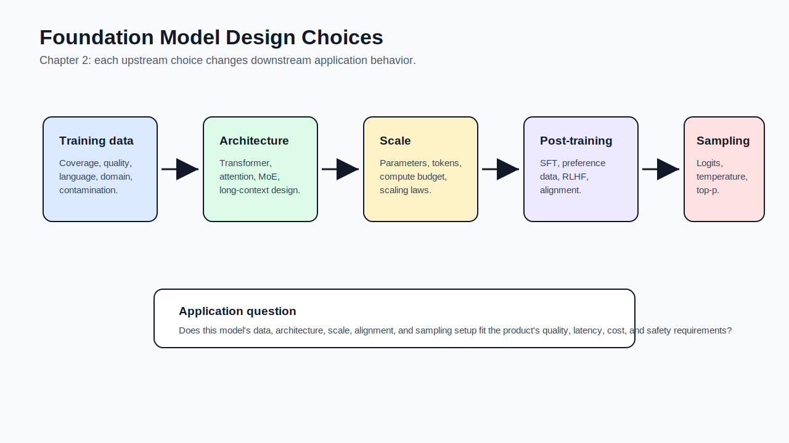

# 02 - Understanding Foundation Models

[toc]

> **TL;DR:** A foundation model is shaped by **training data**, **architecture**, **scale**, **post-training**, and **sampling**. You do not need to pre-train a frontier model to build applications, but you do need to understand these design choices because they determine capability, latency, cost, reliability, and failure modes.

## How to Read This Chapter

This chapter explains the model layer that chapter 1 treated as a reusable service. Read it as an answer to one question: **what choices made this model behave the way it behaves?**

The learning path is: training data sets the model's world, architecture sets its computation pattern, scale sets its capacity and cost, post-training makes it usable, and sampling turns model scores into actual outputs.

> [!NOTE]
> The goal is not to memorize every architecture variant. The goal is to know which model properties affect downstream application decisions.

## Vocabulary Map

Use this as an index. Each vocabulary block appears next to the topic that needs it.

| Where the term appears | Terms introduced there |
| :--- | :--- |
| [1. Training Data](#1-training-data) | training data, data mixture, data contamination, multilingual model, domain-specific model |
| [2. Modeling and Architecture](#2-modeling-and-architecture) | transformer, attention, query, key, value, transformer block, MLP, sparse model, mixture of experts |
| [3. Scale and Compute](#3-scale-and-compute) | parameter count, token count, FLOP, scaling law, compute-optimal model, hyperparameter |
| [4. Post-Training and Alignment](#4-post-training-and-alignment) | post-training, supervised finetuning, preference data, reward model, RLHF, alignment |
| [5. Sampling and Structured Outputs](#5-sampling-and-structured-outputs) | logits, softmax, temperature, top-k, top-p, structured output, hallucination |

## Chapter Map

The diagram below shows the chapter's causal model. Each box affects the next, but **sampling** remains a runtime lever you can often tune without retraining.



## 1. Training Data

Models learn from data, so their behavior is bounded by what the data contains and how the data is weighted. If a language, domain, style, or task is missing from training, the model may not learn it well no matter how large the model is.

The chapter emphasizes that internet-scale data is both powerful and messy. Common Crawl-style sources provide scale, but they also contain misinformation, spam, hate, duplicated content, biased distributions, and possible benchmark contamination.

### Vocabulary Introduced Here

These terms belong here because data is the first design choice in the foundation-model pipeline. Later chapters on dataset engineering go deeper, but chapter 2 explains why model behavior already carries data fingerprints.

**Training data**: The examples a model learns from during training. For language models, this is usually measured in tokens rather than documents.

---

**Data mixture**: The proportion of different data sources or domains inside the training set. A model trained with more code, math, biomedical text, or a specific language is more likely to perform well there.

---

**Data contamination**: Accidental inclusion of evaluation examples in training data. Contamination can make benchmark performance look better than real generalization.

---

**Multilingual model**: A model trained to handle multiple languages. Its quality can still vary widely across languages if training data is skewed toward English or other high-resource languages.

---

**Domain-specific model**: A model optimized for a particular domain such as medicine, law, finance, code, biology, or robotics. Domain focus can improve capability but may reduce generality.

### What Data Teaches the Model

Training data teaches not only facts, but also style, language coverage, cultural assumptions, reasoning traces, coding idioms, toxicity patterns, formatting habits, and refusal behavior. This is why model selection should consider **training-data fit**, not just benchmark rank.

For application work, the key question is: **does this model likely saw enough high-quality examples that resemble my task?** If not, consider retrieval, finetuning, specialized models, or stronger evaluation before launch.

> [!WARNING]
> A model can sound fluent in a low-resource language while still being less accurate, slower, or more unsafe in that language.

### Copyable Takeaways

- Training data is the model's world.
- Data mixture determines which skills are common, rare, or missing.
- Benchmark contamination makes eval scores look stronger than real application performance.

## 2. Modeling and Architecture

Architecture controls how a model processes information. The transformer dominates modern language modeling because it made training highly parallelizable while giving tokens a mechanism to attend to relevant context.

The chapter treats architecture as an application concern because architecture affects **latency**, **memory**, **context length**, **tooling support**, and **serving cost**.

### Vocabulary Introduced Here

These definitions sit here because the transformer section uses them heavily. You do not need to derive every matrix operation yet, but you should know what each part does.

**Transformer**: A neural network architecture built around attention blocks. It is dominant for LLMs because it can learn long-range token relationships and train efficiently in parallel.

---

**Attention**: A mechanism that lets a token decide which other tokens matter for producing its representation or next-token prediction.

```math
\operatorname{Attention}(Q, K, V) = \operatorname{softmax}\left(\frac{QK^\top}{\sqrt{d_k}}\right)V
```

---

**Query**: A vector representing what the current token is looking for.

---

**Key**: A vector representing what a token offers for matching.

---

**Value**: A vector containing the information that gets combined after attention weights are computed.

---

**Transformer block**: A repeated unit that usually contains attention, an MLP, residual connections, and normalization.

---

**MLP module**: A feedforward network inside each transformer block. It helps transform token representations after attention mixes context.

---

**Sparse model**: A model where only part of the parameters are used for a given input. Sparse activation can increase total capacity without using all weights every token.

---

**Mixture of experts (MoE)**: A sparse architecture with multiple expert subnetworks and a router that chooses which experts handle each token.

### Transformer Mental Model

The transformer solves a sequence problem: each token needs to know what other tokens are relevant. Attention computes those relevance weights, then the model combines values from relevant positions.

In an autoregressive model, training can process many positions in parallel, but generation still happens one token at a time. That tension explains why transformer training scaled well and why inference optimization remains difficult.

### Architecture Tradeoffs

Transformers are not the only possible architecture. Alternatives such as state-space models and hybrid architectures try to reduce the attention bottleneck, especially for long sequences.

The practical question is not "which architecture is theoretically best?" It is **which architecture gives the quality, latency, cost, context length, and tooling support your application needs?**

### Copyable Takeaways

- Attention lets tokens look at relevant context.
- Transformers train in parallel but generate autoregressively.
- Architecture choices become product choices when latency, memory, or context length matters.

## 3. Scale and Compute

Model scale is usually discussed through parameters, tokens, and compute. None of these alone tells the full story, but together they give a rough picture of training cost and model capacity.

The chapter's important idea is that bigger is not automatically better. A model can be undertrained, data-starved, poorly aligned, badly sampled, or too expensive for the application even if it has many parameters.

### Vocabulary Introduced Here

These terms belong here because scale is not just "number of parameters." It is the relationship among model size, data, compute, and expected loss.

**Parameter count**: The number of learned values in the model. More parameters usually mean more capacity, but not necessarily better performance.

---

**Token count**: The amount of text or multimodal-token data used in training. Token count helps estimate how much training signal the model received.

---

**FLOP**: Floating-point operation. FLOPs estimate how much computation training or inference requires.

---

**Scaling law**: An empirical relationship that predicts how model performance changes as parameters, data, and compute scale.

---

**Compute-optimal model**: A model whose size and training data are balanced for a given compute budget.

---

**Hyperparameter**: A training or model-design choice set by developers rather than learned from data, such as learning rate, model width, number of layers, or batch size.

### Three Scale Signals

The chapter highlights three scale signals:

- **Parameters**: how much learned capacity the model has.
- **Training tokens**: how much data signal the model saw.
- **Compute**: how much training work was spent.

If you only know parameter count, you can misread the model. A smaller model trained better or on better data can beat a larger model trained poorly.

### Simple Compute Intuition

For dense transformer training, compute grows with both model size and token count. The exact constants depend on architecture and implementation, but the direction is straightforward.

```math
\text{training compute} \propto \text{parameters} \times \text{training tokens}
```

This is why foundation-model development is concentrated among organizations with data, compute, infrastructure, and training expertise.

> [!TIP]
> When comparing models, ask for the missing scale signals: parameter count, active parameters, training tokens, context length, data mixture, and post-training method.

### Copyable Takeaways

- Parameter count alone is a weak proxy for model quality.
- Scale means parameters, data, compute, architecture, and training recipe together.
- Compute-optimal training balances model size and training data under a budget.

## 4. Post-Training and Alignment

Pre-training makes a model capable, but not necessarily helpful, safe, or easy to control. Post-training adapts that base capability toward instruction following, refusal behavior, conversational style, and human preference.

This is why two models with similar pre-training scale can feel very different in applications. Post-training changes how the model responds to users, not only what it knows.

### Vocabulary Introduced Here

These terms belong here because post-training explains why modern chat models behave differently from raw completion models.

**Post-training**: Training after pre-training to make the model more useful, controllable, safe, or aligned with expected behavior.

---

**Supervised finetuning (SFT)**: Training on curated examples of desired inputs and outputs. SFT teaches a model what good responses look like.

---

**Preference data**: Data showing which response is preferred among alternatives. It usually has the form of a prompt plus multiple candidate responses and a preference label.

---

**Reward model**: A model trained to score candidate responses according to preference data.

---

**RLHF**: Reinforcement learning from human feedback. A post-training approach that uses human preference data to optimize response behavior.

---

**Alignment**: The process of making model behavior better match human intent, safety goals, and product requirements.

### Why Post-Training Matters

Raw next-token prediction can complete text, but users expect answers, refusals, tool calls, citations, structured output, and stable tone. Post-training bridges the gap between **completion** and **assistant behavior**.

Post-training can also introduce tradeoffs. A model may become safer but more likely to refuse benign tasks, or more helpful but more likely to over-answer uncertain prompts. This is why alignment must be evaluated in the context of your application.

> [!IMPORTANT]
> Post-training is why a model behaves like an assistant instead of a raw text continuation machine.

### Copyable Takeaways

- Pre-training teaches capability; post-training shapes usability.
- SFT teaches examples of desired behavior; preference learning teaches which outputs are better.
- Alignment should be evaluated against your product's actual risks, not only generic safety claims.

## 5. Sampling and Structured Outputs

Sampling is how a model turns scores over possible next tokens into one chosen token. This runtime choice explains why the same prompt can produce different outputs and why generation settings can affect quality without retraining.

Sampling also matters for structured outputs. If you need JSON, SQL, tool calls, or a strict schema, you may need constrained decoding, validation, retries, or a model/API feature that enforces structure.

### Vocabulary Introduced Here

These terms belong here because sampling is the last step between model internals and visible output.

**Logits**: Raw model scores for candidate next tokens before converting them into probabilities.

---

**Softmax**: A function that converts logits into a probability distribution.

```math
p_i = \frac{e^{z_i}}{\sum_j e^{z_j}}
```

---

**Temperature**: A sampling parameter that makes the distribution sharper or flatter before token selection.

---

**Top-k**: A sampling strategy that restricts selection to the k highest-scoring tokens.

---

**Top-p**: A sampling strategy that keeps the smallest set of tokens whose cumulative probability reaches p. It is also called nucleus sampling.

---

**Structured output**: Model output constrained to a format such as JSON, XML, SQL, a table, or a function-call schema.

---

**Hallucination**: A model output that is unsupported, false, or inconsistent with the intended source of truth.

### Sampling Controls Behavior

Low temperature makes output more deterministic and conservative. Higher temperature increases variation but can make errors more likely. Top-k and top-p reduce the candidate set in different ways.

For production, sampling settings are part of your system version. A prompt that works at one temperature might become unstable at another.

> [!WARNING]
> Hallucination is not just a "bad prompt" problem. It can arise from missing context, weak training signal, post-training behavior, sampling, and lack of verification.

### Real-World Example: Temperature Sweep

This toy example shows how you might compare generation settings. In production, replace the fake outputs with actual model calls and evaluate quality, format, and cost.

```python
settings = [
    {"temperature": 0.0, "top_p": 1.0, "risk": "stable but possibly bland"},
    {"temperature": 0.4, "top_p": 0.9, "risk": "balanced for most assistant tasks"},
    {"temperature": 0.9, "top_p": 0.95, "risk": "creative but harder to verify"},
]

for setting in settings:
    print(
        f"temperature={setting['temperature']} "
        f"top_p={setting['top_p']} -> {setting['risk']}"
    )
```

### Copyable Takeaways

- Sampling turns model scores into visible outputs.
- Temperature, top-k, and top-p are runtime behavior controls.
- Structured outputs need schema enforcement, validation, and evaluation.

## Mental Model for Chapter 3

Chapter 3 moves from model behavior to evaluation methodology. Carry this question forward: **how do we measure whether the output is good enough for the task?**

## Pitfalls

- **Assuming fluent equals trained well** - Fluency can hide weak factuality or poor domain coverage.
- **Comparing only parameter counts** - Data, architecture, post-training, and sampling can dominate.
- **Ignoring multilingual skew** - A model can be strong in English and weak elsewhere.
- **Treating sampling as harmless** - Generation settings can change correctness, stability, and format.
- **Expecting post-training to solve knowledge gaps** - Missing information often needs retrieval or data, not only alignment.

## Review Questions

1. Why does training data strongly shape downstream model behavior?
2. What problem does attention solve inside a transformer?
3. Why is parameter count alone an incomplete model-quality signal?
4. What is the difference between pre-training and post-training?
5. How do temperature, top-k, and top-p affect output?
6. Why can structured outputs still fail even with a strong model?

## Sources

- Chip Huyen, *AI Engineering: Building Applications With Foundation Models*. Chapter 2, "Understanding Foundation Models."
- Ashish Vaswani et al., "Attention Is All You Need." [arXiv:1706.03762](https://arxiv.org/abs/1706.03762).
- Jared Kaplan et al., "Scaling Laws for Neural Language Models." [arXiv:2001.08361](https://arxiv.org/abs/2001.08361).
- Jordan Hoffmann et al., "Training Compute-Optimal Large Language Models." [arXiv:2203.15556](https://arxiv.org/abs/2203.15556).
- Long Ouyang et al., "Training language models to follow instructions with human feedback." [arXiv:2203.02155](https://arxiv.org/abs/2203.02155).
- Ari Holtzman et al., "The Curious Case of Neural Text Degeneration." [arXiv:1904.09751](https://arxiv.org/abs/1904.09751).

## Related

- [The Rise of AI Engineering](./01-the-rise-of-ai-engineering.md)
- [Evaluation Methodology](./03-evaluation-methodology.md)
- [Matrices](../../Mathematics/Linear-Algebra/3-matrices.md)
- [Linear Mappings](../../Mathematics/Linear-Algebra/10-linear-mappings.md)
