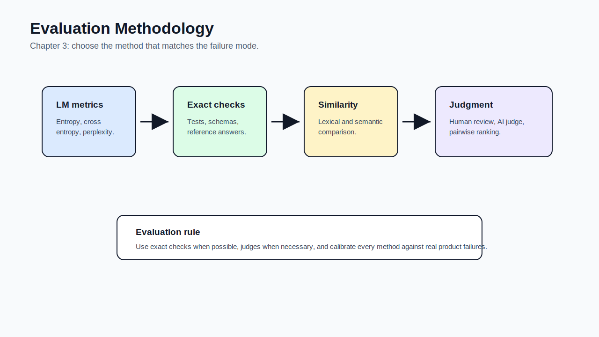

# 03 - Evaluation Methodology

[toc]

> **TL;DR:** Evaluation turns model behavior from vibes into evidence. Chapter 3 explains why foundation-model evaluation is hard, then walks through language-model metrics, exact evaluation, semantic similarity, human evaluation, AI-as-a-judge, and comparative ranking.

## How to Read This Chapter

This chapter is about **measurement methods**. Chapter 4 will show how to assemble those methods into an application-specific evaluation pipeline.

Read every metric with two questions in mind: **what does it actually measure?** and **what failure can it miss?**

> [!IMPORTANT]
> Evaluation is not a single score. It is a risk-reduction system built from task-specific checks.

## Vocabulary Map

| Where the term appears | Terms introduced there |
| :--- | :--- |
| [1. Why Evaluation Is Hard](#1-why-evaluation-is-hard) | open-ended evaluation, black-box model, benchmark saturation, observability |
| [2. Language Modeling Metrics](#2-language-modeling-metrics) | entropy, cross entropy, bit, nat, perplexity, BPC, BPB |
| [3. Exact Evaluation](#3-exact-evaluation) | functional correctness, reference data, exact match, lexical similarity, semantic similarity, embedding |
| [4. AI as a Judge](#4-ai-as-a-judge) | AI judge, rubric, pairwise comparison, position bias, self-enhancement bias |
| [5. Ranking Models](#5-ranking-models) | comparative evaluation, Elo, Bradley-Terry, leaderboard |

## Chapter Map



## 1. Why Evaluation Is Hard

Foundation models are difficult to evaluate because their outputs are **open-ended**, their capabilities span many domains, and many models are **black boxes** exposed only through APIs. A coherent answer can still be wrong, unsafe, biased, incomplete, or unsupported.

Evaluation must therefore start from failure analysis. Before choosing a metric, identify where the system can fail: factuality, format, tool use, retrieval, safety, latency, cost, or user experience.

### Vocabulary Introduced Here

**Open-ended evaluation**: Evaluation where many outputs could be acceptable. This makes it harder to compare against a single ground truth.

---

**Black-box model**: A model whose weights, training data, or internal probabilities are hidden. Many commercial model APIs are black boxes.

---

**Benchmark saturation**: A benchmark becoming less useful because models reach high scores, examples leak into training, or the benchmark no longer separates capabilities.

---

**Observability**: The ability to inspect system behavior deeply enough to explain failures. For AI systems, this includes prompts, context, tool calls, model settings, outputs, evaluator decisions, and user feedback.

### Why Eyeballing Fails

Eyeballing can catch obvious failures, but it does not scale and it does not create a stable development signal. Teams need systematic evaluation to compare prompts, models, retrieval strategies, and post-processing changes.

> [!WARNING]
> If no one can say how the AI system is evaluated, the product is not production-ready.

### Copyable Takeaways

- Evaluation starts by naming failure modes.
- Open-ended outputs need more than ground-truth matching.
- Observability is part of evaluation because you cannot fix failures you cannot inspect.

## 2. Language Modeling Metrics

Language modeling metrics measure how well a model predicts text. They are fundamental for training and finetuning, but they are not always enough to evaluate post-trained assistants.

The important distinction is between **modeling text likelihood** and **solving a user task**. A lower perplexity model is not automatically a better support bot, tutor, coding agent, or RAG system.

### Vocabulary Introduced Here

**Entropy**: The average uncertainty or information content of a distribution.

```math
H(P) = -\sum_x P(x)\log P(x)
```

---

**Cross entropy**: The average number of bits or nats needed when using one distribution to encode samples from another.

```math
H(P, Q) = -\sum_x P(x)\log Q(x)
```

---

**Bit**: A unit of information using logarithm base 2.

---

**Nat**: A unit of information using the natural logarithm.

---

**Perplexity**: A transformed cross-entropy score that can be read as the model's effective uncertainty over next tokens.

```math
\operatorname{PPL} = e^{H}
```

---

**BPC**: Bits per character. A compression-style metric for character-level language modeling.

---

**BPB**: Bits per byte. A byte-level metric useful across different encodings and languages.

### When Perplexity Helps

Perplexity is useful when you have access to token probabilities and you care about language-model fit. It is common during pre-training and finetuning because it is easy to compute automatically.

It becomes weaker when the application depends on instruction following, factuality, safety, tool use, or human preference. A post-trained model can have worse raw perplexity and still be more useful.

> [!NOTE]
> Perplexity is a model-training signal, not a complete product-readiness signal.

### Copyable Takeaways

- Entropy measures uncertainty in data.
- Cross entropy measures how surprised the model is by data.
- Perplexity is useful but can be a poor proxy for post-trained assistant quality.

## 3. Exact Evaluation

Exact evaluation works best when the task has clear right answers. Code execution, math answers, classification labels, JSON schema validity, SQL query execution, and retrieval hits can often be checked automatically.

When exact correctness is unavailable, teams use reference data, lexical similarity, semantic similarity, or human/AI judgment.

### Vocabulary Introduced Here

**Functional correctness**: Evaluation by executing or checking whether the output performs the required function.

---

**Reference data**: Curated examples containing inputs and expected outputs or acceptable answers.

---

**Exact match**: A metric that gives credit only when the generated output exactly matches the expected output after optional normalization.

---

**Lexical similarity**: Similarity based on surface text overlap or edit distance. BLEU and ROUGE are examples.

---

**Semantic similarity**: Similarity based on meaning rather than exact words, often computed with embeddings.

---

**Embedding**: A vector representation used to compare semantic meaning.

### Choosing the Right Exact Check

Use functional correctness whenever the task allows it. For code, run tests. For JSON, parse and validate the schema. For retrieval, compute context precision and recall. For SQL, execute against a test database.

Lexical metrics are weaker for open-ended generation because two good answers can use different wording. Semantic metrics help, but depend on embedding quality and can miss factual or logical errors.

### Real-World Example: Layered Exact Evaluation

This toy evaluator checks format first, then simple content. A production evaluator would add schema validation, reference checks, and human or AI review for borderline cases.

```python
import json


def evaluate_support_json(raw):
    try:
        data = json.loads(raw)
    except json.JSONDecodeError:
        return {"passed": False, "reason": "invalid_json"}

    required = {"answer", "confidence", "needs_human"}
    missing = required - set(data)
    if missing:
        return {"passed": False, "reason": f"missing_fields:{sorted(missing)}"}

    if data["needs_human"] and data["confidence"] > 0.8:
        return {"passed": False, "reason": "escalation_confidence_mismatch"}

    return {"passed": True, "reason": "ok"}


print(evaluate_support_json('{"answer":"Refunds take 5 days","confidence":0.7,"needs_human":false}'))
```

### Copyable Takeaways

- Prefer functional correctness when the task permits it.
- Lexical similarity measures wording, not truth.
- Semantic similarity helps with meaning but still needs task-specific validation.

## 4. AI as a Judge

AI-as-a-judge uses a model to evaluate model outputs. It is attractive because human evaluation is slow and expensive, but it introduces judge-model bias, rubric ambiguity, prompt sensitivity, and possible failure on hard domains.

The technique is useful when treated as one evaluation layer rather than unquestioned truth. It works best with clear rubrics, examples, calibration against human judgments, and spot checks.

### Vocabulary Introduced Here

**AI judge**: A model used to score, classify, compare, or critique outputs from another model or system.

---

**Rubric**: A written scoring guide defining criteria, scale, examples, and decision rules.

---

**Pairwise comparison**: Asking a judge to compare two outputs and choose the better one.

---

**Position bias**: A judge preferring the first or second answer because of position, not quality.

---

**Self-enhancement bias**: A model judging outputs from itself or its family more favorably.

### How to Use an AI Judge Safely

Start with a rubric. Include the input, the model output, any source context, and the exact criteria. Ask the judge for structured scores and reasons, then validate judge behavior against human-reviewed examples.

For high-stakes tasks, do not let an AI judge be the only gate. Use it to triage, prioritize review, detect regressions, or supplement exact checks.

> [!CAUTION]
> An AI judge can hallucinate an evaluation just like a generator can hallucinate an answer. Calibrate it before trusting it.

### Copyable Takeaways

- AI-as-a-judge is scalable but biased.
- A judge prompt needs a rubric, not just "is this good?"
- Calibrate AI judges against human review and exact checks.

## 5. Ranking Models

Comparative ranking asks which model or output is better, often through pairwise comparisons. This is useful when absolute scoring is hard but relative preference is easier.

Leaderboards can help exploration, but they are not substitutes for application-specific evaluation. A model that wins a public arena might still fail your latency, license, privacy, format, or domain requirements.

### Vocabulary Introduced Here

**Comparative evaluation**: Evaluation based on comparing two or more outputs, models, or system variants.

---

**Elo**: A rating system originally designed for chess, sometimes used to estimate model rankings from pairwise wins and losses.

---

**Bradley-Terry model**: A statistical model for estimating relative skill or preference from pairwise comparisons.

---

**Leaderboard**: A public or internal ranking of models on selected metrics or comparisons.

### Copyable Takeaways

- Pairwise comparison can be easier than absolute scoring.
- Leaderboards are discovery tools, not deployment decisions.
- Rank models against your task, constraints, and risk profile.

## Mental Model for Chapter 4

Chapter 4 turns methodology into an evaluation pipeline. Carry this forward: **a metric is useful only if it predicts the product outcome you care about.**

## Pitfalls

- **Using one metric for everything** - Different failures need different checks.
- **Trusting public benchmarks blindly** - Benchmarks can saturate, leak, or miss your use case.
- **Ignoring evaluator quality** - Bad rubrics and biased judges produce false confidence.
- **Optimizing perplexity for assistant behavior** - Likelihood is not the same as usefulness.
- **Evaluating only final answers** - Intermediate retrieval, tool calls, and routing can fail too.

## Review Questions

1. Why are foundation models harder to evaluate than close-ended classifiers?
2. When is perplexity useful, and when is it misleading?
3. What makes functional correctness stronger than lexical similarity?
4. What are the main risks of AI-as-a-judge?
5. Why can leaderboards fail to predict your application's best model?

## Sources

- Chip Huyen, *AI Engineering: Building Applications With Foundation Models*. Chapter 3, "Evaluation Methodology."
- Kishore Papineni et al., "BLEU: a Method for Automatic Evaluation of Machine Translation." [ACL Anthology](https://aclanthology.org/P02-1040/).
- Chin-Yew Lin, "ROUGE: A Package for Automatic Evaluation of Summaries." [ACL Anthology](https://aclanthology.org/W04-1013/).
- Tianyi Zhang et al., "BERTScore: Evaluating Text Generation with BERT." [arXiv:1904.09675](https://arxiv.org/abs/1904.09675).
- Lianmin Zheng et al., "Judging LLM-as-a-Judge with MT-Bench and Chatbot Arena." [arXiv:2306.05685](https://arxiv.org/abs/2306.05685).
- Yang Liu et al., "G-Eval: NLG Evaluation using GPT-4 with Better Human Alignment." [arXiv:2303.16634](https://arxiv.org/abs/2303.16634).

## Related

- [Understanding Foundation Models](./02-understanding-foundation-models.md)
- [Evaluate AI Systems](./04-evaluate-ai-systems.md)
- [The Rise of AI Engineering](./01-the-rise-of-ai-engineering.md)
