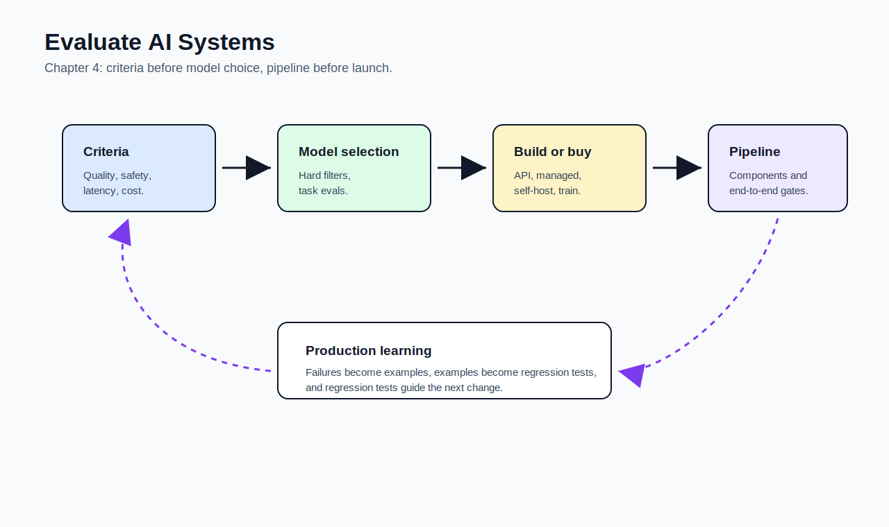
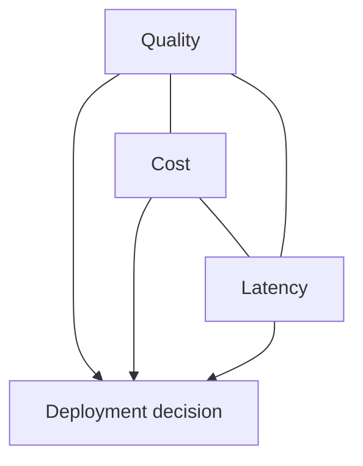
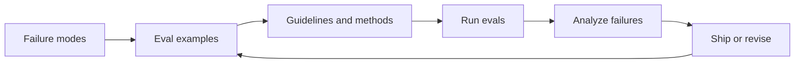

# 04 - Evaluate AI Systems

[toc]

> **TL;DR:** Evaluation must be designed around the **application**, not the model in isolation. Chapter 4 turns chapter 3's methods into an evaluation-driven workflow: define criteria, select models, decide build versus buy, and create a pipeline that catches regressions over time.

## How to Read This Chapter

This chapter is operational. It asks what you should evaluate before building, during iteration, and after deployment.

The core habit is **evaluation-driven development**: define what good means before you optimize prompts, models, retrieval, agents, finetuning, or infrastructure.

> [!IMPORTANT]
> An AI application that is deployed but cannot be evaluated is an unmanaged risk.

## Vocabulary Map

| Where the term appears | Terms introduced there |
| :--- | :--- |
| [1. Evaluation Criteria](#1-evaluation-criteria) | evaluation-driven development, capability, factual consistency, safety, instruction following, roleplaying |
| [2. Cost and Latency](#2-cost-and-latency) | latency, TTFT, TPOT, throughput, cost per request |
| [3. Model Selection](#3-model-selection) | hard attribute, soft attribute, benchmark, leaderboard, model license |
| [4. Build Versus Buy](#4-build-versus-buy) | open source, open weights, model API, self-hosting |
| [5. Evaluation Pipeline](#5-evaluation-pipeline) | component evaluation, guideline, bootstrap, regression, evaluator drift |

## Chapter Map



## 1. Evaluation Criteria

Evaluation begins by deciding what the application must be good at. For one product, the key criterion might be factual consistency; for another, it might be instruction following, toxicity avoidance, cost, latency, or valid JSON.

The chapter's practical point is simple: **criteria come before model choice**. Otherwise you risk choosing a model because it looks impressive rather than because it serves the use case.

### Vocabulary Introduced Here

**Evaluation-driven development**: Defining evaluation criteria and gates before building or changing the AI system.

---

**Capability**: A model or system's ability to perform a task, such as math, coding, summarization, tool use, or domain reasoning.

---

**Factual consistency**: Whether an output is supported by the provided context or source of truth.

---

**Safety**: The system's ability to avoid harmful, toxic, illegal, private, biased, or policy-violating behavior.

---

**Instruction following**: The model's ability to obey task, format, role, and constraint instructions.

---

**Roleplaying**: The ability to maintain a specified persona, character, professional role, or interaction style.

### Evaluation Criteria Examples

Different applications require different evaluation criteria. A RAG support bot needs factual consistency against retrieved documents. A coding assistant needs functional correctness. A medical assistant needs safety, uncertainty handling, and escalation.

| Criterion | Example evaluation |
| :--- | :--- |
| Factual consistency | Is every claim supported by context? |
| Safety | Does the system refuse or redirect unsafe requests? |
| Instruction following | Does output match the requested format and constraints? |
| Roleplaying | Does the assistant maintain the correct persona or domain role? |
| Capability | Can the model solve the domain task, not just talk about it? |

> [!TIP]
> For each criterion, write down what a failure looks like. This makes evaluation concrete instead of aspirational.

### Copyable Takeaways

- Define evaluation criteria before building.
- Criteria should map to business risk and user value.
- The best model is the one that satisfies your criteria under your constraints.

## 2. Cost and Latency

Quality is not enough if the application is too slow or too expensive. A model can produce excellent responses but still fail product requirements because users leave or unit economics break.

Latency and cost must be evaluated with real workloads. Average latency is not enough because users experience tail latency.

### Vocabulary Introduced Here

**Latency**: The time between a user request and the system response.

---

**TTFT**: Time to first token. This affects how quickly a streaming response feels alive.

---

**TPOT**: Time per output token. This measures generation speed after the response begins.

---

**Throughput**: The amount of work the system can complete per unit time, often measured in tokens per second or requests per second.

---

**Cost per request**: The cost of serving one request, including input tokens, output tokens, retrieval, tool calls, reranking, infrastructure, and retries.

### Cost-Latency Quality Triangle

Most model decisions are tradeoffs among quality, cost, and latency. You can often improve one by hurting another.



### Copyable Takeaways

- Evaluate p95 and p99 latency, not only averages.
- Cost includes retries, retrieval, tools, and failed generations.
- A model that is too slow or too expensive is not production-ready.

## 3. Model Selection

Model selection is not a one-time event. As the application changes, candidate models, prompts, tools, and evaluation criteria change with it.

Public benchmarks help narrow the search, but application-specific evaluation should decide. A model can rank high publicly and still lose because of license, latency, cost, context length, format reliability, privacy, or domain mismatch.

### Vocabulary Introduced Here

**Hard attribute**: A model property that is difficult or impossible to change, such as license, context length, supported modalities, deployment form, or maximum latency under load.

---

**Soft attribute**: A model property that may be improved through prompting, RAG, finetuning, decoding settings, or post-processing.

---

**Benchmark**: A dataset or task suite used to compare models on a defined capability.

---

**Leaderboard**: A ranking of models according to selected benchmarks, judge preferences, or user comparisons.

---

**Model license**: The legal terms governing model use, modification, distribution, and commercial deployment.

### Selection Workflow

Start by filtering on hard constraints. If the model cannot be used commercially, cannot run in your environment, or cannot meet latency requirements, it is out.

Then run task-specific evaluations. Compare quality, format adherence, cost, latency, safety, and failure patterns.

> [!WARNING]
> Do not choose a model only because it wins a broad public benchmark. Your application has its own distribution and risk profile.

### Copyable Takeaways

- Filter first on hard constraints.
- Compare surviving models on your own eval set.
- Revisit model selection as models, prices, and product requirements change.

## 4. Build Versus Buy

The build-versus-buy question appears repeatedly in AI engineering. You can call a model API, self-host open-weight models, use managed open-source-model APIs, or train/finetune your own.

The right answer depends on privacy, latency, cost, compliance, control, engineering capacity, and whether the model behavior is core to your differentiation.

### Vocabulary Introduced Here

**Open source model**: A loosely used term for models whose artifacts are publicly released. The term can be ambiguous because many models release weights but not data or training code.

---

**Open weights**: Model weights are available, but the full training recipe, data, or license may still be restricted.

---

**Model API**: A hosted service that runs model inference behind an API.

---

**Self-hosting**: Running the model on infrastructure you control.

### Tradeoff Table

| Option | Strength | Risk |
| :--- | :--- | :--- |
| Commercial model API | Fastest start, strong models, managed serving | Cost, privacy, dependency, limited internals |
| Managed open-weight API | Easier than self-hosting, more model choice | Still provider-dependent |
| Self-host open-weight model | More control, privacy, possible cost control at scale | Requires serving expertise |
| Train or finetune | Maximum customization | Data, compute, ML expertise, maintenance |

### Copyable Takeaways

- Buy speed when the model is not your moat.
- Build or self-host when control, privacy, cost, or differentiation demands it.
- License terms are product requirements, not legal footnotes.

## 5. Evaluation Pipeline

An evaluation pipeline turns criteria into repeatable checks. It should evaluate components separately and the full system end to end.

For example, a RAG system can fail because retrieval missed the right document, reranking ordered it poorly, the prompt ignored it, the model hallucinated anyway, or post-processing broke the format. A single final-answer score hides these failure locations.

### Vocabulary Introduced Here

**Component evaluation**: Evaluating each subsystem, such as retrieval, routing, tool use, generation, post-processing, and safety filters.

---

**Guideline**: A written evaluation instruction used by human or AI evaluators to score outputs consistently.

---

**Bootstrap**: A resampling method for estimating uncertainty around evaluation results.

---

**Regression**: A change that makes the system worse on previously passing behavior.

---

**Evaluator drift**: A change in evaluator behavior over time, especially when AI judges, prompts, or rubrics change.

### Pipeline Shape

Start with a small set of high-quality examples, then expand as you discover failures. Each production incident, user complaint, or surprising output should become an evaluation case when possible.



### Real-World Example: Eval Gate

This toy gate combines quality, latency, and cost. A real gate would include more criteria and confidence intervals.

```python
eval_result = {
    "factual_consistency": 0.94,
    "valid_json_rate": 0.99,
    "p95_latency_ms": 1800,
    "cost_per_request_usd": 0.04,
}

gate = (
    eval_result["factual_consistency"] >= 0.92
    and eval_result["valid_json_rate"] >= 0.98
    and eval_result["p95_latency_ms"] <= 2000
    and eval_result["cost_per_request_usd"] <= 0.05
)

print("ship" if gate else "do not ship")
```

### Copyable Takeaways

- Evaluate components and full workflows.
- Turn failures into regression tests.
- Version evaluation data, judge prompts, rubrics, and thresholds.

## Mental Model for Chapter 5

Chapter 5 starts optimizing the instruction side of the system. Carry forward the evaluation habit: **every prompt improvement needs a way to prove it improved the product.**

## Pitfalls

- **Building before defining success** - You can ship something no one can evaluate.
- **Using only broad benchmarks** - They rarely match your workload exactly.
- **Ignoring license and deployment constraints** - A high-quality model may be unusable.
- **Evaluating only end-to-end** - You lose visibility into where failures happen.
- **Forgetting evaluator drift** - AI judges and rubrics must be versioned too.

## Review Questions

1. What does evaluation-driven development mean for AI systems?
2. How do hard and soft model attributes differ?
3. Why is factual consistency important for RAG?
4. What factors decide build versus buy?
5. Why should an evaluation pipeline test components separately?

## Sources

- Chip Huyen, *AI Engineering: Building Applications With Foundation Models*. Chapter 4, "Evaluate AI Systems."
- Dan Hendrycks et al., "Measuring Massive Multitask Language Understanding." [arXiv:2009.03300](https://arxiv.org/abs/2009.03300).
- Percy Liang et al., "Holistic Evaluation of Language Models." [arXiv:2211.09110](https://arxiv.org/abs/2211.09110).
- Mark Chen et al., "Evaluating Large Language Models Trained on Code." [arXiv:2107.03374](https://arxiv.org/abs/2107.03374).
- Jeffrey Zhou et al., "Instruction-Following Evaluation for Large Language Models." [arXiv:2311.07911](https://arxiv.org/abs/2311.07911).

## Related

- [Evaluation Methodology](./03-evaluation-methodology.md)
- [Prompt Engineering](./05-prompt-engineering.md)
- [RAG and Agents](./06-rag-and-agents.md)
