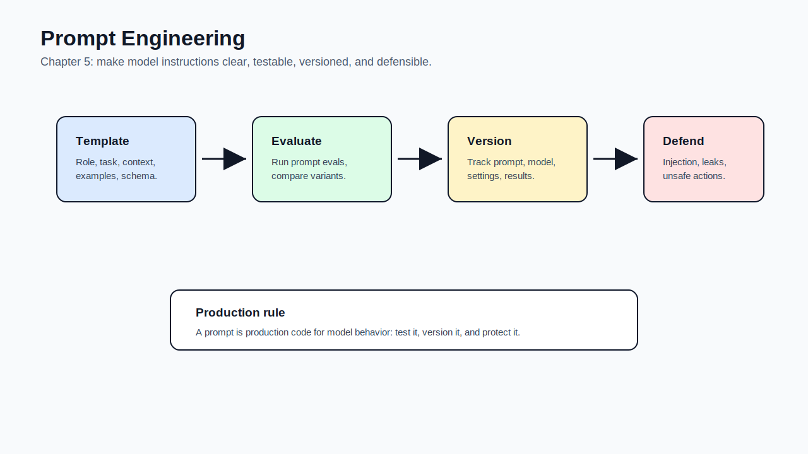

# 05 - Prompt Engineering

[toc]

> **TL;DR:** Prompt engineering is **communication design for models**. It adapts behavior without changing weights, but production prompting still needs experiments, versioning, evaluation, decomposition, and defenses against prompt attacks.

## How to Read This Chapter

This chapter teaches the cheapest adaptation layer. Before you reach for RAG or finetuning, make sure the model has clear instructions, relevant examples, well-scoped context, and a measurable output contract.

The chapter has two halves: **getting useful behavior** and **defending against hostile behavior**.

> [!IMPORTANT]
> Prompt engineering is useful, but it cannot be the only thing you know. Production AI still needs evaluation, data work, security, and systems engineering.

## Vocabulary Map

| Where the term appears | Terms introduced there |
| :--- | :--- |
| [1. Prompting Fundamentals](#1-prompting-fundamentals) | prompt, task description, few-shot, zero-shot, in-context learning, system prompt, user prompt, prompt template |
| [2. Prompting Best Practices](#2-prompting-best-practices) | persona, delimiter, structured output, prompt decomposition, chain-of-thought, self-critique |
| [3. Prompt Tools and Versioning](#3-prompt-tools-and-versioning) | prompt optimization, prompt registry, prompt version, prompt eval |
| [4. Defensive Prompt Engineering](#4-defensive-prompt-engineering) | prompt extraction, prompt injection, jailbreaking, data exfiltration, guardrail |

## Chapter Map



## 1. Prompting Fundamentals

A prompt is the model input that tells the model what to do. It can include the task, examples, constraints, role, format, retrieved context, tool descriptions, and the user's actual request.

Prompting works only if the model has the underlying capability and instruction-following behavior. A prompt can elicit behavior, but it cannot reliably create knowledge or skill the model lacks.

### Vocabulary Introduced Here

**Prompt**: The full input given to a model for a task. It can include system instructions, user input, examples, context, and output requirements.

---

**Task description**: The part of the prompt that says what the model should do and how success should look.

---

**Zero-shot prompting**: Asking the model to perform a task without examples.

---

**Few-shot prompting**: Providing examples of the desired input-output pattern before the actual task.

---

**In-context learning**: The model's ability to adapt behavior from examples or instructions inside the prompt without changing weights.

---

**System prompt**: Higher-priority instructions used by many model APIs to define assistant behavior, role, constraints, or policy.

---

**User prompt**: The user's task request or message.

---

**Prompt template**: A reusable prompt structure with variables for task-specific data.

### Prompt Anatomy

Strong prompts usually separate instructions, examples, context, and task input. This makes them easier to read, test, and version.

| Prompt part | Purpose |
| :--- | :--- |
| Role or persona | Sets perspective and tone |
| Task | Defines the work |
| Context | Gives facts the model should use |
| Examples | Removes ambiguity |
| Output format | Makes responses machine-checkable |
| Constraints | Defines what not to do |

> [!TIP]
> Put stable behavior in a template and variable user data in explicit slots. This makes prompt changes testable.

### Copyable Takeaways

- A prompt is the model's task interface.
- Few-shot examples teach format and judgment through context.
- System and user prompts should be separated and versioned.

## 2. Prompting Best Practices

Good prompting is mostly about reducing ambiguity. Tell the model what role to take, what information to use, what output format to produce, and what constraints matter.

For complex tasks, split the job into smaller subtasks. This improves monitoring, debugging, parallelization, and evaluation.

### Vocabulary Introduced Here

**Persona**: A role or perspective assigned to the model, such as "support agent" or "security reviewer."

---

**Delimiter**: A visible boundary around user input or context, such as triple backticks or XML-like tags. Delimiters reduce confusion between instructions and data.

---

**Structured output**: Output constrained to a machine-parseable shape such as JSON, YAML, XML, or a function call.

---

**Prompt decomposition**: Breaking one complex prompt into smaller prompts or steps.

---

**Chain-of-thought**: A prompting pattern that encourages intermediate reasoning. In production, prefer asking for concise rationale or hidden reasoning features when available instead of exposing long reasoning to users.

---

**Self-critique**: Asking a model to review, check, or revise its own answer.

### Best-Practice Checklist

Use this checklist before treating prompt quality as "done."

- Write **clear and explicit instructions**.
- Provide **examples** for ambiguous tasks.
- Use **delimiters** around user-provided text.
- Specify **output schema** and validate it.
- Provide only **relevant context**.
- Break complex tasks into **subtasks**.
- Evaluate prompts with **the same eval set** across versions.

> [!WARNING]
> More words do not automatically make a better prompt. Long prompts can hide contradictions, increase cost, and make failures harder to debug.

### Real-World Example: Prompt Template

This example keeps instructions, context, and user data separate. The code does not call a model; it shows a prompt shape that is easy to version and evaluate.

```python
PROMPT_TEMPLATE = """\
You are a customer-support assistant.
Answer only from the provided policy context.
If the context does not answer the question, set needs_human to true.

Policy context:
[POLICY_CONTEXT]
{policy_context}
[/POLICY_CONTEXT]

Customer question:
[CUSTOMER_QUESTION]
{customer_question}
[/CUSTOMER_QUESTION]

Return JSON with keys: answer, needs_human, confidence.
"""


prompt = PROMPT_TEMPLATE.format(
    policy_context="Refunds are available within 30 days for unopened items.",
    customer_question="Can I refund a jacket I opened after 20 days?",
)

print(prompt)
```

### Copyable Takeaways

- A good prompt removes ambiguity.
- Decompose complex tasks when one prompt becomes hard to test.
- Structured outputs need both prompt instructions and parser validation.

## 3. Prompt Tools and Versioning

Prompt tools can help generate, test, compare, and organize prompts. They can also hide expensive model calls, produce fragile prompts, or add dependencies you do not need.

The chapter's practical advice is to keep prompt infrastructure simple until the prompt surface area justifies more tooling.

### Vocabulary Introduced Here

**Prompt optimization**: Automatically or manually searching for prompt variants that improve evaluation results.

---

**Prompt registry**: A storage system for prompt templates, versions, metadata, owners, and evaluation results.

---

**Prompt version**: A specific prompt template state tied to a model, eval result, and deployment.

---

**Prompt eval**: An evaluation suite used to compare prompt behavior across versions.

### Why Version Prompts

Prompt changes can break behavior just like code changes. Versioning lets you answer: what prompt produced this output, what changed, who changed it, and whether it passed the eval gate.

For production prompts, track:

- Template text.
- Model and decoding settings.
- Examples included.
- Context sources.
- Output schema.
- Eval set and results.
- Deployment date and owner.

### Copyable Takeaways

- Prompts are production artifacts.
- Prompt versions should be tied to eval results.
- Start simple; add tooling when prompt complexity requires it.

## 4. Defensive Prompt Engineering

Once users can send text to your model, they can also try to manipulate it. Prompt attacks attempt to reveal hidden instructions, bypass policy, extract data, or trigger unsafe tool use.

Defensive prompting helps, but it is not sufficient by itself. Security-sensitive applications need permissions, isolation, validation, logging, rate limits, and tool-use controls.

### Vocabulary Introduced Here

**Prompt extraction**: Attempts to reveal hidden system prompts, policies, examples, or proprietary instructions.

---

**Prompt injection**: User or retrieved text that tries to override the developer's instructions.

---

**Jailbreaking**: Attempts to bypass safety behavior or policy constraints.

---

**Data exfiltration**: Leaking private data, secrets, or confidential context through model output or tool calls.

---

**Guardrail**: A control that prevents, detects, filters, or mitigates unsafe input, unsafe output, or unsafe actions.

### Defense Layers

Treat prompts as one layer in a larger defense. Do not put secrets in prompts. Do not let the model decide permissions. Validate tool arguments. Keep private context scoped to the request.

> [!CAUTION]
> Prompt text is not a security boundary. If the model can see a secret, assume a determined user may be able to make it leak.

### Copyable Takeaways

- Prompt injection is untrusted instruction entering the model context.
- Never rely on hidden prompts to protect secrets.
- Defend with permissions, validation, scoped context, logging, and guardrails.

## Mental Model for Chapter 6

Prompting tells the model **how** to behave. Chapter 6 focuses on giving the model **the information and tools** it needs to behave correctly.

## Pitfalls

- **Prompting around missing facts** - Use RAG or tools when the model lacks information.
- **No eval set** - You cannot know whether a prompt change helped.
- **One giant prompt** - Decompose complex workflows.
- **Trusting system prompts as security** - They are instructions, not access control.
- **Unversioned prompt changes** - They create unreproducible regressions.

## Review Questions

1. What parts can a prompt contain?
2. When should you use few-shot examples?
3. Why does prompt decomposition improve debugging?
4. What should be versioned with a prompt?
5. Why is prompt injection a security problem?

## Sources

- Chip Huyen, *AI Engineering: Building Applications With Foundation Models*. Chapter 5, "Prompt Engineering."
- Jason Wei et al., "Chain-of-Thought Prompting Elicits Reasoning in Large Language Models." [arXiv:2201.11903](https://arxiv.org/abs/2201.11903).
- Takeshi Kojima et al., "Large Language Models are Zero-Shot Reasoners." [arXiv:2205.11916](https://arxiv.org/abs/2205.11916).
- Stephen Casper et al., "Open Problems and Fundamental Limitations of Reinforcement Learning from Human Feedback." [arXiv:2307.15217](https://arxiv.org/abs/2307.15217).
- OWASP, "Top 10 for Large Language Model Applications." [OWASP](https://owasp.org/www-project-top-10-for-large-language-model-applications/).

## Related

- [Evaluate AI Systems](./04-evaluate-ai-systems.md)
- [RAG and Agents](./06-rag-and-agents.md)
- [Finetuning](./07-finetuning.md)
