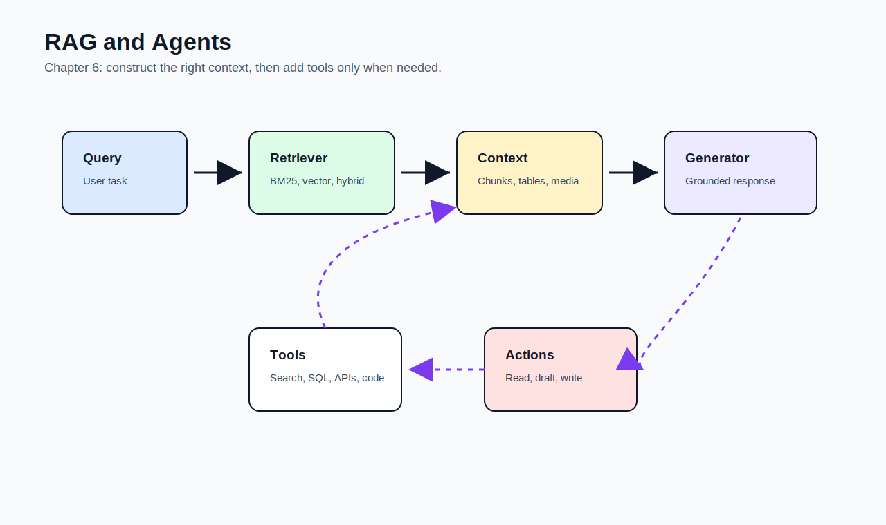
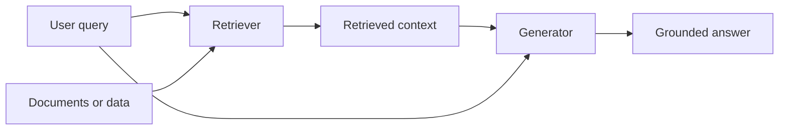

# 06 - RAG and Agents

[toc]

> **TL;DR:** RAG and agents solve the context problem. **RAG** retrieves relevant information for a query; **agents** use tools and actions to gather information, reason through steps, and interact with external systems.

## How to Read This Chapter

Prompting tells the model what to do. This chapter asks whether the model has the **information** and **tools** needed to do it.

Read RAG as controlled context construction and agents as context construction plus tool-mediated action.

> [!NOTE]
> Context construction for foundation models plays a role similar to feature engineering for classical ML.

## Vocabulary Map

| Where the term appears | Terms introduced there |
| :--- | :--- |
| [1. RAG Basics](#1-rag-basics) | RAG, external memory, retriever, generator, context construction, grounding |
| [2. Retrieval Algorithms](#2-retrieval-algorithms) | retrieval, search, term-based retrieval, TF-IDF, BM25, embedding-based retrieval, vector database, ANN, HNSW |
| [3. RAG Quality](#3-rag-quality) | context precision, context recall, reranking, query rewriting, chunking, contextual retrieval |
| [4. Multimodal and Tabular RAG](#4-multimodal-and-tabular-rag) | multimodal RAG, text-to-SQL, schema linking |
| [5. Agents](#5-agents) | agent, environment, tool, planner, tool call, write action |

## Chapter Map



## 1. RAG Basics

RAG retrieves relevant information from an external source and passes it to the model as context. It is useful when the model needs private, current, long-tail, or domain-specific information.

RAG is not only a workaround for limited context length. Even with long context windows, retrieval helps choose **which information should be trusted and shown** for a specific query.

### Vocabulary Introduced Here

**RAG**: Retrieval-augmented generation. A pattern where the system retrieves relevant external context before asking the model to generate.

---

**External memory**: Information outside the model weights, such as documents, databases, chat history, APIs, or the internet.

---

**Retriever**: The component that selects relevant context for a query.

---

**Generator**: The model that uses the retrieved context to produce an answer.

---

**Context construction**: Selecting and formatting the information the model sees at inference time.

---

**Grounding**: Tying the model's response to a trusted source of information.

### Basic RAG Flow

The simplest RAG system embeds or indexes documents, retrieves relevant chunks for each query, inserts those chunks into the prompt, and asks the model to answer from that context.



### Copyable Takeaways

- RAG gives the model query-specific context.
- Retrieval quality often determines generation quality.
- RAG is useful for private, current, or long-tail knowledge.

## 2. Retrieval Algorithms

Retrieval algorithms decide what context the model receives. A weak retriever can make a strong model answer from the wrong evidence.

The chapter contrasts term-based retrieval with embedding-based retrieval. In production, hybrid retrieval often works better than either alone.

### Vocabulary Introduced Here

**Retrieval**: Selecting relevant items from a known collection.

---

**Search**: A broader process that may span many systems, APIs, or sources.

---

**Term-based retrieval**: Retrieval based on exact or approximate word overlap.

---

**TF-IDF**: A scoring method that rewards terms common in a document but rare across the corpus.

---

**BM25**: A strong term-based retrieval algorithm that improves TF-IDF with document length normalization and saturation.

---

**Embedding-based retrieval**: Retrieval based on vector similarity between query and documents.

---

**Vector database**: A database optimized for storing embeddings and nearest-neighbor search.

---

**ANN**: Approximate nearest neighbor search. It trades perfect recall for speed at scale.

---

**HNSW**: Hierarchical Navigable Small World, a popular graph-based ANN algorithm.

### Term-Based vs Embedding-Based Retrieval

Term-based retrieval is fast, mature, and excellent for exact terms like product IDs, error codes, names, or rare keywords. Embedding retrieval handles semantic matches where wording differs.

| Retrieval style | Strength | Failure mode |
| :--- | :--- | :--- |
| Term-based | Exact terms, speed, maturity | Misses semantic matches |
| Embedding-based | Semantic similarity | Misses exact identifiers or fresh terms |
| Hybrid | Combines lexical and semantic signals | More tuning and evaluation |

> [!TIP]
> Use term-based retrieval for identifiers and embedding retrieval for meaning. Many serious systems use both.

### Real-World Example: Tiny Hybrid Retriever

This toy example combines lexical overlap with fake vector similarity. The point is the shape of the scoring, not the embedding implementation.

```python
documents = [
    {"id": "A300", "text": "FancyPrinter A300 prints 80 pages per second."},
    {"id": "B900", "text": "FancyPrinter B900 prints 120 pages per second."},
]


def lexical_score(query, text):
    query_terms = set(query.lower().split())
    text_terms = set(text.lower().split())
    return len(query_terms & text_terms)


def retrieve(query):
    ranked = sorted(
        documents,
        key=lambda doc: lexical_score(query, doc["text"]),
        reverse=True,
    )
    return ranked[:2]


print(retrieve("Can A300 print 100 pages per second?"))
```

### Copyable Takeaways

- Retrieval is part of model quality.
- BM25 is still useful in modern RAG systems.
- Hybrid retrieval often beats pure semantic retrieval.

## 3. RAG Quality

RAG quality depends on chunking, indexing, ranking, reranking, query rewriting, context formatting, and generation behavior. Improving only the model often misses the actual bottleneck.

Evaluate retrieval separately from generation. If the correct evidence never reaches the model, the generator cannot reliably answer correctly.

### Vocabulary Introduced Here

**Context precision**: The fraction of retrieved context that is relevant.

---

**Context recall**: The fraction of needed context that was retrieved.

---

**Reranking**: Reordering initially retrieved documents with a stronger or more expensive scoring method.

---

**Query rewriting**: Rewriting a user query to make retrieval more effective.

---

**Chunking**: Splitting documents into retrieval units.

---

**Contextual retrieval**: Enriching chunks with extra context such as titles, summaries, questions, or metadata before retrieval.

### RAG Tuning Levers

Chunk size creates a tradeoff. Large chunks preserve context but add noise. Small chunks are precise but can lose surrounding information.

Reranking can improve quality after a cheap first-stage retriever. Query rewriting helps when user queries are vague, conversational, or missing key terms.

> [!WARNING]
> Bigger context is not automatically better. Irrelevant context can distract the model and increase cost.

### Copyable Takeaways

- Evaluate retrieval before blaming generation.
- Tune chunking for how users ask questions.
- Reranking and query rewriting are often cheaper than changing models.

## 4. Multimodal and Tabular RAG

RAG is not limited to text. Multimodal systems retrieve images, charts, screenshots, audio, video, or structured tables. Tabular RAG often needs schema understanding and query planning.

For databases, a model may translate natural language into SQL, run the query, then use the result as context. This can be powerful but requires permissions, validation, and query safety.

### Vocabulary Introduced Here

**Multimodal RAG**: Retrieval over multiple data types, such as text, images, tables, screenshots, or audio.

---

**Text-to-SQL**: Translating a natural-language question into a SQL query.

---

**Schema linking**: Mapping user language to the right database tables, columns, and relationships.

### Copyable Takeaways

- RAG can retrieve more than text.
- Text-to-SQL needs schema context and query safety.
- Multimodal RAG should evaluate retrieval and generation by modality.

## 5. Agents

Agents extend the model with tools and actions. Instead of only answering from provided context, an agent can search, calculate, call APIs, write files, update systems, or ask follow-up questions.

This power increases risk. Tool permissions, action validation, budgets, and rollback become central engineering concerns.

### Vocabulary Introduced Here

**Agent**: A system that can perceive an environment, reason about a goal, choose actions, call tools, and observe results.

---

**Environment**: The external state the agent can observe or affect.

---

**Tool**: A callable capability exposed to the model, such as search, calculator, database query, calendar API, or code execution.

---

**Planner**: The component that decides which steps or tools to use.

---

**Tool call**: A structured request from the model or orchestration layer to execute a tool.

---

**Write action**: A tool action that changes external state, such as sending an email, creating a ticket, placing an order, or modifying a record.

### Agent Safety Ladder

Let agents observe before they act. Read-only tools are safer than write actions. Human approval is often required before irreversible operations.


> [!CAUTION]
> A write-capable agent is not just a chatbot. It is software that can change the world, so it needs access control and auditability.

### Copyable Takeaways

- RAG retrieves context; agents can gather context and act.
- Tool use expands capability and risk together.
- Add write actions only after permissions, validation, logging, and rollback are designed.

## Mental Model for Chapter 7

Chapter 7 changes the model itself with finetuning. Carry forward this distinction: **RAG changes what the model sees; finetuning changes what the model is.**

## Pitfalls

- **Blaming the generator for retrieval failure** - Check whether the right evidence arrived.
- **Using only vector search** - Exact identifiers often need lexical retrieval.
- **Overstuffing context** - More context can mean more noise.
- **Letting agents write too early** - Start with read-only and approval-based workflows.
- **Ignoring tool permissions** - The model should not be the authorization system.

## Review Questions

1. What problem does RAG solve?
2. When is BM25 better than embedding retrieval?
3. What are context precision and context recall?
4. Why does chunk size matter?
5. What makes agents riskier than plain RAG?

## Sources

- Chip Huyen, *AI Engineering: Building Applications With Foundation Models*. Chapter 6, "RAG and Agents."
- Danqi Chen et al., "Reading Wikipedia to Answer Open-Domain Questions." [ACL Anthology](https://aclanthology.org/P17-1171/).
- Patrick Lewis et al., "Retrieval-Augmented Generation for Knowledge-Intensive NLP Tasks." [arXiv:2005.11401](https://arxiv.org/abs/2005.11401).
- Stephen Robertson and Hugo Zaragoza, "The Probabilistic Relevance Framework: BM25 and Beyond." [Foundations and Trends in Information Retrieval](https://www.nowpublishers.com/article/Details/INR-019).
- Yu A. Malkov and D. A. Yashunin, "Efficient and robust approximate nearest neighbor search using Hierarchical Navigable Small World graphs." [arXiv:1603.09320](https://arxiv.org/abs/1603.09320).
- Shunyu Yao et al., "ReAct: Synergizing Reasoning and Acting in Language Models." [arXiv:2210.03629](https://arxiv.org/abs/2210.03629).

## Related

- [Prompt Engineering](./05-prompt-engineering.md)
- [Finetuning](./07-finetuning.md)
- [Dataset Engineering](./08-dataset-engineering.md)
