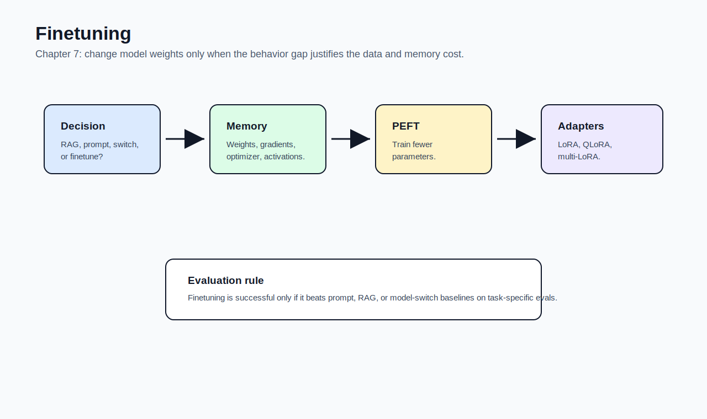

# 07 - Finetuning

[toc]

> **TL;DR:** Finetuning adapts a model by **changing weights**. It is powerful for behavior, format, style, and domain adaptation, but it costs data, memory, evaluation effort, and ML expertise.

## How to Read This Chapter

This chapter is the technical bridge from application engineering into model training. Read it with one decision in mind: **when is changing weights worth the cost?**

Prompting and RAG should usually be tried first. Finetuning becomes attractive when the model has the needed information but consistently fails at behavior, format, style, safety, or domain skill.

> [!IMPORTANT]
> Finetuning is not magic. It changes model behavior only in proportion to data quality, training setup, and evaluation discipline.

## Vocabulary Map

| Where the term appears | Terms introduced there |
| :--- | :--- |
| [1. Finetuning Overview](#1-finetuning-overview) | finetuning, base model, transfer learning, sample efficiency, task adaptation |
| [2. When to Finetune](#2-when-to-finetune) | behavior gap, knowledge gap, RAG, model switching, experiment budget |
| [3. Memory Bottlenecks](#3-memory-bottlenecks) | backpropagation, trainable parameter, activation, gradient, optimizer state, KV cache |
| [4. Numerical Representations](#4-numerical-representations) | precision, FP32, FP16, BF16, quantization, PTQ, QAT |
| [5. PEFT, LoRA, and QLoRA](#5-peft-lora-and-qlora) | PEFT, adapter, LoRA, rank, QLoRA |
| [6. Model Merging](#6-model-merging) | model merging, linear combination, multi-task finetuning |

## Chapter Map



## 1. Finetuning Overview

Finetuning starts with a base model and continues training it on data that represents your desired behavior. This works because foundation models already learned broad patterns during pre-training.

Finetuning is a form of transfer learning: reuse general capability, then specialize it.

### Vocabulary Introduced Here

**Finetuning**: Continuing training from an existing model to adapt it to a target task, style, domain, safety policy, or output format.

---

**Base model**: The starting model before your finetuning run.

---

**Transfer learning**: Using knowledge learned from one task or dataset to improve learning on another task.

---

**Sample efficiency**: How much a model can learn from a small number of examples.

---

**Task adaptation**: Making a model better for a specific workflow, domain, format, or behavior.

### What Finetuning Is Good At

Finetuning is strong when the model needs consistent behavior across many requests. Examples include strict style, specialized terminology, domain QA, safety responses, tool-call format, or structured outputs.

It is weaker when the problem is missing facts that change often. In those cases, retrieval is usually a better first move.

### Copyable Takeaways

- Finetuning changes weights.
- Transfer learning makes finetuning data-efficient compared with training from scratch.
- Use finetuning for repeated behavior, not one-off missing facts.

## 2. When to Finetune

The chapter compares finetuning with prompting, RAG, and model switching. The most useful distinction is **behavior gap versus knowledge gap**.

If the model lacks information, use RAG or tools. If the model has the information but fails to follow the desired behavior reliably, finetuning may help.

### Vocabulary Introduced Here

**Behavior gap**: The model knows enough but does not respond in the desired format, tone, policy, or procedure.

---

**Knowledge gap**: The model does not have the facts needed to answer.

---

**RAG**: Retrieval-augmented generation; a way to supply missing or current information at inference time.

---

**Model switching**: Trying a stronger or better-suited model before investing in finetuning.

---

**Experiment budget**: The time, data, compute, and evaluation capacity available for adaptation experiments.

### Decision Rule

Start with prompting because it is cheap. Add RAG when the model lacks context. Try a stronger model when switching is cheaper than training. Finetune when repeated behavior still fails and the value justifies the data and maintenance cost.

| Symptom | Better first move |
| :--- | :--- |
| Missing current/private facts | RAG or tools |
| Bad output format | Prompting, structured outputs, then finetuning |
| Weak domain style | Finetuning if examples exist |
| High latency from long prompts | Finetuning or prompt compression |
| Weak base capability | Switch model before finetuning |

> [!TIP]
> If prompting and RAG are not evaluated yet, it is usually too early to claim finetuning is necessary.

### Copyable Takeaways

- Knowledge gap: retrieve.
- Behavior gap: prompt, evaluate, then consider finetuning.
- Finetuning should be justified by repeated value, not frustration with one prompt.

## 3. Memory Bottlenecks

Finetuning is harder than inference because training must store more than weights. It needs activations, gradients, optimizer states, and temporary buffers.

This is why memory-efficient methods are central to foundation-model finetuning.

### Vocabulary Introduced Here

**Backpropagation**: The algorithm that computes how model parameters should change to reduce loss.

---

**Trainable parameter**: A parameter updated during training.

---

**Activation**: Intermediate values produced during the forward pass and often stored for backpropagation.

---

**Gradient**: The direction and magnitude of how a parameter should change to reduce loss.

---

**Optimizer state**: Extra values an optimizer keeps for each trainable parameter, such as momentum estimates.

---

**KV cache**: Stored key-value vectors used during transformer inference to avoid recomputing previous context.

### Memory Math

Training memory grows with trainable parameters and numerical precision. Reducing trainable parameters is the key trick behind PEFT.

```math
\text{training memory} \approx \text{weights} + \text{gradients} + \text{optimizer states} + \text{activations}
```

### Real-World Example: Rough Memory Estimate

This toy estimator shows why full finetuning is expensive. It intentionally simplifies framework overhead and activations.

```python
def gb(bytes_count):
    return bytes_count / (1024 ** 3)


def optimizer_memory(parameters, bytes_per_value=2, optimizer_slots=2):
    weights = parameters * bytes_per_value
    gradients = parameters * bytes_per_value
    optimizer = parameters * bytes_per_value * optimizer_slots
    return gb(weights + gradients + optimizer)


full_13b = optimizer_memory(13_000_000_000)
lora_100m = optimizer_memory(100_000_000)

print({"full_13b_gb": round(full_13b, 1), "lora_100m_gb": round(lora_100m, 1)})
```

### Copyable Takeaways

- Training needs more memory than inference.
- Updating fewer parameters reduces memory pressure.
- Activations and optimizer states can dominate finetuning cost.

## 4. Numerical Representations

Numerical format controls how much memory each value uses and how stable computation is. Lower precision reduces memory and can speed up training or inference, but can also hurt quality or stability.

The chapter distinguishes reduced precision from quantization. Both reduce memory, but they are not identical.

### Vocabulary Introduced Here

**Precision**: How many bits are used to represent numerical values.

---

**FP32**: 32-bit floating point. Stable but memory-heavy.

---

**FP16**: 16-bit floating point. Smaller and faster but can be less stable for some value ranges.

---

**BF16**: Brain floating point 16-bit. Often more stable than FP16 because it preserves a wider exponent range.

---

**Quantization**: Representing values with fewer bits, often integer-like formats, to reduce memory and speed up computation.

---

**PTQ**: Post-training quantization. Quantize after training.

---

**QAT**: Quantization-aware training. Train while accounting for quantization effects.

> [!WARNING]
> Loading a model in the wrong numerical format can silently change behavior or produce unstable outputs.

### Copyable Takeaways

- Lower precision saves memory but can change behavior.
- BF16 is often safer than FP16 for training stability.
- Quantization is a major tool for fitting large models into smaller memory budgets.

## 5. PEFT, LoRA, and QLoRA

Parameter-efficient finetuning reduces the number of trainable parameters. Instead of updating the whole model, it updates small adapter weights or low-rank matrices.

LoRA is popular because it is modular, memory-efficient, and easier to serve in multiple task variants than full model copies.

### Vocabulary Introduced Here

**PEFT**: Parameter-efficient finetuning. A family of methods that train only a small subset of parameters or add small trainable modules.

---

**Adapter**: A small trainable module added to a model while most original weights stay frozen.

---

**LoRA**: Low-rank adaptation. A method that learns low-rank update matrices for selected weights.

```math
W' = W + BA
```

---

**Rank**: The dimension of the low-rank update. Higher rank usually means more trainable parameters and more capacity.

---

**QLoRA**: A method that combines quantized base weights with LoRA adapters to reduce memory requirements.

### Why LoRA Works Practically

LoRA assumes useful task adaptation can often be represented by a low-rank update. The base model stays mostly frozen, while the adapter learns the task-specific shift.

This makes it possible to store multiple adapters for different tasks without duplicating the full model.

### Copyable Takeaways

- PEFT reduces trainable parameters.
- LoRA learns a small update to frozen model weights.
- QLoRA makes LoRA cheaper by quantizing the base model.

## 6. Model Merging

Model merging combines models or adapters into a single model. It is attractive when you have multiple specialized variants and want one deployable artifact.

The chapter treats model merging as promising but experimental. It can reduce serving complexity, but merged models can interfere with each other.

### Vocabulary Introduced Here

**Model merging**: Combining the weights or updates from multiple models into one model.

---

**Linear combination**: A weighted average or sum of model weights or adapter updates.

```math
W_{\text{merged}} = \alpha W_A + (1 - \alpha)W_B
```

---

**Multi-task finetuning**: Training a single model on examples from multiple tasks.

### Copyable Takeaways

- Model merging can reduce deployment complexity.
- Merging is useful but less predictable than ordinary finetuning.
- Evaluate merged models for task interference.

## Mental Model for Chapter 8

Finetuning quality is limited by data quality. Chapter 8 focuses on dataset engineering: **what examples should the model learn from?**

## Pitfalls

- **Finetuning for missing knowledge** - Use RAG when facts change or are external.
- **Skipping model switching** - A better base model may solve the issue faster.
- **Underestimating memory** - Training stores gradients, optimizer state, and activations.
- **Ignoring numerical format** - Precision and quantization affect behavior.
- **Bad data** - Finetuning amplifies the quality of your examples, good or bad.

## Review Questions

1. What is the difference between a knowledge gap and a behavior gap?
2. Why does training require more memory than inference?
3. What problem does PEFT solve?
4. How does LoRA update a model without training all weights?
5. When might model merging be useful?

## Sources

- Chip Huyen, *AI Engineering: Building Applications With Foundation Models*. Chapter 7, "Finetuning."
- Edward J. Hu et al., "LoRA: Low-Rank Adaptation of Large Language Models." [arXiv:2106.09685](https://arxiv.org/abs/2106.09685).
- Tim Dettmers et al., "QLoRA: Efficient Finetuning of Quantized LLMs." [arXiv:2305.14314](https://arxiv.org/abs/2305.14314).
- Neil Houlsby et al., "Parameter-Efficient Transfer Learning for NLP." [arXiv:1902.00751](https://arxiv.org/abs/1902.00751).
- Sylvestre-Alvise Rebuffi et al., "Learning multiple visual domains with residual adapters." [arXiv:1705.08045](https://arxiv.org/abs/1705.08045).

## Related

- [Prompt Engineering](./05-prompt-engineering.md)
- [RAG and Agents](./06-rag-and-agents.md)
- [Dataset Engineering](./08-dataset-engineering.md)
- [Matrices](../../Mathematics/Linear-Algebra/3-matrices.md)
