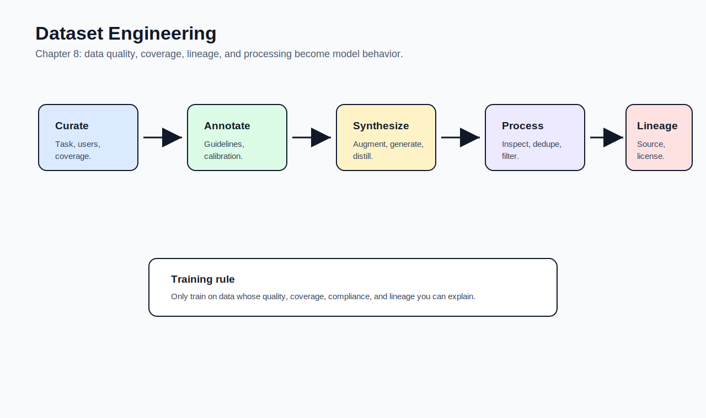

# 08 - Dataset Engineering

[toc]

> **TL;DR:** Dataset engineering is the work of creating, improving, validating, and maintaining the data that teaches model behavior. For application developers, data is often the strongest lever after prompting, RAG, and model selection.

## How to Read This Chapter

Chapter 7 explained how to change model weights. Chapter 8 explains what examples those weight changes should learn from.

Read this chapter as a data-quality workflow: **curate**, **measure**, **acquire**, **annotate**, **synthesize**, **inspect**, **deduplicate**, **clean**, and **track lineage**.

> [!IMPORTANT]
> Finetuning turns your dataset into model behavior. Bad data becomes bad behavior at scale.

## Vocabulary Map

| Where the term appears | Terms introduced there |
| :--- | :--- |
| [1. Data-Centric AI](#1-data-centric-ai) | dataset engineering, data-centric AI, model-centric AI |
| [2. Data Curation](#2-data-curation) | data curation, data quality, relevance, consistency, compliance, data coverage, data quantity |
| [3. Acquisition and Annotation](#3-acquisition-and-annotation) | annotation, annotation guideline, inter-annotator agreement, labeler calibration |
| [4. Augmentation and Synthesis](#4-augmentation-and-synthesis) | data augmentation, synthetic data, self-play, back-translation, instruction synthesis, model distillation |
| [5. Risks of Synthetic Data](#5-risks-of-synthetic-data) | model collapse, data lineage, benchmark leakage |
| [6. Data Processing](#6-data-processing) | inspection, deduplication, hashing, filtering, PII removal |

## Chapter Map



## 1. Data-Centric AI

The chapter frames data as a competitive advantage. When many teams can use similar models, better datasets can produce better behavior, stronger evaluation, and more defensible products.

Data-centric AI does not mean model work is irrelevant. It means performance often improves more by fixing examples, coverage, labels, and data pipelines than by changing architecture.

### Vocabulary Introduced Here

**Dataset engineering**: The process of designing, collecting, annotating, generating, processing, and validating datasets for model training or adaptation.

---

**Data-centric AI**: Improving AI performance by improving data quality, coverage, labels, and processing.

---

**Model-centric AI**: Improving AI performance by changing architecture, model size, training methods, or optimization.

### Copyable Takeaways

- Data quality becomes model behavior.
- Dataset engineering is a product and ML discipline, not clerical cleanup.
- Strong data can differentiate products even when models are similar.

## 2. Data Curation

Data curation asks what examples the model should learn from. The dataset should reflect the task, user distribution, edge cases, policy constraints, and desired behavior.

Quality, coverage, and quantity interact. A small amount of excellent data can outperform a large amount of noisy data, but complex tasks still need enough coverage.

### Vocabulary Introduced Here

**Data curation**: Selecting and shaping data so it teaches the model the desired behavior.

---

**Data quality**: How useful, correct, relevant, safe, and consistent the data is for the training goal.

---

**Relevance**: Whether an example matches the target task or user distribution.

---

**Consistency**: Whether labels, formats, and decisions follow the same standard across examples.

---

**Compliance**: Whether data respects legal, privacy, licensing, policy, and contractual constraints.

---

**Data coverage**: How well the dataset spans domains, user types, languages, difficulty levels, formats, and edge cases.

---

**Data quantity**: How many examples, tokens, or preference pairs the dataset contains.

### Quality Checklist

Use this checklist before adding examples to a training set.

- Is the example relevant to the intended task?
- Is the desired output correct?
- Does it match the target style and format?
- Does it include edge cases?
- Is the source allowed for this use?
- Is sensitive data removed or protected?
- Is the label guideline clear?

> [!TIP]
> Start with a small, high-quality dataset. If learning curves improve cleanly, scale data collection with more confidence.

### Copyable Takeaways

- Curate for the behavior you want, not the data you happen to have.
- Coverage matters because users find edge cases.
- Compliance is a dataset requirement, not an afterthought.

## 3. Acquisition and Annotation

Data can come from public datasets, internal logs, user feedback, expert examples, vendors, simulations, or synthetic generation. The best source is often your own product workflow, because it reflects real users.

Annotation turns raw examples into training signals. Annotation quality depends on guidelines, labeler training, calibration, review, and disagreement analysis.

### Vocabulary Introduced Here

**Annotation**: Adding labels, rankings, corrections, or target outputs to examples.

---

**Annotation guideline**: A written standard that tells annotators how to label examples consistently.

---

**Inter-annotator agreement**: A measure of how often annotators agree. Low agreement can mean unclear guidelines or inherently ambiguous tasks.

---

**Labeler calibration**: Training and checking annotators against shared examples so labels follow the intended standard.

### Annotation Workflow

Start with guidelines and a small pilot. Review disagreements. Update guidelines. Only scale annotation after the label process is stable.


### Copyable Takeaways

- Annotation quality depends on guidelines.
- Disagreement is signal: use it to improve the task definition.
- Product data is often the most valuable data source.

## 4. Augmentation and Synthesis

Data augmentation modifies existing data, while synthesis creates new examples. AI-powered synthesis can increase quantity, coverage, and quality, but it requires strict filtering.

Synthetic data is especially useful for rare cases, privacy-sensitive domains, instruction examples, preference data, and model distillation.

### Vocabulary Introduced Here

**Data augmentation**: Creating variants of existing examples through transformations such as paraphrasing, perturbation, cropping, translation, or noise.

---

**Synthetic data**: Data generated rather than directly observed from the real world.

---

**Self-play**: A system generating training data by interacting with itself or copies of itself.

---

**Back-translation**: Translating text to another language and back to generate paraphrases or training pairs.

---

**Instruction synthesis**: Generating instruction-response examples for supervised finetuning.

---

**Model distillation**: Training a smaller or cheaper student model to imitate a stronger teacher model.

### Real-World Example: Data Audit

This toy script checks duplicates and rough label balance. Real data audits should also inspect toxicity, PII, length, source, domain, and task difficulty.

```python
from collections import Counter


examples = [
    {"input": "Refund opened item", "label": "escalate"},
    {"input": "Refund unopened item", "label": "answer"},
    {"input": "Refund opened item", "label": "escalate"},
]

inputs = [row["input"].strip().lower() for row in examples]
labels = [row["label"] for row in examples]

duplicates = len(inputs) - len(set(inputs))
label_counts = Counter(labels)

print({"duplicates": duplicates, "label_counts": dict(label_counts)})
```

### Copyable Takeaways

- Synthetic data is useful only after filtering.
- Use synthetic data to cover rare cases and formats.
- Distillation transfers behavior from a stronger model to a cheaper one.

## 5. Risks of Synthetic Data

AI-generated data can be low quality, repetitive, biased, or misleading. It can also obscure where an example came from, making compliance and benchmark validity harder.

The biggest lesson is that synthetic data needs evaluation as much as model outputs do.

### Vocabulary Introduced Here

**Model collapse**: A degradation pattern where models trained heavily on generated data lose diversity, quality, or fidelity to the real data distribution.

---

**Data lineage**: A record of where data came from, how it was transformed, and what it is allowed to be used for.

---

**Benchmark leakage**: Evaluation examples accidentally appearing in training or synthetic data.

> [!WARNING]
> Synthetic data without lineage can poison both training and evaluation.

### Copyable Takeaways

- Track synthetic data lineage.
- Filter generated data before training on it.
- Keep benchmark data isolated from training and synthesis workflows.

## 6. Data Processing

Data processing prepares examples for training and evaluation. This includes inspection, deduplication, normalization, filtering, sensitive-data removal, and format conversion.

Processing is not just cleanup. It changes the distribution the model sees.

### Vocabulary Introduced Here

**Inspection**: Looking at data statistics and samples to understand distribution, quality, and anomalies.

---

**Deduplication**: Removing exact or near-duplicate examples.

---

**Hashing**: Converting content into a fingerprint used to detect exact duplicates.

---

**Filtering**: Removing examples based on quality, safety, compliance, length, language, domain, or duplication rules.

---

**PII removal**: Detecting and removing personally identifiable information.

### Copyable Takeaways

- Inspect data before training.
- Deduplicate to reduce memorization and skew.
- Filtering rules should be versioned because they define the training distribution.

## Mental Model for Chapter 9

Chapter 9 moves from model quality to serving efficiency. Carry this forward: **better data can improve quality, but production still fails if inference is too slow or expensive.**

## Pitfalls

- **Scaling noisy data** - More bad examples can make behavior worse.
- **Unclear guidelines** - Annotators cannot label consistently without standards.
- **Synthetic-data overtrust** - Generated examples need review.
- **No lineage** - You cannot debug, audit, or comply without source records.
- **Leaky evals** - Training on benchmark-like examples can fake progress.

## Review Questions

1. What is the difference between data-centric and model-centric AI?
2. What makes a dataset high quality?
3. Why should annotation begin with a pilot?
4. What are the benefits and risks of synthetic data?
5. Why is data lineage important?

## Sources

- Chip Huyen, *AI Engineering: Building Applications With Foundation Models*. Chapter 8, "Dataset Engineering."
- Samir Yitzhak Gadre et al., "DataComp: In search of the next generation of multimodal datasets." [arXiv:2304.14108](https://arxiv.org/abs/2304.14108).
- Yizhong Wang et al., "Self-Instruct: Aligning Language Models with Self-Generated Instructions." [arXiv:2212.10560](https://arxiv.org/abs/2212.10560).
- Victor Sanh et al., "DistilBERT, a distilled version of BERT." [arXiv:1910.01108](https://arxiv.org/abs/1910.01108).
- Ilia Shumailov et al., "The Curse of Recursion: Training on Generated Data Makes Models Forget." [arXiv:2305.17493](https://arxiv.org/abs/2305.17493).

## Related

- [Finetuning](./07-finetuning.md)
- [Inference Optimization](./09-inference-optimization.md)
- [Evaluate AI Systems](./04-evaluate-ai-systems.md)
