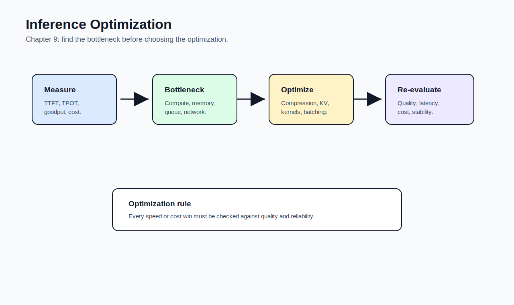

# 09 - Inference Optimization

[toc]

> **TL;DR:** Inference optimization makes models **faster**, **cheaper**, and **more scalable**. The work spans model design, hardware, kernels, batching, caching, KV-cache management, and service-level scheduling.

## How to Read This Chapter

Chapters 5-8 focused mostly on quality. This chapter focuses on the production reality that quality is not enough if the system is too slow or too expensive.

Read it as bottleneck analysis: first understand whether the workload is compute-bound, memory-bound, or service-scheduling-bound, then choose the optimization that attacks the bottleneck.

> [!IMPORTANT]
> Optimization without a bottleneck is guesswork. Measure first.

## Vocabulary Map

| Where the term appears | Terms introduced there |
| :--- | :--- |
| [1. Inference Overview](#1-inference-overview) | inference, inference server, inference service, prefill, decode, online inference, batch inference |
| [2. Bottlenecks and Metrics](#2-bottlenecks-and-metrics) | compute-bound, memory bandwidth-bound, latency, TTFT, TPOT, throughput, goodput, utilization, MFU, MBU |
| [3. Hardware and Accelerators](#3-hardware-and-accelerators) | accelerator, GPU memory, bandwidth, SRAM, DRAM, tensor core |
| [4. Model Optimization](#4-model-optimization) | model compression, distillation, pruning, speculative decoding, parallel decoding |
| [5. Attention and KV Cache](#5-attention-and-kv-cache) | KV cache, grouped-query attention, multi-query attention, kernel, FlashAttention |
| [6. Service Optimization](#6-service-optimization) | batching, continuous batching, prompt caching, cache hit rate |

## Chapter Map



## 1. Inference Overview

Inference is the process of using a trained model to compute an output. In production, an inference service receives requests, routes them, runs models on hardware, and returns responses.

Transformer inference has two important phases: **prefill** processes the input prompt, and **decode** generates output tokens one at a time.

### Vocabulary Introduced Here

**Inference**: Computing model outputs for inputs.

---

**Inference server**: The component that hosts models and executes model inference.

---

**Inference service**: The broader system around inference servers, including routing, batching, preprocessing, post-processing, and scaling.

---

**Prefill**: Processing the input prompt and populating the initial KV cache.

---

**Decode**: Generating output tokens autoregressively after prefill.

---

**Online inference**: Inference triggered by live user requests.

---

**Batch inference**: Inference run over a batch of jobs where latency is less urgent.

### Copyable Takeaways

- Inference is where model quality meets product latency and cost.
- Prefill handles input; decode generates output.
- Online APIs optimize user latency; batch APIs optimize cost and throughput.

## 2. Bottlenecks and Metrics

Optimization starts by identifying the bottleneck. Some workloads are limited by math operations, others by memory movement, and others by queueing or scheduling.

Latency should be measured as a distribution, not a single average. Tail latency often defines user experience.

### Vocabulary Introduced Here

**Compute-bound**: Performance is limited by available arithmetic compute.

---

**Memory bandwidth-bound**: Performance is limited by how fast data can move between memory and compute units.

---

**Latency**: Time from request to response.

---

**TTFT**: Time to first token.

---

**TPOT**: Time per output token.

---

**Throughput**: Total work completed per unit time.

---

**Goodput**: Useful throughput that satisfies latency or quality requirements.

---

**Utilization**: How much of a hardware resource is busy.

---

**MFU**: Model FLOPs utilization; observed compute throughput compared with theoretical peak.

---

**MBU**: Memory bandwidth utilization; observed memory bandwidth compared with theoretical peak.

### Metric Checklist

Track at least:

- p50, p95, and p99 latency.
- TTFT and TPOT.
- tokens per second.
- requests per second.
- queue time.
- GPU memory use.
- cost per request.
- error and timeout rates.

> [!TIP]
> Goodput is often more useful than raw throughput because it counts only work that meets the service objective.

### Copyable Takeaways

- Measure bottlenecks before optimizing.
- Tail latency matters more than average latency.
- Goodput is throughput that still satisfies product requirements.

## 3. Hardware and Accelerators

AI inference depends heavily on hardware. GPUs and other accelerators are designed to move tensors through matrix operations quickly, but memory size, bandwidth, power, cooling, and availability all matter.

The right hardware depends on model size, precision, batch shape, context length, throughput target, latency target, and cost constraints.

### Vocabulary Introduced Here

**Accelerator**: Hardware specialized for AI workloads, such as GPUs, TPUs, NPUs, or inference chips.

---

**GPU memory**: High-bandwidth memory attached to the GPU.

---

**Bandwidth**: How much data can move per unit time.

---

**SRAM**: Fast on-chip memory.

---

**DRAM**: Larger but slower main memory.

---

**Tensor core**: Specialized hardware units optimized for matrix/tensor operations.

### Copyable Takeaways

- Hardware choice affects latency, cost, and deployability.
- Memory bandwidth can matter as much as FLOP/s.
- Quantization changes both model memory and hardware fit.

## 4. Model Optimization

Model-level optimization reduces inference cost by changing the model or decoding process. Compression, quantization, distillation, pruning, and faster decoding all fit here.

The tradeoff is that optimization can change quality. Every optimization needs evaluation against task behavior.

### Vocabulary Introduced Here

**Model compression**: Techniques that reduce model size or computation.

---

**Distillation**: Training a smaller model to imitate a larger or stronger teacher model.

---

**Pruning**: Removing weights, neurons, heads, or structures from a model.

---

**Speculative decoding**: Using a smaller draft model to propose tokens that a larger target model verifies.

---

**Parallel decoding**: Techniques that try to generate or verify multiple tokens in parallel rather than strictly one at a time.

### Copyable Takeaways

- Compression can reduce memory and cost.
- Distillation trades training effort for cheaper inference.
- Speculative decoding speeds generation when draft tokens are accepted often enough.

## 5. Attention and KV Cache

Autoregressive transformer inference repeatedly attends over previous tokens. The KV cache stores key-value vectors so the model does not recompute all previous context each token.

KV-cache size grows with sequence length, batch size, layers, heads, and hidden dimensions. This makes long-context serving memory-intensive.

### Vocabulary Introduced Here

**KV cache**: Stored key and value tensors from previous tokens used during autoregressive decoding.

---

**Grouped-query attention**: Sharing key-value heads across groups of query heads to reduce KV-cache memory.

---

**Multi-query attention**: Sharing one set of key-value heads across many query heads.

---

**Kernel**: Low-level code optimized for a specific operation and hardware target.

---

**FlashAttention**: An optimized attention algorithm and kernel family that reduces memory movement.

### KV Cache Intuition

The KV cache saves compute but consumes memory. Long contexts and large batches can make KV cache the limiting factor.

```math
\text{KV cache memory} \propto \text{layers} \times \text{sequence length} \times \text{batch size}
```

> [!WARNING]
> Long context windows are not free. They increase memory pressure, latency, and cost even when the model supports them.

### Copyable Takeaways

- KV cache speeds decoding but consumes memory.
- Long context increases serving cost.
- Attention kernels and KV-cache management are central to LLM inference.

## 6. Service Optimization

Service-level optimization improves how requests are scheduled and served. Batching, continuous batching, prompt caching, and routing can improve throughput and cost without changing model weights.

These optimizations require workload awareness. A chat product, code assistant, offline summarizer, and batch data-labeling job have different latency and throughput needs.

### Vocabulary Introduced Here

**Batching**: Combining multiple requests so hardware is used more efficiently.

---

**Continuous batching**: Dynamically adding and removing requests from a running batch as sequences finish.

---

**Prompt caching**: Reusing computation for repeated prompt prefixes.

---

**Cache hit rate**: The fraction of requests served partly or fully from cache.

### Real-World Example: Latency Budget

This toy budget shows how non-model overhead can consume user latency.

```python
latency_ms = {
    "queue": 120,
    "retrieval": 180,
    "prefill": 260,
    "decode": 900,
    "postprocess": 40,
}

total = sum(latency_ms.values())
budget = 1500

print({"total_ms": total, "within_budget": total <= budget})
```

### Copyable Takeaways

- Batching improves utilization but can hurt latency.
- Continuous batching improves serving efficiency for variable-length generations.
- Prompt caching helps when many requests share the same prefix.

## Mental Model for Chapter 10

Chapter 10 assembles the full architecture. Carry forward this rule: **every architecture component should either improve quality, reduce risk, reduce cost, reduce latency, or improve observability.**

## Pitfalls

- **Optimizing blindly** - Measure the bottleneck first.
- **Ignoring tail latency** - Users feel p95 and p99.
- **Overusing long context** - It increases KV-cache memory and cost.
- **Counting raw throughput only** - Goodput matters more.
- **Skipping quality evals after optimization** - Faster wrong answers are still wrong.

## Review Questions

1. What is the difference between prefill and decode?
2. How do TTFT and TPOT differ?
3. Why can memory bandwidth bottleneck inference?
4. What does the KV cache store?
5. How does continuous batching help serving?

## Sources

- Chip Huyen, *AI Engineering: Building Applications With Foundation Models*. Chapter 9, "Inference Optimization."
- Tri Dao et al., "FlashAttention: Fast and Memory-Efficient Exact Attention with IO-Awareness." [arXiv:2205.14135](https://arxiv.org/abs/2205.14135).
- Woosuk Kwon et al., "Efficient Memory Management for Large Language Model Serving with PagedAttention." [arXiv:2309.06180](https://arxiv.org/abs/2309.06180).
- Yaniv Leviathan et al., "Fast Inference from Transformers via Speculative Decoding." [arXiv:2211.17192](https://arxiv.org/abs/2211.17192).
- Elias Frantar et al., "GPTQ: Accurate Post-Training Quantization for Generative Pre-trained Transformers." [arXiv:2210.17323](https://arxiv.org/abs/2210.17323).

## Related

- [Dataset Engineering](./08-dataset-engineering.md)
- [AI Engineering Architecture and User Feedback](./10-ai-engineering-architecture-and-user-feedback.md)
- [Finetuning](./07-finetuning.md)
