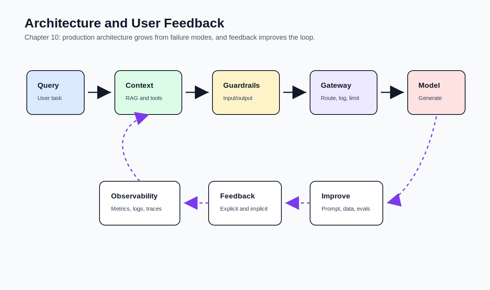
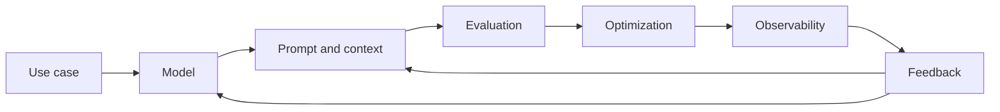

# 10 - AI Engineering Architecture and User Feedback

[toc]

> **TL;DR:** A production AI application grows from a simple model call into an architecture with **context construction**, **guardrails**, **routers**, **gateways**, **caching**, **write actions**, **observability**, **orchestration**, and **feedback loops**. User feedback is both a product signal and a future data source.

## How to Read This Chapter

This chapter assembles the book. It starts from the simplest application architecture and adds components only when product needs demand them.

Read it as an architecture progression, not a mandate to add every component immediately.

> [!IMPORTANT]
> Architecture should grow from concrete failure modes and product requirements, not from tool hype.

## Vocabulary Map

| Where the term appears | Terms introduced there |
| :--- | :--- |
| [1. Architecture Progression](#1-architecture-progression) | AI architecture, context enhancement, guardrail, router, model gateway, write action |
| [2. Caching](#2-caching) | exact cache, semantic cache, cache hit rate, cache invalidation |
| [3. Monitoring and Observability](#3-monitoring-and-observability) | monitoring, observability, metric, log, trace, CFR |
| [4. Orchestration](#4-orchestration) | orchestration, chain, pipeline, workflow, fallback |
| [5. User Feedback](#5-user-feedback) | explicit feedback, implicit feedback, conversational feedback, natural language feedback, regeneration, early termination |

## Chapter Map



## 1. Architecture Progression

The simplest AI app sends a query to a model and returns the response. That is useful for demos, but production applications usually need more: context, guardrails, routing, caching, observability, and user feedback.

Add components only when they solve a real problem. Each component adds complexity, failure modes, and operational burden.

### Vocabulary Introduced Here

**AI architecture**: The system design that connects users, models, data, tools, policies, infrastructure, monitoring, and feedback.

---

**Context enhancement**: Adding external data, retrieved documents, user state, or tool results to improve model output.

---

**Guardrail**: A control that blocks, filters, rewrites, detects, or escalates unsafe input, unsafe output, or unsafe actions.

---

**Router**: A component that sends requests to different models, prompts, tools, or workflows based on task needs.

---

**Model gateway**: An abstraction layer between applications and model providers that centralizes access, logging, fallback, rate limits, and policy.

---

**Write action**: An action that changes external state, such as sending a message, updating a record, or creating a ticket.

### Architecture Growth Path

The chapter's progression is:

1. Start with query to model to response.
2. Add context through retrieval and tools.
3. Add guardrails for inputs, outputs, and actions.
4. Add routers and gateways for model selection and control.
5. Add caching for latency and cost.
6. Add write actions carefully.
7. Add observability and feedback loops.

> [!WARNING]
> Write actions turn a model response into a real-world side effect. They need permissions, validation, audit logs, and rollback plans.

### Copyable Takeaways

- Start simple, then add components for observed needs.
- Gateways centralize model access and control.
- Guardrails reduce risk but do not replace evaluation or authorization.

## 2. Caching

Caching saves time and money by reusing previous work. Exact caching reuses results for identical inputs; semantic caching reuses results for similar inputs.

Caching can also be dangerous when answers depend on time, user identity, permissions, or changing data.

### Vocabulary Introduced Here

**Exact cache**: A cache that returns a stored result only when the input matches exactly.

---

**Semantic cache**: A cache that returns a stored result for a semantically similar input.

---

**Cache hit rate**: The fraction of requests served by cache.

---

**Cache invalidation**: Deciding when cached values are stale and must be removed or refreshed.

### Copyable Takeaways

- Cache stable repeated work.
- Be careful caching personalized, permissioned, or time-sensitive outputs.
- Semantic caching needs evaluation because "similar" does not always mean "same answer."

## 3. Monitoring and Observability

Monitoring tells you whether the system is healthy. Observability helps you explain why it failed.

AI systems need both standard service metrics and model-specific traces: prompt version, retrieved context, model, decoding settings, tool calls, guardrail decisions, output, evaluator result, and user feedback.

### Vocabulary Introduced Here

**Monitoring**: Tracking known metrics and alerts to detect system health and performance.

---

**Observability**: Designing the system so unknown failures can be investigated from logs, traces, metrics, and artifacts.

---

**Metric**: A numerical measurement over time.

---

**Log**: An event record describing what happened.

---

**Trace**: A connected record of a request as it moves through components.

---

**CFR**: Conversation fallback rate; how often conversations require fallback, escalation, or human intervention.

### What to Track

Track quality, latency, cost, safety, format failures, retrieval quality, tool errors, provider errors, fallback rate, user satisfaction, and drift by segment.

Also track enough request context to reproduce failures without logging secrets or raw sensitive data unnecessarily.

### Real-World Example: Trace Shape

This example shows the kind of fields an AI trace should carry. A production trace would use your logging and tracing infrastructure.

```python
trace = {
    "request_id": "req_123",
    "prompt_version": "support_v7",
    "model": "example-model",
    "retrieval_top_k": 5,
    "guardrail_result": "passed",
    "tool_calls": ["policy_search"],
    "latency_ms": 1420,
    "cost_usd": 0.031,
    "user_feedback": "thumbs_up",
}

print(trace)
```

> [!CAUTION]
> Logs can become a privacy risk. Do not log secrets, raw PII, or full sensitive prompts unless the system is designed to protect them.

### Copyable Takeaways

- Monitoring detects known failures.
- Observability explains unknown failures.
- AI traces should connect prompt, context, model, tools, output, and feedback.

## 4. Orchestration

As applications grow, they become pipelines of retrieval, routing, generation, tool calls, validation, guardrails, and feedback. Orchestration coordinates those steps.

The danger is building a complex chain that is hard to debug. Keep orchestration explicit, observable, and testable.

### Vocabulary Introduced Here

**Orchestration**: Coordinating the components in an AI workflow.

---

**Chain**: A sequence of model calls or processing steps.

---

**Pipeline**: A broader workflow made of components, branches, gates, and side effects.

---

**Workflow**: The product-level process the AI system supports.

---

**Fallback**: A backup path used when a component fails or confidence is too low.

### Copyable Takeaways

- Orchestration should make workflows clearer, not more mysterious.
- Every branch needs logging and evaluation.
- Fallbacks are product behavior and should be tested.

## 5. User Feedback

User feedback is central because only real users can reveal whether the application helps in context. For AI systems, feedback also becomes data for evaluation, prompt changes, retrieval tuning, finetuning, and product design.

Conversational interfaces make feedback abundant but messy. Users correct, regenerate, abandon, complain, continue, or silently accept outputs.

### Vocabulary Introduced Here

**Explicit feedback**: Direct user feedback, such as thumbs up, rating, comment, correction, or report.

---

**Implicit feedback**: Behavioral signal inferred from user actions, such as regeneration, editing, abandonment, or continued use.

---

**Conversational feedback**: Feedback embedded in the conversation itself.

---

**Natural language feedback**: Text feedback where the user explains what was wrong or what they wanted.

---

**Regeneration**: A user asking for another response to the same or similar prompt.

---

**Early termination**: A user stopping, abandoning, or ending a workflow before completion.

### Feedback Design

Collect feedback at moments where the user understands the output. Do not interrupt every interaction. Make it easy to report severe failures and easy to give low-friction signals.

Use feedback carefully. A thumbs-up may mean "good answer," "funny answer," "I am done," or "good enough." Interpret it with context.

> [!NOTE]
> Feedback is not automatically training data. It becomes useful after interpretation, filtering, privacy review, and evaluation.

### Copyable Takeaways

- User feedback is both product signal and future data.
- Explicit feedback is cleaner but more intrusive.
- Implicit feedback is abundant but harder to interpret.

## Final Book Mental Model

The whole book can be compressed into one loop: define the use case, choose a model, construct context, adapt behavior, evaluate, optimize inference, observe production, collect feedback, and improve the system.



## Pitfalls

- **Adding every tool** - Architecture should follow need.
- **No gateway** - Model access becomes hard to secure, observe, and control.
- **Caching unsafe outputs** - Personalized or time-sensitive answers can leak or go stale.
- **Untraceable failures** - Without traces, debugging becomes guessing.
- **Treating feedback as clean labels** - Feedback needs interpretation and filtering.

## Review Questions

1. What components are added as the simplest AI architecture matures?
2. When is semantic caching risky?
3. What is the difference between monitoring and observability?
4. Why does orchestration need traces?
5. How can conversational feedback improve the system?

## Sources

- Chip Huyen, *AI Engineering: Building Applications With Foundation Models*. Chapter 10, "AI Engineering Architecture and User Feedback."
- OpenTelemetry, "What is observability?" [OpenTelemetry Docs](https://opentelemetry.io/docs/concepts/observability-primer/).
- OWASP, "Top 10 for Large Language Model Applications." [OWASP](https://owasp.org/www-project-top-10-for-large-language-model-applications/).
- Lianmin Zheng et al., "Judging LLM-as-a-Judge with MT-Bench and Chatbot Arena." [arXiv:2306.05685](https://arxiv.org/abs/2306.05685).

## Related

- [Inference Optimization](./09-inference-optimization.md)
- [The Rise of AI Engineering](./01-the-rise-of-ai-engineering.md)
- [Evaluate AI Systems](./04-evaluate-ai-systems.md)
