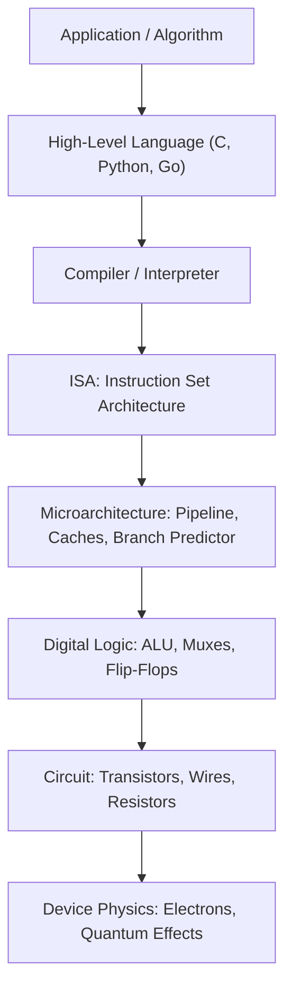
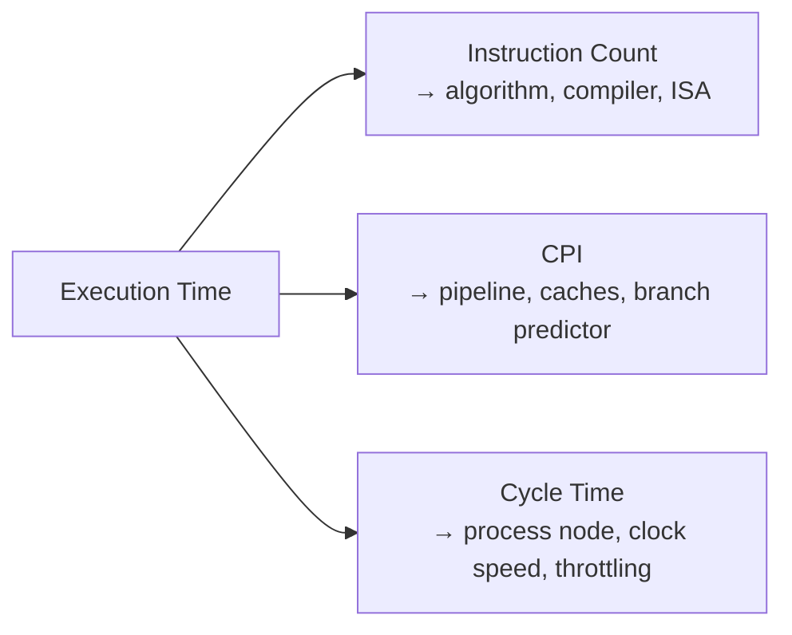

# 1 - What is Computer Architecture

[toc]

> **TL;DR:** Computer architecture is the science of designing the interface between software and hardware — choosing which abstractions to expose at each level of a system, from transistors up to application code. It sits at the intersection of digital logic, microarchitecture, operating systems, and compilers, and its central question is always the same: given a fixed budget of power, area, and cost, how do you build a machine that runs real workloads as fast as possible? The Iron Law of performance — cycles per instruction × instructions per program × seconds per cycle — is the three-dimensional knob every architect turns.

## Vocabulary

**Abstraction layer**: A boundary that hides implementation details below it and exposes a clean interface above it. The entire stack from transistor to app is a tower of abstraction layers.

---

**Instruction Set Architecture (ISA)**: The contract between hardware and software. Defines legal instructions, their encoding, register names, memory model, and privilege levels. Examples: x86-64, ARMv8-A, RISC-V RV64GC.

---

**Microarchitecture**: The concrete hardware implementation of an ISA. Two chips may implement the same ISA (e.g. x86-64) with completely different internal designs and performance characteristics. AMD Zen 4 and Intel Raptor Lake both run the same x86-64 code; their internal pipelines differ radically.

---

**Clock cycle**: The fundamental time unit of a synchronous digital circuit. One cycle is the period of the global clock signal; all state transitions are synchronous with it.

```math
T_{cycle} = \frac{1}{f_{clock}}
```

---

**CPI (Cycles Per Instruction)**: The average number of clock cycles consumed to retire one instruction. Lower is better. Depends on instruction mix, cache hit rates, branch prediction accuracy, and pipeline depth.

---

**IPC (Instructions Per Cycle)**: The reciprocal of CPI. Modern out-of-order cores target IPC ≥ 4–6 on integer workloads; simple in-order cores may achieve IPC < 1 (stalling on memory).

```math
\text{IPC} = \frac{1}{\text{CPI}}
```

---

**Iron Law of Performance**: The three-factor decomposition of execution time.

```math
T_{exec} = \underbrace{N_{inst}}_{\text{instruction count}} \times \underbrace{\text{CPI}}_{\text{microarch}} \times \underbrace{T_{cycle}}_{\text{technology}}
```

---

**Throughput**: Instructions (or operations) completed per unit time. Often expressed as GFLOPS, GIOPS, or instructions/second.

---

**Latency**: Time from when an operation begins to when its result is available. Latency and throughput are often in tension — pipelining improves throughput without reducing per-operation latency.

---

**Power wall**: The practical limit on clock frequency imposed by power dissipation. P ∝ C·V²·f means doubling frequency roughly doubles power; thermal constraints capped single-core frequencies near 4–5 GHz around 2004.

---

**Memory wall**: The growing gap between processor speed and memory bandwidth/latency. DRAM latency has improved ~10× in 40 years; CPU speed ~1000×. Cache hierarchies exist to bridge this gap.

---

**Moore's Law**: The empirical observation (not a law of physics) that transistor density doubles roughly every 18–24 months. Still approximately true for 2D density as of 2026, though per-transistor performance gains have slowed dramatically.

---

**Dennard Scaling**: The now-broken property that as transistors shrink, voltage and power scale down proportionally, keeping power density constant. Broke around 2005–2007, causing the shift to multicore.

---

## Intuition

Think of computer architecture as a series of contracts. Each layer promises a specific behaviour to the layer above it and hides the details of how that behaviour is achieved. A programmer writing Python only sees the language semantics; the CPython interpreter only sees the OS system call interface; the OS only sees the ISA; the CPU microarchitecture only sees transistors and clock edges. Each contract creates freedom: Intel can redesign Raptor Lake's internal pipeline radically without breaking a single line of existing x86-64 software, as long as the ISA contract is preserved.

The fundamental tension in architecture is the performance-programmability trade-off. A general-purpose CPU executing arbitrary software is flexible but leaves hardware utilisation low. A fixed-function accelerator (a TPU, an NVMe controller, a video codec block) is fast and efficient but useless for other tasks. Modern chips hedge: a large fraction of die area on Apple M4 and NVIDIA H100 is dedicated to matrix-multiply accelerators that exist solely because ML workloads dominate.



**Figure:** The abstraction tower. Each layer is a separate engineering discipline. Architects live at the ISA and microarchitecture layers.

## Levels of Abstraction

Understanding what each layer does — and crucially, what it hides — is the most important framework in all of computer architecture. Spend five minutes on each layer the first time; the whole series builds on this map.

### Device Physics and Transistors

A MOSFET transistor is a voltage-controlled switch: apply enough voltage to the gate and current flows from drain to source. Modern process nodes (TSMC N3, Intel 18A) pack tens of billions of switches onto a 200 mm² die. A single SRAM bit cell uses 6 transistors. A 64-bit adder uses a few hundred. An entire CPU core uses ~100 million. This layer is the province of electrical engineering and materials science; computer architects treat transistors as ideal switches with known delay and power characteristics.

### Digital Logic: Gates and Combinational Circuits

Gates (AND, OR, NOT, NAND, NOR, XOR) are composed from transistors and are the vocabulary of digital design. Combinational logic (adders, multiplexers, decoders, comparators) builds useful functions from gates; sequential logic (flip-flops, registers, SRAMs) adds state. This is where Boolean algebra becomes hardware. A 1-bit full adder needs ~28 transistors; a 64-bit ripple-carry adder chains 64 of them, though real CPUs use carry-lookahead or prefix adders to reduce depth.

### Register-Transfer Level (RTL)

RTL describes hardware as registers connected by combinational logic blocks, with state advancing each clock edge. Hardware description languages — VHDL, Verilog, SystemVerilog — work at this level. RTL is what synthesis tools consume to produce gate netlists. When engineers say "the ALU is 5 cycles deep" or "this mux adds 200 ps of delay," they are speaking RTL.

### Microarchitecture

The microarchitecture implements the ISA in RTL. It decides: how many pipeline stages to use, how many instructions to issue per cycle, how to predict branches, how large the caches are, how many functional units exist, and how out-of-order execution is managed. The microarchitecture is invisible to the ISA-level programmer — it is an implementation choice that affects performance but not correctness (in an ideal world; Spectre/Meltdown proved side-channels leak microarch details).

### Instruction Set Architecture

The ISA is the contract. It defines: what registers exist and their width, what instructions are legal and their binary encoding, memory addressing modes, exception and interrupt semantics, privilege levels (user / supervisor / machine in RISC-V terminology), and the memory consistency model. Two completely different microarchitectures that implement the same ISA are binary-compatible: the same compiled binary runs on both.

> [!IMPORTANT]
> The ISA/microarchitecture boundary is the most important interface in computing. The ISA is a *specification*; the microarchitecture is an *implementation*. Intel's Alder Lake and AMD's Zen 4 both implement x86-64 but have wildly different microarchitectures. Apple's M-series implements AArch64 with yet another microarchitecture. Same ISA, different chips, same software.

### OS / System Software

The OS is the first software layer. It multiplexes hardware resources (CPU time, DRAM, disk I/O) across processes and provides system calls — a higher-level ISA for application code. The OS sees the full ISA including privileged instructions; user processes see only the unprivileged subset.

### Applications

User code — the Python ML training loop, the web server, the game — sees only the OS API and language runtime. The 10 billion transistors underneath are invisible. This invisibility is architecture's greatest achievement.

## Performance Metrics

Architects care about more than raw speed. The useful metrics depend on context: a datacenter engineer cares about throughput per watt per dollar; a mobile engineer cares about peak performance under thermal constraints; a real-time controller cares about worst-case latency.

### Execution Time

The most honest metric: wall-clock time to finish a specific workload on a specific machine. Decomposes as the Iron Law:

```math
T_{exec} = N_{inst} \times \text{CPI} \times T_{cycle}
```

Each factor is independently controlled by a different part of the stack:
- **N_inst** is set by the algorithm and compiler. RISC ISAs often execute more instructions than CISC for the same task (fewer complex operations), but each instruction may be simpler.
- **CPI** is set by the microarchitecture: pipeline depth, out-of-order width, branch predictor accuracy, cache hit rates.
- **T_cycle** = 1/f is set by process technology and circuit design (the critical path length).

### Throughput vs Latency

A web server handling 100,000 requests/second cares about throughput. A real-time control loop that must respond within 1 ms cares about latency. Pipelining increases throughput without reducing latency — the first instruction still takes as long to finish, but new instructions start every cycle rather than every N cycles.

### FLOPS and TOPS

For floating-point workloads: FLOPS (floating-point operations per second). For tensor/ML workloads: TOPS (tera-operations per second), often reported at INT8 or FP8 precision for inference. NVIDIA H100 SXM peaks at ~2000 TOPS for FP8 tensor-core operations; a 2026-era laptop CPU peaks at ~1 TFLOPS FP32. These numbers require careful qualification of precision, data layout, and whether the benchmark is achievable on real workloads.

> [!WARNING]
> Peak FLOPS/TOPS is the theoretical maximum with 100% utilisation. Real workloads achieve 20–60% of peak on well-optimised code and as low as 5% on naive code. Always report achieved FLOPS, not peak, when benchmarking. The gap is almost always memory bandwidth.

### Energy Efficiency

Power consumption matters everywhere. The Dennard scaling collapse means every new generation of silicon is more transistor-dense but not automatically more power-efficient per clock cycle. Apple's emphasis on performance-per-watt in M-series chips reflects this reality: a MacBook cannot shed heat as fast as a data-center rack, so energy efficiency directly determines what performance budget is available.

## The Iron Law in Practice

The Iron Law is not merely a decomposition formula — it is a diagnostic tool. When a program runs slower than expected, you ask: is N_inst high (algorithmic issue?), is CPI high (microarchitectural bottleneck?), or is T_cycle the limiting factor (a thermal throttle or a slower chip)?



**Figure:** Iron Law decomposition — where to look when performance disappoints.

Modern profilers expose all three factors. Linux `perf stat` reports `instructions`, `cycles`, and implicitly `CPI = cycles/instructions`. On an Apple M-chip, Instruments.app gives per-core IPC, cache miss rates, and branch misprediction rates — all directly mapping to the Iron Law factors.

## Real-world Example

The following C program measures the Iron Law factors directly using Linux's `perf_event` interface. It counts instructions and cycles for a simple loop to compute the empirical CPI.

```c
#include <stdio.h>
#include <stdlib.h>
#include <stdint.h>
#include <string.h>
#include <unistd.h>
#include <sys/ioctl.h>
#include <linux/perf_event.h>
#include <asm/unistd.h>

/* Thin wrapper around the perf_event_open syscall */
static long perf_event_open(struct perf_event_attr *hw_event,
                             pid_t pid, int cpu, int group_fd,
                             unsigned long flags) {
    return syscall(__NR_perf_event_open, hw_event, pid, cpu, group_fd, flags);
}

static int open_counter(uint32_t type, uint64_t config) {
    struct perf_event_attr pe;
    memset(&pe, 0, sizeof(pe));
    pe.type           = type;
    pe.size           = sizeof(pe);
    pe.config         = config;
    pe.disabled       = 1;
    pe.exclude_kernel = 1;
    pe.exclude_hv     = 1;
    int fd = (int)perf_event_open(&pe, 0, -1, -1, 0);
    if (fd < 0) { perror("perf_event_open"); exit(1); }
    return fd;
}

int main(void) {
    int fd_inst   = open_counter(PERF_TYPE_HARDWARE, PERF_COUNT_HW_INSTRUCTIONS);
    int fd_cycles = open_counter(PERF_TYPE_HARDWARE, PERF_COUNT_HW_CPU_CYCLES);

    /* Reset and enable both counters together */
    ioctl(fd_inst,   PERF_EVENT_IOC_RESET,  0);
    ioctl(fd_cycles, PERF_EVENT_IOC_RESET,  0);
    ioctl(fd_inst,   PERF_EVENT_IOC_ENABLE, 0);
    ioctl(fd_cycles, PERF_EVENT_IOC_ENABLE, 0);

    /* Workload: sum 100 million integers */
    volatile long long sum = 0;
    for (int i = 0; i < 100000000; i++) sum += i;

    ioctl(fd_inst,   PERF_EVENT_IOC_DISABLE, 0);
    ioctl(fd_cycles, PERF_EVENT_IOC_DISABLE, 0);

    long long inst, cycles;
    read(fd_inst,   &inst,   sizeof(inst));
    read(fd_cycles, &cycles, sizeof(cycles));

    printf("Instructions : %lld\n", inst);
    printf("Cycles       : %lld\n", cycles);
    printf("CPI          : %.3f\n", (double)cycles / inst);
    printf("IPC          : %.3f\n", (double)inst   / cycles);

    /* Sum printed to prevent dead-code elimination */
    printf("Sum (ignore) : %lld\n", sum);
    return 0;
}
```

> [!TIP]
> On a modern out-of-order core, this loop should show CPI ≈ 0.25–0.33 (IPC 3–4) because the addition has no data dependency stall and the loop body fits in the L1 instruction cache. On an in-order embedded core (Cortex-M33), expect CPI closer to 1.0. That difference in CPI is the entire story of out-of-order execution in one number.

Compile and run on Linux: `gcc -O2 -o iron_law iron_law.c && sudo ./iron_law` (the `perf_event_open` syscall requires either `sudo` or `perf_event_paranoid ≤ 1`).

## In Practice

### Why Architecture Still Matters in the Software-Defined Era

The end of Dennard scaling and the slowdown of Moore's Law have made architecture-level decisions more visible to software engineers than at any point since the 1980s. When a single-threaded CPU core no longer doubles in speed every 18 months, the only way to improve performance is to use cores more efficiently, to exploit parallelism, or to use specialised hardware. All three of those strategies require the software engineer to understand what is happening below the ISA.

Cache-friendly data layout, SIMD vectorisation, avoiding branch mispredictions, and exploiting memory-level parallelism are now first-class engineering skills — not micro-optimisations for embedded systems hobbyists. The gap between a naive PyTorch training loop and a FlashAttention-optimised one is not algorithmic: both compute the same function. The gap is architectural: one respects the memory hierarchy, the other doesn't.

### Real-Chip Numbers (2025–2026)

| Chip | ISA | Process | Peak IPC | L3 Cache | TDP |
| :--- | :--- | :--- | ---: | ---: | ---: |
| Intel Core Ultra 9 285K | x86-64 | Intel 3 | 6.5 | 36 MB | 125 W |
| AMD Ryzen 9 9950X | x86-64 | TSMC N4 | 6.0 | 64 MB | 170 W |
| Apple M4 Pro | AArch64 | TSMC N3E | 7.0 | 75 MB | 30 W |
| Qualcomm Oryon | AArch64 | TSMC N4 | 5.5 | 36 MB | 45 W |
| RISC-V (SiFive P870) | RV64GC | TSMC N5 | 5.0 | 4 MB | 12 W |

Apple M4 Pro's striking performance-per-watt advantage reflects the benefit of an SoC with unified memory, no PCIe overhead, and a microarchitecture designed around high-bandwidth, low-latency access to the memory hierarchy — precisely the Iron Law optimised for the right workload.

> [!NOTE]
> IPC figures above are peak on SPECint2017 / SPEC CPU 2017 benchmarks. Mobile and server variants of the same microarchitecture may differ significantly due to TDP limits and the specific workload mix that stress-tests different pipeline resources.

## Pitfalls

- **"A faster clock always means faster software."** — Clock speed affects only T_cycle, one of three Iron Law factors. If CPI is 10 (memory-bound code waiting on DRAM), doubling the clock barely helps. This is exactly why a 4 GHz CPU running memory-bound code is slower than a 2 GHz CPU with a well-designed cache hierarchy.
- **"RISC is always faster than CISC."** — This was roughly true in the 1990s. Modern x86-64 CPUs internally decode CISC instructions into RISC-like micro-ops, so the distinction is largely architectural legacy. The performance difference today is driven by microarchitecture and process node, not ISA complexity.
- **"More cores always helps."** — Amdahl's Law (covered in [11 - Performance Analysis](./11-performance-analysis.md)) shows that serial fractions of a program limit speedup hard. 64 cores give at most 64× speedup on fully parallel code and essentially 1× speedup on a program that is 50% serial.
- **"Peak FLOPS is achieved throughput."** — Peak FLOPS requires 100% utilisation of every functional unit, every cycle. Real workloads hit 10–60% of peak. Memory bandwidth, instruction mix, and synchronisation overhead all eat into achievable utilisation.
- **"The ISA and microarchitecture are the same thing."** — They are explicitly separated. The ISA is the contract (software-visible); the microarchitecture is the implementation (hardware-internal). Confusing them leads to wrong assumptions about portability and performance.

## Exercises

### Exercise 1: Iron Law decomposition

A program executes 2 × 10⁹ instructions on a 3 GHz processor. A profiler reports CPI = 1.5. What is the wall-clock execution time? If the architect redesigns the branch predictor, reducing CPI to 1.2, by what percentage does execution time improve?

#### Solution

The Iron Law gives: T = N × CPI × T_cycle.

Step 1 — compute baseline T_cycle:
```
T_cycle = 1 / 3×10⁹ = 0.333 ns
```

Step 2 — compute baseline execution time:
```
T_base = 2×10⁹ instructions × 1.5 cycles/instruction × 0.333 ns/cycle
       = 2×10⁹ × 1.5 × (1/3×10⁹) seconds
       = 2 × 1.5 / 3 seconds
       = 1.0 seconds
```

Step 3 — compute improved execution time (N and T_cycle unchanged, CPI drops to 1.2):
```
T_new = 2×10⁹ × 1.2 × (1/3×10⁹) = 2 × 1.2 / 3 = 0.8 seconds
```

Step 4 — speedup:
```
Speedup = T_base / T_new = 1.0 / 0.8 = 1.25×  (25% faster)
```

The improvement equals exactly CPI_old / CPI_new = 1.5 / 1.2 = 1.25. This makes sense: when N and T_cycle are fixed, execution time scales linearly with CPI. The architect's branch-predictor work bought a 25% speedup.

---

### Exercise 2: Abstraction layers — identifying the layer

For each of the following, identify which abstraction layer it belongs to and explain briefly what it hides.

(a) The `ADD X0, X1, X2` ARM instruction encoding in 32 bits.
(b) A MOSFET with channel length 3 nm.
(c) The Linux `read()` system call.
(d) An L1 data cache with 4-cycle hit latency.
(e) A carry-lookahead adder implemented in Verilog.

#### Solution

**(a) `ADD X0, X1, X2` — ISA layer.** The 32-bit encoding is part of the AArch64 ISA specification. It hides the microarchitecture: which execution unit runs the add, whether the instruction is split into micro-ops, what clock cycle the result is available. A compiler emitting this instruction need not know any of that.

**(b) MOSFET, 3 nm channel — Device physics / process technology layer.** It hides quantum-mechanical tunnelling effects, the dopant profiles, and the electrostatic behaviour of the gate insulator. The digital logic designer above this layer treats it as an ideal switch with a known on-resistance and switching energy.

**(c) `read()` system call — OS / system software layer.** It hides device drivers, interrupt handling, DMA transfers, filesystem semantics, and the privilege-level switch from user mode to kernel mode. The application programmer sees only: "give me N bytes from file descriptor fd."

**(d) L1 cache, 4-cycle hit latency — Microarchitecture layer.** The latency figure is an implementation choice invisible to the ISA. A program executing a `LDR` instruction sees memory semantics; the microarchitecture decides whether to serve it from L1, L2, L3, or DRAM, each with a different latency.

**(e) Carry-lookahead adder in Verilog — Register-Transfer Level / digital logic layer.** Verilog describes the circuit in terms of logic operations and register state, hiding the transistor-level implementation. The synthesis tool maps the Verilog to a target gate library; the computer architect above this layer cares only about the resulting latency and area, not the gate netlist.

---

### Exercise 3: Throughput vs latency

A memory read takes 100 ns of latency. A pipelined memory controller can accept a new request every 5 ns (200 MT/s bandwidth). If a program issues 10,000 independent reads:

(a) What is the total time if reads are issued strictly sequentially (each waits for the previous)?
(b) What is the total time if all reads are issued in parallel (fully pipelined)?
(c) What is the practical scenario if the CPU can only have 20 outstanding in-flight reads (the reorder buffer size)?

#### Solution

**(a) Sequential:** Each read takes 100 ns; 10,000 reads in series = 10,000 × 100 ns = **1,000,000 ns = 1 ms.**

**(b) Fully pipelined:** The first read takes 100 ns latency. Each subsequent read starts 5 ns after the previous one is issued. Total time ≈ 100 ns (latency of last read) + (10,000 − 1) × 5 ns pipeline drain wait ≈ **49,995 ns + 100 ns ≈ 50 µs.** That is 20× faster than sequential, purely from exploiting memory-level parallelism.

**(c) 20 outstanding reads:** The CPU can only overlap 20 reads. After each completes (100 ns), it issues the next. Effective throughput is capped at 20 reads / 100 ns = 200 M reads/s = one read every 5 ns only when 20 are outstanding. Total: the first 20 take 100 ns, then each subsequent group of 20 also takes 100 ns. Groups = 10,000 / 20 = 500 groups × 100 ns = **50,000 ns = 50 µs.** Same as fully pipelined in this case — because 20 outstanding fills the bandwidth (5 ns × 20 = 100 ns pipeline depth). In practice, having 20 outstanding misses matches the hardware perfectly here.

---

### Exercise 4: Why did frequency scaling stop?

Dennard scaling predicted that as transistor dimensions shrink by factor k, power density stays constant. This assumption broke around 2005. Explain (a) what Dennard scaling assumed, (b) what went wrong, and (c) what the architecture community's response was.

#### Solution

**(a) Dennard's assumption:** When all transistor dimensions (length, width, oxide thickness) scale by 1/k, and supply voltage Vdd also scales by 1/k, then:
- Transistor density ∝ k²
- Per-transistor capacitance ∝ 1/k
- Per-transistor switching energy = C·V² ∝ (1/k)(1/k²) = 1/k³
- Transistors per chip ∝ k², so total chip energy per operation ∝ k²/k³ = 1/k
- If frequency scales ∝ k (from shorter propagation delay), power = energy × frequency = (1/k) × k = constant

Power density constant → can run faster chips at the same temperature. This held through the 1970s–early 2000s.

**(b) What broke:** Below ~130 nm, the gate oxide became so thin (~1 nm by 90 nm node) that quantum tunnelling caused leakage current even when transistors were "off." This static leakage power does not scale down with Vdd — it actually increases at lower threshold voltages. Simultaneously, reducing Vdd below ~0.7 V caused unacceptable noise margins. The result: voltage stopped scaling, so the capacitive switching energy C·V² stopped falling. Power density began rising with each generation.

**(c) Architecture's response:** The industry shifted from frequency scaling to *parallelism* as the primary performance lever:
- Multicore processors (2004–2006): multiple cores on one die, same frequency
- Heterogeneous chips: big.LITTLE (ARM), P+E cores (Intel Alder Lake) — use efficient cores for low-utilisation tasks
- Specialised accelerators: GPU, TPU, DSP, neural engine — amortise the energy cost of fetching and decoding instructions across many data elements (SIMD/SIMT)
- SRAM/DRAM proximity: stacked DRAM (HBM) to reduce memory access energy per bit

This is why understanding parallelism, memory hierarchy, and ISA extensions (SIMD) is now mandatory for writing fast code — the free lunch of faster single-core sequential execution is over.

---

### Exercise 5: ISA design trade-off

RISC-V uses a fixed 32-bit instruction encoding. x86-64 uses variable-length encoding (1–15 bytes). Give one concrete advantage and one concrete disadvantage of each design from the perspective of: (a) the compiler, (b) the hardware implementation.

#### Solution

**Fixed-length (RISC-V):**

*Compiler advantage:* Instruction alignment is trivial. Every instruction starts at a 4-byte-aligned address; branch targets are always at multiples of 4. The compiler never needs to reason about instruction boundaries.

*Compiler disadvantage:* Encoding space is limited. Immediate values are capped (12-bit signed immediate in most RISC-V I-type instructions), so loading a 32-bit constant requires two instructions (`LUI` + `ADDI`), doubling the instruction count for that operation.

*Hardware advantage:* Instruction fetch is simple — fetch one 32-bit word, decode it. The decode stage is fully pipelined with no boundary-detection logic. This reduces critical path depth, saving area and power.

*Hardware disadvantage:* Encoding density is lower. A RISC-V binary for the same program may be 20–40% larger than an equivalent x86-64 binary, increasing instruction cache pressure.

**Variable-length (x86-64):**

*Compiler advantage:* Rich encoding space. Complex operations (e.g. `ADD [rax + rbx*4 + 128], rcx`) encode in a single instruction, reducing instruction count.

*Compiler disadvantage:* The compiler must lay out instructions carefully; changing one instruction's length can shift subsequent branch targets, requiring relabelling the whole basic block.

*Hardware advantage:* Code density. Smaller binaries mean fewer instruction cache misses, improving real-world IPC on code-fetch-bound workloads.

*Hardware disadvantage:* The x86-64 instruction decoder is one of the most complex parts of any Intel/AMD core. Determining where the next instruction starts requires scanning up to 15 bytes, checking prefixes, and looking up the length table — this logic consumes significant die area and contributes to the front-end bottleneck on instruction-dense code.

## Sources

- Patterson, D. A., & Hennessy, J. L. (2020). *Computer Organization and Design RISC-V Edition* (2nd ed.). Morgan Kaufmann. Chapter 1.
- Hennessy, J. L., & Patterson, D. A. (2019). *Computer Architecture: A Quantitative Approach* (6th ed.). Morgan Kaufmann. Chapter 1.
- Bryant, R. E., & O'Hallaron, D. R. (2016). *Computer Systems: A Programmer's Perspective* (3rd ed.). Pearson. Chapter 1.
- Dennard, R. H. et al. (1974). "Design of ion-implanted MOSFET's with very small physical dimensions." *IEEE Journal of Solid-State Circuits*, 9(5), 256–268.
- Bohr, M. (2007). "A 30 Year Retrospective on Dennard's MOSFET Scaling Paper." *IEEE Solid-State Circuits Newsletter*. https://ieeexplore.ieee.org/document/4785036

## Related

- [2 - Number Representation and Boolean Algebra](./2-number-representation-and-boolean-algebra.md)
- [3 - The CPU and the Instruction Set Architecture](./3-the-cpu-and-the-instruction-set-architecture.md)
- [11 - Performance Analysis](./11-performance-analysis.md)
