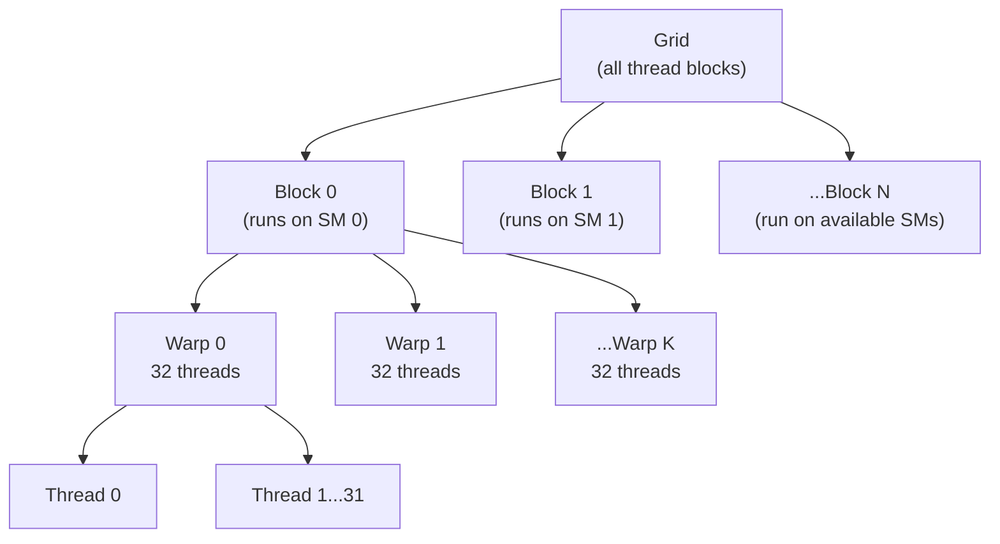
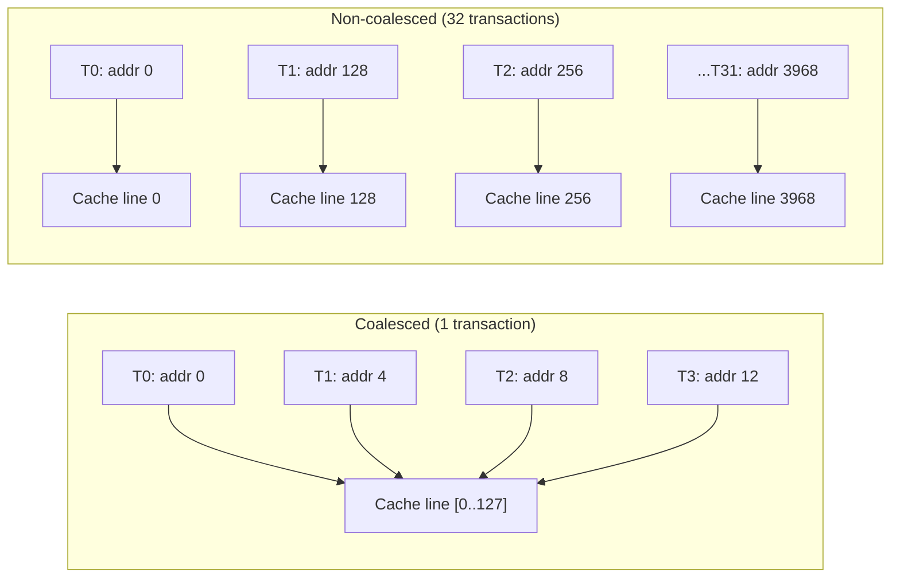

# 10 - GPUs and Accelerators

[toc]

> **TL;DR:** GPUs are throughput-optimised processors that achieve massive parallelism by running thousands of threads simultaneously under the SIMT (Single Instruction, Multiple Threads) execution model. Where a CPU optimises for single-thread latency with deep out-of-order pipelines and large caches, a GPU hides memory latency by switching between hundreds of ready warps. Tensor Cores and analogous matrix-multiply units on TPUs are fixed-function hardware that performs fused outer products orders of magnitude faster than general-purpose FP units — the reason every modern LLM trains on matrix-multiply accelerators rather than general CPUs. Understanding the memory hierarchy, warp scheduling, and coalescing rules on a GPU determines the gap between peak and achieved FLOPS.

## Vocabulary

**SIMT (Single Instruction, Multiple Threads)**: NVIDIA's execution model. A warp of 32 threads executes the same instruction at the same time, each on different data. Unlike SIMD, each thread has its own register file and program counter — threads can diverge, but diverged threads execute serially.

---

**Warp**: The unit of GPU scheduling. On NVIDIA GPUs: 32 threads. All threads in a warp execute the same instruction each cycle (when not diverged). The warp scheduler switches between warps each cycle to hide memory latency.

---

**Thread block (CTA — Cooperative Thread Array)**: A group of threads that execute on the same SM and can communicate via shared memory and synchronise with `__syncthreads()`.

---

**Grid**: The collection of all thread blocks launched by a kernel. Blocks are distributed across SMs by the GPU's hardware scheduler.

---

**SM (Streaming Multiprocessor)**: The fundamental compute unit of an NVIDIA GPU. Each SM has multiple CUDA cores (FP32 ALUs), tensor cores, a shared memory / L1 cache, a warp scheduler, and a register file. An A100 SXM has 108 SMs; an H100 has 132 SMs.

---

**Occupancy**: The ratio of active warps to the maximum number of warps an SM can support. Higher occupancy = more warps available to hide latency. Occupancy is limited by register and shared memory usage per thread block.

---

**Memory coalescing**: The property that all 32 threads in a warp access contiguous, aligned memory addresses simultaneously, allowing the memory controller to service all 32 accesses in a single transaction. Non-coalesced access causes 32 separate transactions — 32× lower bandwidth.

---

**HBM (High Bandwidth Memory)**: 3D-stacked DRAM placed next to the GPU die (or on the same package). HBM3 on H100: ~3.35 TB/s. LPDDR5 on a mobile CPU: ~50–100 GB/s. The 30–60× bandwidth advantage is why GPUs can sustain high memory throughput.

---

**Shared memory (SRAM scratchpad)**: Fast on-chip memory shared among threads within a thread block. Programmer-managed (unlike CPU caches). On-chip latency ~5 cycles. Used as a manually-managed L1 to stage data for reuse.

---

**Global memory**: The main GPU DRAM (HBM). All threads access it; it is slow relative to shared memory. Coalescing is critical to achieving high bandwidth.

---

**Tensor Core**: NVIDIA's fixed-function matrix-multiply unit. Computes D = A×B + C for small tile matrices (e.g. 16×16×16 in FP16/BF16). Each Tensor Core performs 256 FP16 FMA operations per clock cycle (H100 4th gen). An H100 SXM has 528 Tensor Cores.

---

**CUDA core**: A general-purpose FP32/INT32 ALU in an SM. Performs one FP32 FMA per cycle. Slower than Tensor Cores for matrix workloads; used for non-matmul operations (activations, normalization, indexing).

---

**Roofline model**: A performance model that identifies whether a kernel is compute-bound or memory-bandwidth-bound, based on its arithmetic intensity (FLOPs / byte transferred).

---

**Arithmetic intensity (AI)**: FLOPs per byte of memory bandwidth consumed. Low AI = memory-bound; high AI = compute-bound. Tensor Core GEMM: AI ≈ N/4 for N×N square matrices (for float16).

---

**TPU (Tensor Processing Unit)**: Google's custom ASIC for matrix multiply. Uses a systolic array of multiply-accumulate units. TPU v4: 275 TFLOPS per chip in bfloat16. Highly specialised; less programmable than GPUs.

---

**Warp divergence**: When threads in a warp take different branches. The warp must execute both paths serially (masking the inactive threads on each path). Reduces effective throughput proportionally to the divergence ratio.

---

## Intuition

A CPU is like a team of 8 expert surgeons — each one can perform any operation with high skill, and the team is optimised so each surgeon has all the specialised tools they need immediately (deep caches, sophisticated branch predictors). A GPU is like a team of 10,000 assembly-line workers — each one does one simple operation, but by working in parallel on different data elements, they accomplish far more total work per second for regular, data-parallel tasks.

The SIMT model is the hardware scheduler's trick for managing 10,000 workers. Rather than having 10,000 separate execution lanes with separate instruction decoders, it groups workers into warp batches of 32 and issues one instruction per warp. Workers in the warp do different data but the same operation — like all 32 workers on an assembly line tightening the same bolt on different car frames simultaneously.

The Tensor Core is the assembly line's specialised "bolt-tightening machine" for matrix multiply — a fixed-function unit that is orders of magnitude faster per operation than a general-purpose ALU, but useless for anything other than small matrix multiplications.

## SIMT Execution Model

### Warps and Thread Blocks

When a CUDA kernel is launched, threads are organised into a hierarchy: threads → warps → thread blocks → grid.



**Figure:** CUDA execution hierarchy. SMs execute blocks; each block's threads are grouped into warps of 32 for actual execution.

Each thread in a warp has its own:
- Register file slice (dedicated registers per thread, not shared)
- Predicate / mask register (for divergence handling)
- Program counter (conceptually — physically the warp has one PC, advanced per instruction)

The warp scheduler inside each SM holds many active warps and selects a ready warp to issue each cycle. "Ready" means the warp has no outstanding memory operation or dependency. This is the key latency-hiding mechanism: while Warp 0 waits 200+ cycles for an HBM access, the scheduler issues instructions for Warps 1–32, keeping the ALUs busy.

### Warp Divergence

When a `if (threadIdx.x % 2 == 0)` branch is taken by some threads in a warp but not others, the warp *diverges*. The hardware uses a predicate mask to disable threads that are not on the current path, and executes both paths serially:

```
Warp executes if-branch (threads 0,2,4,...30 active, threads 1,3,...31 masked off)
Warp executes else-branch (threads 1,3,...31 active, threads 0,2,...30 masked off)
```

Two serial executions for one branch → 50% throughput loss for this warp. Divergence within a warp is costly; divergence at the block level (different blocks taking different paths) is free (different blocks run on different SMs independently).

> [!WARNING]
> Warp divergence is the GPU's analogue of a branch misprediction — except the penalty is proportional to the degree of divergence, not a fixed penalty. A warp with `if (threadIdx.x < 16)` has 2-way divergence (50% throughput). A warp with `switch (threadIdx.x % 32)` has 32-way divergence (near-zero throughput). Kernels that branch on per-thread data should restructure to minimise divergence within a warp.

### Memory Coalescing

A warp of 32 threads issuing a global memory load should access 32 consecutive 4-byte words (128 bytes total = two cache lines). If all 32 threads access consecutive addresses, the memory controller services all 32 threads in one or two transactions. If threads access scattered addresses, each thread may require a separate transaction — 32× the bandwidth.

**Coalesced access:** `data[threadIdx.x]` — thread i accesses index i. All 32 threads in a warp access a 128-byte aligned range simultaneously. One memory transaction.

**Non-coalesced access:** `data[threadIdx.x * stride]` with large stride, or `data[permuted_index[threadIdx.x]]` — each thread accesses a different cache line. 32 separate transactions. 32× bandwidth penalty.



**Figure:** Memory coalescing. Coalesced access (left) issues one cache-line transaction for the entire warp. Scattered access (right) issues 32 separate transactions.

## Tensor Cores

### What a Tensor Core Computes

Each NVIDIA Tensor Core performs a small matrix-multiply-accumulate (WMMA): D = A × B + C, where A, B are small matrices (e.g. 16×16) in reduced precision (FP16, BF16, TF32, INT8, FP8) and C, D are in accumulation precision (FP32 or FP16).

On the H100, a single Tensor Core performs 256 FP16 FMA operations per cycle (a 16×16×16 WMMA). With 4 Tensor Cores per SM and 132 SMs per chip, and a ~2 GHz clock: peak FP16 Tensor Core throughput ≈ 4 × 132 × 256 × 2 GHz × 2 (FMA = 2 ops) ≈ **2000+ TFLOPS**. This is ~16× more FP16 throughput than the CUDA cores alone.

### Why ML Loves Tensor Cores

A transformer forward pass is dominated by matrix multiplications: Q×Kᵀ, attention×V, all the linear projection layers (W_q, W_k, W_v, W_o, FFN weights). These are all GEMMs (General Matrix Multiplications). Tensor Cores are specifically designed for GEMM — they compute the outer product of a column of A and a row of B in one clock cycle using a systolic-array-like dataflow.

The practical implication: a naive PyTorch matmul using CUDA cores might achieve 100 TFLOPS on H100; the same matmul via cuBLAS (which uses Tensor Cores) achieves 2000+ TFLOPS. Tensor Cores are only triggered when matrix dimensions are multiples of 16 (for FP16) and data is in the right layout (row-major for A, column-major for B, or uses the CUTLASS library conventions). This is why transformer model dimensions are always multiples of 64 or 128 — padding to multiples of the Tensor Core tile size ensures near-100% Tensor Core utilisation.

> [!IMPORTANT]
> Tensor Cores require input matrices in specific memory layouts and sizes. For FP16 on A100/H100: matrices must have dimensions that are multiples of 16 (for correct tiling), preferably multiples of 64 or 128 for peak efficiency. If your batch size or sequence length is not a multiple of 8/16, you are leaving significant performance on the table. PyTorch's `torch.backends.cuda.matmul.allow_tf32 = True` and `torch.set_float32_matmul_precision('high')` enable TF32 Tensor Core mode for FP32 matmuls, which provides ~10× speedup with negligible precision loss for training.

## GPU Memory Hierarchy

```
┌─────────────────────────────────────────────────────────────┐
│ Thread: Registers                                           │
│   ~255 registers × 32 bits per thread                      │
│   ~0 cycles access                                          │
├─────────────────────────────────────────────────────────────┤
│ Thread Block: Shared Memory / L1 Cache (on-chip SRAM)       │
│   A100: 164 KB per SM (configurable shared/L1 split)        │
│   ~32 cycles for shared memory bank conflicts               │
│   ~5 cycles normal access                                   │
├─────────────────────────────────────────────────────────────┤
│ All SMs: L2 Cache                                           │
│   A100: 40 MB; H100: 50 MB                                 │
│   ~200 cycles                                               │
├─────────────────────────────────────────────────────────────┤
│ GPU: HBM3 (Global Memory)                                   │
│   A100: 80 GB, 2 TB/s; H100 SXM: 80 GB, 3.35 TB/s        │
│   ~600–800 cycles                                           │
├─────────────────────────────────────────────────────────────┤
│ Host: CPU DRAM (PCIe / NVLink)                              │
│   PCIe 5.0 x16: ~64 GB/s; NVLink 4.0: ~900 GB/s           │
│   >>1000 cycles latency                                     │
└─────────────────────────────────────────────────────────────┘
```

The key insight: HBM is 30–60× faster bandwidth than CPU DRAM (~3.35 TB/s vs ~100 GB/s), but still 100× slower than on-chip shared memory. FlashAttention's core contribution is restructuring the attention computation to keep the working set in on-chip SRAM, avoiding repeated round-trips to HBM.

## GPU vs TPU vs CPU for ML

| Feature | CPU (Intel Raptor Lake) | GPU (H100 SXM) | TPU v4 |
| :--- | :---: | :---: | :---: |
| BF16 peak TFLOPS | ~2 | ~2,000 | ~275 |
| Memory bandwidth | ~100 GB/s | 3.35 TB/s | ~1.2 TB/s |
| Memory capacity | 128–2048 GB (DDR5) | 80 GB (HBM3) | 32 GB (HBM2e) |
| Programmability | Fully general | CUDA/ROCm | XLA/JAX only |
| Energy per TFLOP | very high | moderate | low |
| Interconnect | PCIe/UPI | NVLink 900 GB/s | ICI 1.2 Tb/s |

CPUs are the right choice for: inference with small batch size, latency-critical requests, arbitrary control flow, mixed datatypes.

GPUs are the right choice for: all large-scale training, batched inference with regular shapes, any workload where arithmetic intensity > 10 FLOPS/byte.

TPUs are the right choice for: training at Google scale on JAX/TensorFlow, workloads with very regular shapes, energy-efficient inference at massive scale.

## Real-world Example

The following CUDA code demonstrates coalesced vs non-coalesced memory access and shows how to use shared memory as a manually-managed cache for a matrix transpose.

```cuda
#include <stdio.h>
#include <cuda_runtime.h>

#define TILE_DIM 32
#define BLOCK_ROWS 8
#define N 4096

/* Non-coalesced transpose: each thread reads a coalesced row but writes a non-coalesced column */
__global__ void transpose_naive(float *out, const float *in, int n) {
    int x = blockIdx.x * TILE_DIM + threadIdx.x;
    int y = blockIdx.y * TILE_DIM + threadIdx.y;
    for (int i = 0; i < TILE_DIM; i += BLOCK_ROWS)
        out[x * n + (y + i)] = in[(y + i) * n + x];  // write is non-coalesced!
}

/* Coalesced transpose using shared memory tile as a staging buffer */
__global__ void transpose_shared(float *out, const float *in, int n) {
    __shared__ float tile[TILE_DIM][TILE_DIM + 1];  // +1 to avoid bank conflicts

    int x = blockIdx.x * TILE_DIM + threadIdx.x;
    int y = blockIdx.y * TILE_DIM + threadIdx.y;

    /* Coalesced read from global memory into shared memory tile */
    for (int i = 0; i < TILE_DIM; i += BLOCK_ROWS)
        tile[threadIdx.y + i][threadIdx.x] = in[(y + i) * n + x];  // coalesced read!

    __syncthreads();  /* ensure all threads have loaded their portion */

    /* Swap block indices for transposed write */
    x = blockIdx.y * TILE_DIM + threadIdx.x;
    y = blockIdx.x * TILE_DIM + threadIdx.y;

    /* Coalesced write from shared memory to global memory */
    for (int i = 0; i < TILE_DIM; i += BLOCK_ROWS)
        out[(y + i) * n + x] = tile[threadIdx.x][threadIdx.y + i];  // coalesced write!
}

int main(void) {
    float *d_in, *d_out;
    size_t bytes = N * N * sizeof(float);

    cudaMalloc(&d_in, bytes);
    cudaMalloc(&d_out, bytes);

    /* Init (omitted for brevity) */

    dim3 grid(N / TILE_DIM, N / TILE_DIM);
    dim3 block(TILE_DIM, BLOCK_ROWS);

    /* Warm up + benchmark naive */
    cudaEvent_t t0, t1;
    cudaEventCreate(&t0); cudaEventCreate(&t1);

    transpose_naive<<<grid, block>>>(d_out, d_in, N);  /* warmup */
    cudaEventRecord(t0);
    for (int i = 0; i < 100; i++)
        transpose_naive<<<grid, block>>>(d_out, d_in, N);
    cudaEventRecord(t1);
    cudaEventSynchronize(t1);
    float ms_naive;
    cudaEventElapsedTime(&ms_naive, t0, t1);

    /* Benchmark shared memory version */
    transpose_shared<<<grid, block>>>(d_out, d_in, N);  /* warmup */
    cudaEventRecord(t0);
    for (int i = 0; i < 100; i++)
        transpose_shared<<<grid, block>>>(d_out, d_in, N);
    cudaEventRecord(t1);
    cudaEventSynchronize(t1);
    float ms_shared;
    cudaEventElapsedTime(&ms_shared, t0, t1);

    float bw_naive  = 2.0f * bytes * 100 / (ms_naive  * 1e6);  /* GB/s */
    float bw_shared = 2.0f * bytes * 100 / (ms_shared * 1e6);

    printf("Naive (non-coalesced): %.1f ms/iter, %.1f GB/s\n",
           ms_naive/100, bw_naive);
    printf("Shared memory (coalesced): %.1f ms/iter, %.1f GB/s\n",
           ms_shared/100, bw_shared);
    printf("Speedup: %.1fx\n", bw_shared / bw_naive);
    /* Expected on A100: naive ~300 GB/s, shared ~2500 GB/s, ~8x speedup */

    cudaFree(d_in); cudaFree(d_out);
    return 0;
}
```

> [!TIP]
> The `+1` padding in `__shared__ float tile[TILE_DIM][TILE_DIM + 1]` deserves explanation. Shared memory is organised into 32 banks of 4-byte words. A bank conflict occurs when multiple threads in a warp access different addresses in the same bank simultaneously (they are serialised). Without padding, threads in a warp accessing `tile[*][j]` for the same j all access the same bank (stride = TILE_DIM = 32 words = 32 banks → all same bank). With +1 padding, the stride becomes 33, breaking the alignment and eliminating bank conflicts.

Compile: `nvcc -O3 -o transpose transpose.cu && ./transpose`

## In Practice

### Roofline Model for GPU Kernels

The roofline model plots achievable FLOPS against arithmetic intensity (FLOPs per byte). Two bounds:
1. **Compute bound:** throughput ≤ peak FLOPS (e.g. 2000 TFLOPS for H100 FP16)
2. **Memory bandwidth bound:** throughput ≤ bandwidth × AI (e.g. 3.35 TB/s × AI)

The roofline for H100 FP16:
```
At AI < 2000/3350 ≈ 0.6 FLOP/byte: memory-bandwidth bound
At AI > 0.6 FLOP/byte: compute bound
```

A matrix-vector product (MxV, batch size 1) has AI ≈ M×K / (M×K + M + K) bytes × 4 bytes ≈ 1 FLOP/4 bytes = 0.25 FLOP/byte — memory-bandwidth bound. Inference with batch_size=1 is always memory-bound.

A matrix-matrix product (GeMM, batch size B) has AI ≈ 2×M×N×K / (M×K + K×N + M×N) × bytes. For square matrices of size N: AI ≈ N/3 FLOP/byte. For N=4096: AI ≈ 1365 FLOP/byte — strongly compute-bound.

This is why batching inference requests is critical for GPU utilisation: larger batch sizes increase arithmetic intensity and shift the workload from memory-bound to compute-bound.

### FlashAttention: A Memory Hierarchy Optimisation

Standard attention computes `softmax(QKᵀ / sqrt(d_k)) × V`. For a sequence length of 4096, the QKᵀ matrix is 4096×4096×4 bytes = 64 MB. This must be written to and read from HBM, costing 2 × 64 MB / 3.35 TB/s ≈ 38 µs of memory time — not counting compute.

FlashAttention (Dao et al., 2022) tiles the computation so that the QKᵀ matrix is computed and consumed in on-chip SRAM (164 KB per SM), never materialised in HBM. The I/O complexity drops from O(N²) to O(N) in HBM traffic. Result: ~7× faster attention, with sublinear memory usage. This is entirely a memory hierarchy optimisation — the algorithm computes the same function.

## Pitfalls

- **"More CUDA cores = faster."** — Tensor Core FLOPS dominate any compute-bound kernel. An H100 has fewer CUDA cores than some older lower-end GPUs but is 10–20× faster for matrix operations because it has far more Tensor Core throughput. Always distinguish CUDA core FLOPS from Tensor Core FLOPS in spec comparisons.
- **"Occupancy is the most important metric."** — High occupancy helps hide memory latency, but the optimal occupancy depends on the kernel. A kernel with high register pressure may have low occupancy (few active warps) but still be compute-bound on the Tensor Cores — which don't need latency hiding. Profiling with `ncu` (Nsight Compute) reveals whether memory latency or compute throughput is the actual bottleneck.
- **"GPUs have faster memory than CPUs."** — GPU HBM bandwidth (3.35 TB/s) is far higher than CPU DRAM bandwidth (~100 GB/s). But GPU HBM capacity is small (80 GB for H100 vs terabytes for a server). Inference on very large models (>80 GB) requires model parallelism or quantisation to fit on a single GPU.
- **"CUDA and SIMD are the same idea."** — Related but different. SIMD (x86 AVX-512) is a hardware extension to the scalar ISA: one instruction, 16 FP32 operations, no independent thread state. SIMT groups 32 independent threads with independent register state, executing the same instruction together. SIMT is much more flexible (threads can diverge, each has its own address calculation); SIMD is more efficient (no thread management overhead, no divergence cost).

## Exercises

### Exercise 1: Warp occupancy calculation

An H100 SM supports 64 warps maximum (2048 threads / 32 threads per warp). A kernel uses 64 registers per thread and 32 KB of shared memory per thread block of 256 threads.

Given:
- Register file per SM: 65536 registers (32-bit)
- Maximum shared memory per SM: 228 KB
- Maximum threads per SM: 2048

(a) How many thread blocks can run simultaneously on one SM (register-limited)?
(b) How many thread blocks can run simultaneously (shared-memory-limited)?
(c) What is the actual occupancy?

#### Solution

**(a) Register-limited:**
Registers per block = 256 threads × 64 registers = 16,384 registers.
Blocks per SM = floor(65,536 / 16,384) = **4 blocks** = 4 × 256 = 1024 threads = 32 warps.
Occupancy = 32 / 64 = **50%**.

**(b) Shared-memory-limited:**
Shared memory per block = 32 KB.
Blocks per SM = floor(228 KB / 32 KB) = **7 blocks** = 7 × 256 = 1792 threads = 56 warps.
Occupancy (shared-memory limited) = 56 / 64 = **87.5%**.

**(c) Actual occupancy:**
The binding constraint is the most restrictive: registers limit to 4 blocks, shared memory allows 7. The actual limit is **4 blocks** (register-bound). Actual occupancy = 4 × 256 / 2048 = **50%**.

To improve occupancy: reduce register usage (e.g. `-maxrregcount 48` in NVCC) or reduce shared memory per block. However, reducing registers may force more memory spills (register to local memory) — always profile to ensure the change helps overall throughput.

---

### Exercise 2: Coalescing analysis

A CUDA kernel has 256 threads per block. Thread `i` accesses global memory at address `base + i * stride`. For each stride, determine if access is coalesced.

(a) stride = 1 (consecutive)
(b) stride = 2 (every other word)
(c) stride = 32 (one per warp-width)
(d) stride = 1, but base address is not 128-byte aligned

#### Solution

A warp of 32 threads (indices 0–31 within the warp) accesses addresses `base + i*stride` for i in [warp_start .. warp_start+31].

**(a) stride=1:** Threads 0–31 access base+0, base+4, base+8, ..., base+124. This is 32 consecutive 4-byte words = 128 bytes contiguous → **fully coalesced, 1 transaction**.

**(b) stride=2:** Threads 0–31 access base+0, base+8, base+16, ..., base+248. Every other 4-byte word is accessed → 256 bytes total range, but only 128 bytes needed (32 × 4B). The memory controller may still service this in 2 transactions (two 128-byte cache lines). Whether it counts as coalesced depends on GPU generation; on modern GPUs, this is **partially coalesced, ~2 transactions**. Effective bandwidth: ~50% of fully coalesced.

**(c) stride=32:** Threads 0–31 access base+0, base+128, base+256, ..., base+31×128. Each access is to a different 128-byte cache line → **32 separate transactions = completely non-coalesced**. Effective bandwidth: 1/32 of peak.

**(d) stride=1, unaligned base:** If base is offset by 64 bytes from a 128-byte boundary, the 128 bytes of warp access spans two cache lines (bytes 64–192). The GPU issues 2 transactions (two cache lines) instead of 1 → **2 transactions, 50% efficiency** relative to aligned access.

**Lesson:** Always ensure: (1) stride-1 access patterns, and (2) the base address is 128-byte aligned for maximal coalescing.

---

### Exercise 3: Arithmetic intensity and roofline

A transformer's feedforward layer computes `Y = GELU(X @ W1.T) @ W2.T` where X is [B, S, d_model], W1 is [d_ff, d_model], W2 is [d_model, d_ff]. Assume B=32, S=2048, d_model=4096, d_ff=16384. All in BF16 (2 bytes).

(a) How many FLOPs does the first matmul (X @ W1.T) perform?
(b) How many bytes are read/written?
(c) What is the arithmetic intensity?
(d) Is this compute-bound or memory-bound on H100 (3.35 TB/s bandwidth, 2000 TFLOPS BF16)?

#### Solution

X shape: [32, 2048, 4096] = B×S×d_model.
W1 shape: [16384, 4096] = d_ff × d_model.
Output shape: [32, 2048, 16384].

Treat as a batch of B=32 matmuls, each [S, d_model] × [d_model, d_ff].

**(a) FLOPs:**
One matmul [S × d_model] × [d_model × d_ff] = 2 × S × d_model × d_ff FLOPs.
= 2 × 2048 × 4096 × 16384 = 2 × 1.374 × 10^11 ≈ 2.748 × 10^11 FLOPs per sample.
Times B=32: **total = 8.79 × 10^12 FLOPs = ~8.8 TFLOPS (per forward pass, first FFN matmul).**

**(b) Bytes read/written (BF16, 2 bytes each):**
- Read X: 32 × 2048 × 4096 × 2 = 536 MB
- Read W1: 16384 × 4096 × 2 = 134 MB
- Write output: 32 × 2048 × 16384 × 2 = 2147 MB
- Total: ~2817 MB ≈ **2.8 GB**

**(c) Arithmetic intensity:**
AI = 8.8 × 10^12 FLOPs / 2.8 × 10^9 bytes = **~3143 FLOPS/byte**

**(d) Roofline:**
H100 bandwidth ridge: 2000 TFLOPS / 3.35 TB/s ≈ 597 FLOPS/byte.
AI = 3143 >> 597 → **strongly compute-bound**.

At 2000 TFLOPS: time = 8.8 × 10^12 / 2 × 10^15 = **4.4 ms** (ideal, 100% Tensor Core utilisation).
In practice with cuBLAS: ~5–7 ms (80–88% efficiency for large, well-shaped GEMMs).

---

### Exercise 4: FlashAttention memory savings

Standard attention for sequence length N and head dimension d_k requires O(N²) HBM memory for the attention matrix. FlashAttention reduces this to O(N). Quantify the HBM memory savings for:
- N = 128K tokens, d_k = 128, BF16

#### Solution

**Standard attention:**
The attention score matrix QKᵀ is [N, N] = 128K × 128K = 16.384 × 10^9 elements × 2 bytes = **32 GB** just for one attention head. For a model with H=40 heads: 32 × 40 = 1.28 TB — vastly exceeding H100's 80 GB.

Standard attention is infeasible at N=128K without modification.

**FlashAttention:**
FlashAttention never materialises the full [N, N] matrix. It tiles the computation using SRAM tiles of size M (on-chip shared memory). The HBM usage for the attention computation is:
- Q, K, V matrices: N × d_k × 3 × 2 bytes = 128K × 128 × 3 × 2 = 96 MB per head
- Output: N × d_k × 2 bytes = 32 MB per head
- Total per head: ~128 MB
- For 40 heads: 5.12 GB — fits comfortably in 80 GB HBM.

**Memory savings:** 32 GB → ~128 MB per head = **250× reduction per attention head**. This is why FlashAttention enables 128K+ context lengths that would otherwise be impossible due to memory constraints.

## Sources

- NVIDIA. "NVIDIA H100 Tensor Core GPU Architecture." NVIDIA Technical Blog. https://resources.nvidia.com/en-us-tensor-core
- Dao, T. et al. (2022). "FlashAttention: Fast and Memory-Efficient Exact Attention with IO-Awareness." NeurIPS 2022. https://arxiv.org/abs/2205.14135
- Dao, T. et al. (2023). "FlashAttention-2: Faster Attention with Better Parallelism and Work Partitioning." ICLR 2024. https://arxiv.org/abs/2307.08691
- Jouppi, N. P. et al. (2017). "In-Datacenter Performance Analysis of a Tensor Processing Unit." ISCA 2017. https://dl.acm.org/doi/10.1145/3079856.3080246
- NVIDIA CUDA Programming Guide. https://docs.nvidia.com/cuda/cuda-c-programming-guide/
- Williams, S., Waterman, A., & Patterson, D. (2009). "Roofline: An Insightful Visual Performance Model." *Communications of the ACM*, 52(4), 65–76. https://dl.acm.org/doi/10.1145/1498765.1498785

## Related

- [9 - Multicore, SMP, and Cache Coherence](./9-multicore-smp-and-cache-coherence.md)
- [8 - IO, Storage, and Buses](./8-io-storage-and-buses.md)
- [6 - Memory Hierarchy and Caches](./6-memory-hierarchy-and-caches.md)
- [11 - Performance Analysis](./11-performance-analysis.md)
