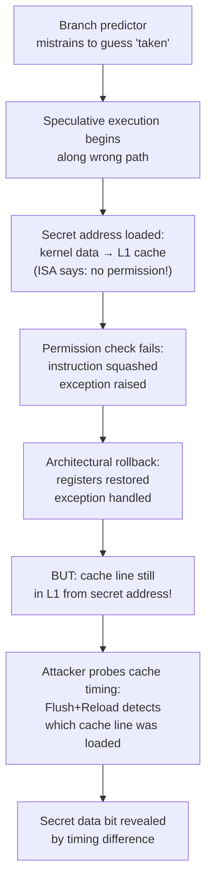

# 12 - Security in Architecture

[toc]

> **TL;DR:** Modern CPU security vulnerabilities arise from the gap between the ISA's sequential semantics and the microarchitecture's aggressive optimisations — speculative execution, out-of-order pipelines, and shared caches. Spectre and Meltdown (2018) showed that speculatively executed instructions leave observable microarchitectural footprints (cache state changes) even after being squashed, allowing attackers to read arbitrary memory. Defences — ASLR, NX, CFI, SMEP/SMAP, KPTI — each address a specific attack vector. Understanding these vulnerabilities requires understanding the microarchitecture deeply: they exist precisely because the hardware does more than the ISA describes.

## Vocabulary

**Side channel**: An information leak that does not use the intended data interface. A CPU cache timing side channel uses the time difference between a cache hit (~4 cycles) and a cache miss (~300 cycles) to infer which addresses were recently accessed.

---

**Covert channel**: A side channel used intentionally between two processes to communicate information through a shared medium (e.g. cache state) that is not intended for inter-process communication.

---

**Spectre (CVE-2017-5753, 5715)**: A class of vulnerabilities exploiting speculative execution: an attacker trains the branch predictor to mispredict, causing the victim to speculatively execute code that accesses secret data and leaks it via a cache covert channel. Affects virtually all out-of-order CPUs.

---

**Meltdown (CVE-2017-5754)**: A vulnerability exploiting out-of-order execution to read kernel memory from user space. The CPU transiently executes a load of kernel memory (forbidden by page-table permissions) before the permission check raises a fault, leaving the accessed cache line in the cache. x86-64 specific (ARM affected for some variants); fixed by KPTI.

---

**Transient execution**: Instructions that execute in the CPU's out-of-order engine but are ultimately squashed (not committed) due to a mispredicted branch, exception, or other rollback. Transient instructions do leave microarchitectural side effects (cache state).

---

**Flush+Reload**: The most common cache timing attack primitive. Attacker flushes a shared cache line (`CLFLUSH`), victim accesses it (or not), attacker reloads — timing reveals whether victim accessed the line.

---

**ASLR (Address Space Layout Randomisation)**: An OS mitigation that randomises the base addresses of the stack, heap, libraries, and executable at process load time. Prevents attackers from knowing absolute addresses required for code injection.

---

**NX bit (No-eXecute bit)**: A hardware-enforced page permission bit that marks data pages as non-executable. Prevents shellcode injected into the stack or heap from being executed. AMD calls it NX; Intel calls it XD (eXecute Disable); ARM calls it XN (eXecute Never).

---

**Stack canary**: A random value placed between the return address and local variables on the stack. Checked before function return; a buffer overflow that overwrites the return address also corrupts the canary, triggering a program abort.

---

**DEP (Data Execution Prevention)**: The OS/hardware mechanism enforcing NX for user-mode processes. Windows equivalent of NX+ASLR.

---

**CFI (Control Flow Integrity)**: A compiler+hardware technique that restricts where indirect branches (via function pointers, `call *reg`, `ret`) can jump. Prevents ROP (Return-Oriented Programming) and JOP attacks that chain together existing code gadgets.

---

**SMEP (Supervisor Mode Execution Prevention)**: CPU feature (Intel Ivy Bridge+, ARM) that prevents the kernel (ring 0) from executing code at user-space virtual addresses. Prevents kernel exploits that redirect execution into attacker-controlled user memory.

---

**SMAP (Supervisor Mode Access Prevention)**: CPU feature that prevents the kernel from reading/writing user-space memory without explicitly enabling it (via `STAC`/`CLAC` instructions). Prevents kernel pointer dereference vulnerabilities.

---

**KPTI (Kernel Page Table Isolation)**: Linux mitigation for Meltdown. Maintains two page tables per process: a minimal user-mode table (no kernel mappings) and a full kernel table. CR3 is switched on every syscall/interrupt. Cost: 5–30% overhead on syscall-heavy workloads, mitigated by PCID.

---

**Retpoline**: A compiler mitigation for Spectre variant 2 (branch target injection). Replaces indirect jumps with a trampoline that prevents the branch predictor from being trained to mispredict to an attacker-controlled target.

---

**Intel SGX (Software Guard Extensions)**: CPU extensions that create hardware-isolated enclaves — regions of encrypted, integrity-protected memory that even the OS and hypervisor cannot read. Used for confidential computing, remote attestation.

---

**Rowhammer**: A DRAM vulnerability where repeatedly reading rows of DRAM causes bit-flips in adjacent rows (due to capacitor charge leakage). Can be used to flip a page-table entry from a user process and elevate privileges.

---

## Intuition

Modern CPU security vulnerabilities are a direct consequence of the ISA abstraction being incomplete. The ISA promises sequential semantics — each instruction appears to execute atomically before the next begins. The microarchitecture delivers this promise for *correctness* (committed state) but not for *timing and side effects* (cache state, branch predictor state, TLB state). The hardware silently leaks information through these microarchitectural state changes even when executing instructions that are immediately squashed.

Spectre is the elegant villain: it does not break the ISA's correctness guarantee. After a misprediction is detected, the processor rolls back register state and memory state perfectly. But it cannot roll back the cache state — the speculative load that read a secret brought that secret's cache line into L1, where it remains detectable via timing even after the speculative code is squashed. The information left the CPU; you just need to know how to read it.



**Figure:** Meltdown attack flow. Speculative execution violates permission semantics transiently; the cache side channel makes this observable.

## Spectre in Detail

Spectre variant 1 (bounds check bypass) exploits the branch predictor. The canonical code pattern:

```c
// Victim code (e.g. in the kernel or a JIT VM):
if (x < array1_size) {         // bounds check
    y = array2[array1[x] * 512];   // access pattern that encodes data
}
```

An attacker:
1. **Trains the branch predictor:** Calls the victim many times with valid x (in-bounds), so the branch predictor confidently predicts `x < array1_size` is true.
2. **Flushes cache:** Flushes `array1_size` from cache so the bounds check takes ~200+ cycles (DRAM miss).
3. **Passes malicious x:** Calls victim with x pointing outside `array1` — into secret memory (e.g. a kernel password hash or another process's memory).
4. **Branch predictor fires:** While waiting for the bounds check load (~200 cycles), the CPU speculatively executes the body with x = malicious.
5. **Secret data is loaded:** `array1[x]` reads the secret byte b (e.g. b = 0x42 = 66). `array2[b * 512]` is loaded into cache.
6. **Exception fires:** Bounds check resolves: x is out of bounds → exception. Speculative results squashed.
7. **Timing probe:** Attacker probes `array2[0..255*512]` for each possible byte. `array2[66*512]` hits L1 (~4 cycles); all others miss (~300 cycles). **Attacker reads b = 0x42 from timing alone.**

> [!CAUTION]
> Spectre is not fully patchable in software. Every indirect branch is a potential training target; every speculative load in a victim context is a potential leak. The complete mitigations require: (a) retpoline for indirect branches, (b) `LFENCE` barriers to serialise sensitive branches, (c) index masking to prevent out-of-bounds loads, (d) microcode updates (IBRS, STIBP) for cross-process predictor isolation. These mitigations cost 5–35% on workloads with many indirect branches or syscalls. There is no free fix for speculative execution side channels.

## Meltdown in Detail

Meltdown exploits the window between a memory access and its permission check in the out-of-order pipeline. On x86-64 (before KPTI), the kernel's virtual address space was mapped into every process's page table — marked supervisor-only (ring 0 only). The kernel mapping existed for performance reasons (syscall/interrupt handling doesn't need to reload page tables).

An attacker process:
1. Issues `MOV RAX, [kernel_address]` — a load of a supervisor-only address.
2. The MMU permission check takes several cycles. During this time, the out-of-order engine continues with `MOV RBX, array2[RAX * 512]` speculatively.
3. The secret byte `RAX` is used to index `array2`, loading the corresponding cache line.
4. Permission violation fires: `MOV RAX, [kernel_address]` causes a `#PF` (page fault). Exception handled; RAX is set to 0.
5. **But** `array2[secret * 512]` is in cache.
6. Attacker times all 256 possible `array2[i*512]` entries → determines the secret byte.

**Fix:** KPTI removes kernel mappings from the user-mode page table entirely. After KPTI, `MOV RAX, [kernel_address]` immediately faults before any speculative load can proceed, because the PTE is not present in the user-mode table. The CPU cannot even begin speculating because the address is unmapped.

KPTI performance cost: every syscall and interrupt requires a CR3 switch (loading a new page table base). On PCID-capable CPUs, the old PCID is preserved so TLB entries survive — the cost drops to ~50 ns per context switch vs ~500 ns without PCID.

## Hardware Security Primitives

### NX Bit and Data Execution Prevention

Before NX, an attacker who could write shellcode to the stack could also execute it — there was no hardware distinction between data pages and code pages. NX marks stack and heap pages as non-executable at the PTE level. A branch to a non-executable page raises a fault.

NX is the foundation of all modern exploit mitigations. ASLR, stack canaries, and CFI all build on top of NX.

> [!NOTE]
> NX alone is insufficient. JIT compilers (JVMs, V8, LLVM JIT) must allocate executable memory at runtime. They do so via `mmap(PROT_READ | PROT_EXEC)` or `mprotect()`. An attacker who can write into a JIT-compiled page can still execute arbitrary code. Modern JIT engines use write-xor-execute (W^X) policies: a page is either writable or executable, never both simultaneously.

### ASLR

ASLR randomises the virtual addresses of:
- The main executable (PIE — Position Independent Executable)
- The stack (random base)
- The heap (random base)
- Shared libraries (random mmap base)

Without knowing these addresses, an attacker cannot hardcode a return address or gadget address. ASLR is most effective when combined with NX: NX prevents direct shellcode execution; ASLR prevents ROP attacks where gadgets need known addresses.

ASLR entropy varies by architecture: 32-bit x86 has ~16 bits of entropy (65536 possible locations — brute-forceable in seconds); 64-bit has 28–40 bits (too many to brute-force). 64-bit ASLR is a meaningful security control; 32-bit ASLR is weak.

### Control Flow Integrity (CFI)

ROP (Return-Oriented Programming) bypasses NX by chaining together existing executable code snippets ("gadgets") ending in `RET`. The attacker controls the stack to redirect returns through a sequence of gadgets that collectively execute malicious code — no shellcode needed, all existing code.

CFI counters ROP by restricting where indirect branches and returns can target:
- **Shadow stack (CET — Control-flow Enforcement Technology, Intel 11th gen+):** A separate, hardware-protected shadow stack stores return addresses. On `CALL`, the return address is pushed to both the regular stack and the shadow stack. On `RET`, the hardware verifies both match. If an attacker overwrites the return address on the regular stack, the mismatch is detected and execution halted.
- **IBT (Indirect Branch Tracking):** An `ENDBRANCH` instruction is placed at every legal indirect branch target in the binary. The CPU enforces that indirect jumps and calls only land on `ENDBRANCH` instructions. This eliminates "call-oriented programming" by restricting jump targets to compiler-marked safe destinations.

### SMEP and SMAP

SMEP (Supervisor Mode Execution Prevention) prevents ring-0 (kernel) code from executing instructions at user-space addresses. Historically, kernel exploits redirected the kernel to execute attacker-controlled shellcode in user memory. SMEP raises a fault if the kernel instruction pointer points to a user-space address.

SMAP (Supervisor Mode Access Prevention) prevents ring-0 from reading or writing user-space memory without explicit authorisation (`STAC`/`CLAC` instructions). This prevents a class of kernel pointer dereference bugs where the attacker places a fake kernel structure in user space and tricks the kernel into following a user pointer.

Together, SMEP+SMAP force attackers to work entirely within kernel space, dramatically reducing the attack surface.

## The Cache Timing Side Channel

Cache timing is the most powerful side channel and the basis for Spectre, Meltdown, and dozens of other attacks. The key measurement:

```c
// Flush+Reload primitive (x86-64):
static inline uint64_t rdtsc(void) {
    unsigned lo, hi;
    __asm__ volatile ("rdtsc" : "=a"(lo), "=d"(hi));
    return ((uint64_t)hi << 32) | lo;
}

static inline void flush(void *addr) {
    __asm__ volatile ("clflush (%0)" :: "r"(addr) : "memory");
}

/* Probe: measure access time to addr */
static inline uint64_t probe(void *addr) {
    uint64_t t0 = rdtsc();
    volatile uint8_t v = *(volatile uint8_t*)addr;
    (void)v;
    uint64_t t1 = rdtsc();
    return t1 - t0;
}
```

An access time < 50 cycles → cache hit (the address was recently accessed). An access time > 150 cycles → cache miss (not in cache). This binary signal (hit/miss) encodes one bit of information per probe; with a 256-entry array indexed by a secret byte, 8 bits per measurement are leaked.

## Real-world Example

The following C code demonstrates a Flush+Reload timing measurement — the minimal primitive underlying cache-based side channels.

```c
#define _GNU_SOURCE
#include <stdio.h>
#include <stdint.h>
#include <string.h>
#include <sched.h>
#include <time.h>

#define CACHE_LINE_SIZE 64
#define NUM_SLOTS 256

/* Each slot is on a separate cache line to avoid false positives */
static uint8_t probe_array[NUM_SLOTS * CACHE_LINE_SIZE];

static inline uint64_t rdtscp(void) {
    unsigned lo, hi, aux;
    __asm__ volatile("rdtscp" : "=a"(lo), "=d"(hi), "=c"(aux) :: "memory");
    return ((uint64_t)hi << 32) | lo;
}

static inline void flush(volatile void *addr) {
    __asm__ volatile("clflush (%0)" :: "r"(addr) : "memory");
}

/* Flush all probe slots from cache */
void flush_probe_array(void) {
    for (int i = 0; i < NUM_SLOTS; i++)
        flush(&probe_array[i * CACHE_LINE_SIZE]);
    /* Memory fence to ensure flushes complete */
    __asm__ volatile("mfence" ::: "memory");
}

/* Probe slot i: return timing in cycles */
uint64_t probe_slot(int i) {
    uint64_t t0 = rdtscp();
    __asm__ volatile("" ::: "memory");  /* prevent reordering */
    volatile uint8_t v = probe_array[i * CACHE_LINE_SIZE];
    (void)v;
    __asm__ volatile("" ::: "memory");
    uint64_t t1 = rdtscp();
    return t1 - t0;
}

/* Simulate a "victim" access that loads probe_array[secret * CACHE_LINE_SIZE] */
void victim_access(uint8_t secret) {
    volatile uint8_t v = probe_array[secret * CACHE_LINE_SIZE];
    (void)v;
}

int main(void) {
    const uint8_t SECRET = 0x42;  /* 'B' = 66 */

    /* Step 1: Flush entire probe array */
    flush_probe_array();

    /* Step 2: Victim accesses probe_array[SECRET * 64] */
    victim_access(SECRET);

    /* Step 3: Attacker probes all 256 slots */
    uint64_t times[NUM_SLOTS];
    /* Probe in random order to avoid hardware prefetcher learning the pattern */
    int order[NUM_SLOTS];
    for (int i = 0; i < NUM_SLOTS; i++) order[i] = i;
    /* Simple Fisher-Yates with a fixed seed for reproducibility */
    for (int i = NUM_SLOTS-1; i > 0; i--) {
        int j = (int)(rdtscp() % (i+1));
        int t = order[i]; order[i] = order[j]; order[j] = t;
    }
    for (int i = 0; i < NUM_SLOTS; i++)
        times[order[i]] = probe_slot(order[i]);

    /* Step 4: Find the minimum-time slot (cache hit = victim accessed it) */
    uint64_t min_time = UINT64_MAX;
    int guessed_secret = -1;
    for (int i = 0; i < NUM_SLOTS; i++) {
        if (times[i] < min_time) {
            min_time = times[i];
            guessed_secret = i;
        }
    }

    printf("True secret:    0x%02X (%d)\n", SECRET, SECRET);
    printf("Guessed secret: 0x%02X (%d) via cache timing\n",
           guessed_secret, guessed_secret);
    printf("Hit timing:     %lu cycles (cache hit threshold ~50 cycles)\n", min_time);
    printf("Status: %s\n", (guessed_secret == SECRET) ? "CORRECT" : "wrong");

    /* Print timing distribution */
    printf("\nCache hit slots (< 80 cycles):\n");
    for (int i = 0; i < NUM_SLOTS; i++)
        if (times[i] < 80)
            printf("  slot %3d: %lu cycles\n", i, times[i]);

    return 0;
}
```

> [!WARNING]
> The above code demonstrates a Flush+Reload timing measurement in a controlled, single-process scenario. The actual Spectre and Meltdown exploits additionally require: training the branch predictor, coordinating the victim's speculative execution, and dealing with noise in real environments. Running this code locally is educational; using these techniques against real systems or production software is illegal under the Computer Fraud and Abuse Act and equivalent laws. This is a research and education tool only.

Compile: `gcc -O2 -o flush_reload flush_reload.c && ./flush_reload`

## In Practice

### Mitigation Performance Costs (2025 Reality)

The security patches for Spectre/Meltdown have measurable overhead. Benchmarks from the Linux kernel community (2023–2025):

| Mitigation | Workload | Overhead |
| :--- | :--- | :---: |
| KPTI | Syscall-heavy (nginx) | 5–15% |
| KPTI + PCID | Syscall-heavy | 1–5% |
| Retpoline | Indirect-branch-heavy | 5–15% |
| IBRS | All (microcode) | 10–35% on Skylake |
| Enhanced IBRS (eIBRS) | All (Cascade Lake+) | 1–3% |
| MDS clear (buffer flush) | Per context switch | 1–5% |

Intel Cascade Lake and later processors include hardware fixes for Spectre variant 2 (eIBRS eliminates retpoline overhead) and Meltdown. AMD Zen+ and Zen 2 also include hardware mitigations for many variants. Legacy Skylake and Broadwell remain fully exposed without software mitigations.

### ML Inference and Security

ML inference services running in shared cloud environments face additional considerations:

- **Model stealing via timing:** A model exposed as an API can be partially reconstructed by measuring response latencies and using ML techniques to reverse-engineer the architecture. This is a cache-timing side channel at the model level.
- **Rowhammer and GPU memory:** Rowhammer-like bit-flip attacks have been demonstrated on GPU DRAM (DRAMHammer). In shared GPU environments (Kubernetes GPU sharing), a malicious container could flip bits in a co-tenant's model weights.
- **Confidential ML inference:** Intel TDX (Trust Domain Extensions) and AMD SEV-SNP provide hardware-encrypted VMs for confidential inference — the cloud provider cannot see the model weights or the inputs.

> [!NOTE]
> Meltdown was patched with KPTI in Linux 4.15, FreeBSD, Windows 10 (1803), and macOS 10.13.2. However, the mitigation has a latency cost on every syscall. For ML serving code that makes many syscalls (file I/O for model loading, socket I/O for inference requests), the KPTI overhead is measurable. Using `io_uring` (fewer syscalls via ring buffers) and `mlock()` (avoids page faults) can reduce syscall frequency and KPTI's impact.

## Pitfalls

- **"ASLR makes exploitation impossible."** — ASLR randomises addresses but an attacker with any memory read primitive (format string, use-after-free, Spectre gadget) can leak an address and defeat ASLR in one step. ASLR raises the bar; it does not eliminate exploitation. Information leak mitigations (preventing the first address read) are required for ASLR to be meaningful.
- **"Spectre only affects browsers / JIT engines."** — Spectre affects any code that runs in the same CPU with a shared branch predictor and shared cache as an attacker. This includes: VMs sharing a host, containers, and any process that calls into shared library code. The Spectre-v2 cross-process variant requires a shared indirect branch predictor — mitigated by IBRS/eIBRS or retpoline.
- **"Disabling speculative execution fixes Spectre."** — Technically true, but at a 50–70% performance penalty. Every modern compiler, OS, and hardware vendor has rejected this option. The practical fixes are partial mitigations (retpoline, LFENCE, array masking) that address the most dangerous attack surfaces at lower cost.
- **"Intel CPUs are uniquely vulnerable."** — Meltdown (variant 3) is x86-specific. But Spectre variant 1 and 2 affect all modern out-of-order CPUs: ARM Cortex-A57, A72, A73, A75, A76 (mobile/server), IBM POWER9, and AMD Ryzen/EPYC (partially). All out-of-order, speculative-execution CPUs are susceptible to some Spectre variant.
- **"Stack canaries prevent all buffer overflows."** — Stack canaries prevent canary-overwrite attacks where the return address is overwritten through a contiguous buffer. They do not prevent: (a) format string attacks that write to arbitrary locations, (b) heap-based overflows, (c) overflows that bypass the canary position by writing to nearby locals but not the canary itself, (d) information leaks that read the canary value first.

## Exercises

### Exercise 1: Spectre attack trace

Walk through a Spectre variant 1 attack step by step on the following victim code. Identify: (a) the training phase, (b) the attack phase, (c) the cache covert channel, and (d) what the attacker learns.

```c
// Victim (runs in a trusted context or kernel module)
uint8_t array1[8] = {0,1,2,3,4,5,6,7};
uint8_t array2[256 * 512];  // probe array
size_t array1_size = 8;

void victim_fn(size_t x) {
    if (x < array1_size) {
        volatile uint8_t v = array2[array1[x] * 512];
        (void)v;
    }
}
```

Target: attacker wants to read byte at `kernel_secret_address` using the victim as a proxy.

#### Solution

**(a) Training phase:**
The attacker calls `victim_fn(0)`, `victim_fn(1)`, ..., `victim_fn(7)` many times with valid in-bounds values. Each call: `x < array1_size` is true, the branch is taken, `array2` is loaded. The branch predictor builds a strong "taken" prediction for this branch.

**(b) Attack phase:**
1. **Flush `array1_size` from cache:** `CLFLUSH(&array1_size)`. Now reading `array1_size` takes 200+ cycles.
2. **Set x = target:** x = `kernel_secret_address - array1` (so `array1[x]` reads from `kernel_secret_address`).
3. **Call `victim_fn(x)`:** The CPU begins executing. The branch `x < array1_size` cannot be resolved yet (array1_size is flushed — reading from DRAM). Branch predictor predicts: taken. Speculative execution continues.
4. **Speculative read:** `array1[x]` → reads byte from `kernel_secret_address` = secret byte b. `array2[b * 512]` is loaded into cache. This is transient execution: the processor is doing a load that is, architecturally, forbidden — but it hasn't realised yet.
5. **Exception fires:** After ~200 cycles, `array1_size` arrives from DRAM. `x < 8` is false. The branch was mispredicted. Speculative state is squashed. Exception raised and handled. RAX returns 0 (or whatever clean state).

**(c) Cache covert channel:**
Despite the rollback, `array2[b * 512]` remains in the L1/L2 cache. The attacker flushes all of `array2` before the attack, then probes `array2[0]`, `array2[512]`, `array2[1024]`, ..., `array2[255*512]`. One of these loads returns in ~4 cycles (cache hit); the others take ~200 cycles (cache miss). The hit at index i means b = i.

**(d) What the attacker learns:**
The value of the byte at `kernel_secret_address` — one byte per attack iteration. Repeating for sequential kernel addresses allows reading arbitrary kernel memory from user space: passwords, private keys, other processes' memory.

---

### Exercise 2: KPTI overhead analysis

A web server makes 500,000 syscalls per second. Without KPTI, each syscall costs 100 ns (context switch + kernel work + return). With KPTI, each syscall requires an additional CR3 switch costing 200 ns (on a CPU without PCID).

(a) What is the total KPTI overhead per second?
(b) If the server's total CPU time is 5 seconds per second (5 fully utilised CPUs), what percentage overhead does KPTI add?
(c) With PCID, the CR3 switch cost drops to 20 ns. What is the new overhead?

#### Solution

**(a) KPTI overhead per second:**
500,000 syscalls × 200 ns/syscall = 100,000,000 ns = **100 ms** per second.

**(b) Percentage overhead:**
5 seconds of CPU time = 5,000,000,000 ns = 5,000 ms per second.
Overhead = 100 ms / 5,000 ms = **2.0%**.

**(c) With PCID (20 ns per switch):**
500,000 × 20 ns = 10 ms per second.
Overhead = 10 ms / 5,000 ms = **0.2%**.

PCID reduces KPTI overhead by 10× — from 2% to 0.2%. This is why Linux 4.17+ enables PCID by default on supported CPUs and the KPTI overhead dropped from the alarming "30% on database benchmarks" (2018 headlines) to negligible on modern hardware. The original 30% benchmarks were on syscall-intensive microbenchmarks on CPUs without PCID.

---

### Exercise 3: NX + ASLR defence depth

An attacker has a stack buffer overflow vulnerability in a 64-bit Linux process compiled with `-fno-stack-protector -no-pie`. The system has NX enabled but ASLR disabled.

(a) Can the attacker inject and execute shellcode? Why or why not?
(b) Can the attacker use ROP? What does ROP require from the attacker?
(c) If ASLR is also enabled (but NX still on), what additional step does the attacker need?

#### Solution

**(a) Shellcode with NX, no ASLR:**
NX marks the stack page as non-executable. If the attacker overflows the return address to point to injected shellcode in the stack buffer, the CPU will raise a fault when execution reaches the non-executable stack page. **Shellcode injection is blocked by NX.**

**(b) ROP with NX, no ASLR:**
ROP does not inject new code — it chains together *existing* executable code gadgets (short sequences ending in `RET`). Since ASLR is disabled and the binary is not PIE (`-no-pie`), the attacker knows the exact addresses of all gadgets in the executable (from static analysis or the public binary). The attacker constructs a ROP chain on the stack: each "return address" points to a gadget that performs one action. **ROP bypasses NX and is feasible without ASLR.** Requirements: knowledge of gadget addresses (trivial without ASLR), a writable stack (to place the chain), and a stack buffer overflow to overwrite the return address.

**(c) With ASLR enabled:**
With ASLR, the executable's load address is randomised at each run (if it's a PIE binary — but the `-no-pie` flag disables PIE for this example). Since the binary is not PIE, its text segment is at a fixed known address regardless of ASLR. The stack, heap, and libraries are randomised. ROP gadgets in the main binary remain at known addresses.

However, if the attacker needs libc gadgets (and libc is ASLR-randomised), an **information leak** is required: a format string bug, or Spectre, or a `printf` that reveals a stack address, can leak a libc address and allow computing the libc base. This is the "address leak → ASLR defeat → ROP chain" attack sequence.

**Summary:** NX + ASLR together are strong when no information leak exists. With an information leak, ASLR falls. CFI (shadow stack / IBT) is the next layer that would stop the ROP chain.

---

### Exercise 4: Rowhammer and privilege escalation

Describe the Rowhammer attack from a computer architecture perspective. What physical DRAM property makes it possible, and what is the typical exploited outcome?

#### Solution

**The DRAM property:** Modern DRAM stores each bit as a charge in a capacitor. Rows of capacitors must be periodically refreshed (every ~64 ms) to counteract charge leakage. Rows that share sense amplifiers (adjacent rows) experience electromagnetic coupling: when a row is repeatedly activated (read), the electrostatic field from the sense amplifiers disturbs charge in adjacent (but unactivated) rows. If one row is accessed enough times between DRAM refresh cycles, capacitors in adjacent rows may flip from 1 to 0 (or vice versa).

**How the attack works:**
1. The attacker allocates memory adjacent (in physical address space) to a target page — e.g. a page containing a page-table entry (PTE).
2. The attacker "hammers" two rows straddling the target row: alternately reads `row A` and `row C` (one above and one below the target row B) in a tight loop, using `CLFLUSH` to bypass the cache and force actual DRAM row activations.
3. After millions of activations, a bit-flip occurs in row B. If row B contains a PTE, a single bit flip might change the permissions of a page from user-read-only to user-read-write-execute, or change the physical frame number to point to kernel memory.
4. **Privilege escalation:** With a writable PTE, the attacker can map any physical page (including kernel code or another process's data) into their address space.

**Defences:**
- **ECC (Error Correcting Code) memory:** Detects and corrects single-bit flips in real time. Used in servers; absent from consumer DRAM.
- **LPDDR5 / DRAM refresh:** Periodic target row refresh (TRR) algorithms in modern DRAM identify heavily-hammered rows and proactively refresh their neighbours. Partially effective; not standardised.
- **PTEDIT mitigation:** Linux randomises physical memory layout (KASLR) making it harder to place adjacent physical pages predictably.
- **Software page-table isolation:** Not applicable; the exploit flips bits in DRAM directly.

Rowhammer has been demonstrated in multiple contexts: Android kernel privilege escalation, VM escape in cloud environments, and remote exploitation via JavaScript (accessing DRAM via cache flushes from a browser).

---

### Exercise 5: CFI and shadow stack

Describe how a shadow stack (Intel CET) prevents the following ROP attack:

```
Vulnerable program has a stack buffer overflow:
  [buffer 64 bytes] [saved RBP] [return address] [...]

Attacker overflows buffer to overwrite return address:
  [AAAA...AAAA ] [AAAA AAAA] [gadget1_addr] [gadget2_addr] [system("/bin/sh")]
```

#### Solution

Without CET shadow stack:

The function returns: the CPU pops `gadget1_addr` from the regular stack into RIP. Execution jumps to `gadget1`, which does some operation and then executes `RET`. The `RET` pops `gadget2_addr` (attacker-controlled), continuing the ROP chain. Eventually, `system("/bin/sh")` is called. The attack succeeds.

With CET shadow stack:

1. **On function entry (CALL):** The processor pushed the return address to both: (a) the regular stack (at RSP), and (b) the shadow stack (a separate, hardware-protected stack, not writable by user code).

2. **The overflow corrupts the regular stack:** The attacker's overflow writes `gadget1_addr` to the return address location on the regular stack. The shadow stack is unaffected (it is hardware-protected — user-mode stores cannot write to it).

3. **On function return (RET):** The CPU executes `RET`. It pops `gadget1_addr` from the regular stack into RIP. It simultaneously pops the *original* return address from the shadow stack and compares: `gadget1_addr ≠ original_ret_addr`. The comparison fails. The CPU raises a `#CP` (Control Protection) exception.

4. **Attack stopped.** The program is terminated (or the exception handler runs). The ROP chain never executes.

The shadow stack hardware-enforces that every `RET` must return to the address that was on the stack when the corresponding `CALL` was executed — defeating all return-address-based control flow hijacking. IBT (Indirect Branch Tracking) complements this by requiring that `CALL *reg` and `JMP *reg` targets have an `ENDBRANCH` instruction — preventing call-oriented programming.

## Sources

- Kocher, P. et al. (2019). "Spectre Attacks: Exploiting Speculative Execution." *IEEE Symposium on Security and Privacy 2019*. https://spectreattack.com/spectre.pdf
- Lipp, M. et al. (2018). "Meltdown: Reading Kernel Memory from User Space." *USENIX Security 2018*. https://meltdownattack.com/meltdown.pdf
- Intel. (2018). "Speculative Execution Side Channel Mitigations." White Paper. https://www.intel.com/content/www/us/en/developer/articles/technical/software-security-guidance/technical-documentation/speculative-execution-side-channel-mitigations.html
- Google Project Zero. (2018). "Reading privileged memory with a side-channel." https://googleprojectzero.blogspot.com/2018/01/reading-privileged-memory-with-side.html
- Kim, Y. et al. (2014). "Flipping Bits in Memory Without Accessing Them: An Experimental Study of DRAM Disturbance Errors." *ISCA 2014*. (Rowhammer paper). https://ieeexplore.ieee.org/document/6853210
- Intel CET Technology Preview. https://software.intel.com/content/www/us/en/develop/articles/technical-look-control-flow-enforcement-technology.html

## Related

- [5 - Pipelining and Hazards](./5-pipelining-and-hazards.md)
- [7 - Virtual Memory and TLBs](./7-virtual-memory-and-tlbs.md)
- [6 - Memory Hierarchy and Caches](./6-memory-hierarchy-and-caches.md)
- [9 - Multicore, SMP, and Cache Coherence](./9-multicore-smp-and-cache-coherence.md)
