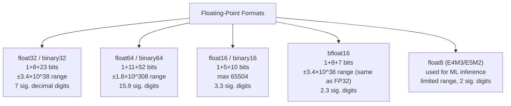
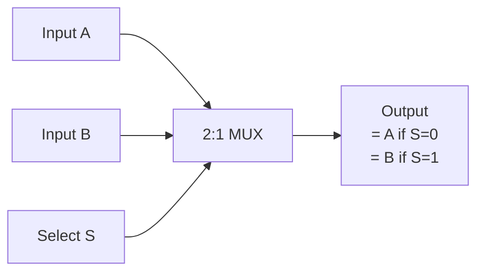

# 2 - Number Representation and Boolean Algebra

[toc]

> **TL;DR:** Computers store everything — integers, floats, instructions, addresses — as sequences of bits. The encoding scheme chosen determines what values are representable, what operations are cheap, and what overflow or rounding errors look like. Two's complement makes signed integer arithmetic seamless. IEEE 754 gives floating-point a portable standard at the cost of precision quirks every ML engineer will eventually hit. Boolean algebra is the algebra of bits: it directly maps to the gate logic that implements every computation.

## Vocabulary

**Bit**: The atomic unit of information — either 0 or 1. Physically implemented as a voltage level (e.g. 0 V = 0, Vdd = 1 in CMOS).

---

**Byte**: 8 bits. The smallest addressable unit in most ISAs. Values 0–255 unsigned.

---

**Word**: The ISA's "natural" integer size. 64-bit for modern x86-64 and AArch64 (8 bytes). 32-bit on older ARMv7 and MIPS.

---

**Unsigned integer**: An n-bit integer representing values 0 to 2ⁿ − 1. The bit pattern b_(n-1) ... b₁ b₀ has value: sum of b_i × 2^i.

```math
\text{value} = \sum_{i=0}^{n-1} b_i \cdot 2^i
```

---

**Two's complement**: The standard signed integer encoding. The MSB has weight −2^(n-1); all other bits have their normal weights. Enables addition/subtraction using the same hardware as unsigned arithmetic.

```math
\text{value} = -b_{n-1} \cdot 2^{n-1} + \sum_{i=0}^{n-2} b_i \cdot 2^i
```

---

**Overflow**: When the true mathematical result exceeds the range representable in n bits. Signed overflow in C is *undefined behaviour*; unsigned overflow wraps modulo 2ⁿ.

---

**Hexadecimal (hex)**: Base-16 notation. Each hex digit represents 4 bits exactly. Widely used because it is a compact, human-readable view of binary data. Prefix `0x` in C/Python.

---

**Fixed-point**: Representing a real number as an integer with an implicit binary radix point at a fixed position. Used in DSPs, finance, and embedded systems where FP hardware is unavailable or too slow.

---

**IEEE 754**: The dominant floating-point standard, defining binary32 (float), binary64 (double), binary16 (half), and bfloat16 (non-standard but widely used in ML).

---

**Mantissa (significand)**: The fractional part of a floating-point number. For a normalised number it is the bits after the implicit leading 1.

---

**Exponent**: The power-of-two scaling factor in a floating-point number. Stored in biased (offset binary) form.

---

**Bias**: The constant added to the true exponent before storage, ensuring the stored exponent is always non-negative (making comparison of floats simpler). For IEEE 754 float32, bias = 127.

---

**Subnormal (denormalised) number**: A float with exponent field = 0, meaning the implicit leading bit is 0 instead of 1. Allows gradual underflow to zero but incurs a hardware performance penalty on some CPUs.

---

**NaN (Not a Number)**: A float payload representing an undefined result (0/0, sqrt(-1)). Quiet NaN propagates; signalling NaN raises an exception.

---

**Boolean algebra**: The algebra of truth values {0, 1} under the operations AND (·), OR (+), NOT (¬). Every digital circuit is a physical implementation of a Boolean expression.

---

**Minterm / Maxterm**: A product term (AND of literals) / sum term (OR of literals) in sum-of-products / product-of-sums canonical form.

---

**De Morgan's Laws**: The fundamental identities relating AND and OR through negation.

```math
\overline{A \cdot B} = \bar{A} + \bar{B}, \qquad \overline{A + B} = \bar{A} \cdot \bar{B}
```

---

**Multiplexer (mux)**: A combinational circuit that selects one of N inputs based on a select signal. A 2-to-1 mux: out = s ? a : b. The universal building block — any Boolean function can be implemented with muxes.

---

## Intuition

Think of memory as a long tape of 0s and 1s with no inherent meaning. The *encoding* is a contract that tells the hardware and software what bit patterns mean. The number 200 in base 10 is the bit pattern `11001000` when interpreted as an unsigned 8-bit integer; interpreted as a two's complement 8-bit integer it represents −56; interpreted as an ASCII character it is undefined (outside the 7-bit ASCII range). The bits themselves do not carry their interpretation — context does. This is why type systems in programming languages matter: they tell the compiler which interpretation to apply.

Boolean algebra is the mathematics that governs what gates do. A circuit that computes A AND B is physically implementing the Boolean product A · B. The elegance is that every Boolean function, no matter how complex, can be reduced to a sum of minterms (sum-of-products form) — meaning it can always be built from a two-level AND-OR network. This gives chip designers a canonical starting point, which they then minimise with tools like Karnaugh maps and Quine-McCluskey.

## Number Systems

### Binary and Hexadecimal

Every value in a computer is stored in binary (base 2). Binary is hard for humans to read in long strings, so we use hexadecimal (base 16) as a compact shorthand: each hex digit maps exactly to 4 bits.

**Conversion table for one hex digit:**

| Hex | Decimal | Binary |
| :---: | :---: | :---: |
| 0 | 0 | 0000 |
| 1 | 1 | 0001 |
| 2 | 2 | 0010 |
| 3 | 3 | 0011 |
| 4 | 4 | 0100 |
| 5 | 5 | 0101 |
| 6 | 6 | 0110 |
| 7 | 7 | 0111 |
| 8 | 8 | 1000 |
| 9 | 9 | 1001 |
| A | 10 | 1010 |
| B | 11 | 1011 |
| C | 12 | 1100 |
| D | 13 | 1101 |
| E | 14 | 1110 |
| F | 15 | 1111 |

To convert hex to binary: replace each digit with its 4-bit group. `0xDEAD` = `1101 1110 1010 1101`. To convert binary to hex: group 4 bits from the right and look up each group.

### Unsigned Integers

An n-bit unsigned integer has 2ⁿ possible values: 0 through 2ⁿ − 1.

```
n=8:  0 to 255
n=16: 0 to 65535
n=32: 0 to 4,294,967,295 (about 4 billion)
n=64: 0 to 1.8 × 10^19
```

Addition wraps modulo 2ⁿ. This is not a bug — it is the expected behaviour and is used intentionally in cryptography and hashing.

### Two's Complement Signed Integers

Two's complement is the universal encoding for signed integers in modern hardware. It has one crucial property: the hardware for unsigned addition and two's complement addition is *identical*. No separate signed-add circuit is needed.

**Encoding rules for n-bit two's complement:**
- Positive values and zero: same bit pattern as unsigned (MSB = 0).
- Negative values: the MSB = 1; value = −2^(n-1) + (unsigned value of lower n-1 bits).
- Range: −2^(n-1) to 2^(n-1) − 1. For n=8: −128 to 127.

**Key insight — why it works for addition:** Adding +1 to the 8-bit representation of −1 (`1111 1111`) gives `1 0000 0000`. If we discard the carry out of bit 7, we get `0000 0000` = 0. Correct!

**To negate any two's complement number:** flip all bits, then add 1 (equivalently: compute the bitwise NOT and add 1).

```
−3 in 8-bit two's complement:
  +3 = 0000 0011
  flip = 1111 1100
  +1  = 1111 1101
  Check: −128 + 64 + 32 + 16 + 8 + 4 + 1 = −128 + 125 = −3 ✓
```

> [!IMPORTANT]
> Two's complement has an asymmetric range: there is one more negative value than positive. For 8-bit: −128 exists but +128 does not. Negating −128 (the most negative value) overflows back to −128 — a notorious source of bugs. In C: `INT_MIN = -2147483648; -INT_MIN` overflows (undefined behaviour).

### IEEE 754 Floating-Point

Floating-point represents real numbers in scientific notation in base 2: value = (−1)^s × 1.mantissa × 2^(exponent − bias).

**binary32 (float) layout — 32 bits total:**

```
 31  30        23  22                    0
 ┌───┬──────────┬──────────────────────────┐
 │ s │ exponent │       mantissa           │
 │ 1 │  8 bits  │       23 bits            │
 └───┴──────────┴──────────────────────────┘
   sign  biased exp   fractional significand
```

- **Sign bit (s)**: 0 = positive, 1 = negative.
- **Exponent**: 8 bits, bias 127. True exponent = stored − 127. Range: −126 to +127 (stored values 1–254; 0 and 255 are special).
- **Mantissa**: 23 bits representing the fractional part; the leading 1 is implicit (normalised).

**Special encodings:**

| Stored exponent | Mantissa | Meaning |
| :---: | :---: | :--- |
| 0 | 0 | ±0 |
| 0 | ≠ 0 | Subnormal: value = (−1)^s × 0.mantissa × 2^(−126) |
| 255 | 0 | ±∞ |
| 255 | ≠ 0 | NaN |
| 1–254 | any | Normal: (−1)^s × 1.mantissa × 2^(exp−127) |

**float32 range:** roughly ±3.4 × 10^38, with ~7 significant decimal digits of precision.

**binary64 (double):** 1 sign + 11 exponent (bias 1023) + 52 mantissa = 64 bits. ~15.9 significant decimal digits, range ±1.8 × 10^308.

**bfloat16 (BF16):** 1 sign + 8 exponent (same as float32!) + 7 mantissa = 16 bits. Same range as float32 but only ~3 significant digits. Used in ML because the range matters more than the precision for gradient accumulation.

**float16 (FP16):** 1 sign + 5 exponent (bias 15) + 10 mantissa = 16 bits. Smaller range (max ≈ 65504). Requires loss scaling in mixed-precision training to avoid gradient underflow.

> [!WARNING]
> Floating-point arithmetic is not associative: `(a + b) + c ≠ a + (b + c)` in general. This is why PyTorch's results can differ between CPU and GPU, between different number of workers, and across runs with different reduction orders. It is not a bug in PyTorch; it is a fundamental property of finite-precision arithmetic.



**Figure:** Floating-point format family. BF16 matches FP32 range with fewer mantissa bits — ideal for ML where gradient magnitude range matters more than fractional precision.

## Boolean Algebra

### Gates and Truth Tables

Every combinational circuit is built from gates. The three primitive gates — AND, OR, NOT — are complete (any Boolean function can be built from them). NAND alone is also complete, which is why CMOS NAND gates are the lowest-cost primitive in most standard cell libraries.

**Truth tables for the primitive gates:**

| A | B | A AND B | A OR B | NOT A | A XOR B | A NAND B |
| :---: | :---: | :---: | :---: | :---: | :---: | :---: |
| 0 | 0 | 0 | 0 | 1 | 0 | 1 |
| 0 | 1 | 0 | 1 | 1 | 1 | 1 |
| 1 | 0 | 0 | 1 | 0 | 1 | 1 |
| 1 | 1 | 1 | 1 | 0 | 0 | 0 |

XOR is the workhorse of arithmetic circuits: A XOR B is the sum bit of a 1-bit addition. A AND B is the carry. A full adder uses two XOR gates and three AND/OR gates.

### Boolean Identities

The Boolean algebra axioms and derived identities that synthesis tools use to minimise logic:

```math
\begin{aligned}
A \cdot 0 &= 0 & A + 1 &= 1 & \text{(annihilator)} \\
A \cdot 1 &= A & A + 0 &= A & \text{(identity)} \\
A \cdot A &= A & A + A &= A & \text{(idempotence)} \\
A \cdot \bar{A} &= 0 & A + \bar{A} &= 1 & \text{(complement)} \\
\overline{\bar{A}} &= A & & & \text{(double negation)} \\
A \cdot B &= B \cdot A & A + B &= B + A & \text{(commutativity)} \\
(AB)C &= A(BC) & (A+B)+C &= A+(B+C) & \text{(associativity)} \\
A(B+C) &= AB+AC & A+BC &= (A+B)(A+C) & \text{(distributivity)} \\
\overline{AB} &= \bar{A}+\bar{B} & \overline{A+B} &= \bar{A}\bar{B} & \text{(De Morgan)}
\end{aligned}
```

### Multiplexers

A multiplexer (mux) is a combinational circuit that routes one of N data inputs to the output, selected by log₂(N) select bits. A 2-to-1 mux is:

```math
\text{out} = \bar{S} \cdot A + S \cdot B
```

When S=0, output = A; when S=1, output = B. Muxes are fundamental in datapaths: the ALU result vs forwarded value selection, the PC+4 vs branch target selection, the register write data vs memory read data selection — all are muxes.



**Figure:** 2-to-1 multiplexer. The select signal is a control bit from the decode stage.

## Math: The 1-Bit Full Adder

A full adder takes three inputs (A, B, Cin) and produces two outputs (Sum, Cout). It is the fundamental arithmetic building block — 64 of them in a ripple-carry chain implement a 64-bit adder.

```math
\text{Sum} = A \oplus B \oplus C_{in}
```

```math
C_{out} = (A \cdot B) + (C_{in} \cdot (A \oplus B))
```

where ⊕ is XOR. A carry-lookahead adder precomputes the carry for each bit in parallel to reduce the O(n) depth of the ripple-carry chain to O(log n).

## Real-world Example

The following Python code demonstrates two's complement representation, IEEE 754 bit-level layout, and floating-point non-associativity — all of which matter directly in ML engineering.

```python
import struct
import numpy as np

# ── Two's complement ──────────────────────────────────────────────────────────
def to_signed_8bit(n: int) -> str:
    """Convert integer to 8-bit two's complement binary string."""
    if n >= 0:
        return format(n & 0xFF, '08b')
    else:
        return format(n & 0xFF, '08b')  # Python's & 0xFF masks to 8-bit two's complement

for val in [0, 1, 127, -1, -128, -3]:
    bits = format(val & 0xFF, '08b')
    print(f"{val:5d} = {bits}  (0x{val & 0xFF:02X})")

# Output:
#     0 = 00000000  (0x00)
#     1 = 00000001  (0x01)
#   127 = 01111111  (0x7F)
#    -1 = 11111111  (0xFF)
#  -128 = 10000000  (0x80)
#    -3 = 11111101  (0xFD)

# ── IEEE 754 float32 bit layout ───────────────────────────────────────────────
def float32_bits(f: float) -> str:
    """Return the 32-bit IEEE 754 representation of f as a binary string."""
    raw = struct.pack('>f', f)  # big-endian float32
    bits = ''.join(f'{b:08b}' for b in raw)
    return f"s={bits[0]}  exp={bits[1:9]} ({int(bits[1:9],2)}, bias 127 → exp={int(bits[1:9],2)-127})  mantissa={bits[9:]}"

for f in [1.0, -1.0, 0.5, 0.1, float('inf'), float('nan')]:
    print(f"{f:>10}: {float32_bits(f)}")

# 1.0: s=0  exp=01111111 (127, bias 127 → exp=0)  mantissa=00000000000000000000000
# Note: 1.0 = 1.0 × 2^0 = (1 + 0.000...0) × 2^0 — mantissa is all zeros (leading 1 implicit)
#
# 0.1: exp=01111011 (123, bias 127 → exp=-4)  mantissa=10011001100110011001101
# 0.1 in binary is 0.0001100110011... (repeating!) — can NOT be represented exactly

# ── Floating-point non-associativity ─────────────────────────────────────────
a = np.float32(1e8)
b = np.float32(1.0)
c = np.float32(-1e8)

print(f"\n(a + b) + c = {(a + b) + c}")   # Expect 1.0, may get 0.0
print(f"a + (b + c) = {a + (b + c)}")   # Expect 1.0, gets 1.0

# (a + b): 1e8 + 1 = 100000000 + 1. In float32, 1e8 has ~7 sig digits.
# 100000001.0 rounds to 100000000.0 — the 1 is lost! Then +(-1e8) = 0.
# a + (b + c): b + c = 1 + (-1e8) = -99999999.0, then + 1e8 = 1.0. Correct!
```

> [!CAUTION]
> The float32 non-associativity example above is not a toy. In mixed-precision training with FP16 accumulators, summing large and small gradients in the wrong order causes the small gradient to be rounded to zero. This is why PyTorch's `torch.sum()` uses pairwise summation internally and why loss scaling exists for FP16 training.

## In Practice

### ML Floating-Point Formats in 2025–2026

Training large models in FP32 costs 4 bytes per parameter — a 70B model requires 280 GB just for weights. The industry response has been a cascade of reduced-precision formats:

| Format | Bits | Sign | Exp | Man | Use case |
| :--- | :---: | :---: | :---: | :---: | :--- |
| FP32 | 32 | 1 | 8 | 23 | Reference, master weights |
| BF16 | 16 | 1 | 8 | 7 | Training (A100, H100, TPU) |
| FP16 | 16 | 1 | 5 | 10 | Training + inference, needs loss scaling |
| FP8 E4M3 | 8 | 1 | 4 | 3 | Forward pass, activations |
| FP8 E5M2 | 8 | 1 | 5 | 2 | Gradient accumulation |
| INT8 | 8 | 1 | — | — | Post-training quantisation inference |
| INT4 | 4 | 1 | — | — | GGUF quantisation (llama.cpp) |

BF16 is preferred over FP16 for training because it shares FP32's 8-bit exponent — no range-reduction or loss scaling needed. The reduced mantissa (7 vs 23 bits) matters less for training than for inference, because SGD is inherently noisy.

> [!TIP]
> When debugging NaN losses in a training run, the first suspects are: (a) FP16 with loss scaling disabled or scale too high, (b) division by near-zero in layer normalisation (add epsilon!), (c) exp() overflow in softmax without subtracting the max first. All three trace back directly to IEEE 754 special values propagating through the graph.

### Integer Overflow in Systems Code

In C, signed integer overflow is *undefined behaviour* — the compiler is allowed to assume it never happens and optimise accordingly. This is not theoretical: compilers have been known to delete bounds checks that are only reachable after overflow, because "overflow cannot happen, so this branch is unreachable." Use `__builtin_add_overflow` or Rust's checked arithmetic in security-sensitive code.

## Pitfalls

- **"0.1 + 0.2 == 0.3 in Python."** — False. `0.1 + 0.2 = 0.30000000000000004` in float64. Neither 0.1 nor 0.2 is exactly representable in binary floating-point; their sum accumulates the error. Use `math.isclose()` for float comparisons, never `==`.
- **"Two's complement and sign-magnitude are the same thing."** — No. Sign-magnitude stores the sign separately; two's complement stores it as the weight of the MSB. Two's complement has only one zero; sign-magnitude has +0 and −0, which complicates comparators.
- **"NaN == NaN is True."** — False. By IEEE 754 spec, NaN is not equal to anything, including itself. This is why checking for NaN with `x == float('nan')` silently fails. Use `math.isnan(x)` or `np.isnan(x)`.
- **"Larger floating-point format always means more accuracy."** — True for precision, but not always for range. FP16 has less range than FP8 E5M2 for large exponents. For ML inference of normalised activations, INT8 quantisation can match FP16 quality if calibrated correctly.
- **"Arithmetic right shift and logical right shift are the same."** — Arithmetic right shift replicates the sign bit (fills with 1 for negatives). Logical right shift fills with 0 regardless. In C, right-shifting a signed negative integer is implementation-defined; in most compilers it is arithmetic, but never rely on it.

## Exercises

### Exercise 1: Two's complement conversion

Convert the following 8-bit two's complement values to decimal:
(a) `1000 0000`
(b) `1111 1111`
(c) `0110 1001`
(d) `1001 0110`

#### Solution

For a two's complement n-bit number b_(n-1) b_(n-2) ... b_1 b_0, the value is: −b_(n-1) × 2^(n-1) + sum of b_i × 2^i for i = 0..n-2.

**(a) `1000 0000`:** MSB = 1, all others = 0. Value = −2^7 = **−128**. This is the most negative representable 8-bit two's complement value.

**(b) `1111 1111`:** Value = −2^7 + 2^6 + 2^5 + 2^4 + 2^3 + 2^2 + 2^1 + 2^0 = −128 + 64 + 32 + 16 + 8 + 4 + 2 + 1 = −128 + 127 = **−1**. Sanity check: −1 in two's complement is all 1s in any bit width.

**(c) `0110 1001`:** MSB = 0, so positive. Value = 0 + 64 + 32 + 0 + 8 + 0 + 0 + 1 = **105**.

**(d) `1001 0110`:** Value = −128 + 0 + 0 + 16 + 0 + 4 + 2 + 0 = −128 + 22 = **−106**.

---

### Exercise 2: IEEE 754 float32 bit layout

The 32-bit float32 bit pattern `0 10000010 10100000000000000000000` represents what decimal value?

#### Solution

Parse the three fields:
- Sign: `0` → positive
- Exponent: `10000010` in binary = 128 + 2 = 130. True exponent = 130 − 127 = **3**.
- Mantissa: `10100000000000000000000` — reading bit weights: 2^(-1) = 0.5, 2^(-3) = 0.125, rest zero. Fractional part = 0.5 + 0.125 = 0.625.

Value = (−1)^0 × (1 + 0.625) × 2^3 = 1.625 × 8 = **13.0**. Verify: 13.0 = 1101 in binary = 1.101 × 2^3. Mantissa bits for `101` = bit positions 1 and 3 set → `10100...` ✓.

---

### Exercise 3: Boolean simplification

Simplify the expression F = A·B + A·B̄ + Ā·B using Boolean algebra identities. Show each step.

#### Solution

```
F = A·B + A·B̄ + Ā·B

Step 1 — Factor A from the first two terms:
  = A·(B + B̄) + Ā·B

Step 2 — Apply complement law: B + B̄ = 1
  = A·1 + Ā·B

Step 3 — Apply identity law: A·1 = A
  = A + Ā·B

Step 4 — Apply absorption / consensus theorem: A + Ā·B = A + B
  (Proof: A + Ā·B = (A + Ā)·(A + B) by distributivity = 1·(A + B) = A + B)

Result: F = A + B
```

Sanity check via truth table: F should equal A OR B.

| A | B | A·B | A·B̄ | Ā·B | F original | A+B |
| :---: | :---: | :---: | :---: | :---: | :---: | :---: |
| 0 | 0 | 0 | 0 | 0 | 0 | 0 |
| 0 | 1 | 0 | 0 | 1 | 1 | 1 |
| 1 | 0 | 0 | 1 | 0 | 1 | 1 |
| 1 | 1 | 1 | 0 | 0 | 1 | 1 |

Both columns match. ✓

---

### Exercise 4: Floating-point precision gap

In float32, what is the smallest value x > 1.0 that is representable? What does this tell you about ML training at bfloat16?

#### Solution

For float32, 1.0 is stored as: sign 0, exponent 127 (true exp 0), mantissa = 0. The next representable value increments the LSB of the 23-bit mantissa by 1:

```
Mantissa increment = 2^(-23) ≈ 1.19 × 10^(-7)
So next float32 above 1.0 is: 1.0 + 2^(-23) = 1 + 1.19e-7
```

This value (2^−23 ≈ 1.19 × 10⁻⁷) is the **unit in the last place (ULP)** for values near 1.0. It is also called the **machine epsilon** for float32.

For **bfloat16**, the mantissa has only 7 bits. The ULP near 1.0 is 2^(−7) = 0.0078125 ≈ 7.8 × 10⁻³. That is roughly 60,000× coarser than float32.

**Implication for ML:** Learning rates in Adam are typically 10⁻³ to 10⁻⁴. Gradient updates of magnitude 10⁻⁴ on a weight of magnitude 1.0 require precision ≤ 10⁻⁴ to actually change the weight. In BF16 (epsilon ≈ 7.8 × 10⁻³), an update of 10⁻⁴ is rounded to zero — the weight does not change! This is why production training uses **master weights in FP32 with gradient accumulation in BF16 or FP16**: the update is cast to FP32 before being applied to the master weight, preserving small gradients.

---

### Exercise 5: De Morgan's law applied to gate design

A logic designer has built a circuit with three AND gates and one OR gate: `F = (A·B) + (C·D)`. The design team says all gates must be NAND gates only. Redesign the circuit using only NAND gates. Verify with De Morgan's law.

#### Solution

A NAND gate computes: `NAND(A, B) = ̄(A·B)`.

Using De Morgan: `A·B = ̄(NAND(A,B))` and `¬NAND(A, B) = ¬¬(A·B) = A·B`.

Also: `X + Y = ¬(¬X · ¬Y) = NAND(¬X, ¬Y)`.

Rewrite F:
```
F = (A·B) + (C·D)

Step 1 — Double-negate each product:
  F = ¬¬(A·B) + ¬¬(C·D)

Step 2 — Rewrite as NAND:
  ¬(A·B) = NAND(A, B)    ← call it P
  ¬(C·D) = NAND(C, D)    ← call it Q

Step 3 — The OR of two complements is a NAND:
  F = ¬P + ¬Q... wait, F = ¬¬(A·B) + ¬¬(C·D) = ¬P + ¬Q? No.

Let P = NAND(A,B) = ¬(AB), Q = NAND(C,D) = ¬(CD)
F = AB + CD = ¬P + ¬Q = ¬(P · Q) [De Morgan] = NAND(P, Q)
```

**Final circuit — three NAND gates total:**
1. P = NAND(A, B)
2. Q = NAND(C, D)
3. F = NAND(P, Q)

```
A ─┬─ NAND ─ P ─┬─ NAND ─ F
B ─┘            │
C ─┬─ NAND ─ Q ─┘
D ─┘
```

Verify: NAND(NAND(A,B), NAND(C,D)) = ¬(¬(AB) · ¬(CD)) = ¬¬(AB) + ¬¬(CD) = AB + CD = F ✓.

This is why NAND-based logic is universal and CMOS libraries are built around NAND gates.

## Sources

- Patterson, D. A., & Hennessy, J. L. (2020). *Computer Organization and Design RISC-V Edition* (2nd ed.). Appendix B: Digital Logic.
- Bryant, R. E., & O'Hallaron, D. R. (2016). *Computer Systems: A Programmer's Perspective* (3rd ed.). Chapter 2.
- IEEE 754-2019. *IEEE Standard for Floating-Point Arithmetic*. https://ieeexplore.ieee.org/document/8766229
- Goldberg, D. (1991). "What Every Computer Scientist Should Know About Floating-Point Arithmetic." *ACM Computing Surveys*, 23(1), 5–48. https://dl.acm.org/doi/10.1145/103162.103163
- Micikevicius, P. et al. (2018). "Mixed Precision Training." ICLR 2018. https://arxiv.org/abs/1710.03740

## Related

- [1 - What is Computer Architecture](./1-what-is-computer-architecture.md)
- [3 - The CPU and the Instruction Set Architecture](./3-the-cpu-and-the-instruction-set-architecture.md)
- [4 - Datapath and Control](./4-datapath-and-control.md)
