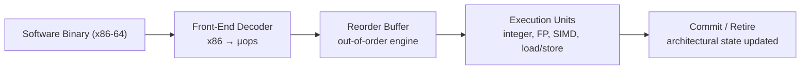
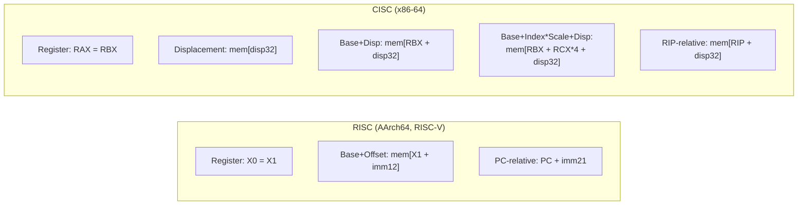

# 3 - The CPU and the Instruction Set Architecture

[toc]

> **TL;DR:** The Instruction Set Architecture is the formal contract between hardware and software — the precise list of operations a CPU will execute, their binary encodings, the programmer-visible registers, the memory addressing modes, and the privilege model. RISC ISAs (ARM, RISC-V) keep this contract simple and regular, which makes the hardware implementation easier to pipeline; CISC ISAs (x86-64) accumulated complex operations over decades, which modern chips handle by decoding to internal RISC-like micro-ops before execution. Understanding the ISA is understanding exactly what software can ask the CPU to do.

## Vocabulary

**ISA (Instruction Set Architecture)**: The complete specification of what a CPU must accept as input and what it must produce as output. Defines opcodes, register names and widths, addressing modes, memory model, exception semantics, and privilege levels.

---

**Register**: An extremely fast storage location inside the CPU, directly accessible to instructions without a memory address. Modern ISAs expose 16–32 general-purpose registers of 64 bits each.

---

**General-purpose register (GPR)**: A register that can hold any integer value and participate in arithmetic, logical, load/store, and branch operations. x86-64 has 16 (RAX–R15); AArch64 has 31 (X0–X30); RISC-V has 32 (x0–x31).

---

**Program counter (PC)**: The special register that holds the address of the next instruction to fetch. Also called the instruction pointer (IP) in x86 terminology.

---

**Stack pointer (SP)**: The register that points to the top of the call stack. x86-64: RSP; AArch64: SP (dedicated); RISC-V: x2 (by convention).

---

**Link register**: On RISC ISAs, a register that holds the return address for a function call. AArch64: X30 (LR); RISC-V: x1 (by convention, saved by `JAL`).

---

**Opcode**: The bit field in an instruction that identifies the operation to perform (add, load, branch, etc.).

---

**Addressing mode**: The method by which the effective memory address of an operand is computed. Examples: immediate, register, base+offset, base+index×scale+displacement.

---

**Immediate (imm)**: A constant value encoded directly in the instruction word. Size limited by the instruction encoding (12-bit signed in RISC-V I-type, 8 or 32-bit in x86-64 depending on the instruction).

---

**RISC (Reduced Instruction Set Computer)**: An ISA philosophy: small, fixed-width instructions; few addressing modes; explicit load/store for memory access; arithmetic only between registers; large uniform register file.

---

**CISC (Complex Instruction Set Computer)**: An ISA philosophy: variable-length instructions; many addressing modes including memory operands in arithmetic; complex instructions that expand to multiple operations.

---

**Micro-op (µop)**: A RISC-like internal operation that an Intel or AMD CPU converts a CISC x86-64 instruction into before execution. A single x86 `IMUL [rax+8], rcx` may decode to 2–3 µops: load, multiply, store.

---

**Calling convention**: The platform agreement specifying which registers hold function arguments, which hold the return value, which must be preserved across calls, and how the stack frame is laid out. POSIX: System V AMD64 ABI; Windows: Microsoft x64 ABI.

---

**Caller-saved register**: A register whose value may be destroyed by a called function. The caller must save it before a call if the value is needed afterwards.

---

**Callee-saved register**: A register the called function must preserve. If the function uses it, it must push it on entry and pop on exit.

---

**Privilege level**: The mode in which code executes, controlling access to privileged instructions and memory regions. x86-64: rings 0–3 (OS in ring 0, user code in ring 3). RISC-V: machine / supervisor / user modes.

---

**MMIO (Memory-Mapped I/O)**: A technique where device registers are placed at specific physical memory addresses. A CPU `store` to one of those addresses writes to the device, not DRAM.

---

## Intuition

The ISA is the most important API you will ever work with as a systems programmer, because every other API — OS, language runtime, virtual machine — is ultimately implemented on top of it. A function call in Python generates bytecode, which the CPython interpreter converts to C, which the C compiler converts to x86-64 or AArch64 machine code, which the CPU executes. All of that complexity exists to serve the ISA.

The RISC vs CISC debate is often misunderstood as about instruction count. It is really about *implementation complexity*. A RISC instruction can be decoded in a single cycle with fixed-width logic; a CISC instruction may need a multi-cycle state machine to determine its length and operands. Modern x86-64 chips resolve this by maintaining a CISC ISA externally (for compatibility with 40 years of software) while internally running a RISC micro-op engine. The CISC shell is a compatibility layer; the RISC core is the actual machine.



**Figure:** Modern x86-64 CPU: the CISC ISA is decoded into RISC-like µops before entering the out-of-order engine. Software sees x86-64; hardware runs µops.

## RISC vs CISC

### The RISC Philosophy

RISC arose in the early 1980s from VLSI performance measurements at Berkeley (RISC-I, Patterson) and Stanford (MIPS, Hennessy). The key observation: most programs spend most time in simple loads, stores, adds, and branches. Complex instructions that do multiple things in one opcode save code density but make hardware more complex, stall more easily in a pipeline, and benefit from the regularity of a uniform register-register arithmetic model.

RISC design principles:
1. **Fixed-width instructions** — every instruction is exactly 32 bits (RISC-V, AArch64) or 16/32 in the Thumb subset. Simple to fetch, always aligned.
2. **Load/store architecture** — arithmetic operates only on registers. Memory access is *only* via explicit LOAD and STORE instructions. No `ADD [mem], reg` like x86.
3. **Single-cycle execution** (for most instructions) — the goal is that each instruction advances through the pipeline in one clock cycle.
4. **Large register file** — 32 general-purpose registers reduces memory traffic.
5. **Few addressing modes** — simplifies the decode and address-generation logic.

### The CISC Reality

x86-64 is the dominant CISC ISA. Its history: Intel 8086 (1978) → 80286 → 80386 (32-bit IA-32, 1985) → AMD64 extension to 64-bit (2003). Backwards compatibility with 45+ years of code is why x86-64 still has string manipulation instructions, segment registers, and decimal arithmetic.

Variable-length instructions: 1 to 15 bytes. The decoder must parse prefixes (REX, VEX, EVEX) before even knowing the opcode. This is the complexity tax for code density.

Modern Intel and AMD CPUs handle it via the **µop cache (DSB — Decoded Stream Buffer)**: after decoding x86 instructions to µops, the µop stream is cached. On a cache hit, the front-end bypasses the complex decoders entirely and issues µops directly. This makes the steady-state execution nearly as efficient as a native RISC machine.

> [!NOTE]
> AMD's μop cache (also called the Op Cache) typically holds ~2000–4000 µops. When a hot loop fits entirely in the µop cache, the throughput is limited by the back-end execution units — the CISC decode overhead disappears entirely. This is why micro-benchmarks on modern x86 often match RISC throughput.

### x86-64 Registers

```
 64-bit   32-bit   16-bit  8-bit high  8-bit low
 RAX      EAX      AX      AH          AL       — accumulator
 RBX      EBX      BX      BH          BL       — base (callee-saved)
 RCX      ECX      CX      CH          CL       — counter (4th arg)
 RDX      EDX      DX      DH          DL       — data (3rd arg)
 RSI      ESI      SI      —           SIL      — source index (2nd arg)
 RDI      EDI      DI      —           DIL      — dest index (1st arg)
 RSP      ESP      SP      —           SPL      — stack pointer
 RBP      EBP      BP      —           BPL      — base pointer (callee-saved)
 R8–R15   R8D–R15D R8W–R15W —          R8B–R15B — (R8D=5th arg, R9D=6th arg)
```

Plus: RIP (instruction pointer), RFLAGS (condition codes: CF, ZF, SF, OF, PF).

Vector/SIMD: XMM0–XMM15 (128-bit SSE), YMM0–YMM15 (256-bit AVX2), ZMM0–ZMM31 (512-bit AVX-512).

### AArch64 Registers

AArch64 (ARM64 / ARMv8-A 64-bit) has 31 general-purpose integer registers X0–X30, accessible as 32-bit W0–W30. Special registers: SP (dedicated stack pointer), XZR/WZR (zero register — reads always return 0, writes are discarded), PC (not directly accessible to instructions). 32 SIMD/FP registers V0–V31, accessible as Q (128-bit), D (64-bit), S (32-bit), H (16-bit), B (8-bit).

### RISC-V Registers

RISC-V (RV64I base integer ISA) has 32 integer registers x0–x31, each 64 bits. x0 is hardwired to zero (like AArch64's XZR). The ABI assigns each a conventional name and role:

| Register | ABI name | Role | Saved by |
| :---: | :--- | :--- | :--- |
| x0 | zero | Always zero | — |
| x1 | ra | Return address | Caller |
| x2 | sp | Stack pointer | Callee |
| x5–x7 | t0–t2 | Temporaries | Caller |
| x8–x9 | s0–s1 | Saved registers | Callee |
| x10–x11 | a0–a1 | Args / return values | Caller |
| x12–x17 | a2–a7 | Arguments | Caller |
| x18–x27 | s2–s11 | Saved registers | Callee |
| x28–x31 | t3–t6 | Temporaries | Caller |

## Addressing Modes

Addressing modes determine how the CPU computes the effective address of a memory operand. RISC ISAs offer few; CISC offers many.

**Immediate:** The value is encoded in the instruction itself. `ADD x5, x5, #4` (AArch64) adds 4 to x5. No memory access.

**Register:** The value is in a register. `ADD x0, x1, x2` — result = x1 + x2.

**Base + Offset (base-displacement):** Address = register + constant. `LDR x0, [x1, #8]` (AArch64) loads 8 bytes from memory at address x1+8. The workhorse of struct field access and array indexing.

**PC-relative:** Address = PC + offset. Used for branch targets and loading addresses of data nearby in the binary. All AArch64 branches and many loads are PC-relative.

**Base + Index × Scale + Displacement (x86-64 only):** Address = base_reg + index_reg × {1,2,4,8} + displacement. `MOV EAX, [RSI + RDI*4 + 100]` — can encode `array[i]` for 4-byte elements with a 100-byte header offset in a single instruction. This is the most complex addressing mode and one of the key "CISC" features.



**Figure:** Addressing mode comparison. x86-64's richer modes reduce instruction count at the cost of decoder complexity.

## Calling Conventions

The calling convention is a platform ABI agreement, not part of the ISA itself, but any serious systems work requires knowing it. The most important: **System V AMD64 ABI** (Linux, macOS on x86-64).

**Function arguments (integer/pointer):** RDI, RSI, RDX, RCX, R8, R9 — first 6 args. Additional args are pushed on the stack.

**Return value:** RAX (integer/pointer), RDX (if 128-bit integer). Floating-point returns in XMM0.

**Callee-saved (non-volatile):** RBX, RBP, R12–R15. These registers must have the same values after a function returns as before the call.

**Caller-saved (volatile):** RAX, RCX, RDX, RSI, RDI, R8–R11, all XMM registers. Caller must save these if needed after the call.

**AArch64 (AAPCS64):** Arguments in X0–X7. Return in X0–X1. Callee-saved: X19–X28, X29 (frame pointer), X30 (link register — must be saved if the function calls others). Caller-saved: X0–X15.

> [!IMPORTANT]
> If you write mixed C and assembly, violating the calling convention causes silent, hard-to-debug corruption. The most common mistake: using a callee-saved register (RBX, R12, etc.) without saving it at function entry. The value you restore on return will be garbage, silently corrupting the caller's state. Always `push`/`pop` or save to the stack frame any callee-saved register you modify.

## RISC-V: A Clean-Sheet ISA

RISC-V (2010, UC Berkeley, Krste Asanović and colleagues) is the first major open ISA designed after decades of learning what worked and what did not. It uses a modular extension system:

| Extension | Contents |
| :--- | :--- |
| I | Base integer (32 GPRs, arithmetic, load/store, branch) — mandatory |
| M | Integer multiply/divide |
| A | Atomic memory operations (LR/SC, AMO) |
| F | Single-precision FP |
| D | Double-precision FP |
| C | Compressed 16-bit instructions (Thumb-like) |
| V | Vector operations |
| H | Hypervisor |
| Zicsr | Control and Status Register instructions |
| Zifencei | Instruction-fetch fence |

"RV64GC" means: 64-bit base, G = IMAFD (the standard general profile), C = compressed. This is the baseline for a Linux-capable RISC-V chip.

The base I extension has only 47 instructions. The entire I+M+A+F+D+C spec is under 400 instructions — compared to x86-64's thousands of instruction encodings. Simplicity is a feature: a complete RISC-V core can be implemented by a graduate student in a semester; an x86-64 core requires a team of hundreds.

## Real-world Example

The following shows the same function compiled for three ISAs. Function: add two integers and return the result. Simple, but the encoding differences are instructive.

```c
// Source (C)
long add(long a, long b) {
    return a + b;
}
```

```asm
; x86-64 (System V ABI): a in RDI, b in RSI, result in RAX
add:
    lea     rax, [rdi + rsi]   ; RAX = RDI + RSI. LEA used instead of ADD
    ret                        ; return (pop RIP from stack)
; 2 instructions, 5 bytes total (LEA=4, RET=1)
```

```asm
; AArch64 (AAPCS64): a in X0, b in X1, result in X0
add:
    add     x0, x0, x1         ; X0 = X0 + X1 (result overwrites first arg)
    ret                        ; return via LR (X30)
; 2 instructions, 8 bytes total (each is 32 bits)
```

```asm
; RISC-V RV64I (calling convention): a in a0 (x10), b in a1 (x11), result in a0
add:
    add     a0, a0, a1         ; a0 = a0 + a1
    ret                        ; pseudoinstruction → jalr x0, x1, 0 (jump to ra)
; 2 instructions, 8 bytes total
```

Now a more realistic example — a loop that computes the dot product of two int64 arrays in RISC-V assembly:

```asm
; RISC-V RV64IM dot product
; a0 = pointer to array x, a1 = pointer to array y, a2 = length n
; returns result in a0
dot_product:
    li      t0, 0              ; t0 = sum = 0
    li      t1, 0              ; t1 = i = 0
.loop:
    bge     t1, a2, .done      ; if i >= n, exit
    slli    t2, t1, 3          ; t2 = i * 8 (byte offset for int64)
    add     t3, a0, t2         ; t3 = &x[i]
    add     t4, a1, t2         ; t4 = &y[i]
    ld      t5, 0(t3)          ; t5 = x[i]
    ld      t6, 0(t4)          ; t6 = y[i]
    mul     t5, t5, t6         ; t5 = x[i] * y[i]
    add     t0, t0, t5         ; sum += x[i]*y[i]
    addi    t1, t1, 1          ; i++
    j       .loop              ; unconditional jump (pseudoinstruction)
.done:
    mv      a0, t0             ; return sum in a0
    ret
```

> [!TIP]
> When writing RISC-V assembly by hand, use the assembler pseudoinstructions freely: `li` (load immediate, expands to `LUI`+`ADDI` for large values), `mv` (expands to `ADDI rd, rs, 0`), `ret` (expands to `JALR x0, x1, 0`), `j` (expands to `JAL x0, offset`). They compile to real instructions but make the code far more readable. The assembler handles the expansion.

## In Practice

### Why ISA Choice Matters for Systems Software

Kernel developers, JIT compilers, and debuggers must know the ISA cold. Some concrete implications:

- **Stack frame layout** differs by ABI. A stack unwinder (for backtraces, panic recovery, profiling) must parse the exact layout of saved registers and the return address. GDB, perf, and LLDB all embed ISA-specific stack unwinding logic.
- **System call interface** is ISA-specific. On Linux/x86-64, a syscall puts the number in RAX and arguments in RDI, RSI, RDX, R10, R8, R9, then executes `SYSCALL`. On AArch64, the number goes in X8, arguments in X0–X5, and the instruction is `SVC #0`. Same Linux kernel ABI, different ISA protocol.
- **Atomic instructions and memory ordering** are ISA-specific. x86-64's TSO memory model means most loads and stores are automatically sequentially consistent; AArch64's weak model requires explicit barriers (`DMB`, `DSB`) or the `LDAR`/`STLR` acquire-release variants. Porting lock-free code between architectures is not a simple recompile.
- **SIMD extensions** are ISA-specific. x86-64 has SSE2 (128-bit), AVX2 (256-bit), AVX-512 (512-bit). AArch64 has NEON (128-bit) and SVE/SVE2 (scalable, 128–2048 bits). Code using intrinsics does not port.

### Real Chip ISA Feature Comparison (2025–2026)

| Feature | x86-64 (Raptor Lake) | AArch64 (M4) | RISC-V (SiFive P870) |
| :--- | :---: | :---: | :---: |
| Base integer width | 64-bit | 64-bit | 64-bit |
| GPR count | 16 | 31 | 32 |
| Instruction width | 1–15 bytes | 32 bits (+ 16-bit Thumb) | 32 bits (+ 16-bit C ext) |
| SIMD | AVX-512 (512-bit) | NEON/SVE2 (scalable) | V-ext (scalable) |
| Atomic ops | LOCK prefix | LDADD, CAS, STXR/LDXR | LR/SC, AMO* |
| Memory model | TSO (strong) | Weak + acquires | Weak (RVWMO) |
| Virtualisation | VT-x | EL2 hypervisor | H extension |
| Open spec? | No | No (ARM licenses) | Yes (Apache 2.0) |

## Pitfalls

- **"Registers are just fast memory."** — Registers are not memory — they have no address, they are not byte-addressable, and there are only a handful of them. They are the operand slots of the execution units. Treating them as "just fast cache" misses the fundamental distinction between storage (which has an address space) and registers (which are named operand locations).
- **"RISC always executes fewer instructions than CISC for the same task."** — Usually false. RISC tends to need *more* instructions for complex operations (e.g. loading a 64-bit constant requires 4 instructions in RISC-V vs 1 in x86-64). RISC trades instruction count for regularity and pipelineability.
- **"The calling convention is part of the ISA."** — No. The ISA specifies the registers; the calling convention is an ABI layered on top by platform designers. x86-64 Linux uses System V ABI; x86-64 Windows uses Microsoft x64 ABI — different argument passing, different callee-saved set, same ISA.
- **"x86-64 instructions execute one at a time."** — Modern x86-64 cores issue 4–6 µops per cycle out of order. The ISA is sequential; the implementation is massively parallel. The sequential semantics are preserved by the hardware.
- **"Zero register in RISC-V means you can't use x0."** — You can read x0 (always returns 0), but writes are discarded. It is a hardware optimisation that eliminates the need for separate `CLR`, `NOP`, and `MOV #0` instructions. `ADD x0, x0, x0` is the canonical NOP; `SW x0, 0(x1)` writes a zero to memory.

## Exercises

### Exercise 1: Register identification and calling convention

In System V AMD64 ABI (Linux x86-64), trace a call to `f(1, 2, 3, 4, 5, 6, 7)` where f takes 7 `long` arguments. Where does each argument land? Which registers must the caller save if it needs their values after the call returns?

#### Solution

**Argument placement (System V AMD64 ABI, integer arguments):**

| Argument | Register |
| :--- | :--- |
| arg 1 (value 1) | RDI |
| arg 2 (value 2) | RSI |
| arg 3 (value 3) | RDX |
| arg 4 (value 4) | RCX |
| arg 5 (value 5) | R8 |
| arg 6 (value 6) | R9 |
| arg 7 (value 7) | pushed on stack at [RSP] before CALL |

The 7th argument is pushed on the stack before the CALL instruction. Inside f, it is accessible at `[RBP + 16]` after the function prologue sets up the frame pointer.

**Caller-saved registers the caller must save if needed:** RAX, RCX, RDX, RSI, RDI, R8, R9, R10, R11, all XMM registers. If the caller has any live value in these registers after issuing the call, it must have saved them somewhere (on the stack or in callee-saved registers) before the call site.

**Callee-saved registers (safe across the call):** RBX, RBP, R12–R15. These are guaranteed to have the same values after the call returns.

---

### Exercise 2: Decode a RISC-V instruction

The 32-bit value `0x00A50533` is a RISC-V RV64I R-type instruction. Decode it.

R-type format (MSB to LSB):
```
[31:25] funct7 | [24:20] rs2 | [19:15] rs1 | [14:12] funct3 | [11:7] rd | [6:0] opcode
```

#### Solution

Convert to binary (32 bits):
```
0x00A50533 = 0000 0000 1010 0101 0000 0101 0011 0011
```

Split into fields:
```
funct7  [31:25] = 0000 000  = 0x00
rs2     [24:20] = 0 1010    = 10  (= x10 = a0)
rs1     [19:15] = 0 1010    = 10  (= x10 = a0)
funct3  [14:12] = 000
rd      [11:7]  = 0 1010    = 10  (= x10 = a0)
opcode  [6:0]   = 011 0011  = 0x33
```

Opcode `0x33` = OP (register-register arithmetic).
funct3 `000` + funct7 `0000000` = ADD.

Instruction: **`ADD a0, a0, a0`** (i.e. `a0 = a0 + a0`, which doubles a0).

In RISC-V, "OP" opcode + funct7=0000000 + funct3=000 is always ADD. If funct7 were 0100000, it would be SUB.

---

### Exercise 3: RISC vs CISC code density

The following C expression appears in a loop: `result += array[i * 4 + 3]` where `array` is `int32_t*`, `i` is in a register, and `result` is in a register.

Write the minimum number of instructions needed in: (a) x86-64, and (b) RISC-V RV64IM.

#### Solution

Assume: x86-64: `result` in EAX, `array` in RSI, `i` in ECX. RISC-V: `result` in a0, `array` in a1, `i` in a2.

**(a) x86-64:**
```asm
; One instruction handles the entire addressing and load
; Base = RSI, Index = RCX, Scale = 4, Displacement = 12 (3 elements * 4 bytes)
add eax, [rsi + rcx*4 + 12]    ; 1 instruction
```

The `[base + index*scale + disp]` addressing mode computes `array + i*4 + 12` (not `i*4+3` — that would be `i*4 + 3*4 = i*4 + 12` in bytes for int32). One instruction: load and add. This is the CISC advantage.

**(b) RISC-V RV64IM:**
```asm
; No memory-operand arithmetic; must compute address explicitly
slli    t0, a2, 2          ; t0 = i * 4 (shift left 2 = multiply by 4)
addi    t0, t0, 12         ; t0 = i*4 + 12 (byte offset: 3 elements × 4 bytes)
add     t0, t0, a1         ; t0 = &array[i*4 + 3]... 
                           ; wait: index i*4+3 in elements = byte offset (i*4+3)*4
```

Correction — the expression is `array[i*4 + 3]` where the index into the array is `i*4+3`. For int32_t (4 bytes each), the byte offset is `(i*4+3) * 4 = i*16 + 12`.

```asm
slli    t0, a2, 4          ; t0 = i * 16
addi    t0, t0, 12         ; t0 = i*16 + 12
add     t0, t0, a1         ; t0 = array + i*16 + 12 (address)
lw      t1, 0(t0)          ; t1 = array[i*4+3] (load word)
add     a0, a0, t1         ; result += array[i*4+3]
; 5 instructions
```

x86-64: 1 instruction. RISC-V: 5 instructions. The CISC ISA is ~5× more dense here. However, each RISC-V instruction is simple and executes in one pipeline stage; the x86-64 instruction decodes to ~2 µops (load + add) internally. The throughput difference is smaller than the instruction count suggests.

---

### Exercise 4: Privilege levels

Describe what happens, step by step at the ISA level, when a user-space program on Linux/x86-64 calls `write(1, "hello\n", 6)` (write to stdout). Which privilege level transitions occur and when?

#### Solution

1. **User space (ring 3) — libc `write()` wrapper:** The C library's `write()` function places the syscall number for `write` (64 on Linux/x86-64) into RAX. It places the arguments in RDI=1 (fd=stdout), RSI=pointer to "hello\n", RDX=6 (count). Then it executes the `SYSCALL` instruction.

2. **`SYSCALL` instruction — ring 3 → ring 0:** The CPU performs a privilege-level transition. It saves RIP (return address) into RCX, saves RFLAGS into R11, masks certain RFLAGS bits, loads the kernel entry-point address from the `IA32_LSTAR` MSR (set by the OS during boot), and switches to kernel mode (CPL 0). The stack also switches to the kernel stack for this thread (loaded from the TSS).

3. **Kernel (ring 0) — syscall dispatch:** The kernel entry stub saves the user-space register context, looks up syscall number 64 in the syscall table, and calls `sys_write(fd=1, buf=..., count=6)`. The kernel validates the file descriptor, copies the buffer from user space (checking it's readable), and invokes the VFS write path → device driver → eventually writes to the terminal or pipe.

4. **Return — ring 0 → ring 3:** The kernel places the return value (6, the number of bytes written) in RAX and executes `SYSRET`. The CPU restores RIP from RCX, restores RFLAGS from R11, and switches back to CPL 3 (user mode). Execution resumes at the instruction after `SYSCALL` in the libc wrapper.

5. **User space resumes:** libc checks RAX for errors (negative values indicate errno), and returns to the calling program.

The key point: the `SYSCALL`/`SYSRET` instructions are the ISA's mechanism for controlled privilege transitions. User code cannot directly execute privileged instructions (like `IN`/`OUT` for I/O ports, or MSR writes) — the only way to request kernel services is through this controlled interface.

---

### Exercise 5: Design question — zero register

RISC-V and AArch64 have a hardwired zero register (x0 / XZR). x86-64 does not. What is the hardware benefit of a zero register, and how does the compiler use it?

#### Solution

**Hardware benefit:** A hardwired-zero register simplifies the register file. When the destination register is x0, the write port can be suppressed — no state update needed. When x0 is a source, no register file read is required; the value 0 is constant and can be supplied directly by the decode unit. This saves power (no register file access) and simplifies hazard detection (a write to x0 has no dependents; a read of x0 has no producer).

Additionally, x0 as a source eliminates the need for several dedicated instructions: NOP = `ADDI x0, x0, 0`; CLR a register = `ADD rd, x0, x0`; unconditional branch = `JAL x0, offset` (discards return address); compare to zero = `BEQ rs, x0, label`.

**Compiler use cases:**

1. **Conditional zero test:** `BEQ a0, x0, label` — branch if a0 is zero. In x86-64 you'd need `TEST EAX, EAX` followed by `JZ label` (2 instructions). RISC-V does it in 1.

2. **Discarding return values:** `JAL x0, printf` — call printf, discard return value by using x0 as link register destination (no return needed if it's not a function call but a tail jump).

3. **Initialising to zero:** `ADD t0, x0, x0` = `t0 = 0`. No need for a separate `MOV Rd, #0` instruction encoding.

4. **Subtraction from zero (negation):** `SUB a0, x0, a0` = `a0 = 0 − a0` = negate a0. One instruction; no `NEG` opcode needed.

In x86-64, clearing a register to zero is done with `XOR EAX, EAX` (smaller encoding than `MOV EAX, 0` and avoids a partial-register false dependency). It is a hack; RISC-V's x0 makes the zero idiom an architectural first-class citizen.

## Sources

- Patterson, D. A., & Hennessy, J. L. (2020). *Computer Organization and Design RISC-V Edition* (2nd ed.). Chapters 2–3.
- Hennessy, J. L., & Patterson, D. A. (2019). *Computer Architecture: A Quantitative Approach* (6th ed.). Appendix A: ISA Principles.
- AMD64 Architecture Programmer's Manual, Volume 1: Application Programming. https://www.amd.com/content/dam/amd/en/documents/processor-tech-docs/programmer-references/24592.pdf
- ARM Architecture Reference Manual (ARMv8-A). https://developer.arm.com/documentation/ddi0487/latest
- RISC-V ISA Specification v20240411. https://riscv.org/technical/specifications/
- System V AMD64 ABI. https://gitlab.com/x86-psABIs/x86-64-ABI
- Waterman, A. & Asanović, K. (2017). "The RISC-V Instruction Set Manual." UC Berkeley Technical Report UCB/EECS-2016-118.

## Related

- [1 - What is Computer Architecture](./1-what-is-computer-architecture.md)
- [2 - Number Representation and Boolean Algebra](./2-number-representation-and-boolean-algebra.md)
- [4 - Datapath and Control](./4-datapath-and-control.md)
- [5 - Pipelining and Hazards](./5-pipelining-and-hazards.md)
