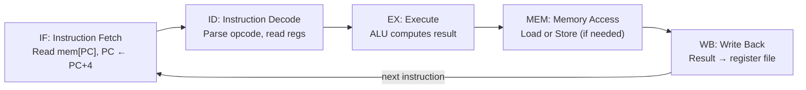
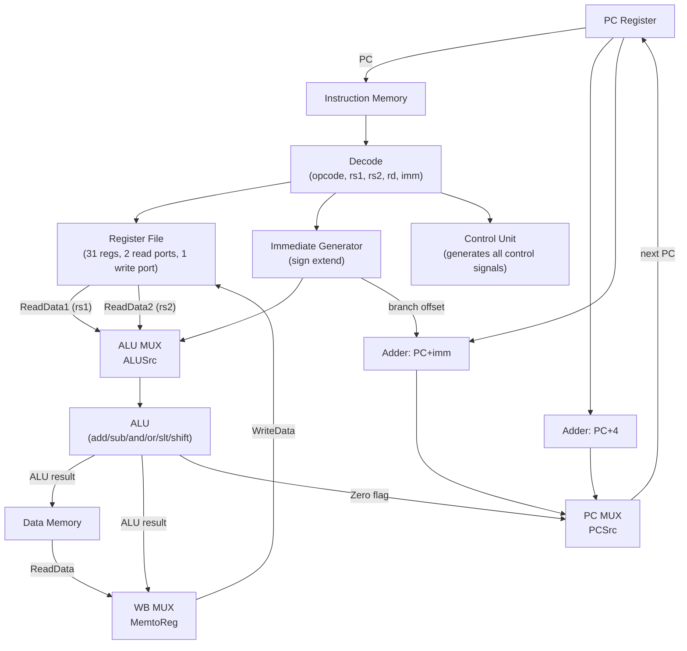

# 4 - Datapath and Control

[toc]

> **TL;DR:** The datapath is the collection of hardware components — ALU, registers, program counter, memory interfaces — that physically move and transform data each cycle. The control unit is the combinational and sequential logic that reads the opcode and drives the correct control signals (mux selects, register write enables, memory read/write) to route that data correctly. Together they implement the fetch-decode-execute cycle. The simplest design is single-cycle (every instruction completes in one clock cycle); pipelining (covered in [5 - Pipelining and Hazards](./5-pipelining-and-hazards.md)) overlaps multiple instructions, which requires splitting the datapath into pipeline stages and adding hazard-handling logic.

## Vocabulary

**Datapath**: The hardware structures that store and manipulate data — the register file, ALU, multiplexers, adders, and buses that connect them. The datapath is what moves bits.

---

**Control unit**: The logic (combinational or FSM) that generates control signals from the instruction's opcode and function fields. The control unit is what decides *how* bits move.

---

**ALU (Arithmetic Logic Unit)**: The functional unit that performs integer arithmetic (add, subtract), logical (AND, OR, XOR, NOT), comparison, and shift operations. A single-issue in-order core typically has one integer ALU plus a separate multiply/divide unit.

---

**Register file**: The small SRAM array holding the ISA's general-purpose registers. Supports multiple simultaneous read ports and one write port in a simple design; out-of-order cores use a physical register file with many more entries (the renaming rename table maps architectural names to physical ones).

---

**Fetch-Decode-Execute (FDE) cycle**: The fundamental instruction execution loop: (1) fetch the instruction at PC from memory; (2) decode the opcode and read register operands; (3) execute the operation in the ALU; (4) optionally access memory; (5) write results back to registers.

---

**Instruction memory / Instruction cache (I$)**: The memory (or cache) from which the fetch stage reads instructions. Separate from data memory in a Harvard architecture; shared physical memory but split L1 caches in most real CPUs.

---

**Data memory / Data cache (D$)**: The memory (or cache) accessed by load/store instructions.

---

**Control signal**: A 1-bit or multi-bit value that selects among datapath components. Examples: `RegWrite` (enable register file write), `MemRead`/`MemWrite` (enable memory access), `ALUSrc` (choose register vs immediate as ALU input), `PCSrc` (choose PC+4 vs branch target).

---

**Sign extension**: Expanding an n-bit immediate to a wider word by replicating the sign bit. A 12-bit signed immediate becomes a 64-bit value with bits 63:12 all equal to bit 11.

---

**Single-cycle CPU**: A CPU design where each instruction takes exactly one clock cycle. The cycle time must be long enough for the slowest instruction (typically a load, which requires instruction memory + register read + ALU + data memory + register write). Wasteful for fast instructions.

---

**Multi-cycle CPU**: Each instruction is broken into multiple simpler steps, each taking one clock cycle. A register-to-register add might take 4 cycles; a load might take 5. Saves cycle time at the cost of control complexity.

---

**FSM (Finite State Machine)**: The control unit of a multi-cycle CPU is typically a Moore or Mealy FSM. State = current instruction step; transitions driven by opcode and current state.

---

**Branch target**: The address the PC jumps to if a branch is taken. Computed as PC + sign_extended_offset in RISC ISAs; stored in a register for indirect branches.

---

## Intuition

Imagine a post office. The datapath is the physical infrastructure: the conveyor belts (buses), sorting bins (registers), and processing machines (ALU). The control unit is the routing logic that reads the address label (opcode) on each package and throws the right switches to send it to the right machine. Without the control unit, data just sits there; without the datapath, the control signals have nothing to act on.

The fetch-decode-execute cycle is the heartbeat of the CPU. Every instruction, no matter how complex, reduces to: get the instruction (fetch), figure out what it says (decode), do the operation (execute), read or write memory if needed (memory), and save the result (write-back). Pipelining (next note) makes these steps happen in parallel across multiple instructions — but they are still logically sequential for each instruction.

## The Fetch-Decode-Execute Cycle

The FDE cycle is the canonical description of sequential instruction execution. In a single-cycle CPU, all five phases complete in one clock cycle. Understanding each phase deeply is the prerequisite for understanding pipelining, hazards, and out-of-order execution.



**Figure:** Five-stage fetch-decode-execute pipeline. Each box is one logical phase; in a single-cycle CPU, all five happen simultaneously in one long clock cycle.

### IF — Instruction Fetch

The instruction fetch stage reads the instruction at the current PC from instruction memory. It also computes the default next PC: PC + 4 (for 32-bit fixed-width instructions). If a branch is taken, this default will be overridden in a later stage. The key hardware: a program counter register, an adder (PC + 4), and a read port to instruction memory.

### ID — Instruction Decode

The decode stage parses the 32-bit instruction word into its fields (opcode, rd, rs1, rs2, funct3, funct7, immediate). The register file is read: rs1 and rs2 are read simultaneously (two read ports). The immediate value is sign-extended to 64 bits. The control unit generates all control signals from the opcode field.

### EX — Execute

The execute stage feeds the ALU with its two operands. For register-register instructions, both operands come from the register file. For immediate instructions, one operand is the sign-extended immediate. The ALU control signal (generated by the control unit from funct3 and funct7) selects the operation: add, subtract, AND, OR, XOR, SLT (set-less-than), etc. For branches, the ALU computes the comparison (equality, less-than) and the branch target address.

### MEM — Memory Access

Only load and store instructions access data memory. A load reads from the data cache; a store writes to it. For all other instructions (ALU ops, branches, jumps), this stage is idle. The data cache address is the ALU result from the EX stage (base register + offset).

### WB — Write Back

The write-back stage writes the result back to the register file. For ALU instructions, the write data is the ALU result. For loads, the write data comes from the data cache output. The write enable (`RegWrite`) control signal gates this stage.

## The Datapath in Detail

The minimal RISC-V single-cycle datapath handles five instruction types: R-type (register-register arithmetic), I-type (immediate arithmetic + loads), S-type (stores), B-type (branches), and J-type (jumps). Each type routes data differently through the same physical hardware, controlled by mux select signals.



**Figure:** Simplified RISC-V single-cycle datapath. Mux selects (ALUSrc, MemtoReg, PCSrc) are driven by the control unit based on the instruction type.

### Control Signals for Each Instruction Type

The control unit is a combinational decoder: opcode → set of control signals. For a minimal RISC-V implementation:

| Instruction type | RegWrite | ALUSrc | MemRead | MemWrite | MemtoReg | Branch |
| :--- | :---: | :---: | :---: | :---: | :---: | :---: |
| R-type (ADD, SUB, AND) | 1 | 0 (reg) | 0 | 0 | 0 (ALU) | 0 |
| I-type ALU (ADDI, ANDI) | 1 | 1 (imm) | 0 | 0 | 0 (ALU) | 0 |
| I-type Load (LW, LD) | 1 | 1 (imm) | 1 | 0 | 1 (mem) | 0 |
| S-type Store (SW, SD) | 0 | 1 (imm) | 0 | 1 | X | 0 |
| B-type Branch (BEQ, BNE) | 0 | 0 (reg) | 0 | 0 | X | 1 |
| J-type Jump (JAL) | 1 | X | 0 | 0 | 0 (PC+4) | 0 |

X = don't care. The `ALUSrc` signal selects between register (rs2) and the sign-extended immediate as the ALU's second operand. `MemtoReg` selects between the ALU result and memory read data for the register write-back.

### The ALU

The ALU is the heart of the execute stage. It takes two 64-bit inputs and a 4-bit control signal (derived from funct3 and funct7) and produces a 64-bit result plus a Zero flag (used for branch comparisons).

| ALU control | Operation | Used by |
| :---: | :--- | :--- |
| 0000 | ADD | R-type ADD, I-type ADDI, loads, stores (address), JAL |
| 0001 | SUB | R-type SUB, branch compare |
| 0010 | AND | R-type AND, I-type ANDI |
| 0011 | OR | R-type OR, I-type ORI |
| 0100 | XOR | R-type XOR, I-type XORI |
| 0101 | SLT | R-type SLT (set-less-than) |
| 0110 | SLL | Shift left logical |
| 0111 | SRL/SRA | Shift right logical/arithmetic |

> [!IMPORTANT]
> Branch instructions in RISC-V (BEQ, BNE, BLT, BGE) do **not** explicitly compute a condition code. They pass rs1 and rs2 to the ALU, which subtracts them (SUB) or computes set-less-than (SLT). The Zero flag or the sign of the result drives the branch decision. There are no EFLAGS or NZCV condition codes in RISC-V — this simplification makes out-of-order implementation cleaner (no flag register dependencies).

## Single-Cycle vs Multi-Cycle CPU

### Single-Cycle

Every instruction completes in one clock cycle. The clock period must accommodate the **critical path**: the longest delay through any instruction's datapath. For a load instruction: instruction memory access + register read + ALU + data memory + register write-back. Typically 5–8 ns in a simple design. Every instruction uses this full-length cycle, even an ADD that only needs instruction memory + register read + ALU + register write (missing the data memory stage entirely).

**Critical path = minimum achievable clock period = maximum clock frequency.**

Single-cycle is simple and correct. It is the design used in Patterson & Hennessy's teaching chapters. It is not used in production because it cannot exploit the fact that different instructions need different amounts of time.

### Multi-Cycle

A multi-cycle CPU breaks each instruction into steps, one step per clock cycle, and uses a shorter clock period (each step is simpler than the full single-cycle path). The clock period is the delay of the *slowest single step*, not the slowest full instruction.

A simple 5-step multi-cycle RISC design:
1. **IF:** Fetch instruction → IR (instruction register). IR ← mem[PC]; PC ← PC+4.
2. **ID:** Decode + register read. A ← reg[rs1]; B ← reg[rs2]; ALUOut ← PC + sign_ext(imm).
3. **EX:** ALU operation. ALUOut ← A op B (or A op imm).
4. **MEM:** Data memory access. MDR ← mem[ALUOut] (for loads) or mem[ALUOut] ← B (for stores).
5. **WB:** Write back. reg[rd] ← ALUOut or MDR.

Not every instruction needs all five steps. An R-type instruction needs IF, ID, EX, WB (4 cycles). A load needs all 5. A store needs IF, ID, EX, MEM (4 cycles, no WB).

The control unit becomes an FSM: state = current step; transition = opcode + step.

> [!NOTE]
> Multi-cycle CPUs were dominant in the 1980s (MIPS R2000 used a version of this approach). They were replaced by pipelined designs that achieve the short cycle time of multi-cycle *and* the high throughput of simultaneous instruction execution. Multi-cycle remains relevant for simple embedded controllers where the silicon area of a pipeline is too costly.

## Math: Critical Path Analysis

The critical path determines the minimum clock period. For a single-cycle RISC-V CPU with the following component delays:

```math
\begin{aligned}
t_{imem}  &= 200\,\text{ps} \quad \text{(instruction memory)} \\
t_{regrd} &= 150\,\text{ps} \quad \text{(register file read)} \\
t_{alu}   &= 200\,\text{ps} \quad \text{(ALU)} \\
t_{dmem}  &= 250\,\text{ps} \quad \text{(data memory)} \\
t_{regwr} &= 100\,\text{ps} \quad \text{(register file write)} \\
t_{mux}   &= 25\,\text{ps}  \quad \text{(multiplexer)} \\
\end{aligned}
```

Critical path for a load instruction (worst case):

```math
T_{cycle} = t_{imem} + t_{regrd} + t_{mux} + t_{alu} + t_{dmem} + t_{mux} + t_{regwr}
           = 200 + 150 + 25 + 200 + 250 + 25 + 100 = 950\,\text{ps}
```

```math
f_{max} = \frac{1}{950\,\text{ps}} \approx 1.05\,\text{GHz}
```

An R-type instruction's path = 200 + 150 + 25 + 200 + 25 + 100 = 700 ps, but the clock is still 950 ps. 250 ps (26%) is wasted every cycle for R-type instructions. This waste is what pipelining eliminates.

## Real-world Example

The following C code manually simulates a single-cycle RISC-V datapath for a subset of instructions. It is deliberately simple to make the control signal table visible in code.

```c
#include <stdio.h>
#include <stdint.h>
#include <string.h>

#define NUM_REGS 32
#define MEM_SIZE 1024

typedef struct {
    int64_t  reg[NUM_REGS];   /* Register file x0-x31 */
    uint64_t pc;               /* Program counter      */
    uint8_t  mem[MEM_SIZE];    /* Unified memory       */
} CPU;

/* ALU operations */
static int64_t alu(int64_t a, int64_t b, int op) {
    switch (op) {
        case 0: return a + b;          /* ADD  */
        case 1: return a - b;          /* SUB  */
        case 2: return a & b;          /* AND  */
        case 3: return a | b;          /* OR   */
        case 4: return a < b ? 1 : 0;  /* SLT  */
        default: return 0;
    }
}

/* Extract bit fields from instruction */
static int32_t sign_extend(uint32_t val, int bits) {
    int shift = 32 - bits;
    return (int32_t)(val << shift) >> shift;
}

void step(CPU *cpu, uint32_t instr) {
    /* Decode */
    uint32_t opcode = instr & 0x7F;
    uint32_t rd     = (instr >>  7) & 0x1F;
    uint32_t funct3 = (instr >> 12) & 0x07;
    uint32_t rs1    = (instr >> 15) & 0x1F;
    uint32_t rs2    = (instr >> 20) & 0x1F;
    int32_t  imm_i  = sign_extend(instr >> 20, 12);               /* I-type */
    int32_t  imm_b  = sign_extend(                                 /* B-type */
                        ((instr >> 31) << 12) | (((instr >> 7) & 1) << 11) |
                        (((instr >> 25) & 0x3F) << 5) | ((instr >> 8) & 0xF), 13);

    /* x0 always reads as 0; writes to x0 are ignored */
    int64_t a = (rs1 == 0) ? 0 : cpu->reg[rs1];
    int64_t b = (rs2 == 0) ? 0 : cpu->reg[rs2];

    int64_t alu_result = 0;
    int64_t next_pc    = (int64_t)cpu->pc + 4;

    switch (opcode) {
        case 0x33: /* R-type: ADD, SUB, AND, OR */
            alu_result = alu(a, b, (funct3 == 0 && (instr >> 30 & 1)) ? 1 : funct3);
            if (rd) cpu->reg[rd] = alu_result;
            break;
        case 0x13: /* I-type ALU: ADDI, ANDI, ORI */
            alu_result = alu(a, imm_i, funct3);
            if (rd) cpu->reg[rd] = alu_result;
            break;
        case 0x03: /* Load (LW = funct3 0x2, LD = funct3 0x3) */
            alu_result = a + imm_i;
            if (rd) {
                if (funct3 == 0x2)      /* LW */
                    cpu->reg[rd] = *(int32_t *)(cpu->mem + alu_result);
                else if (funct3 == 0x3) /* LD */
                    cpu->reg[rd] = *(int64_t *)(cpu->mem + alu_result);
            }
            break;
        case 0x63: /* B-type branch: BEQ = funct3 0, BNE = 1 */
            if ((funct3 == 0 && a == b) || (funct3 == 1 && a != b))
                next_pc = (int64_t)cpu->pc + imm_b;
            break;
        default:
            fprintf(stderr, "Unknown opcode 0x%02X\n", opcode);
    }
    cpu->pc = (uint64_t)next_pc;
}

int main(void) {
    CPU cpu;
    memset(&cpu, 0, sizeof(cpu));
    cpu.pc = 0;

    /* Hand-assembled: ADDI x1, x0, 42  (opcode=0x13, rd=1, rs1=0, imm=42) */
    /* ADDI: imm[11:0] | rs1 | funct3 | rd | opcode */
    /* = (42 << 20) | (0 << 15) | (0 << 12) | (1 << 7) | 0x13 */
    uint32_t prog[] = {
        (42u << 20) | (0 << 15) | (0 << 12) | (1 << 7) | 0x13,  /* ADDI x1, x0, 42 */
        (10u << 20) | (0 << 15) | (0 << 12) | (2 << 7) | 0x13,  /* ADDI x2, x0, 10 */
        /* ADD x3, x1, x2: opcode=0x33, funct7=0, funct3=0, rs2=2, rs1=1, rd=3 */
        (0 << 25) | (2 << 20) | (1 << 15) | (0 << 12) | (3 << 7) | 0x33,
    };

    for (size_t i = 0; i < sizeof(prog)/sizeof(prog[0]); i++) {
        printf("PC=%lu  instr=0x%08X\n", (unsigned long)cpu.pc, prog[i]);
        step(&cpu, prog[i]);
    }

    printf("x1 = %ld (expect 42)\n", cpu.reg[1]);
    printf("x2 = %ld (expect 10)\n", cpu.reg[2]);
    printf("x3 = %ld (expect 52)\n", cpu.reg[3]);
    return 0;
}
```

> [!TIP]
> This simulator is exactly what the RISC-V ISA spec describes at the functional level. The key insight is that the `switch(opcode)` block *is* the control unit, and the register file reads and ALU call *are* the datapath. In real hardware, this switch becomes a combinational logic network; the register file becomes an SRAM; the ALU becomes a parallel carry-lookahead adder. The logical structure is identical.

## In Practice

### What Modern Microarchitectures Actually Do

A single-cycle or multi-cycle CPU is a teaching model. Production CPUs have all of the following:

- **Decode queues and µop caches** — x86-64 instructions decode to 1–4 µops; the decoded stream is buffered before the out-of-order engine.
- **Out-of-order execution** — the order of instruction execution is determined by data availability, not program order. The ROB (Reorder Buffer) holds up to 512 (Intel Sapphire Rapids) in-flight instructions and commits them in program order.
- **Multiple ALUs** — Raptor Lake has 6 integer execution ports, 4 of which support ALU operations. Multiple independent instructions can execute simultaneously.
- **Register renaming** — eliminates write-after-write and write-after-read hazards by mapping architectural registers to a larger physical register file.

The single-cycle datapath concepts — control signals, mux selects, the five-stage flow — are the *vocabulary* for all of these advanced features. The pipeline stages (IF/ID/EX/MEM/WB) are the same; the advanced features add parallelism *within* and *across* those stages.

> [!WARNING]
> When timing real hardware with perf counters, "cycles" counts committed instructions' cycles, not total cycles stalled waiting for memory. The CPI reported by `perf stat` includes stall cycles from cache misses, branch mispredictions, and dependency chains. Understanding which stage is the bottleneck requires per-stage stall counters (L1D miss cycles, execution stall cycles, front-end stall cycles) — all available via `perf stat -e cycles,stalled-cycles-frontend,stalled-cycles-backend`.

## Pitfalls

- **"The control unit decodes the entire instruction."** — It decodes the opcode (and funct3/funct7 for ALU ops). The immediate value extraction (sign extension and bit rearrangement) is done by a separate **immediate generator** circuit, not the control unit. Getting the immediate extraction wrong is the most common RTL implementation bug.
- **"The ALU zero flag drives all branches."** — In RISC-V, different branch conditions (BEQ, BNE, BLT, BGE, BLTU, BGEU) require the ALU to perform a subtraction or SLT. The control unit routes the correct condition. Checking only the zero flag implements only BEQ/BNE — a common simplification in teaching that breaks non-equality branches.
- **"A single-cycle CPU is faster because it finishes in one cycle."** — One cycle is slower in absolute time than one stage of a pipelined CPU. A single-cycle CPU might run at 1 GHz (950 ps cycle); the same components pipelined might run at 3+ GHz (each stage ≤ 333 ps). Instruction throughput (instructions/second) is much higher from the pipelined design.
- **"Multi-cycle means multiple instructions execute simultaneously."** — No. Multi-cycle means one instruction takes multiple clock cycles. Multiple simultaneous instructions is *pipelining*, covered in [5 - Pipelining and Hazards](./5-pipelining-and-hazards.md).

## Exercises

### Exercise 1: Control signal table

For a RISC-V single-cycle CPU, fill in the control signals for an `SD` (store doubleword) instruction.

`SD rs2, offset(rs1)` — stores the 64-bit value in rs2 to memory at address rs1 + sign_extend(offset).

| Signal | Value | Reason |
| :--- | :---: | :--- |
| RegWrite | ? | ? |
| ALUSrc | ? | ? |
| MemRead | ? | ? |
| MemWrite | ? | ? |
| MemtoReg | ? | ? |
| Branch | ? | ? |
| ALU operation | ? | ? |

#### Solution

| Signal | Value | Reason |
| :--- | :---: | :--- |
| RegWrite | 0 | SD does not write to a register — it writes to memory |
| ALUSrc | 1 (immediate) | The address offset is a 12-bit immediate; ALU computes rs1 + imm |
| MemRead | 0 | SD is a write — no data read from memory |
| MemWrite | 1 | SD writes rs2's value to data memory |
| MemtoReg | X (don't care) | RegWrite=0, so the MemtoReg mux output is never used |
| Branch | 0 | SD is not a branch instruction |
| ALU operation | ADD | Effective address = rs1 + sign_extend(imm12) |

Note on the S-type immediate: RISC-V S-type immediate bits are split across the instruction encoding (bits [11:5] in inst[31:25] and bits [4:0] in inst[11:7]). The immediate generator concatenates and sign-extends them.

---

### Exercise 2: Critical path calculation

Given the following component delays:
- Instruction memory read: 180 ps
- Register file read: 100 ps
- ALU: 190 ps
- Data memory read: 220 ps
- Register file write: 90 ps
- Multiplexer: 20 ps
- Sign extender: 15 ps

What is the maximum clock frequency for:
(a) A single-cycle CPU (use the load instruction's critical path)
(b) A 5-stage pipelined CPU (assume each stage is the critical path above split evenly, plus 30 ps register overhead per stage)

#### Solution

**(a) Single-cycle — load critical path:**
```
IF + Reg Read + MUX(ALUSrc) + ALU + D$ + MUX(MemtoReg) + Reg Write
= 180 + 100 + 20 + 190 + 220 + 20 + 90
= 820 ps
f_max = 1/820ps ≈ 1.22 GHz
```

**(b) Pipelined — split across 5 stages:**

The total combinational work is 820 ps split into 5 stages. The goal is to make each stage equal. Ideal: 820/5 = 164 ps per stage. But the imbalance is forced by stage boundaries:

- IF: 180 ps (instruction memory)
- ID: 100 + 15 = 115 ps (reg read + sign ext)
- EX: 20 + 190 = 210 ps (mux + ALU) — this is the bottleneck stage
- MEM: 220 ps (data memory)
- WB: 20 + 90 = 110 ps (mux + reg write)

The slowest stage is MEM at 220 ps. Adding pipeline register overhead (30 ps per stage):

```
T_cycle = max(stage delays) + t_pipeline_reg
        = 220 + 30 = 250 ps
f_max = 1/250 ps = 4 GHz
```

Speedup = 820 / 250 ≈ **3.3×** over the single-cycle design. An ideal 5-stage pipeline would give 5× speedup; the imbalance (MEM stage being much slower than ID and WB) reduces it to 3.3×. This illustrates why balanced pipeline stage depths are critical in real CPU design.

---

### Exercise 3: Datapath trace — ADDI instruction

Trace the value of every signal through the datapath for the instruction `ADDI x3, x1, 100` where x1 = 50. Show the value at each named point in the datapath.

#### Solution

Instruction: ADDI x3, x1, 100. Opcode = 0x13 (I-type ALU), rs1=1, rd=3, imm=100 (decimal).

**Fetch (IF):**
- PC = some address, say 0x1000
- Instruction memory output: 32-bit encoding of ADDI x3, x1, 100
- PC+4 adder output: 0x1004 (next sequential PC)

**Decode (ID):**
- Opcode = 0x13 → control unit generates: RegWrite=1, ALUSrc=1, MemRead=0, MemWrite=0, MemtoReg=0 (ALU result), Branch=0, ALU_op = ADD
- rs1=1 → register file read port 1: ReadData1 = reg[1] = **50**
- rs2=3 (ignored for I-type) → ReadData2 = reg[3] (irrelevant)
- Immediate generator: sign_extend(100, 12) = **100** (positive, no sign extension needed)

**Execute (EX):**
- ALUSrc mux selects immediate: ALU input B = **100**
- ALU input A = **50** (from ReadData1)
- ALU operation = ADD: result = 50 + 100 = **150**
- Zero flag = 0 (150 ≠ 0)
- Branch decision: Branch=0 AND Zero=0 → PCSrc = 0 → PC ← PC+4 = 0x1004

**Memory (MEM):**
- MemRead=0, MemWrite=0 → data memory is idle
- Memory data output: undefined/unused

**Write Back (WB):**
- MemtoReg=0 → mux selects ALU result = **150**
- RegWrite=1, rd=3 → reg[3] ← 150

**Result:** x3 = 150. Next PC = 0x1004. ✓

---

### Exercise 4: Why can't a single-cycle CPU be pipelined trivially?

Adding pipeline registers between stages should be straightforward — why does pipelining require hazard detection and forwarding logic that is absent in the single-cycle design?

#### Solution

A single-cycle CPU handles one instruction at a time. By the time the next instruction starts, the previous one has completely finished. There is no overlap, so there is never a situation where two instructions simultaneously need the same resource or where one instruction needs the result of another that has not yet written back.

Pipelining overlaps execution: while instruction N is in the MEM stage, instruction N+1 is in EX, N+2 is in ID, and N+3 is in IF. This creates three new problems absent from the single-cycle design:

1. **Data hazards:** N+1 in EX may need the result of N, which is still in MEM (hasn't written back to the register file yet). Reading the register file in ID returns the *old* stale value. The single-cycle CPU never has this problem because each instruction fully completes (including WB) before the next starts.

2. **Control hazards:** When N is a branch in EX, instructions N+1, N+2, N+3 are already in the pipeline. If the branch is taken, those instructions must be flushed and the PC redirected. The single-cycle CPU only fetches the next instruction after computing the branch decision — no wasted work.

3. **Structural hazards:** Two instructions may simultaneously need the same hardware resource (e.g. one instruction's MEM stage and another's IF stage both need memory access). A single-cycle CPU avoids this because only one instruction is ever active. Pipelining requires either separate instruction and data memories (Harvard) or stall logic.

Forwarding paths, stall logic, and branch predictors are all mechanisms that *restore the illusion of sequential semantics* across these three hazard classes — they are complexity that pipelining necessarily introduces.

## Sources

- Patterson, D. A., & Hennessy, J. L. (2020). *Computer Organization and Design RISC-V Edition* (2nd ed.). Chapters 4.1–4.4 (single-cycle), 4.5 (multi-cycle).
- Hennessy, J. L., & Patterson, D. A. (2019). *Computer Architecture: A Quantitative Approach* (6th ed.). Appendix C: Pipelining: Basic and Intermediate Concepts.
- RISC-V ISA Specification v20240411 — Chapter 2: Base Integer ISA. https://riscv.org/technical/specifications/

## Related

- [3 - The CPU and the Instruction Set Architecture](./3-the-cpu-and-the-instruction-set-architecture.md)
- [2 - Number Representation and Boolean Algebra](./2-number-representation-and-boolean-algebra.md)
- [5 - Pipelining and Hazards](./5-pipelining-and-hazards.md)
- [6 - Memory Hierarchy and Caches](./6-memory-hierarchy-and-caches.md)
