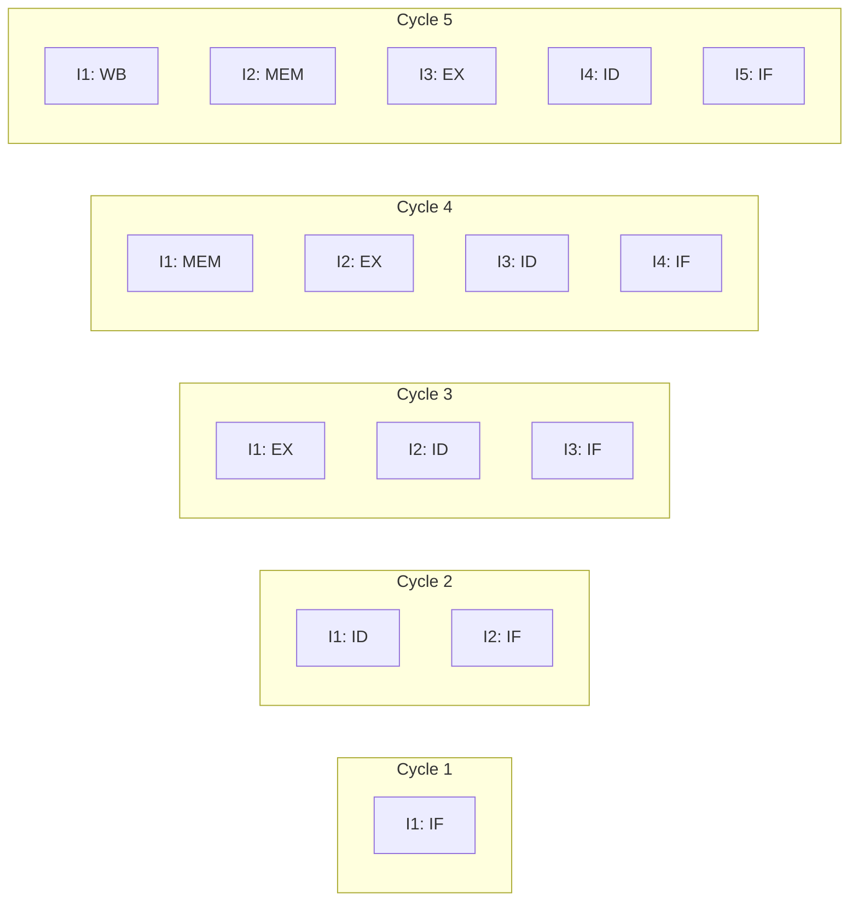
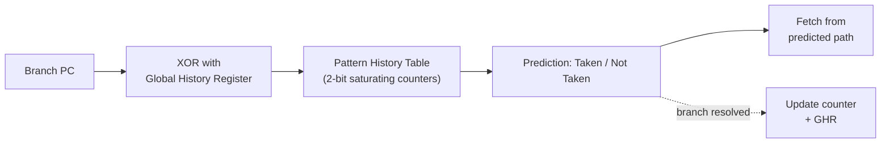

# 5 - Pipelining and Hazards

[toc]

> **TL;DR:** Pipelining is the single most important microarchitectural technique: it overlaps the execution of multiple instructions simultaneously by partitioning the datapath into stages separated by pipeline registers, achieving throughput of one instruction per cycle in the steady state. The cost is hazards — situations where instructions in different stages interfere. The three hazard classes (structural, data, and control) require forwarding paths, stalls, branch predictors, and speculative execution to manage. Understanding hazards is the key to understanding why real CPUs have the complexity they do, and why software that avoids branches and independent operations runs faster.

## Vocabulary

**Pipeline stage**: One of the n phases into which the datapath is divided. Each stage operates on a different instruction simultaneously. In a 5-stage pipeline: IF, ID, EX, MEM, WB.

---

**Pipeline register**: A register between pipeline stages that holds the output of one stage as input to the next. Allows each stage to work on a different instruction each cycle.

---

**Throughput (pipelined)**: In an ideal pipeline with n stages and cycle time T, throughput = 1 instruction per cycle = 1/T, regardless of n. Latency per instruction = n × T (longer than single-cycle).

---

**Hazard**: Any condition that prevents the next instruction in the stream from executing in its designated pipeline stage on the next cycle. Three kinds: structural, data, control.

---

**Structural hazard**: Two instructions in the pipeline simultaneously need the same hardware resource and that resource cannot serve both. Example: a unified memory (not split I$/D$) means IF and MEM cannot proceed simultaneously.

---

**Data hazard**: An instruction needs the result of an earlier instruction that has not yet written its result to the register file. Three subtypes: RAW (read-after-write), WAW (write-after-write), WAR (write-after-read). RAW is the critical one in an in-order pipeline.

---

**Read-After-Write (RAW) hazard**: Instruction B reads a register that instruction A (earlier in the stream) will write, but A has not yet reached the WB stage. Also called a *true dependency* or *flow dependency*.

---

**Forwarding (bypassing)**: Hardware that routes the result of an instruction from the output of the EX or MEM stage directly to the input of the EX stage for a subsequent instruction, without waiting for the WB stage to write the register file. Eliminates most RAW stalls.

---

**Load-use hazard**: A special case where a load instruction is immediately followed by an instruction that uses the loaded value. Forwarding alone cannot resolve this because the memory data is not available until after the MEM stage. Requires exactly one stall cycle.

---

**Stall (bubble)**: A NOP inserted into the pipeline to delay an instruction until its hazard is resolved. A stall wastes one cycle and reduces throughput.

---

**Control hazard**: A branch instruction whose outcome (taken or not taken) is not known until the EX or MEM stage, but the pipeline has already fetched and possibly begun decoding subsequent instructions.

---

**Branch penalty**: The number of pipeline stages flushed (converted to NOPs) when a branch is taken and the pipeline has already filled with instructions from the not-taken path.

---

**Branch predictor**: Hardware that guesses the outcome of a branch before it is resolved, so the pipeline can fetch instructions along the predicted path without stalling.

---

**Static prediction**: A fixed rule applied to every branch: predict always-not-taken, always-taken, or backward-taken/forward-not-taken. Requires no hardware history.

---

**Dynamic prediction**: A hardware predictor that tracks the history of each branch's past outcomes and uses it to predict future outcomes. Examples: bimodal (1-bit saturating counter), two-bit saturating counter, gshare, TAGE, neural (perceptron-based).

---

**Branch misprediction penalty**: The number of cycles wasted when the predictor guesses wrong and the pipeline must be flushed. For a 5-stage pipeline: 1–2 cycles. For a modern deep pipeline (Intel Raptor Lake ~19 stages): 15–20 cycles.

---

**Speculative execution**: Executing instructions past an unresolved branch, with the hardware poised to discard (squash) those instructions if the prediction turns out to be wrong.

---

**Out-of-order execution (OoO)**: Executing instructions in an order determined by data availability rather than program order, subject to the constraint that the *committed* state appears sequential. Eliminates many data hazard stalls.

---

**Reorder Buffer (ROB)**: The queue that holds all in-flight instructions in program order, allowing them to be committed in order (preserving sequential semantics) even if they executed out of order.

---

## Intuition

Pipelining is exactly like an assembly line. A car factory doesn't build one car start-to-finish before starting the next — it has a conveyor belt where each station handles one step simultaneously. A pipeline of 5 stages means 5 instructions are active simultaneously: one being fetched, one decoded, one executing, one accessing memory, one writing back. In steady state, one instruction completes every cycle.

The hazard types map cleanly to real-world assembly line problems: a structural hazard is two cars needing the same machine at the same time (resource conflict); a data hazard is a station needing a part that isn't ready yet (dependency); a control hazard is not knowing which product is coming next because the order depends on a decision not yet made (branch uncertainty).



**Figure:** Pipeline diagram. In cycle 5, all 5 stages are occupied. From cycle 5 onward, one instruction completes per cycle — throughput = 1 IPC.

## The 5-Stage Pipeline

The canonical RISC 5-stage pipeline maps directly onto the FDE stages from [4 - Datapath and Control](./4-datapath-and-control.md). Between each stage sits a **pipeline register** (a bank of flip-flops) that latches all values needed by the next stage. This physical separation is what makes simultaneous multi-instruction execution possible.

### Stage 1: IF — Instruction Fetch

Every cycle, the PC is used to fetch a 32-bit instruction from the L1 instruction cache. The adder computes PC+4. Both the instruction and PC+4 are stored in the IF/ID pipeline register. In a branch-free program, this stage is fully occupied every cycle. Branch prediction integrates here: the branch predictor reads the PC, predicts the outcome, and supplies the predicted next PC so the fetch of the next instruction does not stall.

### Stage 2: ID — Instruction Decode

The instruction is decoded: opcode, register numbers (rs1, rs2, rd), and immediate are extracted. The register file is read on rs1 and rs2 simultaneously. The sign-extended immediate is computed. The control unit generates all control signals. All of this — register values, immediate, control signals, and the PC+4 from the IF/ID register — is latched into the ID/EX pipeline register. The decode stage also detects potential hazards and may insert a stall here.

### Stage 3: EX — Execute

The ALU performs its operation on the two operands selected by the ALUSrc mux (register value or immediate). The result — whether an arithmetic value, a memory address, or a branch target — is the output. The Zero flag is computed for branches. For out-of-order pipelines, this stage is replaced by multiple execution units with a scheduler. Results are latched into EX/MEM.

### Stage 4: MEM — Memory Access

Load instructions read from the data cache; store instructions write. For all other instructions, the data cache is idle and the ALU result passes through. The MEM stage is where load-use hazards are resolved (by forwarding from MEM/WB to EX in the *next* cycle, after the one-cycle stall). Results land in MEM/WB.

### Stage 5: WB — Write Back

The write-back stage selects the correct value (ALU result for most instructions, memory read data for loads) and writes it to the register file at the rd address. This is the final stage; after WB, the instruction is *retired* and its architectural effect is committed.

## Hazard Detection and Resolution

### Structural Hazards

A structural hazard occurs when two instructions simultaneously need the same hardware resource. The most common: a unified memory in a 5-stage RISC pipeline — the IF stage reads instruction memory at the same cycle a load/store instruction is in MEM reading/writing data memory. The solution is simple: **separate the instruction cache from the data cache** (split L1). All modern CPUs have separate L1-I and L1-D caches. With split caches, structural hazards are essentially eliminated in the 5-stage pipeline.

> [!NOTE]
> A second structural hazard: if there is only one write port to the register file, two instructions completing in the same cycle cannot both write back. This is resolved either by ensuring the pipeline is structured to have only one WB per cycle (the 5-stage pipeline achieves this naturally), or by providing multiple write ports.

### Data Hazards and Forwarding

A RAW (read-after-write) hazard occurs when:
```
ADD x1, x2, x3      ; writes x1 in WB (cycle 5)
SUB x4, x1, x5      ; reads x1 in ID (cycle 3) — STALE VALUE
```

Without forwarding, the SUB reads x1 before ADD has written it. The result of ADD is available at the end of the EX stage (cycle 3 for ADD = cycle 5 result available end of EX). The SUB needs x1 at the start of its EX stage (cycle 4). Forwarding routes the EX/MEM pipeline register output (ADD's result, available after cycle 3) directly to the EX stage's ALU input for cycle 4. No stall needed.

**Forwarding paths needed:**

| From register | To register | When to forward |
| :--- | :--- | :--- |
| EX/MEM.ALUResult | EX.ALUInput | Immediately following instruction uses the result |
| MEM/WB.ALUResult or MEM/WB.MemData | EX.ALUInput | Instruction two back wrote the register |

Forwarding conditions (RISC-V):
```
Forward A = EX/MEM:
  if (EX/MEM.RegWrite && EX/MEM.rd ≠ 0 && EX/MEM.rd == ID/EX.rs1)
      ALU_input_A ← EX/MEM.ALUResult

Forward A = MEM/WB:
  if (MEM/WB.RegWrite && MEM/WB.rd ≠ 0
      && !(EX/MEM.RegWrite && EX/MEM.rd == ID/EX.rs1)
      && MEM/WB.rd == ID/EX.rs1)
      ALU_input_A ← MEM/WB result
```

(Same conditions for rs2 / ALU_input_B.)

### The Load-Use Hazard

The one hazard forwarding cannot eliminate:
```
LW  x1, 0(x2)       ; load — result available after MEM stage
ADD x3, x1, x4      ; needs x1 at the START of EX — one cycle too early
```

The load's result is available only at the end of the MEM stage (the EX/MEM register holds the *address*, not the data; the MEM/WB register holds the loaded data). The ADD needs the value at the start of EX — one cycle before MEM/WB is available.

**Resolution: one stall cycle (bubble).** The hazard detection unit detects this condition and:
1. Inserts a NOP (bubble) into the EX stage for one cycle.
2. Stalls the IF and ID stages (holds PC, prevents new instruction fetching/decoding).
3. Allows the load to complete MEM and latch into MEM/WB.
4. On the next cycle, forwarding from MEM/WB to EX resolves the dependency.

Net cost: exactly 1 stall cycle per load-use hazard. Compilers try to schedule an independent instruction between a load and its use (load-delay slot scheduling) to eliminate even this stall.

> [!IMPORTANT]
> A load-use hazard costs exactly **1 stall cycle** in a 5-stage in-order pipeline. No forwarding path can eliminate it because the data memory output is not available until after the cycle where EX starts for the dependent instruction. This is a fundamental latency of the memory interface, not a design choice.

### Control Hazards and Branch Prediction

When the pipeline fetches a branch instruction, it does not know the branch outcome until the EX stage (where the comparison is computed and the target address is computed). By that time, instructions at PC+4 and PC+8 have already entered IF and ID.

**Static approaches:**
- **Always not-taken:** Proceed as if the branch is not taken. If the branch is taken, flush the 1–2 instructions in the pipeline (1-cycle penalty for resolve-in-EX; 2-cycle if resolved in MEM). Works reasonably well for forward branches (often not taken, e.g. `if` bodies).
- **Predict-backwards-taken:** Backward branches (loop headers) are usually taken; forward branches (if statements) are usually not. A simple heuristic: branch direction determines prediction.

**Dynamic prediction — 2-bit saturating counter:**
Each branch address maps to a 2-bit counter (4 states: strongly-not-taken, weakly-not-taken, weakly-taken, strongly-taken). On taken outcome, increment; on not-taken, decrement. Saturates at the extremes. Accuracy: ~85–90% on typical integer code.

**GShare / TAGE:**
Modern predictors hash the branch PC with a global branch history register (GHR) to index a table of 2-bit counters. TAGE (Tagged Geometric History Length predictor) uses multiple tables indexed by geometrically increasing history lengths. TAGE achieves ~94–97% prediction accuracy on SPEC CPU benchmarks. Intel's Raptor Lake and AMD's Zen 4 both use variants of TAGE internally.



**Figure:** GShare branch predictor. The PC and global history are XORed to index a table of 2-bit counters. The same table is updated when the branch resolves.

## Math: Pipeline Performance

For a program with N instructions, a k-stage pipeline, and cycle time T_stage:

**Ideal throughput (no hazards):**
```math
\text{Throughput} = \frac{1}{T_{stage}}
```

**Ideal speedup over single-cycle:**
```math
\text{Speedup}_{ideal} = k
```

**Actual speedup with stalls:**
```math
\text{Execution time} = (N + \text{stall cycles}) \times T_{stage}
```

```math
\text{CPI}_{actual} = 1 + \frac{\text{stall cycles}}{N}
```

Let `b_f` = branch frequency (fraction of instructions that are branches), `p` = misprediction rate, `P` = branch penalty in cycles, `l_f` = load frequency, `l_h` = load-use hazard rate (fraction of loads with a use in the immediately following instruction):

```math
\text{CPI} = 1 + b_f \cdot p \cdot P + l_f \cdot l_h \cdot 1
```

For example: 20% branches, 10% misprediction rate, 15-cycle penalty (modern deep pipeline); 25% loads, 30% of loads have a load-use hazard:

```math
\text{CPI} = 1 + 0.20 \times 0.10 \times 15 + 0.25 \times 0.30 \times 1 = 1 + 0.30 + 0.075 = 1.375
```

The branch misprediction penalty (0.30 added CPI) dominates. This is why branch predictors receive enormous engineering investment.

## Real-world Example

The following C code demonstrates a load-use hazard and branch-heavy code, then shows how to rewrite to minimize stalls. The compiler flag `-O0` prevents reordering; `-O2` handles it automatically.

```c
#include <stdio.h>
#include <stdint.h>

/* Load-use hazard demo: the load of arr[0] is immediately used */
int load_use_hazard(int *arr) {
    int x = arr[0];    /* LW x1, 0(a0) */
    return x + 1;      /* ADDI a0, x1, 1  — uses x1 one instruction later: 1 stall! */
}

/* Compiler workaround: use an independent instruction between load and use */
int load_use_avoided(int *arr, int y) {
    int x = arr[0];    /* LW x1, 0(a0) */
    int z = y * 2;     /* MUL x2, a1, x3  — independent work fills the slot */
    return x + z;      /* ADD a0, x1, x2  — x1 now in MEM/WB: forwarded, no stall */
}

/* Branch-heavy: hard to predict — alternates taken/not-taken */
int64_t branch_heavy(int64_t *data, int n) {
    int64_t sum = 0;
    for (int i = 0; i < n; i++) {
        if (data[i] > 0)          /* branch: prediction depends on data pattern */
            sum += data[i];
    }
    return sum;
}

/* Branch-free equivalent: eliminates misprediction penalty */
int64_t branch_free(int64_t *data, int n) {
    int64_t sum = 0;
    for (int i = 0; i < n; i++) {
        /* Branchless: mask = 0xFFFF...F if data[i] > 0, else 0 */
        int64_t mask = -(int64_t)(data[i] > 0);  /* arithmetic right shift trick */
        sum += data[i] & mask;                    /* add only if positive */
    }
    return sum;
}

/* Benchmark both on random data with ~50% positive values */
#include <stdlib.h>
#include <time.h>

int main(void) {
    const int N = 100000000;
    int64_t *data = malloc(N * sizeof(int64_t));
    srand(42);
    for (int i = 0; i < N; i++)
        data[i] = (int64_t)(rand() % 201) - 100;   /* -100 to +100 */

    clock_t t0, t1;

    t0 = clock();
    int64_t r1 = branch_heavy(data, N);
    t1 = clock();
    printf("branch_heavy:  %ld ms, sum=%ld\n", (t1-t0)*1000/CLOCKS_PER_SEC, r1);

    t0 = clock();
    int64_t r2 = branch_free(data, N);
    t1 = clock();
    printf("branch_free:   %ld ms, sum=%ld\n", (t1-t0)*1000/CLOCKS_PER_SEC, r2);

    free(data);
    return 0;
}
```

> [!TIP]
> On a modern x86-64 CPU, `branch_free` is typically 2–3× faster than `branch_heavy` when the data pattern is random (~50% prediction rate = essentially random = near-maximum misprediction rate). When the data is sorted or has a clear pattern, the branch predictor's history achieves >95% accuracy and `branch_heavy` may actually match or beat `branch_free` (branch-free uses a multiply which has higher latency than a correctly-predicted branch). Always benchmark both; the "branchless is always faster" rule has many exceptions.

Compile with: `gcc -O2 -o hazards hazards.c && ./hazards`

## In Practice

### Modern Superscalar Out-of-Order Pipelines

Real CPUs are much more complex than the 5-stage model. Key differences:

**Superscalar:** Issue multiple instructions per cycle. Intel Raptor Lake has a 6-wide issue width — up to 6 µops per cycle can enter the out-of-order engine. The front-end fetches up to 6 µops/cycle; the back-end has 12 execution ports.

**Out-of-order execution:** Instructions don't execute in program order. The scheduler (Reservation Station or Issue Queue) holds up to ~80–160 µops waiting for their operands. When operands are ready, the µop is dispatched to an available execution port. Instructions may complete out of order; the ROB commits them in order.

**Register renaming:** WAR (write-after-read) and WAW (write-after-write) hazards — called *false dependencies* because they are about register names, not real data — are eliminated by mapping each destination register to a fresh physical register. The ROB holds ~512 physical registers; the architectural register file has only 16–32. Renaming is done in the decode/rename stage.

**Deep pipelines and branch penalties:** Intel's Raptor Lake has ~19 stages. A branch misprediction flushes ~15–20 cycles of speculative work. This is why the branch predictor receives hundreds of KB of SRAM and implements TAGE-like algorithms — the cost of a single misprediction is enormous.

> [!CAUTION]
> Speculative execution is the root cause of the Spectre family of vulnerabilities (2018). When the CPU speculatively executes instructions after a mispredicted branch, those speculative instructions access memory and leave microarchitectural side effects (cache state changes) even if they are eventually squashed. An attacker can measure these side effects to read arbitrary memory. Mitigations (retpoline, microcode updates, IBRS, STIBP) all add overhead — some benchmarks show 5–30% slowdowns on syscall-heavy workloads. See [12 - Security in Architecture](./12-security-in-architecture.md).

### RISC-V Pipeline Microarchitecture Examples

- **BOOM (Berkeley Out-of-Order Machine):** A superscalar out-of-order RISC-V core available as open-source RTL. 2–4 wide issue, ROB size 64–256. Used in academic research.
- **CVA6 (formerly Ariane):** A 6-stage in-order RISC-V core targeting ASIC implementation. Used in automotive and IoT.
- **SiFive P870:** Commercial high-performance in-order RISC-V. 5+ GHz target, TSMC N5.

## Pitfalls

- **"Forwarding eliminates all data hazards."** — Forwarding eliminates most RAW hazards, but not the load-use hazard. That always costs exactly 1 stall cycle in a 5-stage pipeline. Compilers know this and try to schedule an independent instruction in the slot after every load.
- **"More pipeline stages always means higher frequency."** — More stages means shorter stages (shorter critical path per stage), enabling higher clock frequency. But more stages also means longer branch misprediction penalties, higher pipeline fill time, and more complex hazard handling. Beyond ~30 stages, the misprediction penalty dominates and real throughput degrades. Intel's Prescott (2004) with a 31-stage pipeline is the cautionary example.
- **"A predicted branch has zero cost."** — A correctly-predicted branch has near-zero throughput cost (the pipeline fetches from the predicted path without interruption). But a predicted branch still adds instruction-fetch overhead: the predictor lookup itself takes time and energy, and the predictor can only be updated after the branch resolves.
- **"Out-of-order CPUs don't have hazards."** — OoO CPUs still have hazards — they handle them differently. RAW hazards stall dependent µops in the issue queue until their producer writes to the physical register file. Control hazards still require branch prediction. The hardware resolves hazards dynamically rather than requiring the compiler to schedule around them.
- **"The 5-stage pipeline is what runs in a real CPU."** — Real CPUs have 14–31 stages with wide superscalar execution, multiple levels of predictors, and out-of-order engines. The 5-stage model is the *conceptual foundation* — all the advanced features are extensions or modifications of the same principles.

## Exercises

### Exercise 1: Pipeline diagram with hazards

Draw a pipeline execution diagram (cycle × instruction matrix) for the following RISC-V instruction sequence. Identify all hazards, show where stalls (bubbles) are inserted, and show any forwarding paths.

```
I1: LW   x1, 0(x5)
I2: ADD  x2, x1, x3
I3: SUB  x4, x1, x6
I4: AND  x7, x2, x4
```

#### Solution

Without forwarding, every instruction that reads x1 or x2/x4 after they are written must stall until WB. With forwarding, most hazards are resolved. Let's trace:

**Hazard analysis:**
- I2 reads x1, written by I1 (LW). **Load-use hazard** — 1 stall required even with forwarding. (LW result available end of MEM; I2 needs it start of EX — one cycle too early for forwarding from MEM/WB.)
- I3 reads x1, written by I1 (LW). With the 1-cycle stall after I1, I3 enters EX at cycle 5, and I1's MEM/WB register is available at cycle 4 end → forwarded from MEM/WB. **No additional stall.**
- I4 reads x2 (written by I2) and x4 (written by I3). I4 enters EX at cycle 7; I2 completes EX at cycle 5 end (EX/MEM available) → forwarded. I3 completes EX at cycle 6 end → forwarded from EX/MEM. **No additional stall.**

**Pipeline diagram (I = instruction, S = stall/bubble):**

```
        | C1 | C2 | C3 | C4 | C5 | C6 | C7 | C8 | C9 |
--------|----|----|----|----|----|----|----|----|-----|
I1 (LW) | IF | ID | EX | MM | WB |    |    |    |    |
BUBBLE  |    |    |    | IF | ID | -- | -- | -- | -- |   (stall 1 cycle)
I2 (ADD)|    | IF | ID | ** | EX | MM | WB |    |    |   (ID stalled, ** = stall)
I3 (SUB)|    |    | IF | ** | ID | EX | MM | WB |    |   (IF stalled, ** = stall)
I4 (AND)|    |    |    |    | IF | ID | EX | MM | WB |
```

Forwarding paths:
- I1→I3: MEM/WB (cycle 4) → EX input of I3 (cycle 6). EX/MEM available end of C4; I3 EX is C6. Wait — I need to recount. Let me redo with stall correctly placed.

Let me recount carefully with 1 stall for load-use:

```
Cycle:  1    2    3    4    5    6    7    8
I1 LW:  IF   ID   EX   MEM  WB
I2 ADD: IF   ID  stall  EX   MEM  WB          (stall inserted; I2's EX delayed to C5)
I3 SUB:      IF  stall  ID   EX   MEM  WB     (also stalled; continues normally)
I4 AND:           IF   stall  ID   EX   MEM  WB
```

Forwarding: I1 MEM/WB (available end C4) → I2 EX (C5 start): ✓ MEM/WB→EX forward.
I1 MEM/WB → I3 EX (C6): also forward from MEM/WB (both I2 and I3 benefit from the same forwarding path).
I2 EX/MEM (available end C5) → I4 EX (C7): forward from EX/MEM.
I3 EX/MEM (available end C6) → I4 EX (C7): also forward from EX/MEM.

Total cycles: 8 (ideal without any stalls: 4 + 4 = 8 for 4 instructions, but with stall = 8). Actually ideal = 4+3 = 7 steady state stages + pipeline fill. With stall = 8 cycles. The single load-use stall costs exactly 1 cycle, as expected.

---

### Exercise 2: Branch prediction accuracy impact

A processor has a 14-cycle branch misprediction penalty. 20% of instructions are branches. Calculate CPI for:
(a) Always-not-taken predictor (70% of branches are taken in this program)
(b) A 2-bit predictor with 94% accuracy
(c) A TAGE predictor with 97% accuracy

#### Solution

CPI formula: CPI = 1 + branch_freq × misprediction_rate × penalty

**(a) Always-not-taken, 70% of branches are taken:**
Misprediction rate = fraction of branches that are taken = 0.70.
```
CPI = 1 + 0.20 × 0.70 × 14 = 1 + 1.96 = 2.96
```

**(b) 2-bit predictor, 94% accuracy:**
Misprediction rate = 1 - 0.94 = 0.06.
```
CPI = 1 + 0.20 × 0.06 × 14 = 1 + 0.168 = 1.168
```

**(c) TAGE predictor, 97% accuracy:**
Misprediction rate = 0.03.
```
CPI = 1 + 0.20 × 0.03 × 14 = 1 + 0.084 = 1.084
```

Speedup of TAGE over always-not-taken: 2.96 / 1.084 ≈ **2.73×** faster. This illustrates why modern CPUs invest heavily in branch prediction hardware — the performance gap between a naive and a state-of-the-art predictor is nearly 3× on branch-heavy code.

---

### Exercise 3: Forwarding logic implementation

Write the forwarding conditions in pseudocode for the EX stage of a 5-stage RISC-V pipeline. Handle both EX/MEM and MEM/WB forwarding for both rs1 and rs2.

#### Solution

```
// Forwarding unit: runs at the start of the EX stage
// Inputs: ID/EX.rs1, ID/EX.rs2
//         EX/MEM.rd, EX/MEM.RegWrite, EX/MEM.ALUResult
//         MEM/WB.rd, MEM/WB.RegWrite, MEM/WB.WriteData (ALUResult or MemData)

// Forward A (rs1 input to ALU)
if (EX/MEM.RegWrite == 1  AND  EX/MEM.rd != 0
    AND  EX/MEM.rd == ID/EX.rs1):
    ForwardA = 2'b10  // use EX/MEM.ALUResult
else if (MEM/WB.RegWrite == 1  AND  MEM/WB.rd != 0
    AND NOT (EX/MEM.RegWrite AND EX/MEM.rd == ID/EX.rs1)
    AND  MEM/WB.rd == ID/EX.rs1):
    ForwardA = 2'b01  // use MEM/WB.WriteData
else:
    ForwardA = 2'b00  // use ID/EX.ReadData1 (register file value)

// Forward B (rs2 input to ALU — same structure, replace rs1 with rs2)
if (EX/MEM.RegWrite == 1  AND  EX/MEM.rd != 0
    AND  EX/MEM.rd == ID/EX.rs2):
    ForwardB = 2'b10
else if (MEM/WB.RegWrite == 1  AND  MEM/WB.rd != 0
    AND NOT (EX/MEM.RegWrite AND EX/MEM.rd == ID/EX.rs2)
    AND  MEM/WB.rd == ID/EX.rs2):
    ForwardB = 2'b01
else:
    ForwardB = 2'b00
```

The `NOT (EX/MEM.RegWrite AND EX/MEM.rd == ...)` guard on the MEM/WB condition prevents double-forwarding when both EX/MEM and MEM/WB match the same register. The EX/MEM path is fresher (more recent), so it takes priority. This situation — two consecutive instructions writing the same register — is the WAW case: the second write is the one that matters.

---

### Exercise 4: Load-delay scheduling

The following RISC-V assembly has a load-use hazard. Reorder the instructions (without changing the program's result) to eliminate the stall.

```asm
lw   t0, 0(a0)       ; load arr[0]
add  t1, t0, t2      ; t1 = arr[0] + t2    <-- hazard!
lw   t3, 4(a0)       ; load arr[1]
add  t4, t3, t2      ; t4 = arr[1] + t2    <-- hazard!
add  t5, t1, t4      ; t5 = t1 + t4
```

#### Solution

The two load-use hazards (each LW immediately followed by an ADD using the loaded value) each cost 1 stall cycle. Total: 2 extra stall cycles.

Strategy: reorder so each ADD is at least 1 instruction after its corresponding LW.

```asm
lw   t0, 0(a0)       ; load arr[0]
lw   t3, 4(a0)       ; load arr[1]  <-- moved up: fills load-delay slot for first LW
add  t1, t0, t2      ; t1 = arr[0] + t2  (t0 available: 2 cycles after LW -- OK)
add  t4, t3, t2      ; t4 = arr[1] + t2  (t3 available: 2 cycles after its LW -- OK)
add  t5, t1, t4      ; t5 = t1 + t4      (no hazard: t1/t4 both done)
```

This reordering is valid: `lw t3, 4(a0)` does not depend on `t0` (just reads `a0` and an offset — independent). Now:
- First LW is in MEM when the second LW is in EX. When the first ADD enters EX, the first LW has completed MEM → forwarding from MEM/WB resolves it. No stall.
- Second LW similarly resolved by MEM/WB forwarding for the second ADD.

Result: 0 stall cycles instead of 2. This is exactly what a compiler does with `-O1` or higher when it has enough independent instructions to fill the load-delay slot.

---

### Exercise 5: Out-of-order execution intuition

The following sequence has a long-latency instruction (multiply = 3 cycles) in the middle. In an in-order 5-stage pipeline, how many stall cycles does it create? In an out-of-order CPU, can those stalls be eliminated?

```asm
I1: MUL  x1, x2, x3   ; 3-cycle latency
I2: ADD  x4, x5, x6   ; independent of I1
I3: ADD  x7, x8, x9   ; independent of I1 and I2
I4: ADD  x10, x1, x4  ; depends on I1 (result of MUL) and I2
```

#### Solution

**In-order pipeline:**

MUL produces x1 after 3 cycles in EX. I4 needs x1 at the start of its EX stage. Without stalls, I4 would enter EX 3 cycles after I1 starts EX. But I4 is 3 instructions after I1 — in a 5-stage in-order pipeline it would enter EX only 1 cycle after I1's EX starts. So 3 − 1 = **2 stall cycles** are needed after I1 (the pipeline stalls I2, I3, I4 for 2 cycles until I1's result is available).

Wait — I2 and I3 are independent. But in an *in-order* pipeline, I2 cannot proceed past the stall point even though it's independent. In-order means instructions execute in program order: if I1 causes a stall, I2 and I3 stall too even if they are independent. The 2 stall cycles waste the potential work of I2 and I3.

Total stall cycles: 2. CPI for this 4-instruction sequence: (4 + 2) / 4 = 1.5.

**Out-of-order CPU:**

The out-of-order scheduler sees I2 and I3 have no dependencies on I1. It issues I2 and I3 while I1 is computing in the multiplier unit. I2 and I3 fill the stall cycles with real work:

- Cycle 1: I1 dispatched to multiplier; I2 dispatched to ALU (independent)
- Cycle 2: I1 computing; I3 dispatched to ALU (independent)
- Cycle 3: I1 computing; I4 waiting in scheduler (needs I1 and I2, I2 done)
- Cycle 4: I1 done → result forwarded; I4 dispatched to ALU

The OoO CPU executes I1, I2, I3 overlapped, then I4 immediately follows. Total execution: 4 cycles for 4 instructions → CPI = 1. The 2 stall cycles are completely hidden by executing independent instructions in parallel.

This is the core value proposition of out-of-order execution: it finds instruction-level parallelism (ILP) automatically, without requiring the programmer or compiler to reorder instructions manually.

## Sources

- Patterson, D. A., & Hennessy, J. L. (2020). *Computer Organization and Design RISC-V Edition* (2nd ed.). Chapter 4.5–4.9.
- Hennessy, J. L., & Patterson, D. A. (2019). *Computer Architecture: A Quantitative Approach* (6th ed.). Chapters 3 (ILP) and Appendix C (Pipelining).
- Bryant, R. E., & O'Hallaron, D. R. (2016). *Computer Systems: A Programmer's Perspective* (3rd ed.). Chapter 4.
- Seznec, A. & Michaud, P. (2006). "A case for (partially) tagged geometric history length branch prediction." *Journal of Instruction-Level Parallelism*, 8. (Original TAGE paper.) https://jilp.org/vol8/v8paper1.pdf
- Fog, A. Instruction tables. https://www.agner.org/optimize/instruction_tables.pdf

## Related

- [4 - Datapath and Control](./4-datapath-and-control.md)
- [3 - The CPU and the Instruction Set Architecture](./3-the-cpu-and-the-instruction-set-architecture.md)
- [6 - Memory Hierarchy and Caches](./6-memory-hierarchy-and-caches.md)
- [12 - Security in Architecture](./12-security-in-architecture.md)
