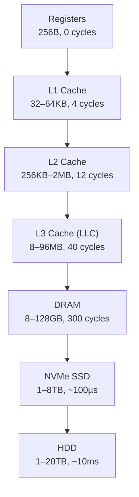

# 6 - Memory Hierarchy and Caches

[toc]

> **TL;DR:** The memory hierarchy exists because fast memory is expensive and slow memory is cheap — SRAM (cache) is ~100–1000× faster than DRAM (main memory), which is ~1000× faster than SSD, but also orders of magnitude more expensive per bit. Caches exploit spatial and temporal locality to keep frequently-used data near the CPU, bridging the speed gap. The metric Average Memory Access Time (AMAT) = hit time + miss rate × miss penalty quantifies cache effectiveness. Cache-hostile code — random access patterns, large working sets — is the dominant cause of poor real-world performance on hardware that otherwise looks impressive on CPU-bound benchmarks.

## Vocabulary

**Memory hierarchy**: The layered organisation of storage from fastest/smallest/most expensive to slowest/largest/cheapest: registers → L1 cache → L2 cache → L3 cache → DRAM → SSD → HDD → network.

---

**SRAM (Static RAM)**: Six-transistor bit cells. Retains data as long as power is applied; no refresh needed. Fast (~0.5–5 ns access time), expensive (~10–100× per bit vs DRAM). Used for registers and caches.

---

**DRAM (Dynamic RAM)**: One-transistor-one-capacitor bit cells. Requires periodic refresh (capacitor leaks). Slower (~50–100 ns effective latency), dense, cheap. Used for main memory.

---

**Cache**: A small, fast SRAM buffer that holds copies of recently-used DRAM data. The CPU checks the cache first; if the data is there (hit), the access completes quickly; if not (miss), the data is fetched from the next level.

---

**Cache line (cache block)**: The unit of transfer between cache levels. Typically 64 bytes on x86-64 and AArch64. When a miss occurs, an entire line is fetched, not just the single byte or word requested.

---

**Hit rate**: Fraction of memory accesses that are satisfied by the cache without going to a slower level.

---

**Miss rate**: 1 − hit rate. The fraction of accesses that require fetching from the next level.

---

**Hit time**: Time to access data from the cache on a hit. L1 ≈ 4–5 cycles; L2 ≈ 12–15; L3 ≈ 30–50.

---

**Miss penalty**: Extra cycles required to serve a miss from the next level. L1 miss → L2 penalty ≈ 12 cycles; L1 miss → DRAM penalty ≈ 100–300 cycles.

---

**AMAT (Average Memory Access Time)**: The expected access time averaged over hits and misses.

```math
\text{AMAT} = t_{hit} + \text{miss\_rate} \times t_{miss\_penalty}
```

---

**Temporal locality**: The tendency to re-access the same memory address soon after accessing it. A loop body that reads the same variable repeatedly exhibits temporal locality.

---

**Spatial locality**: The tendency to access addresses near recently-accessed addresses. Iterating through an array exhibits spatial locality — elements at address A, A+8, A+16, ... are accessed in sequence.

---

**Direct-mapped cache**: A cache where each memory address maps to exactly one cache set (one way). Simple hardware, but susceptible to conflict misses.

---

**Set-associative cache**: Each address maps to one of S sets, and within a set there are W ways (lines). An S-way set-associative cache is also called a W-way cache. More ways → fewer conflict misses, but more complex hardware and slightly higher hit time.

---

**Fully associative cache**: A cache with only one set — any line can hold any memory block. Maximum flexibility, minimum conflict misses, but expensive tag comparison hardware (must compare all tags in parallel). Used for small structures like TLBs.

---

**Tag**: The high-order bits of an address stored in a cache line's metadata, used to verify that the cache line holds the data for the requested address.

---

**Valid bit**: A 1-bit flag in each cache line indicating whether the line holds meaningful data (versus being uninitialised after power-on or eviction).

---

**Dirty bit**: Present in write-back caches. Set when the line has been written by the CPU but not yet propagated to the next level.

---

**Write-through**: Cache policy where every write is propagated immediately to the next memory level. Simple but wastes bandwidth.

---

**Write-back**: Cache policy where writes update only the cache line, setting the dirty bit. The line is written to the next level only when it is evicted. More efficient; used in all modern L1/L2/L3 caches.

---

**Write-allocate**: On a write miss, fetch the line from the next level into the cache before writing. Pairs with write-back.

---

**No-write-allocate**: On a write miss, write directly to the next level without bringing the line into the cache. Pairs with write-through.

---

**LRU (Least Recently Used)**: The eviction policy that replaces the cache line that was accessed least recently. Optimal for temporal locality. Approximated in hardware (true LRU needs O(W) bits per set; pseudo-LRU uses tree structures).

---

**3Cs of cache misses**: Cold (compulsory) miss — first access to a line; Capacity miss — working set exceeds cache size; Conflict miss — too many lines map to the same set in a direct-mapped or low-associativity cache.

---

## Intuition

Think of a cache as a desk. Your full library is in a storage room (DRAM) — vast but distant. You keep the books you are actively using on your desk (L1 cache). When you need a new book, you go to the storage room (miss penalty), get it, and put it on your desk. When the desk is full, you put back the book you have used least recently (LRU eviction). If your desk is large enough and your reading habits are consistent, you rarely have to go to the storage room — that is cache effectiveness.

The spatial locality insight is why caches fetch entire lines (64 bytes) on a miss, not just the single word requested. When you access `array[0]`, it is very likely you will next access `array[1]`, `array[2]`, etc. Fetching the whole line speculatively puts those next elements in cache before you ask for them.

## The Memory Hierarchy

Different levels of the hierarchy trade speed against cost and capacity. Real 2025-era numbers for a high-end desktop CPU:

| Level | Size | Latency | Bandwidth | Technology |
| :--- | :---: | :---: | :---: | :--- |
| Register | 32 × 8B = 256 B | 0 cycles | unlimited | Flip-flops |
| L1-I / L1-D | 32–64 KB each | 4–5 cycles | ~800 GB/s | SRAM (6T) |
| L2 | 256 KB – 2 MB | 12–15 cycles | ~400 GB/s | SRAM (6T) |
| L3 (LLC) | 8–96 MB | 30–50 cycles | ~200 GB/s | SRAM (6T) |
| DRAM (DDR5) | 8–128 GB | ~80 ns = ~300 cycles at 3.6 GHz | ~50–100 GB/s | DRAM (1T1C) |
| NVMe SSD | 1–8 TB | ~100 µs | ~7 GB/s | NAND Flash |
| HDD | 1–20 TB | ~10 ms | ~100–200 MB/s | Magnetic |
| Network (local) | ∞ | ~100 µs | ~10–100 Gbps | varies |



**Figure:** Memory hierarchy. Each level is 10–1000× slower, larger, and cheaper per bit than the one above it.

## Cache Organisation

### Address Decomposition

For a cache with S sets, W ways, and B bytes per line, a physical address is split into three fields:

```math
\underbrace{[\text{tag}]}_{\text{identifies which block}}\ 
\underbrace{[\text{set index}]}_{\text{selects which set}}\ 
\underbrace{[\text{block offset}]}_{\text{selects byte within line}}
```

- **Block offset bits:** log₂(B). For B=64: 6 bits.
- **Set index bits:** log₂(S). For S=64 sets: 6 bits.
- **Tag bits:** remaining address bits. For a 48-bit physical address: 48 − 6 − 6 = 36 bits.

### Direct-Mapped (1-Way Set-Associative)

Each address maps to exactly one line. Tag comparison is a single equality check. Simple, fast, low area — but **conflict misses** are frequent when two heavily-used addresses map to the same line.

```
Address A maps to set S:
    [tag_A | set_S | offset]

Address B also maps to set S:
    [tag_B | set_S | offset]

If A and B are both hot, each access evicts the other → thrashing
```

A classic case: two N×N matrices accessed in a double loop, where N is a power of 2 exactly aligned so row i of matrix A and row i of matrix B map to the same set. Every iteration alternately evicts the other → effectively 0% hit rate. Solution: pad the matrix by one cache line to break the aliasing.

### Set-Associative Cache

An S-set, W-way cache has S sets each with W lines. An address maps to one set (via the index bits), and within that set the W ways are searched in parallel. If any way matches the tag, it's a hit. On a miss, one of the W ways is evicted (LRU or pseudo-LRU).

```
Set 0: [tag0 | data0] [tag1 | data1] ... [tagW-1 | dataW-1]
Set 1: [tag  | data ] [tag  | data ] ... [tag    | data    ]
...
Set S-1: ...
```

Higher associativity reduces conflict misses. The diminishing returns: going from 1-way to 2-way removes most conflict misses; going from 4-way to 8-way yields modest additional benefit. Modern L1 caches are typically 4–8 way; L3 is often 16-way.

> [!IMPORTANT]
> The associativity of a cache affects which access patterns it handles well. A 4-way set-associative cache can hold up to 4 "hot" lines that map to the same set — but if 5 simultaneously hot lines all map to the same set, the 5th evicts one of the others (conflict miss). A fully associative cache would handle this perfectly, but fully associative hardware requires comparing all tags simultaneously, which is impractical at L3 scale.

### Write Policies

**Write-through + no-write-allocate:** Every store goes immediately to the next level. Reads fetch the line into cache on a miss. Clean and simple; all stores bypass the cache. Used in some L1 caches on embedded processors and in GPU constant-cache logic.

**Write-back + write-allocate (standard):** Stores update only the cached line, setting the dirty bit. On a miss, fetch the line first (write-allocate), then update. On eviction, write dirty lines back to the next level. This is the standard policy for all modern L1/L2/L3 data caches. It minimises bus traffic by batching writes.

## AMAT: Average Memory Access Time

AMAT captures the effective memory latency averaged over the hit/miss distribution:

```math
\text{AMAT} = t_{L1,hit} + \text{MR}_{L1} \times (t_{L2,hit} + \text{MR}_{L2} \times (t_{L3,hit} + \text{MR}_{L3} \times t_{DRAM}))
```

Example with typical numbers:
```
t_L1 = 4 cycles,  MR_L1 = 5%
t_L2 = 12 cycles, MR_L2 = 20%
t_L3 = 40 cycles, MR_L3 = 50%
t_DRAM = 300 cycles

AMAT = 4 + 0.05 × (12 + 0.20 × (40 + 0.50 × 300))
     = 4 + 0.05 × (12 + 0.20 × (40 + 150))
     = 4 + 0.05 × (12 + 0.20 × 190)
     = 4 + 0.05 × (12 + 38)
     = 4 + 0.05 × 50
     = 4 + 2.5 = 6.5 cycles
```

If L1 miss rate increases to 10%: AMAT = 4 + 0.10 × 50 = 9 cycles. A 2× increase in L1 miss rate → 38% increase in AMAT. Cache miss rate is the dominant lever in memory-bound applications.

## Real-world Example

The classic cache behaviour demonstration: row-major vs column-major matrix traversal. Both compute the same sum, but their cache behaviour differs drastically.

```c
#include <stdio.h>
#include <stdlib.h>
#include <time.h>
#include <string.h>

#define N 4096

static double A[N][N];  /* 4096 * 4096 * 8 bytes = 128 MB — much larger than L3 */

void init_matrix(void) {
    for (int i = 0; i < N; i++)
        for (int j = 0; j < N; j++)
            A[i][j] = (double)(i + j);
}

/* Row-major: A[0][0], A[0][1], ..., A[0][N-1], A[1][0], ... 
   Each cache line holds 8 doubles (8 * 8 = 64 bytes).
   After A[i][j] causes a miss, A[i][j+1]..A[i][j+7] are in cache.
   Spatial locality: ~1 miss per 8 accesses → 87.5% hit rate in practice */
double sum_row_major(void) {
    double sum = 0.0;
    for (int i = 0; i < N; i++)
        for (int j = 0; j < N; j++)
            sum += A[i][j];
    return sum;
}

/* Column-major: A[0][0], A[1][0], ..., A[N-1][0], A[0][1], ...
   A[i][j] and A[i+1][j] are N*8 = 32768 bytes apart.
   Each access to a new row = new cache line = cache miss almost every access.
   Spatial locality: almost none → near 100% miss rate */
double sum_col_major(void) {
    double sum = 0.0;
    for (int j = 0; j < N; j++)
        for (int i = 0; i < N; i++)
            sum += A[i][j];
    return sum;
}

int main(void) {
    init_matrix();

    struct timespec t0, t1;
    double r;

    clock_gettime(CLOCK_MONOTONIC, &t0);
    r = sum_row_major();
    clock_gettime(CLOCK_MONOTONIC, &t1);
    long row_ns = (t1.tv_sec - t0.tv_sec) * 1000000000L + (t1.tv_nsec - t0.tv_nsec);
    printf("row-major:    %ld ms (sum=%.0f)\n", row_ns/1000000, r);

    clock_gettime(CLOCK_MONOTONIC, &t0);
    r = sum_col_major();
    clock_gettime(CLOCK_MONOTONIC, &t1);
    long col_ns = (t1.tv_sec - t0.tv_sec) * 1000000000L + (t1.tv_nsec - t0.tv_nsec);
    printf("col-major:    %ld ms (sum=%.0f)\n", col_ns/1000000, r);

    printf("Speedup:      %.1fx\n", (double)col_ns / row_ns);
    return 0;
}
/* Expected output (Ryzen 9 7950X, DDR5-6000):
   row-major:  ~120 ms
   col-major:  ~600–900 ms
   Speedup:    ~5–7x
   On a machine with a small L3 (8MB) and large N: speedup can reach 20x */
```

> [!WARNING]
> The N=4096 matrix is 128 MB — larger than any L3 cache. The row-major loop is fast because it reads each 64-byte cache line sequentially (spatial locality). The column-major loop jumps 32 KB between each access, thrashing every level of cache. This difference — 5–20× — is achievable with a zero-change algorithm. Cache-hostile access patterns are among the most impactful performance bugs in ML and scientific computing.

Compile: `gcc -O2 -o cache_demo cache_demo.c && ./cache_demo`

## In Practice

### L1 Cache on Real Silicon

Apple M4's L1 data cache: 64 KB per P-core, 8-way set-associative, 64-byte lines. Intel Raptor Lake P-core: 48 KB L1-D, 12-way, 64-byte lines. The L1 hit latency on both is 4 clock cycles (load-to-use latency; the cache lookup itself takes 3 cycles plus a 1-cycle pipeline stage).

The 4-cycle L1 load latency is why OoO CPUs hold large numbers of instructions in flight — a single L1 hit requires waiting 4 cycles before the result is available, during which 4 × IPC ≈ 16–24 µops could execute if enough independent work is available.

### Hardware Prefetching

Modern CPUs implement hardware prefetchers that detect streaming and strided access patterns and fetch cache lines before they are requested. The Apple M4's prefetcher is remarkably aggressive — sequential access patterns can achieve near-DRAM-bandwidth utilisation even with small cache size. But prefetchers are pattern-based; random access (e.g. pointer chasing through a linked list) defeats them completely.

> [!TIP]
> For ML inference, the single biggest performance tuning step on CPU is often to restructure weight tensors so that the inference loop reads weights sequentially. A transformer's attention head computation accessed in the wrong order can cause the entire L3 cache to thrash on each token. Fusing operations (FlashAttention-style) specifically restructures the access pattern to fit within L2/L3 on the specific hardware — it is primarily a cache optimisation, not a FLOP optimisation.

### Cache Coherence Preview

In a multicore CPU, each core has its own L1 (and sometimes L2) cache. If core 0 writes to address X (in its L1), core 1's L1 may still hold the old value — they are now **incoherent**. The cache coherence protocol (MESI, covered in [9 - Multicore, SMP, and Cache Coherence](./9-multicore-smp-and-cache-coherence.md)) maintains the invariant that all cores see a consistent view of memory. The cost: write operations require acquiring exclusive ownership of the cache line, which involves inter-core coherence traffic on the cache interconnect.

### Non-Uniform Memory Access (NUMA)

On multi-socket server systems (AMD EPYC, Intel Xeon), DRAM is physically attached to specific sockets. A process running on socket 0 accessing memory that is physically attached to socket 1 incurs higher latency ("remote NUMA" access). Linux's `numactl` controls process-to-NUMA-node binding. ML training frameworks that span multiple sockets must be aware of NUMA topology to avoid cross-socket memory traffic bottlenecks.

## Pitfalls

- **"L1 cache misses are rare if the working set fits in L3."** — An L3 miss that goes to DRAM costs 200–300 cycles; an L1 miss that hits L3 costs 30–50 cycles. Both are significant. Programs that "fit in L3" but have poor temporal or spatial locality within L3 can still bottleneck on cache misses.
- **"Write-through is safer than write-back."** — Write-through is simpler (no dirty eviction logic) but wastes write bandwidth — every store goes to main memory immediately. Write-back is universally used in modern CPUs because the bandwidth savings are enormous, and the dirty-eviction complexity is solved at design time, not by the programmer.
- **"Larger cache always means better performance."** — True on average, but not for all workloads. A program with a tiny working set that fits in L1 gains nothing from a larger L3. Larger caches also have higher associativity-lookup power and may increase L1 hit time slightly. The benefit is workload-dependent.
- **"Cache-friendly means row-major."** — Cache-friendly means *sequential access* along the dimension in which the data is laid out in memory. C uses row-major (last index varies fastest); Fortran uses column-major. A Fortran matrix operation written as column-major is cache-friendly in Fortran; porting it to C requires transposing the loop order.
- **"false sharing is a cache hit."** — False sharing occurs when two cores write different words that happen to be in the same cache line. Each write invalidates the other core's copy, causing constant coherence traffic even though the cores are accessing different memory addresses. From the programmer's view, the loads and stores succeed (no cache miss in the traditional sense), but the coherence traffic causes massive performance degradation. See [9 - Multicore, SMP, and Cache Coherence](./9-multicore-smp-and-cache-coherence.md).

## Exercises

### Exercise 1: AMAT calculation

A CPU has the following memory system:
- L1: 4-cycle hit time, 3% miss rate
- L2: 14-cycle hit time, 25% miss rate
- L3: 45-cycle hit time, 40% miss rate
- DRAM: 280-cycle access time

Calculate the AMAT. If the L1 miss rate is reduced to 1% by doubling the L1 size, what is the new AMAT?

#### Solution

AMAT formula (hierarchical):
```
AMAT = t_L1 + MR_L1 × (t_L2 + MR_L2 × (t_L3 + MR_L3 × t_DRAM))
```

Inner term: t_L3 + MR_L3 × t_DRAM = 45 + 0.40 × 280 = 45 + 112 = 157
Middle term: t_L2 + MR_L2 × 157 = 14 + 0.25 × 157 = 14 + 39.25 = 53.25
Outer: AMAT = 4 + 0.03 × 53.25 = 4 + 1.597 = **5.60 cycles**

With L1 miss rate 1%:
AMAT = 4 + 0.01 × 53.25 = 4 + 0.5325 = **4.53 cycles**

Speedup from reduced L1 miss rate: 5.60 / 4.53 = **1.24×**. A 3× improvement in L1 miss rate (3% → 1%) yields only 24% AMAT improvement because the L1 hit time (4 cycles, the dominant term for low miss rates) is unchanged. This illustrates the diminishing returns of reducing miss rates that are already small.

---

### Exercise 2: Direct-mapped cache lookup

A direct-mapped cache has the following parameters:
- 16 lines total (S = 16 sets, 1 way)
- 4 bytes per line (B = 4)
- 8-bit byte addresses

(a) How is a byte address decomposed into tag, index, and offset fields?
(b) For addresses 0x00, 0x40, 0x80, 0xC0 — do they all map to the same set? Show your work.
(c) What kind of miss would repeatedly accessing 0x00 and 0x40 in a loop cause?

#### Solution

**(a) Address decomposition:**
- Block offset: log₂(B) = log₂(4) = 2 bits (bits 1:0)
- Set index: log₂(S) = log₂(16) = 4 bits (bits 5:2)
- Tag: 8 − 2 − 4 = 2 bits (bits 7:6)

Address format: `[tag 7:6] [index 5:2] [offset 1:0]`

**(b) Mapping of addresses:**
- 0x00 = 0000 0000 → tag=00, index=0000=0, offset=00. Maps to **set 0**.
- 0x40 = 0100 0000 → tag=01, index=0000=0, offset=00. Maps to **set 0**.
- 0x80 = 1000 0000 → tag=10, index=0000=0, offset=00. Maps to **set 0**.
- 0xC0 = 1100 0000 → tag=11, index=0000=0, offset=00. Maps to **set 0**.

All four addresses map to set 0 but have different tags. In a direct-mapped cache, they all compete for the single line in set 0.

**(c) Repeatedly accessing 0x00 and 0x40:** Each access to 0x00 brings tag=00 into set 0, evicting whatever was there (tag=01 from 0x40). Each access to 0x40 brings tag=01 into set 0, evicting tag=00. The result is continuous **conflict misses (thrashing)** — 100% miss rate despite only accessing two addresses. This is a direct-mapped conflict miss. A 2-way set-associative cache would solve it: set 0 would have two ways and could hold both addresses simultaneously.

---

### Exercise 3: Cache sizing and associativity tradeoffs

A workload accesses a 4 MB array sequentially in a loop (1000 iterations). The system has:
- L2: 512 KB, 4-way, 64-byte lines
- L3: 8 MB, 16-way, 64-byte lines

(a) Does the array fit in L3? What miss type do you expect for the first iteration?
(b) After the first iteration, what hit rate do you expect for subsequent iterations in L3?
(c) If the workload is changed to random access of the same 4 MB array, how does the miss rate change?

#### Solution

**(a) First iteration:** The array is 4 MB; the L3 is 8 MB. The array fits entirely in L3 (4 < 8). On the first pass through the array, every line is a **cold (compulsory) miss** — the first access to any given 64-byte line has never been in cache before. Total cold misses: 4 MB / 64 bytes = 65,536 cache lines.

**(b) Subsequent iterations (sequential):** After the first iteration, all 65,536 lines are in the L3 (the array fits with room to spare). Sequential re-access hits L3 on every access. **Hit rate ≈ 100%** for all subsequent iterations, except at the very beginning of each pass where the prefetcher hasn't loaded ahead yet (negligible).

**(c) Random access:** With random access, each access is to a uniformly random address in the 4 MB range. The L3 holds 8 MB → can hold the entire 4 MB working set after warm-up. So after the first pass, random accesses should also hit L3 at ~100%.

However: **temporal locality matters.** If random accesses revisit recently-accessed lines frequently, L3 stays warm. If each access is to a unique address (streaming random, no repetition), the L3 fills up and starts evicting lines before they are re-accessed → capacity misses. At 65,536 lines in the working set and an 8 MB L3 with 131,072 lines, there's 2× capacity — good spatial margin, so the working set fits and hit rate remains high.

The real-world difference between sequential and random emerges for **worksets larger than L3**: sequential access lets the prefetcher hide DRAM latency; random access defeats prefetching completely and every miss becomes a full-latency DRAM access.

---

### Exercise 4: Write policy analysis

A CPU with a write-back, write-allocate L1 data cache executes the following code:
```c
int arr[8] = {0, 0, 0, 0, 0, 0, 0, 0};  // 32 bytes, assume fits in 1 cache line
arr[3] = 42;   // write 1
arr[3] = 99;   // write 2
int x = arr[3]; // read
```

Trace the cache state and memory traffic for each operation. Assume the cache is initially empty (cold).

#### Solution

**Initial state:** arr is in DRAM; the cache line containing arr (all 32 bytes of it) is not in the L1 cache.

**`arr[3] = 42` (write 1):**
- Cache lookup: MISS (write miss — the line is not in cache).
- Write-allocate policy: fetch the entire 64-byte cache line containing arr from DRAM. **Memory traffic: 1 cache line read from DRAM.**
- Write the value 42 to `arr[3]` in the (now-cached) line. Set dirty bit = 1.
- Cache state: line in L1, dirty, `arr[3]` = 42.

**`arr[3] = 99` (write 2):**
- Cache lookup: HIT (line is now in L1).
- Write 99 to `arr[3]` in the cache. Dirty bit remains 1.
- **No memory traffic** — write-back means the new value stays in cache.
- Cache state: line in L1, dirty, `arr[3]` = 99.

**`x = arr[3]` (read):**
- Cache lookup: HIT (line is still in L1).
- Read `arr[3]` = 99 from cache. **No memory traffic.**
- `x` = 99.

**Total memory traffic:** 1 cache line fetched from DRAM (on the first write miss). Zero traffic for the subsequent write and read. This is the benefit of write-back: only the initial fetch touches memory; all subsequent operations are served from the cache. A write-through policy would have sent 2 writes to memory (one for each store), costing bandwidth even though the values were immediately overwritten.

---

### Exercise 5: Cache-friendly matrix multiplication

Standard matrix multiplication `C = A × B` for N×N matrices has three nested loops. The innermost loop accesses A row-wise (cache-friendly) but B column-wise (cache-hostile). Rewrite using a loop interchange or blocking strategy to improve B's access pattern.

#### Solution

**Standard (naive) implementation:**
```c
// O(N^3), B accessed column-wise (cache-hostile for large N)
for (int i = 0; i < N; i++)
    for (int j = 0; j < N; j++)
        for (int k = 0; k < N; k++)
            C[i][j] += A[i][k] * B[k][j];
// B[0][j], B[1][j], ..., B[N-1][j] — stride N*sizeof(double) apart → cache miss ~every access
```

**Loop interchange (k before j):** Reorder loops so B is accessed row-wise:
```c
// Interchange j and k loops
for (int i = 0; i < N; i++)
    for (int k = 0; k < N; k++) {
        double a_ik = A[i][k];   // scalar hoist
        for (int j = 0; j < N; j++)
            C[i][j] += a_ik * B[k][j];  // B[k][j] accessed sequentially: cache-friendly!
    }
// B[k][0], B[k][1], ..., B[k][N-1] — sequential row access: spatial locality.
// A[i][k] hoisted outside inner loop: temporal locality (one load, N uses).
// C[i][j] accessed sequentially too: cache-friendly.
```

**Blocked (tiled) for large N:** When N is large enough that even one row of B doesn't fit in L1, use blocking to keep the working set in L1:
```c
#define BS 64  // block size: 64*8bytes = 512B, fits several blocks in L1
for (int i = 0; i < N; i += BS)
    for (int j = 0; j < N; j += BS)
        for (int k = 0; k < N; k += BS)
            // Compute the BS×BS sub-block of C
            for (int ii = i; ii < i+BS && ii < N; ii++)
                for (int jj = j; jj < j+BS && jj < N; jj++) {
                    double sum = C[ii][jj];
                    for (int kk = k; kk < k+BS && kk < N; kk++)
                        sum += A[ii][kk] * B[kk][jj];
                    C[ii][jj] = sum;
                }
// Each BS×BS block of A, B, C fits in ~3*64*64*8 = 96KB → L2 cache.
// Reuse ratio: BS^3 / (3*BS^2) = BS/3 operations per loaded element — very high.
```

The blocked version is the conceptual basis for BLAS DGEMM implementations (GotoBLAS, OpenBLAS, BLIS). Real GEMM adds register blocking, SIMD vectorisation, and prefetching on top — but the fundamental cache-friendliness comes from exactly this tiling structure.

## Sources

- Patterson, D. A., & Hennessy, J. L. (2020). *Computer Organization and Design RISC-V Edition* (2nd ed.). Chapter 5.
- Hennessy, J. L., & Patterson, D. A. (2019). *Computer Architecture: A Quantitative Approach* (6th ed.). Chapter 2.
- Bryant, R. E., & O'Hallaron, D. R. (2016). *Computer Systems: A Programmer's Perspective* (3rd ed.). Chapter 6.
- Fog, A. *Optimizing software in C++*. https://www.agner.org/optimize/optimizing_cpp.pdf
- Goto, K. & van de Geijn, R. (2008). "Anatomy of High-Performance Matrix Multiplication." *ACM TOMS*, 34(3). https://dl.acm.org/doi/10.1145/1356052.1356053

## Related

- [5 - Pipelining and Hazards](./5-pipelining-and-hazards.md)
- [7 - Virtual Memory and TLBs](./7-virtual-memory-and-tlbs.md)
- [9 - Multicore, SMP, and Cache Coherence](./9-multicore-smp-and-cache-coherence.md)
- [11 - Performance Analysis](./11-performance-analysis.md)
