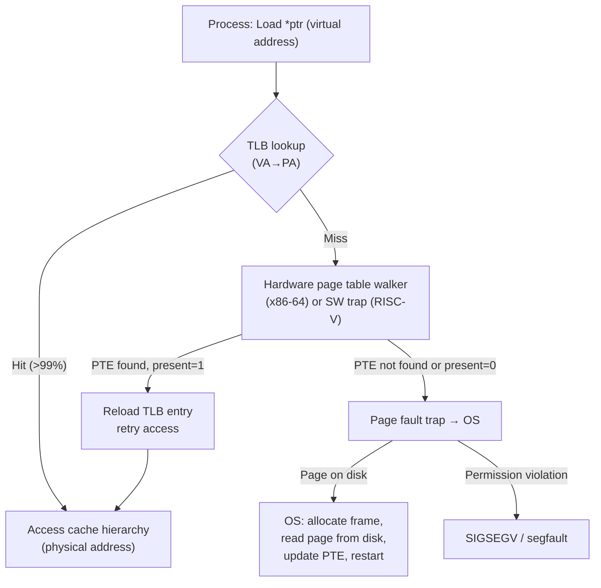
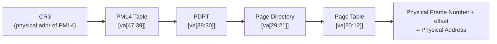

# 7 - Virtual Memory and TLBs

[toc]

> **TL;DR:** Virtual memory gives every process the illusion of a private, contiguous address space that can be larger than physical DRAM, while the OS and hardware silently map virtual addresses to physical pages. The Memory Management Unit (MMU) performs this translation on every memory access using a page table maintained by the OS — but walking the page table is expensive, so the Translation Lookaside Buffer (TLB) caches recent translations. A TLB miss triggers a page table walk; a page fault triggers an OS trap, page-in from disk, and restart. Virtual memory enables process isolation, efficient DRAM multiplexing, and memory-mapped files — foundational to every modern operating system.

## Vocabulary

**Virtual address**: The address a process uses to access memory. Each process has its own virtual address space starting at 0, making processes appear isolated from each other.

---

**Physical address**: The actual address in DRAM hardware. Produced by translating the virtual address through the page table.

---

**Page**: The unit of virtual memory management. x86-64 and AArch64: 4 KB default (also support 2 MB / 1 GB huge pages). A page is the finest granularity at which the OS manages permissions and residency.

---

**Frame (physical page frame)**: A 4 KB-aligned region of physical DRAM. Pages (virtual) map to frames (physical).

---

**Page table**: An OS-managed data structure mapping virtual page numbers to physical frame numbers, along with permission bits (readable, writable, executable, user/kernel), accessed/dirty bits, and present bit.

---

**Page Table Entry (PTE)**: One entry in the page table. On x86-64: 64 bits. Contains the physical frame number, P (present), R/W, U/S (user/supervisor), A (accessed), D (dirty), XD (execute-disable), and other control bits.

---

**MMU (Memory Management Unit)**: The hardware unit inside the CPU that intercepts every memory access, performs VA→PA translation using the page table, and checks permissions. The TLB is part of the MMU.

---

**TLB (Translation Lookaside Buffer)**: A fully-associative or set-associative hardware cache of recent VA→PA translations. Eliminates the need for a full page table walk on most accesses. Hit rate typically >99% for normal programs.

---

**TLB hit**: The translation for the virtual page is found in the TLB. Cost: 0–1 extra cycles (TLB lookup is parallel with cache access on modern CPUs).

---

**TLB miss**: The translation is not in the TLB. Hardware page table walker (x86-64) or OS software handler (RISC-V) walks the page table to find the translation and reload the TLB.

---

**Page fault**: The OS-level trap triggered when a page is accessed but is not present in DRAM (the present bit in the PTE is 0). The OS handler loads the page from disk (swap or file), updates the PTE, and restarts the faulting instruction.

---

**Multi-level page table**: A tree-structured page table that reduces memory overhead. x86-64 uses a 4-level table (PML4 → PDPT → PD → PT) or 5-level (PML5 + LA57 extension for 57-bit virtual addresses).

---

**CR3 (x86-64)**: The control register holding the physical address of the top-level page table (PML4). Loaded by the OS on a context switch. The MMU reads CR3 on every TLB miss to begin the page walk.

---

**TTBR0/TTBR1 (AArch64)**: Translation Table Base Registers. TTBR0 for user-space addresses (lower half); TTBR1 for kernel addresses (upper half). Allows kernel and user page tables to coexist without full context-switch overhead for kernel-only accesses.

---

**ASID (Address Space Identifier)**: A tag attached to TLB entries to identify which process they belong to. Allows the TLB to hold translations from multiple processes simultaneously, avoiding a full TLB flush on every context switch.

---

**Huge pages**: 2 MB or 1 GB pages (x86-64) or 2 MB / 512 MB / 1 GB (AArch64). Reduces TLB pressure — one TLB entry covers 2 MB instead of 4 KB → 512× fewer TLB entries needed for the same memory range.

---

**Swap space**: Disk space used to store pages that have been evicted from DRAM. Accessing a swapped page triggers a page fault with ~10 ms penalty (HDD) or ~100 µs (NVMe SSD).

---

**ASLR (Address Space Layout Randomisation)**: An OS security feature that randomises the virtual addresses of the stack, heap, and shared libraries at process start. Defeats attacks that require knowing absolute addresses.

---

## Intuition

Virtual memory is a lie that makes programming easier and makes the OS's job manageable. Without it, every program would need to know the exact physical DRAM addresses it can use, coordinate with other programs, and crash if DRAM runs out. With virtual memory, every program believes it owns the entire address space — the OS quietly shares the physical DRAM among all processes by maintaining the illusion.

The TLB is the performance trick that makes virtual memory nearly free. Translating every address through the page table would add a full memory access (to read the PTE) before every real memory access — doubling or worse the memory latency. The TLB caches these translations so that 99%+ of accesses pay no translation overhead.

The page fault is the mechanism that allows lazy loading: a process's address space can be larger than available DRAM because only the actively-used pages need to be in RAM. The OS evicts cold pages to disk and brings them back only on access — just-in-time memory management.



**Figure:** VA→PA translation flow. The TLB hit path (top) completes in ~1 cycle alongside cache lookup. The page fault path (bottom) involves disk I/O and OS intervention.

## Address Translation Mechanism

### Virtual Address Space Layout (x86-64 Linux)

x86-64 uses 48-bit virtual addresses (with 5-level paging, 57 bits). The 64-bit address space is split:

```
0x0000_0000_0000_0000 – 0x0000_7FFF_FFFF_FFFF  (128 TB): User space
0xFFFF_8000_0000_0000 – 0xFFFF_FFFF_FFFF_FFFF  (128 TB): Kernel space
(bits 48–63 must all be 0 or all be 1 — "canonical addresses")
```

Within user space, a typical process layout (ASLR randomises base addresses):

```
 High addresses (0x7FFF_FFFF_FFFF)
 ┌──────────────────────────────┐
 │  Stack (grows downward ↓)    │  ← RSP; each thread has its own stack
 │  ...                         │
 ├──────────────────────────────┤
 │  Memory-mapped files / libs  │  ← mmap() region, shared libraries
 ├──────────────────────────────┤
 │  Heap (grows upward ↑)       │  ← malloc / new / mmap anon
 ├──────────────────────────────┤
 │  BSS (uninitialised data)    │  ← zero-initialised globals
 │  Data (initialised data)     │  ← initialised globals
 │  Text (code)                 │  ← executable pages (r-x)
 └──────────────────────────────┘
 Low addresses (0x0000_0000_0000)
```

### 4-Level Page Table (x86-64)

A 4 KB page requires 12 offset bits (2¹² = 4096). The remaining 36 bits of a 48-bit virtual address are split into four 9-bit indices (9 × 4 = 36) for a 4-level tree:

```
Bits [47:39] = PML4 index    (9 bits, 512 entries)
Bits [38:30] = PDPT index    (9 bits, 512 entries)
Bits [29:21] = PD index      (9 bits, 512 entries)
Bits [20:12] = PT index      (9 bits, 512 entries)
Bits [11:0]  = Page offset   (12 bits, 4096 bytes)
```

The page table walk accesses 4 levels, each level requiring a memory read:



**Figure:** x86-64 4-level page table walk. CR3 → 4 memory accesses → physical address. Each dereference reads 8 bytes (one PTE). Without the TLB, every memory access would cost 4 + 1 = 5 memory accesses.

> [!IMPORTANT]
> A TLB miss on x86-64 is handled entirely in hardware by the page walker unit — the CPU walks all 4 levels without OS involvement (as long as the PTE is present). Only a page fault (present bit = 0, or permission violation) traps to the OS. On RISC-V without the Sv48 hardware walker, TLB misses trap to the OS software handler — much slower.

### TLB Organisation

A modern L1 TLB is typically small (32–64 entries) and fully or highly associative. A miss from the L1 TLB checks a larger L2 TLB (~1000–2000 entries) before initiating a hardware walk.

**Apple M4 TLB:**
- L1 ITLB: 192 entries
- L1 DTLB: 192 entries
- L2 TLB: ~3000 entries, unified

**Intel Raptor Lake (P-core):**
- L1 ITLB: 256 entries (4 KB pages)
- L1 DTLB: 96 entries (4 KB) + 32 (2 MB)
- L2 TLB (STLB): 2048 entries, 4-way

With a 4 KB page, a 64-entry TLB covers 64 × 4 KB = 256 KB of address space without a miss. Programs with hot working sets larger than 256 KB will see TLB misses (L1), falling back to the L2 TLB covering ~8–12 MB. Huge pages (2 MB) expand the L1 TLB coverage to 64 × 2 MB = 128 MB — crucial for large ML model weight tensors.

### ASIDs and Context Switch Overhead

Without ASIDs, every context switch requires flushing the entire TLB (since all TLB entries become invalid when CR3 changes to a different process's page table). A TLB flush costs the equivalent of many TLB misses — the hot working set must be rebuilt from scratch.

ASIDs (Arm TLBs call them VMIDs or ASIDs; x86-64 calls them PCIDs — Process Context IDentifiers) tag each TLB entry with the ID of the process that owns it. On a context switch, CR3 is loaded with the new process's page table, and the PCID field is updated — but the old entries (with the old PCID) remain in the TLB. When the old process is scheduled back, its PCID is restored and its TLB entries are immediately valid. This reduces context-switch overhead significantly in workloads with many short-lived processes (web servers, containers).

> [!TIP]
> For ML inference servers running many concurrent small requests, huge pages (via `mmap` with `MAP_HUGETLB` or `transparent_huge_pages=always` in Linux) significantly reduce TLB pressure on the model weight tensor. A 70B parameter BF16 model is ~140 GB of weights. With 4 KB pages, that requires 35 million TLB entries — impossible to cache. With 1 GB huge pages, only 140 entries are needed. The TLB hit rate for weight accesses goes from poor to near-perfect.

## Page Faults

A page fault is the OS mechanism for demand-paged virtual memory. When the MMU encounters a PTE with the present bit = 0, it raises a page fault exception. The OS page fault handler:

1. **Validates the access:** Is the faulting virtual address within any valid mapping? If not → SIGSEGV (segfault).
2. **Locates the page:** Is the page in swap space? Is it a file-backed mapping (mmap)? Is it an anonymous mapping that has never been touched (lazy allocation)?
3. **Allocates a physical frame:** If DRAM is full, the OS evicts a cold page (LRU-approximating page replacement).
4. **Loads the page:** Reads from disk/swap if necessary. For anonymous pages that have never been accessed, this is a zero-fill (no disk I/O).
5. **Updates the PTE:** Sets the present bit, writes the physical frame number.
6. **Returns to user space:** The faulting instruction is restarted with the page now present.

**Demand paging:** Modern OS kernels use demand paging — pages are not brought into DRAM until first accessed. `mmap()` a 100 GB file and the OS allocates no DRAM until you touch pages within it. This is why a process's virtual address space can be much larger than physical DRAM.

**Copy-on-Write (CoW):** When `fork()` creates a child process, rather than copying all of the parent's DRAM, the OS marks all pages read-only and shares them. When either process writes a shared page, a page fault fires, the OS copies the page ("copy-on-write"), and the writing process gets its own private copy. This makes `fork()` fast even for large processes — only modified pages are copied.

## Math: TLB Reach and Coverage

With a TLB of E entries and page size P bytes, the maximum address range coverable without a TLB miss is:

```math
\text{TLB reach} = E \times P
```

For an L1 DTLB with 96 entries and 4 KB pages: reach = 96 × 4096 = 384 KB.

For the same TLB with 2 MB huge pages: reach = 96 × 2 MB = 192 MB.

For a workload whose hot working set is W bytes, the expected TLB miss rate (first approximation) is:

```math
\text{TLB miss rate} \approx \max\left(0,\ \frac{W - \text{TLB reach}}{W}\right)
```

When W << TLB reach, miss rate → 0. When W >> TLB reach, miss rate → 1 − reach/W. For a model weight tensor of 140 GB with 4 KB-page L1 TLB reach of 384 KB: miss rate ≈ 1 − 384 KB / 140 GB ≈ 100%. This is why every large-tensor workload benefits dramatically from huge pages.

## Real-world Example

The following C code demonstrates demand paging, CoW via `fork()`, and TLB pressure measurement using `perf`.

```c
#define _GNU_SOURCE
#include <stdio.h>
#include <stdlib.h>
#include <string.h>
#include <unistd.h>
#include <sys/mman.h>
#include <sys/wait.h>
#include <fcntl.h>

/* Demonstrate demand paging: allocate 1 GB virtually, touch only 1 MB */
void demand_paging_demo(void) {
    const size_t VIRT_SIZE = 1ULL << 30;  /* 1 GB virtual allocation */
    const size_t TOUCH_SIZE = 1ULL << 20; /* touch only 1 MB */

    /* mmap: allocates virtual address space but no physical pages yet */
    char *buf = mmap(NULL, VIRT_SIZE, PROT_READ | PROT_WRITE,
                     MAP_PRIVATE | MAP_ANONYMOUS, -1, 0);
    if (buf == MAP_FAILED) { perror("mmap"); exit(1); }

    printf("Mapped 1 GB virtually. RSS before touch: see /proc/self/status\n");

    /* Touch only the first 1 MB — only these pages will be faulted in */
    memset(buf, 0xAB, TOUCH_SIZE);

    printf("Touched 1 MB. RSS after touch: see /proc/self/status\n");
    /* Verify: cat /proc/self/status | grep VmRSS → should be ~1 MB, not 1 GB */

    munmap(buf, VIRT_SIZE);
}

/* Demonstrate CoW: fork() shares pages until write */
void cow_demo(void) {
    const size_t SIZE = 64 * 1024 * 1024;  /* 64 MB */
    char *buf = malloc(SIZE);
    memset(buf, 0xCC, SIZE);  /* fully populate — all pages in DRAM */

    printf("Parent PID %d: buf[0] = 0x%02X at VA=%p\n", getpid(), (uint8_t)buf[0], (void*)buf);

    pid_t pid = fork();
    if (pid == 0) {
        /* Child: reading buf[0] hits a shared (CoW) page — no fault yet */
        printf("Child PID %d: buf[0] = 0x%02X (shared, no copy)\n", getpid(), (uint8_t)buf[0]);
        /* Writing triggers a CoW page fault — the page is copied for child only */
        buf[0] = 0xDD;
        printf("Child PID %d: buf[0] = 0x%02X (after CoW write)\n", getpid(), (uint8_t)buf[0]);
        exit(0);
    }
    wait(NULL);
    /* Parent's copy unchanged: CoW preserved isolation */
    printf("Parent PID %d: buf[0] = 0x%02X (unchanged after child write)\n",
           getpid(), (uint8_t)buf[0]);
    free(buf);
}

/* Demonstrate huge pages: allocate with MAP_HUGETLB for TLB efficiency */
void huge_page_demo(void) {
    const size_t SIZE = 2 * 1024 * 1024;  /* 2 MB = one huge page */
    char *buf = mmap(NULL, SIZE, PROT_READ | PROT_WRITE,
                     MAP_PRIVATE | MAP_ANONYMOUS | MAP_HUGETLB,
                     -1, 0);
    if (buf == MAP_FAILED) {
        printf("Huge page allocation failed (need hugepages reserved: "
               "echo 512 > /proc/sys/vm/nr_hugepages)\n");
        return;
    }
    memset(buf, 0, SIZE);
    printf("Huge page allocated: 2 MB backed by one 2 MB TLB entry\n");
    munmap(buf, SIZE);
}

int main(void) {
    demand_paging_demo();
    cow_demo();
    huge_page_demo();
    return 0;
}
```

> [!NOTE]
> On Linux, you can observe page fault counts for a process using `perf stat -e page-faults,major-faults ./your_program`. Minor faults (page is in memory but not mapped — no disk I/O) are almost free (<1 µs). Major faults (page must be read from disk) are expensive (100 µs for NVMe, 10 ms for HDD). A PyTorch training job that maps checkpoints with `torch.load` will incur major faults on the first epoch if the weights are larger than DRAM.

Compile: `gcc -O2 -o virt_mem virt_mem.c && ./virt_mem`

## In Practice

### TLB Shootdowns in Multicore Systems

When one CPU core modifies a PTE (e.g. munmap removes a mapping), all other cores that might have the old translation cached in their TLBs must be notified to invalidate it. This **TLB shootdown** is done via an inter-processor interrupt (IPI). The OS sends an IPI to every core that might have the stale translation; those cores execute the `INVLPG` (x86-64) or `TLBI` (AArch64) instruction. TLB shootdowns are a significant source of latency in memory-intensive workloads with many processes sharing mappings — common in multi-tenant inference servers.

### Meltdown and the KPTI Patch

The Meltdown vulnerability (2018) exploited the fact that, before the exploit was discovered, x86-64 CPUs mapped the kernel's virtual address space into every process's page table (marked non-accessible to user mode). A side-channel allowed user code to read kernel memory. The fix — Kernel Page Table Isolation (KPTI) — creates two separate page tables per process: one for user mode (no kernel mappings), one for kernel mode (full mappings). Every syscall and interrupt requires a CR3 switch — a TLB flush on CPUs without PCID support. KPTI increased syscall overhead by 5–30% on affected workloads. See [12 - Security in Architecture](./12-security-in-architecture.md).

### Virtual Memory in ML Systems

ML training frameworks allocate large contiguous virtual memory regions for model weights, gradients, and activations. PyTorch's allocator (`torch.cuda.caching_allocator`) manages CUDA virtual memory, which is backed by the GPU's own page table and TLB. CUDA Unified Memory extends this to CPU-GPU shared address spaces, with page migration handled by the CUDA driver — essentially implementing demand paging between GPU HBM and host DRAM, with all the TLB and page fault machinery running at the CUDA level.

> [!WARNING]
> `mlock()` (or `mlockall()`) pins pages in DRAM, preventing them from being swapped out. This eliminates major page faults but prevents the OS from reclaiming the locked memory under pressure. ML inference services that call `mlock()` on model weights get predictable latency — no page fault on the first inference request — but must budget DRAM carefully. Over-locking can cause the OOM killer to terminate other processes.

## Pitfalls

- **"Virtual and physical addresses are the same thing."** — They are completely different namespaces. Every pointer in a C program is a virtual address; the DRAM chip only sees physical addresses. The MMU translates between them. They only coincide in special scenarios (identity-mapped kernel memory in some OS configurations, physical address mode in early boot).
- **"Page faults always involve disk I/O."** — Minor page faults (e.g. first write to a newly-mmap'd anonymous page, or CoW fault) do not involve disk I/O. Only major page faults (page was paged out to swap) require disk access. Minor faults are nearly free; major faults are expensive.
- **"The TLB is managed by the OS."** — On x86-64, TLB fills are done entirely in hardware by the page walker unit. The OS manages the page table data structure in memory; the hardware reads it to fill the TLB. On RISC-V without the hardware walker extension, TLB fills are done by OS software (slower, but simpler hardware).
- **"Huge pages always improve performance."** — Huge pages reduce TLB pressure, which helps working sets larger than TLB reach. But huge pages require contiguous physical memory — harder to allocate when DRAM is fragmented. On a system with many small, diverse allocations, huge pages may cause internal fragmentation (a 2 MB page used for a 10 KB allocation wastes 2 MB − 10 KB of DRAM). Use huge pages selectively for large, long-lived allocations.
- **"ASLR makes addresses unpredictable across all runs."** — ASLR randomises base addresses, but within a run, the layout is fixed. An attacker who can read one address (via a format string or info leak) can compute others by adding known offsets. ASLR is mitigation, not elimination.

## Exercises

### Exercise 1: VA→PA translation

Given a 32-bit virtual address space with 2-level page tables, 4 KB pages, and the following:
- Page size: 4 KB
- PTE size: 4 bytes
- Level-1 (page directory) entries: 1024
- Level-2 (page table) entries per directory: 1024

(a) How many bits are in the page offset? The L2 PT index? The L1 PD index?
(b) How much physical memory does a fully-populated page table require?
(c) If a process only uses 16 MB of address space, how much page table memory is needed?

#### Solution

**(a) Bit allocation:**
- Page offset: log₂(4096) = **12 bits**
- L2 PT index: log₂(1024) = **10 bits** (indexes into a single L2 page table)
- L1 PD index: log₂(1024) = **10 bits** (indexes into the page directory)
- Total: 10 + 10 + 12 = 32 bits ✓

**(b) Fully-populated page table size:**
- The page directory has 1024 entries × 4 bytes = 4 KB.
- Each of the 1024 L2 tables has 1024 entries × 4 bytes = 4 KB.
- Total: 4 KB (PD) + 1024 × 4 KB (PTs) = 4 KB + 4 MB ≈ **4 MB**.
- Plus the pages themselves: the entire 32-bit address space is 4 GB. The tables are metadata.

**(c) Process using only 16 MB:**
16 MB / (4 MB per L2 table coverage) = 4 L2 tables needed.
(Each L2 table covers 1024 pages × 4 KB = 4 MB of virtual address space.)

Memory: 1 PD (4 KB) + 4 PTs (4 × 4 KB = 16 KB) = **20 KB**.
This is the key advantage of multi-level page tables: sparse address spaces require proportionally small tables.

---

### Exercise 2: TLB miss rate and huge pages

A program accesses a 256 MB tensor sequentially. The L1 DTLB has 96 entries for 4 KB pages and 32 entries for 2 MB pages.

(a) What is the TLB miss rate for each access using 4 KB pages?
(b) What is the TLB miss rate using 2 MB huge pages?
(c) How much does huge page use reduce TLB-induced overhead, assuming each TLB miss costs 20 cycles (L2 TLB hit + walk) and the access itself costs 4 cycles (L1 cache hit)?

#### Solution

**(a) 4 KB pages:**
TLB reach = 96 entries × 4 KB = 384 KB. Working set = 256 MB. Since 256 MB >> 384 KB, the TLB is effectively always missing for random or strided accesses that span more than 384 KB.

For sequential access, the access pattern is highly predictable. After a miss for page P, the next 4 KB of sequential accesses hit (the same TLB entry). Miss rate = 1 miss per 4 KB / (4 KB / 8 bytes per access) = **1 miss per 512 accesses** = 0.2% per access (for 8-byte double reads).

But TLB entries are replaced as new pages come in. With only 96 entries and 256 MB / 4 KB = 65,536 pages, the TLB is being continuously replaced. Effective sequential miss rate ≈ **1 per 96 unique pages** = 1/96 ≈ **1.04% per page boundary** (once per 4 KB stride, amortised = 1 miss per 512 accesses).

**(b) 2 MB huge pages:**
TLB reach = 32 entries × 2 MB = 64 MB. Working set = 256 MB → 4 huge pages at a time.

With 32 entries and 256 MB / 2 MB = 128 pages, cycling through the working set means the L1 TLB is still too small (32 < 128). But the L2 TLB (~2048 entries) can easily hold all 128 huge page translations. After the L2 TLB warms up (128 misses), subsequent passes through the tensor are fully served by the L2 TLB. Effective steady-state miss rate ≈ **near 0%** (L2 TLB hits, not DRAM page walks).

**(c) Overhead comparison (sequential access, 8-byte elements):**

Without huge pages: 1 TLB miss per 512 accesses.
Overhead per access = (20 cycles / 512) = 0.039 cycles.
Access cost = 4 + 0.039 ≈ 4.04 cycles.

With huge pages (warm L2 TLB): TLB miss essentially 0 in steady state.
Access cost = 4.0 cycles.

Improvement is modest for sequential access because the per-page miss rate is already low (512 elements per page). The huge page benefit is **much larger for random access**, where each access to a new page causes a TLB miss: miss rate = 1 per 1 access (worst case). Without huge pages: 4 + 20 = 24 cycles per access. With huge pages: 4 + (20 × 1/256) = 4.08 cycles per access. **5.9× speedup** for random-access workloads.

---

### Exercise 3: Page fault handling

Describe the complete sequence of events when a C program dereferences a pointer `p` that was allocated with `malloc` but the physical page backing it has been swapped out to disk. Include every hardware and OS step.

#### Solution

1. **Load instruction executes:** The CPU issues a load with the virtual address in `p`. The MMU checks the TLB — miss (the page was swapped out; any old TLB entry was invalidated by the OS when swapping).

2. **Hardware page table walk (x86-64):** The page walker reads CR3, then walks PML4 → PDPT → PD → PT. It finds the PTE for this virtual page. The present bit (P) = 0. The remaining bits in the PTE encode the page's location in swap space (this is OS-specific encoding).

3. **Page fault exception:** The hardware raises a page fault exception (interrupt vector 14 on x86-64). The faulting virtual address is stored in CR2. The exception pushes SS, RSP, RFLAGS, CS, RIP, and an error code onto the kernel stack and jumps to the OS page fault handler.

4. **OS page fault handler:** The kernel's `do_page_fault` function (Linux) reads CR2 to get the faulting VA. It looks up the VMA (Virtual Memory Area) for this address to verify the access is valid. Since the fault is "not present" (not a protection violation), it calls the swap-in handler.

5. **Allocate a physical frame:** The OS's page allocator finds a free physical frame. If DRAM is full, the page reclaim daemon (kswapd) evicts a cold page (writing it to swap if dirty) to free a frame.

6. **I/O to read the page from disk:** The OS issues a block I/O request to the swap device (SSD or HDD) at the offset encoded in the PTE. The process is put to sleep waiting for I/O completion. The CPU is free to schedule other processes.

7. **I/O completes:** The DMA controller fills the newly-allocated physical frame with the page's data. The interrupt handler wakes the sleeping process.

8. **Update PTE:** The OS updates the PTE: sets P=1, writes the physical frame number, clears the "swapped" encoding, updates accessed/dirty bits.

9. **TLB load:** The OS may explicitly load the TLB entry (`INVLPG` then let the hardware refill, or `INVLPG` + manual TLB fill via `mov cr3, cr3`).

10. **Restart the faulting instruction:** The OS returns from the page fault handler. The processor restarts the original load instruction from scratch — the retry is transparent to the program.

11. **Access succeeds:** The MMU finds the valid PTE, translates the VA to PA, accesses the cache hierarchy, and the load completes.

Total time: dominated by step 6 — **~100 µs (NVMe SSD) or ~10 ms (HDD)**. This is why swap-based memory is catastrophic for latency-sensitive applications.

---

### Exercise 4: Context switch and TLB implications

A server runs 1000 processes, each with a 50 MB working set. The L2 TLB has 2048 entries for 4 KB pages.

(a) How many unique TLB entries does the total active working set require?
(b) If the OS context-switches 10,000 times/second without PCID, and a TLB flush costs 500 ns, what is the TLB flush overhead as a fraction of CPU time?
(c) With PCID, TLB flushes are avoided for recently-scheduled processes. How does this help?

#### Solution

**(a) Total TLB entries needed:**
Each process's 50 MB working set requires: 50 MB / 4 KB = 12,800 TLB entries.
1000 processes × 12,800 = **12.8 million** unique TLB entries. The L2 TLB (2048 entries) holds 2048 / 12,800 ≈ 0.016% of one process's working set simultaneously.

**(b) TLB flush overhead without PCID:**
10,000 context switches/second × 500 ns = 5,000,000 ns = **5 ms/second** = **0.5% of CPU time** per CPU.

This seems small, but it is just the flush cost — not the cost of the TLB misses that follow each flush. After each context switch, the new process's TLB is cold, requiring 2048 fills to warm up (covering only 8 MB of its 50 MB working set). The warm-up cost dominates.

**(c) Benefit of PCID:**
With PCID, the TLB retains entries from recently-scheduled processes tagged with their PCID. When process P is scheduled back after N other processes ran, its TLB entries are still valid if they weren't evicted by P's competitors. For a server with frequent switching among a small pool of "hot" processes (common in web server workloads), PCID allows those processes to warm the TLB once and retain it across context switches. The TLB flush overhead drops to near zero; the TLB warm-up cost is paid only once per process (not per scheduling quantum). Linux enables PCID by default on x86-64 CPUs that support it (Westmere and later).

## Sources

- Patterson, D. A., & Hennessy, J. L. (2020). *Computer Organization and Design RISC-V Edition* (2nd ed.). Chapter 5.7 (Virtual Memory).
- Hennessy, J. L., & Patterson, D. A. (2019). *Computer Architecture: A Quantitative Approach* (6th ed.). Appendix B (Memory Hierarchy).
- Bryant, R. E., & O'Hallaron, D. R. (2016). *Computer Systems: A Programmer's Perspective* (3rd ed.). Chapter 9 (Virtual Memory).
- Intel 64 and IA-32 Architectures Software Developer's Manual, Volume 3A. Chapter 4 (Paging). https://www.intel.com/content/www/us/en/developer/articles/technical/intel-sdm.html
- ARM Architecture Reference Manual (ARMv8-A). Chapter D5 (AArch64 Memory Management). https://developer.arm.com/documentation/ddi0487/latest
- Lipp, M. et al. (2018). "Meltdown: Reading Kernel Memory from User Space." USENIX Security 2018. https://meltdownattack.com/

## Related

- [6 - Memory Hierarchy and Caches](./6-memory-hierarchy-and-caches.md)
- [9 - Multicore, SMP, and Cache Coherence](./9-multicore-smp-and-cache-coherence.md)
- [12 - Security in Architecture](./12-security-in-architecture.md)
- [8 - IO Storage and Buses](./8-io-storage-and-buses.md)
