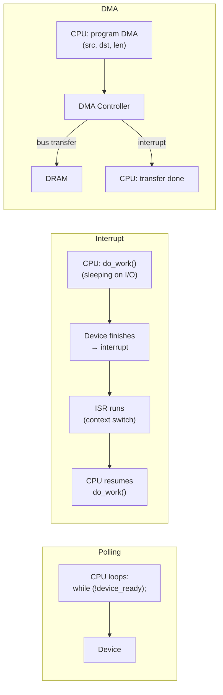
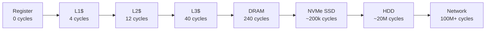

# 8 - IO, Storage, and Buses

[toc]

> **TL;DR:** I/O is the mechanism by which a CPU communicates with devices — network cards, storage controllers, GPUs, USB peripherals, and every other non-DRAM device. Modern I/O is almost universally built on PCIe for high-bandwidth connections, with devices appearing in the CPU's address space (MMIO) or signalling via interrupts. DMA lets devices transfer data directly to DRAM without CPU involvement. Understanding the latency hierarchy from registers down to spinning disk is essential for system performance analysis — and for understanding why ML training on GPUs is always ultimately bound by data movement, not compute.

## Vocabulary

**I/O (Input/Output)**: Data transfer between the CPU/DRAM and external devices. Any device that is not the CPU or main memory is an I/O device.

---

**Bus**: A shared communication channel connecting CPU, memory, and I/O devices. Characterised by width (bits), frequency (Hz), bandwidth (GB/s), and latency (ns).

---

**PCIe (Peripheral Component Interconnect Express)**: The dominant high-speed I/O bus standard. Serial, point-to-point, lane-based. PCIe 5.0: 32 GT/s per lane; 16 lanes (x16) = ~64 GB/s bidirectional. PCIe 6.0: 64 GT/s per lane.

---

**MMIO (Memory-Mapped I/O)**: Device registers are mapped to the CPU's physical address space. The CPU accesses devices via ordinary load/store instructions to these addresses; the memory controller routes the transaction to the device instead of DRAM.

---

**Polling**: The CPU repeatedly reads a device status register in a loop until a condition is met. Simple, zero interrupt-handling overhead, but wastes CPU cycles while waiting.

---

**Interrupt**: A hardware signal from a device to the CPU indicating that the device needs service. The CPU suspends the current task, saves state, runs an Interrupt Service Routine (ISR), and resumes. Efficient for infrequent events; ISR overhead dominates at high interrupt rates.

---

**MSI / MSI-X (Message Signalled Interrupts)**: A PCIe mechanism where a device writes a specific value to a specific DRAM address to signal an interrupt, rather than asserting a physical pin. Avoids the legacy IRQ pin-sharing problem; supports up to 2048 interrupts per device (MSI-X).

---

**DMA (Direct Memory Access)**: A mechanism allowing an I/O device (or a dedicated DMA controller) to transfer data directly between device and DRAM without CPU involvement for each byte. The CPU sets up the transfer (start address, length, direction), and the device DMAs autonomously, interrupting when done.

---

**IOMMU (Input-Output Memory Management Unit)**: Analogous to the CPU's MMU but for DMA transfers. Translates bus addresses used by devices to physical DRAM addresses, enforces access permissions, and prevents rogue devices from accessing arbitrary DRAM. Intel VT-d, AMD-Vi, ARM SMMU.

---

**SATA (Serial ATA)**: A storage interface standard for HDDs and SSDs. SATA III: 6 Gbps theoretical, ~550 MB/s practical. Superseded by NVMe for high-performance SSDs.

---

**NVMe (Non-Volatile Memory Express)**: A storage protocol over PCIe designed for flash/SSD. Latency ~100 µs; bandwidth up to 12+ GB/s (PCIe 5.0 × 4 = ~14 GB/s). Supports up to 65535 command queues of 65536 commands each — vs SATA's 1 queue of 32 commands.

---

**HBA (Host Bus Adapter)**: A controller card that connects storage devices (drives, SAN) to the PCIe bus. NVMe SSDs may be directly PCIe-attached without a HBA.

---

**Cache line writeback**: DMA reads must ensure the CPU's caches are either flushed or bypassed so the device receives coherent data. Without cache management, a device reading from DRAM may see stale data that is still in the CPU's dirty cache.

---

## Intuition

Think of I/O as the CPU's ability to talk to the outside world. Every device — your keyboard, your GPU, your NVMe drive — is a box on the PCIe bus. When you press a key, the keyboard controller sends an interrupt. When you call `read()` on a file, the kernel programs a DMA transfer: it tells the NVMe controller "copy bytes 0–4095 from LBA 12345 into physical address 0xDEAD0000," and the drive does the work while the CPU continues — or sleeps.

The most important insight in this note is the **latency hierarchy**. Getting data from a register takes 0 cycles. Getting it from DRAM takes ~300 cycles. Getting it from an NVMe SSD takes ~300,000 cycles (100 µs at 3 GHz). Getting it from a spinning HDD takes ~30,000,000 cycles (10 ms). These are not rounding-error differences — they are orders of magnitude. Every caching, prefetching, and buffering mechanism in a storage stack exists to hide or avoid these latencies.

## The I/O Interface Methods

### Polling vs Interrupts vs DMA

Three fundamental I/O methods, each appropriate for different device speeds and workloads.

**Polling** is the simplest: the CPU loops on a device status bit until it indicates readiness. It wastes CPU cycles but achieves minimum latency (no interrupt-handling overhead). Appropriate when: (a) the expected wait is very short (< 1 µs), (b) the CPU has nothing else to do, or (c) OS scheduling jitter would make interrupt response unpredictable. High-frequency trading systems and real-time controllers often poll. Modern DPDK (Data Plane Development Kit) for networking uses polling to avoid interrupt overhead at >10 Gbps.

**Interrupt-driven I/O** lets the CPU do other work while the device is busy. When the device completes its operation, it asserts an interrupt. The CPU finishes its current instruction, saves context, and jumps to the ISR. After the ISR returns, the CPU resumes its original task. Appropriate for moderate-rate devices (keyboard, mouse, HDD) where interrupt-handling overhead (~500 ns–1 µs) is negligible compared to device latency.

**DMA** is essential for high-bandwidth devices. Without DMA, the CPU must copy data between device and DRAM one word at a time (programmed I/O), consuming all CPU bandwidth for the transfer. With DMA, the CPU programs the DMA controller with: source address, destination address, length, and command (read or write). The DMA engine performs the transfer over the bus while the CPU executes other code. An interrupt fires when complete.



**Figure:** Three I/O methods. DMA decouples CPU compute from data movement — critical for I/O-bound workloads.

## PCIe Architecture

PCIe is the universal high-bandwidth I/O fabric in modern computers. It is not a shared bus but a switched point-to-point network of serial lanes.

**PCIe hierarchy:**
```
┌─────────────────────────────────────────────────────┐
│ CPU Package                                         │
│  ┌──────────────────────────────────────────────┐   │
│  │ Root Complex                                 │   │
│  │  (CPU-to-PCIe bridge; lives on die)          │   │
│  └─────────┬───────────────┬────────────────────┘   │
│            │ PCIe x16      │ PCIe x4                │
└────────────┼───────────────┼────────────────────────┘
             │               │
         ┌───┴───┐       ┌───┴────┐
         │  GPU  │       │NVMe SSD│
         │(x16)  │       │ (x4)   │
         └───────┘       └────────┘
```

**PCIe bandwidth by generation (per lane, bidirectional):**

| Generation | Transfer Rate | 1-lane (GB/s) | x16 (GB/s) |
| :---: | :---: | :---: | :---: |
| PCIe 3.0 | 8 GT/s | ~1 | ~16 |
| PCIe 4.0 | 16 GT/s | ~2 | ~32 |
| PCIe 5.0 | 32 GT/s | ~4 | ~64 |
| PCIe 6.0 | 64 GT/s | ~8 | ~128 |

NVIDIA H100 SXM uses NVLink 4.0 for GPU-to-GPU communication (900 GB/s bidirectional), vastly exceeding PCIe 5.0 x16 (64 GB/s). PCIe is for host-to-GPU; NVLink is for GPU-to-GPU.

## The Latency Hierarchy

Every systems engineer should have these numbers memorised. They represent the cost of each level of the storage hierarchy.

| Location | Typical Latency | Cycles at 3 GHz |
| :--- | :---: | :---: |
| CPU register | 0.3 ns | ~1 |
| L1 cache | 1 ns | ~4 |
| L2 cache | 4 ns | ~12 |
| L3 cache | 12 ns | ~40 |
| DRAM (DDR5) | 80 ns | ~240 |
| NVMe SSD (PCIe 5.0) | 50–100 µs | ~150,000–300,000 |
| SATA SSD | 100–500 µs | ~300,000–1,500,000 |
| 7200 RPM HDD | 5–10 ms | ~15,000,000–30,000,000 |
| Network (LAN) | 100–500 µs | ~300,000 |
| Network (WAN, cross-coast) | 30–100 ms | ~90,000,000–300,000,000 |



**Figure:** Latency hierarchy. Each step right is approximately 10–100× slower. Programming correctly means keeping hot data as far left as possible.

## Real-world Example

The following Go code benchmarks polling vs interrupt-based (channel-based) I/O and demonstrates DMA-style concurrent data movement using goroutines and `io.Copy`.

```go
package main

import (
	"fmt"
	"io"
	"os"
	"sync"
	"time"
)

// Simulate polling: busy-wait on a channel (no sleep, pure CPU spinning)
func pollUntilReady(ready chan struct{}) {
	for {
		select {
		case <-ready:
			return
		default:
			// busy-wait — like reading a device status register in a loop
		}
	}
}

// Simulate interrupt-driven I/O: sleep until notified
func waitForInterrupt(ready chan struct{}) {
	<-ready  // blocks (yields CPU) until ready is sent
}

// Simulate DMA: concurrent copy from "device" (src file) to "memory" (dst file)
// CPU sets up the transfer and continues doing other work
func dmaStyleCopy(src, dst string, cpuWork func()) error {
	var wg sync.WaitGroup
	var copyErr error

	wg.Add(1)
	go func() {
		defer wg.Done()
		// This goroutine is the "DMA engine": copies without CPU involvement
		in, err := os.Open(src)
		if err != nil {
			copyErr = err
			return
		}
		defer in.Close()
		out, err := os.Create(dst)
		if err != nil {
			copyErr = err
			return
		}
		defer out.Close()
		_, copyErr = io.Copy(out, in)  // kernel-managed copy: sendfile or similar
	}()

	// CPU continues with "other work" while the DMA engine runs
	cpuWork()

	wg.Wait()  // Wait for DMA to finish (like checking interrupt)
	return copyErr
}

func main() {
	// ── Polling vs interrupt demo ───────────────────────────────────────────
	ready := make(chan struct{})

	// Simulate a device that takes 100µs to respond
	go func() {
		time.Sleep(100 * time.Microsecond)
		close(ready)
	}()

	t0 := time.Now()
	// In production: use interrupt-driven for long waits (yields CPU),
	// poll only when latency < 1µs and spinning is acceptable
	waitForInterrupt(ready)
	fmt.Printf("Interrupt-driven wait: %v\n", time.Since(t0))

	// ── DMA-style concurrent copy ───────────────────────────────────────────
	// Create a 10 MB source file
	f, _ := os.CreateTemp("", "dma-src-*")
	src := f.Name()
	buf := make([]byte, 10<<20)
	for i := range buf { buf[i] = byte(i) }
	f.Write(buf)
	f.Close()
	defer os.Remove(src)

	dst := src + ".copy"
	defer os.Remove(dst)

	cpuCycles := 0
	t0 = time.Now()
	err := dmaStyleCopy(src, dst, func() {
		// CPU does useful work while "DMA" transfers
		for i := 0; i < 1000000; i++ {
			cpuCycles++
		}
		fmt.Printf("CPU completed %d compute iterations while copy was in progress\n", cpuCycles)
	})
	elapsed := time.Since(t0)
	if err != nil {
		fmt.Printf("Copy error: %v\n", err)
	} else {
		fmt.Printf("DMA-style copy: 10 MB in %v\n", elapsed)
	}

	// ── Latency hierarchy demo: measure syscall round-trip ────────────────
	r, w, _ := os.Pipe()
	defer r.Close()
	defer w.Close()

	// Measure pipe write+read latency (kernel-mediated, ~1µs)
	const ITERS = 10000
	oneByte := []byte{0x42}
	recv := make([]byte, 1)

	t0 = time.Now()
	for i := 0; i < ITERS; i++ {
		w.Write(oneByte)
		r.Read(recv)
	}
	avgLatency := time.Since(t0) / ITERS
	fmt.Printf("Pipe round-trip latency: ~%v per iteration\n", avgLatency)
}
```

> [!TIP]
> In production storage code (database engines, ML data loaders), the pattern of "program a transfer and go do other work" is implemented via Linux's `io_uring` (since kernel 5.1) or `libaio`. `io_uring` provides a ring-buffer interface where the kernel processes I/O submissions asynchronously — the application submits requests, optionally polls the completion ring, and the kernel DMAs data without syscall overhead per I/O. At NVMe speeds (12+ GB/s), the syscall overhead of traditional blocking `read()` becomes the bottleneck; `io_uring` removes it.

## In Practice

### GPU-CPU Data Movement

In ML training, the GPU and CPU communicate via PCIe (for discrete GPUs) or unified memory bus (Apple Silicon). The key bottleneck is PCIe bandwidth. An NVIDIA H100 SXM connected to the host via NVLink has 900 GB/s GPU memory bandwidth but only ~64 GB/s CPU-to-GPU PCIe bandwidth. This asymmetry means:

- Model parameters stay on GPU (loaded once, high reuse).
- Training batches are loaded from storage → DRAM → GPU at PCIe speed. At 64 GB/s, a 1 GB batch takes ~16 ms — which may exceed the time to compute the forward pass on large models.
- Gradient synchronisation between GPUs (in data-parallel training) at 64 GB/s PCIe is a bottleneck; this is why NVLink, InfiniBand, and all-reduce libraries like NCCL use the highest-bandwidth interconnect available.

> [!IMPORTANT]
> The NVMe → DRAM → GPU → Tensor Core pipeline is the reason ML training is bound by data movement, not compute, for large datasets. Each stage has limited bandwidth: NVMe ~7 GB/s, PCIe 4.0 x16 ~32 GB/s, HBM3 ~3 TB/s (for on-chip memory). The 3 TB/s vs 7 GB/s ratio means the GPU can process data 400× faster than the storage system can supply it. This is why all serious ML training uses an in-memory dataset or asynchronous prefetching with multiple workers.

### I/O Scheduling in Linux

Linux uses I/O schedulers to reorder and merge storage requests for performance: `none` (pass-through, used with NVMe's own native queuing), `mq-deadline` (deadline-based fairness), and `bfq` (budget fair queue, prevents starvation). For NVMe drives, the `none` scheduler is typically optimal because NVMe has its own hardware command queuing (up to 65535 queues × 65536 depth). For SATA SSDs and HDDs, `mq-deadline` provides a good default.

### IOMMU and GPU Security

Without an IOMMU, a PCIe device can DMA to arbitrary physical DRAM addresses — a compromised or buggy GPU driver could corrupt kernel memory or read other processes' data. The IOMMU translates device DMA addresses through a per-device page table, restricting each device to only the memory it was granted. VFIO (Virtual Function I/O) in Linux uses the IOMMU to safely pass PCIe devices through to VMs — critical for GPU virtualisation in cloud ML infrastructure.

## Pitfalls

- **"SSDs are almost as fast as DRAM."** — NVMe SSDs have ~100 µs latency; DRAM has ~80 ns latency. That is 1250× slower. For random 4 KB reads (IOPS-bound), a high-end NVMe SSD achieves ~1 million IOPS = 1 µs per I/O; DRAM can serve the same access in 80 ns — still 12.5× faster. SSDs are good for sequential bandwidth; they are not DRAM substitutes.
- **"DMA is automatic."** — DMA must be explicitly programmed by device drivers. The driver writes the transfer parameters to device registers (via MMIO), then waits for the interrupt. The application using the device (via a syscall like `read()`) is completely unaware — but the kernel driver is doing real work to set up and handle each DMA.
- **"Interrupt handling is always better than polling."** — Polling can achieve lower latency than interrupt-driven I/O for high-rate events. An interrupt incurs: device assertion latency (~1 µs), interrupt controller routing, CPU context save (~100 ns), ISR execution, context restore. For an NVMe drive at 1M IOPS, interrupting 1M/s means 1 µs between interrupts — the overhead is 100% of the device bandwidth. This is why NVMe drivers use interrupt coalescing (group N completions into one interrupt) or polling completion queues directly.
- **"PCIe bandwidth is symmetric."** — PCIe is full-duplex (simultaneous read and write), but the total bandwidth is shared between upstream and downstream. A DMA read by the device (uploading from DRAM to device) and a DMA write (downloading from device to DRAM) simultaneously each get roughly half the rated bandwidth in the worst case, not the full rated bandwidth each.

## Exercises

### Exercise 1: Latency hierarchy calculation

A data loader reads 256 MB of training data per batch. Calculate the read time for:
(a) Reading from a 7200 RPM HDD (sequential, 150 MB/s)
(b) Reading from a SATA SSD (sequential, 500 MB/s)
(c) Reading from an NVMe PCIe 4.0 SSD (sequential, 7 GB/s)
(d) Reading from DRAM (12 GB/s bandwidth)

Which is the bottleneck in a training loop where the GPU processes the batch in 50 ms?

#### Solution

**(a) HDD:** 256 MB / 150 MB/s = **1.71 seconds**
**(b) SATA SSD:** 256 MB / 500 MB/s = **0.51 seconds**
**(c) NVMe SSD:** 256 MB / 7000 MB/s = **0.037 seconds = 37 ms**
**(d) DRAM:** 256 MB / 12,000 MB/s = **0.021 seconds = 21 ms**

GPU compute time: 50 ms.

**Bottleneck analysis:**
- HDD: data I/O (1710 ms) >> compute (50 ms) → heavily I/O bound. GPU sits idle 97% of the time.
- SATA SSD: still I/O bound (510 ms >> 50 ms).
- NVMe SSD: data I/O (37 ms) < compute (50 ms) → **no longer I/O bound** — the NVMe can supply the next batch while the GPU is computing the current one, if prefetching is used.
- DRAM: data I/O (21 ms) << compute (50 ms) → compute bound.

**Practical conclusion:** An NVMe SSD with 2 prefetch workers (double-buffering) can keep up with a 50 ms GPU compute time. HDD or SATA SSD requires either a larger RAM buffer (prefetch many batches), dataset compression, or just accepts that the GPU will be I/O-bound.

---

### Exercise 2: DMA transfer setup

Describe the steps a NVMe driver takes to read a 4 KB page from an SSD into DRAM at physical address 0x1000_0000. What hardware registers are involved? What does the CPU do while the transfer is in progress?

#### Solution

1. **Allocate DMA-able buffer:** The kernel allocates a 4 KB physically-contiguous buffer at physical address 0x1000_0000 using `dma_alloc_coherent()` (Linux). The IOMMU is programmed to allow the NVMe device to write to this address range.

2. **Build the NVMe submission queue entry (SQE):** The driver prepares a 64-byte NVMe Read command:
   - Opcode: 0x02 (Read)
   - Namespace ID: 1 (the first namespace = first "drive")
   - Starting Logical Block Address (SLBA): the LBA corresponding to the page
   - Number of Logical Blocks: 1 (assuming 4 KB LBA size)
   - Data Pointer: physical address 0x1000_0000 (where to DMA the data)

3. **Submit to hardware queue:** The driver writes the SQE to the NVMe submission queue (a ring buffer in DRAM). It then rings the doorbell: a 32-bit write to the NVMe controller's doorbell MMIO register (`NVME_REG_SQ0TDBL` at a PCIe BAR offset) with the new tail pointer. This write goes over PCIe to the NVMe controller.

4. **Controller processes the command:** The NVMe controller's internal processor reads the SQE from DRAM (via DMA), looks up the LBA mapping in its flash translation layer, reads the flash page, and DMAs the 4 KB of data from flash into DRAM at 0x1000_0000. Total time: ~50–100 µs.

5. **Completion notification:** The controller writes a 16-byte Completion Queue Entry (CQE) to the NVMe completion queue in DRAM (via DMA), then issues an MSI-X interrupt to the host.

6. **CPU ISR:** The interrupt arrives at the CPU. The NVMe driver's ISR reads the CQE from the completion queue, confirms success, and signals the waiting thread (e.g. via a completion structure or wakeup).

**What the CPU does during step 4 (the transfer):** Nothing related to this transfer — it is free to schedule other threads, run other processes, or sleep (if no runnable tasks). The transfer is entirely autonomous. This is the value of DMA: 50–100 µs of I/O latency with zero CPU cycles wasted on the transfer itself.

---

### Exercise 3: Interrupt vs polling at high I/O rates

An NVMe SSD completes 1,000,000 I/O operations per second (1M IOPS). Each interrupt takes 1 µs to handle (context save, ISR, context restore). Should this device use interrupt-driven I/O or polling? Justify quantitatively.

#### Solution

**Interrupt-driven at 1M IOPS:**
Interrupts per second: 1,000,000
Time per interrupt handler: 1 µs
Total interrupt overhead: 1,000,000 × 1 µs = **1 second per second = 100% of one CPU core**.

This is catastrophically wasteful — one entire CPU core is consumed just handling NVMe interrupts, before any useful I/O work is done.

**Interrupt coalescing:** The hardware can be configured to coalesce N completions into one interrupt. With N=64:
Interrupts/second: 1M / 64 ≈ 15,625
Overhead: 15,625 × 1 µs = 15.6 ms/second ≈ **1.56% of one CPU core**. Acceptable.

**Polling (NVMe io_uring or DPDK-style):** A dedicated polling thread spins on the completion queue ring buffer. No interrupt overhead at all. The CPU core is 100% busy — but it is doing real I/O processing, not interrupt handling overhead. Suitable for dedicated storage servers where 100% core utilisation on I/O is acceptable.

**Practical choice:** For a general-purpose server: interrupt coalescing with tuned N. For a dedicated storage or networking server: polling with `io_uring` or DPDK for minimum latency and maximum throughput.

---

### Exercise 4: PCIe bandwidth and GPU training

A training job needs to move model gradients from 8 A100 GPUs to the host CPU for aggregation (AllReduce). Each GPU has 80 GB of model gradients (1.6 TB total). The GPUs are connected via PCIe 4.0 x16 (32 GB/s bidirectional per link).

(a) If all 8 GPUs transfer simultaneously, what is the total time to move all gradients to CPU?
(b) If instead using an all-to-all NVLink-based AllReduce with NVLink bandwidth of 600 GB/s per GPU, what is the time?
(c) What does this tell you about the importance of GPU interconnect topology for large-scale training?

#### Solution

**(a) PCIe transfer:**
Each GPU-to-CPU link: 32 GB/s (PCIe 4.0 x16).
Per-GPU gradient size: 1.6 TB / 8 = 200 GB.
Time per GPU: 200 GB / 32 GB/s = 6.25 seconds.
Since all 8 GPUs transfer simultaneously (parallel): total time ≈ **6.25 seconds** (assuming CPU/system memory bandwidth is not the bottleneck — with 8 PCIe links at 32 GB/s, the CPU side needs 256 GB/s, which exceeds most systems).

Actually, if the host has only 64 GB/s of system memory bandwidth, 8 PCIe streams × 32 GB/s each = 256 GB/s inbound, but the DRAM can only absorb 64 GB/s. Real bottleneck: 1.6 TB / 64 GB/s = **25 seconds** — bottlenecked at host memory bandwidth.

**(b) NVLink AllReduce:**
NVLink bandwidth per GPU: 600 GB/s. In an all-reduce (ring AllReduce), the algorithm passes:
- Reduce-Scatter: each GPU sends (N-1)/N × data, effectively each GPU receives all of its share at ~600 GB/s / 8 links ≈ 75 GB/s effective bandwidth.
- AllGather: same bandwidth.

Simplified: effective bandwidth per GPU in ring AllReduce ≈ 600 GB/s × (N-1)/N = 600 × 7/8 ≈ 525 GB/s.
Time: 200 GB (per GPU's share) / 525 GB/s ≈ **0.38 seconds**.

**(c) Conclusion:** NVLink-based AllReduce is 6.25 / 0.38 ≈ **16× faster** than a PCIe-routed approach for this workload. At the scale of real LLM training (GPT-4 scale with thousands of GPUs), gradient synchronisation is a dominant cost, and the interconnect topology (NVLink within a node, InfiniBand between nodes) is as important as compute throughput. This is why NVIDIA invests heavily in NVSwitch fabrics, and why cloud providers build custom high-radix interconnects (AWS Trainium's EFA, Google's TPU 3D torus network).

## Sources

- Patterson, D. A., & Hennessy, J. L. (2020). *Computer Organization and Design RISC-V Edition* (2nd ed.). Chapter 6 (Storage, Networks, and Other Peripheral I/O).
- Hennessy, J. L., & Patterson, D. A. (2019). *Computer Architecture: A Quantitative Approach* (6th ed.). Chapter 1.5 (Trends in Power, Energy, and Technology), Appendix D (Storage Systems).
- Bryant, R. E., & O'Hallaron, D. R. (2016). *Computer Systems: A Programmer's Perspective* (3rd ed.). Chapter 6.1 (Disk Storage).
- PCI Express Base Specification Revision 6.0. PCI-SIG. https://pcisig.com/specifications
- NVM Express Specification Revision 2.0. NVMe Workgroup. https://nvmexpress.org/developers/
- Axboe, J. (2019). "Efficient IO with io_uring." https://kernel.dk/io_uring.pdf
- Jeff Atwood. "The Latency Numbers Every Programmer Should Know." https://norvig.com/21-days.html#answers (original credit: Jeff Dean / Peter Norvig)

## Related

- [6 - Memory Hierarchy and Caches](./6-memory-hierarchy-and-caches.md)
- [7 - Virtual Memory and TLBs](./7-virtual-memory-and-tlbs.md)
- [9 - Multicore, SMP, and Cache Coherence](./9-multicore-smp-and-cache-coherence.md)
- [10 - GPUs and Accelerators](./10-gpus-and-accelerators.md)
