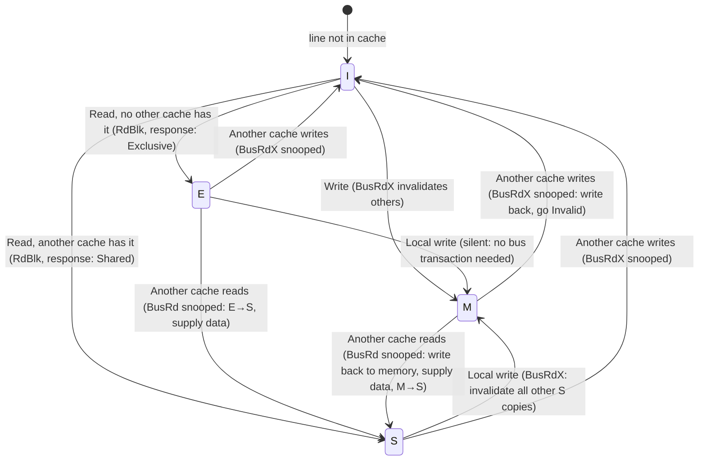

# 9 - Multicore, SMP, and Cache Coherence

[toc]

> **TL;DR:** Multicore CPUs solve the single-core frequency wall by placing multiple execution cores on one die, sharing last-level cache and DRAM. The price is cache coherence: when multiple cores cache the same memory address, writes by one core must be visible to others without reading stale data. The MESI protocol (Modified-Exclusive-Shared-Invalid) enforces this invariant via state machine transitions on the cache interconnect. Memory ordering — what reorderings the hardware is allowed to perform on loads/stores — determines how much synchronisation programmers must add. TSO (x86-64) is strong; ARM/RISC-V weak models require explicit barriers for lock-free code. False sharing, where two cores repeatedly invalidate each other's cache lines by writing to different variables on the same line, is a notorious performance killer.

## Vocabulary

**SMP (Symmetric Multi-Processing)**: A multiprocessor architecture where all CPUs have equal access to a single shared main memory and communicate via a shared bus or interconnect. All modern multicore desktop and server CPUs are SMP.

---

**Cache coherence**: The property that all cores see a consistent view of memory — if core A writes to address X and core B subsequently reads X, B sees A's value (after the write is globally visible).

---

**MESI protocol**: The dominant cache coherence protocol for snooping-based caches. Four states per cache line: Modified, Exclusive, Shared, Invalid.

---

**Modified (M)**: The cache line is present in this core's cache, has been written (dirty), and is not present in any other core's cache. This core owns the line and must write it back before any other core accesses it.

---

**Exclusive (E)**: The line is present in this cache only, is clean (matches memory), and no other cache has it. The core can transition to Modified on a write without bus traffic.

---

**Shared (S)**: The line is present in this cache and may be present in other caches too. The data is clean. Multiple caches can hold Shared copies simultaneously for read-only access.

---

**Invalid (I)**: The cache line does not hold valid data (either never loaded, or invalidated by another core's write).

---

**Snooping**: A coherence implementation where each cache controller monitors ("snoop") the bus or interconnect to observe other caches' transactions and update their own state accordingly.

---

**Directory-based coherence**: A coherence implementation using a directory that tracks which caches hold each memory line. Scales better than snooping for large systems (many-core, NUMA) because it avoids broadcasting invalidation to all nodes.

---

**False sharing**: Two or more cores write to different variables that happen to reside in the same cache line. Each core's write invalidates the other's copy, causing constant coherence traffic and performance degradation, even though the cores are logically accessing independent data.

---

**Memory ordering model (memory consistency model)**: The specification of which load/store reorderings a CPU is allowed to perform relative to program order. Determines how much synchronisation (fences/barriers) is needed for lock-free code.

---

**TSO (Total Store Order)**: The x86-64 memory model. Stores may be delayed in a store buffer before becoming globally visible; but stores from the same core become visible to other cores in program order (stores are not reordered relative to each other). Loads are not reordered past loads. Relatively strong; less need for explicit fences.

---

**Sequential Consistency (SC)**: The strongest useful memory model. All operations appear to execute in a single total order consistent with each thread's program order. Simpler to reason about; expensive to implement in hardware.

---

**Relaxed / Weak consistency**: ARM and RISC-V's default model. Loads and stores may be reordered extensively. Requires explicit barriers (`DMB`/`DSB` on ARM, `FENCE` on RISC-V) to enforce ordering between cores.

---

**Memory barrier / fence**: An instruction that prevents the hardware from reordering memory operations across the barrier. `MFENCE` (x86-64), `DMB ISH` (AArch64), `FENCE` (RISC-V).

---

**Atomic operation**: A read-modify-write that appears indivisible to all other cores. Examples: `LOCK XADD` (x86-64), `LDADD` (AArch64), `AMOADD.W` (RISC-V).

---

**Load-linked / Store-conditional (LL/SC)**: An alternative to CAS for implementing atomics on RISC ISAs. `LR` (load reserved) reads and marks the address; `SC` (store conditional) writes only if no other core wrote between LR and SC — otherwise SC fails and the caller retries.

---

**NUMA (Non-Uniform Memory Access)**: A memory architecture where DRAM is divided among nodes (each associated with a CPU socket), and accessing remote-node memory costs more than local-node memory.

---

## Intuition

Imagine a shared whiteboard in an office. Each person (core) has a personal notepad (L1 cache) where they copy down whiteboard sections to work on locally. The problem: if Alice copies "x = 5" and Bob later writes "x = 7" on the whiteboard but Alice still has "x = 5" on her notepad, they disagree about x's value. Cache coherence is the protocol that keeps all the notepads consistent with the whiteboard and with each other.

The MESI protocol is the set of rules for who gets to write (only the person holding the "Modified" notepad page), who can read (anyone with a "Shared" copy), and when pages are torn out and discarded (Invalidated) when someone else takes ownership to write.

False sharing is the pathological case where Alice and Bob are writing to adjacent lines on their notepads, but the notepad pages are fixed-size (cache lines) — so every time Alice writes her value, she tears out the page (invalidating Bob's copy), and vice versa, even though they are writing to different variables. The fix is to pad variables to be on separate cache lines.

## MESI Protocol

MESI is a write-invalidate protocol: when a cache writes to a line, all other caches' copies are invalidated (set to I), not updated. This is optimal because write traffic is unidirectional (only the writer needs the new value immediately), while broadcasts to all caches are expensive.

### MESI State Transitions



**Figure:** MESI state machine for one cache. Each state represents the current status of a single cache line.

### Scenario Walk-through: Two Cores Share a Variable

Initial state: `x = 0` in memory; both Core 0 and Core 1 have x = Invalid in their L1s.

**Step 1 — Core 0 reads x:**
Core 0 issues `BusRd(x)`. No other cache has x → response: Exclusive. Core 0: `x → E(0)`.

**Step 2 — Core 1 reads x:**
Core 1 issues `BusRd(x)`. Core 0 snoops: its E line is now shared → Core 0: `E → S`. Response to Core 1: Shared. Core 1: `x → S(0)`. Both cores: S(0).

**Step 3 — Core 0 writes x = 1:**
Core 0 issues `BusRdX(x)` (request for exclusive ownership + invalidate others). Core 1 snoops: `S → I`. Core 0 transitions: `S → M(1)` (write new value, no memory write yet — dirty).

**Step 4 — Core 1 reads x:**
Core 1 issues `BusRd(x)` — misses (it's Invalid). Core 0 snoops: must supply data (M → S transition). Core 0 writes back x=1 to memory, goes `M → S`. Core 1 gets x=1, `I → S`. Both cores: S(1).

This walk-through shows why writes are expensive in a shared memory system: every write requires a bus transaction to invalidate other cores' copies.

> [!IMPORTANT]
> In MESI, a write to a Shared line requires a bus invalidation message before the write can proceed. This means **write latency to a shared variable is not just ALU cost + store buffer latency — it includes a round-trip on the cache interconnect** to acquire exclusive ownership. On a modern NUMA server, this can take 50–200 ns. Lock-free data structures that write to frequently-shared variables pay this cost on every write.

## False Sharing

False sharing occurs when two cores write to different variables that are in the same 64-byte cache line. Each write forces the other core's copy to be invalidated, even though the variables are logically independent.

**Classic example:**

```c
struct counter {
    long count0;  /* used exclusively by thread 0 */
    long count1;  /* used exclusively by thread 1 */
} g;
// g.count0 and g.count1 are 8 bytes each, 16 bytes total — same 64-byte cache line!
```

Thread 0 writes `g.count0` → invalidates thread 1's cache line.
Thread 1 writes `g.count1` → invalidates thread 0's cache line.
Result: both threads repeatedly bounce the cache line between their L1s. Measured throughput: 5–20× slower than independent (no-sharing) accesses.

**Fix — padding to separate cache lines:**

```c
#define CACHE_LINE 64
struct counter {
    long count0;
    char _pad0[CACHE_LINE - sizeof(long)];  /* 56 bytes padding */
    long count1;
    char _pad1[CACHE_LINE - sizeof(long)];
};
```

Now `count0` and `count1` are on separate 64-byte lines. Thread 0 and thread 1 can write simultaneously without any coherence traffic between them.

Alternatively, use C11 `_Alignas(64)` or C++11 `alignas(64)`:

```c
struct __attribute__((aligned(64))) counter {
    long count;
};
```

## Memory Ordering

Memory ordering defines what reorderings the hardware is allowed to perform between loads and stores. Different ISAs provide different guarantees.

### Total Store Order (x86-64)

x86-64 guarantees:
1. **Stores are not reordered with other stores.** (Within one core, stores appear in program order to all cores.)
2. **Loads are not reordered with other loads.**
3. **Stores may be buffered in a store buffer** — a store to address A may not be immediately visible to other cores, but it becomes visible before any subsequent stores from the same core.
4. **Loads may be reordered before prior stores** (the only real relaxation vs sequential consistency).

Consequence: a simple `store` + `load` pair on x86-64 may be reordered (the load from a different address may happen before the store). The `MFENCE` instruction prevents this.

For almost all lock-based synchronisation, x86-64's TSO model is strong enough without explicit fences — the LOCK prefix (used by atomics like `LOCK XADD`) is both a data fence and an ordering fence.

### Weak Ordering (AArch64, RISC-V)

ARM's and RISC-V's default memory models allow extensive reordering. Stores may become visible to other cores in any order. A producer-consumer pattern:

```c
// Producer (no barriers — WRONG on ARM):
data = compute_result();   // store to data
flag = 1;                  // store to flag

// Consumer (no barriers — WRONG on ARM):
while (!flag);             // load flag
use(data);                 // load data — may see data=0!
```

On ARM, the processor may reorder `flag = 1` before `data = compute_result()`, or the consumer may observe `flag=1` while still seeing the old `data=0` value, because stores to different addresses may become visible in any order.

**Fix — explicit barriers:**

```c
// Producer (AArch64 correct):
data = compute_result();
__atomic_thread_fence(__ATOMIC_RELEASE);   // DMB ISH — store release barrier
flag = 1;

// Consumer (AArch64 correct):
while (!__atomic_load_n(&flag, __ATOMIC_ACQUIRE));  // load acquire barrier
use(data);   // guaranteed to see the up-to-date data
```

The acquire-release pair forms a *synchronisation happens-before* edge: any stores before the release are visible to any loads after the acquire that observed the release store.

> [!WARNING]
> Porting lock-free code from x86-64 to ARM or RISC-V is not a mechanical recompile. Code that appears correct on x86-64 (relying on TSO's strong ordering) may be silently wrong on ARM. The C11/C++11 memory model (`std::atomic` with explicit ordering tags) is the portable solution — it generates the necessary barriers on ARM and is a no-op on x86-64 where the hardware already provides the ordering.

## Math: Amdahl's Law for Synchronisation

Let s be the fraction of execution time spent in synchronised (serial) regions. With N cores and perfect parallelism elsewhere:

```math
\text{Speedup}(N) = \frac{1}{s + \frac{1-s}{N}}
```

For s=5% (5% of time in locks/synchronisation):

```math
\text{Speedup}(1000) = \frac{1}{0.05 + \frac{0.95}{1000}} = \frac{1}{0.050 + 0.00095} \approx \frac{1}{0.05095} \approx 19.6\times
```

Even with 1000 cores, only 20× speedup when 5% of execution is serialised. This is why lock contention is catastrophic at scale, and why ML frameworks work hard to eliminate synchronisation in the training hot path.

## Real-world Example

The following C code demonstrates false sharing, the fix with padding, and atomic operations.

```c
#define _GNU_SOURCE
#include <stdio.h>
#include <stdlib.h>
#include <pthread.h>
#include <stdatomic.h>
#include <time.h>
#include <string.h>

#define ITERS 100000000L
#define CACHE_LINE 64

/* ── False sharing demo ─────────────────────────────────────────────────── */
typedef struct {
    long count;  /* two of these fit in one cache line */
} CounterBad;

typedef struct {
    alignas(CACHE_LINE) long count;  /* padded to 64 bytes */
} CounterGood;

static CounterBad bad[2];
static CounterGood good[2];

void *increment_bad(void *arg) {
    int id = *(int*)arg;
    for (long i = 0; i < ITERS; i++)
        bad[id].count++;   /* false sharing: bad[0] and bad[1] share a cache line */
    return NULL;
}

void *increment_good(void *arg) {
    int id = *(int*)arg;
    for (long i = 0; i < ITERS; i++)
        good[id].count++;  /* each on its own cache line */
    return NULL;
}

static double bench(void *(*fn)(void*)) {
    pthread_t t[2];
    int ids[2] = {0, 1};
    struct timespec t0, t1;
    clock_gettime(CLOCK_MONOTONIC, &t0);
    pthread_create(&t[0], NULL, fn, &ids[0]);
    pthread_create(&t[1], NULL, fn, &ids[1]);
    pthread_join(t[0], NULL);
    pthread_join(t[1], NULL);
    clock_gettime(CLOCK_MONOTONIC, &t1);
    return (t1.tv_sec - t0.tv_sec) * 1e9 + (t1.tv_nsec - t0.tv_nsec);
}

/* ── Atomic demo: lock-free counter ─────────────────────────────────────── */
static atomic_long atomic_counter = 0;

void *atomic_increment(void *arg) {
    (void)arg;
    for (long i = 0; i < ITERS; i++)
        atomic_fetch_add_explicit(&atomic_counter, 1, memory_order_relaxed);
    return NULL;
}

int main(void) {
    /* Verify sizeof */
    printf("CounterBad size: %zu (two fit in %d-byte cache line: %s)\n",
           sizeof(CounterBad), CACHE_LINE,
           sizeof(CounterBad) * 2 <= CACHE_LINE ? "YES — false sharing!" : "no");
    printf("CounterGood size: %zu (each on own cache line)\n\n", sizeof(CounterGood));

    double ns_bad  = bench(increment_bad);
    double ns_good = bench(increment_good);

    printf("False sharing:  %.0f ms (sum = %ld)\n",
           ns_bad / 1e6, bad[0].count + bad[1].count);
    printf("Padded:         %.0f ms (sum = %ld)\n",
           ns_good / 1e6, good[0].count + good[1].count);
    printf("Speedup:        %.1fx\n\n", ns_bad / ns_good);

    /* Atomic counter */
    pthread_t t[2];
    struct timespec t0, t1;
    clock_gettime(CLOCK_MONOTONIC, &t0);
    pthread_create(&t[0], NULL, atomic_increment, NULL);
    pthread_create(&t[1], NULL, atomic_increment, NULL);
    pthread_join(t[0], NULL);
    pthread_join(t[1], NULL);
    clock_gettime(CLOCK_MONOTONIC, &t1);
    double ns_atomic = (t1.tv_sec - t0.tv_sec) * 1e9 + (t1.tv_nsec - t0.tv_nsec);

    printf("Atomic counter: %.0f ms (value = %ld, expected = %ld)\n",
           ns_atomic / 1e6, (long)atomic_counter, 2 * ITERS);
    return 0;
}
/* Expected (Ryzen 9 5950X, 16 cores):
   False sharing:  ~1500 ms
   Padded:         ~120 ms  (12.5x speedup)
   Atomic counter: ~800 ms  (correct value, slower than padded due to coherence bus traffic) */
```

Compile: `gcc -O2 -pthread -o coherence coherence.c && ./coherence`

> [!NOTE]
> The atomic counter is slower than the padded non-atomic counter because `atomic_fetch_add` with `memory_order_relaxed` still requires exclusive ownership of the cache line (MESI M state) for each write — causing cache bouncing between the two threads. This is *true sharing* (both threads write the same variable), which inherently requires coherence traffic. The padded counters eliminate false sharing (different variables, different lines) but are not thread-safe without atomics — the final sum may be less than 2×ITERS due to lost updates without the atomic.

## In Practice

### Directory-based Coherence in Multi-socket Servers

On a dual-socket AMD EPYC or Intel Xeon server, each socket has its own L3 cache and local DRAM. Cross-socket cache coherence is handled by a directory protocol over the inter-socket interconnect (Intel UPI, AMD Infinity Fabric). A cross-socket coherence transaction costs 100–300 ns vs 10–40 ns for local L3. Code that writes to a shared variable from both sockets sees this NUMA coherence penalty on every write. Binding threads to sockets (`numactl --cpunodebind=0`) keeps coherence local.

### Lock-Free Data Structures

Lock-free data structures use atomic operations (CAS — compare-and-swap, or LL/SC) instead of mutexes to achieve synchronisation without the risk of priority inversion or deadlock. On x86-64, `LOCK CMPXCHG` is the primitive; on AArch64, `CASB/CASH/CAS` or the LL/SC pair `LDXR/STXR` are used.

The practical performance advantage of lock-free over lock-based depends heavily on contention. Under low contention, a mutex (with no actual blocking) is comparable to a lock-free operation. Under high contention, lock-free avoids the convoy effect (threads queuing behind a held lock) and is significantly faster. Designing correct lock-free data structures requires deep understanding of the memory model — this is why production lock-free code (ring buffers, work queues, hazard pointers) is written by a small number of experts and used as libraries.

### ML Training and Multicore

PyTorch's data loader uses `num_workers > 0` to spawn worker processes (not threads) that prefetch batches in parallel. Workers are separate processes (not threads) to avoid Python's GIL. Each worker runs on its own core(s). Because workers write to shared memory buffers, the pinned memory allocations used for DMA transfers must be carefully sized to avoid false sharing on the host side.

In CPU-based inference (e.g. llama.cpp on an Apple M4), the hot path is matrix-vector products. These are parallelised across all P-cores using per-thread output rows. Each thread writes to a different row of the output matrix — different cache lines, no false sharing. Getting the matrix layout right (row-major, tile size matching cache line size) is the primary performance tuning step.

> [!CAUTION]
> Data races — when two threads access the same memory without synchronisation and at least one writes — are undefined behaviour in C/C++ and cause unpredictable results. They are not "fast unsynchronised access" — they are bugs. The hardware may reorder operations, the compiler may hoist loads out of loops, and the OS may interleave threads at any instruction. Always use `std::atomic`, `_Atomic`, `pthread_mutex`, or explicit memory barriers for shared state.

## Pitfalls

- **"volatile prevents data races."** — `volatile` prevents the compiler from caching a variable in a register; it does not add memory barriers, atomic semantics, or cache coherence. `volatile` is the correct tool for MMIO registers (preventing the compiler from optimising away reads of hardware state) — it is not the correct tool for inter-thread synchronisation. Use `std::atomic` or `_Atomic` for that.
- **"TSO means no fences needed on x86."** — Almost true, but not entirely. x86-64 TSO allows loads to be reordered before prior stores (the store-load reordering). Dekker's algorithm for mutual exclusion requires a store-load fence (`MFENCE`) to be correct on x86-64. Most programmers never hit this case; but lock-free algorithm authors must be aware.
- **"Padding to cache lines wastes memory."** — It wastes 48 bytes per padded counter. For a handful of highly-contended shared counters, this is negligible. For a large array of counters (one per item in a table), per-entry padding would waste large amounts of memory. The right tool for large arrays: thread-local counters accumulated periodically, or atomic counters only for the truly shared ones.
- **"More cores always means faster programs."** — Amdahl's law limits the benefit. A program that is 10% serial gains at most 10× speedup from infinite cores. Beyond a threshold, adding cores can actually slow things down due to increased coherence traffic and NUMA effects.
- **"MESI guarantees sequential consistency."** — MESI provides coherence (agreement on a single value for each address across all caches), not sequential consistency (a total order of all operations). Even with MESI coherence, stores from different cores may become globally visible in different orders to different observing cores (depending on the memory model), unless barriers are used.

## Exercises

### Exercise 1: MESI state trace

Two cores (C0 and C1) perform the following operations on address X, which is initially in DRAM with value 0. Trace the MESI state of X in each cache after each operation.

```
1. C0: read X
2. C1: read X
3. C0: write X = 5
4. C1: read X
5. C1: write X = 10
6. C0: read X
```

#### Solution

Initial: X in memory=0. C0: I. C1: I.

**1. C0: read X:**
- C0 issues BusRd(X). No other cache has X.
- C0: **E** (Exclusive, value=0). C1: I. Memory: 0.

**2. C1: read X:**
- C1 issues BusRd(X). C0 snoops: E → transitions to S.
- C0: **S**(0). C1: **S**(0). Memory: 0.

**3. C0: write X = 5:**
- C0 issues BusRdX(X) (upgrade: S → M, invalidate others).
- C1 snoops BusRdX: S → **I**.
- C0: **M**(5). C1: **I**. Memory: still 0 (dirty in C0).

**4. C1: read X:**
- C1 issues BusRd(X). C0 snoops: M → must write back! C0 supplies X=5, writes back to memory. C0: M → **S**(5). Memory updated to 5.
- C1: **S**(5). C0: **S**(5). Memory: 5.

**5. C1: write X = 10:**
- C1 issues BusRdX(X) (upgrade: S → M).
- C0 snoops: S → **I**.
- C1: **M**(10). C0: **I**. Memory: still 5 (dirty in C1).

**6. C0: read X:**
- C0 issues BusRd(X). C1 snoops: M → write back! C1 supplies X=10, writes to memory. C1: M → **S**(10). Memory: 10.
- C0: **S**(10). C1: **S**(10). Memory: 10.

---

### Exercise 2: False sharing diagnosis

A Go program runs two goroutines that each independently increment their own counter 100M times. They run on 2 CPUs. Goroutine 0 takes 2000 ms; goroutine 1 takes 2000 ms. Running each goroutine alone takes 200 ms each. Diagnose the problem and propose a fix.

#### Solution

**Diagnosis:** Each goroutine takes 10× longer when running concurrently than when running alone. The goroutines access independent variables (different counters), so there should be no logical contention. The 10× slowdown is characteristic of **false sharing** — the two counters are on the same cache line, causing constant coherence invalidation traffic.

In Go, `runtime.GOMAXPROCS(2)` pins goroutines to real OS threads and CPUs. If the counters are adjacent in a struct or array, they occupy the same 64-byte cache line:

```go
// Problematic layout:
var counters [2]int64  // counters[0] and counters[1]: 8+8=16 bytes < 64 bytes → same line!
```

Each goroutine's write to its counter invalidates the other goroutine's cache copy, causing constant MESI M→I→M→I transitions. With 100M iterations and each write requiring a bus invalidation (~10–50 ns), total extra time = 100M × ~20 ns = 2000 ms — matching the observation.

**Fix in Go:**

```go
// Pad each counter to its own cache line
type paddedCounter struct {
    val int64
    _   [56]byte  // padding to 64 bytes
}
var counters [2]paddedCounter
// Or use sync/atomic and ensure alignment
```

With padding, each `paddedCounter` is 64 bytes — a full cache line. The two goroutines' writes never land on the same line. Expected runtime: ~200 ms (matching the sequential baseline).

---

### Exercise 3: Memory ordering bug

The following C code is supposed to implement a correct producer-consumer flag on a weak-memory architecture (ARM). Identify the bug and fix it using C11 atomics.

```c
// Global variables
int data = 0;
int flag = 0;  /* flag=1 means data is ready */

// Thread 1 (producer)
void producer(void) {
    data = compute();   /* write data */
    flag = 1;           /* signal: data is ready */
}

// Thread 2 (consumer)
void consumer(void) {
    while (flag == 0);  /* spin until ready */
    use(data);          /* read data */
}
```

#### Solution

**The bug:** On a weak-memory architecture (ARM, RISC-V), there are two problems:

1. **Reordering in the producer:** The CPU may reorder `flag = 1` before `data = compute()`, so the consumer may observe `flag=1` while `data` still holds its old value. This is a store-store reordering.

2. **Reordering in the consumer:** After the consumer sees `flag==1`, the load of `data` may be speculative — the CPU may have already loaded `data` (out of order) before observing `flag=1`, again reading the old value.

3. **Compiler optimisation:** The compiler may cache `flag` in a register (seeing no writes to it in the while loop), turning it into an infinite loop.

**Correct fix using C11 atomics:**

```c
#include <stdatomic.h>

int data = 0;
atomic_int flag = 0;

void producer(void) {
    data = compute();
    /* Release: all stores before this point are visible to any
       core that performs an acquire-load on flag and sees flag=1 */
    atomic_store_explicit(&flag, 1, memory_order_release);
}

void consumer(void) {
    /* Acquire: all stores before the corresponding release become
       visible after this load returns 1 */
    while (atomic_load_explicit(&flag, 0, memory_order_acquire) == 0);
    /* At this point, data is guaranteed to hold compute()'s result */
    use(data);
}
```

The `memory_order_release` on the store prevents any stores before it from being reordered after it. The `memory_order_acquire` on the load prevents any loads after it from being reordered before it. Together, they form a happens-before synchronisation edge: `data = compute()` happens-before `use(data)`.

On x86-64, both become ordinary loads and stores (TSO provides the ordering). On AArch64, `release` becomes `STLR` (store-release) and `acquire` becomes `LDAR` (load-acquire), which are the ARM acquire-release instructions that enforce the ordering.

---

### Exercise 4: NUMA topology and performance

A dual-socket server has:
- Socket 0: 16 cores, 128 GB DRAM
- Socket 1: 16 cores, 128 GB DRAM
- Local DRAM latency: 80 ns
- Remote DRAM latency: 200 ns

A program runs 32 threads (one per core) and performs 1B random DRAM accesses per thread. Compute total execution time for:
(a) All threads pinned to socket 0, all data in socket 0 DRAM
(b) 16 threads on socket 0 (local data), 16 threads on socket 1 (local data)
(c) All threads on socket 0, data evenly split between socket 0 and socket 1

#### Solution

**(a) All 32 threads on socket 0, all data local:**
Socket 0 has 16 cores; running 32 threads means 2 threads per core.
Each thread: 1B accesses × 80 ns = 80 seconds per thread.
With 2 threads sharing each core: assuming linear slowdown from contention on the memory controller and cache → ~2× slower per thread effective throughput: ~160 seconds.
But 32 threads on 16 cores: execution time ≈ 1B × 80 ns × (32/16) = **160 seconds** per thread.

**(b) 16 threads per socket, each accessing local data:**
16 threads per socket, 1 thread per core (no sharing), local data access.
Each thread: 1B × 80 ns = 80 s.
All threads run in parallel: total wall time ≈ **80 seconds** for all threads. This is the optimal arrangement.

**(c) 32 threads on socket 0, data split 50/50:**
Half the accesses are local (80 ns), half are remote (200 ns).
Average latency per access: (0.5 × 80 + 0.5 × 200) ns = 140 ns.
With 2 threads per core: effective latency × 2 = 280 ns per access.
Total per thread: 1B × 280 ns = 280 seconds.

**Comparison:**
- (a) 160 s — socket bottlenecked, no NUMA penalty
- (b) **80 s** — optimal: 2× faster than (a), 3.5× faster than (c)
- (c) 280 s — worst: NUMA + thread congestion

**Lesson:** NUMA-aware placement (binding processes and their memory to the same socket) is critical for memory-latency-sensitive workloads. Linux's `numactl --cpunodebind=0 --membind=0` enforces socket-local memory allocation.

---

### Exercise 5: Lock-free counter design

Design a high-performance thread-safe counter for a web server counting HTTP requests. The counter is incremented ~1M times/second across 32 threads. It is read by a monitoring thread once per second. Requirements: increments should be as fast as possible; the read value is allowed to be slightly stale (last-second approximation is fine).

#### Solution

**Analysis of options:**

1. **Single atomic counter with `memory_order_seq_cst`:** Correct, but at 1M/s × 32 threads = 32M atomic ops/s, each requiring full cache coherence bus transactions. Measured throughput: ~100–200M seq-cst atomic ops/s per core → feasible but incurs coherence traffic on every increment.

2. **Single atomic counter with `memory_order_relaxed`:** Relaxed atomics on x86-64 compile to the same `LOCK XADD` instruction (TSO makes relaxed as strong as seq-cst for x86). On ARM, relaxed avoids the barrier, saving ~5–10 ns per op. Better, but still requires the cache line to bounce between cores.

3. **Per-thread local counters, periodically aggregated:** Each thread maintains its own `thread_local` counter (no sharing, no coherence traffic). A monitoring thread reads all per-thread counters and sums them once per second.

**Best design — thread-local sharded counter:**

```c
#include <stdatomic.h>
#include <pthread.h>
#define MAX_THREADS 64
#define CACHE_LINE 64

// One padded counter per thread — no false sharing
typedef struct {
    atomic_long count;
    char _pad[CACHE_LINE - sizeof(atomic_long)];
} __attribute__((aligned(CACHE_LINE))) ThreadCounter;

static ThreadCounter thread_counters[MAX_THREADS];

// Increment: thread-local write only. No cross-thread coherence traffic.
void increment(int thread_id) {
    atomic_fetch_add_explicit(&thread_counters[thread_id].count,
                              1, memory_order_relaxed);
}

// Read: sum all per-thread counters. Called infrequently (1/s).
long read_total(int num_threads) {
    long total = 0;
    for (int i = 0; i < num_threads; i++)
        total += atomic_load_explicit(&thread_counters[i].count, memory_order_relaxed);
    return total;
}
```

**Why this is optimal:**
- Increment: each thread writes only its own cache line — no coherence traffic. Each write hits the core's own L1 cache (Modified state, no bus transaction). Cost: ~1 cycle per increment.
- Read: sums 32 cache lines — 32 reads, each an L3 hit at most. ~40 × 32 = 1280 cycles total, negligible for a 1/s read.
- No false sharing: each counter is 64 bytes (one cache line).
- Relaxed ordering: sufficient because increments don't need to be visible in any particular order (the total is eventually consistent, which meets the "slightly stale is fine" requirement).

This pattern — per-thread state with periodic aggregation — is used in the Linux kernel for per-CPU statistics counters (`percpu_counter`), in CPython's reference counting optimisations, and in virtually every high-performance statistics system.

## Sources

- Hennessy, J. L., & Patterson, D. A. (2019). *Computer Architecture: A Quantitative Approach* (6th ed.). Chapter 5 (Multiprocessors and Thread-Level Parallelism), Appendix I.
- Patterson, D. A., & Hennessy, J. L. (2020). *Computer Organization and Design RISC-V Edition* (2nd ed.). Chapter 5.8.
- Preshing, J. "Memory Ordering at Compile Time." https://preshing.com/20120625/memory-ordering-at-compile-time/
- Preshing, J. "An Introduction to Lock-Free Programming." https://preshing.com/20120612/an-introduction-to-lock-free-programming/
- Intel 64 and IA-32 Architectures Software Developer's Manual, Volume 3A. Chapter 8 (Multiple Processor Management). https://www.intel.com/content/www/us/en/developer/articles/technical/intel-sdm.html
- Lamport, L. (1979). "How to Make a Multiprocessor Computer That Correctly Executes Multiprocess Programs." *IEEE Transactions on Computers*, C-28(9), 690–691.

## Related

- [6 - Memory Hierarchy and Caches](./6-memory-hierarchy-and-caches.md)
- [7 - Virtual Memory and TLBs](./7-virtual-memory-and-tlbs.md)
- [5 - Pipelining and Hazards](./5-pipelining-and-hazards.md)
- [10 - GPUs and Accelerators](./10-gpus-and-accelerators.md)
- [12 - Security in Architecture](./12-security-in-architecture.md)
