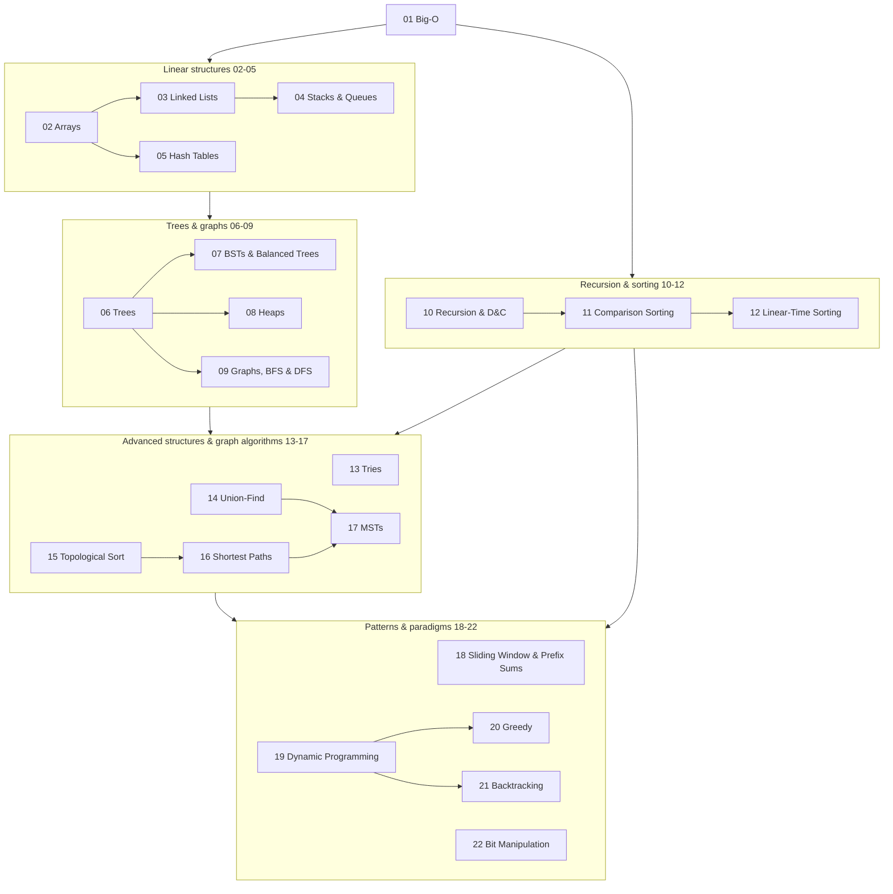

# DSA Curriculum Index

[toc]

> **TL;DR:** This is the map for the 22-note data-structures-and-algorithms curriculum. Start with Big-O, build through linear structures, trees, and graphs, then finish with the algorithmic paradigms (DP, greedy, backtracking). Applied pattern notes and Leetcode walkthroughs bridge the theory to interview practice.

## Topic dependency map

The numbered notes form a dependency graph, not a strict line. Big-O (01) underpins everything; linear structures (02–05) feed trees and graphs (06–09); recursion and sorting (10–12) unlock the advanced structures and graph algorithms (13–17); the patterns and paradigms (18–22) sit on top of all of it.

## Learning path

Work the notes in numeric order unless the dependency map tells you a topic can be pulled forward. Each row gives the headline complexity result the note proves or uses.

| Note | What you learn | Key Big-O |
| :--- | :--- | :--- |
| [Big O Notation](./01-big-o-notation-and-complexity-analysis.md) | Asymptotic analysis, growth classes, amortized cost | O(1) → O(n!) hierarchy |
| [Arrays and Dynamic Arrays](./02-arrays-and-dynamic-arrays.md) | Contiguous memory, resizing, amortized append | O(1) index, amortized O(1) append |
| [Linked Lists](./03-linked-lists.md) | Pointer-based sequences, traversal patterns | O(1) insert at head, O(n) search |
| [Stacks and Queues](./04-stacks-and-queues.md) | LIFO/FIFO discipline, deque implementations | O(1) push/pop/enqueue/dequeue |
| [Hash Tables](./05-hash-tables.md) | Hashing, collisions, load factor | O(1) average lookup |
| [Trees and Binary Trees](./06-trees-and-binary-trees.md) | Tree terminology, traversal orders | O(n) traversal |
| [BSTs and Balanced Trees](./07-binary-search-trees-and-balanced-trees.md) | Ordered maps, AVL/red-black balancing | O(log n) search/insert/delete |
| [Heaps and Priority Queues](./08-heaps-and-priority-queues.md) | Heap property, heapify, priority scheduling | O(log n) push/pop, O(n) build |
| [Graphs, BFS, and DFS](./09-graphs-bfs-and-dfs.md) | Representations, traversal, connectivity | O(V + E) |
| [Recursion and Divide and Conquer](./10-recursion-and-divide-and-conquer.md) | Call stacks, recurrences, master theorem | T(n) = aT(n/b) + f(n) |
| [Comparison Sorting](./11-comparison-sorting-algorithms.md) | Merge, quick, heap sort; lower bound | O(n log n) optimal |
| [Linear-Time Sorting](./12-linear-time-sorting.md) | Counting, radix, bucket sort | O(n + k) |
| [Tries](./13-tries-prefix-trees.md) | Prefix trees, autocomplete, word search | O(L) per word |
| [Union-Find](./14-union-find-disjoint-sets.md) | Disjoint sets, path compression, union by rank | near-O(1) amortized (α(n)) |
| [Topological Sort and DAGs](./15-topological-sort-and-dags.md) | Ordering dependencies, cycle detection | O(V + E) |
| [Shortest Paths](./16-shortest-paths-dijkstra-and-bellman-ford.md) | Dijkstra, Bellman-Ford, negative edges | O((V + E) log V) / O(VE) |
| [Minimum Spanning Trees](./17-minimum-spanning-trees.md) | Kruskal, Prim, cut property | O(E log E) |
| [Sliding Window and Prefix Sums](./18-sliding-window-and-prefix-sums.md) | Window invariants, range-sum precomputation | O(n) |
| [Dynamic Programming](./19-dynamic-programming.md) | Overlapping subproblems, memoization, tabulation | problem-dependent, often O(n²) |
| [Greedy Algorithms](./20-greedy-algorithms.md) | Exchange arguments, when greedy is safe | often O(n log n) |
| [Backtracking](./21-backtracking.md) | State-space search, pruning | exponential, pruned |
| [Bit Manipulation](./22-bit-manipulation.md) | Masks, shifts, XOR tricks | O(1) per operation |
| [Binary Search](./23-binary-search.md) | Exact-match and boundary search over sorted or monotonic spaces | O(log n) |
| [Two Pointers](./24-two-pointers.md) | Opposite-ends and writer/reader scans without nested loops | O(n) |

> [!TIP]
> Study order that works in practice: 01 → 02–05 → 10 → 06–09 → 11–12 → 18 → 13–17 → 19–22. Pulling recursion (10) before trees makes the tree traversals click, and sliding window (18) is the highest-frequency interview pattern, so it pays to learn it early.

## Where the old pattern notes went

The former unnumbered pattern notes were merged into the numbered curriculum:

- Binary search and first-true boundary search now live together in [Binary Search](./23-binary-search.md).
- The two-pointers pattern is now [Two Pointers](./24-two-pointers.md).
- The Two Sum complement-lookup pattern is a section inside [Hash Tables](./05-hash-tables.md).
- Carry-based addition is a worked pattern inside [Linked Lists](./03-linked-lists.md).

## Leetcode walkthroughs and interview math

The Leetcode notes apply the patterns above to specific problems, and the interview-math note covers the arithmetic (logs, powers of two, summations) that complexity analysis assumes.

- [1 - Two Sum](../Leetcode/1-two-sum.md)
- [2 - Add Two Numbers](../Leetcode/2-add-two-numbers.md)
- [Binary Search and Monotonic Function Binary Search](../Leetcode/binary-search-and-monotonic-function-binary-search.md)
- [First True in a Sorted Boolean Array (Binary Search)](../Leetcode/first-true-in-a-sorted-boolean-array-binary-search.md)
- [Square Root Estimation (Binary Search)](../Leetcode/square-root-estimation-binary-search.md)
- [Math for Technical Interviews](../Mathematics/Technical-Interview-Math/math-for-technical-interviews.md)

## Sibling tracks

DSA is one of three interview-prep tracks in this vault. The other two start here:

- [How to Approach System Design](../System-Design/01-how-to-approach-system-design.md)
- [The Relational Model](../Relational-Databases-and-Data-Modeling/01-the-relational-model.md)
