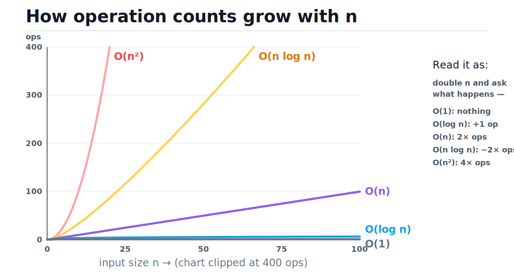
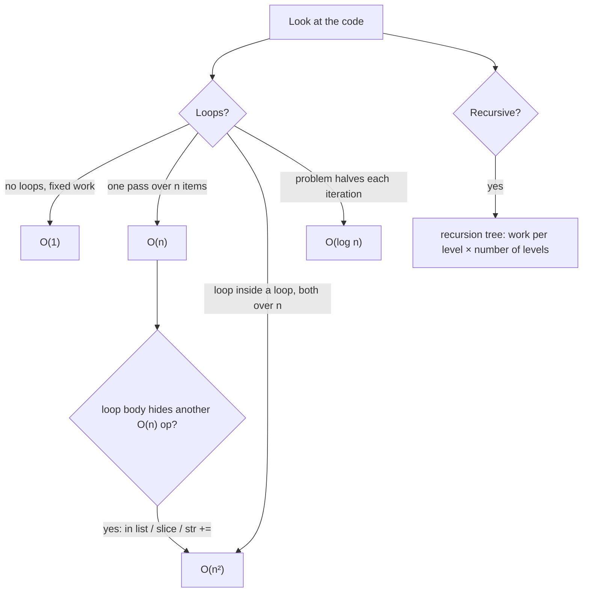
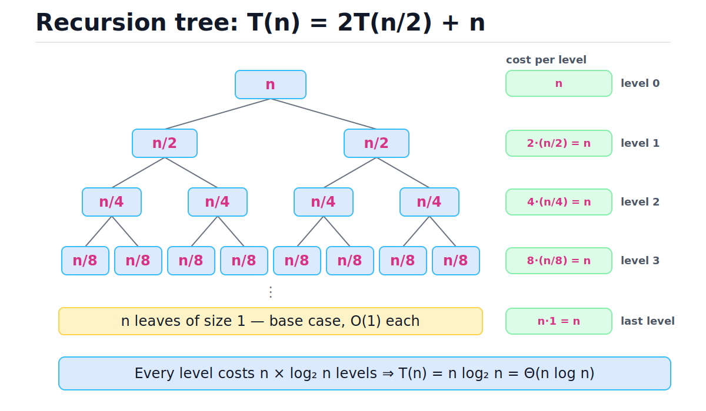
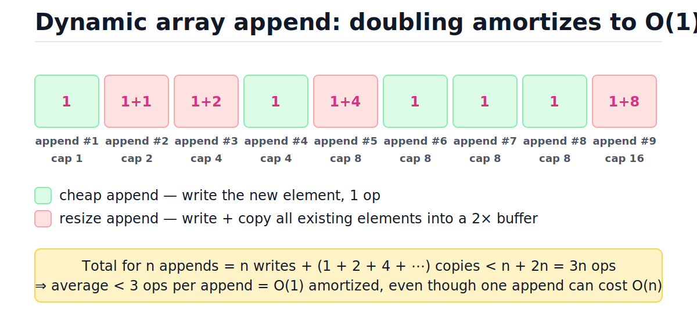

# Big O Notation and Complexity Analysis

[toc]

> **TL;DR:** Big-O describes how an algorithm's cost *grows* as input size grows — it deliberately ignores constants, hardware, and language. Learn to read a handful of growth classes (O(1), O(log n), O(n), O(n log n), O(n²), O(2ⁿ)) directly off code shape, and you can predict whether a solution finishes in microseconds or centuries before running it. This is the keystone note: every other note in this folder states its costs in this language.

## Vocabulary

These six terms carry the whole curriculum. Each gets a formal symbol here and a plain-prose meaning; the rest of the note shows how to actually use them.

**Big-O (asymptotic upper bound)**

```math
f(n) = O(g(n)) \iff \exists\, c > 0,\ n_0 > 0 : \ 0 \le f(n) \le c \cdot g(n) \quad \forall\, n \ge n_0
```

"f grows no faster than g." Past some input size n₀, f(n) stays under a constant multiple of g(n). The constant c is what lets us throw away coefficients: 5n and 500n are both O(n).

**Big-Omega (asymptotic lower bound)**

```math
f(n) = \Omega(g(n)) \iff \exists\, c > 0,\ n_0 > 0 : \ f(n) \ge c \cdot g(n) \quad \forall\, n \ge n_0
```

"f grows at least as fast as g." Used for proving an algorithm (or problem) cannot be beaten — e.g., comparison sorting is Ω(n log n) in the worst case.

**Big-Theta (tight bound)**

```math
f(n) = \Theta(g(n)) \iff f(n) = O(g(n)) \ \text{and} \ f(n) = \Omega(g(n))
```

"f grows exactly like g," up to constants. When engineers say "merge sort is O(n log n)," they usually mean Θ(n log n) — Big-O is technically only the ceiling.

**Worst, average, and best case**

```math
T_{\text{worst}}(n) = \max_{|x| = n} T(x), \qquad T_{\text{avg}}(n) = \mathbb{E}_{|x| = n}[T(x)], \qquad T_{\text{best}}(n) = \min_{|x| = n} T(x)
```

Three different functions, each of which can get its own O/Ω/Θ bound. The *case* picks which inputs you measure over; the *notation* describes the resulting curve. Quicksort: best/average Θ(n log n), worst Θ(n²).

**Amortized cost**

```math
\text{amortized cost} = \frac{1}{m} \sum_{i=1}^{m} c_i
```

The worst-case *total* cost of a sequence of m operations, divided by m. One operation may be expensive as long as it is rare enough that the average stays low — the canonical example is dynamic-array append, derived below.

**Auxiliary space**

```math
S(n) = \text{memory allocated beyond the input itself}
```

Space complexity counts *extra* memory: temporary buffers, hash tables, the recursion call stack. The input doesn't count; an in-place algorithm is O(1) auxiliary even though the input is O(n).

## Intuition

Big-O answers one question: **when the input gets k times bigger, how much more work does the algorithm do?** It is not a stopwatch. An O(n²) algorithm can beat an O(n log n) one at n = 30; at n = 10⁶ it loses by hours. Constants, language, and hardware shift curves up and down — growth class decides which curve *wins eventually*, and "eventually" arrives fast in production.

The chart below makes the classes physical. Look at how O(1) and O(log n) are nearly indistinguishable flat lines on the floor, while O(n²) leaves the chart before n even reaches 20.



> [!IMPORTANT]
> Big-O reasons about *growth*, so it drops constants and lower-order terms: 3n² + 10n + 50 is O(n²), and O(2n) is just O(n). The discarded constants are real — they decide which of two same-class algorithms is faster — but they never change who wins as n → ∞.

## How it works

Complexity analysis is mostly pattern recognition: a small set of code shapes maps to a small set of growth classes. This section walks every shape you will meet, with runnable code and the exact count it produces. The decision flow looks like this:



### The formal definition, made concrete

The c and n₀ in the definition are not decoration — they are the license to simplify. To show 3n² + 10n is O(n²), you exhibit one concrete pair (c, n₀) that makes the inequality hold forever after.

```math
3n^2 + 10n \le 4n^2 \quad \text{whenever } n \ge 10 \qquad (c = 4,\ n_0 = 10)
```

Check it: at n = 10, the left side is 400 and the right side is 400; for larger n the n² term only pulls further ahead. That is the entire proof obligation, and it is why "drop everything but the dominant term" is mathematically safe rather than hand-waving.

### Single loop → O(n)

One pass over the input, constant work per element. The loop body runs exactly n times, so total work is c·n for some constant c — that is the definition of O(n). Doubling the input doubles the time.

```python
def max_value(items: list) -> int:
    best = items[0]          # 1 op
    for x in items:          # body runs n times
        if x > best:         # O(1) per iteration
            best = x
    return best              # total: O(n) time, O(1) extra space

assert max_value([3, 1, 4, 1, 5, 9, 2, 6]) == 9
```

### Nested loops over the same input → O(n²)

A loop inside a loop, both ranging over the input, multiplies the counts. Even when the inner loop starts at i + 1 (the "all pairs" pattern), the total is the triangular number — half of n², and the half disappears into c.

```math
\sum_{i=1}^{n-1} i = \frac{n(n-1)}{2} = O(n^2)
```

```python
def count_pairs(items: list) -> int:
    ops = 0
    n = len(items)
    for i in range(n):
        for j in range(i + 1, n):   # n-1, n-2, ..., 1 iterations
            ops += 1                # one comparison per pair
    return ops

n = 100
assert count_pairs(list(range(n))) == n * (n - 1) // 2   # 4950 ≈ n²/2 → O(n²)
```

> [!CAUTION]
> "Accidentally quadratic" is a production-incident class of bug: code that passed review at n = 100 melts at n = 10⁶. The usual culprits are an O(n) operation hiding inside a loop — `x in some_list`, `list.insert(0, x)`, `s += chunk` on strings — not a visible second `for`.

### Halving loop → O(log n)

Any loop that shrinks the problem by a constant *factor* (not a constant amount) finishes in logarithmic time, because you can only halve n about log₂ n times before hitting 1. This is the engine inside [binary search](./23-binary-search.md) and balanced-tree operations.

```python
def halving_steps(n: int) -> int:
    """Count iterations of a loop that halves n until it reaches 1."""
    steps = 0
    while n > 1:
        n //= 2
        steps += 1
    return steps

assert halving_steps(64) == 6                 # 2^6 = 64
assert halving_steps(1_000_000) == 19         # log2(1e6) ≈ 19.93 → floor = 19
assert halving_steps(2**30) == 30
for n in (1, 2, 3, 63, 64, 65, 10**9):
    assert halving_steps(n) == max(0, n.bit_length() - 1)   # exactly ⌊log₂ n⌋
```

The trace for n = 64 shows why the count is so small — six steps dispose of sixty-four elements:

| Step | n at start of step | n > 1? | Decision |
| :---: | ---: | :---: | :--- |
| 1 | 64 | yes | halve → 32 |
| 2 | 32 | yes | halve → 16 |
| 3 | 16 | yes | halve → 8 |
| 4 | 8 | yes | halve → 4 |
| 5 | 4 | yes | halve → 2 |
| 6 | 2 | yes | halve → 1 |
| — | 1 | no | stop: 6 steps = log₂ 64 |

### Two sequential loops → O(n + m)

Loops that run one *after* another add, they don't multiply. Two passes over the same input are O(2n) = O(n); passes over two different inputs are O(n + m), which you keep as-is unless one input is known to dominate.

```python
def sum_then_max(a: list, b: list) -> tuple:
    total = 0
    for x in a:                  # O(len(a))
        total += x
    biggest = b[0]
    for y in b:                  # O(len(b))
        biggest = max(biggest, y)
    return total, biggest        # O(n + m), NOT O(n * m)

assert sum_then_max([1, 2, 3], [4, 9, 5]) == (6, 9)
```

### Recursion → draw the recursion tree

For recursive code, count work level by level: each tree node is one call, labeled with the *non-recursive* work that call does, and the total cost is the sum over all levels. For the divide-and-conquer recurrence T(n) = 2T(n/2) + n (merge sort's shape — see [recursion and divide and conquer](./10-recursion-and-divide-and-conquer.md)), every level sums to exactly n and there are log₂ n levels.



The code below mirrors the tree exactly: n units of work now, then two recursive calls on halves. The assert pins the closed form — for n = 2ᵏ the total is exactly n·k.

```python
def divide_and_conquer_work(n: int) -> int:
    """Total work of T(n) = 2T(n/2) + n, for n a power of two."""
    if n <= 1:
        return 0                 # base case: O(1), counted as 0 here
    return n + 2 * divide_and_conquer_work(n // 2)

for k in range(1, 15):
    n = 2 ** k
    assert divide_and_conquer_work(n) == n * k    # exactly n · log₂(n)
```

```math
T(n) = \sum_{k=0}^{\log_2 n - 1} 2^k \cdot \frac{n}{2^k} = \sum_{k=0}^{\log_2 n - 1} n = n \log_2 n = \Theta(n \log n)
```

### Amortized analysis: dynamic-array append

`list.append` sometimes costs O(n): when the backing array is full, every element must be copied into a bigger one. Amortized analysis asks for the *total* cost of n appends, then averages. With capacity doubling, resizes happen only at sizes 1, 2, 4, 8, …, so the copy costs form a geometric series that sums to less than 2n.



```math
\text{total cost of } n \text{ appends} \le \underbrace{n}_{\text{writes}} + \underbrace{\sum_{k=0}^{\lceil \log_2 n \rceil} 2^k}_{\text{copies}} < n + 2n = 3n \implies \text{amortized } O(1)
```

The trace makes the rhythm visible — expensive appends get exponentially rarer:

| Step (append #) | size before | capacity before | Resize? | Cost (write + copies) |
| :---: | ---: | ---: | :---: | :--- |
| 1 | 0 | 1 | no | 1 |
| 2 | 1 | 1 | yes → cap 2 | 1 + 1 |
| 3 | 2 | 2 | yes → cap 4 | 1 + 2 |
| 4 | 3 | 4 | no | 1 |
| 5 | 4 | 4 | yes → cap 8 | 1 + 4 |
| 6–8 | 5–7 | 8 | no | 1 each |
| 9 | 8 | 8 | yes → cap 16 | 1 + 8 |

A million-append experiment confirms the bound — the toy class counts every element copy:

```python
class DoublingArray:
    """Toy dynamic array: doubles capacity when full, counts element copies."""

    def __init__(self) -> None:
        self.capacity = 1
        self.size = 0
        self.copies = 0      # elements moved during resizes
        self.writes = 0      # one write per append

    def append(self) -> None:
        if self.size == self.capacity:
            self.copies += self.size     # copy every existing element
            self.capacity *= 2           # O(n) on this one call...
        self.writes += 1
        self.size += 1

arr = DoublingArray()
n = 1_000_000
for _ in range(n):
    arr.append()

assert arr.writes == n
assert arr.copies < 2 * n                # geometric series: 1+2+4+... < 2n
assert arr.writes + arr.copies < 3 * n   # ...but < 3 ops per append on average
```

> [!NOTE]
> Amortized ≠ average case. Average case takes an expectation over *inputs* (or randomness); amortized is a worst-case guarantee over a *sequence* of operations — no input can make n appends cost more than ~3n. See [arrays and dynamic arrays](./02-arrays-and-dynamic-arrays.md) for the full resize story.

### Space complexity: what counts as "extra"

Time gets the attention, but interviewers ask for space every time. Count allocations that scale with n — buffers, hash tables, result lists, and recursion stack frames — and ignore the input itself plus O(1) locals. Recursion depth is space: a depth-n recursion is O(n) space even if it allocates nothing.

```python
def reverse_in_place(items: list) -> None:
    """O(n) time, O(1) auxiliary space: swap pairs inward from both ends."""
    lo, hi = 0, len(items) - 1
    while lo < hi:
        items[lo], items[hi] = items[hi], items[lo]
        lo += 1
        hi -= 1

def reversed_copy(items: list) -> list:
    """O(n) time, O(n) auxiliary space: allocates a whole second list."""
    return items[::-1]

data = [1, 2, 3, 4, 5]
assert reversed_copy(data) == [5, 4, 3, 2, 1]
assert data == [1, 2, 3, 4, 5]        # untouched — the copy cost O(n) memory
reverse_in_place(data)
assert data == [5, 4, 3, 2, 1]        # same object mutated — O(1) extra
```

## Complexity

This is the master reference. First the growth classes themselves with concrete operation counts, then the bound for every pattern shown in this note. The wall-clock column assumes a rough budget of 10⁸ simple operations per second — about right for tight compiled loops; pure Python manages closer to 10⁷, so multiply Python estimates by ~10.

| Class | Name | Example | n = 1,000 | n = 10⁶ | n = 10⁹ | Feel at ~10⁸ ops/s |
| :--- | :--- | :--- | ---: | ---: | ---: | :--- |
| O(1) | constant | dict lookup | 1 | 1 | 1 | instant, always |
| O(log n) | logarithmic | binary search | ~10 | ~20 | ~30 | instant, always |
| O(n) | linear | scan a list | 10³ | 10⁶ | 10⁹ | instant · 10 ms · 10 s |
| O(n log n) | linearithmic | merge sort, Timsort | ~10⁴ | ~2×10⁷ | ~3×10¹⁰ | instant · 0.2 s · 5 min |
| O(n²) | quadratic | all pairs, bubble sort | 10⁶ | 10¹² | 10¹⁸ | 10 ms · ~3 h · ~300 yr |
| O(2ⁿ) | exponential | brute-force subsets | ~10³⁰¹ | — | — | dead past n ≈ 40 |
| O(n!) | factorial | brute-force permutations | ~10²⁵⁶⁷ | — | — | dead past n ≈ 12 |

Every pattern from this note, with all three cases and auxiliary space:

| Pattern | Best | Average | Worst | Aux space |
| :--- | :--- | :--- | :--- | :--- |
| Single loop (`max_value`) | Θ(n) | Θ(n) | Θ(n) | O(1) |
| Nested pair loop (`count_pairs`) | Θ(n²) | Θ(n²) | Θ(n²) | O(1) |
| Halving loop (`halving_steps`) | Θ(log n) | Θ(log n) | Θ(log n) | O(1) |
| Two sequential loops | Θ(n + m) | Θ(n + m) | Θ(n + m) | O(1) |
| T(n) = 2T(n/2) + n divide & conquer | Θ(n log n) | Θ(n log n) | Θ(n log n) | O(log n) stack |
| Dynamic-array append (one op) | O(1) | O(1) amortized | O(n) single op | O(n) total |
| `x in list` | O(1) (first slot) | O(n) | O(n) | O(1) |
| `x in set` | O(1) | O(1) | O(n) (collisions) | O(1) |

The key derivation behind the most important row — why divide-and-conquer lands on n log n — is the recursion-tree sum:

```math
T(n) = 2\,T(n/2) + n \implies T(n) = \sum_{\text{levels } k=0}^{\log_2 n - 1} \left( 2^k \text{ calls} \times \frac{n}{2^k} \text{ work} \right) = n \log_2 n
```

The *why*: halving the problem creates log₂ n levels (you can only halve n that many times), and the doubling of call-count exactly cancels the halving of per-call work, so every level costs the same n. Any recurrence where per-level work stays constant across levels lands on (work per level) × (level count). When the levels *don't* balance, one end of the tree dominates — that generalization is the master theorem, covered in [recursion and divide and conquer](./10-recursion-and-divide-and-conquer.md).

> [!TIP]
> Interview habit: every time you state a solution, give time *and* auxiliary space, and name the case ("average O(1) per lookup, worst O(n), amortized O(1) for appends"). Saying the case unprompted is the cheapest possible signal that you actually understand the bounds.

## Memory model in Python

Big-O abstracts the machine away; this section puts it back, because the constants it hides live here. A CPython `list` is a contiguous C array of *pointers* to heap-allocated objects (see [memory model and PyObject layout](../Programming-Languages/Python/13-memory-model-and-pyobject-layout.md)) — indexing is one pointer arithmetic step, which is why it's O(1). A `dict`/`set` is an open-addressing hash table: hash the key, jump to a slot, probe on collision — average O(1), worst O(n) if everything collides.

CPython's list does **not** double on resize. `Objects/listobject.c` over-allocates by roughly one-eighth (growth factor ≈ 1.125). Amortized O(1) survives because *any* geometric growth factor > 1 makes the copy series geometric — doubling is just the textbook constant. You can watch the resizes happen through `sys.getsizeof`:

```python
import sys

resizes = []
buf: list = []
last = sys.getsizeof(buf)
for i in range(10_000):
    buf.append(i)
    now = sys.getsizeof(buf)
    if now != last:                      # allocation jumped → resize happened
        resizes.append((i + 1, now))
        last = now

# Geometric growth → logarithmically few resizes: ~60 for 10,000 appends
assert len(resizes) < 100
```

The reference table for the built-ins you'll reason about constantly — verify against [wiki.python.org/moin/TimeComplexity](https://wiki.python.org/moin/TimeComplexity):

| Structure | Operation | Average | Worst |
| :--- | :--- | :--- | :--- |
| `list` | `x[i]` get/set | O(1) | O(1) |
| `list` | `append(v)` | O(1) amortized | O(n) (resize) |
| `list` | `pop()` (end) | O(1) | O(1) |
| `list` | `pop(0)` / `insert(0, v)` | O(n) | O(n) |
| `list` | `v in x` | O(n) | O(n) |
| `list` | `sort()` (Timsort) | O(n log n) | O(n log n); O(n) pre-sorted |
| `list` | slice `x[a:b]` | O(b − a) | O(b − a) |
| `dict` | get / set / del / `k in d` | O(1) | O(n) |
| `dict` | iterate | O(n) | O(n) |
| `set` | `add` / `v in s` | O(1) | O(n) |
| `set` | `s \| t` union | O(len(s) + len(t)) | — |
| `deque` | `append` / `appendleft` / `pop` / `popleft` | O(1) | O(1) |
| `deque` | `dq[i]` (middle) | O(n) | O(n) |
| `str` | `len(s)` | O(1) | O(1) |
| `str` | `s + t` | O(len(s) + len(t)) | same |
| `str` | `sub in s` | ~O(n) | O(n·m) |

> [!WARNING]
> dict and set O(1) is the *average* under well-distributed hashes. Adversarial keys that all collide degrade lookups to O(n) — a real attack class (hash-flooding DoS), which is why Python randomizes string hashing per process. Details in [hash tables](./05-hash-tables.md).

> [!NOTE]
> Big-O also hides the memory hierarchy. Scanning a list walks a contiguous pointer array (prefetcher-friendly) while a linked list chases pointers scattered across the heap — both O(n), routinely 10–100× apart in wall-clock. Same lesson at scale: RAM vs SSD vs network each add ~10³× latency, which is why database notes count disk pages, not instructions.

## Real-world example

Scenario: a feature-flag service checks "is this user in the rollout group?" on every request. The rollout group has 200k user IDs. Stored as a `list`, each miss scans all 200k entries — O(n) per check. Stored as a `set`, each check is one hash probe — O(1). Same data, same correctness, different growth class. The experiment measures both with `time.perf_counter`:

```python
import time
from typing import Callable

def best_of(fn: Callable[[], None], repeats: int = 3) -> float:
    """Best-of-N wall time; best-of beats mean for microbenchmarks."""
    best = float("inf")
    for _ in range(repeats):
        start = time.perf_counter()
        fn()
        best = min(best, time.perf_counter() - start)
    return best

n = 200_000
rollout_list = list(range(n))
rollout_set = set(rollout_list)
missing_user = -1                 # worst case: not present → list scans fully

def probe_list() -> None:
    for _ in range(50):
        assert missing_user not in rollout_list    # O(n) scan, 50 times

def probe_set() -> None:
    for _ in range(50):
        assert missing_user not in rollout_set     # O(1) probe, 50 times

t_list = best_of(probe_list)
t_set = best_of(probe_set)
print(f"list: {t_list:.4f}s   set: {t_set:.6f}s   speedup: {t_list / t_set:,.0f}x")
assert t_list > 10 * t_set        # in practice the gap is 1,000–100,000×
```

On a laptop this prints a speedup in the tens of thousands. The deeper lesson: doubling n doubles `t_list` and leaves `t_set` flat — growth class, observed empirically. Building the set costs O(n) once; it pays for itself within a handful of lookups. This exact trade powers [Hash Tables](./05-hash-tables.md) and [Two Sum](../Leetcode/1-two-sum.md).

## When to use which lens

Big-O is the right first lens almost always, but it is a *screening* tool, not a stopwatch. Use the right tool for the decision in front of you.

**Reach for Big-O when:**

- Choosing between algorithms or data structures before writing code.
- Sizing a solution against constraints (n ≤ 10⁵ with an O(n²) idea = 10¹⁰ ops → won't pass; need O(n log n) or better).
- Reviewing code for hidden loops (`in list`, `insert(0)`, string `+=` inside a loop).
- Communicating cost in design docs and interviews — it's the shared vocabulary.

**Don't lean on Big-O when:**

- n is small and bounded (n < ~50): constants dominate; insertion sort beats merge sort there, which is why Timsort switches to binary insertion sort for short runs.
- Comparing two same-class implementations: both O(n), one 100× faster — benchmark instead.
- The workload is I/O-bound: one 10 ms network call dwarfs millions of CPU ops; count round trips, not instructions.
- Cache behavior decides: contiguous O(n) can beat pointer-chasing O(n) by 100×.

## Common mistakes

- **"O(1) means fast"** — it means *independent of n*. A constant 10 ms network call is O(1); a dict lookup costing ~50 ns is also O(1). One is 200,000× slower, forever.
- **"Big-O is the running time"** — it's an upper bound on a *growth function*. At n = 20, an O(n²) algorithm with tiny constants routinely beats an O(n log n) one with big constants.
- **"One loop, therefore O(n)"** — only if the body is O(1). `v in list`, slicing, `list.insert(0)`, and string `+=` inside a loop each hide another O(n) factor, making the loop O(n²).
- **"Average case and amortized are the same"** — average is an expectation over inputs or randomness; amortized is a worst-case guarantee over an operation *sequence*. Hash lookup is average O(1) (can be unlucky); append is amortized O(1) (can't be unlucky over n appends).
- **"Space complexity includes the input"** — by convention you count *auxiliary* space. In-place reversal of an n-element list is O(1) space, not O(n).
- **"Nested loops are always O(n²)"** — only when both depend on n. An inner loop over 26 letters is O(n); a sliding-window inner `while` that only ever advances a shared pointer is O(n) *total* (see [sliding window and prefix sums](./18-sliding-window-and-prefix-sums.md)).
- **"Recursion is free"** — every frame is stack memory. Depth-n recursion is O(n) space, and CPython kills it at the ~1000-frame default recursion limit.

## Interview questions and answers

Six patterns of question cover nearly everything interviewers ask about complexity itself; the rest is applying them to a specific algorithm. Answer out loud, in this register:

**1. "Why is O(2n + 5) just O(n)?"**
**Answer:** Big-O's definition has a constant c built in — f(n) ≤ c·g(n) past some n₀. Pick c = 3, n₀ = 5 and 2n + 5 ≤ 3n forever after. The 2 and the 5 are absorbed by c, so the class is O(n). Constants matter for benchmarks, not for growth class.

**2. "You said binary search is O(log n). Is it also O(n)?"**
**Answer:** Technically yes — Big-O is only an upper bound, and anything that's O(log n) is also O(n), O(n²), and so on. The tight statement is Θ(log n) worst case. In conversation, people use O for the tight bound; if an interviewer pushes on this, they want to hear that I know O is a ceiling and Θ is the exact growth rate.

**3. "What's the complexity of a loop where i halves each time, and why?"**
**Answer:** O(log n). You can only divide n by 2 about log₂ n times before reaching 1 — for a million elements that's just 20 iterations. Any constant shrink *factor* gives a log; shrinking by a constant *amount* (i −= 2) is still O(n).

**4. "Why is list append amortized O(1) when a single append can be O(n)?"**
**Answer:** Resizes only happen when size hits capacity, and capacity grows geometrically, so copies cost 1 + 2 + 4 + … up to n, which sums to less than 2n. Add the n writes, and n appends cost under 3n total — under 3 per append on average, no matter the sequence. The expensive operations are exponentially rare by construction.

**5. "Is dict lookup really O(1)?"**
**Answer:** Average case yes, assuming well-distributed hashes — hash, jump to a slot, expected O(1) probes. Worst case is O(n) when keys collide, which adversaries can force; that's hash-flooding, and it's why Python randomizes string hashes per process. So: average O(1), worst O(n), and I'd say both in an interview.

**6. "Two solutions: O(n) and O(n log n). Is the O(n) one always faster?"**
**Answer:** No — only eventually. The O(n) one might have constants or cache behavior that make it slower up to some crossover n. Big-O guarantees there *exists* an n beyond which O(n) wins, not that your n is past it. For small or bounded n, benchmark; for unbounded n, take the better class.

**7. "What's the complexity of building a string with += in a loop?"**
**Answer:** O(n²) by the standard model — strings are immutable, so each += copies everything built so far: 1 + 2 + ⋯ + n. The fix is appending to a list and `"".join(parts)`, which is O(n) total. CPython sometimes optimizes += in place when the string has one reference, but that's an implementation detail I'd never rely on.

**8. "How do you analyze a recursive function?"**
**Answer:** Write the recurrence, then draw the recursion tree: work per node, nodes per level, number of levels, sum the levels. T(n) = 2T(n/2) + n gives n work on every one of its log₂ n levels → Θ(n log n). T(n) = T(n − 1) + n gives a degenerate tree summing 1..n → Θ(n²). For the general crank there's the master theorem, but the tree is the understanding.

**9. "And its space complexity?"**
**Answer:** Auxiliary space is peak extra memory, and the call stack counts. Depth log n recursion (binary search) is O(log n) space; depth n (naive linked-list recursion) is O(n) and risks blowing CPython's ~1000-frame recursion limit. Buffers allocated per call add on top — merge sort's merge buffer makes it O(n) total.

## Practice path

1. Re-derive the three core math results on paper, no peeking: the (c, n₀) proof that 3n² + 10n is O(n²); the recursion-tree sum for T(n) = 2T(n/2) + n; the < 3n amortized append bound.
2. Run every code block in this note; before each run, predict the assert values out loud.
3. Take three solutions you've already written (start with [Two Sum](../Leetcode/1-two-sum.md)) and annotate *every line* with its cost; reduce to a final time and space bound.
4. Drill the master table: cover the right columns and reproduce operation counts for n = 1000, 10⁶, 10⁹ from memory.
5. Memorize the Python built-ins table, then catch yourself once: find real code where you wrote `v in some_list` inside a loop and fix it with a set.
6. Extend the timing experiment: measure `probe_list` at n = 50k, 100k, 200k, 400k and confirm the doubling; watch `probe_set` stay flat.
7. Move on to [arrays and dynamic arrays](./02-arrays-and-dynamic-arrays.md) — the first structure whose every operation you can now classify.

## Copyable takeaways

- Big-O = growth as n scales, never raw speed. Formally: f(n) ≤ c·g(n) for all n ≥ n₀.
- O is a ceiling, Ω a floor, Θ the tight bound; people say O when they mean Θ.
- Case (best/average/worst) picks the inputs; notation describes the curve. State both.
- Amortized = worst-case total over a sequence ÷ ops. Doubling append: < 3n total → O(1).
- Read code shapes: single pass O(n) · nested-over-n O(n²) · halving O(log n) · sequential loops add · recursion = work per level × levels.
- Wall-clock anchors at ~10⁸ ops/s: n log n at 10⁶ ≈ 0.2 s; n² at 10⁶ ≈ 3 hours; 2ⁿ dead past n ≈ 40.
- Python: list index O(1), append amortized O(1), `in list` O(n); dict/set average O(1), worst O(n); `pop(0)` O(n) — use `deque`.
- Auxiliary space only; recursion stack counts.
- Big-O hides constants and caches: same-class code can differ 100×. Screen with Big-O, decide with benchmarks.

## Sources

- Cormen, Leiserson, Rivest, Stein, *Introduction to Algorithms* (CLRS), 3rd ed. — Ch. 3 "Growth of Functions" (O/Ω/Θ definitions), Ch. 4 "Divide-and-Conquer" (recursion trees, master theorem), Ch. 17 "Amortized Analysis".
- Sedgewick & Wayne, *Algorithms*, 4th ed. — §1.4 "Analysis of Algorithms".
- Python wiki, "TimeComplexity" — [wiki.python.org/moin/TimeComplexity](https://wiki.python.org/moin/TimeComplexity).
- CPython source: list over-allocation in [`Objects/listobject.c`](https://github.com/python/cpython/blob/main/Objects/listobject.c); Timsort design notes in [`Objects/listsort.txt`](https://github.com/python/cpython/blob/main/Objects/listsort.txt).
- `time.perf_counter` — [docs.python.org/3/library/time.html#time.perf_counter](https://docs.python.org/3/library/time.html#time.perf_counter).

## Related

- [DSA curriculum index](./00-dsa-curriculum-index.md)
- [Arrays and dynamic arrays](./02-arrays-and-dynamic-arrays.md)
- [Hash tables](./05-hash-tables.md)
- [Recursion and divide and conquer](./10-recursion-and-divide-and-conquer.md)
- [Binary search](./23-binary-search.md)
- [Python memory model and PyObject layout](../Programming-Languages/Python/13-memory-model-and-pyobject-layout.md)
