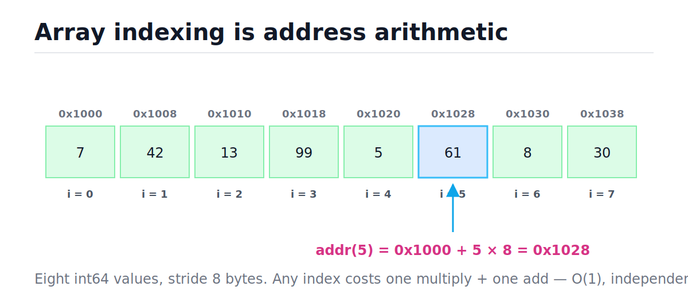
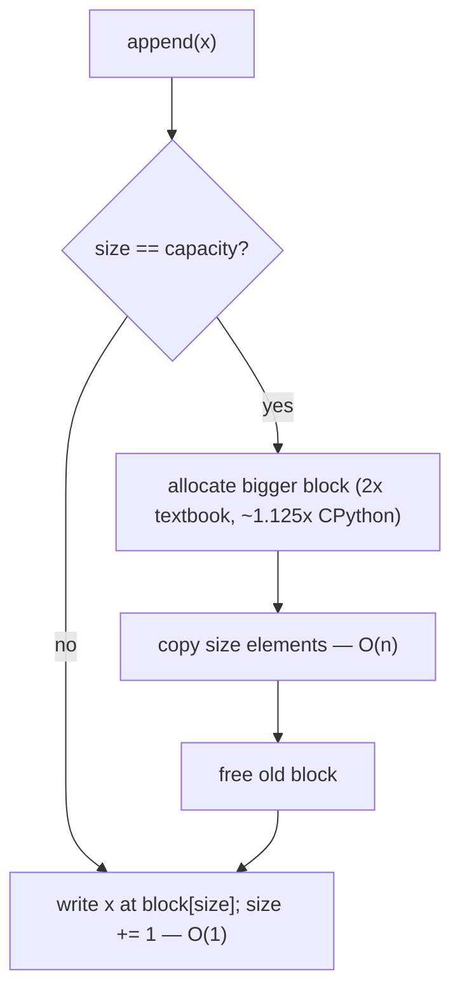
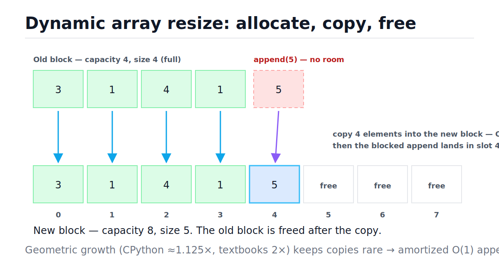
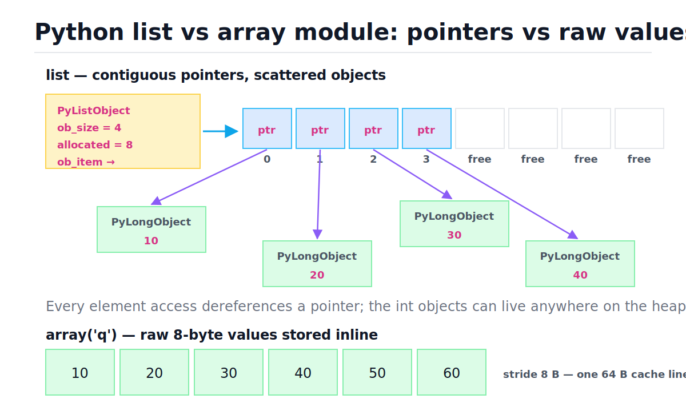

# Arrays and Dynamic Arrays

[toc]

> **TL;DR:** An array is a contiguous block of memory, so reading index i is one multiply and one add — O(1) — and scanning it rides the CPU cache instead of chasing pointers. A dynamic array (Python `list`, C++ `std::vector`, Java `ArrayList`, Go slice) keeps spare capacity and grows geometrically, which makes append amortized O(1). A Python list is a dynamic array of *pointers*: the slots are contiguous, the objects they point at are scattered.

## Vocabulary

**RAM model**

```math
\text{cost}\big(\text{read } M[a]\big) = O(1)
```

The standard cost model for algorithm analysis: memory is one giant byte array, and reading or writing any address costs one unit of time, regardless of where it is.

**Stride**

```math
\text{stride} = \text{sizeof}(T)
```

The number of bytes between the start of element i and the start of element i+1. For an array of 64-bit integers the stride is 8 bytes.

**Base + offset addressing**

```math
\text{addr}(i) = \text{base} + i \times \text{stride}
```

The reason array indexing is O(1): the address of any element is pure arithmetic on the block's starting address. No search, no traversal.

**Cache line**

```math
64 \text{ B} = 8 \times 8\text{-B words}
```

The unit the CPU actually moves between RAM and cache. Touch one byte and the hardware fetches the surrounding 64; sequential array access gets the next 7 elements almost free.

**Spatial locality**

```math
\text{miss rate}_{\text{sequential}} \approx \frac{\text{stride}}{64 \text{ B}}
```

The tendency of a program to touch addresses near ones it just touched. Sequential scans of a contiguous 8-byte-stride array miss the cache roughly once per 8 elements; a linked-list traversal can miss on every node.

**Fixed array**

```math
A[0 \ldots n-1], \quad \text{capacity fixed at allocation}
```

A block whose capacity is chosen once and never changes. C arrays, `array.array` before append, and NumPy buffers are fixed blocks.

**Dynamic array**

```math
0 \le \text{size} \le \text{capacity}
```

A fixed block plus two counters. `size` is how many slots are in use; `capacity` is how many exist. When `size == capacity`, the structure allocates a bigger block, copies, and frees the old one.

**Growth factor**

```math
\text{capacity}' = \lceil \alpha \cdot \text{capacity} \rceil, \quad \alpha > 1
```

The multiplier applied at resize. Textbooks use α = 2; CPython uses roughly α = 1.125. Any constant α > 1 yields amortized O(1) append.

**Amortized cost**

```math
\hat{c} = \frac{1}{n} \sum_{i=1}^{n} c_i
```

Total cost of a sequence of n operations divided by n. Single appends can cost O(n) at a resize, but the average over the whole sequence stays O(1).

**PyListObject**

```math
\text{ob\_item} : \text{PyObject*}[\,\text{allocated}\,]
```

CPython's struct behind every `list`: a length (`ob_size`), a capacity (`allocated`), and a heap block `ob_item` holding `allocated` pointers to Python objects.

## Intuition

Picture RAM as a single enormous byte array indexed by address. An array of n equal-sized elements is just a rented stretch of that byte array: element 0 at the base address, element 1 exactly one stride later, and so on. To find element i, the CPU does not walk anything — it computes the address directly.

```math
\text{addr}(i) = \text{base} + i \times \text{stride}
```

The figure below shows eight 8-byte integers starting at address 0x1000. Look at how index 5 is located: multiply 5 by the stride (8), add it to the base, and you land on 0x1028. That one multiply-and-add is the entire cost of indexing, whether the array has eight elements or eight billion.



Contiguity buys a second, quieter superpower: cache friendliness. CPUs fetch memory in 64-byte cache lines, so reading `a[0]` drags `a[1]` through `a[7]` into cache with it, and the prefetcher starts streaming the next lines before you ask. A linked list with identical O(n) scan cost can run 10–100× slower in wall-clock time because every `node.next` is a potential cache miss (~100 ns to RAM vs ~1 ns to L1). This is the gap [Big-O analysis](./01-big-o-notation-and-complexity-analysis.md) deliberately ignores and [linked lists](./03-linked-lists.md) pay for.

> [!NOTE]
> Big-O treats all memory reads as equal; hardware does not. Two O(n) scans can differ by two orders of magnitude depending on whether the access pattern is sequential (cache-line streaming) or scattered (pointer chasing).

## How it works

Arrays support four families of operations: index, append, insert/delete in the middle, and bulk transforms. Each has a distinct cost driven by one question — how many elements have to move? This section walks each operation, then the resize machinery that makes append cheap.

### Fixed arrays: indexing is arithmetic

A fixed array never moves and never grows, so every operation is either address arithmetic (O(1)) or element shifting (O(n)). Indexing compiles down to a single addressing-mode instruction on x86 (`mov rax, [rdi + rsi*8]`). Bounds checking — Python raises `IndexError`, C silently corrupts memory — is one comparison and does not change the asymptotics.

```python
s = list(range(10))

assert s[3] == 3            # O(1): base + 3 * stride
s[3] = 33                   # O(1): same address, write instead of read
assert s[3] == 33
assert s[-1] == 9           # negative index: Python computes n + i first, still O(1)
```

### Dynamic arrays: capacity, growth, and resize

A dynamic array is a fixed block wearing a trenchcoat: it tracks `size` (slots used) and `capacity` (slots allocated), and appends into spare capacity in O(1). Only when the block is full does it pay: allocate a bigger block, copy every element, free the old one. The decision flow on every append is tiny:



The figure below shows the expensive branch. The old block (capacity 4) is full, so `append(5)` cannot land; a new capacity-8 block is allocated, the four existing elements are copied down, the new element takes slot 4, and three free slots remain to absorb future appends in O(1).



Here is a complete dynamic array in ~30 lines. It doubles on resize and counts how many element copies the resizes cost — we will use that counter to verify the amortized bound empirically.

```python
from typing import Any, List

class DynamicArray:
    """Doubling dynamic array. append is amortized O(1)."""

    def __init__(self) -> None:
        self._block: List[Any] = [None]   # backing block, capacity 1
        self._size = 0
        self.copies = 0                   # elements moved during resizes

    def __len__(self) -> int:
        return self._size

    def __getitem__(self, i: int) -> Any:
        if not 0 <= i < self._size:       # bounds check, O(1)
            raise IndexError(i)
        return self._block[i]

    def append(self, value: Any) -> None:
        if self._size == len(self._block):          # full -> grow
            self._resize(2 * len(self._block))      # geometric: double
        self._block[self._size] = value             # O(1) write
        self._size += 1

    def _resize(self, capacity: int) -> None:
        new_block: List[Any] = [None] * capacity    # allocate
        for i in range(self._size):                 # copy, O(size)
            new_block[i] = self._block[i]
            self.copies += 1
        self._block = new_block                     # old block is garbage

arr = DynamicArray()
n = 1024
for v in range(n):
    arr.append(v)

assert len(arr) == n and arr[0] == 0 and arr[n - 1] == n - 1
assert arr.copies == 1023        # 1 + 2 + 4 + ... + 512 = n - 1 < 2n
```

Trace the first nine appends. Copies happen only at powers of two, and each resize is twice as far from the previous one — that spacing is the whole amortization argument:

| Step | Op | Capacity before | Full? | Copies this op | Capacity after | Size after | Decision |
| :--- | :--- | :---: | :---: | :---: | :---: | :---: | :--- |
| 1 | append(3) | 1 | no | 0 | 1 | 1 | slot free — write |
| 2 | append(1) | 1 | yes | 1 | 2 | 2 | grow 1→2, copy 1 |
| 3 | append(4) | 2 | yes | 2 | 4 | 3 | grow 2→4, copy 2 |
| 4 | append(1) | 4 | no | 0 | 4 | 4 | slot free — write |
| 5 | append(5) | 4 | yes | 4 | 8 | 5 | grow 4→8, copy 4 |
| 6 | append(9) | 8 | no | 0 | 8 | 6 | slot free — write |
| 7 | append(2) | 8 | no | 0 | 8 | 7 | slot free — write |
| 8 | append(6) | 8 | no | 0 | 8 | 8 | slot free — write |
| 9 | append(5) | 8 | yes | 8 | 16 | 9 | grow 8→16, copy 8 |

Nine appends, 15 copies total — under the 2n = 18 bound the geometric series guarantees (derivation in [Complexity](#complexity)).

### Slices copy, inserts shift

A slice `a[lo:hi]` allocates a fresh list and copies k = hi − lo pointers into it — O(k) time and space, never a view. Inserting or deleting at position i must shift every later element by one slot, which is a `memmove` over n − i pointers — O(n) worst case, and O(n) *every* time for position 0.

```python
s = list(range(10))
t = s[2:6]                  # new list of 4 pointers, O(k)
t[0] = 99
assert t == [99, 3, 4, 5]
assert s[2] == 2            # original untouched: the slice copied pointers
```

> [!TIP]
> If your algorithm needs O(1) pushes and pops at *both* ends, stop fighting the array: `collections.deque` does exactly that. See [Stacks and Queues](./04-stacks-and-queues.md). If you only ever touch the tail, the list is already optimal.

### In-place patterns: reversal and rotation

Two patterns appear constantly in interviews because they transform an array in O(n) time with O(1) extra space. Reversal walks two pointers inward, swapping as they go. Rotation by k uses the elegant three-reversal trick: reverse everything, then reverse the first k, then reverse the rest — each element lands exactly where a rotation would have put it. The same two-pointer skeleton powers [two-pointers on sorted arrays](./24-two-pointers.md).

```python
from typing import List

def reverse_range(a: List[int], lo: int, hi: int) -> None:
    """Reverse a[lo..hi] inclusive, in place. O(hi - lo) time, O(1) space."""
    while lo < hi:
        a[lo], a[hi] = a[hi], a[lo]
        lo += 1
        hi -= 1

def rotate_right(a: List[int], k: int) -> None:
    """Rotate right by k with three reversals. O(n) time, O(1) space."""
    n = len(a)
    if n == 0:
        return
    k %= n
    reverse_range(a, 0, n - 1)   # whole array
    reverse_range(a, 0, k - 1)   # first k
    reverse_range(a, k, n - 1)   # remaining n - k

a = [1, 2, 3, 4, 5]
reverse_range(a, 0, len(a) - 1)
assert a == [5, 4, 3, 2, 1]

b = [1, 2, 3, 4, 5, 6, 7]
rotate_right(b, 3)
assert b == [5, 6, 7, 1, 2, 3, 4]
```

## Complexity

Every cost in this table follows from one question: how many elements move? Indexing moves zero (O(1)), tail operations move zero except at a resize, head and middle operations move everything after the touched position, and bulk operations move what they produce. Numbers match CPython's documented behavior (see [wiki.python.org/moin/TimeComplexity](https://wiki.python.org/moin/TimeComplexity)).

| Operation | Best | Average | Worst | Extra space |
| :--- | :---: | :---: | :---: | :---: |
| `a[i]` read / write | O(1) | O(1) | O(1) | O(1) |
| `len(a)` | O(1) | O(1) | O(1) | O(1) |
| `a.append(x)` | O(1) | O(1) amortized | O(n) single call (resize) | O(n) during resize |
| `a.pop()` (tail) | O(1) | O(1) | O(n) (shrink copy) | O(1) |
| `a.pop(0)` / `a.insert(0, x)` | O(n) | O(n) | O(n) | O(1) |
| `a.insert(i, x)` | O(1) (i = end) | O(n − i) | O(n) | O(1) |
| `del a[i]` / `a.remove(x)` | O(1) (last) | O(n) | O(n) | O(1) |
| `x in a` (linear search) | O(1) (first) | O(n) | O(n) | O(1) |
| `a[lo:hi]` (slice of k) | O(k) | O(k) | O(k) | O(k) |
| `a.extend(it)` (k items) | O(k) | O(k) amortized | O(n + k) | O(k) |
| `a + b` (concatenation) | O(n + m) | O(n + m) | O(n + m) | O(n + m) |
| iterate all | O(n) | O(n) | O(n) | O(1) |
| `a.reverse()` / two-pointer reversal | O(n) | O(n) | O(n) | O(1) |
| rotate by k (three reversals) | O(n) | O(n) | O(n) | O(1) |
| `a.sort()` (Timsort) | O(n) (already sorted) | O(n log n) | O(n log n) | O(n) |

The key bound is amortized O(1) append, proved by the aggregate method (CLRS's table-doubling argument). Start from capacity 1, double on every resize, append n items: each append does one write, and resizes copy 1, 2, 4, … elements — a geometric series dominated by its last term.

```math
C_{\text{total}}(n) \;=\; \underbrace{n}_{\text{writes}} \;+\; \underbrace{\sum_{k=0}^{\lfloor \log_2 n \rfloor} 2^k}_{\text{resize copies}} \;<\; n + 2n \;=\; 3n
\qquad\Longrightarrow\qquad
\hat{c} \;=\; \frac{C_{\text{total}}(n)}{n} \;<\; 3 \;=\; O(1)
```

The geometry is what saves you: each resize is twice as expensive as the last but also twice as far away, so doubling costs never accumulate. Compare a policy that grows by a *constant* c slots instead — resizes happen every c appends and copy c, 2c, 3c, … elements, an arithmetic series:

```math
\sum_{j=1}^{n/c} jc \;=\; c \cdot \frac{\frac{n}{c}\left(\frac{n}{c} + 1\right)}{2} \;=\; \Theta\!\left(\frac{n^2}{c}\right)
\qquad\Longrightarrow\qquad
\hat{c} = \Theta(n)
```

> [!IMPORTANT]
> Amortized O(1) append requires *geometric* growth — multiply capacity by any constant α > 1. Constant-increment growth gives Θ(n²) total cost for n appends. This is the single most common wrong answer when interviewers probe the resize policy.

## Memory model in Python

CPython's `list` is a `PyListObject`: a small header holding `ob_size` (the visible `len`), `allocated` (the capacity), and `ob_item` — a pointer to a heap block of `allocated` `PyObject*` slots. So the list itself is genuinely contiguous, but it is contiguous *pointers*; every element is a full Python object living somewhere else on the heap, with its own refcount and type pointer (details in [Memory Model and PyObject Layout](../Programming-Languages/Python/13-memory-model-and-pyobject-layout.md)). In the figure, follow `ob_item` to the slot block, then follow any slot's arrow outward — that second hop is a pointer dereference you pay on *every* element access.



You can watch the capacity machinery from pure Python: `sys.getsizeof` reports header plus slot block, so it jumps only when a resize happens. On Python 3.9 (64-bit) the empty list is 56 bytes and each slot is 8, and appending 64 items steps through capacities 4, 8, 16, 24, 32, 40, 52, 64 — clearly gentler than doubling.

```python
import sys

xs = []
sizes = []
for i in range(64):
    xs.append(i)
    sizes.append(sys.getsizeof(xs))

assert sizes == sorted(sizes)          # capacity never shrinks while appending
assert len(set(sizes)) < len(sizes)    # many appends share one capacity step

transitions = [
    (i + 1, sizes[i]) for i in range(64)
    if i == 0 or sizes[i] != sizes[i - 1]
]
# On CPython 3.9 / 64-bit: [(1, 88), (5, 120), (9, 184), (17, 248),
#  (25, 312), (33, 376), (41, 472), (53, 568)]  -> capacities 4, 8, 16, 24, ...
```

CPython's growth rule (in `list_resize`, `Objects/listobject.c`, 3.11+ form) over-allocates about 12.5% plus a small constant, rounded to a multiple of 4 — a deliberately memory-frugal α ≈ 1.125:

```math
\text{new\_allocated} \;=\; \big(\text{newsize} + \lfloor \text{newsize}/8 \rfloor + 6\big) \;\&\; {\sim}3
```

> [!NOTE]
> The list also *shrinks*: `list_resize` reallocates downward when the size falls below half the allocated capacity, so a list that grew to a million elements and popped back to ten does return most of its slot block. The objects themselves are freed by refcounting as usual.

When every element is the same primitive type, the pointer indirection is pure overhead. The stdlib `array` module stores raw machine values inline — true contiguity, one allocation, 8 bytes per int64 instead of a pointer *plus* a 28-byte `PyLongObject`:

```python
import sys
from array import array

py_list = list(range(1000))
raw = array("q", range(1000))    # signed 64-bit ints stored inline

list_total = sys.getsizeof(py_list) + sum(sys.getsizeof(v) for v in py_list)
assert raw.itemsize == 8                    # true 8-byte stride
assert sys.getsizeof(raw) < list_total      # raw values beat pointers + objects
# Typical 3.9 numbers: list + int objects ~ 36 KB vs array('q') ~ 8.3 KB
```

NumPy takes the same idea further: a single contiguous buffer of raw values plus shape/stride metadata, with vectorized loops in C that stream whole cache lines. That is why `numpy.sum` over a million floats beats a Python-level loop by ~100×: same Big-O, but contiguous raw values, no per-element pointer chase, no per-element interpreter dispatch.

> [!WARNING]
> Copying a list copies *pointers*, not objects. `b = a[:]` gives you a new slot block whose entries alias the same objects — mutate a shared nested list through `b` and `a` sees it. Reach for `copy.deepcopy` only when you truly need object copies; it is O(total objects).

## Real-world example

A metrics agent ingests events on a hot path and ships them to a sink in batches. The right buffer is a plain list used append-only: `add` is amortized O(1), and flush hands off the whole block and starts a fresh one in O(1) instead of dequeuing items one by one from the front. This is the dynamic array used exactly the way its cost model wants.

```python
from typing import Callable, List

class BatchBuffer:
    """Append-only event buffer that flushes in batches.

    add: amortized O(1). flush: O(k) for k buffered events.
    """

    def __init__(self, flush_size: int,
                 sink: Callable[[List[str]], None]) -> None:
        self._buf: List[str] = []
        self._flush_size = flush_size
        self._sink = sink

    def add(self, event: str) -> None:
        self._buf.append(event)             # amortized O(1)
        if len(self._buf) >= self._flush_size:
            self.flush()

    def flush(self) -> None:
        if self._buf:
            self._sink(self._buf)
            self._buf = []                  # drop the old block, O(1)

batches: List[List[str]] = []
buf = BatchBuffer(flush_size=3, sink=batches.append)
for i in range(7):
    buf.add(f"event-{i}")
buf.flush()

assert [len(g) for g in batches] == [3, 3, 1]
assert batches[0] == ["event-0", "event-1", "event-2"]
```

> [!CAUTION]
> The tempting alternative — `buf.pop(0)` per event to drain the buffer — is O(n) per pop and Θ(n²) per flush cycle. "Accidentally quadratic" list-front operations are a classic production incident: fine at 1k events in staging, a CPU fire at 10M events in production. Drain by handing off the whole list, or use a `deque`.

## When to use / when NOT to use

Reach for an array when your access pattern is index-driven or tail-driven; reach for something else the moment you need cheap structural changes elsewhere. The decision is always about *where* the operations land.

**Use a list / dynamic array when:**

- You index by position or iterate everything — O(1) and cache-friendly O(n).
- You append and pop at the tail (stack discipline) — amortized O(1).
- You build once, then read many times — the densest, fastest layout available.
- You need to sort, binary-search ([Binary Search](./23-binary-search.md) requires O(1) random access), or scan with [two pointers](./24-two-pointers.md) or a [sliding window](./18-sliding-window-and-prefix-sums.md).

**Avoid it when:**

- You insert/delete at the front or middle constantly — O(n) each; use `collections.deque` ([Stacks and Queues](./04-stacks-and-queues.md)) or a [linked list](./03-linked-lists.md).
- You mostly ask "is x present?" — O(n) membership; use a set or [hash table](./05-hash-tables.md) for O(1) average.
- You need ordered insertion *and* fast search — a balanced BST ([BSTs and Balanced Trees](./07-binary-search-trees-and-balanced-trees.md)) does both in O(log n).
- Elements are huge and copies hurt — every resize and every middle insert moves them (in Python only pointers move, which softens this one).

## Common mistakes

- **"Append is sometimes O(n), so n appends are O(n²)"** — the O(n) resizes happen geometrically rarely; the aggregate cost is < 3n, so the loop is O(n). That is what *amortized* means.
- **"Growing by a fixed 100 slots is basically the same as doubling"** — it is not; constant-increment growth makes n appends Θ(n²). Growth must be geometric.
- **"Python lists store the elements"** — they store pointers; the objects live elsewhere on the heap. That is why `getsizeof(list)` ignores element payloads and why aliasing bites after `b = a[:]`.
- **`pop(0)` / `insert(0, x)` in a loop** — each is O(n), the loop is Θ(n²). Use `collections.deque` for queue behavior.
- **`result = result + [x]` inside a loop** — concatenation copies the whole left side every iteration, Θ(n²) total. Use `append` (and `"".join(parts)` for strings).
- **"Slicing is free"** — `a[lo:hi]` copies k pointers, O(k) time and memory. `a[::-1]` materializes a full reversed copy; `a.reverse()` is the O(1)-space option.
- **Removing items while iterating forward** — shifts skip elements or raise surprises. Iterate a copy, build a filtered list, or walk backwards.
- **"`x in mylist` is fast because lists are fast"** — membership is a linear scan, O(n). If you test membership more than a handful of times, build a set first.

## Interview questions and answers

A short setup for each, then the answer you would actually say out loud.

**1. Why is array indexing O(1)?**
**Answer:** Because the elements are contiguous and equal-sized, the address of element i is just base + i × stride — one multiply and one add, independent of n. No traversal happens; the CPU computes the address and reads it.

**2. Why is append amortized O(1) if a resize copies the whole array?**
**Answer:** Resizes get exponentially rarer as the array grows. With doubling, copying n elements only happens after n cheap appends paid for it; total work for n appends is under 3n by the geometric series, so the average per append is constant. Worst-case single append is still O(n) — amortized and worst-case answer different questions.

**3. Why grow geometrically instead of adding a fixed number of slots?**
**Answer:** Fixed increments mean a resize every c appends, copying an arithmetic series 1c + 2c + 3c + … which sums to Θ(n²/c). Geometric growth makes each resize twice as far away as it is expensive, collapsing the total to O(n). Any factor α > 1 works; the factor trades memory waste against copy frequency.

**4. What is a Python list under the hood?**
**Answer:** A dynamic array of pointers — a `PyListObject` with `ob_size`, `allocated`, and a contiguous block of `PyObject*`. The pointers are contiguous; the objects are scattered. CPython over-allocates by about 1.125× on growth and shrinks the block when size drops below half of capacity.

**5. Why is `pop(0)` slow and what do you use instead?**
**Answer:** Removing the head forces every remaining pointer to shift left one slot — a memmove of n−1 pointers, O(n), and Θ(n²) when done in a loop. `collections.deque` is a doubly-linked block structure with O(1) appends and pops at both ends; that's the right queue.

**6. Arrays and linked lists both scan in O(n) — why are arrays so much faster in practice?**
**Answer:** Cache lines. An array scan streams 64-byte lines so the next several elements are already in cache, and the prefetcher runs ahead; a linked list dereferences a pointer to an arbitrary address every node, which can be a ~100 ns cache miss each time. Same Big-O, up to 100× wall-clock difference.

**7. When would you pick `array.array` or NumPy over a list?**
**Answer:** When elements are homogeneous primitives and there are lots of them. A list spends a pointer plus a boxed object per element (~36 bytes per small int); `array('q')` stores raw 8-byte values inline, and NumPy adds vectorized C loops over that same contiguous layout. Less memory, no pointer chase, and SIMD-friendly.

**8. Rotate an array right by k in O(n) time and O(1) space.**
**Answer:** Three reversals: reverse the whole array, then reverse the first k elements, then reverse the rest. Each element is touched a constant number of times and lands exactly where the rotation puts it. Remember k %= n first to handle k ≥ n.

**9. Does a Python list ever return memory?**
**Answer:** Yes — on deletion CPython's `list_resize` reallocates the slot block downward once size falls below half the allocated capacity. The element objects themselves are freed by reference counting the moment nothing references them.

## Practice path

1. Re-implement `DynamicArray` from memory, then add `pop()` that shrinks the block to half when size falls to a quarter of capacity — explain why shrinking at *half* would thrash.
2. Run the `sys.getsizeof` loop on your interpreter; recover the capacity sequence by subtracting the 56-byte header and dividing by 8. Compare against the ≈1.125× formula.
3. Drill the in-place patterns: reversal, `rotate_right`, and removing every element that fails a predicate without extra space (write pointer ≤ read pointer).
4. Solve [Two Sum](../Leetcode/1-two-sum.md) brute-force on the array (O(n²)), then beat it with the [hash-map complement lookup](./05-hash-tables.md) (O(n)).
5. Work [two pointers on sorted arrays](./24-two-pointers.md), then [binary search](./23-binary-search.md) — both exist *because* arrays give O(1) random access.
6. Finish with [sliding window and prefix sums](./18-sliding-window-and-prefix-sums.md), the array-native answer to subarray problems.

## Copyable takeaways

- Indexing is O(1) because addr(i) = base + i × stride — arithmetic, not search.
- Contiguity wins twice: O(1) indexing *and* cache-line streaming; pointer-chasing structures lose wall-clock even at the same Big-O.
- Dynamic array = block + size + capacity; append into spare capacity, grow geometrically when full.
- Doubling makes n appends cost < 3n total → amortized O(1); constant-increment growth is Θ(n²). Growth must be geometric.
- A Python list is contiguous *pointers* to scattered objects; `array.array`/NumPy store raw values inline.
- CPython over-allocates ≈1.125×, shrinks below half occupancy; watch it with `sys.getsizeof`.
- Tail operations O(1); head/middle operations O(n); slices copy O(k); membership scans O(n).
- Front-of-list loops are accidentally quadratic — `deque` for queues, whole-list handoff for batch drains.
- Reversal and rotation: two pointers and three reversals, O(n) time, O(1) space.

## Sources

- Python wiki, "TimeComplexity" — official cost table for `list` operations: https://wiki.python.org/moin/TimeComplexity
- Python FAQ, "How are lists implemented in CPython?": https://docs.python.org/3/faq/design.html#how-are-lists-implemented-in-cpython
- CPython source, `Objects/listobject.c` (`list_resize`, over-allocation formula): https://github.com/python/cpython/blob/main/Objects/listobject.c
- `array` module docs: https://docs.python.org/3/library/array.html
- Cormen, Leiserson, Rivest, Stein, *Introduction to Algorithms* — "Amortized Analysis" chapter (Ch. 17 in 3rd ed., Ch. 16 in 4th ed.), table-doubling aggregate analysis.
- Sedgewick & Wayne, *Algorithms*, 4th ed., §1.3 — resizing-array stack implementation.
- Ulrich Drepper, "What Every Programmer Should Know About Memory" (2007) — cache lines, locality, and why streaming beats chasing.

## Related

- [Big-O Notation and Complexity Analysis](./01-big-o-notation-and-complexity-analysis.md)
- [Linked Lists](./03-linked-lists.md)
- [Stacks and Queues](./04-stacks-and-queues.md)
- [Two Pointers](./24-two-pointers.md)
- [Sliding Window and Prefix Sums](./18-sliding-window-and-prefix-sums.md)
- [Memory Model and PyObject Layout](../Programming-Languages/Python/13-memory-model-and-pyobject-layout.md)
