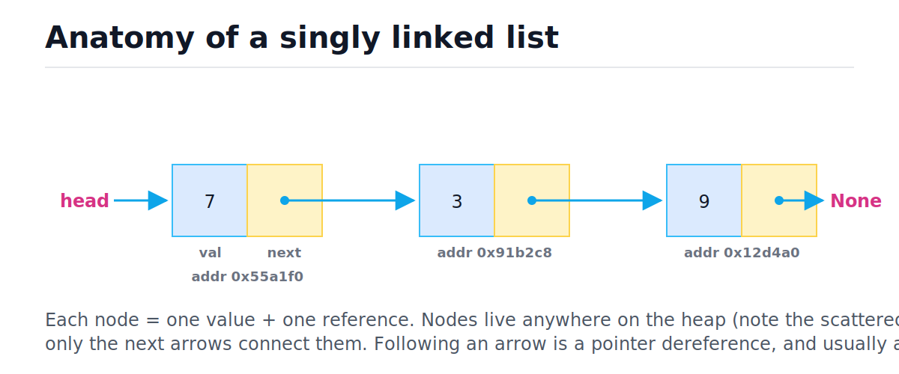
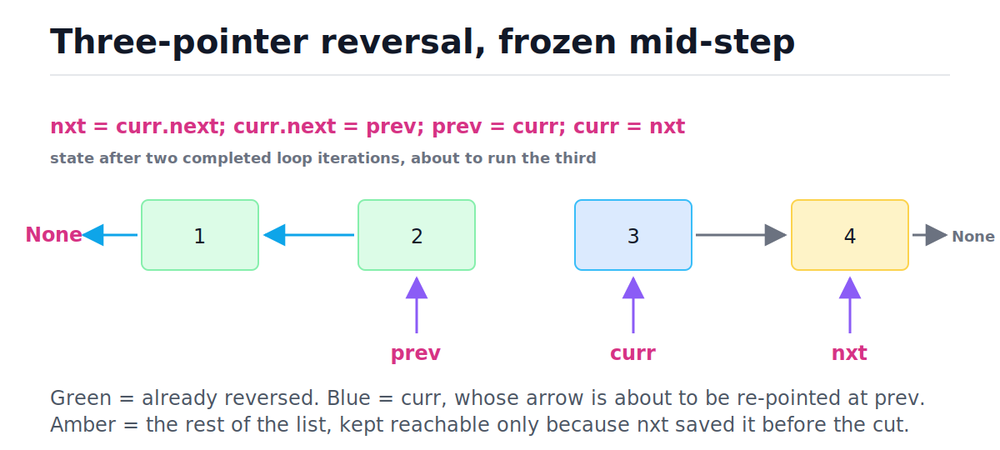
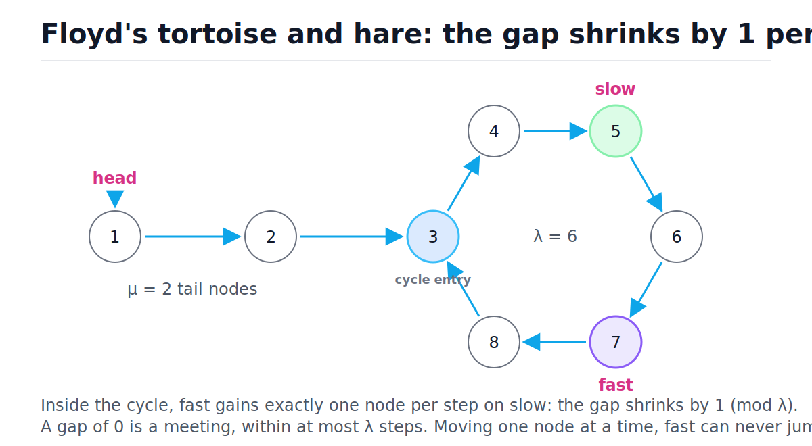
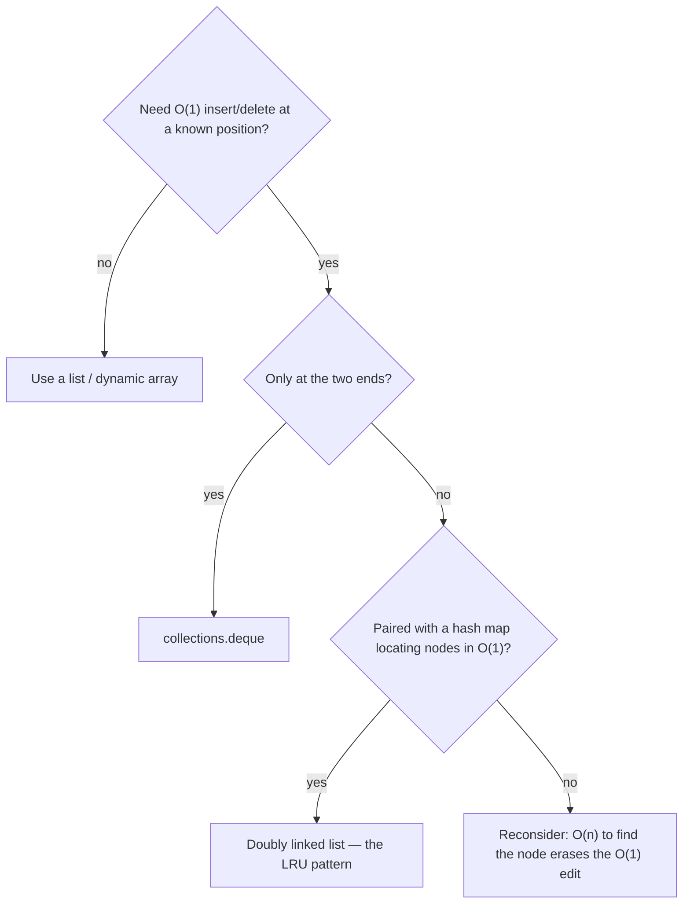

# Linked Lists

[toc]

> **TL;DR:** A linked list is a chain of heap-allocated nodes, each holding one value and a reference to the next node. Edits at a known position cost O(1) — no shifting — but reaching any position costs O(n) pointer hops, and each hop is usually a cache miss. In interviews they are pointer-manipulation drills; in production they survive mostly as `collections.deque` and as the recency list inside an LRU cache.

## Vocabulary

**Node**

```math
\text{node} = (\text{val},\ \text{next})
```

The unit of storage: one payload value plus one reference. A doubly linked node adds a `prev` reference.

**Head**

```math
\text{head} \rightarrow n_0
```

The reference to the first node. Losing it loses the whole list — there is no other way in.

**Tail**

```math
n_{k-1}.\text{next} = \varnothing
```

The last node; its `next` is `None`. Keeping a separate tail pointer turns append from O(n) into O(1).

**Singly linked list**

```math
n_0 \rightarrow n_1 \rightarrow \cdots \rightarrow n_{k-1} \rightarrow \varnothing
```

Each node points forward only. You can never walk backward, which is why deleting a node requires its predecessor.

**Doubly linked list**

```math
n_{i-1} \leftrightarrow n_i \leftrightarrow n_{i+1}
```

Each node points both ways. Any node you hold can unlink itself in O(1) — the property the LRU cache pattern is built on.

**Sentinel (dummy) node**

```math
\text{dummy} \rightarrow \text{head}
```

A throwaway node placed before the real head so that "insert/delete at the front" is no longer a special case. Return `dummy.next` at the end.

**Cycle**

```math
\exists\ i < j:\ n_j.\text{next} = n_i
```

Some node's `next` points back into the list. Traversal never terminates; detection needs Floyd's algorithm or a visited set.

**Tail length and cycle length**

```math
\mu,\ \lambda
```

μ is the number of nodes before the cycle entry; λ is the number of nodes on the cycle. Floyd's algorithm runs in O(μ + λ) time.

**Pointer chasing**

```math
t_{\text{hop}} \approx t_{\text{DRAM}} \approx 100\,\text{ns}
```

Following `node.next` is a dependent memory load the CPU cannot prefetch. On scattered nodes, every hop is a likely cache miss — the practical reason linked lists lose to arrays.

## Intuition

An array is a row of lockers: locker k is at a fixed, computable address. A linked list is a scavenger hunt: each clue tells you only where the next clue lives. Nothing about the structure is contiguous — the "list" exists purely in the arrows. The figure below shows the anatomy: each node is a tiny heap object with a value cell and a next-pointer cell, and the heap addresses are scattered on purpose.



The trade is exact. Arrays give O(1) random access but O(n) inserts in the middle (everything shifts — see [Arrays and Dynamic Arrays](./02-arrays-and-dynamic-arrays.md)). Linked lists give O(1) edits at a node you already hold, but O(n) to get anywhere. Every linked-list technique in this note is a way to live with that constraint.

## How it works

### A clean ListNode class

The interview-standard node is two fields. Using `__slots__` keeps each node at 48 bytes in CPython instead of 48 plus a 104-byte `__dict__`. The `build`/`to_list` helpers convert to and from Python lists so every function below is testable.

```python
from typing import Iterable, List, Optional


class ListNode:
    __slots__ = ("val", "next")

    def __init__(self, val: int, nxt: "Optional[ListNode]" = None) -> None:
        self.val = val
        self.next = nxt


def build(values: Iterable[int]) -> "Optional[ListNode]":
    """Build a singly linked list. O(n) time, O(n) space."""
    head: Optional[ListNode] = None
    tail: Optional[ListNode] = None
    for v in values:
        node = ListNode(v)
        if tail is None:
            head = tail = node
        else:
            tail.next = node
            tail = node
    return head


def to_list(head: "Optional[ListNode]") -> List[int]:
    """Drain a list into a Python list. O(n) time."""
    out: List[int] = []
    while head is not None:
        out.append(head.val)
        head = head.next
    return out


assert to_list(build([1, 2, 3])) == [1, 2, 3]
assert to_list(build([])) == []
```

### Core operations

Four operations cover most of what a singly linked list can do. Push-front is O(1) because the new node just points at the old head. Append is O(n) unless you maintain a tail pointer. Indexing is O(k) — there is no address arithmetic, only hopping. Insert-after-a-known-node is O(1), and that locality is the entire selling point.

```python
def push_front(head, val):
    """O(1): new node adopts the old head as its next."""
    return ListNode(val, head)


def append(head, val):
    """O(n) without a tail pointer: must walk to the end first."""
    node = ListNode(val)
    if head is None:
        return node
    cur = head
    while cur.next is not None:
        cur = cur.next
    cur.next = node
    return head


def get(head, k):
    """O(k): k pointer hops. Arrays do this with one multiply-add."""
    cur = head
    for _ in range(k):
        assert cur is not None, "index out of range"
        cur = cur.next
    assert cur is not None, "index out of range"
    return cur.val


def insert_after(node, val):
    """O(1): rewire two pointers. No shifting, ever."""
    node.next = ListNode(val, node.next)


head = build([2, 3])
head = push_front(head, 1)        # [1, 2, 3]
head = append(head, 5)            # [1, 2, 3, 5]
third = head.next.next            # the node holding 3
insert_after(third, 4)            # [1, 2, 3, 4, 5]
assert to_list(head) == [1, 2, 3, 4, 5]
assert get(head, 0) == 1 and get(head, 4) == 5
```

> [!IMPORTANT]
> "O(1) delete/insert" assumes you already hold a pointer to the node (doubly linked) or to its predecessor (singly linked). If you must first *find* the node, the search is O(n) and dominates. This is the most-misquoted fact about linked lists.

### The dummy (sentinel) head trick

Deleting from a singly linked list needs the predecessor of the doomed node — but the first node has no predecessor, so naive code grows an `if head ...` special case. A sentinel node planted before the head gives every real node a predecessor, collapsing the edge cases into the main loop. Return `dummy.next`, which is the (possibly new) head.

```python
def delete_value(head, target):
    """Remove every node with val == target. O(n) time, O(1) space."""
    dummy = ListNode(0, head)
    prev, cur = dummy, head
    while cur is not None:
        if cur.val == target:
            prev.next = cur.next      # unlink cur; prev stays put
        else:
            prev = cur                # advance prev only past kept nodes
        cur = cur.next
    return dummy.next


assert to_list(delete_value(build([7, 1, 7, 2, 7]), 7)) == [1, 2]
assert to_list(delete_value(build([7, 7]), 7)) == []
assert to_list(delete_value(build([1, 2]), 9)) == [1, 2]
```

> [!TIP]
> Any time a linked-list solution starts with `if head is None` or special-cases the first node, reach for a dummy. Merge, partition, remove-nth-from-end, and every insertion problem get shorter and less buggy with one.

### Iterative reversal: three pointers

Reversal re-points every arrow backward using three pointers: `prev` (the already-reversed prefix), `curr` (the node being flipped), and `nxt` (a one-step lookahead that keeps the unreversed suffix reachable). The order inside the loop is rigid: save, cut, advance, advance. The figure freezes the loop mid-flight on a four-node list.



```python
def reverse(head):
    """Iterative three-pointer reversal. O(n) time, O(1) space."""
    prev = None
    curr = head
    while curr is not None:
        nxt = curr.next        # 1. save the rest before cutting
        curr.next = prev       # 2. flip one arrow
        prev = curr            # 3. advance prev
        curr = nxt             # 4. advance curr
    return prev                # prev ends on the old tail = new head


assert to_list(reverse(build([1, 2, 3, 4]))) == [4, 3, 2, 1]
assert to_list(reverse(build([1]))) == [1]
assert reverse(None) is None
```

Trace on `[1, 2, 3, 4]` — each row is the state *after* one loop iteration:

| Step | nxt saved | arrow flipped | prev | curr | List shape | Decision |
| :---: | :---: | :--- | :---: | :---: | :--- | :--- |
| 0 (init) | — | — | None | 1 | 1→2→3→4→∅ | curr not None → loop |
| 1 | 2 | 1→∅ | 1 | 2 | 1→∅  ·  2→3→4→∅ | continue |
| 2 | 3 | 2→1 | 2 | 3 | 2→1→∅  ·  3→4→∅ | continue |
| 3 | 4 | 3→2 | 3 | 4 | 3→2→1→∅  ·  4→∅ | continue |
| 4 | None | 4→3 | 4 | None | 4→3→2→1→∅ | curr is None → return prev |

> [!WARNING]
> Writing `curr.next = prev` before saving `nxt = curr.next` orphans the entire unreversed suffix — the garbage collector eats it and the function returns a two-node list. This is the single most common linked-list bug; the trace table's "nxt saved" column exists to drill the order.

### Fast and slow pointers: middle node

Two pointers walk from the head; `slow` moves one node per step, `fast` moves two. When `fast` runs off the end, `slow` has covered exactly half the distance and sits on the middle. One pass, O(n) time, O(1) space — no length-counting first pass needed.

```python
def middle(head):
    """Returns the second middle for even lengths: [1,2,3,4] -> 3."""
    slow = fast = head
    while fast is not None and fast.next is not None:
        slow = slow.next
        fast = fast.next.next
    return slow


m = middle(build([1, 2, 3, 4, 5]))
assert m is not None and m.val == 3
m = middle(build([1, 2, 3, 4]))
assert m is not None and m.val == 3   # second of the two middles
```

### Floyd's cycle detection: tortoise and hare

If the list has a cycle, traversal never ends, so "walk to None" is not a termination proof. Floyd's algorithm runs the same slow/fast pair: if there is no cycle, `fast` hits None; if there is one, both pointers eventually orbit the cycle, and the figure shows why they must collide.



The why-it-works argument is a relative-speed argument. Once both pointers are inside the cycle, each step changes the gap between them by exactly one node (fast gains 2, slow gains 1, net +1 mod λ). A gap that shrinks by exactly 1 each step must pass through 0 — fast cannot jump over slow — so they meet within λ steps of slow entering the cycle. Total work is bounded by:

```math
T = O(\mu + \lambda) = O(n), \qquad S = O(1)
```

Phase 2 finds the cycle entry. Say slow has taken μ + k steps when they meet (k steps inside the cycle). Fast took twice as many, and the difference — itself μ + k — is a whole number of laps:

```math
2(\mu + k) - (\mu + k) = \mu + k \equiv 0 \pmod{\lambda}
```

So the meeting point sits μ + k steps from the head, and μ + k is a multiple of λ. Walk μ more steps from the meeting point and you land exactly on the cycle entry — the same place a second pointer reaches after walking μ steps from the head. Step both by one until they collide:

```python
def has_cycle(head):
    """Floyd phase 1. O(n) time, O(1) space."""
    slow = fast = head
    while fast is not None and fast.next is not None:
        slow = slow.next
        fast = fast.next.next
        if slow is fast:
            return True
    return False


def cycle_entry(head):
    """Floyd phase 2: reset one pointer to head, step both by 1."""
    slow = fast = head
    while fast is not None and fast.next is not None:
        slow = slow.next
        fast = fast.next.next
        if slow is fast:
            p = head
            while p is not slow:
                p = p.next
                slow = slow.next
            return p
    return None


# Build 1 -> 2 -> 3 -> 4 -> 5, then point 5 back at 3 (mu=2, lambda=3).
head = build([1, 2, 3, 4, 5])
entry = head.next.next            # node 3
entry.next.next.next = entry      # node 5 -> node 3
assert has_cycle(head) is True
assert cycle_entry(head) is entry
assert has_cycle(build([1, 2, 3])) is False
assert cycle_entry(build([1, 2, 3])) is None
```

> [!CAUTION]
> Accidental cycles are a production hazard, not just an interview puzzle. Object graphs with back-references hang naive traversals and serializers — CPython's `json.dumps` raises `ValueError: Circular reference detected` precisely because it runs this check. Any hand-rolled "walk the chain" code over user-supplied structures needs a cycle guard.

### Merging two sorted lists

Merge is the splice operation that linked lists are genuinely good at: no element is copied, only pointers are rewired. A dummy head absorbs the "which list starts the result?" edge case, and a `tail` pointer grows the merged list left to right. Using `<=` (not `<`) keeps the merge stable, which matters when this becomes the merge step of merge sort on lists.

```python
def merge(a, b):
    """Merge two sorted lists. O(n + m) time, O(1) extra space."""
    dummy = ListNode(0)
    tail = dummy
    while a is not None and b is not None:
        if a.val <= b.val:            # <= keeps equal keys stable
            tail.next, a = a, a.next
        else:
            tail.next, b = b, b.next
        tail = tail.next
    tail.next = a if a is not None else b   # splice leftover run: O(1)
    return dummy.next


assert to_list(merge(build([1, 3, 5]), build([2, 4, 6]))) == [1, 2, 3, 4, 5, 6]
assert to_list(merge(build([]), build([1]))) == [1]
assert to_list(merge(build([1, 1]), build([1]))) == [1, 1, 1]
```

The final splice line is the payoff: when one list runs dry, the entire remaining run of the other list attaches with a single pointer write. An array-based merge would copy every remaining element.

## Complexity

Every operation above, in one table. "Known node" means you already hold a reference to it; n and m are list lengths. Space is *extra* space beyond the input.

| Operation | Best | Average | Worst | Extra space |
| :--- | :---: | :---: | :---: | :---: |
| Push front | O(1) | O(1) | O(1) | O(1) |
| Append, no tail pointer | O(n) | O(n) | O(n) | O(1) |
| Append, with tail pointer | O(1) | O(1) | O(1) | O(1) |
| Index / `get(k)` | O(1) | O(n) | O(n) | O(1) |
| Search by value | O(1) | O(n) | O(n) | O(1) |
| Insert after known node | O(1) | O(1) | O(1) | O(1) |
| Delete known node (doubly) | O(1) | O(1) | O(1) | O(1) |
| Delete known node (singly) | O(1) | O(n) | O(n) | O(1) |
| Delete by value (dummy head) | O(n) | O(n) | O(n) | O(1) |
| Reverse (three pointers) | O(n) | O(n) | O(n) | O(1) |
| Middle (fast/slow) | O(n) | O(n) | O(n) | O(1) |
| Cycle detection (Floyd) | O(μ + λ) | O(μ + λ) | O(n) | O(1) |
| Merge two sorted lists | O(n + m) | O(n + m) | O(n + m) | O(1) |
| Splice whole list at known node | O(1) | O(1) | O(1) | O(1) |

The key bound is indexing, because it is what separates lists from arrays. Reaching position k requires k sequential dereferences, each a constant-cost hop:

```math
T_{\text{get}}(k) = \sum_{i=1}^{k} c = c\,k = O(k) \le O(n)
```

An array computes the same address in one step, with no dependency chain:

```math
\text{addr}(k) = \text{base} + k \cdot \text{stride} \quad\Rightarrow\quad O(1)
```

The deeper problem is that the linked-list sum is *sequentially dependent*: hop i+1 cannot start until hop i returns from memory. The Big-O hides a constant factor of roughly 100× when nodes are cache-cold, which is why "O(n) traversal" of a list and "O(n) scan" of an array feel nothing alike in practice. Deleting a known node in a singly linked list is O(n) worst case for the same reason — the unlink itself is O(1), but finding the predecessor requires a scan from the head; a doubly linked node carries its predecessor with it. For the framework behind these statements, see [Big-O Notation and Complexity Analysis](./01-big-o-notation-and-complexity-analysis.md).

## Memory model in Python

CPython makes every linked-list cost concrete and a little worse. Each `ListNode` is a separate heap allocation: with `__slots__`, 48 bytes (16-byte object header + two 8-byte slot pointers + alignment); without `__slots__`, the same 48 bytes plus a separate `__dict__` of about 104 bytes. The integer payload is itself a 28-byte heap object. So storing one small int costs roughly 76 bytes across two allocations — versus 8 bytes of pointer in a CPython `list`'s contiguous buffer (about 8,056 bytes for 1,000 ints, header included).

```python
import sys


class SlotNode:
    __slots__ = ("val", "next")

    def __init__(self, val, nxt=None):
        self.val, self.next = val, nxt


class DictNode:
    def __init__(self, val, nxt=None):
        self.val, self.next = val, nxt


assert sys.getsizeof(SlotNode(1)) == 48           # CPython 3.9, 64-bit
assert sys.getsizeof(DictNode(1).__dict__) >= 96  # the hidden extra cost
assert sys.getsizeof(1) == 28                     # even the payload is boxed
```

Hardware compounds it. A cache line is 64 bytes: scanning an array of 8-byte pointers gets 8 elements per memory fetch and the prefetcher streams ahead. Linked nodes are allocated at different times and land at scattered addresses, so each `node.next` is a dependent load with no prefetch — near one DRAM round-trip (~100 ns) per node when cold. Same Big-O as an array scan; 1–2 orders of magnitude slower wall-clock.

> [!NOTE]
> CPython's `list` is not a linked list — it is a dynamic array of `PyObject*` pointers (see [Arrays and Dynamic Arrays](./02-arrays-and-dynamic-arrays.md)). That is why `list.insert(0, x)` is O(n) and there is no O(1) splice. Object layout details live in [Memory Model and PyObject Layout](../Programming-Languages/Python/13-memory-model-and-pyobject-layout.md).

The production-grade middle ground is `collections.deque`: a doubly linked list *of blocks* of 64 pointer slots, not of single nodes. Links are chased per block, not per element, so it keeps O(1) `appendleft`/`popleft` while regaining most of the array's cache behavior and amortizing allocations 64 ways. Indexing into a deque is still O(n) toward the middle.

```python
from collections import deque

q = deque([1, 2, 3])
q.appendleft(0)        # O(1); list.insert(0, x) would be O(n)
q.append(4)            # O(1)
assert q.popleft() == 0
assert q.pop() == 4
assert list(q) == [1, 2, 3]
assert q[0] == 1       # works, but middle indexing is O(n)
```

> [!TIP]
> In Python, "I need a linked list" almost always means "use `collections.deque`". Reserve hand-rolled nodes for two cases: interview problems, and structures where you must unlink an *interior* node in O(1) via a saved reference — the LRU pattern below.

## Real-world example: an LRU cache

Scenario: a service caches rendered user profiles. Memory is capped at N entries; on overflow, evict the entry unused the longest. Requirements: `get` and `put` in O(1). A hash map alone gives O(1) lookup but no recency order; a list alone gives order but O(n) lookup. The classic composite: a dict mapping key → node, plus a doubly linked list ordered by recency. The dict jumps straight to the node; the doubly links let that node unlink itself in O(1); two sentinels (head = most recent side, tail = least recent side) erase every empty/single-element edge case. This is the [Hash Tables](./05-hash-tables.md) pattern paired with this note's O(1)-unlink property, and it is LeetCode 146.

```python
class DNode:
    __slots__ = ("key", "val", "prev", "next")

    def __init__(self, key=0, val=0):
        self.key, self.val = key, val
        self.prev = self.next = None


class LRUCache:
    """get/put in O(1): dict finds the node, the linked list orders recency."""

    def __init__(self, capacity):
        self.cap = capacity
        self.map = {}                          # key -> DNode
        self.head = DNode()                    # sentinel: most-recent side
        self.tail = DNode()                    # sentinel: least-recent side
        self.head.next, self.tail.prev = self.tail, self.head

    def _unlink(self, node):                   # O(1): doubly linked
        node.prev.next, node.next.prev = node.next, node.prev

    def _push_front(self, node):               # O(1): insert after sentinel
        node.prev, node.next = self.head, self.head.next
        self.head.next.prev = node
        self.head.next = node

    def get(self, key):
        if key not in self.map:
            return -1
        node = self.map[key]
        self._unlink(node)                     # move-to-front = mark recent
        self._push_front(node)
        return node.val

    def put(self, key, val):
        if key in self.map:
            self._unlink(self.map.pop(key))
        node = DNode(key, val)
        self.map[key] = node
        self._push_front(node)
        if len(self.map) > self.cap:
            lru = self.tail.prev               # least recently used
            self._unlink(lru)
            del self.map[lru.key]              # node stores key for this


cache = LRUCache(2)
cache.put(1, 100)
cache.put(2, 200)
assert cache.get(1) == 100        # 1 becomes most recent
cache.put(3, 300)                 # evicts 2, the least recent
assert cache.get(2) == -1
assert cache.get(3) == 300
assert cache.get(1) == 100
```

Note the detail interviews probe: the node stores its own `key`. Eviction walks from the tail sentinel to a *node*, and without the key on the node there is no O(1) way to delete its dict entry. The same dict-plus-doubly-list shape appears inside `functools.lru_cache` and `OrderedDict` in CPython, and in every database buffer pool's eviction list.

## Worked pattern: carry-based addition

Carry-based addition shows how a singly linked list and a small integer variable can simulate grade-school column arithmetic. The key insight is that when digits are stored least-significant first — as they are in LeetCode 2 — the linked-list traversal direction matches the natural direction of carry propagation: ones column first, then tens, then hundreds. If digits were stored most-significant first, carry would need to flow backward through a singly linked list, which is impossible in one pass.

The algorithm maintains three pieces of state per iteration: a digit from the first list (or 0 if exhausted), a digit from the second list (or 0 if exhausted), and the carry from the previous column. These three values sum to at most 9 + 9 + 1 = 19, so carry is always 0 or 1. A dummy head node removes the special case for the very first output node — every append uses identical code, and `dummy.next` is the real result head.

```python
from typing import Optional


class ListNode:
    __slots__ = ("val", "next")

    def __init__(self, val: int = 0, nxt: Optional["ListNode"] = None) -> None:
        self.val = val
        self.next = nxt


def add_two_numbers(
    l1: Optional[ListNode], l2: Optional[ListNode]
) -> Optional[ListNode]:
    """Add two non-negative integers stored as reversed digit lists.

    O(max(n, m)) time and space, where n and m are list lengths.
    """
    dummy = ListNode(0)
    current = dummy
    carry = 0

    while l1 or l2 or carry:
        val1 = l1.val if l1 else 0
        val2 = l2.val if l2 else 0

        total = val1 + val2 + carry
        carry = total // 10
        digit = total % 10

        current.next = ListNode(digit)
        current = current.next

        if l1:
            l1 = l1.next
        if l2:
            l2 = l2.next

    return dummy.next


# Helper for building and draining reversed-digit lists
def _from_int(n: int) -> Optional[ListNode]:
    dummy = ListNode(0)
    cur = dummy
    if n == 0:
        return ListNode(0)
    while n:
        cur.next = ListNode(n % 10)
        cur = cur.next
        n //= 10
    return dummy.next


def _to_int(head: Optional[ListNode]) -> int:
    result, place = 0, 1
    while head:
        result += head.val * place
        place *= 10
        head = head.next
    return result


assert _to_int(add_two_numbers(_from_int(342), _from_int(465))) == 807   # 342+465
assert _to_int(add_two_numbers(_from_int(0), _from_int(0))) == 0
assert _to_int(add_two_numbers(_from_int(9999999), _from_int(9999))) == 10009998
```

**Carry trace for 342 + 465.** Digits are stored as 2→4→3 and 5→6→4. Walking left to right:

| Column | val1 | val2 | carry in | total | digit out | carry out |
| :---: | :---: | :---: | :---: | :---: | :---: | :---: |
| ones | 2 | 5 | 0 | 7 | 7 | 0 |
| tens | 4 | 6 | 0 | 10 | 0 | 1 |
| hundreds | 3 | 4 | 1 | 8 | 8 | 0 |

Result list: 7→0→8, which decodes to 807.

> [!IMPORTANT]
> The loop condition is `while l1 or l2 or carry`, not `while l1 and l2`. The stricter condition drops remaining digits from the longer list and also misses a final carry node (e.g., 999 + 1 = 1000 requires one extra node that carries alone through the last iteration).

> [!TIP]
> The dummy head + `current` tail pointer pattern appears here and in merge, partition, and remove-nth problems. Any time you are building a new linked list node by node, plant a dummy head first and advance a separate tail pointer — it collapses head-edge-case code into zero lines.

## When to use / When NOT to use

The decision hinges on one question: do you hold a reference to the edit position, and is O(1) editing there worth O(n) access everywhere else? The flowchart compresses the call.



Use a linked list when:

- You splice: concatenating lists, moving a whole run of nodes, merging sorted chains — all O(1) pointer rewires.
- An external index (hash map) hands you interior nodes, and they must unlink in O(1): LRU/LFU caches, timer wheels, free lists in allocators.
- You need stable references: nodes never move on insert, so saved pointers stay valid (array elements move on resize).
- Both ends need O(1) push/pop: use `deque`.

Avoid a linked list when:

- Access is by index or you binary-search — O(n) hops kill it; see [Binary Search](./23-binary-search.md).
- You iterate hot data for math or aggregation — cache behavior makes arrays ~100× faster at equal Big-O.
- Memory is tight — 48+ bytes per node vs 8 bytes per array slot in CPython.
- You "might insert in the middle sometimes" — measure first; `list` wins far more often than intuition predicts.

## Common mistakes

- **"Linked lists insert in O(1), so they beat arrays for insert-heavy work"** — only with a node reference in hand. Find-then-insert is O(n) + O(1) = O(n), the same as an array, with worse constants.
- **Cutting before saving** — `curr.next = prev` before `nxt = curr.next` orphans the suffix. Save first, always.
- **Special-casing the head** — forgetting that deleting/inserting the first node changes `head`. The dummy node exists to delete this entire class of bug.
- **Advancing `prev` after an unlink** — in `delete_value`, `prev` must stay put when a node is removed, or back-to-back targets (`[7, 7]`) survive.
- **`while fast.next:` without `while fast:`** — even-length lists run `fast` off the end and raise `AttributeError: 'NoneType' object has no attribute 'next'`. The guard is `fast is not None and fast.next is not None`, in that order.
- **Detecting cycles by value equality** — two nodes can hold equal values; compare identity (`slow is fast`), not `==`.
- **Forgetting the key on LRU nodes** — eviction finds a node via `tail.prev` and then cannot delete its dict entry without `node.key`.
- **Reaching for a hand-rolled list in production Python** — `deque` or plain `list` wins on speed, memory, and bug count unless you specifically need O(1) interior unlink.

## Interview questions and answers

**1. Why is deleting a known node O(1) in a doubly linked list but O(n) in a singly linked list?**

**Answer:** The unlink itself is always O(1) — rewire the neighbors around the node. But a singly linked node doesn't know its predecessor, and the predecessor's `next` is one of the pointers you must rewrite, so you scan from the head to find it: O(n). A doubly linked node carries `prev` with it, so both neighbors are reachable from the node itself.

**2. You're given only a pointer to a node in a singly linked list — not the head. Delete it.**

**Answer:** Copy the next node's value into this node, then unlink the next node: `node.val = node.next.val; node.next = node.next.next`. You delete the value by impersonation in O(1). The catch I'd flag: it fails if the node is the tail (no next to copy from), and it breaks any external references that assumed the next node's identity.

**3. How does Floyd's algorithm prove a cycle exists, and how do you find the entry?**

**Answer:** Run slow at 1 step and fast at 2. If there's no cycle, fast hits None. If there is, both end up in the cycle, where fast closes the gap by exactly 1 per step — it can't jump over slow — so they meet within λ steps. For the entry: when they meet, slow has taken μ + k steps and that count is a multiple of λ, so a pointer from the head and a pointer from the meeting point, both moving 1 step, collide after exactly μ steps — at the cycle entry. O(n) time, O(1) space.

**4. When does a linked list actually beat an array in practice, not just in Big-O?**

**Answer:** When something else already hands me the node — then O(1) unlink/splice is real, not preceded by an O(n) search. The canonical case is an LRU cache: the hash map locates the node, the doubly linked list reorders it in O(1). Also whole-list splicing and stable node addresses. For plain sequential or indexed data, the array wins on cache lines alone, often by 100×.

**5. Why is `list.insert(0, x)` O(n) in Python, and what's the right fix?**

**Answer:** CPython's `list` is a contiguous array of pointers, so inserting at the front shifts every element right by one slot — O(n) memmove. The fix is `collections.deque.appendleft`, which is O(1) because deque is a doubly linked list of 64-slot blocks: front insertion just writes into the head block, allocating a new block every 64th operation.

**6. Reverse a linked list without extra memory. Walk me through the pointers.**

**Answer:** Three pointers. `prev` starts None, `curr` starts at head. Each iteration: save `nxt = curr.next`, flip `curr.next = prev`, then slide both forward — `prev = curr`, `curr = nxt`. When `curr` is None, `prev` is the old tail, which is the new head. O(n) time, O(1) space. The order matters: save before flipping, or the rest of the list is unreachable.

**7. Find the kth node from the end in one pass.**

**Answer:** Two pointers k apart. Advance the lead pointer k steps, then move both together until the lead hits the end; the trailing pointer is on the kth from the end. It's the same fast/slow family as middle-finding — encode a distance relationship into two pointers, pay one O(n) pass, O(1) space. With a dummy head it also handles "remove the kth from the end" cleanly when k equals the length.

**8. What's the middle-node convention for even-length lists, and why does it matter?**

**Answer:** With `while fast and fast.next`, slow lands on the *second* middle — `[1,2,3,4]` gives 3. Starting fast at `head.next` instead gives the first middle. It matters because palindrome-check and list-split problems need a deliberate choice of where the second half starts; off-by-one here is the classic failure mode, so I state the convention out loud before coding.

**9. Design constraint: why does an LRU cache need a *doubly* linked list? Wouldn't singly do?**

**Answer:** Two reasons. On `get`, the dict hands me an interior node that must move to the front — unlinking it needs its predecessor, which a singly node can't reach in O(1). On eviction, I need the least-recent node *and* the ability to unlink it; with a tail sentinel, `tail.prev` gives both in O(1). Singly linked versions exist but have to store predecessor pointers in the map, which is the same information with more bookkeeping.

## Practice path

1. Implement `ListNode`, `build`, `to_list` from memory; verify round-trips with asserts.
2. Reverse Linked List (LC 206) — write the trace table for `[1,2,3]` on paper *before* coding.
3. Middle of the Linked List (LC 876) — both even-length conventions.
4. Linked List Cycle (LC 141), then Cycle II (LC 142) — re-derive the μ + k ≡ 0 (mod λ) argument from scratch.
5. Merge Two Sorted Lists (LC 21) — dummy head, then explain why the final splice is O(1).
6. Remove Nth Node From End (LC 19) — dummy + two pointers k apart.
7. Add Two Numbers (LC 2) — the carry pattern; review the worked section above and the solution in [Add Two Numbers](../Leetcode/2-add-two-numbers.md).
8. Palindrome Linked List (LC 234) — composite: middle + reverse second half + compare + (optionally) restore.
9. LRU Cache (LC 146) — from scratch, sentinels included; then explain why the node stores its key.

## Copyable takeaways

- A linked list is nodes + arrows on the heap; nothing is contiguous, and only the head reference keeps it alive.
- Edits at a held node: O(1). Reaching any position: O(n). Find-then-edit is O(n) total — same as an array, worse constants.
- Dummy/sentinel nodes delete head-edge-case bugs; return `dummy.next`.
- Reversal: save `nxt`, flip `curr.next = prev`, advance, advance — in exactly that order. O(n)/O(1).
- Fast/slow pointers: middle in one pass; Floyd detects cycles in O(n) time, O(1) space because the gap shrinks by 1 per step.
- Cycle entry: meeting distance μ + k is a multiple of λ, so head-pointer and meeting-pointer collide at the entry after μ steps.
- Merging sorted lists rewires pointers — O(n + m) time, zero element copies, O(1) leftover splice.
- Linked lists are cache-hostile: ~48-byte nodes, scattered allocations, one dependent load (≈100 ns cold) per hop vs 8 array elements per 64-byte cache line.
- In Python, default to `collections.deque` (block-linked, O(1) at both ends); hand-roll nodes only for O(1) interior unlink via saved references — the LRU pattern.

## Sources

- Cormen, Leiserson, Rivest, Stein, *Introduction to Algorithms*, 3rd ed., §10.2 "Linked lists" (sentinels in §10.2 as well).
- Sedgewick & Wayne, *Algorithms*, 4th ed., §1.3 — linked-list implementations of bags, stacks, queues.
- Knuth, *The Art of Computer Programming*, Vol. 2, §3.1 exercise 6 — cycle detection attributed to Robert W. Floyd.
- Python docs — `collections.deque`: https://docs.python.org/3/library/collections.html#collections.deque
- Python wiki — Time complexity of CPython containers: https://wiki.python.org/moin/TimeComplexity
- CPython source — deque's 64-slot block design: https://github.com/python/cpython/blob/main/Modules/_collectionsmodule.c

## Related

- [DSA Curriculum Index](./00-dsa-curriculum-index.md)
- [Arrays and Dynamic Arrays](./02-arrays-and-dynamic-arrays.md)
- [Stacks and Queues](./04-stacks-and-queues.md)
- [Hash Tables](./05-hash-tables.md)
- [Add Two Numbers](../Leetcode/2-add-two-numbers.md)
- [Two Pointers](./24-two-pointers.md)
