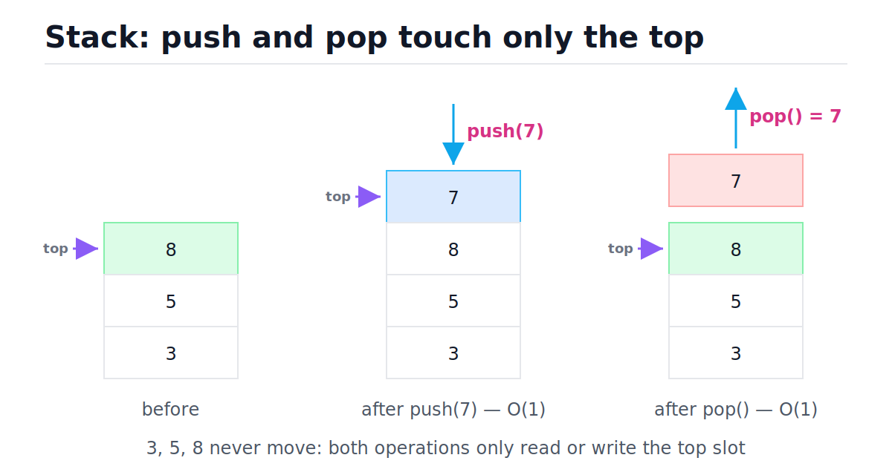
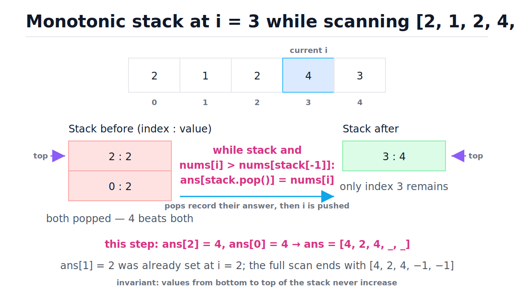
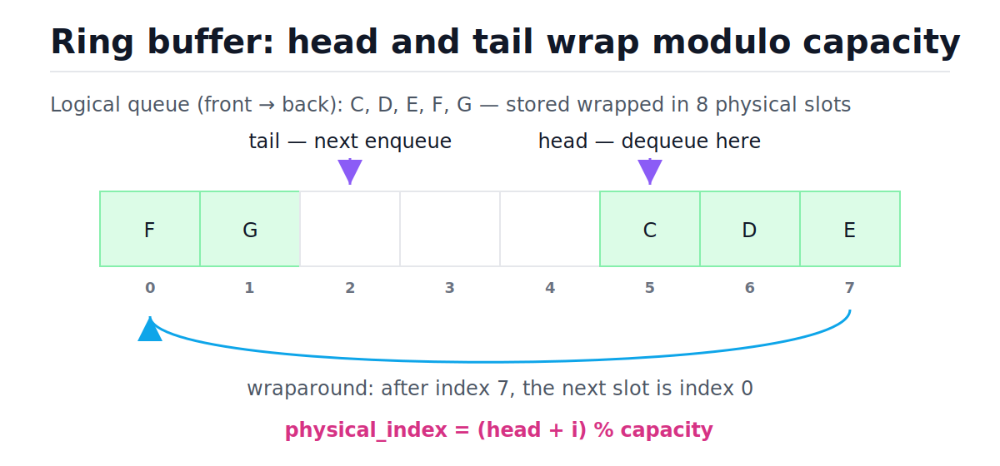
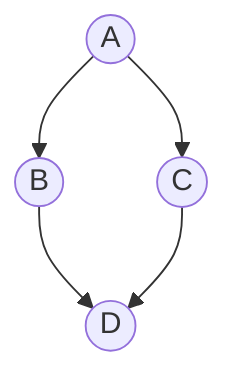

# Stacks and Queues

[toc]

> **TL;DR:** Stacks and queues are *access disciplines*, not containers: a stack only touches the newest element (LIFO), a queue only touches the oldest (FIFO). In Python, a `list` is a perfect stack (amortized O(1) `append`/`pop`) but a terrible queue (`pop(0)` is O(n)); `collections.deque` gives O(1) at both ends via linked blocks of 64 slots. The discipline you pick decides the traversal you get: a stack gives DFS, a queue gives BFS.

## Vocabulary

Each term below carries weight in the rest of the note. The symbol line shows the canonical operation or invariant; the prose line is the one-sentence definition.

**Stack (LIFO)**

```math
\text{push}(S, x), \quad \text{pop}(S) \to \text{most recently pushed element}
```

A collection where insert and remove both happen at the same end, called the *top*. Last In, First Out.

**Queue (FIFO)**

```math
\text{enqueue}(Q, x), \quad \text{dequeue}(Q) \to \text{oldest element}
```

A collection where insert happens at the *tail* and remove happens at the *head*. First In, First Out.

**Deque (double-ended queue)**

```math
\text{appendleft},\ \text{append},\ \text{popleft},\ \text{pop} \ \in\ O(1)
```

A queue generalized to support O(1) insert and remove at *both* ends. Python's `collections.deque`.

**Ring buffer (circular buffer)**

```math
\text{physical\_index} = (\text{head} + i) \bmod c
```

A fixed-capacity array where head and tail indices wrap around modulo the capacity c, so neither enqueue nor dequeue ever shifts elements.

**Monotonic stack**

```math
nums[s_1] \ge nums[s_2] \ge \cdots \ge nums[s_k] \quad (s_1 = \text{bottom},\ s_k = \text{top})
```

A stack of indices maintained so the values they point at never increase from bottom to top. Each arriving element pops everything smaller before pushing itself.

**Amortized cost**

```math
\hat{c} = \frac{1}{n} \sum_{i=1}^{n} c_i
```

The average cost per operation over a worst-case *sequence* of n operations. A single operation may be expensive as long as the sequence total stays linear.

**Call stack**

```math
\text{frames} = [f_0, f_1, \dots, f_d], \quad \text{return pops } f_d
```

The runtime's own stack of function frames. Every call pushes a frame; every return pops one. Recursion *is* stack usage — the interpreter just hides it.

## Intuition

Picture a stack of plates and a checkout line. With plates, you can only add or take from the top — whoever washed the last plate sees it used first. In a checkout line, the person who arrived first leaves first, and cutting in is forbidden. Neither picture says anything about *what the plates are stored in* — that is the whole poin**<u>t. Stack and queue are rules about *which element you're allowed to touch next*;</u>** arrays, linked lists, and block lists are just storage backends that implement the rule at different costs.

The figure below shows the stack discipline concretely: p**ush and pop only ever read or write the top slot, which is why both are O(1) — the cost never depends on how many plates are underneath.**



> [!IMPORTANT]
> Stack and queue are *interfaces*, not data structures. The same Python `list` is an excellent stack and a disastrous queue. Always ask "which end does each operation touch, and what does the backend charge for that end?"

## How it works

This section walks each operation and algorithm in turn: list-as-stack, the call stack, the valid-parentheses pattern, the monotonic stack, the queue refresher, deques and ring buffers, and finally how the discipline choice produces BFS vs DFS.

### Stack via Python list

A Python `list` is a dynamic array: a contiguous block of pointers with spare capacity at the end (see [Arrays and Dynamic Arrays](./02-arrays-and-dynamic-arrays.md)). `append` writes into the spare slot and `pop()` (no argument) just decrements the length — neither moves any other element. That makes the *right end* of a list a textbook stack top.

```python
stack: list[int] = []
stack.append(3)              # push — O(1) amortized
stack.append(5)
stack.append(8)
assert stack[-1] == 8        # peek — O(1)
assert stack.pop() == 8      # pop  — O(1)
assert stack == [3, 5]
```

The "amortized" qualifier on `append` exists because the array occasionally fills up and must reallocate-and-copy. The doubling growth strategy makes those copies rare enough that the average stays constant — derived in [Complexity](#complexity).

### Recursion is a stack

Every function call pushes a frame (locals, instruction pointer) onto the interpreter's call stack; every return pops it. **<u>So any recursive algorithm can be rewritten with an explicit stack</u>** — you manage the frames instead of the interpreter. This matters in Python because CPython caps recursion depth (default ~1000 via `sys.getrecursionlimit()`), while an explicit stack lives on the heap and is bounded only by memory.

```python
def sum_recursive(values: list) -> int:
    total = 0
    for v in values:
        if isinstance(v, list):
            total += sum_recursive(v)   # the call stack remembers where we were
        else:
            total += v
    return total


def sum_iterative(values: list) -> int:
    total = 0
    stack: list = [values]              # explicit stack replaces the call stack
    while stack:
        current = stack.pop()
        if isinstance(current, list):
            stack.extend(current)
        else:
            total += current
    return total


nested = [1, [2, [3, 4]], 5]
assert sum_recursive(nested) == sum_iterative(nested) == 15

deep: list = [1]
for _ in range(50_000):          # 50,000 levels of nesting:
    deep = [1, deep]             # recursion would hit RecursionError near ~1000;
assert sum_iterative(deep) == 50_001   # the heap stack handles it fine
```

> [!CAUTION]
> A `RecursionError` in production is a stack-discipline bug, not a "make the limit bigger" bug. Raising `sys.setrecursionlimit` risks crashing the C stack instead. Convert deep recursion to an explicit stack — same algorithm, heap-bounded. More in [Recursion and Divide and Conquer](./10-recursion-and-divide-and-conquer.md).

### Valid parentheses — the canonical stack pattern

Brackets nest in LIFO order: the most recently opened bracket must be the first one closed. That sentence *is* a stack specification. Push every opener; on each closer, the top of the stack must be its partner. The string is balanced iff every closer matched and the stack ends empty. Time O(n), space O(n) worst case (all openers).

```python
def is_balanced(s: str) -> bool:
    """True iff every bracket opens and closes in LIFO order. O(n) time."""
    pairs = {")": "(", "]": "[", "}": "{"}
    stack: list[str] = []
    for ch in s:
        if ch in "([{":
            stack.append(ch)
        elif ch in pairs:
            if not stack or stack.pop() != pairs[ch]:
                return False
    return not stack


assert is_balanced("{[()]}")
assert is_balanced("")
assert not is_balanced("([)]")   # interleaved: ')' arrives while '[' is on top
assert not is_balanced("(((")    # leftover openers
```

Trace of `is_balanced("{[()]}")` — read the stack column left-to-right as bottom-to-top:

| Step | Char | Action | Stack after | Decision |
| :---: | :---: | :--- | :--- | :--- |
| 1 | `{` | opener → push | `{` | continue |
| 2 | `[` | opener → push | `{ [` | continue |
| 3 | `(` | opener → push | `{ [ (` | continue |
| 4 | `)` | closer → pop `(` | `{ [` | match — continue |
| 5 | `]` | closer → pop `[` | `{` | match — continue |
| 6 | `}` | closer → pop `{` | *(empty)* | match — continue |
| end | — | stack empty? | *(empty)* | **balanced** |

### Monotonic stack — next greater element

For "first element to the right that is greater than me" questions, the brute force is O(n²): for each index, scan right. The monotonic stack drops it to O(n) with one observation: while you're waiting for something bigger, you can wait *together* with everyone smaller than you. Keep a stack of indices whose values never increase from bottom to top. When a new value arrives, it is the answer for every smaller value on top of the stack — pop them all, record the answer, then push the newcomer.

```python
def next_greater(nums: list[int]) -> list[int]:
    """ans[i] = first value right of i strictly greater than nums[i], else -1."""
    ans = [-1] * len(nums)
    stack: list[int] = []          # indices; their values never increase upward
    for i, x in enumerate(nums):
        while stack and x > nums[stack[-1]]:
            ans[stack.pop()] = x   # x is the first greater value for that index
        stack.append(i)
    return ans


assert next_greater([2, 1, 2, 4, 3]) == [4, 2, 4, -1, -1]
assert next_greater([5, 4, 3, 2, 1]) == [-1, -1, -1, -1, -1]  # never pops early
assert next_greater([1, 2, 3]) == [2, 3, -1]
```

Full trace on `nums = [2, 1, 2, 4, 3]`. The stack stores indices; values shown for readability:

| Step | i | nums[i] | Stack before (idx:val) | Pops (answer recorded) | Stack after |
| :---: | :---: | :---: | :--- | :--- | :--- |
| 0 | 0 | 2 | *(empty)* | — | `0:2` |
| 1 | 1 | 1 | `0:2` | — (1 < 2, just wait) | `0:2, 1:1` |
| 2 | 2 | 2 | `0:2, 1:1` | pop 1 → `ans[1] = 2` | `0:2, 2:2` |
| 3 | 3 | 4 | `0:2, 2:2` | pop 2 → `ans[2] = 4`; pop 0 → `ans[0] = 4` | `3:4` |
| 4 | 4 | 3 | `3:4` | — (3 < 4) | `3:4, 4:3` |
| end | — | — | `3:4, 4:3` | leftovers keep −1 | — |

Final answer: `[4, 2, 4, -1, -1]`. Step 3 is where the magic happens — the figure below freezes that exact moment. Note how 4 pays for multiple pops at once, but each index is pushed exactly once and popped at most once over the whole scan.



> [!TIP]
> Spot the pattern by the phrase "nearest greater/smaller to the left/right". Daily temperatures, stock span, largest rectangle in histogram, trapping rain water — all are this one trick with different bookkeeping. Note the equal-values case: `2` at index 2 does **not** pop `2` at index 0 because the comparison is strict.

### Queue intro — FIFO line discipline

A queue is the movie-ticket line rule in code: the first item to arrive is the first item served. New work enters at the back, also called the tail, and removal happens from the front, also called the head. This is the Core Patterns refresher version; if you are following a full foundation course, treat this as the quick review and use the deeper queue module for the long lesson.

| Operation | Also called | End touched | Meaning |
| :--- | :--- | :--- | :--- |
| Insert | Push / enqueue | Back / tail | Put a new item at the end of the queue. |
| Peek | Front | Front / head | Read the first item without removing it. |
| Remove | Pop / dequeue | Front / head | Remove and return the first item. |

A minimal Python queue uses `collections.deque` so front removal is O(1). The method names below line up with the abstract operations: `append` inserts at the back, `q[0]` peeks at the front, and `popleft` removes from the front.

```python
from collections import deque

line: deque[str] = deque()
line.append("first")          # insert / push / enqueue at the back
line.append("second")
line.append("third")

assert line[0] == "first"     # peek at the front
assert line.popleft() == "first"   # remove / pop / dequeue from the front
assert list(line) == ["second", "third"]
```

### Why a list is a bad queue

A queue needs to remove from the *front*. On a list, `pop(0)` removes index 0 and then `memmove`s every remaining pointer one slot left to keep the array contiguous — O(n) per dequeue, O(n²) to drain a queue of n items. The benchmark below makes the asymmetry observable; at 20,000 elements the deque drains the same workload orders of magnitude faster.

```python
import time
from collections import deque

n = 20_000
xs = list(range(n))
dq = deque(range(n))

t0 = time.perf_counter()
while xs:
    xs.pop(0)              # shifts every remaining pointer left: O(n) each
list_secs = time.perf_counter() - t0

t0 = time.perf_counter()
while dq:
    dq.popleft()           # bumps an index inside the leftmost block: O(1)
deque_secs = time.perf_counter() - t0

assert deque_secs < list_secs   # typically 50-200x at this size
```

> [!WARNING]
> `list.pop(0)` and `list.insert(0, x)` both run in O(n) and look innocent in code review. Any loop containing them is quadratic. If both ends of a sequence get touched, reach for `collections.deque` before profiling tells you to.

### Deque intro — both ends are live

A deque, pronounced "deck", is a double-ended queue: it keeps an ordered sequence while allowing both the front and the back to accept inserts and removals. The bookshelf picture is useful: if both ends are reachable, you can add or take a book from either side without moving the middle books. A deque is the right interface when an algorithm needs queue behavior sometimes and stack-like end operations other times.

| Operation | Python `deque` | End touched | Meaning |
| :--- | :--- | :--- | :--- |
| Insert front | `appendleft(x)` | Front | Put a new item at the beginning. |
| Insert back | `append(x)` | Back | Put a new item at the end. |
| Peek front | `d[0]` | Front | Read the first item without removing it. |
| Peek back | `d[-1]` | Back | Read the last item without removing it. |
| Remove front | `popleft()` | Front | Remove and return the first item. |
| Remove back | `pop()` | Back | Remove and return the last item. |

Here is the whole deque surface in a small trace. Watch that neither removal changes the middle order; only the chosen end moves.

```python
from collections import deque

books: deque[str] = deque(["B", "C"])
books.appendleft("A")         # insert front
books.append("D")             # insert back

assert books[0] == "A"        # peek front
assert books[-1] == "D"       # peek back
assert books.popleft() == "A" # remove front
assert books.pop() == "D"     # remove back
assert list(books) == ["B", "C"]
```

### deque and the ring buffer mental model

`collections.deque` gives O(1) `append`, `appendleft`, `pop`, and `popleft`. The cleanest mental model for a bounded queue is the ring buffer: a fixed array plus two indices, head (next dequeue) and tail (next enqueue), both advancing modulo the capacity. Nothing ever shifts; the "front" is wherever head points. `deque(maxlen=k)` behaves exactly like this ring — when full, an append silently evicts the opposite end.

The figure shows the wrap in action: the logical queue C→G is physically split across the end of the array, and arithmetic modulo capacity stitches it back together.



```python
from collections import deque

q: deque[str] = deque()
q.append("a")                # enqueue at the tail — O(1)
q.append("b")
assert q.popleft() == "a"    # dequeue at the head — O(1), FIFO order
assert q.popleft() == "b"

recent: deque[int] = deque(maxlen=3)   # bounded ring buffer
for i in range(5):
    recent.append(i)         # when full, the oldest entry is evicted
assert list(recent) == [2, 3, 4]
assert recent[0] == 2        # indexing the ends is O(1); the middle is O(n)
```

> [!NOTE]
> CPython's deque is not literally one ring; it is a doubly-linked list of fixed 64-slot blocks (details in [Memory model in Python](#memory-model-in-python)). The ring buffer is still the right *mental* model for the bounded case, and the cost profile is the same: O(1) ends, O(n) middle.

### BFS uses a queue, DFS uses a stack

Graph traversal keeps a *frontier* of discovered-but-unvisited nodes. The data structure holding the frontier decides the exploration order. A queue serves the oldest discovery first, so the search expands level by level — breadth-first, and the first time you reach a node is via a shortest path (in edge count). A stack serves the newest discovery first, so the search dives down one branch before backtracking — depth-first. Same loop, one line different.



```python
from collections import deque

graph: dict[str, list[str]] = {
    "A": ["B", "C"],
    "B": ["D"],
    "C": ["D"],
    "D": [],
}


def bfs_order(start: str) -> list[str]:
    seen = {start}
    queue: deque[str] = deque([start])
    order: list[str] = []
    while queue:
        node = queue.popleft()        # FIFO: oldest discovery first
        order.append(node)
        for nbr in graph[node]:
            if nbr not in seen:
                seen.add(nbr)
                queue.append(nbr)
    return order


def dfs_order(start: str) -> list[str]:
    seen: set = set()
    stack: list[str] = [start]
    order: list[str] = []
    while stack:
        node = stack.pop()            # LIFO: newest discovery first
        if node in seen:
            continue
        seen.add(node)
        order.append(node)
        for nbr in reversed(graph[node]):   # reversed → left neighbor on top
            stack.append(nbr)
    return order


assert bfs_order("A") == ["A", "B", "C", "D"]   # level by level
assert dfs_order("A") == ["A", "B", "D", "C"]   # one branch to the bottom
```

Both run in O(V + E) time and O(V) space. The full treatment — shortest paths, connected components, grids — lives in [Graphs, BFS and DFS](./09-graphs-bfs-and-dfs.md). When the frontier needs *priority* order instead of arrival order, the structure becomes a heap: [Heaps and Priority Queues](./08-heaps-and-priority-queues.md).

## Complexity

Every operation and algorithm shown above, in one table. "Amortized" marks operations whose occasional expensive step (reallocation) averages out over a sequence.

| Operation / algorithm | Backend | Best | Average | Worst | Space |
| :--- | :--- | :---: | :---: | :---: | :---: |
| `append` (push) | `list` | O(1) | O(1) amortized | O(n) single op | — |
| `pop()` (pop) | `list` | O(1) | O(1) | O(1) | — |
| `s[-1]` (peek) | `list` | O(1) | O(1) | O(1) | — |
| `pop(0)` / `insert(0, x)` | `list` | O(n) | O(n) | O(n) | — |
| `append` / `appendleft` | `deque` | O(1) | O(1) | O(1) | — |
| `pop` / `popleft` | `deque` | O(1) | O(1) | O(1) | — |
| `d[0]` / `d[-1]` (peek ends) | `deque` | O(1) | O(1) | O(1) | — |
| `d[k]` (index middle) | `deque` | O(1) | O(n) | O(n) | — |
| `is_balanced` | stack | O(n) | O(n) | O(n) | O(n) |
| `next_greater` (monotonic) | stack | O(n) | O(n) | O(n) | O(n) |
| BFS / DFS | queue / stack | O(V+E) | O(V+E) | O(V+E) | O(V) |
| Rate limiter `allow` | `deque` | O(1) | O(1) amortized | O(n) single op | O(limit) |

Two amortized bounds carry this whole note. First, list `append`: growth by doubling means a sequence of n appends pays n unit writes plus copies at sizes 1, 2, 4, …, so the total is bounded by

```math
n + \sum_{k=0}^{\lceil \log_2 n \rceil} 2^k \;<\; n + 2n \;=\; 3n \quad\Rightarrow\quad O(1)\ \text{amortized per push}
```

Second, the monotonic stack: step 3 of the trace did three units of work for one element, which looks super-linear — until you charge each pop to the element being popped. Every index is pushed exactly once and popped at most once across the entire scan, so

```math
\text{total work} \;\le\; \underbrace{n}_{\text{pushes}} + \underbrace{n}_{\text{pops}} \;=\; 2n \quad\Rightarrow\quad O(n)\ \text{total},\ O(1)\ \text{amortized per element}
```

The same charging argument proves the rate limiter below is amortized O(1): each timestamp enters the deque once and is evicted once, no matter how the evictions cluster. This "pay on entry for your eventual exit" pattern is the workhorse of amortized analysis — see [Big-O Notation and Complexity Analysis](./01-big-o-notation-and-complexity-analysis.md).

## Memory model in Python

The asymptotics above come from concrete memory layouts. A CPython `list` is a `PyListObject`: a header plus one contiguous C array of `PyObject*` pointers with slack capacity. `pop()` from the right decrements `ob_size` — one integer write. `pop(0)` calls `memmove` on the remaining `(n−1) × 8` bytes of pointers to restore contiguity — that is the physical O(n). The pointed-to objects never move; only the 8-byte pointers do, which is why even the O(n) is "fast O(n)": `memmove` streams through cache-friendly contiguous memory. See [Memory Model and PyObject Layout](../Programming-Languages/Python/13-memory-model-and-pyobject-layout.md) for the object headers themselves.

`collections.deque` (CPython `Modules/_collectionsmodule.c`) is a **doubly-linked list of blocks**, each block a fixed array of 64 `PyObject*` slots:

```text
            leftblock                      centerblock                    rightblock
        +----------------+            +----------------+            +----------------+
 NULL <-| prev           | <--------- | prev           | <--------- | prev           |
        | 64 slots       |            | 64 slots       |            | 64 slots       |
        |  ^ leftindex   |            |  (all full)    |            |  ^ rightindex  |
        | next           | ---------> | next           | ---------> | next           |-> NULL
        +----------------+            +----------------+            +----------------+
```

This hybrid is deliberate. A plain linked list pays one heap allocation and ~3 pointers of overhead *per element* and scatters nodes across the heap, trashing the cache (compare [Linked Lists](./03-linked-lists.md)). A plain ring-buffer array would need O(n) reallocation to grow. Blocks of 64 give: one allocation per 64 elements, 64 consecutive pointers per cache-line-friendly block, O(1) growth at either end (allocate one block, link it), and no large copies ever. `popleft` advances `leftindex` within the left block; only when the block empties is it unlinked and freed. The price: `d[k]` for middle k must walk ⌈k/64⌉ block links — that is the O(n) middle indexing, and why a deque is *not* a drop-in list replacement.

> [!NOTE]
> `queue.Queue` is a different animal: a `deque` wrapped in locks and condition variables for *thread* communication (see [The GIL, Threads, Multiprocessing](../Programming-Languages/Python/8-the-gil-threads-multiprocessing.md)). In single-threaded algorithm code its locking is pure overhead — use `collections.deque` directly.

## Real-world example

A sliding-window rate limiter is a queue problem in disguise: "allow at most `limit` requests in any trailing `window` seconds" means timestamps enter at one end and expire from the other — strict FIFO, both ends hot, bounded size. This is exactly the deque's home turf, and it is how API gateways implement per-client limits (the production architecture lives in [Rate Limiting and Load Shedding](../System-Design/10-rate-limiting-and-load-shedding.md)).

```python
from collections import deque


class SlidingWindowLimiter:
    """Allow at most `limit` requests in any trailing `window` seconds."""

    def __init__(self, limit: int, window: float) -> None:
        self.limit = limit
        self.window = window
        self.hits: deque[float] = deque()   # timestamps, oldest at the left

    def allow(self, now: float) -> bool:
        while self.hits and self.hits[0] <= now - self.window:
            self.hits.popleft()             # expire old hits — amortized O(1)
        if len(self.hits) < self.limit:
            self.hits.append(now)           # record this request — O(1)
            return True
        return False


limiter = SlidingWindowLimiter(limit=3, window=10.0)
assert limiter.allow(0.0)
assert limiter.allow(1.0)
assert limiter.allow(2.0)
assert not limiter.allow(3.0)    # 3 hits already inside the last 10 s
assert not limiter.allow(9.9)    # still nothing has expired
assert limiter.allow(11.0)       # the hit at t=0.0 fell out of the window
```

Each timestamp is appended once and popped once, so a burst of expirations in one call is paid for by the calls that enqueued them — the same amortized argument as the monotonic stack. Memory is bounded by `limit`, not by traffic volume.

## When to use / when NOT to use

The decision is mechanical once you name which end each operation touches. Use this table as the routing layer; the prose after it covers the traps.

| You need | Reach for | Because |
| :--- | :--- | :--- |
| LIFO: undo, backtracking, DFS, nesting | `list` as stack | O(1) push/pop at the right end, best cache behavior |
| FIFO: BFS, task queue, sliding window | `collections.deque` | O(1) at both ends |
| Bounded "last k items" buffer | `deque(maxlen=k)` | ring-buffer eviction for free |
| Nearest greater/smaller element | monotonic stack | O(n) instead of O(n²) |
| Serve by priority, not arrival | `heapq` | see [Heaps and Priority Queues](./08-heaps-and-priority-queues.md) |
| Hand work between threads | `queue.Queue` | locking built in |

Do **not** use a stack or queue when you need random access by index (use a list/array), membership tests (use a set or [Hash Tables](./05-hash-tables.md)), or ordering by key rather than by arrival (heap or sorted structure). And do not use `deque` as a general list replacement: middle indexing and slicing are O(n), and `deque` has no `sort`.

## Common mistakes

- **"`list.pop(0)` is fine, it's just one call"** — it `memmove`s every remaining element; in a loop it turns O(n) algorithms into O(n²). Use `deque.popleft()`.
- **"A deque is a faster list"** — only at the ends. `d[len(d)//2]` walks 64-slot blocks: O(n). Lists index in O(1).
- **"BFS works with a list as the queue"** — it produces correct *order* but `pop(0)` makes it O(V²) on the queue operations alone. Always `deque` for BFS.
- **"Mark nodes visited when you pop them"** — in BFS you must mark on *enqueue*, or the same node enters the queue many times before its first pop (memory blowup, wrong cost). The DFS-with-skip variant above tolerates duplicates by checking at pop, which trades memory for simpler code.
- **"Monotonic stack pops on `>=`"** — strict vs non-strict comparison decides how duplicates behave. Next *strictly* greater requires popping only on strictly-greater, as in the trace where `2` did not pop the earlier equal `2`.
- **"Recursion and explicit stacks are different algorithms"** — identical algorithm, different frame storage. The interpreter's C-stack limit (~1000 frames default) is the only reason to convert.
- **"`queue.Queue` for algorithm problems"** — its locks cost real time and buy nothing single-threaded. It exists for producer/consumer threading.

## Interview questions and answers

Six questions trace the arc of this note from mechanics to design. Practice saying the answers out loud — the phrasing below is deliberately spoken-style.

**1. Why is `list.pop(0)` O(n) but `deque.popleft()` O(1)?**
**Answer:** A list is one contiguous array of pointers, and Python keeps it contiguous from index 0 — so removing the front forces a memmove of everything after it. A deque is a chain of 64-slot blocks with a left index; popleft just bumps that index, and occasionally frees an empty block. Nothing shifts in either case for the deque, everything shifts for the list.

**2. Implement a queue using two stacks. What's the amortized cost?**
**Answer:** Push into an `in` stack. To dequeue, if the `out` stack is empty, pour all of `in` into `out` — that reverses the order — then pop from `out`. Each element is moved at most twice ever (in-push, pour, out-pop), so over n operations the total is O(n): amortized O(1) per operation, even though one dequeue can momentarily cost O(n).

**3. How do you recognize a monotonic stack problem?**
**Answer:** The phrase "nearest greater or smaller element to the left or right", or anything where each element's answer is the first element that "dominates" it — daily temperatures, stock span, histogram rectangles. The proof it's O(n) is the push-once/pop-once charging argument: total stack traffic is at most 2n.

**4. Why does swapping the queue for a stack turn BFS into DFS?**
**Answer:** The frontier structure decides which discovered node you expand next. FIFO serves the oldest discovery, so the search finishes a whole distance level before starting the next — that's why BFS finds shortest paths in unweighted graphs. LIFO serves the newest discovery, so you keep diving down the latest branch — that's depth-first. The loop body is otherwise identical.

**5. Design a stack with O(1) `get_min`.**
**Answer:** Keep a second stack of "minimum so far". On push, also push `min(x, min_stack[-1])`; on pop, pop both. Peeking the min stack is O(1) at all times. Space doubles, which you can shave by only pushing to the min stack when a new minimum appears — then pop it only when the popped value equals it.

**6. Your service recurses over user-supplied JSON and crashes with RecursionError. Fix it.**
**Answer:** That's the C call stack hitting CPython's recursion limit, around a thousand frames by default. Raising the limit just moves the crash. The fix is converting to an explicit stack on the heap: push the root, loop while the stack is non-empty, push children instead of recursing. Same traversal, memory-bounded, and now an attacker's 100k-deep document is just a long loop.

**7. When would you pick `deque(maxlen=k)` over an unbounded deque in production?**
**Answer:** Whenever the queue absorbs a rate mismatch — logs, metrics, recent-items caches. Unbounded queues convert overload into memory exhaustion and giant latency for whatever is at the back. A maxlen ring drops the oldest data instead, which is usually the right load-shedding policy for telemetry; for work items you'd rather reject the *new* request, which is back-pressure — but either way you bound the buffer.

**8. `collections.deque` vs `queue.Queue` — when does each apply?**
**Answer:** `deque` is the data structure: O(1) ends, no locks beyond what its individual C-level operations already get from the GIL. `queue.Queue` wraps a deque with a mutex and condition variables so threads can block on `get` and `put`. Algorithms and single-threaded code want `deque`; producer/consumer threads want `Queue` for the blocking semantics, not the speed.

## Practice path

Drills in dependency order; each adds exactly one idea to the previous.

1. Re-implement `is_balanced` from memory; extend it to report the index of the first mismatch.
2. Min Stack (LeetCode 155) — auxiliary-stack invariant.
3. Implement Queue using Stacks (LeetCode 232) — say the amortized argument out loud.
4. Next Greater Element I (LeetCode 496), then Daily Temperatures (739) — monotonic stack twice, once on values, once on indices/distances.
5. Design Circular Queue (LeetCode 622) — build the ring buffer by hand with head/tail modulo arithmetic.
6. Number of Islands (LeetCode 200) — once with BFS/deque, once with iterative DFS/list; diff the visit orders.
7. Sliding Window Maximum (LeetCode 239) — monotonic *deque*: this note's two big ideas in one structure; pairs with [Sliding Window and Prefix Sums](./18-sliding-window-and-prefix-sums.md).

## Copyable takeaways

- Stack = LIFO, queue = FIFO; they are **access rules**, not containers. Name which end each operation touches, then pick the backend.
- Python `list`: push/pop at the right end O(1) amortized; **never** `pop(0)`/`insert(0, …)` in a loop — O(n) each.
- `collections.deque`: O(1) at both ends, O(n) in the middle; linked blocks of 64 pointer slots; `maxlen=k` gives a free ring buffer.
- Recursion is a hidden stack with a ~1000-frame limit; convert deep recursion to an explicit heap stack.
- Monotonic stack: each element pushed once, popped at most once → O(n) total for next-greater/smaller problems.
- BFS uses a queue and finds unweighted shortest paths; DFS uses a stack (or the call stack). One line of difference.
- Amortized arguments to memorize: doubling array (total < 3n), push-once/pop-once charging (total ≤ 2n).

## Sources

- CLRS — *Introduction to Algorithms*, 4th ed., §10.1 "Stacks and queues".
- Sedgewick & Wayne — *Algorithms*, 4th ed., §1.3 "Bags, Queues, and Stacks".
- Python docs — `collections.deque`: https://docs.python.org/3/library/collections.html#collections.deque
- Python wiki — Time Complexity of built-ins: https://wiki.python.org/moin/TimeComplexity
- CPython source — `Modules/_collectionsmodule.c` (deque block design, `BLOCKLEN = 64`): https://github.com/python/cpython/blob/main/Modules/_collectionsmodule.c
- Python docs — `queue` (thread-safe FIFO): https://docs.python.org/3/library/queue.html
- Conversation with user on 2026-06-12 — Core Patterns queue and deque refresher text.

## Related

- [Big-O Notation and Complexity Analysis](./01-big-o-notation-and-complexity-analysis.md) — amortized analysis used throughout this note.
- [Arrays and Dynamic Arrays](./02-arrays-and-dynamic-arrays.md) — why `list` appends are amortized O(1).
- [Linked Lists](./03-linked-lists.md) — the per-node cost model the deque's 64-slot blocks are designed to beat.
- [Heaps and Priority Queues](./08-heaps-and-priority-queues.md) — when the frontier needs priority order, not arrival order.
- [Graphs, BFS and DFS](./09-graphs-bfs-and-dfs.md) — the traversal algorithms these disciplines power.
- [Recursion and Divide and Conquer](./10-recursion-and-divide-and-conquer.md) — the call stack as an implicit stack.
