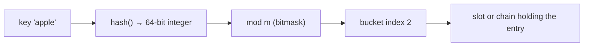
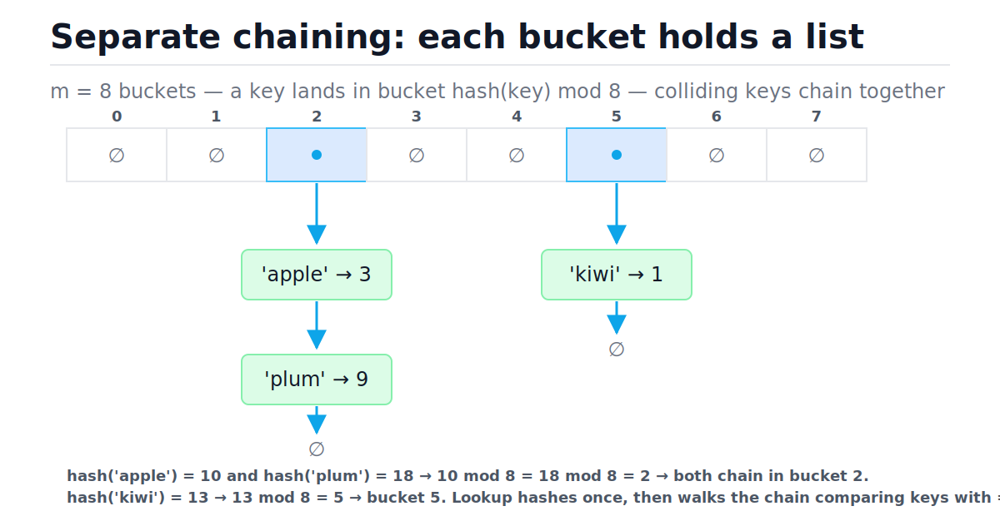
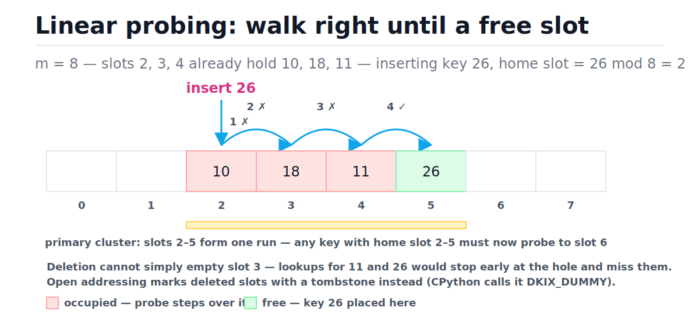
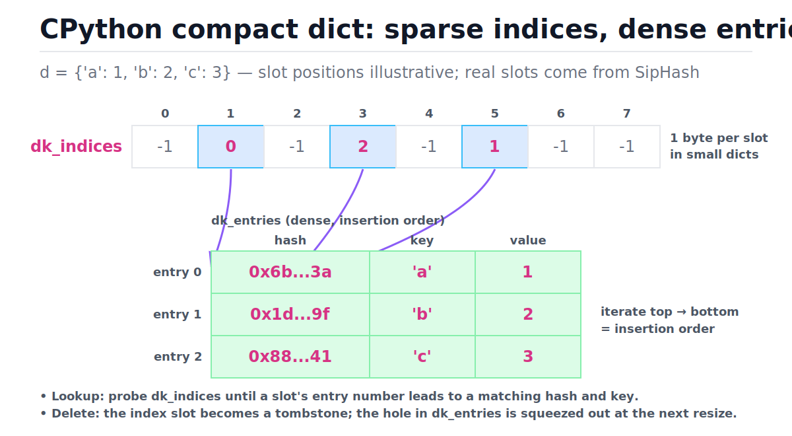

# Hash Tables

[toc]

> **TL;DR:** A hash table turns a key into an array index with a hash function, giving average O(1) lookup, insert, and delete. Collisions are inevitable and are resolved either by chaining (a list per bucket) or open addressing (probe for the next free slot); keeping the load factor low via resizing preserves O(1) amortized cost. Python's `dict` and `set` are open-addressing hash tables with a compact, insertion-ordered layout and a DoS-resistant string hash.

## Vocabulary

These are the load-bearing terms for everything below. Each one maps to a single mechanical idea; if you can define all of them, the rest of the note is just assembly.

**Hash function**

```math
h\colon K \to \{0, 1, \dots, 2^{64}-1\}
```

A deterministic function from arbitrary keys to fixed-size integers. CPython's `hash()` returns a signed 64-bit value on 64-bit builds.

**Bucket (slot)**

```math
i = h(k) \bmod m
```

One cell of the backing array of size m. The modulo (or bitmask, when m is a power of two) folds the huge hash value into a valid index.

**Collision**

```math
h(k_1) \bmod m = h(k_2) \bmod m, \quad k_1 \neq k_2
```

Two distinct keys mapping to the same bucket. Guaranteed to happen by the pigeonhole principle once you have more possible keys than buckets.

**Load factor**

```math
\alpha = \frac{n}{m}
```

The ratio of stored entries n to table slots m. Every performance bound of a hash table is a function of α.

**Separate chaining**

```math
\mathbb{E}[\text{chain length}] = \alpha
```

Collision strategy where each bucket holds a small list of entries. Colliding keys append to the bucket's list.

**Open addressing**

```math
j_0, j_1, j_2, \dots \quad \text{(probe sequence over slots)}
```

Collision strategy where every entry lives in the slot array itself. On collision, a probe sequence visits other slots until a free one is found.

**Linear probing**

```math
j_{t+1} = (j_t + 1) \bmod m
```

The simplest open-addressing probe: step one slot to the right, wrapping around. Cache-friendly but suffers primary clustering.

**Tombstone**

```math
\text{slot state} \in \{\text{empty}, \text{occupied}, \text{deleted}\}
```

A marker left in a deleted open-addressing slot so that probe sequences passing through it keep going instead of stopping early.

**Rehash (resize)**

```math
m' = \text{next power of two} \ge c \cdot n
```

Allocating a bigger table and re-inserting every entry, because each key's bucket index depends on m. O(n) per resize, O(1) amortized per insert.

**Hashable**

```math
a = b \;\Rightarrow\; h(a) = h(b)
```

An object usable as a key: it has a hash that never changes during its lifetime and is consistent with equality. Mutable built-ins (`list`, `dict`, `set`) are not hashable.

## Intuition

An array gives O(1) access — but only by integer index. A hash table buys that same O(1) for arbitrary keys by manufacturing the index: hash the key into a big integer, fold it into the array's range, and store the entry there. Lookup repeats the identical arithmetic and lands on the same slot, so there is no searching at all in the happy path.



The entire engineering of hash tables is damage control around one fact: two keys will eventually map to the same slot. Everything else — chaining, probing, load factors, resizing — exists to keep that damage at O(1) on average.

## How it works

A hash table is three mechanisms composed: key-to-index arithmetic, a collision policy, and a resize policy. Each is simple in isolation; their interaction produces the famous average-O(1) behavior.

### From key to bucket index

The hash function compresses any key into a fixed-width integer; the table then folds that integer into its slot range. With a power-of-two table size, the modulo is a single AND instruction — one reason CPython sizes its tables as powers of two.

```math
i = h(k) \bmod m = h(k) \,\&\, (m - 1) \quad \text{when } m = 2^{c}
```

```python
m = 8                                   # table size (power of two)
key = "alice"
index = hash(key) % m                   # the modulo step
assert 0 <= index < m

# CPython uses a bitmask because m is a power of two:
assert hash(key) % 8 == hash(key) & 7   # same result, one CPU instruction
```

### What makes a good hash function

A hash function for tables needs exactly three properties. **Deterministic:** the same key must always produce the same hash within one process, or you could never find what you stored. **Uniform:** outputs should spread evenly over the integer range, so buckets fill evenly and chains stay short. **Fast:** it runs on every single operation, so it must cost O(len(key)) with a tiny constant — cryptographic strength is not required, only collision resistance against the inputs you expect.

Uniformity is measured against your *real* key distribution, not random data: a hash that mixes random strings well but maps `"user:1"`, `"user:2"`, `"user:3"` to identical buckets is a bad table hash.

### Collision strategy 1 — separate chaining

Chaining makes each bucket the head of a small list. Insert appends to the list at the key's bucket; lookup walks that one list comparing keys for equality. Performance degrades gracefully: a bucket with 3 entries costs 3 comparisons, not a rebuild. The figure shows keys `apple` and `plum` colliding into bucket 2 while `kiwi` sits alone in bucket 5 — note that only the colliding bucket pays extra.



### Building a chaining hash map from scratch

This is the whole data structure in ~40 lines: a list of buckets, the modulo step, a linear scan within one bucket, and a resize when the load factor passes 0.75. Every real implementation — Java's `HashMap`, Go's `map` — is this skeleton plus engineering.

```python
from typing import Any, Optional


class ChainingHashMap:
    """Separate-chaining hash map. Average O(1) get/put/delete."""

    _LOAD_FACTOR_LIMIT = 0.75

    def __init__(self, capacity: int = 8) -> None:
        self._buckets: list = [[] for _ in range(capacity)]
        self._size = 0

    def _index(self, key: Any) -> int:
        return hash(key) % len(self._buckets)      # key -> bucket, O(1)

    def put(self, key: Any, value: Any) -> None:
        bucket = self._buckets[self._index(key)]
        for i, (k, _) in enumerate(bucket):        # scan one chain only
            if k == key:
                bucket[i] = (key, value)           # overwrite existing key
                return
        bucket.append((key, value))
        self._size += 1
        if self._size / len(self._buckets) > self._LOAD_FACTOR_LIMIT:
            self._resize(2 * len(self._buckets))   # O(n), amortized O(1)

    def get(self, key: Any, default: Optional[Any] = None) -> Any:
        for k, v in self._buckets[self._index(key)]:
            if k == key:
                return v
        return default

    def delete(self, key: Any) -> bool:
        bucket = self._buckets[self._index(key)]
        for i, (k, _) in enumerate(bucket):
            if k == key:
                bucket.pop(i)
                self._size -= 1
                return True
        return False

    def __len__(self) -> int:
        return self._size

    def __contains__(self, key: Any) -> bool:
        sentinel = object()
        return self.get(key, sentinel) is not sentinel

    def _resize(self, new_capacity: int) -> None:
        old_buckets = self._buckets                # rehash EVERY entry:
        self._buckets = [[] for _ in range(new_capacity)]
        self._size = 0                             # indices depend on m
        for bucket in old_buckets:
            for k, v in bucket:
                self.put(k, v)


hm = ChainingHashMap()
for i in range(100):
    hm.put("key" + str(i), i * i)
assert len(hm) == 100
assert hm.get("key7") == 49
assert hm.get("missing") is None
assert "key42" in hm
hm.put("key7", -1)                    # overwrite: size must not change
assert hm.get("key7") == -1 and len(hm) == 100
assert hm.delete("key7") is True
assert hm.delete("key7") is False     # second delete finds nothing
assert len(hm) == 99
assert len(hm._buckets) >= 128        # the table grew as load passed 0.75
```

### Collision strategy 2 — open addressing with linear probing

Open addressing stores every entry directly in the slot array: no chains, no per-entry allocation, better cache locality. On collision, linear probing steps right one slot at a time until it finds a free one; lookup retraces exactly the same steps. The cost is **primary clustering** — occupied runs grow, and any key hashing anywhere into a run must walk to its end, making long runs grow even faster. In the figure, watch key 26 bounce off slots 2, 3, 4 before landing in 5.



```python
from typing import Optional


def linear_probe_insert(table: list, key: int) -> int:
    """Insert key; return how many slots were inspected. Average O(1)."""
    m = len(table)
    j = key % m                       # home slot
    probes = 1
    while table[j] is not None:       # occupied -> keep walking right
        j = (j + 1) % m               # primary clustering grows here
        probes += 1
    table[j] = key
    return probes


slots: list = [None] * 8
assert linear_probe_insert(slots, 10) == 1   # home 2, empty -> slot 2
assert linear_probe_insert(slots, 18) == 2   # home 2, taken -> slot 3
assert linear_probe_insert(slots, 11) == 2   # home 3, taken -> slot 4
assert linear_probe_insert(slots, 26) == 4   # home 2 -> 3 -> 4 -> slot 5
assert slots == [None, None, 10, 18, 11, 26, None, None]
```

The trace below replays those four inserts. Notice how each collision extends the cluster, and how the cluster then taxes the next insert even though the keys are unrelated.

| Step | Insert | Home slot (k mod 8) | Probe path | Decision | Table after (slots 0–7) |
| :---: | :---: | :---: | :--- | :--- | :--- |
| 1 | 10 | 2 | 2 | slot 2 empty → place | `– – 10 – – – – –` |
| 2 | 18 | 2 | 2 → 3 | 2 occupied → step right → place at 3 | `– – 10 18 – – – –` |
| 3 | 11 | 3 | 3 → 4 | 3 occupied → step right → place at 4 | `– – 10 18 11 – – –` |
| 4 | 26 | 2 | 2 → 3 → 4 → 5 | three occupied slots → place at 5 | `– – 10 18 11 26 – –` |

> [!WARNING]
> Open addressing cannot delete by simply emptying a slot. Clearing slot 3 above would make lookups for 11 and 26 stop at the hole and report "missing" even though both are present. Deletions must leave a tombstone that probes skip over but inserts may reuse.

### Load factor and resizing

As α climbs, chains lengthen and probe runs merge, so every implementation caps α and resizes past the cap: allocate a bigger power-of-two table, then re-insert every entry, because each index was computed modulo the old m. A single resize costs O(n), but doubling makes the total rehash work over n inserts a geometric series — the same amortization argument as the dynamic arrays in [Arrays and Dynamic Arrays](./02-arrays-and-dynamic-arrays.md).

```math
\text{total rehash work} = n + \frac{n}{2} + \frac{n}{4} + \cdots < 2n \;\Rightarrow\; O(1) \text{ amortized per insert}
```

> [!IMPORTANT]
> Resizing rehashes **everything** — bucket positions are not portable across table sizes. This is also why iteration order in a from-scratch table can change after an insert, and why you must never mutate a dict while iterating it (CPython raises `RuntimeError`).

## Complexity

The headline is average O(1) for point operations, worst case O(n). The average case assumes the hash spreads keys uniformly and the load factor is capped; the worst case is every key colliding into one bucket, which turns the table into a linked list.

| Operation | Best | Average | Worst | Space |
| :--- | :---: | :---: | :---: | ---: |
| Lookup `d[k]` / `k in d` | O(1) | O(1) | O(n) | O(1) |
| Insert (no resize) | O(1) | O(1) | O(n) | O(1) |
| Insert (triggering resize) | O(n) | amortized O(1) | O(n) | O(n) during rehash |
| Delete `del d[k]` | O(1) | O(1) | O(n) | O(1) |
| Iterate all entries | O(n) | O(n) | O(n) | O(1) |
| Resize / rehash all | O(n) | O(n) | O(n) | O(n) |
| Whole structure | — | — | — | O(n) |

The key bound: under uniform hashing with load factor α, expected search cost is constant for both families. Chaining searches one chain of expected length α; open addressing keeps probing with miss probability α per slot, giving a geometric series.

```math
\mathbb{E}[\text{probes}_{\text{chain}}] = 1 + \alpha
\qquad
\mathbb{E}[\text{probes}_{\text{open}}] \le \frac{1}{1 - \alpha}
```

Plug in CPython's cap of α ≤ 2/3: at most 3 expected probes for an unsuccessful open-addressing search. That is the whole reason the cap exists — at α = 0.9 the bound is 10 probes, at α = 0.99 it is 100. The worst case O(n) requires *all* keys to share a bucket, which for a randomized, well-mixed hash is astronomically unlikely by accident; in practice it only happens under adversarial input (see SipHash below) or a broken `__hash__`.

## Memory model in Python

CPython's `dict` is an open-addressing hash table, not a chaining one — and since 3.6 it uses a two-array "compact" layout that made dicts smaller *and* insertion-ordered. The details below are from `Objects/dictobject.c` and explain behavior you can observe from pure Python. For how the objects themselves are laid out on the heap, see [Memory Model and PyObject Layout](../Programming-Languages/Python/13-memory-model-and-pyobject-layout.md).

### Probing with perturbation

Linear probing clusters; CPython avoids that with a recurrence that jumps around the table pseudo-randomly while folding in the not-yet-used high bits of the hash via a `perturb` term. Every probe shifts 5 more hash bits into the sequence, so two keys whose hashes agree in the low bits diverge after a few probes.

```math
j_0 = h \bmod 2^{c}, \qquad
j_{t+1} = (5 j_t + 1 + \text{perturb}_t) \bmod 2^{c}, \qquad
\text{perturb}_{t+1} = \left\lfloor \text{perturb}_t / 32 \right\rfloor
```

The recurrence 5j + 1 mod 2^c is a full-cycle generator: it visits every slot exactly once, so a free slot is always found. The initial perturb is the full hash value, and after enough shifts it reaches zero, leaving the pure cycle.

### The compact layout (3.6+)

Before 3.6, a dict was one sparse array of 3-word entries — two-thirds empty by design, wasting cache and memory. The compact design splits it: `dk_indices`, a sparse array of *small integers* (1 byte each while the table has ≤ 128 slots), and `dk_entries`, a dense array of (hash, key, value) triples appended in insertion order. Probing happens in the tiny index table, which fits in a cache line or two; the payload lives packed in the dense array. In the figure, follow a blue slot's number into the entries array, then read the entries top to bottom.



Iteration just walks `dk_entries` sequentially — which is why dicts preserve insertion order. That started as a side effect of this memory optimization in 3.6 and became a guaranteed language feature in 3.7.

```python
od = {}
od["x"] = 1
od["a"] = 2
od["m"] = 3
assert list(od) == ["x", "a", "m"]      # insertion order, guaranteed 3.7+

weird = {1: "int", 1.0: "float", True: "bool"}
assert len(weird) == 1                  # 1 == 1.0 == True with equal hashes
assert weird[1] == "bool"               # last write wins for the value
assert type(list(weird)[0]) is int      # but the FIRST key object is kept

assert hash(1) == hash(1.0) == hash(True) == 1
```

> [!NOTE]
> Deleting a key marks its index slot as a dummy (tombstone) and leaves a hole in `dk_entries`; the holes are squeezed out at the next resize. So heavy delete/insert churn on a dict periodically pays compaction costs you never see in the API.

### Resize at 2/3 full

A new dict starts with 8 slots, of which only 2/3 (5 entries) are usable before a resize. When fill (live entries plus tombstones) exceeds 2/3 of the slots, CPython allocates the smallest power of two that is at least 3 times the number of *live* entries and rehashes into it — which both grows the table and clears all tombstones. The 2/3 cap is the α that keeps the expected probe count around 3.

### String hashing: SipHash

`hash()` on `str` and `bytes` is not a toy multiply-and-xor: since PEP 456 (Python 3.4) it is SipHash — SipHash-2-4 originally, SipHash-1-3 since 3.11 — keyed with a random 128-bit key generated at interpreter startup. The reason is **hash flooding**: with a predictable string hash, an attacker can send a few thousand crafted keys (HTTP parameter names, JSON fields) that all collide, degrading a server's dict to O(n) per operation and O(n²) overall — a real 2011-class DoS against web frameworks. Integers are different: `hash(n)` is just n reduced modulo the Mersenne prime 2⁶¹ − 1 on 64-bit builds, fast but trivially predictable.

```python
assert hash(2 ** 61) == 1               # ints hash mod 2^61 - 1 (64-bit build)
assert hash(2 ** 61 - 1) == 0
assert hash(-1) == -2                   # -1 is reserved as a C error code
```

> [!CAUTION]
> String hashes are randomized per process: `hash("foo")` differs across runs (controlled by `PYTHONHASHSEED`). Never persist or send `hash()` values, never rely on set/dict ordering derived from string hashes, and use `hashlib` when you need a stable digest.

### The `__hash__` / `__eq__` contract

A dict finds a key by hashing it, probing to slots with equal stored hashes, then confirming with `==`. That works only if equal objects hash equally — and if hashes never change while the object is in a table. Break either rule and entries silently become unreachable. This is exactly why Python makes `list` unhashable: it defines equality by mutable contents.

```python
class UserKey:
    """Equal ids -> equal objects -> equal hashes. Safe as a dict key."""

    def __init__(self, user_id: int) -> None:
        self.user_id = user_id

    def __eq__(self, other: object) -> bool:
        return isinstance(other, UserKey) and other.user_id == self.user_id

    def __hash__(self) -> int:
        return hash(self.user_id)


profile = {UserKey(7): "alice"}
assert profile[UserKey(7)] == "alice"   # a DIFFERENT object finds the entry


class MutableKey:
    def __init__(self, items: list) -> None:
        self.items = items

    def __eq__(self, other: object) -> bool:
        return isinstance(other, MutableKey) and other.items == self.items

    def __hash__(self) -> int:
        return hash(tuple(self.items))  # hash depends on mutable state: BUG


k = MutableKey([1, 2])
d = {k: "reachable"}
assert k in d
k.items.append(3)              # hash changes while the table still files k

# No EQUAL key can find the entry anymore. The new-state key probes by the
# new hash; the old-state key reaches the slot but fails the == check.
assert MutableKey([1, 2, 3]) == k
assert MutableKey([1, 2, 3]) not in d
assert MutableKey([1, 2]) not in d
assert len(d) == 1             # ...yet the entry still occupies memory

try:
    {[1, 2]: "boom"}         # list defines __eq__ and sets __hash__ to None
    raised = False
except TypeError:
    raised = True
assert raised
```

One curiosity: `k in d` with the *same object* may still return True after the mutation, because CPython's lookup compares object identity before comparing hashes. Do not rely on it — identity rescue only works for the exact object, and only if the new hash happens to probe the entry's slot.

> [!IMPORTANT]
> The contract: if `a == b` then `hash(a) == hash(b)`, and an object's hash must never change while it is inside any dict or set. Defining `__eq__` without `__hash__` makes a class unhashable on purpose. Use immutable key types — or `@dataclass(frozen=True)`, which generates a correct pair for you.

### `set`: a dict without values

A `set` is the same machine with the value column deleted: a hash table of keys only, so membership, insertion, and removal are all average O(1). CPython gives sets their own implementation (`Objects/setobject.c`) that probes up to 9 consecutive slots — roughly one cache line — before applying the perturb jump, betting on memory locality.

```python
prices = {"apple": 3, "plum": 9}
assert set(prices) == {"apple", "plum"}      # a set is the key half of a dict

basket = {"apple", "apple", "plum"}          # same engine: hash, probe, resize
assert len(basket) == 2
assert "apple" in basket                     # average O(1), same as dict
assert basket | {"kiwi"} == {"apple", "plum", "kiwi"}
```

## Real-world example

Webhook providers deliver events *at least once*: network retries mean your endpoint will see the same delivery id twice, and processing it twice double-charges a customer. The standard fix is a hash-based idempotency check — a `set` of seen ids — plus a hash-based counter for per-endpoint metrics. Both stay O(1) per event no matter how large the history grows.

```python
from collections import Counter

deliveries = [
    {"id": "evt_001", "endpoint": "/orders"},
    {"id": "evt_002", "endpoint": "/orders"},
    {"id": "evt_001", "endpoint": "/orders"},   # network retry: duplicate
    {"id": "evt_003", "endpoint": "/billing"},
    {"id": "evt_002", "endpoint": "/orders"},   # duplicate again
]

seen = set()                              # idempotency table
counts = Counter()                        # dict subclass: missing -> 0
processed = []
for event in deliveries:
    if event["id"] in seen:               # O(1) average membership test
        continue
    seen.add(event["id"])                 # O(1) average insert
    counts[event["endpoint"]] += 1        # O(1) average upsert
    processed.append(event["id"])

assert processed == ["evt_001", "evt_002", "evt_003"]
assert counts == Counter({"/orders": 2, "/billing": 1})
assert counts.most_common(1) == [("/orders", 2)]
```

> [!TIP]
> Reach for the stdlib before a raw dict dance: `collections.Counter` for counting, `collections.defaultdict(list)` for grouping, `dict.setdefault` for one-off cases. They are the same hash table underneath, with the missing-key branch handled in C. In production the same pattern scales out to Redis — see [Caching Strategies](../System-Design/05-caching-strategies.md).

## The complement lookup pattern

The one-pass complement trick is the single most common "reach for a hash map" moment in interviews. The core idea is that, instead of asking "which earlier element pairs with mine?", you ask "have I seen the value that would complete this pair?" That question has a constant-time answer if you store earlier values in a dict as you go.

The pattern has four steps that must run in this order: compute the complement, check whether it is already in the seen dict, return if it is, and only then save the current value. The order matters — check before save — because saving first allows a number to be its own complement when the target is twice that number.

```python
def two_sum(nums: list, target: int) -> list:
    """One-pass complement lookup. O(n) time, O(n) space."""
    seen: dict = {}                      # value -> index of earlier elements

    for i, num in enumerate(nums):
        complement = target - num

        if complement in seen:           # O(1) average: found the pair
            return [seen[complement], i]

        seen[num] = i                    # save AFTER checking

    raise ValueError("No solution")


assert two_sum([2, 7, 11, 15], 9) == [0, 1]
assert two_sum([3, 2, 4], 6) == [1, 2]
assert two_sum([3, 3], 6) == [0, 1]    # duplicate: first 3 saved before second checks
```

> [!IMPORTANT]
> The invariant that makes correctness airtight: before processing index i, `seen` contains only values at indices strictly less than i. This guarantees that any complement found has a different index, and it is precisely why checking before saving handles duplicate values correctly.

**O(n) vs O(n²) — why it matters at scale.** Brute force enumerates every pair:

```math
\text{pair count} = \frac{n(n-1)}{2} \approx \frac{n^2}{2}
```

At n = 10,000 that is roughly 50 million comparisons. The hash map version does n iterations with one membership check and at most one insert each — about 10,000 operations. The hash map trades O(n) extra memory for a factor-of-n speed improvement.

| Approach | Time | Extra space |
| :--- | :---: | :---: |
| Brute force (nested loops) | O(n squared) | O(1) |
| Sort + two pointers | O(n log n) | O(n) |
| Hash map, one pass | O(n) average | O(n) |

**When to recognize this pattern.** Reach for complement lookup when: you can compute the missing partner directly from the current element; you only need to know whether that partner appeared before the current index; and the problem allows O(n) extra memory. It generalises well beyond Two Sum — prefix-sum subarray targets, pair-count problems, and frequency-based lookups all follow the same skeleton.

## When to use / When NOT to use

Hash tables are the default answer to "have I seen this before?" and "what's associated with this key?". Knowing when they are the *wrong* default is what separates a memorized answer from a real one.

**Use a hash table when:**

- You need exact-key lookup, insertion, deletion in average O(1) — caches, indexes, symbol tables, deduplication, frequency counts.
- You can trade memory for speed: a table at α = 2/3 deliberately keeps a third of its slots empty.
- A one-pass O(n) solution exists by remembering complements or prior state — the complement lookup pattern in this note and [Two Sum](../Leetcode/1-two-sum.md).

**Avoid a hash table when:**

- You need range queries, ordering, or "closest key" — hashing destroys order by design; use a sorted structure ([BSTs and balanced trees](./07-binary-search-trees-and-balanced-trees.md)) or sorted array + [Binary Search](./23-binary-search.md).
- You need prefix queries over strings — that is a [trie](./13-tries-prefix-trees.md).
- Keys are dense small integers 0..n — a plain list is faster, smaller, and perfectly ordered.
- You need worst-case guarantees (hard real-time): a resize pause or adversarial collisions can spike a single operation to O(n).

## Common mistakes

- **"Hash table lookups are O(1), full stop"** — they are *average* O(1) under uniform hashing with bounded load factor; the worst case is O(n), and inserts are only *amortized* O(1) because of resizes.
- **"I can use a list as a dict key if I'm careful"** — Python refuses (`TypeError: unhashable type`) because any mutation after insertion strands the entry under a stale hash. Convert to `tuple` or `frozenset`.
- **"Defining `__eq__` is enough for my key class"** — defining `__eq__` sets `__hash__` to `None`, making instances unhashable until you define a consistent `__hash__` too.
- **"`hash()` is stable, I'll store it in the database"** — string hashes are randomized per process (SipHash + random seed). Use `hashlib.sha256` for stable digests.
- **"Deleting from an open-addressing table just empties the slot"** — that breaks every probe chain passing through it; you must leave a tombstone, and tombstones are why delete-heavy tables still need periodic rehashes.
- **"I'll add keys to the dict while looping over it"** — CPython raises `RuntimeError: dictionary changed size during iteration`, because a resize would invalidate the iterator's position. Collect changes and apply after the loop, or iterate over `list(d)`.
- **"Iteration order is random"** — not since 3.7: dicts iterate in insertion order, guaranteed. (Sets, however, make no order promise.)

## Interview questions and answers

Hash tables are the most-used structure in interviews — both as the topic and as the tool. These are the questions that actually come up, with answers in the register you would say out loud.

**1. Why is hash table lookup O(1) on average but O(n) worst case?**
Setup: the canonical warm-up; they want the assumptions behind the headline number.
**Answer:** Lookup is constant because we compute the index arithmetically instead of searching. That holds as long as the hash spreads keys uniformly and the load factor is capped, so each bucket holds O(1) entries in expectation. Worst case, every key collides into one bucket and the table degenerates into a linked list — O(n). It's rare in practice because runtime hashes are randomized and well-mixed, so you only hit it with adversarial input or a broken `__hash__`.

**2. Chaining versus open addressing — tradeoffs?**
Setup: tests whether you know both families and can reason about constants, not just Big-O.
**Answer:** Chaining is simpler, degrades gracefully past load factor 1, and deletion is trivial — but every entry is a separate allocation and chains scatter across the heap, so it's cache-unfriendly. Open addressing keeps everything in one array — better locality, no per-entry allocation — but needs tombstones for deletion, suffers clustering, and falls off a cliff as α approaches 1, so it must resize earlier. CPython chose open addressing and caps α at 2/3.

**3. What is a load factor and why does Python resize at 2/3?**
Setup: connects the math to a concrete engineering decision.
**Answer:** Load factor α is entries over slots. For open addressing, expected probes for a miss is about 1/(1−α): at 2/3 that's 3 probes; at 0.9 it's 10. Two-thirds is the chosen balance point between memory waste and probe count. When fill passes it, CPython rehashes into the smallest power of two at least 3 times the live entry count, which also clears tombstones.

**4. Why does inserting n items still count as O(1) per insert if resizes are O(n)?**
Setup: the amortized-analysis question, identical to dynamic array doubling.
**Answer:** Each resize doubles capacity, so resize costs form a geometric series: n + n/2 + n/4 + ... which is under 2n total for n inserts. Spread over n operations that's constant per insert — amortized O(1). Any single insert can still pay O(n); that's the difference between amortized and worst case, and it matters for tail latency.

**5. Why do Python dicts preserve insertion order?**
Setup: a CPython-internals favorite; distinguishes users from people who know the machine.
**Answer:** Since 3.6 a dict is two arrays: a sparse index table of small integers, and a dense entries array that's appended in insertion order. Probing happens in the index table; iteration just walks the dense array front to back, so you get insertion order for free. It was a memory optimization — the sparse part shrank to one byte per slot for small dicts — and the ordering became a language guarantee in 3.7.

**6. What's the contract between `__hash__` and `__eq__`, and why can't lists be keys?**
Setup: the correctness question behind every custom-key bug.
**Answer:** Equal objects must have equal hashes, and an object's hash must never change while it's in a table — lookup probes by hash first, then confirms with equality. A list's equality depends on its mutable contents, so its hash would have to change on mutation, stranding any entry filed under the old hash. Python sets `list.__hash__` to `None` instead. For custom keys: hash only immutable fields, keep `__eq__` consistent, or just use a frozen dataclass.

**7. What is hash flooding and how does Python defend against it?**
Setup: the security angle — increasingly common for backend roles.
**Answer:** If string hashes are predictable, an attacker crafts thousands of keys that all collide — say HTTP parameter names — and every insert into your request dict becomes O(n), so parsing one request is O(n²). It was a real DoS class against web frameworks in 2011. Python's defense is SipHash, a keyed pseudorandom hash for strings and bytes, seeded randomly per process, so an attacker can't precompute collisions without the key.

**8. Design a hash map from scratch — what are the pieces?**
Setup: the implementation question; they want structure, not perfect code.
**Answer:** An array of m buckets; index = hash(key) mod m. Pick a collision policy — I'd start with chaining for simple deletes. Put scans the target bucket and overwrites on key match, else appends. Track size, and when size/m passes about 0.75, allocate double and rehash every entry, since indices depend on m. Get and delete scan one bucket. Average O(1) everywhere, O(n) resize amortized away. If asked for open addressing, I'd add probe sequences and tombstones for deletion.

## Practice path

Drills ordered to build the muscle from mechanics to patterns. Do them in sequence; each adds one idea.

1. Re-implement `ChainingHashMap` from memory, including the resize. Verify with the asserts above.
2. Add tombstone-based deletion to the `linear_probe_insert` table — confirm that lookups still find keys past a deleted slot.
3. Solve [Two Sum](../Leetcode/1-two-sum.md) with a one-pass complement dict; review the complement lookup pattern in the section above until the invariant is automatic.
4. First duplicate in a stream using a `set` — the idempotency pattern from the real-world example.
5. Group anagrams: map `tuple(sorted(word))` → list of words; note why the key must be a tuple, not a list.
6. LRU cache: a dict for O(1) lookup plus a doubly linked list for O(1) eviction order — combine this note with [Linked Lists](./03-linked-lists.md).

## Copyable takeaways

- A hash table = hash function + index fold (`h(k) mod m`) + collision policy + resize policy.
- Average O(1) lookup/insert/delete; worst case O(n); inserts are amortized O(1) because doubling resizes form a geometric series.
- Chaining: list per bucket, graceful degradation, easy deletes. Open addressing: everything in one array, cache-friendly, needs tombstones, must cap α earlier.
- Load factor α = n/m drives everything; expected probes ≈ 1/(1−α) for open addressing — hence CPython's 2/3 resize threshold.
- CPython dict: open addressing with perturb-based probing, compact two-array layout since 3.6 → insertion order guaranteed since 3.7, SipHash for strings (per-process random seed).
- Key contract: `a == b` ⇒ `hash(a) == hash(b)`, and hashes must be immutable while keyed — which is why lists can't be keys.
- A `set` is a dict without the value column: same engine, same O(1) membership.

## Sources

- CLRS, *Introduction to Algorithms* (4th ed.), ch. 11 "Hash Tables" — chaining and open-addressing analysis, the 1/(1−α) bound.
- Python docs — `object.__hash__` contract: https://docs.python.org/3/reference/datamodel.html#object.__hash__
- Python docs — mapping types: https://docs.python.org/3/library/stdtypes.html#mapping-types-dict
- CPython wiki — operation costs: https://wiki.python.org/moin/TimeComplexity
- CPython source — `Objects/dictobject.c` (probe recurrence, 2/3 threshold, growth rate) and `Objects/dictnotes.txt`: https://github.com/python/cpython/blob/main/Objects/dictobject.c
- Raymond Hettinger, "More compact dictionaries with faster iteration" (python-dev, 2012): https://mail.python.org/pipermail/python-dev/2012-December/123028.html
- PEP 456 — Secure and interchangeable hash algorithm (SipHash): https://peps.python.org/pep-0456/
- Aumasson & Bernstein, "SipHash: a fast short-input PRF" (2012): https://www.aumasson.jp/siphash/siphash.pdf

## Related

- [Big-O Notation and Complexity Analysis](./01-big-o-notation-and-complexity-analysis.md)
- [Arrays and Dynamic Arrays](./02-arrays-and-dynamic-arrays.md)
- [Linked Lists](./03-linked-lists.md)
- [Memory Model and PyObject Layout](../Programming-Languages/Python/13-memory-model-and-pyobject-layout.md)
- [Two Sum](../Leetcode/1-two-sum.md)
