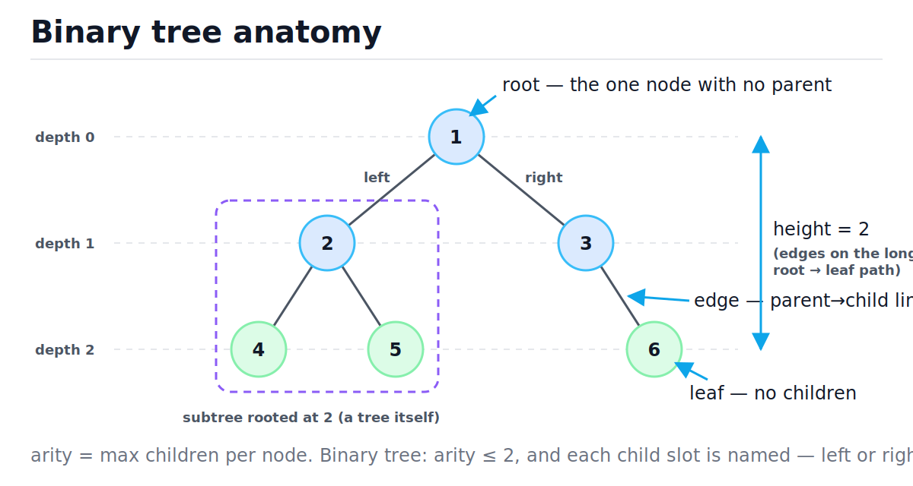
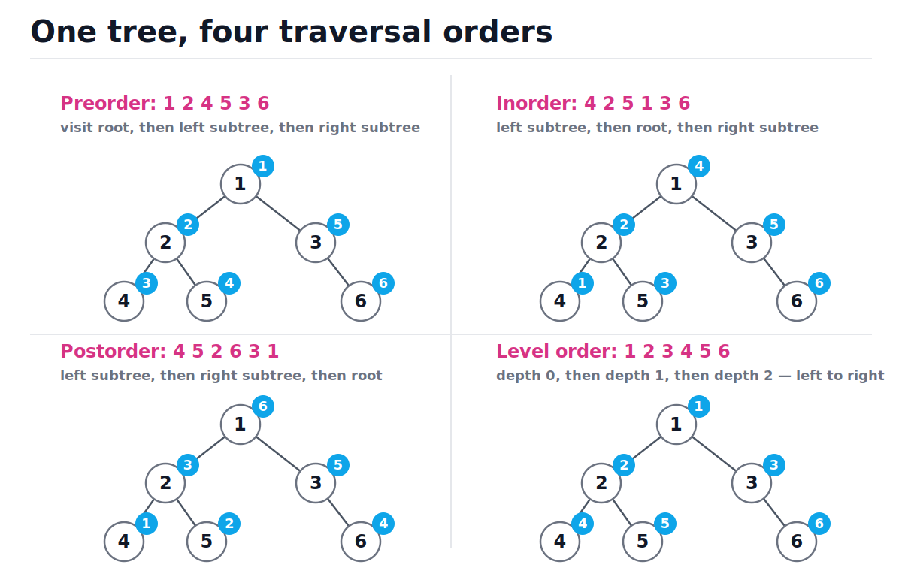
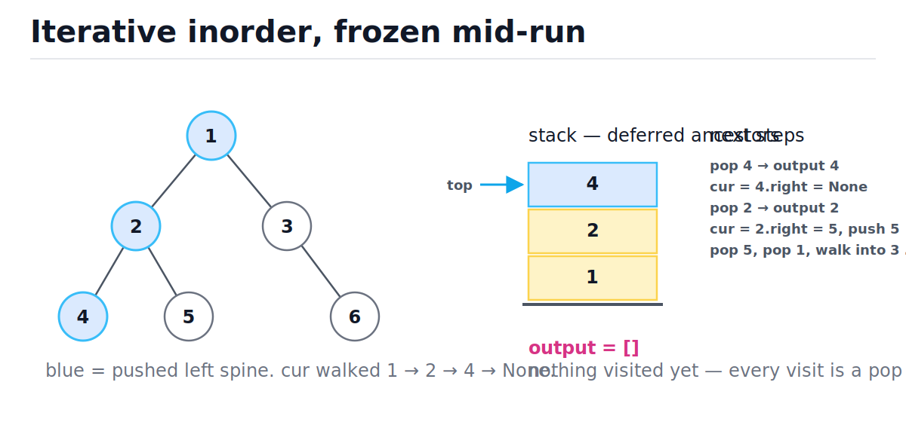
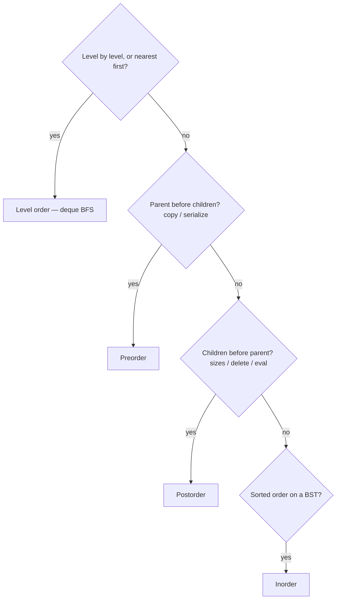

# Trees and Binary Trees

[toc]

> **TL;DR:** A tree is a linked structure with one root, no cycles, and exactly one path from the root to any node — a binary tree caps each node at two named children, left and right. Everything you do to a tree reduces to one question: in what order do you visit the nodes? The four answers — preorder, inorder, postorder, level order — are all O(n) time, and differ only in whether the bookkeeping is a stack (depth-first, O(h) space) or a queue (breadth-first, O(w) space).

## Vocabulary

Every term below is load-bearing for the rest of the note. Tree terminology is where interviews quietly check precision — depth versus height trips up more candidates than any algorithm. Each entry: the term, its canonical notation, one plain definition.

**Root**

```math
\text{root}(T)
```

The unique node with no parent. Every other node is reachable from it by exactly one path.

**Edge**

```math
(u, v), \quad u = \text{parent}(v)
```

A parent-to-child link. A tree with n nodes always has exactly n − 1 edges.

**Leaf**

```math
\text{children}(v) = \varnothing
```

A node with no children. The recursion's base case lives here.

**Depth**

```math
\text{depth}(v) = \#\,\text{edges on the path root} \to v
```

Distance *down from the root*. The root has depth 0. A property of a node.

**Height**

```math
h(v) = \max_{\text{leaf } \ell \in T_v} \big(\#\,\text{edges } v \to \ell\big)
```

Distance *down to the deepest leaf*. A leaf has height 0; the empty tree has height −1 by convention. A property of a subtree. The height of the tree is h(root).

**Subtree**

```math
T_v
```

The node v together with all of its descendants. The reason recursion works on trees: every child pointer is the root of a smaller tree of the same shape.

**Arity**

```math
k = \max_{v} |\text{children}(v)|
```

Maximum number of children any node may have. File systems and JSON are n-ary; a *binary* tree fixes k ≤ 2.

**Binary tree**

```math
\text{children}(v) \subseteq \{\text{left}(v), \text{right}(v)\}
```

A tree of arity ≤ 2 where the two child slots are *named*. A node with only a right child is different from a node with only a left child — order matters.

**Width**

```math
w(d) = |\{v : \text{depth}(v) = d\}|, \qquad w_{\max} = \max_d w(d)
```

Number of nodes at one depth. Caps the queue size during level-order traversal.

> [!IMPORTANT]
> Depth counts edges *from the root down to a node*; height counts edges *from a node down to its deepest leaf*. Some books count nodes instead of edges (off by one). State your convention out loud in an interview — this note counts edges everywhere.

## Intuition

Picture a family org chart hung upside down: one CEO at the top (the root), reporting lines fanning downward (edges), individual contributors at the bottom (leaves). Two facts make trees special among linked structures. First, no cycles and no sharing — each node has exactly one parent, so there is exactly one path from the root to anywhere. Second, self-similarity — chop off any node and what hangs below it is again a tree. That second fact is why almost every tree algorithm is four lines of recursion.

The figure below labels every anatomical term on the six-node tree used throughout this note. Note that node 3 has a right child but no left child — legal, and it makes this tree neither full nor complete, which matters later.



## How it works

Every algorithm in this section runs on the same tree: 1 at the root, 2 and 3 below it, 4 and 5 under 2, and 6 as the right child of 3. All four traversals visit all n nodes exactly once — O(n) time — and differ only in *order* and in *which container remembers the pending work*. Depth-first orders use a stack (implicit call stack or explicit list); breadth-first uses a queue.

### The TreeNode class

A binary tree node is just a value and two optional child references. There is no parent pointer by default — you almost never need one, because traversals carry context down via recursion or a stack. The builder reconstructs our example tree on demand so each demo starts fresh.

```python
from typing import List, Optional


class TreeNode:
    def __init__(self, val: int,
                 left: "Optional[TreeNode]" = None,
                 right: "Optional[TreeNode]" = None) -> None:
        self.val = val
        self.left = left
        self.right = right


def build_example() -> TreeNode:
    """      1
           /   \
          2     3
         / \     \
        4   5     6     """
    return TreeNode(1,
                    left=TreeNode(2, left=TreeNode(4), right=TreeNode(5)),
                    right=TreeNode(3, right=TreeNode(6)))


t = build_example()
assert t.val == 1 and t.left.val == 2 and t.right.right.val == 6
assert t.left.left.left is None and t.left.left.right is None   # 4 is a leaf
```

### The four orders at a glance

The three depth-first orders are one algorithm with the *visit* moved around: before both children (pre), between them (in), or after both (post). Level order is a different animal — it sweeps depth by depth. Study the figure until you can produce all four orders for this tree from memory; every order below is verified in code right after.



### Recursive preorder, inorder, postorder

The recursive versions are identical except for where `out.append` sits relative to the two child calls. That single line position is the entire difference between copying a tree (pre), reading a BST in sorted order (in), and deleting a tree safely (post). Each is O(n) time and O(h) implicit stack space.

```python
def preorder(root: Optional[TreeNode]) -> List[int]:
    out: List[int] = []
    def walk(node: Optional[TreeNode]) -> None:
        if node is None:
            return
        out.append(node.val)        # visit BEFORE children
        walk(node.left)
        walk(node.right)
    walk(root)
    return out


def inorder(root: Optional[TreeNode]) -> List[int]:
    out: List[int] = []
    def walk(node: Optional[TreeNode]) -> None:
        if node is None:
            return
        walk(node.left)
        out.append(node.val)        # visit BETWEEN children
        walk(node.right)
    walk(root)
    return out


def postorder(root: Optional[TreeNode]) -> List[int]:
    out: List[int] = []
    def walk(node: Optional[TreeNode]) -> None:
        if node is None:
            return
        walk(node.left)
        walk(node.right)
        out.append(node.val)        # visit AFTER children
    walk(root)
    return out


t = build_example()
assert preorder(t) == [1, 2, 4, 5, 3, 6]
assert inorder(t) == [4, 2, 5, 1, 3, 6]
assert postorder(t) == [4, 5, 2, 6, 3, 1]
```

### Iterative preorder — explicit stack

Recursion is just a stack you do not see. To make preorder iterative, push the root, then loop: pop, visit, push right child *first* so the left child comes off the stack first. Same O(n) time, but now the O(h) space is an explicit Python list you control — no recursion limit.

```python
def preorder_iter(root: Optional[TreeNode]) -> List[int]:
    if root is None:
        return []
    out: List[int] = []
    stack: List[TreeNode] = [root]
    while stack:
        node = stack.pop()
        out.append(node.val)
        if node.right:
            stack.append(node.right)    # pushed first, popped last
        if node.left:
            stack.append(node.left)
    return out


assert preorder_iter(build_example()) == [1, 2, 4, 5, 3, 6]
```

### Iterative inorder — the classic explicit-stack pattern

Inorder is the one iterative traversal worth memorizing cold. The loop has two moves: *slide* — walk left from `cur`, pushing every node, until you fall off the tree; *harvest* — pop, visit, then step into the popped node's right subtree and slide again. The stack always holds exactly the ancestors whose own visit is deferred until their left side finishes.

```python
def inorder_iter(root: Optional[TreeNode]) -> List[int]:
    out: List[int] = []
    stack: List[TreeNode] = []
    cur = root
    while stack or cur:
        while cur:                  # slide down the left spine
            stack.append(cur)
            cur = cur.left
        cur = stack.pop()           # deepest deferred node
        out.append(cur.val)         # visit
        cur = cur.right             # then its right subtree
    return out


assert inorder_iter(build_example()) == [4, 2, 5, 1, 3, 6]
```

The figure freezes the run right after the first slide: 1, 2, 4 are on the stack, nothing is in the output yet, and the very next pop produces the leftmost node.



Full trace on the example tree — stack shown bottom→top:

| Step | cur after action | Stack | Action | Output so far |
| :--- | :---: | :---: | :--- | :--- |
| 1 | 2 | 1 | push 1, slide left | — |
| 2 | 4 | 1 2 | push 2, slide left | — |
| 3 | None | 1 2 4 | push 4, slide left → None | — |
| 4 | None | 1 2 | pop 4, visit, cur = 4.right | 4 |
| 5 | 5 | 1 | pop 2, visit, cur = 2.right | 4 2 |
| 6 | None | 1 5 | push 5, slide left → None | 4 2 |
| 7 | None | 1 | pop 5, visit, cur = 5.right | 4 2 5 |
| 8 | 3 | — | pop 1, visit, cur = 1.right | 4 2 5 1 |
| 9 | None | 3 | push 3, slide left → None | 4 2 5 1 |
| 10 | 6 | — | pop 3, visit, cur = 3.right | 4 2 5 1 3 |
| 11 | None | 6 | push 6, slide left → None | 4 2 5 1 3 |
| 12 | None | — | pop 6, visit, cur = None → done | 4 2 5 1 3 6 |

### Iterative postorder — explicit stack

True one-stack postorder needs a "have I finished the right child yet?" check, which is fiddly. The production trick: run a *modified preorder* that visits root → right → left, then reverse the output. Reversing root-right-left gives left-right-root, which is exactly postorder. Two passes, still O(n) time, O(h) stack plus the O(n) output you were building anyway.

```python
def postorder_iter(root: Optional[TreeNode]) -> List[int]:
    if root is None:
        return []
    out: List[int] = []
    stack: List[TreeNode] = [root]
    while stack:
        node = stack.pop()
        out.append(node.val)
        if node.left:                   # left pushed first ...
            stack.append(node.left)
        if node.right:                  # ... so RIGHT pops first
            stack.append(node.right)
    return out[::-1]                    # reverse(root,right,left) = postorder


assert postorder_iter(build_example()) == [4, 5, 2, 6, 3, 1]
```

> [!TIP]
> Interviewers accept the reversed-modified-preorder trick — it is the idiom practitioners actually use. If they insist on single-pass, keep a `last_visited` pointer and only visit a node once its right child equals `last_visited`.

### Level order — BFS with a deque

Level order swaps the stack for a FIFO queue: dequeue a node, visit it, enqueue its children. First-in-first-out guarantees depth d empties before depth d+1 starts. Use `collections.deque` — `popleft()` is O(1), while `list.pop(0)` shifts every remaining element for O(n) per dequeue and O(n²) total.

```python
from collections import deque


def level_order(root: Optional[TreeNode]) -> List[int]:
    if root is None:
        return []
    out: List[int] = []
    q: "deque[TreeNode]" = deque([root])
    while q:
        node = q.popleft()
        out.append(node.val)
        if node.left:
            q.append(node.left)
        if node.right:
            q.append(node.right)
    return out


assert level_order(build_example()) == [1, 2, 3, 4, 5, 6]
```

> [!TIP]
> To group output *by level* (LeetCode 102), snapshot `len(q)` at the top of the outer loop and drain exactly that many nodes in an inner loop — everything in the queue at that instant is one complete level.

Queue trace on the example tree:

| Step | Dequeued | Enqueued | Queue after | Output so far |
| :--- | :---: | :---: | :---: | :--- |
| 1 | 1 | 2, 3 | 2 3 | 1 |
| 2 | 2 | 4, 5 | 3 4 5 | 1 2 |
| 3 | 3 | 6 | 4 5 6 | 1 2 3 |
| 4 | 4 | — | 5 6 | 1 2 3 4 |
| 5 | 5 | — | 6 | 1 2 3 4 5 |
| 6 | 6 | — | — | 1 2 3 4 5 6 |

### Choosing a traversal

Each order has one canonical job. Preorder reaches a parent before its children, so it can *reconstruct* — copying and serialization. Postorder finishes children before the parent, so it can *aggregate* — sizes, heights, safe deletion. Inorder is meaningless on an arbitrary binary tree but yields sorted order on a BST. Level order answers anything phrased "per level" or "nearest first".



### Tree shapes — full, complete, perfect, balanced

These four adjectives constrain *shape*, and shape is what controls h — which controls your stack space and, for BSTs, your search time. Our example tree fails the first three tests (node 3 has exactly one child) but passes the balance test.

| Shape | Definition | Our 6-node tree? | What it buys you |
| :--- | :--- | :---: | :--- |
| **Full** (proper) | Every node has 0 or 2 children — never exactly 1 | No — node 3 has one child | Internal/leaf counting identities |
| **Complete** | Every level full except possibly the last, which fills left → right with no gaps | No — depth 2 is 4, 5, gap, 6 | Stores as a flat array, no pointers — the heap layout |
| **Perfect** | All leaves at the same depth, every internal node has 2 children | No | Exact node-count formulas below |
| **Balanced** (height-) | At every node, left and right subtree heights differ by ≤ 1 | Yes | Guarantees h = O(log n) |

Perfect trees make the level-doubling arithmetic exact. With L levels (so height L − 1 in edges), each level d holds 2^d nodes:

```math
n = \sum_{d=0}^{L-1} 2^{d} = 2^{L} - 1 \qquad\Longleftrightarrow\qquad L = \log_2(n + 1)
```

Two corollaries you will reuse constantly: about half of a perfect tree's nodes are leaves (2^(L−1) = (n+1)/2), and height grows only logarithmically — a perfect tree of one million nodes is just 20 levels tall.

> [!NOTE]
> *Complete* is the load-bearing word behind [heaps](./08-heaps-and-priority-queues.md): a complete tree maps to a flat array with children of index i at 2i+1 and 2i+2, no pointers at all. *Balanced* is the load-bearing word behind [AVL and red-black trees](./07-binary-search-trees-and-balanced-trees.md).

### Recursion patterns — height, count, mirror, same-tree

Almost every tree problem is one template: handle `None`, recurse on both children, combine. Train yourself to ask only "what does the subtree return upward?" — height returns a number, mirror returns a rebuilt subtree, same-tree returns a boolean ANDed across the structure. All four are O(n) time, O(h) stack.

```python
def height(root: Optional[TreeNode]) -> int:
    if root is None:
        return -1                       # empty tree: -1, so a leaf gets 0
    return 1 + max(height(root.left), height(root.right))


def count(root: Optional[TreeNode]) -> int:
    if root is None:
        return 0
    return 1 + count(root.left) + count(root.right)


def mirror(root: Optional[TreeNode]) -> Optional[TreeNode]:
    if root is None:
        return None
    root.left, root.right = mirror(root.right), mirror(root.left)
    return root


def same(a: Optional[TreeNode], b: Optional[TreeNode]) -> bool:
    if a is None and b is None:
        return True
    if a is None or b is None:
        return False
    return a.val == b.val and same(a.left, b.left) and same(a.right, b.right)


t = build_example()
assert height(t) == 2 and height(None) == -1 and height(TreeNode(9)) == 0
assert count(t) == 6
assert same(t, build_example())

mirror(t)                               # in-place flip
assert preorder(t) == [1, 3, 6, 2, 5, 4]
assert not same(t, build_example())
assert same(mirror(t), build_example())  # flip back — mirror is an involution
```

### Serialization — preorder plus null markers

A bare value list cannot reconstruct a tree — `[1, 2, 3]` could be a dozen shapes. Record *where the gaps are* and the ambiguity vanishes: emit preorder, writing a sentinel `#` for every `None`. Deserialization replays the exact same recursion, consuming one token per call. Both directions are O(n) time and O(n) space. This is LeetCode 297, and it is how you would checkpoint a tree to disk or ship it over the network.

```python
def serialize(root: Optional[TreeNode]) -> str:
    out: List[str] = []
    def walk(node: Optional[TreeNode]) -> None:
        if node is None:
            out.append("#")             # the gap IS information
            return
        out.append(str(node.val))
        walk(node.left)
        walk(node.right)
    walk(root)
    return " ".join(out)


def deserialize(data: str) -> Optional[TreeNode]:
    tokens = iter(data.split())
    def build() -> Optional[TreeNode]:
        tok = next(tokens)
        if tok == "#":
            return None
        node = TreeNode(int(tok))
        node.left = build()             # consumes exactly the left subtree
        node.right = build()
        return node
    return build()


t = build_example()
s = serialize(t)
assert s == "1 2 4 # # 5 # # 3 # 6 # #"
assert same(deserialize(s), t)          # round-trip rebuilds the exact shape
```

## Complexity

Every traversal touches each node exactly once and does O(1) work per touch, so time is O(n) across the board — the interesting column is *space*, which is where DFS and BFS genuinely differ. See [Big-O Notation](./01-big-o-notation-and-complexity-analysis.md) for the notation itself.

| Operation | Time best | Time average | Time worst | Extra space |
| :--- | :---: | :---: | :---: | :--- |
| Preorder / inorder / postorder (recursive) | O(n) | O(n) | O(n) | O(h) call stack |
| Preorder / inorder / postorder (explicit stack) | O(n) | O(n) | O(n) | O(h) list |
| Level order (deque BFS) | O(n) | O(n) | O(n) | O(w) queue, up to ~n/2 |
| height / count / mirror / same-tree | O(n) | O(n) | O(n) | O(h) call stack |
| serialize / deserialize | O(n) | O(n) | O(n) | O(n) output + O(h) stack |
| Search a value (no ordering invariant) | O(1) | O(n) | O(n) | O(h) |

The time bound follows from the structure of the recursion — at each node the work splits over disjoint subtrees plus constant local work:

```math
T(n) = T(n_L) + T(n_R) + O(1), \qquad n_L + n_R = n - 1 \;\Rightarrow\; T(n) = O(n)
```

Space is governed by the height for DFS and the width for BFS:

```math
h_{\text{balanced}} = O(\log_2 n), \qquad h_{\text{degenerate}} = n - 1, \qquad w_{\max} \le \left\lceil \tfrac{n}{2} \right\rceil
```

Why: a DFS stack never holds more than one root-to-leaf path, so it peaks at h + 1 entries — about 20 for a balanced million-node tree, but a full million for a linked-list-shaped one. A BFS queue holds up to one entire level; in a perfect tree the bottom level alone contains (n+1)/2 nodes, so BFS on a bushy tree costs O(n) memory no matter how shallow it is. Rule of thumb: deep-and-narrow favors BFS memory, shallow-and-wide favors DFS memory.

## Memory model in Python

A `TreeNode` is a full CPython heap object. With a plain class, each instance carries a PyObject header plus a `__dict__` for attributes — roughly 48 bytes for the instance and another ~100 for its dict, so a million-node tree costs on the order of 150 MB before counting the value objects. Adding `__slots__` stores `val`, `left`, `right` as three fixed pointer slots inline, killing the per-instance dict and roughly tripling density. Details on object headers live in [Memory Model and PyObject Layout](../Programming-Languages/Python/13-memory-model-and-pyobject-layout.md).

```python
import sys


class SlimNode:
    __slots__ = ("val", "left", "right")

    def __init__(self, val: int,
                 left: "Optional[SlimNode]" = None,
                 right: "Optional[SlimNode]" = None) -> None:
        self.val = val
        self.left = left
        self.right = right


plain, slim = TreeNode(1), SlimNode(1)
plain_total = sys.getsizeof(plain) + sys.getsizeof(plain.__dict__)
assert sys.getsizeof(slim) < plain_total          # slots kill the per-node dict
```

The deeper cost is *pointer chasing*. Unlike an array, child nodes are allocated wherever the heap had room, so every `node.left` dereference is a potentially-random memory access — a cache miss costing ~100 ns versus ~1 ns for the next element of a contiguous list. This is exactly the same physics as [linked lists](./03-linked-lists.md), and it is why complete trees in performance-sensitive code (heaps, segment trees) are stored as flat arrays instead of node objects.

Recursion has a hard ceiling too. CPython refuses to recurse past `sys.getrecursionlimit()` — default 1000 — because each Python call also consumes real C stack. A degenerate tree (every node has only a right child) of a few thousand nodes will crash any recursive traversal. The iterative versions shrug: their stack is a heap-allocated list bounded only by RAM.

```python
spine = TreeNode(0)                     # degenerate: a 5000-deep right spine
node = spine
for i in range(1, 5000):
    node.right = TreeNode(i)
    node = node.right

assert sys.getrecursionlimit() <= 5000  # default is 1000
assert preorder_iter(spine) == list(range(5000))    # iterative: fine
# preorder(spine) would raise RecursionError at the default limit
```

> [!WARNING]
> Recursive traversals are correct on paper and crash in production the first time someone feeds you a degenerate tree — sorted-order inserts into a naive BST produce exactly that shape. If tree depth is attacker- or data-controlled, write the iterative version. Raising the limit with `sys.setrecursionlimit` just trades a clean `RecursionError` for a possible interpreter crash.

## Real-world example

A cloud-storage service needs per-folder usage for its billing page. The file system is an n-ary tree: directories hold children, files hold bytes. A folder's total is its own bytes plus its children's totals — children must be finished before the parent, which is the definition of a postorder aggregation. One pass, O(n) time, O(h) stack.

```python
from typing import Dict, List, Optional


class FsNode:
    def __init__(self, name: str, size: int = 0,
                 children: "Optional[List[FsNode]]" = None) -> None:
        self.name = name
        self.size = size                # own bytes; 0 for directories
        self.children: List[FsNode] = children or []


def usage_report(root: FsNode) -> Dict[str, int]:
    """Total bytes per directory/file, computed bottom-up (postorder)."""
    totals: Dict[str, int] = {}

    def walk(node: FsNode) -> int:
        subtotal = node.size + sum(walk(c) for c in node.children)
        totals[node.name] = subtotal    # children already summed
        return subtotal

    walk(root)
    return totals


home = FsNode("home", children=[
    FsNode("photos", children=[
        FsNode("trip.raw", size=24_000_000),
        FsNode("cat.jpg", size=2_000_000),
    ]),
    FsNode("docs", children=[FsNode("resume.pdf", size=80_000)]),
    FsNode("notes.txt", size=4_000),
])

report = usage_report(home)
assert report["photos"] == 26_000_000
assert report["docs"] == 80_000
assert report["home"] == 26_084_000
assert max(report, key=lambda name: report[name]) == "home"
```

The same skeleton powers `du -sh`, IDE project indexers, DOM layout passes (a node's size depends on its children's sizes), and compiler expression evaluation (operands before operators). When you see "value of parent depends on values of children," say postorder.

## When to use / when NOT to use

Trees earn their pointer overhead when the data *is* a hierarchy or when an ordering invariant will be layered on top. They are the wrong default for flat data.

**Use a tree when:**

- The domain is hierarchical: file systems, org charts, JSON/XML/DOM, comment threads, parse trees.
- You will add an invariant: ordered keys → [BSTs](./07-binary-search-trees-and-balanced-trees.md), min/max access → [heaps](./08-heaps-and-priority-queues.md), shared prefixes → [tries](./13-tries-prefix-trees.md).
- You need "process children before parents" or "nearest level first" semantics.

**Avoid a tree when:**

- The data is a flat sequence — a [dynamic array](./02-arrays-and-dynamic-arrays.md) is cache-friendly and simpler.
- You only need exact-key lookup — a [hash table](./05-hash-tables.md) is O(1) average with none of the shape worry.
- Nodes can have multiple parents or cycles — that is a [graph](./09-graphs-bfs-and-dfs.md); tree traversals without a visited-set will loop forever.

## Common mistakes

- **"Depth and height are the same thing"** — depth is measured from the root *down to a node*; height is from a node *down to its deepest leaf*. They only coincide in degenerate cases, and mixing them breaks balance proofs.
- **"Recursive traversal is O(1) space"** — the call stack is real memory: O(h) frames, which is O(n) on a degenerate tree. Iterative versions move the same cost into an explicit list; only Morris traversal genuinely achieves O(1).
- **"Complete and full mean the same"** — full forbids one-child nodes; complete is about packing levels left-to-right. A tree can be either without the other.
- **"BFS and DFS cost the same memory"** — DFS holds one root-to-leaf path, O(h); BFS holds a whole level, up to ~n/2 nodes. On a wide bushy tree BFS can need five orders of magnitude more memory.
- **"A binary tree gives O(log n) search"** — only a *balanced search* tree does. A plain binary tree has no ordering invariant, so search is O(n); an unbalanced BST degrades to O(n) too.
- **"Serializing values is enough to rebuild the tree"** — without null markers (or a second traversal order), one value list matches many shapes. Preorder *plus* `#` sentinels is unambiguous.

## Interview questions and answers

A short paragraph of setup, then the answer the way you would say it across the table. These seven cover ~90% of what gets asked about plain binary trees.

**1. What's the difference between the depth of a node and the height of a tree?**

**Answer:** Depth counts edges from the root down to the node, so the root is depth 0. Height counts edges from a node down to its deepest leaf, so a leaf is height 0 and the tree's height is the root's height. I'd also flag that some textbooks count nodes instead of edges, so I'd confirm the convention before using it in a proof.

**2. Why is inorder traversal special for binary search trees?**

**Answer:** A BST puts smaller keys in the left subtree and larger in the right. Inorder visits left, node, right — so it emits the keys in exactly sorted order. That gives a one-line validity check: inorder the tree and verify the sequence is strictly increasing. On a non-BST inorder is just one of three arbitrary DFS orders.

**3. How do you traverse a tree without recursion, and why would you bother?**

**Answer:** Replace the call stack with an explicit list. Preorder: push root, then pop-visit-push right-push left. Inorder: slide down the left spine pushing everything, pop to visit, then move into the right child. The reason to bother is Python's recursion limit — about a thousand frames by default — so any tree deeper than that, like a degenerate BST, crashes the recursive version while the iterative one just grows a list on the heap.

**4. Compare the space complexity of DFS and BFS on a tree.**

**Answer:** DFS is O(h) — it only remembers the current root-to-leaf path. BFS is O(w), the widest level, which is up to about n/2 in a bushy tree. So for a balanced tree DFS holds ~log n nodes while BFS can hold half the tree. Flip it for a degenerate spine: BFS's queue stays at one node while DFS's stack holds all n. Shape decides.

**5. Define full, complete, and perfect binary trees.**

**Answer:** Full means no node has exactly one child — zero or two only. Complete means every level is packed except possibly the last, which fills left to right with no gaps — that's what lets heaps live in a flat array with children at 2i+1 and 2i+2. Perfect means complete and full with all leaves at one depth, which forces exactly 2^L − 1 nodes for L levels. Perfect implies the other two; neither converse holds.

**6. How would you check whether two binary trees are identical, and how does mirroring work?**

**Answer:** Recurse in lockstep: two Nones are equal; one None or unequal values means not equal; otherwise AND the recursion on left-with-left and right-with-right. Mirroring is the same skeleton with a swap — exchange left and right at every node on the way back up. Both are O(n) time, O(h) stack. Symmetry checking is the cute hybrid: compare the tree against itself with the recursion crossed, left-with-right.

**7. How do you serialize a binary tree, and why does preorder with null markers suffice?**

**Answer:** Walk preorder and emit each value, writing a sentinel like `#` whenever a child is None. Deserialization runs the same recursion: take the next token, return None on a sentinel, otherwise make the node and build left then right. It works because the sentinels pin down exactly where every subtree ends, so the token stream has a unique parse. Without them you'd need two traversal orders, and even inorder-plus-preorder breaks with duplicate values.

## Practice path

Drill in this order — each step assumes the muscle memory of the previous one.

1. Hand-build the six-node example tree with `TreeNode` and write all four traversals recursively from a blank file; verify against the orders in the figure.
2. Re-derive the `inorder_iter` trace table on paper, stack column included; then write iterative preorder and the reversed-trick postorder from memory and check them against the recursive outputs.
3. LeetCode 104 (maximum depth) and 222 (count nodes) — pure return-a-number recursion.
4. LeetCode 226 (invert), 100 (same tree), 101 (symmetric) — the lockstep pattern and its crossed variant.
5. LeetCode 102 (level order by level) — the `len(q)` snapshot trick.
6. LeetCode 94 and 145 — iterative inorder and postorder under interview conditions, 15 minutes each.
7. LeetCode 297 (serialize/deserialize) and 543 (diameter) — combining serialization with postorder-style height passing.

## Copyable takeaways

- A tree: one root, n − 1 edges, exactly one root-to-any-node path; every child pointer roots a smaller tree, which is why recursion is the native idiom.
- Depth = edges from root down to node; height = edges from node down to deepest leaf; empty tree has height −1, a leaf 0. Say your convention out loud.
- All four traversals are O(n) time; pre/in/post differ only in where the visit sits relative to the child recursions. Space is the real differentiator: DFS = O(h) (one path), BFS = O(w) (one level, up to ~n/2) — shape decides the winner.
- Iterative inorder = slide down the left spine pushing, pop to visit, step right, repeat. Iterative postorder = preorder visiting root-right-left, then reverse. BFS = `collections.deque`; `list.pop(0)` turns it O(n²).
- Perfect tree: n = 2^L − 1 nodes for L levels, so L = log₂(n + 1) — a million nodes is only 20 levels.
- CPython: default recursion limit ~1000 kills recursive traversal on degenerate trees; `__slots__` on node classes cuts memory roughly 3×; pointer chasing makes node trees cache-hostile versus flat arrays.
- Match traversal to job: preorder = copy/serialize, postorder = aggregate/delete, inorder = sorted (BST only), level order = per-level/nearest-first.

## Sources

- Cormen, Leiserson, Rivest, Stein — *Introduction to Algorithms* (CLRS), 4th ed., §10.3 "Representing rooted trees" and Ch. 12 "Binary Search Trees" (traversal definitions).
- Sedgewick & Wayne — *Algorithms*, 4th ed., §3.2 (binary tree anatomy and traversal).
- Knuth — *The Art of Computer Programming*, Vol. 1, §2.3 "Trees" (origin of preorder/inorder/postorder terminology).
- Python docs — `collections.deque`: https://docs.python.org/3/library/collections.html#collections.deque
- Python docs — `sys.setrecursionlimit` / `sys.getrecursionlimit`: https://docs.python.org/3/library/sys.html#sys.setrecursionlimit
- Python docs — `__slots__`: https://docs.python.org/3/reference/datamodel.html#slots

## Related

- [Stacks and Queues](./04-stacks-and-queues.md) — the two containers behind DFS and BFS.
- [Binary Search Trees and Balanced Trees](./07-binary-search-trees-and-balanced-trees.md) — add the ordering invariant.
- [Heaps and Priority Queues](./08-heaps-and-priority-queues.md) — complete trees as flat arrays.
- [Graphs, BFS, and DFS](./09-graphs-bfs-and-dfs.md) — the same traversals when cycles appear.
- [Recursion and Divide and Conquer](./10-recursion-and-divide-and-conquer.md) — the template behind every tree function.
- [Memory Model and PyObject Layout](../Programming-Languages/Python/13-memory-model-and-pyobject-layout.md) — what a `TreeNode` really costs.
