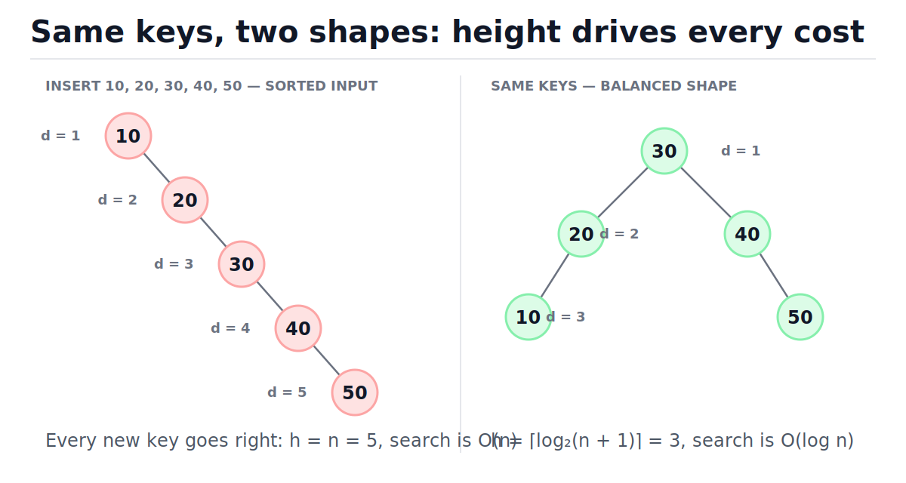
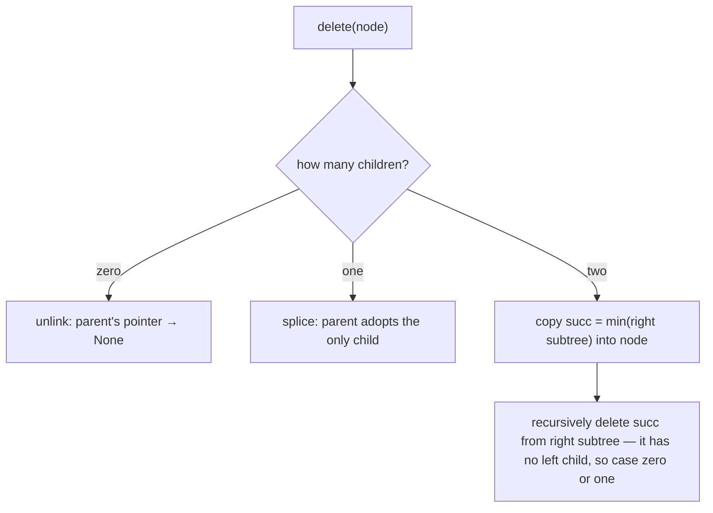
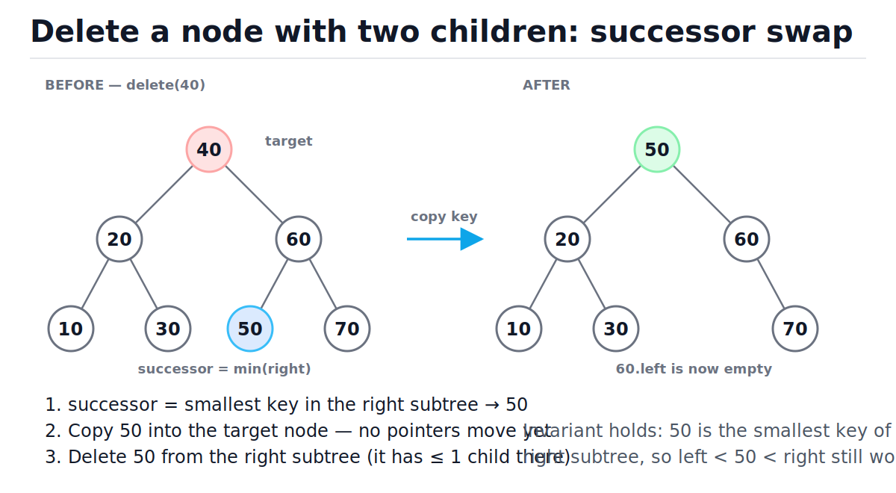
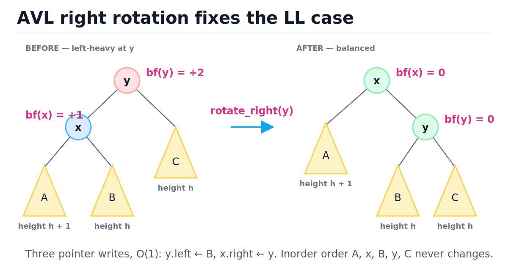

# Binary Search Trees and Balanced Trees

[toc]

> **TL;DR:** A binary search tree (BST) keeps keys ordered so that search, insert, delete, min/max, and floor/ceil all cost O(h), where h is the tree height. On random input h ≈ log₂ n, but sorted input degrades a plain BST into an O(n) chain — which is why production trees self-balance (AVL, red-black) and databases use the disk-friendly generalization, the B-tree.

## Vocabulary

Nine terms carry this whole note. Each follows the same pattern: the symbol or defining formula first, then what it means in plain words.

**BST invariant**

```math
\forall v:\quad \max\big(\text{keys}(L_v)\big) \;<\; k_v \;<\; \min\big(\text{keys}(R_v)\big)
```

Every key in node v's *entire* left subtree is smaller than v's key, and every key in its entire right subtree is larger. Not just the immediate children — the whole subtree. This single rule is what makes one comparison at each node enough to discard half the remaining tree.

**Height**

```math
h(v) = 1 + \max\big(h(L_v),\, h(R_v)\big), \qquad h(\varnothing) = 0
```

The number of nodes on the longest path from a node down to a leaf. Every core BST operation walks one root-to-leaf path, so every cost in this note is some function of h.

**Degenerate tree**

```math
h = n
```

A BST where every node has at most one child — structurally a linked list. Produced by inserting keys in sorted (or reverse-sorted) order. All O(h) operations become O(n).

**Inorder successor**

```math
\text{succ}(v) = \min(R_v) \quad \text{when } R_v \neq \varnothing
```

The next-larger key after v in sorted order. When v has a right subtree, the successor is the leftmost node of that subtree — and crucially, it never has a left child, which is what makes two-children deletion work.

**Balance factor**

```math
\text{bf}(v) = h(L_v) - h(R_v)
```

How lopsided a node is: positive means left-heavy, negative means right-heavy. AVL trees store the height in each node so bf is an O(1) read instead of an O(n) recomputation.

**Rotation**

```math
\text{rotateRight}:\quad y\big(x(A, B),\, C\big) \;\longmapsto\; x\big(A,\, y(B, C)\big)
```

A local O(1) restructuring — three pointer writes — that lowers one side of a subtree and raises the other while preserving inorder order. Rotations are the only tool balanced trees need.

**AVL tree**

```math
\forall v:\; |\text{bf}(v)| \le 1 \quad\Longrightarrow\quad h \le 1.4405\,\log_2(n+2)
```

A BST that restores the balance-factor invariant after every insert/delete using at most two rotations per insert. The strictest practical balance: height never exceeds ~1.44× the optimal.

**Red-black tree**

```math
h \le 2\,\log_2(n+1)
```

A BST with a looser, color-based balance rule. Slightly taller than AVL, but needs fewer rotations per update — which is why most standard libraries chose it.

**B-tree of order m**

```math
\lceil m/2 \rceil \;\le\; \text{children}(v) \;\le\; m
```

The BST idea generalized to nodes holding many keys, with each node sized to one disk page. Trees of height 3–4 index billions of rows. This is what your database index actually is.

## Intuition

Think of a BST as a frozen binary search. [Binary search](./23-binary-search.md) halves a sorted array by comparing against the middle; a BST bakes those middles into pointers, so the "array" can also absorb inserts and deletes without shifting elements. Each comparison at a node discards an entire subtree, exactly like discarding half the array.

The catch: binary search is only fast because the midpoint splits the data evenly. A BST only splits evenly if its shape happens to be bushy. The figure below shows the same five keys stored two ways — sorted insertion order produces a chain where "discarding a subtree" discards nothing, while a balanced shape gives the log₂ behavior you wanted.



> [!IMPORTANT]
> Every BST bound in this note is O(h), not O(log n). The two are only equal when something — luck or a balancing algorithm — keeps h near log₂ n. Quoting "BST search is O(log n)" without that caveat is the classic interview miss.

## How it works

All five core operations are the same walk: compare the target with the current key, go left or right, repeat. They differ only in what they do when the walk ends. We build them up in order, then break the structure on purpose, then fix it with rotations.

### Search

Start at the root. If the key matches, done. If the target is smaller, the invariant guarantees it can only live in the left subtree, so go left; otherwise go right. One node visited per level: O(h) time, O(1) space iteratively.

```python
from typing import Optional

class Node:
    __slots__ = ("key", "left", "right")

    def __init__(self, key: int) -> None:
        self.key = key
        self.left: Optional["Node"] = None
        self.right: Optional["Node"] = None

def search(root: Optional[Node], key: int) -> Optional[Node]:
    while root is not None and root.key != key:
        root = root.left if key < root.key else root.right
    return root                       # None means absent — O(h), O(1) space

# hand-built tree:        40
#                        /  \
#                      20    60
#                     / \    / \
#                   10  30  50  70
root = Node(40)
root.left, root.right = Node(20), Node(60)
root.left.left, root.left.right = Node(10), Node(30)
root.right.left, root.right.right = Node(50), Node(70)

assert search(root, 30) is root.left.right
assert search(root, 41) is None
```

### Min, max, floor, ceil

The smallest key is the leftmost node; the largest is the rightmost — just keep walking one direction. Floor (largest key ≤ x) is more interesting: every time you find a key below the target you record it as the best candidate *so far* and go right hoping for something closer; every time the key is too big you go left. Hash tables cannot answer floor/ceil at all — this family of ordered queries is the whole reason BSTs exist alongside [hash tables](./05-hash-tables.md).

```python
def subtree_min(node: Node) -> Node:
    while node.left is not None:
        node = node.left
    return node                       # O(h)

def subtree_max(node: Node) -> Node:
    while node.right is not None:
        node = node.right
    return node                       # O(h)

def floor_key(root: Optional[Node], key: int) -> Optional[int]:
    """Largest stored key <= key, or None if all keys are bigger."""
    best: Optional[int] = None
    node = root
    while node is not None:
        if node.key == key:
            return key
        if node.key < key:
            best = node.key           # candidate; closer ones live right
            node = node.right
        else:
            node = node.left
    return best                       # O(h), O(1) space

assert subtree_min(root).key == 10 and subtree_max(root).key == 70
assert floor_key(root, 41) == 40
assert floor_key(root, 70) == 70
assert floor_key(root, 9) is None
```

Trace of `floor_key(root, 41)` on the tree above — note how `best` only improves when we step right:

| Step | Node | Comparison | best | Decision |
| :---: | :---: | :--- | :---: | :--- |
| 1 | 40 | 40 < 41 | 40 | candidate found, go right |
| 2 | 60 | 60 > 41 | 40 | too big, go left |
| 3 | 50 | 50 > 41 | 40 | too big, go left |
| 4 | None | — | 40 | walk ended, return 40 |

### Insert

Search for the key; the walk falls off the tree exactly where the new node belongs, so attach it there. Recursion makes the re-linking clean: each call returns the (possibly new) subtree root and the parent reassigns its child pointer. O(h) time, O(h) call-stack space.

```python
def insert(root: Optional[Node], key: int) -> Node:
    if root is None:
        return Node(key)              # fell off the tree: this is the spot
    if key < root.key:
        root.left = insert(root.left, key)
    elif key > root.key:
        root.right = insert(root.right, key)
    return root                       # duplicates silently ignored

def height(node: Optional[Node]) -> int:
    if node is None:
        return 0
    return 1 + max(height(node.left), height(node.right))

chain: Optional[Node] = None
for k in [10, 20, 30, 40, 50]:        # sorted input — the worst case
    chain = insert(chain, k)
assert height(chain) == 5             # h == n: a linked list in disguise
```

> [!WARNING]
> Sorted or nearly-sorted input is not a rare adversarial case — it is the *common* case. Timestamps, auto-increment IDs, and log sequence numbers all arrive in order, and each one lands as the new rightmost node. A plain BST fed production keys quietly becomes an O(n) linked list.

### Delete: three cases

Deletion is the only operation with real structure. Find the node by the usual walk, then split on how many children it has. Leaf: unlink it. One child: splice the child into the node's place (the invariant still holds — the whole subtree was already on the correct side). Two children: you cannot just remove the node without orphaning a subtree, so *replace its key* with the inorder successor — the minimum of the right subtree — then delete that successor from the right subtree. The successor never has a left child, so its own deletion is guaranteed to be a case-1 or case-2 delete.



The figure shows the two-children case end to end: 40 is the target, 50 is the successor pulled up from the right subtree, and the invariant survives because 50 was by construction the smallest key bigger than everything on the left.



```python
def delete(root: Optional[Node], key: int) -> Optional[Node]:
    if root is None:
        return None                   # key absent: no-op
    if key < root.key:
        root.left = delete(root.left, key)
    elif key > root.key:
        root.right = delete(root.right, key)
    else:
        if root.left is None:         # case 0 and case 1 (right child)
            return root.right
        if root.right is None:        # case 1 (left child)
            return root.left
        succ = subtree_min(root.right)        # case 2: two children
        root.key = succ.key                   # overwrite key, keep node
        root.right = delete(root.right, succ.key)  # succ: <= 1 child
    return root                       # O(h) time, O(h) stack
```

### Inorder traversal yields sorted order

Visit left subtree, then the node, then the right subtree — the invariant guarantees this emits keys in ascending order, every time, for any tree shape. This gives you a free correctness oracle: after any sequence of inserts and deletes, `inorder(t)` must equal the sorted key set. It is also how "give me everything in range [lo, hi]" works in O(h + k) — walk down to lo, then traverse in order until you pass hi.

```python
def inorder(root: Optional[Node]) -> list[int]:
    out: list[int] = []
    stack: list[Node] = []
    node = root
    while stack or node is not None:
        while node is not None:       # dive left as far as possible
            stack.append(node)
            node = node.left
        node = stack.pop()
        out.append(node.key)          # visit, then move right
        node = node.right
    return out                        # O(n) time, O(h) stack

t: Optional[Node] = None
for k in [40, 20, 60, 10, 30, 50, 70]:
    t = insert(t, k)
assert inorder(t) == [10, 20, 30, 40, 50, 60, 70]   # sorted, always

t = delete(t, 40)                     # two children: successor 50 moves up
assert t is not None and t.key == 50
assert inorder(t) == [10, 20, 30, 50, 60, 70]

t = delete(t, 10)                     # case 0: leaf unlinked
assert inorder(t) == [20, 30, 50, 60, 70]

t = delete(t, 60)                     # case 1: spliced, 70 moves up
assert inorder(t) == [20, 30, 50, 70]
```

### Validating a BST: the min/max bounds pattern

The classic trap: checking only `left.key < node.key < right.key` at each node. That validates parent-child pairs, not subtrees — a grandchild can violate an ancestor it never directly touches. The correct pattern threads an allowed `(lo, hi)` window down the recursion: going left tightens the upper bound to the current key, going right tightens the lower bound.

```python
def is_bst(root: Optional[Node],
           lo: float = float("-inf"),
           hi: float = float("inf")) -> bool:
    if root is None:
        return True
    if not (lo < root.key < hi):      # bound inherited from ALL ancestors
        return False
    return (is_bst(root.left, lo, root.key)
            and is_bst(root.right, root.key, hi))   # O(n) time, O(h) stack

good = insert(insert(insert(None, 30), 20), 40)
assert is_bst(good)

bad = Node(30)                        # every parent-child pair looks fine:
bad.left = Node(20)                   #   20 < 30  ok
bad.left.right = Node(35)             #   35 > 20  ok ... but 35 > root 30!
assert not is_bst(bad)
```

> [!IMPORTANT]
> The invariant constrains entire subtrees, so validation must too. The node 35 above sits in the root's *left* subtree while being bigger than the root — invisible to any check that only compares neighbors. If your validator passes `bad`, it is wrong.

### Why balance matters: AVL trees and the four rotations

AVL trees (Adelson-Velsky & Landis, 1962) store each node's height and demand |bf| ≤ 1 everywhere. An insert can push exactly one ancestor to bf = ±2, and there are only four ways that happens, named by where the new key landed relative to that ancestor: LL (left child's left), RR (right child's right), LR (left child's right), RL (right child's left). LL and RR need one rotation; LR and RL first rotate the child to *convert* the kink into LL/RR, then rotate the ancestor — two rotations total.

The figure shows the LL repair. Watch three things: x rises and y falls; subtree B (keys between x and y) swaps parents from x to y; and the left-to-right reading order A, x, B, y, C is identical before and after — rotations never disturb sorted order.



```python
from typing import Optional

class AVLNode:
    __slots__ = ("key", "left", "right", "height")

    def __init__(self, key: int) -> None:
        self.key = key
        self.left: Optional["AVLNode"] = None
        self.right: Optional["AVLNode"] = None
        self.height = 1               # stored so bf() is an O(1) read

def h(n: Optional[AVLNode]) -> int:
    return n.height if n is not None else 0

def bf(n: AVLNode) -> int:
    return h(n.left) - h(n.right)

def fix_height(n: AVLNode) -> None:
    n.height = 1 + max(h(n.left), h(n.right))

def rotate_right(y: AVLNode) -> AVLNode:
    x = y.left
    assert x is not None              # only called when left-heavy
    y.left = x.right                  # subtree B changes parent: y adopts it
    x.right = y
    fix_height(y)                     # y first — it is now x's child
    fix_height(x)
    return x                          # x is the new subtree root, O(1)

def rotate_left(x: AVLNode) -> AVLNode:
    y = x.right
    assert y is not None
    x.right = y.left
    y.left = x
    fix_height(x)
    fix_height(y)
    return y

def avl_insert(root: Optional[AVLNode], key: int) -> AVLNode:
    if root is None:
        return AVLNode(key)
    if key < root.key:
        root.left = avl_insert(root.left, key)
    elif key > root.key:
        root.right = avl_insert(root.right, key)
    else:
        return root                   # duplicate: ignore
    fix_height(root)
    balance = bf(root)
    if balance > 1 and root.left is not None:
        if key < root.left.key:               # LL: one right rotation
            return rotate_right(root)
        root.left = rotate_left(root.left)    # LR: left on child, then
        return rotate_right(root)             #     right on root
    if balance < -1 and root.right is not None:
        if key > root.right.key:              # RR: one left rotation
            return rotate_left(root)
        root.right = rotate_right(root.right)  # RL: right on child, then
        return rotate_left(root)               #     left on root
    return root                       # O(log n) guaranteed

def all_balanced(n: Optional[AVLNode]) -> bool:
    if n is None:
        return True
    return abs(bf(n)) <= 1 and all_balanced(n.left) and all_balanced(n.right)

avl: Optional[AVLNode] = None
for k in range(1, 16):                # 15 sorted keys — plain-BST poison
    avl = avl_insert(avl, k)
assert avl is not None and avl.height == 4   # perfectly bushy: log2(16)
assert all_balanced(avl)
```

The same sorted stream that built a height-5 chain in the plain BST builds a height-4 perfect tree here: the rotations absorb the skew as it appears, one O(1) repair per insert.

### Red-black trees: properties and intuition only

Red-black trees enforce balance through node colors rather than exact heights. You will almost never implement one (the delete rebalancing has a notorious case explosion), but you should know the rules and why they work, because this is the tree inside most language runtimes.

The five properties:

1. Every node is red or black.
2. The root is black.
3. Every NIL leaf counts as black.
4. A red node never has a red child — no two reds in a row on any path.
5. Every path from a node down to its NIL leaves crosses the same number of black nodes (the *black-height*).

Intuition for the height bound: property 5 says all paths have equal black length; property 4 says reds can at most alternate with blacks, so the longest possible path (alternating red-black) is at most twice the shortest (all black). Hence h ≤ 2 log₂(n + 1) — looser than AVL's 1.44×, but rebalancing needs at most 2 rotations per insert and 3 per delete, often just recoloring.

> [!NOTE]
> A red-black tree is exactly a 2-3-4 tree (a B-tree of order 4) flattened into binary form — a red child is a key living in the same conceptual node as its parent. This is also the tree behind C++ `std::map`, Java `TreeMap`, and the Linux kernel's `rb_node` used across schedulers and memory management.

### B-trees: the BST idea, sized for disk pages

On disk, the unit of I/O is a page (4–16 KB), and one page fetch costs ~100 µs on SSD — millions of CPU cycles. A binary node per page wastes almost the entire page on one comparison's worth of data. B-trees fix the arithmetic: pack hundreds of sorted keys into each node, do an in-memory binary search within the node, and make each page fetch eliminate 99.5% of the data instead of 50%. With fanout m, height is log_m(n) — for m = 500, a billion keys fit in a tree of height 4, so any lookup costs at most 4 page reads (fewer with caching). Every serious database index works this way; see [Indexes and Query Performance](../Relational-Databases-and-Data-Modeling/05-indexes-and-query-performance.md).

## Complexity

One table for everything in this note. The "balanced" column is what AVL and red-black trees guarantee in the worst case — that guarantee, not the average case, is the entire reason they exist.

| Operation | Average (random order) | Worst (degenerate) | Balanced (AVL/RB) | Extra space |
| :--- | :---: | :---: | :---: | :---: |
| search / contains | O(log n) | O(n) | O(log n) | O(1) iterative |
| insert | O(log n) | O(n) | O(log n) | O(h) recursive stack |
| delete | O(log n) | O(n) | O(log n) | O(h) recursive stack |
| min / max | O(log n) | O(n) | O(log n) | O(1) |
| floor / ceil | O(log n) | O(n) | O(log n) | O(1) |
| inorder traversal | O(n) | O(n) | O(n) | O(h) stack |
| validate (is_bst) | O(n) | O(n) | O(n) | O(h) stack |
| range query [lo, hi], k hits | O(h + k) | O(n) | O(log n + k) | O(h) |
| one rotation | O(1) | O(1) | O(1) | O(1) |
| build from n inserts | O(n log n) | O(n²) | O(n log n) | — |
| B-tree search (fanout m) | — | — | O(log_m n) page reads | — |

The key bound is the AVL height guarantee. Let N(h) be the *fewest* nodes an AVL tree of height h can have: the root plus a worst-allowed pair of subtrees of heights h−1 and h−2. That recurrence is Fibonacci in disguise:

```math
\begin{aligned}
N(h) &= N(h-1) + N(h-2) + 1, \qquad N(0) = 0,\; N(1) = 1 \\
N(h) &= F(h+2) - 1 \;\ge\; \frac{\varphi^{h+2}}{\sqrt{5}} - 2, \qquad \varphi = \tfrac{1+\sqrt{5}}{2} \\
n \ge N(h) \;&\Longrightarrow\; h \;\le\; \log_\varphi\!\big(\sqrt{5}\,(n+2)\big) - 2 \;\approx\; 1.4405\,\log_2(n+2) - 1.33
\end{aligned}
```

In words: even the *most lopsided legal* AVL tree still grows exponentially in nodes per unit height, so the height of any n-node AVL tree is pinned to ~1.44 log₂ n. Compare the floor for any binary tree, h ≥ ⌈log₂(n+1)⌉ — AVL is within 44% of unbeatable. The same style of argument gives red-black trees their 2 log₂(n+1) bound via black-height.

## Memory model in Python

A CPython BST is a graph of heap objects connected by pointers (see [Memory Model and PyObject Layout](../Programming-Languages/Python/13-memory-model-and-pyobject-layout.md)). Each `Node` is its own allocation, and each `left`/`right` hop is a dependent pointer load — the CPU cannot prefetch it, so a tree walk is a chain of potential cache misses. Contrast an array-based structure where neighbors share 64-byte cache lines. This is why a Python-level BST loses badly to `bisect` on a plain list for read-heavy workloads, even at identical Big-O.

`__slots__` matters for node classes: it replaces the per-instance `__dict__` (a whole separate hash table per node) with fixed C-struct-like offsets, roughly halving memory per node and removing one pointer indirection per attribute access.

```python
import sys

class SlimNode:
    __slots__ = ("key", "left", "right")
    def __init__(self, key: int) -> None:
        self.key, self.left, self.right = key, None, None

class FatNode:                        # no __slots__: dict per instance
    def __init__(self, key: int) -> None:
        self.key, self.left, self.right = key, None, None

slim, fat = SlimNode(1), FatNode(1)
assert not hasattr(slim, "__dict__")  # fixed layout, no dict allocation
assert hasattr(fat, "__dict__")       # extra dict object per node
assert sys.getsizeof(slim) < sys.getsizeof(fat) + sys.getsizeof(fat.__dict__)
```

> [!CAUTION]
> CPython's default recursion limit is 1000 frames. Recursive insert/delete on a degenerate BST of a few thousand sequential keys raises `RecursionError` in production, not in your unit tests with 20 nodes. Either write the hot paths iteratively or guarantee balance. See [Recursion and Divide and Conquer](./10-recursion-and-divide-and-conquer.md).

> [!TIP]
> Python ships no balanced tree. The production idioms are: `bisect.insort` on a list (O(n) insert but brutally cache-friendly — fine to ~10⁵ items), or the `sortedcontainers` package, whose `SortedList`/`SortedDict` use a B-tree-like list-of-lists and beat C red-black trees in practice. Hand-rolled trees are for interviews, not services. In Java/C++ reach for `TreeMap` / `std::map` directly.

## Real-world example

Point-in-time restore: backup workers snapshot a database on independent schedules, so snapshot timestamps arrive out of order. An incident hits at time T and you need the latest snapshot taken *at or before* T. That is exactly `floor(T)` — an ordered query a hash map cannot answer without scanning every key. O(log n) per lookup in a balanced tree versus O(n) per scan.

```python
import bisect

# Snapshot timestamps arrive out of order (parallel workers).
snapshots = [1718060400, 1718010000, 1718096400, 1717960800, 1718031600]

snap_tree: Optional[Node] = None
for ts in snapshots:
    snap_tree = insert(snap_tree, ts)         # O(log n) average each

incident_at = 1718060000                      # "what state were we in?"
restore_from = floor_key(snap_tree, incident_at)
assert restore_from == 1718031600             # latest snapshot <= incident

# Production-Python equivalent: sorted list + binary search.
ordered = sorted(snapshots)
i = bisect.bisect_right(ordered, incident_at) - 1
assert i >= 0 and ordered[i] == restore_from
```

The same floor/ceil pattern appears in consistent-hashing rings (find the next server clockwise from a key's hash), rate limiters (oldest event inside the window), and order books (best bid ≤ limit price).

## When to use / when NOT to use

Use an ordered tree (or its Python stand-ins) when:

- You need **order queries**: floor/ceil, predecessor/successor, min/max, k-th smallest, "all keys in [lo, hi]" — hash tables cannot do any of these.
- The data **mutates** under you: a sorted array answers the same queries via [binary search](./23-binary-search.md) but pays O(n) per insert/delete.
- You need **sorted iteration** at any moment without a separate O(n log n) sort.
- You need worst-case guarantees: balanced trees have no O(n) blowup analogous to hash-collision floods.

Do **not** use one when:

- You only ever do exact-key get/put — a [hash table](./05-hash-tables.md) is O(1) average and simpler.
- The data is built once, queried many times — sort an array once, then `bisect`; better cache behavior, less memory.
- You only need min (or max), never arbitrary order queries — a [heap](./08-heaps-and-priority-queues.md) is simpler with O(1) peek.
- The data lives on disk — that is B-tree territory (your database already has one).

## Common mistakes

- **"Checking each node against its children validates the BST"** — it validates pairs, not subtrees. A grandchild can violate an ancestor. Thread (lo, hi) bounds down the recursion.
- **"BST operations are O(log n)"** — they are O(h). Sorted input makes h = n. Only balanced variants guarantee the log.
- **"Duplicates can go on either side"** — pick one convention (commonly "ignore" or "count field") and enforce it. Scattering equal keys on both sides silently breaks search and delete.
- **For two-children delete, swapping the key and forgetting the second delete** — after copying the successor's key you must delete the successor from the right subtree, or the key now exists twice.
- **"Rotations reorder elements"** — a rotation moves pointers, never inorder order. If inorder output changes after your rotation, the rotation is wrong.
- **"Balanced means perfectly balanced"** — AVL allows bf ∈ {−1, 0, +1}; red-black allows one side twice as deep. Both are enough for O(log n); demanding perfection makes updates O(n).
- **Testing only with random keys** — random input almost never produces the degenerate case. Always test with sorted input and with the recursion limit in mind.

## Interview questions and answers

A short setup, then the answer the interviewer wants to hear, in spoken style.

**1. Validate that a binary tree is a BST.**
**Answer:** I can't just compare each node with its children — the invariant constrains whole subtrees. I recurse with an allowed (lo, hi) window: the root gets (−∞, +∞), going left tightens hi to the current key, going right tightens lo. Every node must fall strictly inside its window. O(n) time, O(h) stack. Equivalent trick: inorder traversal must be strictly increasing.

**2. Delete a node with two children — why the inorder successor?**
**Answer:** I need a replacement key that keeps left < root < right. The successor — the minimum of the right subtree — is the smallest key larger than everything on the left, so it slots in perfectly. And since it's a leftmost node it has no left child, so removing it from the right subtree is the easy zero-or-one-child case. The inorder predecessor (max of left subtree) works symmetrically; good implementations alternate to avoid skewing the tree.

**3. What happens if I insert sorted data into a plain BST?**
**Answer:** Every insert goes the same direction, so I get a chain with h = n — effectively a linked list, and all operations degrade to O(n). Self-balancing trees fix it by detecting the imbalance on the insert path (AVL balance factor hitting ±2) and applying O(1) rotations that restore h = O(log n). Inserting 1..15 into an AVL tree literally produces a perfect height-4 tree.

**4. AVL versus red-black — which do you pick?**
**Answer:** AVL is more strictly balanced (1.44 log n vs 2 log n), so it's a bit faster for lookups; red-black does fewer rotations per update, so it's better for write-heavy workloads — which is why stdlibs (std::map, TreeMap, Linux rbtree) picked it. My honest answer for application code: neither hand-rolled — I use the language's tree map, or in Python sortedcontainers.

**5. Why do databases use B-trees instead of binary search trees?**
**Answer:** Disk I/O comes in pages of 4–16 KB and each fetch costs around 100 microseconds. A binary node wastes a whole page fetch on one comparison. A B-tree node packs hundreds of keys per page, so each read eliminates 99%+ of the candidates, and height becomes log base m of n — about 3–4 page reads for a billion rows instead of 30 for a binary tree.

**6. Find the k-th smallest element in a BST.**
**Answer:** Simple version: inorder traversal, stop at the k-th visit — O(h + k). If the query is hot, I augment each node with its subtree size, maintained on insert/delete. Then I navigate: if left subtree has ≥ k nodes go left; if exactly k−1, the root is the answer; else go right with k reduced. O(h) per query.

**7. Find the inorder successor of a node that has no right child.**
**Answer:** With a right subtree the successor is its minimum. Without one, the successor is the nearest ancestor whose left subtree contains my node — equivalently, walk from the root: every time I step left, record that node as the best successor candidate; when I reach the target, the last recorded node is the answer. O(h), no parent pointers needed.

**8. Report all keys in a range [lo, hi].**
**Answer:** Recurse, but prune using the invariant: if the node's key is below lo, skip the whole left subtree; if above hi, skip the right. Visit and emit keys inside the range. Cost is O(h + k) where k is the number of hits — the two boundary walks plus the emitted nodes. This pruning is exactly what makes a database range scan on an index cheap.

**9. Why doesn't Python have a built-in sorted map, and what do you use?**
**Answer:** dict and set cover the dominant exact-lookup use case in O(1), and a pure-Python balanced tree is slow because every node is a heap-allocated object and every hop is a cache miss. The idioms are bisect on a sorted list when inserts are rare, and sortedcontainers' SortedList/SortedDict when they're not — it's a list-of-lists design that's B-tree-like and in practice faster than C red-black trees.

## Practice path

Work these in order; each adds exactly one concept.

1. Implement `search`, `insert`, `subtree_min` recursively, then iteratively — assert both agree on 1000 random keys.
2. Iterative inorder with an explicit stack; assert it equals `sorted(keys)` after every insert.
3. Validate BST with bounds — LeetCode 98; build the `bad` tree above as your regression test.
4. Floor and ceil; then range-report [lo, hi] with subtree pruning.
5. Delete with all three cases — LeetCode 450; assert inorder stays sorted after each random delete.
6. Convert a sorted array to a height-balanced BST (recursive midpoint) — LeetCode 108; note it's O(n), beating n inserts.
7. K-th smallest in a BST (LeetCode 230) and lowest common ancestor of a BST (LeetCode 235) — both pure invariant exploitation.
8. Implement AVL insert with all four rotation cases; feed it sorted input and assert height ≤ 1.45 log₂(n+2) and every |bf| ≤ 1.
9. Benchmark your AVL against `bisect.insort` and `sortedcontainers.SortedList` at 10⁴–10⁶ keys; explain the result in terms of cache lines.

## Copyable takeaways

- The invariant binds **entire subtrees**, not parent-child pairs — validate with (lo, hi) bounds.
- Everything is **O(h)**: search, insert, delete, min/max, floor/ceil. h is log n only if something keeps it that way.
- Sorted input → chain → h = n. Sequential IDs and timestamps make this the common case, not a corner case.
- Delete: leaf → unlink; one child → splice; two children → copy inorder successor (min of right subtree), then delete it there — it has at most one child by construction.
- Inorder traversal is always sorted — use it as a correctness oracle after every mutation.
- Rotations are O(1) pointer surgery that never changes inorder order; AVL needs ≤ 2 per insert (LL/RR one, LR/RL two).
- AVL height ≤ 1.44 log₂(n+2) via the Fibonacci minimal-tree argument; red-black ≤ 2 log₂(n+1) via black-height.
- Disk changes the constant: B-trees put hundreds of keys per page so a billion rows take ~4 page reads.
- In Python, don't hand-roll: `bisect` for read-heavy, `sortedcontainers` for mutating ordered data; trees of Python objects lose to arrays on cache behavior.

## Sources

- Cormen, Leiserson, Rivest, Stein — *Introduction to Algorithms* (CLRS), 4th ed., ch. 12 (Binary Search Trees), ch. 13 (Red-Black Trees), ch. 18 (B-Trees).
- Sedgewick & Wayne — *Algorithms*, 4th ed., §3.2 (BSTs), §3.3 (Balanced Search Trees); companion site: https://algs4.cs.princeton.edu/32bst/
- Adelson-Velsky, G. M.; Landis, E. M. (1962). "An algorithm for the organization of information" — the original AVL paper.
- Bayer, R.; McCreight, E. (1972). "Organization and Maintenance of Large Ordered Indices." *Acta Informatica* 1: 173–189 — the B-tree paper.
- Guibas, L.; Sedgewick, R. (1978). "A Dichromatic Framework for Balanced Trees" — the red-black formulation.
- Python `bisect` docs: https://docs.python.org/3/library/bisect.html
- `sortedcontainers` implementation notes: https://grantjenks.com/docs/sortedcontainers/implementation.html
- SQLite file format, B-tree pages: https://www.sqlite.org/fileformat2.html#b_tree_pages

## Related

- [Trees and Binary Trees](./06-trees-and-binary-trees.md) — terminology, traversals, and representations this note builds on.
- [Binary Search](./23-binary-search.md) — the BST is this algorithm, frozen into pointers.
- [Hash Tables](./05-hash-tables.md) — the O(1) alternative when you never need order queries.
- [Heaps and Priority Queues](./08-heaps-and-priority-queues.md) — when you only need min/max, not full ordering.
- [Indexes and Query Performance](../Relational-Databases-and-Data-Modeling/05-indexes-and-query-performance.md) — B-trees doing this job on disk.
- [Big-O Notation and Complexity Analysis](./01-big-o-notation-and-complexity-analysis.md) — the language used for every bound here.
